<style>
p.comment {
background-color: #DBDBDB;
padding: 10px;
border: 1px solid black;
margin-left: 0px;
border-radius: 5px;
font-style: normal;
}

h1.title {
  font-weight: bold;
  font-family: Arial;  
}

h2.title {
  font-family: Arial;  
}

</style>


<style type="text/css">
#TOC {
  font-size: 11px;
  font-family: Arial;
}
</style>


## Set up and libraries

My example tutorial is set in Iowa.  First, I will download two data-sets, a point dataset on farmers markets, and the Iowan SVI data.  I then merge in other data-sets.


```r
library(sp)
library(sf)
library(elevatr)
library(USAboundaries)
library(raster)
library(tidycensus)
library(rnaturalearth)
library(tmap)
library(exactextractr)
library(units)
library(readxl)
library(FedData)
```

## CSV and XLSX data

### All xlsx and csv files

Make sure that `library(readxl)` , `library(sp)` and `library(sf)` are in your library code chunk at the top.

Some point data might be stored in Shapefile format. If so, load directly as an sf variable using the next tutorial.

Other point data is stored as a csv, a text file or as an excel file.

To read this data in, see [Tutorial 6a](https://psu-spatial.github.io/Geog364-2021/pg_Tut6_input_output.html#Tutorial_6A:_Reading_in_Excel_Files) and [Tutorial 6b](https://psu-spatial.github.io/Geog364-2021/pg_Tut6_input_output.html#Tutorial_6B:_Reading_in_csv_Files).

[This link contains the csv used in this tutorial of Iowan farmers markets](https://github.com/psu-spatial/Geog364.data-2020/raw/main/Point_Iowa_FarmersMarket/Farmers_Markets.xlsx). I downloaded this, then read it into R, made it spatial, changed the map projection and made a quick plot.


```r
IA_farmersmarket   <- readxl::read_excel("Farmers_Markets.xlsx")
names(IA_farmersmarket)
```

```
##  [1] "X"           "Y"           "FID"         "City"        "County"     
##  [6] "Latitude"    "Location"    "Longitude"   "Market_Name" "Open_Dates" 
## [11] "Open_Hours"  "State"       "Weekday"
```

```r
# Note, X and Y because that's what the columns are called. 
# I know that it was in lat/long originally, hence the crs
IA_farmersmarket.sf <- st_as_sf(IA_farmersmarket,coords=c("X","Y"),crs=4326)

# And change to a map projection of your choice. I am choosing UTM Iowa
IA_farmersmarket.sf <- st_transform(IA_farmersmarket.sf,3744)

# make a quick plot
tmap_mode("view")
```

```
## tmap mode set to interactive viewing
```

```r
qtm(st_geometry(IA_farmersmarket.sf))
```

```{=html}
<div id="htmlwidget-7110b4115f9e41350eb1" style="width:672px;height:480px;" class="leaflet html-widget"></div>
<script type="application/json" data-for="htmlwidget-7110b4115f9e41350eb1">{"x":{"options":{"crs":{"crsClass":"L.CRS.EPSG3857","code":null,"proj4def":null,"projectedBounds":null,"options":{}}},"calls":[{"method":"createMapPane","args":["tmap401",401]},{"method":"createMapPane","args":["tmap402",402]},{"method":"addProviderTiles","args":["Esri.WorldGrayCanvas",null,"Esri.WorldGrayCanvas",{"minZoom":0,"maxZoom":18,"tileSize":256,"subdomains":"abc","errorTileUrl":"","tms":false,"noWrap":false,"zoomOffset":0,"zoomReverse":false,"opacity":1,"zIndex":1,"detectRetina":false,"pane":"tilePane"}]},{"method":"addProviderTiles","args":["OpenStreetMap",null,"OpenStreetMap",{"minZoom":0,"maxZoom":18,"tileSize":256,"subdomains":"abc","errorTileUrl":"","tms":false,"noWrap":false,"zoomOffset":0,"zoomReverse":false,"opacity":1,"zIndex":1,"detectRetina":false,"pane":"tilePane"}]},{"method":"addProviderTiles","args":["Esri.WorldTopoMap",null,"Esri.WorldTopoMap",{"minZoom":0,"maxZoom":18,"tileSize":256,"subdomains":"abc","errorTileUrl":"","tms":false,"noWrap":false,"zoomOffset":0,"zoomReverse":false,"opacity":1,"zIndex":1,"detectRetina":false,"pane":"tilePane"}]},{"method":"addCircleMarkers","args":[[43.3657070000022,40.8196330000025,41.0470440000023,41.6110330000024,40.6240150000024,40.5334140000025,42.3965380000022,41.6618650000025,37.2941130000028,40.3934520000025,40.6326308000025,40.6767720000024,40.7234200000024,40.7295300000025,40.7376290000023,40.7382528000023,40.7516820000025,40.7516820000025,40.7575670000024,40.7630940000023,40.7631880000023,40.8103451000025,40.8150220000025,40.8150220000025,40.9568640000025,40.9658000000025,41.0086300000024,41.0099980000025,41.0102977000025,41.0116667000023,41.0172200000024,41.0172200000024,41.0188200000024,41.0195490000024,41.0266667000024,41.0272800000023,41.0341680000024,41.0341680000024,41.0501006100024,41.2533680000023,41.2610020000023,41.2950400000024,41.2950400000024,41.2983977000025,41.3189055000024,41.3195910000024,41.3346060000024,41.3566170000024,41.3566170000024,41.3927150000024,41.4038770000023,41.4038770000023,41.4041290000024,41.4042280000023,41.4045300000024,41.4258800000025,41.4465000000025,41.4766120000023,41.4795690000024,41.4949820000024,41.5021955600025,41.5198930000025,41.5200520000025,41.5200520000025,41.5226440000024,41.5250960000025,41.5251800000025,41.5625690000025,41.5625690000025,41.5791170000024,41.5838010000023,41.5852980000024,41.5920910000024,41.5990980000024,41.5994990000024,41.6086770000023,41.6247150000024,41.6261380000024,41.6466930000023,41.6466930000023,41.6596550000025,41.6600800000025,41.6712590000025,41.6729620000024,41.6784590000024,41.6843740000024,41.6918500000023,41.7003210000024,41.7296370000024,41.7720945000025,41.8384410000023,41.8724210000025,41.8912800000024,41.8970515000024,41.9239730000025,41.9768100000024,41.9956320000024,42.0157320000024,42.0166667000023,42.0178400000023,42.0250696000023,42.0272450000024,42.0272450000024,42.0272450000024,42.0360300000023,42.0364760000024,42.0441500000024,42.0497250000023,42.0497250000023,42.0504310000024,42.0656510000023,42.0656510000023,42.0691460000025,42.1083070000025,42.1083070000025,42.1652530000024,42.2239800000024,42.2372104000025,42.2372104000025,42.2678890000023,42.3453240000023,42.3605833000024,42.3616490000024,42.3974400000023,42.3976900000024,42.4687730000024,42.4694290000024,42.4772720000024,42.4817700000024,42.4839780000024,42.4927641000024,42.4950600000024,42.4908195330022,42.5032200000023,42.5047720000023,42.5060810000025,42.5177000000024,42.5196300000023,42.5291439000023,42.5359120000024,42.6449610000022,42.6450200000023,42.6733170000024,42.6831110000024,42.6904560000024,42.7247707000024,42.7250540000024,42.7318190000023,42.7368360000023,42.7485280000022,42.7801300000024,42.8309100000022,42.9396673000023,43.0678670000023,43.0678670000023,43.0681420000023,43.0681420000023,43.1110520000022,43.1110520000022,43.1271670000022,43.1271670000022,43.1375710000022,43.1393200000023,43.1493730000023,43.1805000000022,43.1805000000022,43.2632520000023,43.2767600000024,43.3636900000023,43.3725050000023,43.3725050000023,43.4020610000022,43.4020610000022,43.4255560000022,43.4255560000022],[-95.1376600000021,-91.1712450000021,-95.7429290000022,-93.6867740000021,-93.9255950000022,-91.4159390000021,-96.3507880000022,-92.0096690000021,-87.118935000002,-91.3828120000021,-91.3140894000021,-94.7161190000022,-92.8677900000021,-91.9614300000021,-95.0360830000022,-95.0365194000022,-92.4149480000021,-92.4149480000021,-93.3174800000021,-95.3750837000022,-95.3750340000022,-91.1000336000021,-91.1440050000021,-91.1440050000021,-91.5471960000021,-91.5535500000021,-92.4333700000021,-91.9585040000021,-91.9632328000021,-95.2272222000022,-92.4363400000021,-92.4363400000021,-92.4300500000021,-93.3065580000021,-92.8052778000021,-95.2141500000022,-93.7666170000022,-93.7666170000022,-94.3853259100021,-95.8516460000022,-95.8489530000022,-92.6441300000021,-92.6441300000021,-91.6917446000021,-93.0974369000021,-93.0973240000021,-94.0133590000021,-93.5793610000022,-93.5793610000022,-93.2775190000021,-94.9963610000022,-94.9963610000022,-92.9183500000021,-95.0135210000022,-92.9193400000021,-91.0485380000021,-91.0299400000021,-95.3393750000022,-93.6776930000022,-93.4858950000021,-94.3184906200022,-90.5810700000021,-90.5789630000021,-90.5789630000021,-93.6029050000021,-90.5022980000021,-90.5031700000021,-90.5754170000021,-90.5754170000021,-93.7088850000021,-95.8466190000022,-93.6204000000021,-93.6003790000021,-93.5032580000021,-93.6606390000021,-93.8780670000021,-93.5818950000021,-93.6771540000021,-95.3389800000022,-95.3389800000022,-91.5292670000021,-91.5290450000021,-91.3467100000021,-93.6976780000021,-91.5837940000021,-93.9600120000021,-94.3649600000021,-93.0546710000021,-93.6085510000022,-91.1284032000021,-94.1065694000021,-90.178635000002,-93.6069300000021,-92.2798722000021,-91.4200210000021,-91.6649550000021,-92.5783230000021,-92.9116620000021,-94.3766667000021,-95.3643300000021,-93.6153515000021,-91.6575320000021,-91.6575320000021,-91.6575320000021,-93.8796920000021,-91.6828160000021,-91.5794500000021,-93.6224750000021,-93.6224750000021,-92.9097120000021,-94.8719710000022,-94.8719710000022,-90.6511330000021,-91.2794800000021,-91.2794800000021,-92.0229420000021,-91.8735500000021,-91.1868006000021,-91.1868006000021,-94.7331920000021,-95.4686900000022,-93.1034738000021,-92.7685320000021,-94.6337500000022,-92.4557200000021,-91.8950960000021,-92.3569410000021,-92.2901380000021,-91.1121600000021,-91.4554060000021,-92.3429631000021,-92.3432850000021,-96.4081792830022,-94.1612400000022,-94.1626170000021,-90.6652980000021,-92.4562500000021,-93.2630540000021,-94.5341421000021,-92.4481510000021,-95.1999450000021,-95.1998520000022,-91.9135060000021,-91.5365260000021,-91.9129190000021,-92.4680460000021,-92.4674340000021,-93.7328490000021,-93.3699220000021,-95.5539090000022,-91.0950200000021,-96.5572970000022,-93.7932485000021,-94.2367020000021,-94.2367020000021,-92.6775970000021,-92.6775970000021,-94.6825680000021,-94.6825680000021,-95.1456910000021,-95.1456910000021,-95.1453830000021,-93.3781700000021,-93.2472900000021,-95.8533250000021,-95.8533250000021,-93.6385980000021,-91.4749100000021,-92.5562000000021,-92.1184310000021,-92.1184310000021,-94.8286510000021,-94.8286510000021,-95.1140900000021,-95.1140900000021],[2.82842712474619,2.82842712474619,2.82842712474619,2.82842712474619,2.82842712474619,2.82842712474619,2.82842712474619,2.82842712474619,2.82842712474619,2.82842712474619,2.82842712474619,2.82842712474619,2.82842712474619,2.82842712474619,2.82842712474619,2.82842712474619,2.82842712474619,2.82842712474619,2.82842712474619,2.82842712474619,2.82842712474619,2.82842712474619,2.82842712474619,2.82842712474619,2.82842712474619,2.82842712474619,2.82842712474619,2.82842712474619,2.82842712474619,2.82842712474619,2.82842712474619,2.82842712474619,2.82842712474619,2.82842712474619,2.82842712474619,2.82842712474619,2.82842712474619,2.82842712474619,2.82842712474619,2.82842712474619,2.82842712474619,2.82842712474619,2.82842712474619,2.82842712474619,2.82842712474619,2.82842712474619,2.82842712474619,2.82842712474619,2.82842712474619,2.82842712474619,2.82842712474619,2.82842712474619,2.82842712474619,2.82842712474619,2.82842712474619,2.82842712474619,2.82842712474619,2.82842712474619,2.82842712474619,2.82842712474619,2.82842712474619,2.82842712474619,2.82842712474619,2.82842712474619,2.82842712474619,2.82842712474619,2.82842712474619,2.82842712474619,2.82842712474619,2.82842712474619,2.82842712474619,2.82842712474619,2.82842712474619,2.82842712474619,2.82842712474619,2.82842712474619,2.82842712474619,2.82842712474619,2.82842712474619,2.82842712474619,2.82842712474619,2.82842712474619,2.82842712474619,2.82842712474619,2.82842712474619,2.82842712474619,2.82842712474619,2.82842712474619,2.82842712474619,2.82842712474619,2.82842712474619,2.82842712474619,2.82842712474619,2.82842712474619,2.82842712474619,2.82842712474619,2.82842712474619,2.82842712474619,2.82842712474619,2.82842712474619,2.82842712474619,2.82842712474619,2.82842712474619,2.82842712474619,2.82842712474619,2.82842712474619,2.82842712474619,2.82842712474619,2.82842712474619,2.82842712474619,2.82842712474619,2.82842712474619,2.82842712474619,2.82842712474619,2.82842712474619,2.82842712474619,2.82842712474619,2.82842712474619,2.82842712474619,2.82842712474619,2.82842712474619,2.82842712474619,2.82842712474619,2.82842712474619,2.82842712474619,2.82842712474619,2.82842712474619,2.82842712474619,2.82842712474619,2.82842712474619,2.82842712474619,2.82842712474619,2.82842712474619,2.82842712474619,2.82842712474619,2.82842712474619,2.82842712474619,2.82842712474619,2.82842712474619,2.82842712474619,2.82842712474619,2.82842712474619,2.82842712474619,2.82842712474619,2.82842712474619,2.82842712474619,2.82842712474619,2.82842712474619,2.82842712474619,2.82842712474619,2.82842712474619,2.82842712474619,2.82842712474619,2.82842712474619,2.82842712474619,2.82842712474619,2.82842712474619,2.82842712474619,2.82842712474619,2.82842712474619,2.82842712474619,2.82842712474619,2.82842712474619,2.82842712474619,2.82842712474619,2.82842712474619,2.82842712474619,2.82842712474619,2.82842712474619,2.82842712474619,2.82842712474619,2.82842712474619,2.82842712474619,2.82842712474619,2.82842712474619],[null,null,null,null,null,null,null,null,null,null,null,null,null,null,null,null,null,null,null,null,null,null,null,null,null,null,null,null,null,null,null,null,null,null,null,null,null,null,null,null,null,null,null,null,null,null,null,null,null,null,null,null,null,null,null,null,null,null,null,null,null,null,null,null,null,null,null,null,null,null,null,null,null,null,null,null,null,null,null,null,null,null,null,null,null,null,null,null,null,null,null,null,null,null,null,null,null,null,null,null,null,null,null,null,null,null,null,null,null,null,null,null,null,null,null,null,null,null,null,null,null,null,null,null,null,null,null,null,null,null,null,null,null,null,null,null,null,null,null,null,null,null,null,null,null,null,null,null,null,null,null,null,null,null,null,null,null,null,null,null,null,null,null,null,null,null,null,null,null,null,null,null,null,null,null],"st_geometry(IA_farmersmarket.sf)",{"interactive":true,"className":"","pane":"tmap401","stroke":true,"color":"#666666","weight":1,"opacity":0.5,"fill":true,"fillColor":["#000000","#000000","#000000","#000000","#000000","#000000","#000000","#000000","#000000","#000000","#000000","#000000","#000000","#000000","#000000","#000000","#000000","#000000","#000000","#000000","#000000","#000000","#000000","#000000","#000000","#000000","#000000","#000000","#000000","#000000","#000000","#000000","#000000","#000000","#000000","#000000","#000000","#000000","#000000","#000000","#000000","#000000","#000000","#000000","#000000","#000000","#000000","#000000","#000000","#000000","#000000","#000000","#000000","#000000","#000000","#000000","#000000","#000000","#000000","#000000","#000000","#000000","#000000","#000000","#000000","#000000","#000000","#000000","#000000","#000000","#000000","#000000","#000000","#000000","#000000","#000000","#000000","#000000","#000000","#000000","#000000","#000000","#000000","#000000","#000000","#000000","#000000","#000000","#000000","#000000","#000000","#000000","#000000","#000000","#000000","#000000","#000000","#000000","#000000","#000000","#000000","#000000","#000000","#000000","#000000","#000000","#000000","#000000","#000000","#000000","#000000","#000000","#000000","#000000","#000000","#000000","#000000","#000000","#000000","#000000","#000000","#000000","#000000","#000000","#000000","#000000","#000000","#000000","#000000","#000000","#000000","#000000","#000000","#000000","#000000","#000000","#000000","#000000","#000000","#000000","#000000","#000000","#000000","#000000","#000000","#000000","#000000","#000000","#000000","#000000","#000000","#000000","#000000","#000000","#000000","#000000","#000000","#000000","#000000","#000000","#000000","#000000","#000000","#000000","#000000","#000000","#000000","#000000","#000000","#000000","#000000","#000000","#000000","#000000","#000000"],"fillOpacity":[1,1,1,1,1,1,1,1,1,1,1,1,1,1,1,1,1,1,1,1,1,1,1,1,1,1,1,1,1,1,1,1,1,1,1,1,1,1,1,1,1,1,1,1,1,1,1,1,1,1,1,1,1,1,1,1,1,1,1,1,1,1,1,1,1,1,1,1,1,1,1,1,1,1,1,1,1,1,1,1,1,1,1,1,1,1,1,1,1,1,1,1,1,1,1,1,1,1,1,1,1,1,1,1,1,1,1,1,1,1,1,1,1,1,1,1,1,1,1,1,1,1,1,1,1,1,1,1,1,1,1,1,1,1,1,1,1,1,1,1,1,1,1,1,1,1,1,1,1,1,1,1,1,1,1,1,1,1,1,1,1,1,1,1,1,1,1,1,1,1,1,1,1,1,1]},null,null,null,null,[null,null,null,null,null,null,null,null,null,null,null,null,null,null,null,null,null,null,null,null,null,null,null,null,null,null,null,null,null,null,null,null,null,null,null,null,null,null,null,null,null,null,null,null,null,null,null,null,null,null,null,null,null,null,null,null,null,null,null,null,null,null,null,null,null,null,null,null,null,null,null,null,null,null,null,null,null,null,null,null,null,null,null,null,null,null,null,null,null,null,null,null,null,null,null,null,null,null,null,null,null,null,null,null,null,null,null,null,null,null,null,null,null,null,null,null,null,null,null,null,null,null,null,null,null,null,null,null,null,null,null,null,null,null,null,null,null,null,null,null,null,null,null,null,null,null,null,null,null,null,null,null,null,null,null,null,null,null,null,null,null,null,null,null,null,null,null,null,null,null,null,null,null,null,null],{"interactive":false,"permanent":false,"direction":"auto","opacity":1,"offset":[0,0],"textsize":"10px","textOnly":false,"className":"","sticky":true},null]},{"method":"addLayersControl","args":[["Esri.WorldGrayCanvas","OpenStreetMap","Esri.WorldTopoMap"],"st_geometry(IA_farmersmarket.sf)",{"collapsed":true,"autoZIndex":true,"position":"topleft"}]},{"method":"addScaleBar","args":[{"maxWidth":100,"metric":true,"imperial":false,"updateWhenIdle":true,"position":"bottomright"}]}],"limits":{"lat":[37.2941130000028,43.4255560000022],"lng":[-96.5572970000022,-87.118935000002]},"fitBounds":[37.2941130000028,-96.5572970000022,43.4255560000022,-87.118935000002,[]]},"evals":[],"jsHooks":{"render":[{"code":"function(el, x, data) {\n  return (\n      function(el, x, data) {\n      // get the leaflet map\n      var map = this; //HTMLWidgets.find('#' + el.id);\n      // we need a new div element because we have to handle\n      // the mouseover output separately\n      // debugger;\n      function addElement () {\n      // generate new div Element\n      var newDiv = $(document.createElement('div'));\n      // append at end of leaflet htmlwidget container\n      $(el).append(newDiv);\n      //provide ID and style\n      newDiv.addClass('lnlt');\n      newDiv.css({\n      'position': 'relative',\n      'bottomleft':  '0px',\n      'background-color': 'rgba(255, 255, 255, 0.7)',\n      'box-shadow': '0 0 2px #bbb',\n      'background-clip': 'padding-box',\n      'margin': '0',\n      'padding-left': '5px',\n      'color': '#333',\n      'font': '9px/1.5 \"Helvetica Neue\", Arial, Helvetica, sans-serif',\n      'z-index': '700',\n      });\n      return newDiv;\n      }\n\n\n      // check for already existing lnlt class to not duplicate\n      var lnlt = $(el).find('.lnlt');\n\n      if(!lnlt.length) {\n      lnlt = addElement();\n\n      // grab the special div we generated in the beginning\n      // and put the mousmove output there\n\n      map.on('mousemove', function (e) {\n      if (e.originalEvent.ctrlKey) {\n      if (document.querySelector('.lnlt') === null) lnlt = addElement();\n      lnlt.text(\n                           ' lon: ' + (e.latlng.lng).toFixed(5) +\n                           ' | lat: ' + (e.latlng.lat).toFixed(5) +\n                           ' | zoom: ' + map.getZoom() +\n                           ' | x: ' + L.CRS.EPSG3857.project(e.latlng).x.toFixed(0) +\n                           ' | y: ' + L.CRS.EPSG3857.project(e.latlng).y.toFixed(0) +\n                           ' | epsg: 3857 ' +\n                           ' | proj4: +proj=merc +a=6378137 +b=6378137 +lat_ts=0.0 +lon_0=0.0 +x_0=0.0 +y_0=0 +k=1.0 +units=m +nadgrids=@null +no_defs ');\n      } else {\n      if (document.querySelector('.lnlt') === null) lnlt = addElement();\n      lnlt.text(\n                      ' lon: ' + (e.latlng.lng).toFixed(5) +\n                      ' | lat: ' + (e.latlng.lat).toFixed(5) +\n                      ' | zoom: ' + map.getZoom() + ' ');\n      }\n      });\n\n      // remove the lnlt div when mouse leaves map\n      map.on('mouseout', function (e) {\n      var strip = document.querySelector('.lnlt');\n      if( strip !==null) strip.remove();\n      });\n\n      };\n\n      //$(el).keypress(67, function(e) {\n      map.on('preclick', function(e) {\n      if (e.originalEvent.ctrlKey) {\n      if (document.querySelector('.lnlt') === null) lnlt = addElement();\n      lnlt.text(\n                      ' lon: ' + (e.latlng.lng).toFixed(5) +\n                      ' | lat: ' + (e.latlng.lat).toFixed(5) +\n                      ' | zoom: ' + map.getZoom() + ' ');\n      var txt = document.querySelector('.lnlt').textContent;\n      console.log(txt);\n      //txt.innerText.focus();\n      //txt.select();\n      setClipboardText('\"' + txt + '\"');\n      }\n      });\n\n      }\n      ).call(this.getMap(), el, x, data);\n}","data":null}]}}</script>
```

### Trouble shooting

You can see in the plot above that there appears to be one point that is not in Iowa. So now I will look at the long/lat columns.


```r
summary(IA_farmersmarket$X)
```

```
##    Min. 1st Qu.  Median    Mean 3rd Qu.    Max. 
##  -96.56  -94.37  -93.10  -93.12  -91.78  -87.12
```

```r
hist(IA_farmersmarket$X)
```

<!-- -->

I feel that maybe that point at Long \~ -88 is wrong. Let's take a look.


```r
IA_farmersmarket[IA_farmersmarket$X > -90,]
```

```
## # A tibble: 1 × 13
##       X     Y   FID City         County Latitude Location  Longitude Market_Name
##   <dbl> <dbl> <dbl> <chr>        <chr>     <dbl> <chr>         <dbl> <chr>      
## 1 -87.1  37.3     9 Central City LINN       37.3 South 5t…     -87.1 Atlantic F…
## # … with 4 more variables: Open_Dates <chr>, Open_Hours <chr>, State <chr>,
## #   Weekday <chr>
```

I'm guessing there's a typo - so I could just google this and fix it! but for now, let's remove and try again.


```r
# choose all the other ones, note the <= instead of >
IA_farmersmarket <- IA_farmersmarket[IA_farmersmarket$X <= -90,]

# Note, X and Y because that's what the columns are called. 
# I know that it was in lat/long originally, hence the crs
IA_farmersmarket.sf <- st_as_sf(IA_farmersmarket,coords=c("X","Y"),crs=4326)

# And change to a map projection of your choice. I am choosing UTM Iowa
IA_farmersmarket.sf <- st_transform(IA_farmersmarket.sf,3744)

# make a quick plot
tmap_mode("view")
```

```
## tmap mode set to interactive viewing
```

```r
qtm(st_geometry(IA_farmersmarket.sf))
```

```{=html}
<div id="htmlwidget-06629b5c49f563f94395" style="width:672px;height:480px;" class="leaflet html-widget"></div>
<script type="application/json" data-for="htmlwidget-06629b5c49f563f94395">{"x":{"options":{"crs":{"crsClass":"L.CRS.EPSG3857","code":null,"proj4def":null,"projectedBounds":null,"options":{}}},"calls":[{"method":"createMapPane","args":["tmap401",401]},{"method":"createMapPane","args":["tmap402",402]},{"method":"addProviderTiles","args":["Esri.WorldGrayCanvas",null,"Esri.WorldGrayCanvas",{"minZoom":0,"maxZoom":18,"tileSize":256,"subdomains":"abc","errorTileUrl":"","tms":false,"noWrap":false,"zoomOffset":0,"zoomReverse":false,"opacity":1,"zIndex":1,"detectRetina":false,"pane":"tilePane"}]},{"method":"addProviderTiles","args":["OpenStreetMap",null,"OpenStreetMap",{"minZoom":0,"maxZoom":18,"tileSize":256,"subdomains":"abc","errorTileUrl":"","tms":false,"noWrap":false,"zoomOffset":0,"zoomReverse":false,"opacity":1,"zIndex":1,"detectRetina":false,"pane":"tilePane"}]},{"method":"addProviderTiles","args":["Esri.WorldTopoMap",null,"Esri.WorldTopoMap",{"minZoom":0,"maxZoom":18,"tileSize":256,"subdomains":"abc","errorTileUrl":"","tms":false,"noWrap":false,"zoomOffset":0,"zoomReverse":false,"opacity":1,"zIndex":1,"detectRetina":false,"pane":"tilePane"}]},{"method":"addCircleMarkers","args":[[43.3657070000022,40.8196330000025,41.0470440000023,41.6110330000024,40.6240150000024,40.5334140000025,42.3965380000022,41.6618650000025,40.3934520000025,40.6326308000025,40.6767720000024,40.7234200000024,40.7295300000025,40.7376290000023,40.7382528000023,40.7516820000025,40.7516820000025,40.7575670000024,40.7630940000023,40.7631880000023,40.8103451000025,40.8150220000025,40.8150220000025,40.9568640000025,40.9658000000025,41.0086300000024,41.0099980000025,41.0102977000025,41.0116667000023,41.0172200000024,41.0172200000024,41.0188200000024,41.0195490000024,41.0266667000024,41.0272800000023,41.0341680000024,41.0341680000024,41.0501006100024,41.2533680000023,41.2610020000023,41.2950400000024,41.2950400000024,41.2983977000025,41.3189055000024,41.3195910000024,41.3346060000024,41.3566170000024,41.3566170000024,41.3927150000024,41.4038770000023,41.4038770000023,41.4041290000024,41.4042280000023,41.4045300000024,41.4258800000025,41.4465000000025,41.4766120000023,41.4795690000024,41.4949820000024,41.5021955600025,41.5198930000025,41.5200520000025,41.5200520000025,41.5226440000024,41.5250960000025,41.5251800000025,41.5625690000025,41.5625690000025,41.5791170000024,41.5838010000023,41.5852980000024,41.5920910000024,41.5990980000024,41.5994990000024,41.6086770000023,41.6247150000024,41.6261380000024,41.6466930000023,41.6466930000023,41.6596550000025,41.6600800000025,41.6712590000025,41.6729620000024,41.6784590000024,41.6843740000024,41.6918500000023,41.7003210000024,41.7296370000024,41.7720945000025,41.8384410000023,41.8724210000025,41.8912800000024,41.8970515000024,41.9239730000025,41.9768100000024,41.9956320000024,42.0157320000024,42.0166667000023,42.0178400000023,42.0250696000023,42.0272450000024,42.0272450000024,42.0272450000024,42.0360300000023,42.0364760000024,42.0441500000024,42.0497250000023,42.0497250000023,42.0504310000024,42.0656510000023,42.0656510000023,42.0691460000025,42.1083070000025,42.1083070000025,42.1652530000024,42.2239800000024,42.2372104000025,42.2372104000025,42.2678890000023,42.3453240000023,42.3605833000024,42.3616490000024,42.3974400000023,42.3976900000024,42.4687730000024,42.4694290000024,42.4772720000024,42.4817700000024,42.4839780000024,42.4927641000024,42.4950600000024,42.4908195330022,42.5032200000023,42.5047720000023,42.5060810000025,42.5177000000024,42.5196300000023,42.5291439000023,42.5359120000024,42.6449610000022,42.6450200000023,42.6733170000024,42.6831110000024,42.6904560000024,42.7247707000024,42.7250540000024,42.7318190000023,42.7368360000023,42.7485280000022,42.7801300000024,42.8309100000022,42.9396673000023,43.0678670000023,43.0678670000023,43.0681420000023,43.0681420000023,43.1110520000022,43.1110520000022,43.1271670000022,43.1271670000022,43.1375710000022,43.1393200000023,43.1493730000023,43.1805000000022,43.1805000000022,43.2632520000023,43.2767600000024,43.3636900000023,43.3725050000023,43.3725050000023,43.4020610000022,43.4020610000022,43.4255560000022,43.4255560000022],[-95.1376600000021,-91.1712450000021,-95.7429290000022,-93.6867740000021,-93.9255950000022,-91.4159390000021,-96.3507880000022,-92.0096690000021,-91.3828120000021,-91.3140894000021,-94.7161190000022,-92.8677900000021,-91.9614300000021,-95.0360830000022,-95.0365194000022,-92.4149480000021,-92.4149480000021,-93.3174800000021,-95.3750837000022,-95.3750340000022,-91.1000336000021,-91.1440050000021,-91.1440050000021,-91.5471960000021,-91.5535500000021,-92.4333700000021,-91.9585040000021,-91.9632328000021,-95.2272222000022,-92.4363400000021,-92.4363400000021,-92.4300500000021,-93.3065580000021,-92.8052778000021,-95.2141500000022,-93.7666170000022,-93.7666170000022,-94.3853259100021,-95.8516460000022,-95.8489530000022,-92.6441300000021,-92.6441300000021,-91.6917446000021,-93.0974369000021,-93.0973240000021,-94.0133590000021,-93.5793610000022,-93.5793610000022,-93.2775190000021,-94.9963610000022,-94.9963610000022,-92.9183500000021,-95.0135210000022,-92.9193400000021,-91.0485380000021,-91.0299400000021,-95.3393750000022,-93.6776930000022,-93.4858950000021,-94.3184906200022,-90.5810700000021,-90.5789630000021,-90.5789630000021,-93.6029050000021,-90.5022980000021,-90.5031700000021,-90.5754170000021,-90.5754170000021,-93.7088850000021,-95.8466190000022,-93.6204000000021,-93.6003790000021,-93.5032580000021,-93.6606390000021,-93.8780670000021,-93.5818950000021,-93.6771540000021,-95.3389800000022,-95.3389800000022,-91.5292670000021,-91.5290450000021,-91.3467100000021,-93.6976780000021,-91.5837940000021,-93.9600120000021,-94.3649600000021,-93.0546710000021,-93.6085510000022,-91.1284032000021,-94.1065694000021,-90.178635000002,-93.6069300000021,-92.2798722000021,-91.4200210000021,-91.6649550000021,-92.5783230000021,-92.9116620000021,-94.3766667000021,-95.3643300000021,-93.6153515000021,-91.6575320000021,-91.6575320000021,-91.6575320000021,-93.8796920000021,-91.6828160000021,-91.5794500000021,-93.6224750000021,-93.6224750000021,-92.9097120000021,-94.8719710000022,-94.8719710000022,-90.6511330000021,-91.2794800000021,-91.2794800000021,-92.0229420000021,-91.8735500000021,-91.1868006000021,-91.1868006000021,-94.7331920000021,-95.4686900000022,-93.1034738000021,-92.7685320000021,-94.6337500000022,-92.4557200000021,-91.8950960000021,-92.3569410000021,-92.2901380000021,-91.1121600000021,-91.4554060000021,-92.3429631000021,-92.3432850000021,-96.4081792830022,-94.1612400000022,-94.1626170000021,-90.6652980000021,-92.4562500000021,-93.2630540000021,-94.5341421000021,-92.4481510000021,-95.1999450000021,-95.1998520000022,-91.9135060000021,-91.5365260000021,-91.9129190000021,-92.4680460000021,-92.4674340000021,-93.7328490000021,-93.3699220000021,-95.5539090000022,-91.0950200000021,-96.5572970000022,-93.7932485000021,-94.2367020000021,-94.2367020000021,-92.6775970000021,-92.6775970000021,-94.6825680000021,-94.6825680000021,-95.1456910000021,-95.1456910000021,-95.1453830000021,-93.3781700000021,-93.2472900000021,-95.8533250000021,-95.8533250000021,-93.6385980000021,-91.4749100000021,-92.5562000000021,-92.1184310000021,-92.1184310000021,-94.8286510000021,-94.8286510000021,-95.1140900000021,-95.1140900000021],[2.82842712474619,2.82842712474619,2.82842712474619,2.82842712474619,2.82842712474619,2.82842712474619,2.82842712474619,2.82842712474619,2.82842712474619,2.82842712474619,2.82842712474619,2.82842712474619,2.82842712474619,2.82842712474619,2.82842712474619,2.82842712474619,2.82842712474619,2.82842712474619,2.82842712474619,2.82842712474619,2.82842712474619,2.82842712474619,2.82842712474619,2.82842712474619,2.82842712474619,2.82842712474619,2.82842712474619,2.82842712474619,2.82842712474619,2.82842712474619,2.82842712474619,2.82842712474619,2.82842712474619,2.82842712474619,2.82842712474619,2.82842712474619,2.82842712474619,2.82842712474619,2.82842712474619,2.82842712474619,2.82842712474619,2.82842712474619,2.82842712474619,2.82842712474619,2.82842712474619,2.82842712474619,2.82842712474619,2.82842712474619,2.82842712474619,2.82842712474619,2.82842712474619,2.82842712474619,2.82842712474619,2.82842712474619,2.82842712474619,2.82842712474619,2.82842712474619,2.82842712474619,2.82842712474619,2.82842712474619,2.82842712474619,2.82842712474619,2.82842712474619,2.82842712474619,2.82842712474619,2.82842712474619,2.82842712474619,2.82842712474619,2.82842712474619,2.82842712474619,2.82842712474619,2.82842712474619,2.82842712474619,2.82842712474619,2.82842712474619,2.82842712474619,2.82842712474619,2.82842712474619,2.82842712474619,2.82842712474619,2.82842712474619,2.82842712474619,2.82842712474619,2.82842712474619,2.82842712474619,2.82842712474619,2.82842712474619,2.82842712474619,2.82842712474619,2.82842712474619,2.82842712474619,2.82842712474619,2.82842712474619,2.82842712474619,2.82842712474619,2.82842712474619,2.82842712474619,2.82842712474619,2.82842712474619,2.82842712474619,2.82842712474619,2.82842712474619,2.82842712474619,2.82842712474619,2.82842712474619,2.82842712474619,2.82842712474619,2.82842712474619,2.82842712474619,2.82842712474619,2.82842712474619,2.82842712474619,2.82842712474619,2.82842712474619,2.82842712474619,2.82842712474619,2.82842712474619,2.82842712474619,2.82842712474619,2.82842712474619,2.82842712474619,2.82842712474619,2.82842712474619,2.82842712474619,2.82842712474619,2.82842712474619,2.82842712474619,2.82842712474619,2.82842712474619,2.82842712474619,2.82842712474619,2.82842712474619,2.82842712474619,2.82842712474619,2.82842712474619,2.82842712474619,2.82842712474619,2.82842712474619,2.82842712474619,2.82842712474619,2.82842712474619,2.82842712474619,2.82842712474619,2.82842712474619,2.82842712474619,2.82842712474619,2.82842712474619,2.82842712474619,2.82842712474619,2.82842712474619,2.82842712474619,2.82842712474619,2.82842712474619,2.82842712474619,2.82842712474619,2.82842712474619,2.82842712474619,2.82842712474619,2.82842712474619,2.82842712474619,2.82842712474619,2.82842712474619,2.82842712474619,2.82842712474619,2.82842712474619,2.82842712474619,2.82842712474619,2.82842712474619,2.82842712474619,2.82842712474619,2.82842712474619,2.82842712474619,2.82842712474619,2.82842712474619],[null,null,null,null,null,null,null,null,null,null,null,null,null,null,null,null,null,null,null,null,null,null,null,null,null,null,null,null,null,null,null,null,null,null,null,null,null,null,null,null,null,null,null,null,null,null,null,null,null,null,null,null,null,null,null,null,null,null,null,null,null,null,null,null,null,null,null,null,null,null,null,null,null,null,null,null,null,null,null,null,null,null,null,null,null,null,null,null,null,null,null,null,null,null,null,null,null,null,null,null,null,null,null,null,null,null,null,null,null,null,null,null,null,null,null,null,null,null,null,null,null,null,null,null,null,null,null,null,null,null,null,null,null,null,null,null,null,null,null,null,null,null,null,null,null,null,null,null,null,null,null,null,null,null,null,null,null,null,null,null,null,null,null,null,null,null,null,null,null,null,null,null,null,null],"st_geometry(IA_farmersmarket.sf)",{"interactive":true,"className":"","pane":"tmap401","stroke":true,"color":"#666666","weight":1,"opacity":0.5,"fill":true,"fillColor":["#000000","#000000","#000000","#000000","#000000","#000000","#000000","#000000","#000000","#000000","#000000","#000000","#000000","#000000","#000000","#000000","#000000","#000000","#000000","#000000","#000000","#000000","#000000","#000000","#000000","#000000","#000000","#000000","#000000","#000000","#000000","#000000","#000000","#000000","#000000","#000000","#000000","#000000","#000000","#000000","#000000","#000000","#000000","#000000","#000000","#000000","#000000","#000000","#000000","#000000","#000000","#000000","#000000","#000000","#000000","#000000","#000000","#000000","#000000","#000000","#000000","#000000","#000000","#000000","#000000","#000000","#000000","#000000","#000000","#000000","#000000","#000000","#000000","#000000","#000000","#000000","#000000","#000000","#000000","#000000","#000000","#000000","#000000","#000000","#000000","#000000","#000000","#000000","#000000","#000000","#000000","#000000","#000000","#000000","#000000","#000000","#000000","#000000","#000000","#000000","#000000","#000000","#000000","#000000","#000000","#000000","#000000","#000000","#000000","#000000","#000000","#000000","#000000","#000000","#000000","#000000","#000000","#000000","#000000","#000000","#000000","#000000","#000000","#000000","#000000","#000000","#000000","#000000","#000000","#000000","#000000","#000000","#000000","#000000","#000000","#000000","#000000","#000000","#000000","#000000","#000000","#000000","#000000","#000000","#000000","#000000","#000000","#000000","#000000","#000000","#000000","#000000","#000000","#000000","#000000","#000000","#000000","#000000","#000000","#000000","#000000","#000000","#000000","#000000","#000000","#000000","#000000","#000000","#000000","#000000","#000000","#000000","#000000","#000000"],"fillOpacity":[1,1,1,1,1,1,1,1,1,1,1,1,1,1,1,1,1,1,1,1,1,1,1,1,1,1,1,1,1,1,1,1,1,1,1,1,1,1,1,1,1,1,1,1,1,1,1,1,1,1,1,1,1,1,1,1,1,1,1,1,1,1,1,1,1,1,1,1,1,1,1,1,1,1,1,1,1,1,1,1,1,1,1,1,1,1,1,1,1,1,1,1,1,1,1,1,1,1,1,1,1,1,1,1,1,1,1,1,1,1,1,1,1,1,1,1,1,1,1,1,1,1,1,1,1,1,1,1,1,1,1,1,1,1,1,1,1,1,1,1,1,1,1,1,1,1,1,1,1,1,1,1,1,1,1,1,1,1,1,1,1,1,1,1,1,1,1,1,1,1,1,1,1,1]},null,null,null,null,[null,null,null,null,null,null,null,null,null,null,null,null,null,null,null,null,null,null,null,null,null,null,null,null,null,null,null,null,null,null,null,null,null,null,null,null,null,null,null,null,null,null,null,null,null,null,null,null,null,null,null,null,null,null,null,null,null,null,null,null,null,null,null,null,null,null,null,null,null,null,null,null,null,null,null,null,null,null,null,null,null,null,null,null,null,null,null,null,null,null,null,null,null,null,null,null,null,null,null,null,null,null,null,null,null,null,null,null,null,null,null,null,null,null,null,null,null,null,null,null,null,null,null,null,null,null,null,null,null,null,null,null,null,null,null,null,null,null,null,null,null,null,null,null,null,null,null,null,null,null,null,null,null,null,null,null,null,null,null,null,null,null,null,null,null,null,null,null,null,null,null,null,null,null],{"interactive":false,"permanent":false,"direction":"auto","opacity":1,"offset":[0,0],"textsize":"10px","textOnly":false,"className":"","sticky":true},null]},{"method":"addLayersControl","args":[["Esri.WorldGrayCanvas","OpenStreetMap","Esri.WorldTopoMap"],"st_geometry(IA_farmersmarket.sf)",{"collapsed":true,"autoZIndex":true,"position":"topleft"}]},{"method":"addScaleBar","args":[{"maxWidth":100,"metric":true,"imperial":false,"updateWhenIdle":true,"position":"bottomright"}]}],"limits":{"lat":[40.3934520000025,43.4255560000022],"lng":[-96.5572970000022,-90.178635000002]},"fitBounds":[40.3934520000025,-96.5572970000022,43.4255560000022,-90.178635000002,[]]},"evals":[],"jsHooks":{"render":[{"code":"function(el, x, data) {\n  return (\n      function(el, x, data) {\n      // get the leaflet map\n      var map = this; //HTMLWidgets.find('#' + el.id);\n      // we need a new div element because we have to handle\n      // the mouseover output separately\n      // debugger;\n      function addElement () {\n      // generate new div Element\n      var newDiv = $(document.createElement('div'));\n      // append at end of leaflet htmlwidget container\n      $(el).append(newDiv);\n      //provide ID and style\n      newDiv.addClass('lnlt');\n      newDiv.css({\n      'position': 'relative',\n      'bottomleft':  '0px',\n      'background-color': 'rgba(255, 255, 255, 0.7)',\n      'box-shadow': '0 0 2px #bbb',\n      'background-clip': 'padding-box',\n      'margin': '0',\n      'padding-left': '5px',\n      'color': '#333',\n      'font': '9px/1.5 \"Helvetica Neue\", Arial, Helvetica, sans-serif',\n      'z-index': '700',\n      });\n      return newDiv;\n      }\n\n\n      // check for already existing lnlt class to not duplicate\n      var lnlt = $(el).find('.lnlt');\n\n      if(!lnlt.length) {\n      lnlt = addElement();\n\n      // grab the special div we generated in the beginning\n      // and put the mousmove output there\n\n      map.on('mousemove', function (e) {\n      if (e.originalEvent.ctrlKey) {\n      if (document.querySelector('.lnlt') === null) lnlt = addElement();\n      lnlt.text(\n                           ' lon: ' + (e.latlng.lng).toFixed(5) +\n                           ' | lat: ' + (e.latlng.lat).toFixed(5) +\n                           ' | zoom: ' + map.getZoom() +\n                           ' | x: ' + L.CRS.EPSG3857.project(e.latlng).x.toFixed(0) +\n                           ' | y: ' + L.CRS.EPSG3857.project(e.latlng).y.toFixed(0) +\n                           ' | epsg: 3857 ' +\n                           ' | proj4: +proj=merc +a=6378137 +b=6378137 +lat_ts=0.0 +lon_0=0.0 +x_0=0.0 +y_0=0 +k=1.0 +units=m +nadgrids=@null +no_defs ');\n      } else {\n      if (document.querySelector('.lnlt') === null) lnlt = addElement();\n      lnlt.text(\n                      ' lon: ' + (e.latlng.lng).toFixed(5) +\n                      ' | lat: ' + (e.latlng.lat).toFixed(5) +\n                      ' | zoom: ' + map.getZoom() + ' ');\n      }\n      });\n\n      // remove the lnlt div when mouse leaves map\n      map.on('mouseout', function (e) {\n      var strip = document.querySelector('.lnlt');\n      if( strip !==null) strip.remove();\n      });\n\n      };\n\n      //$(el).keypress(67, function(e) {\n      map.on('preclick', function(e) {\n      if (e.originalEvent.ctrlKey) {\n      if (document.querySelector('.lnlt') === null) lnlt = addElement();\n      lnlt.text(\n                      ' lon: ' + (e.latlng.lng).toFixed(5) +\n                      ' | lat: ' + (e.latlng.lat).toFixed(5) +\n                      ' | zoom: ' + map.getZoom() + ' ');\n      var txt = document.querySelector('.lnlt').textContent;\n      console.log(txt);\n      //txt.innerText.focus();\n      //txt.select();\n      setClipboardText('\"' + txt + '\"');\n      }\n      });\n\n      }\n      ).call(this.getMap(), el, x, data);\n}","data":null}]}}</script>
```

## Shapefiles

### Downloading a Shapefile (point or polygon)

There's also another example in [Tutorial 6C](https://psu-spatial.github.io/Geog364-2021/pg_Tut6_input_output.html#Tutorial_6C:_Reading_in_%E2%80%9CShape_Files%E2%80%9D)

I'm going to use an SVI shape-file that we used in Lab 6. I have stored this on github, so I can download it directly. Note, a shape-file is a group of files TOGETHER that are often stored in a single folder.

[This link contains the Shapefile used in this tutorial of Iowan SVI data](https://github.com/psu-spatial/Geog364.data-2020/raw/main/Polygon_SVI_Iowa_shp/Iowa_COUNTY_SVI.zip). I downloaded it and put it in my project folder. I downloaded a zip file

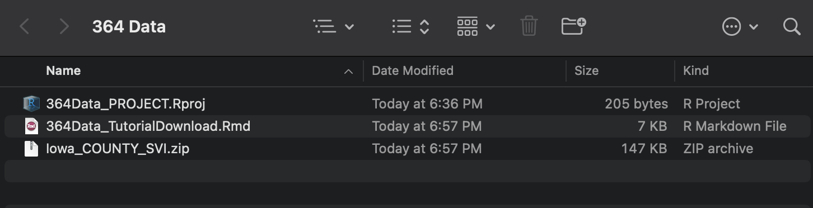

<br>

You can unzip the file this using this command, or double click on the zip file on your computer.


```r
unzip("Iowa_COUNTY_SVI.zip")
```

This should unzip all the files into your project folder. Note that the file-names might be different to the zipfile name!

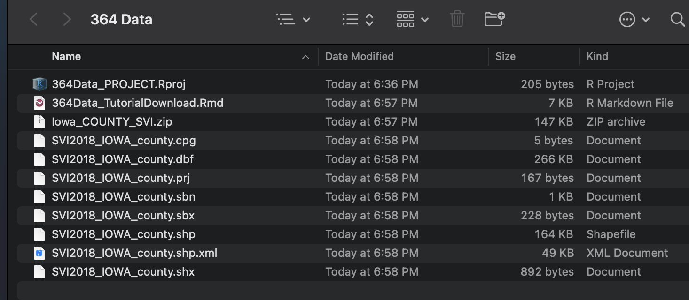

<br>

<p class="comment">

Sometimes this will unzip these into a sub-folder. You can deal with this, but it is easier to just move ALL the sub-files into the main project folder.

</p>

<br><br>

### Opening a Shapefile

Make sure that `library(sp)` and `library(sf)` are in your library code chunk at the top.

The command to read in any shapefile is `st_read()` from the sf library. Set it to read in the .shp extension. You should see something like this, but remember that you can suppress output using message=FALSE,warning=FALSE and results=FALSE at the top of the code chunk.


```r
# Note the .shp extension 
# and that the filename is different to the zip file name!
SVI_county.sf <- st_read("SVI2018_IOWA_county.shp")
```

```
## Reading layer `SVI2018_IOWA_county' from data source 
##   `/Users/hlg5155/Dropbox/My Mac (E2-GEO-WKML011)/Documents/GitHub/Teaching/Geog364-2021/SVI2018_IOWA_county.shp' 
##   using driver `ESRI Shapefile'
## Simple feature collection with 99 features and 125 fields
## Geometry type: POLYGON
## Dimension:     XY
## Bounding box:  xmin: -96.6397 ymin: 40.3755 xmax: -90.14006 ymax: 43.5012
## Geodetic CRS:  NAD83
```

```r
# and change to a map projection of your choice. I am choosing UTM Iowa
SVI_county.sf <- st_transform(SVI_county.sf,3744)
```

<br>

To check it worked, click on the name of the variable in the environment tab and plot the geometry


```r
#Remember st_geometry removes the marks.
plot(st_geometry(SVI_county.sf))
```

<!-- -->

<br><br>

### Troubleshooting

Sometimes you will get this error.

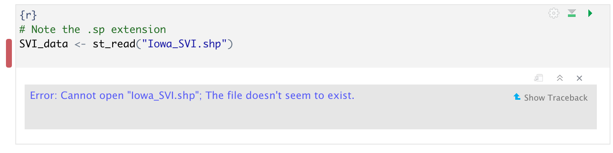

<br>

This means that it can't find the file. There are three common reasons for this.

1.  You didn't create a project, or open you didn't open R-studio by double clicking your project file. If you have no idea what I mean, see [Tutorial 2C](https://psu-spatial.github.io/Geog364-2021/pg_Tut2_startup.html#Tutorial_2C:_Create_an_R-Project).
2.  You unzipped your shape-file into a different place. You should be able to see them next to your code in your files tab with zero sub-folders.
3.  You mis-typed the file-name. It is case sensitive and requires the .shp at the end.

Let's see what I did wrong. Here is my screen. You can see that I am running my R-project correctly (red circles) and I have unzipped all my files correctly. But! I got the wrong file name.


## Raster data (geotifs, netcdf)

Put the raster in your project folder.  This is likely a geotif (.tif) or a NetCDF file (.nc).

Read in the data using the raster command


```r
WhatYouWantToCallYourVariable <- raster('FILENAME.tif')
```

If your data is numeric, to extract for your points/polygons follow the tutorial in elevation

If your data is categorical, to extract for your points/polygons, follow the tutorial for landcover.


<br><br>

## Borders

### Country, State borders

There are many ways of doing this, see [Tutorial 11](https://psu-spatial.github.io/Geog364-2021/pg_Tut11_spatial101.html#c_Using_RNaturalEarth_built-in_vector_datasets) for more detail.

I am going to use the `rnaturalearth` package. Make sure `library(rnaturalearth)` is in  your library code chunk at the top.


```r
# world borders, read in 
border.country.world.sf <- ne_countries(returnclass = "sf")

# US States
border.state.USA.sf  <-  ne_states(country="united states of america",returnclass = "sf")

# Make a plot to check
plot(st_geometry(border.country.world.sf),border="red")
plot(st_geometry(border.state.USA.sf),col="light blue",add=TRUE)
```

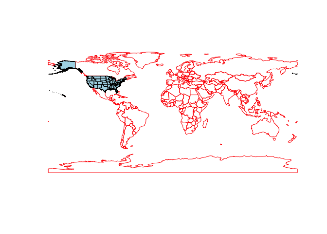<!-- -->


```r
# change projection so the maps overlay just over the Iowa area
border.state.USA.sf  <-  st_transform(border.state.USA.sf,3744)

plot(st_geometry(IA_farmersmarket.sf),col=rgb(0,0,0,.5),pch=16)
plot(st_geometry(border.state.USA.sf),border="red",add=TRUE)
```

<!-- -->
### rworldmap

There is also rworldmap that I haven't explored yet.


```r
#library(rworldmap)  
#lines(getMap(resolution = "high"), lwd=2)   
```

### Counties and census tracts borders

This is often easist to do by using `get_acs` (see below), but if you really want borders, then the `USAboundaries()` package is your best bet.


```r
border.county.IA.sf <- us_counties(states="Iowa")
border.county.IA.sf  <-  st_transform(border.county.IA.sf,3744)

plot(st_geometry(IA_farmersmarket.sf),col=rgb(0,0,0,.5),pch=16)
plot(st_geometry(border.state.USA.sf),add=TRUE,border="red")
plot(st_geometry(border.county.IA.sf),add=TRUE,border="blue")
```

<!-- -->


### Coastlines and reef data

For those doing coastline projects, you can also download coastline and reef data using rnaturalearth


```r
coast.world.sf <- ne_coastline(returnclass = "sf")
reefs.world.sf <- ne_download( scale = 'large', category="physical", type = 'reefs' ,returnclass = "sf")

plot(st_geometry(reefs.world.sf),col="blue")
plot(st_geometry(coast.world.sf),add=TRUE)
```

<!-- -->


## US Census data

### The get_acs command

Make sure `library(tidycensus)` , `library(units)` ,`library(sp)` , `library(sf)` and `library(tmap)` are loaded in your library code chunk.

This is useful for population density!

There are full tutorials in [Tutorial 6Ce](https://psu-spatial.github.io/Geog364-2021/pg_Tut2_startup.html#Tutorial_2C:_Create_an_R-Project) and in [Lab 7](https://psu-spatial.github.io/Geog364-2021/pg_364Lab7_Regression_2021.html#Download_the_data_from_ACS).

Here is all of the code together:


```r
# Download some data for Iowa using get_acs
ACS_county.sf <- get_acs(geography = "county", 
                         year = 2019,
                         variables = c(housevalue       = "B25075_001",  # house value
                                       total_pop        = "B05012_001",  # total population
                                       total_house      = "B25001_001",  # total housing units  
                                       med.income       = "B19013_001"), # median income  
                         state = c("IA"),
                         survey = "acs5",geometry=TRUE,
                         output = "wide")

# Change the map projection to UTM Iowa
ACS_county.sf <- st_transform(ACS_county.sf,3744)

# Get the areas
ACS_county.sf$County.areaE <- st_area(ACS_county.sf)

# Change the units of the areas from metres squared to km squared and overwrite
ACS_county.sf$County.areaE <- set_units(ACS_county.sf$County.areaE,"km^2")

# and divide the total population by the area
ACS_county.sf$PopulationDensityE <-ACS_county.sf$total_popE /  ACS_county.sf$County.areaE

# check it worked. Iowa is a boring state!
map_totalpop <- qtm(ACS_county.sf,"total_popE")+tm_layout(legend.outside = TRUE)
map_area     <- qtm(ACS_county.sf,"County.areaE")+tm_layout(legend.outside = TRUE)
map_popdens  <- qtm(ACS_county.sf,"PopulationDensityE")+tm_layout(legend.outside = TRUE)
tmap_mode("plot")
suppressWarnings(tmap_arrange(map_totalpop,map_area,map_popdens))
```

<!-- -->

```r
# clean up your workspace, optional but good practice unless you later need this map
rm(map_totalpop); rm(map_area); rm(map_popdens)
```

### Dealing with non-Normal data (e.g. population density)

Population density, wealth and housing density are often very skewed, making the statistics hard. To get around this and to see more detail outside cities, we can take the log and save as a new column.   For example


```r
ACS_county.sf$Log_PopulationDensityE <- log(ACS_county.sf$PopulationDensityE)
```

Comparing histograms


```r
par(mfrow=c(1,2))
hist(ACS_county.sf$PopulationDensityE,
     main=list("Population Density",cex=.7),xlab=list("Population Density",cex=.7))

hist(ACS_county.sf$Log_PopulationDensityE,
     main=list("Log Population Density per Km^2",cex=.7),xlab=list("log Population Density per Km^2",cex=.7))
```

<!-- -->

Comparing maps


```r
map_popdens    <- qtm(ACS_county.sf,"PopulationDensityE",fill.palette="RdPu")+
                      tm_layout(legend.outside = TRUE)

map_logpopdens <- qtm(ACS_county.sf,"Log_PopulationDensityE",fill.palette="RdPu")+
                      tm_layout(legend.outside = TRUE)

tmap_arrange(map_popdens,map_logpopdens)
```

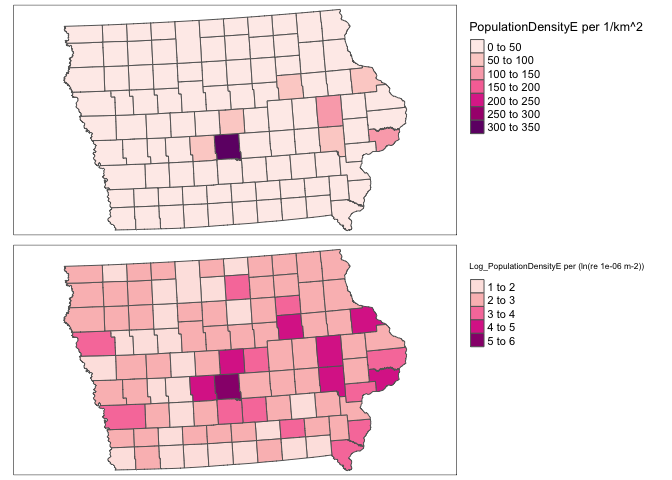<!-- -->


### Extracting Census data at point locations

See the project tutorial: 

 - https://psu-spatial.github.io/Geog364-2021/364Data_TutorialWranglePoint.html#Extracting_point_values_from_polygons
 


## Elevation data

### Downloading the data

Make sure that `library(elevatr)` and `library(raster)` are in your library code chunk at the top.

The `elevatr` package will allow you to download elevation data for a spatial area of your choice. It might  break on the cloud. If so, let Dr G know - she can download you a subset.

Here we can extract elevation data just for the area we care about.  E.g. here, I will extract for my farmers market data and my county SVI data.

REMEMBER TO PUT results=FALSE IN YOUR CODE CHUNK OPTIONS HERE.


```r
# YOU WILL ONLY NEED ONE OF THESE

# Here I downloaded elevation for the border of my SVI data 
elevation.raster_SVI <- elevatr::get_elev_raster(SVI_county.sf, z = 5,clip="locations")


# here I downloaded elevation for the area around my farmers markets (R doesn't understand this is Iowa!)
elevation.raster_farm <- elevatr::get_elev_raster(IA_farmersmarket.sf, z = 5,clip="locations")


# here I downloaded it for the border of Iowa itself using my counties
elevation.raster_IA <- elevatr::get_elev_raster(border.county.IA.sf, z = 5,clip="locations")


# here I created a long/lat box
Lonbox <- c(-93,-93  ,-95,-95)
Latbox <- c( 41, 41.5, 41, 41.5)
box_LongLat <- data.frame(Lon=Lonbox,Lat=Latbox)
box_LongLat.sf  <- st_as_sf(box_LongLat,coords=c("Lon","Lat"),crs=4326)
box_LongLat.sf  <- st_transform(box_LongLat.sf,3744)

elevation.raster_box <- elevatr::get_elev_raster(box_LongLat.sf, z = 5,clip="bbox")
```

Note when I plot, the results look like they are on a globe because of the UTM map projection.


```r
# set up a 2x3 grid of plots
par(mfrow=c(2,2))

# plot 1
plot(elevation.raster_SVI)
plot(st_geometry(SVI_county.sf),add=TRUE)

# plot 2
plot(elevation.raster_farm)
plot(st_geometry(IA_farmersmarket.sf),add=TRUE)
plot(st_geometry(border.state.USA.sf),add=TRUE)

# plot 3
plot(elevation.raster_IA)
plot(st_geometry(border.county.IA.sf),add=TRUE)

# plot 4
plot(elevation.raster_box)
plot(st_geometry(border.county.IA.sf),add=TRUE)
```

<!-- -->


### Adding elevation data to your datasets

Make sure that  `library(exactextractr)` and `library(raster)` are in your library code chunk at the top.

We can simply use this package to extract the value at our locations - I'm choosing the average over the polygon. To extract


```r
# add to polygon data
SVI_county.sf$Elevation_extracted <- exact_extract(elevation.raster_SVI,SVI_county.sf,"mean")
```

For point data, we choose simply the extract function.


```r
# add to point data
IA_farmersmarket.sf$Elevation_extracted <- raster::extract(elevation.raster_farm,IA_farmersmarket.sf)
```

Click on the name of your dataset, you will see there is a new column called elevation. 
Here is what we have done


```r
# plot 1
map1 <- qtm(elevation.raster_SVI)+tm_layout(legend.outside = TRUE)
map2 <- qtm(SVI_county.sf,"Elevation_extracted")+tm_layout(legend.outside = TRUE)
map3 <- qtm(elevation.raster_farm)+tm_layout(legend.outside = TRUE)

map4 <- qtm(IA_farmersmarket.sf,dots.col="Elevation_extracted")+
        tm_shape(border.county.IA.sf)+tm_polygons(alpha=0)+
        tm_layout(legend.outside = TRUE)

tmap_arrange(map1,map2,map3,map4)
```

<!-- -->

```r
rm(map1);rm(map2);rm(map3);rm(map4)
```

## Land Cover, forest canopy or concrete

(contributed by Susan)

We can download land cover data from the National Land Cover Database (NLCD) (<https://www.mrlc.gov/>) using the FedData package. This package allows you to download other federal data as well including elevation, soil data from the SSURGO soil database, Daymet weather data, USDA cropland layers, hydrography, etc. See this link (<https://github.com/ropensci/FedData>) for more information about what data you can obtain using the FedData package. This link has example code for downloading all these data.

First we need to install the '**FedData**' package.  We do this the same way as for the high res data packages.  Run this code IN YOUR CONSOLE.


```r
remotes::install_github("ropensci/FedData")
```

Now make sure that these packages are in the code chunk at the top of your script.


```r
library(FedData)
library(sf)
library(sp)
library(USAboundaries)
library(raster)
```

Just like elevation or any other raster, we can download just for the area of our study.  See below for our Iowa example. You would simply replace with your own sf data and nickname.

If you want forest canopy or concrete areas see the get_nlcd helpfile.

First, let's look at what the data means


```r
landcover_legend <- nlcd_colors()
landcover_legend
```

```
## # A tibble: 20 × 4
##       ID Class                        Color   Description                       
##    <dbl> <chr>                        <chr>   <chr>                             
##  1    11 Open Water                   #5475A8 Areas of open water, generally wi…
##  2    12 Perennial Ice/Snow           #FFFFFF Areas characterized by a perennia…
##  3    21 Developed, Open Space        #E8D1D1 Areas with a mixture of some cons…
##  4    22 Developed, Low Intensity     #E29E8C Areas with a mixture of construct…
##  5    23 Developed, Medium Intensity  #ff0000 Areas with a mixture of construct…
##  6    24 Developed High Intensity     #B50000 Highly developed areas where peop…
##  7    31 Barren Land (Rock/Sand/Clay) #D2CDC0 Areas of bedrock, desert pavement…
##  8    41 Deciduous Forest             #85C77E Areas dominated by trees generall…
##  9    42 Evergreen Forest             #38814E Areas dominated by trees generall…
## 10    43 Mixed Forest                 #D4E7B0 Areas dominated by trees generall…
## 11    51 Dwarf Scrub                  #AF963C Alaska only areas dominated by sh…
## 12    52 Shrub/Scrub                  #DCCA8F Areas dominated by shrubs; less t…
## 13    71 Grassland/Herbaceous         #FDE9AA Areas dominated by gramanoid or h…
## 14    72 Sedge/Herbaceous             #D1D182 Alaska only areas dominated by se…
## 15    73 Lichens                      #A3CC51 Alaska only areas dominated by fr…
## 16    74 Moss                         #82BA9E Alaska only areas dominated by mo…
## 17    81 Pasture/Hay                  #FBF65D Areas of grasses, legumes, or gra…
## 18    82 Cultivated Crops             #CA9146 Areas used for the production of …
## 19    90 Woody Wetlands               #C8E6F8 Areas where forest or shrubland v…
## 20    95 Emergent Herbaceous Wetlands #64B3D5 Areas where perennial herbaceous …
```


```r
# THIS TAKE A LONG TIME TO RUN!  
# IT WILL CRASH THE CLOUD.  DR G or SUSAN CAN DOWNLOAD IT FOR YOU

# Here I downloaded land cover for the border of my SVI data. You can choose the nickname
NLCD_SVI <- get_nlcd(template = SVI_county.sf,year = 2011,label = "Iowa SVI landcover")


# here I downloaded land cover  for the area around my farmers markets (R doesn't understand this is Iowa!)
NLCD_farm <- get_nlcd(template = IA_farmersmarket.sf,year = 2011,label = "Iowa farmers landcover")


# here I downloaded land cover  for the border of Iowa itself using my counties
NLCD_IA <- get_nlcd(template = border.county.IA.sf,year = 2011,label = "Iowa  landcover")
```

Because it takes long to download large areas, it is better to save the landcover file to your project folder and load it from there instead of downloading it every time you knit your project.


```r
#Save the landcover dataset to your project folder.
writeRaster(NLCD_IA, 
              filename = "IA_Landcover.tif", 
              format="GTiff", overwrite=TRUE)
```

After you have successfully downloaded and saved the data to you project folder, you can load it into R using the following code. 

If you can load the data successfully, you now do not need any of the above code which is basically for downloading and saving the file. I suggest commenting it out and hiding it in an "include=FALSE, eval-FALSE" code chunk so that you do not lose the code in the event you have to rerun.


```r
IA_Landcover <- raster('IA_Landcover.tif')

tmap_mode("plot")
```

```
## tmap mode set to plotting
```

```r
qtm(IA_Landcover)+tm_layout(legend.outside = TRUE)
```

```
## stars_proxy object shown at 1235 by 811 cells.
```

```
## Warning: Duplicated levels found. They have been omitted
```

```
## Some legend labels were too wide. These labels have been resized to 0.65. Increase legend.width (argument of tm_layout) to make the legend wider and therefore the labels larger.
```

<!-- -->


### Adding land cover data to your points dataset

Make sure that  `library(raster)` is in your library code chunk at the top.

For point data, we choose simply the extract function.  Here I also added in the key - because the number isn't very informative.


```r
#--------------------------------------------------------------
# Turn everything to the same map projection
#--------------------------------------------------------------
IA_farmersmarket.sf  <-  st_transform(IA_farmersmarket.sf,crs(IA_Landcover))

#--------------------------------------------------------------
# add to point data
#--------------------------------------------------------------
IA_farmersmarket.sf$LandcoverNumber <- raster::extract(IA_Landcover,
                                                       IA_farmersmarket.sf)
IA_farmersmarket.sf$LandcoverNumber <- as.factor(IA_farmersmarket.sf$LandcoverNumber)

#--------------------------------------------------------------
# for the landcover data specifically, this might be better
#--------------------------------------------------------------
key <- nlcd_colors()[,c("ID","Class")]
names(key) <- c("LandcoverNumber","LandcoverClass")

IA_farmersmarket.sf <- merge(IA_farmersmarket.sf ,key,by="LandcoverNumber",all.x=TRUE,all.y=FALSE)
IA_farmersmarket.sf$LandcoverClass <- as.factor(IA_farmersmarket.sf$LandcoverClass )
```


```r
map1 <- qtm(IA_Landcover)+tm_layout(legend.outside = TRUE)

map2 <- qtm(IA_farmersmarket.sf,dots.col="LandcoverClass",dots.size=.1)+
        tm_shape(border.county.IA.sf)+tm_polygons(alpha=0)+
        tm_layout(legend.outside = TRUE)

tmap_arrange(map1,map2)
```

```
## stars_proxy object shown at 1235 by 811 cells.
```

```
## Warning: Duplicated levels found. They have been omitted
```

```
## stars_proxy object shown at 1235 by 811 cells.
```

```
## Warning: Duplicated levels found. They have been omitted
```

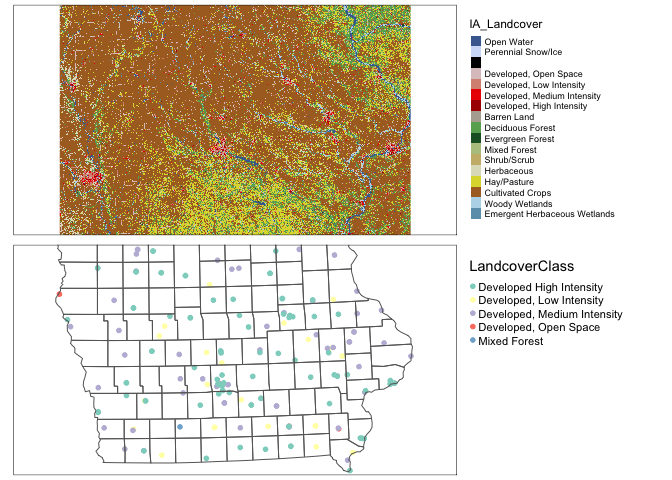<!-- -->

```r
rm(map1);rm(map2)
```

### Adding land cover data to your polygons dataset

For polygons it's even more complex because the "mean" landcover doesn't make sense!  I guess in that we want to choose the land-cover with the greatest area in your county.


```r
# This is taking the most common value in each polygon
# add to polygon data
extractedvalues <- data.frame(ID=exact_extract(NLCD_SVI,SVI_county.sf,fun="majority"))

# add in codes
Newvalues <- merge(extractedvalues,nlcd_colors(),by="ID",all.x=TRUE,all.y=FALSE)

# and extract the codes
SVI_county.sf$Majority_LandcoverClass <- as.factor(Newvalues$Class)
```


```r
map1 <- qtm(IA_Landcover)+tm_layout(legend.outside = TRUE)

map2 <- qtm(SVI_county.sf,"Majority_LandcoverClass")+
        tm_shape(border.county.IA.sf)+tm_polygons(alpha=0)+
        tm_layout(legend.outside = TRUE)

tmap_arrange(map1,map2,nrow=2)
```

```
## stars_proxy object shown at 1235 by 811 cells.
```

```
## Warning: Duplicated levels found. They have been omitted
```

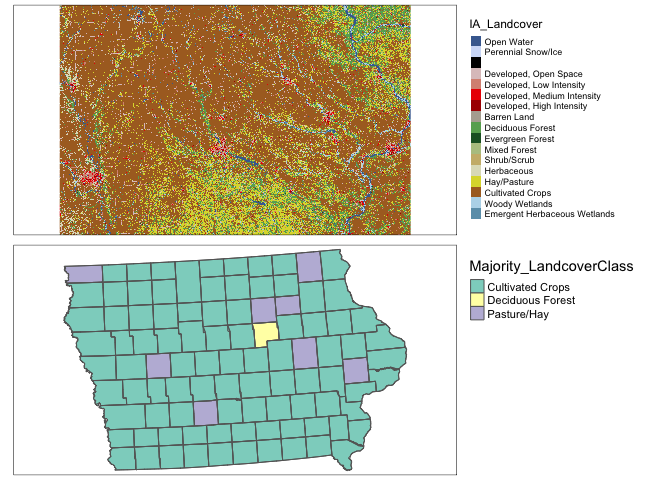<!-- -->

```r
rm(map1);rm(map2)
```


## Weather data

### WorldClim Temperature, Rainfall

We can get weather data from worldclim.  There is an excellent tutorial here: https://bedatablog.netlify.app/post/download-and-illustrate-current-and-projected-climate-in-r/

Make sure that`library(raster)` is in your library code chunk at the top. 

See here for details: https://www.worldclim.org/data/worldclim21.html or look at  `?raster::getData`.  Valid variables names are 

 - 'tmin': Monthly minimum temperature
 - 'tmax': Monthly maximum temperature
 - 'prec': Monthly rainfall
 - and 'bio' (https://www.worldclim.org/data/bioclim.html), which downloads a list of:
    + BIO1 = Annual Mean Temperature
    + BIO2 = Mean Diurnal Range (Mean of monthly (max temp - min temp))
    + BIO3 = Isothermality (BIO2/BIO7) (×100)
    + BIO4 = Temperature Seasonality (standard deviation ×100)
    + BIO5 = Max Temperature of Warmest Month
    + BIO6 = Min Temperature of Coldest Month
    + BIO7 = Temperature Annual Range (BIO5-BIO6)
    + BIO8 = Mean Temperature of Wettest Quarter
    + BIO9 = Mean Temperature of Driest Quarter
    + BIO10 = Mean Temperature of Warmest Quarter
    + BIO11 = Mean Temperature of Coldest Quarter
    + BIO12 = Annual Precipitation
    + BIO13 = Precipitation of Wettest Month
    + BIO14 = Precipitation of Driest Month
    + BIO15 = Precipitation Seasonality (Coefficient of Variation)
    + BIO16 = Precipitation of Wettest Quarter
    + BIO17 = Precipitation of Driest Quarter
    + BIO18 = Precipitation of Warmest Quarter
    + BIO19 = Precipitation of Coldest Quarter

#### Downloading WorldClim data

OPTION1: Download the data separately from https://www.worldclim.org/data/worldclim21.html, save it to your Project folder, then read it in using the `raster()` command.

OPTION2: We can automatically download the data to your computer using `raster::getData` .  You can also download monthly historical weather data or future climate model output - see the getData helpfile for those.  I am choosing to just look at the bioclim averages.

Remember to add results = FALSE in your code chunk options


```r
# THIS IS 123 MEGABYTES!  If that is too big for your computer, tell Dr Greatrex and she will subset for you.
worldclim.BIO <- raster::getData(name = 'worldclim', var = 'bio', res = 2.5)
```

To choose an individual BIO variable (see the list above), we use double [[ ]]


```r
#------------------------------------------------
# Average annual temp
#------------------------------------------------
worldclim.Annual.Mean.Temperature <- worldclim.BIO$bio1
# For some reason Temperature is  stored in degrees C *10 , so
worldclim.Annual.Mean.Temperature <- worldclim.Annual.Mean.Temperature/10

#------------------------------------------------
# Rain see above for the codes
#----------------------------------------------
worldclim.Annual.Mean.Rain <- worldclim.BIO$bio12
```


```r
# change the projection of the coastline data to match
coast.world.sf <- st_transform(coast.world.sf,crs(worldclim.Annual.Mean.Rain))

# Tmap hatesr
plot(worldclim.Annual.Mean.Rain,
     col = RColorBrewer::brewer.pal(9, "Blues"),
     main="Annual total rainfall")
plot(st_geometry(coast.world.sf),add=TRUE)
```

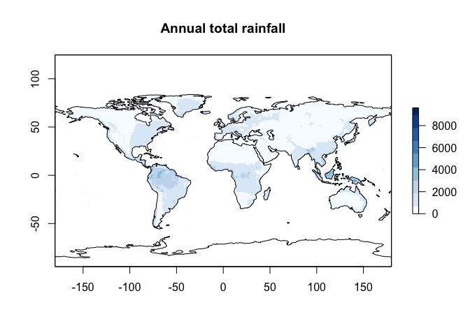<!-- -->

```r
plot(worldclim.Annual.Mean.Temperature,
     col = RColorBrewer::brewer.pal(9, "Reds"),
     main="Historical mean temperature")
plot(st_geometry(coast.world.sf),add=TRUE)
```

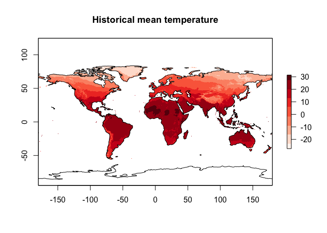<!-- -->

#### Adding WorldClim to your datasets

This is exactly the same as for your elevation data.   Make sure that `library(exactextractr)` and `library(raster)` are in your library code chunk at the top.

We can simply use this package to extract the value at our locations - I'm choosing the average over the polygon. To extract


```r
# change projections to match
SVI_county.sf <- st_transform(SVI_county.sf,4326)


# add to polygon data
SVI_county.sf$AnnualRain <- exact_extract(worldclim.Annual.Mean.Rain,
                                          SVI_county.sf,"mean")

SVI_county.sf$AnnualMean_temp <- exact_extract(worldclim.Annual.Mean.Temperature,
                                               SVI_county.sf,"mean")

# change projection back
SVI_county.sf <- st_transform(SVI_county.sf,3744)
```

For point data, we choose simply the extract function.


```r
# change projection
IA_farmersmarket.sf <- st_transform(IA_farmersmarket.sf,4326)


# add to point data
IA_farmersmarket.sf$AnnualRain <- raster::extract(worldclim.Annual.Mean.Rain,
                                                  IA_farmersmarket.sf)


IA_farmersmarket.sf$AnnualMean_temp <- raster::extract(worldclim.Annual.Mean.Temperature,IA_farmersmarket.sf)

# change projection back
IA_farmersmarket.sf <- st_transform(IA_farmersmarket.sf,3744)
```


Click on the name of your dataset, you will see there is a new column called AnnualRain and AnnualMean_temp. Here is what we have done


```r
# plot 1
map1 <- qtm(SVI_county.sf,"AnnualRain",fill.palette="Blues")+tm_layout(legend.outside = TRUE)

map2 <- qtm(IA_farmersmarket.sf,dots.col="AnnualRain",dots.size=.2,dots.palette="Blues")+
        tm_shape(border.county.IA.sf)+
             tm_polygons(alpha=0)+
        tm_layout(legend.outside = TRUE)

tmap_arrange(map1,map2)
```

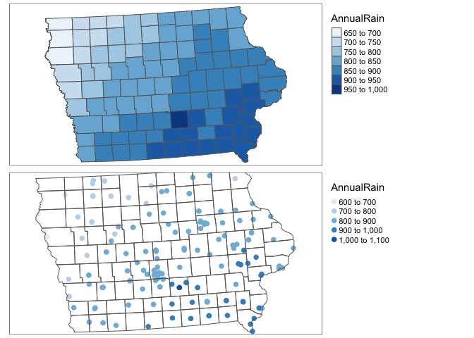<!-- -->

```r
rm(map1);rm(map2)
```


```r
# plot 1
map1 <- qtm(SVI_county.sf,"AnnualMean_temp",fill.palette="OrRd")+tm_layout(legend.outside = TRUE)

map2 <- qtm(IA_farmersmarket.sf,dots.col="AnnualMean_temp",dots.size=.2,dots.palette="OrRd")+
        tm_shape(border.county.IA.sf)+
             tm_polygons(alpha=0)+
        tm_layout(legend.outside = TRUE)

tmap_arrange(map1,map2)
```

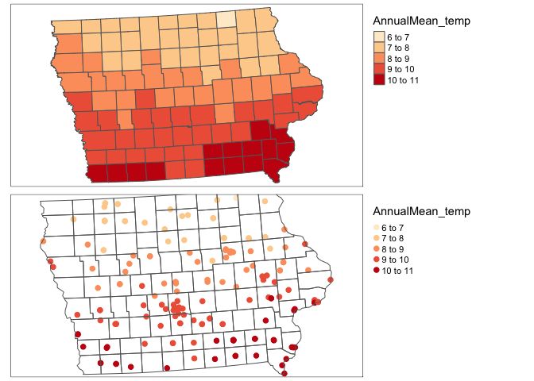<!-- -->

```r
rm(map1);rm(map2)
```

### Maximum Windspeed

You will need to install the `rWind` package (note the capital W) and the `lubridate`.  Here is a wonderful tutorial

https://www.r-bloggers.com/2018/11/plotting-wind-highways-using-rwind/

Remember to put results=FALSE in the code chunk options.


```r
 library(rWind)  
 library(lubridate)  
```

```
## 
## Attaching package: 'lubridate'
```

```
## The following objects are masked from 'package:raster':
## 
##     intersect, union
```

```
## The following objects are masked from 'package:base':
## 
##     date, intersect, setdiff, union
```

```r
 library(dplyr)  
```

```
## 
## Attaching package: 'dplyr'
```

```
## The following objects are masked from 'package:raster':
## 
##     intersect, select, union
```

```
## The following objects are masked from 'package:stats':
## 
##     filter, lag
```

```
## The following objects are masked from 'package:base':
## 
##     intersect, setdiff, setequal, union
```

```r
# Here, we use ymd_hms from lubridate package to create a sequence of dates  
# Given this is just a class project, 
# JUST CHOOSE 1 MONTH
startdate <- ymd_hms(paste(2018,6,1,12,00,00, sep="-"))
enddate <- ymd_hms(paste(2018,6,30,12,00,00, sep="-"))
TimeSeries <- seq(startdate, enddate,by="1 days")  

# This is my box over the Eastern US Coast
Windspeed <- wind.dl_2(TimeSeries,-76,-64,35,45)  

# Tidy the data
tidy_Windspeed <- tidy(Windspeed)  

max_Windspeed <- tidy_Windspeed %>% 
                     dplyr::group_by(lat, lon) %>%
                     dplyr::summarise(speed = max(speed))  
```

```
## `summarise()` has grouped output by 'lat'. You can override using the `.groups` argument.
```

```r
max_Windspeed <- cbind(max_Windspeed$lon, 
                       max_Windspeed$lat, 
                       max_Windspeed$speed)  


max_Windspeed.raster <- rasterFromXYZ(max_Windspeed)  
acol <- colorRampPalette(c("white", "blue", "darkblue"))  

plot(max_Windspeed.raster, col=acol(1000),
     main= "Maximum wind speed reported",  
     xlab="Longitude", ylab="Lattitude")  
plot(st_geometry(coast.world.sf),add=TRUE)
```

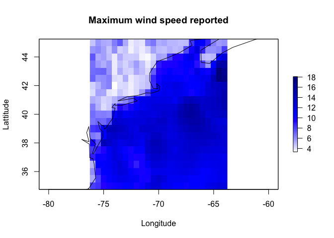<!-- -->

and let's extract for our points.  I'm just going to make a random set of points


```r
RandomData <- data.frame(x=rnorm(20,mean=-70,sd=2),
                         y=rnorm(20,mean=40,sd=2))
RandomData.sf <- st_as_sf(RandomData,coords=c("x","y"),crs=4326)


plot(max_Windspeed.raster, col=acol(1000),
     main= "Maximum wind speed reported",  
     xlab="Longitude", ylab="Lattitude")  
plot(st_geometry(coast.world.sf),add=TRUE)
plot(st_geometry(RandomData.sf),col="yellow",add=TRUE,pch=4,lwd=2)
```

<!-- -->


```r
RandomData.sf$Wind <- raster::extract(max_Windspeed.raster,RandomData.sf)

tmap_mode("view")
```

```
## tmap mode set to interactive viewing
```

```r
qtm(RandomData.sf,dots.col="Wind",dots.size=.2)
```

```{=html}
<div id="htmlwidget-1f3235716b68d34c04a8" style="width:672px;height:480px;" class="leaflet html-widget"></div>
<script type="application/json" data-for="htmlwidget-1f3235716b68d34c04a8">{"x":{"options":{"crs":{"crsClass":"L.CRS.EPSG3857","code":null,"proj4def":null,"projectedBounds":null,"options":{}}},"calls":[{"method":"createMapPane","args":["tmap401",401]},{"method":"createMapPane","args":["tmap402",402]},{"method":"addProviderTiles","args":["Esri.WorldGrayCanvas",null,"Esri.WorldGrayCanvas",{"minZoom":0,"maxZoom":18,"tileSize":256,"subdomains":"abc","errorTileUrl":"","tms":false,"noWrap":false,"zoomOffset":0,"zoomReverse":false,"opacity":1,"zIndex":1,"detectRetina":false,"pane":"tilePane"}]},{"method":"addProviderTiles","args":["OpenStreetMap",null,"OpenStreetMap",{"minZoom":0,"maxZoom":18,"tileSize":256,"subdomains":"abc","errorTileUrl":"","tms":false,"noWrap":false,"zoomOffset":0,"zoomReverse":false,"opacity":1,"zIndex":1,"detectRetina":false,"pane":"tilePane"}]},{"method":"addProviderTiles","args":["Esri.WorldTopoMap",null,"Esri.WorldTopoMap",{"minZoom":0,"maxZoom":18,"tileSize":256,"subdomains":"abc","errorTileUrl":"","tms":false,"noWrap":false,"zoomOffset":0,"zoomReverse":false,"opacity":1,"zIndex":1,"detectRetina":false,"pane":"tilePane"}]},{"method":"addCircleMarkers","args":[[39.4790254801636,39.7296328636504,40.3280823535367,38.6412622715383,42.1983399060426,37.761119304357,40.1545750686959,40.4092278935244,37.2281385270572,39.6619042251068,42.3294845456937,39.1352340373186,35.4161930119522,38.8142968778074,42.2934182739269,40.1860940592031,39.7030436516005,41.0152987703585,37.7715734690895,41.4755887318861],[-69.5769446791495,-68.682696000812,-71.8219912737775,-70.6320330817008,-67.9452248621419,-64.6624678699745,-66.5124071477396,-67.9706512247933,-66.5316587156091,-71.5724609328206,-71.7134446348522,-68.621130850929,-71.2422058241165,-71.1855831887571,-72.3776389033559,-67.0615735270792,-70.7416875914373,-67.4875600475456,-66.9074777968343,-69.5975760264569],[8.94427190999916,8.94427190999916,8.94427190999916,8.94427190999916,8.94427190999916,8.94427190999916,8.94427190999916,8.94427190999916,8.94427190999916,8.94427190999916,8.94427190999916,8.94427190999916,8.94427190999916,8.94427190999916,8.94427190999916,8.94427190999916,8.94427190999916,8.94427190999916,8.94427190999916,8.94427190999916],["X13.5412267547793","X13.0590673925674","X10.560503075157","X13.6950379219476","X11.8512813114276","X12.936054420795","X15.3796254038782","X14.2058031482052","X12.4497122316584","X12.398551824687","X4.41304522186146","X12.7183963888384","X9.85099290599667","X13.2540079757516","X3.78679658977767","X15.8421406926449","X13.0738736076326","X14.0452607382546","X13.3204270068049","X11.6447505871378"],"RandomData.sf",{"interactive":true,"className":"","pane":"tmap401","stroke":true,"color":"#666666","weight":1,"opacity":0.5,"fill":true,"fillColor":["#C74A02","#C74A02","#EC7114","#C74A02","#EC7114","#C74A02","#8E3004","#8E3004","#C74A02","#C74A02","#FEECA5","#C74A02","#FEA332","#C74A02","#FFFBD4","#8E3004","#C74A02","#8E3004","#C74A02","#EC7114"],"fillOpacity":[1,1,1,1,1,1,1,1,1,1,1,1,1,1,1,1,1,1,1,1]},null,null,["<style> div.leaflet-popup-content {width:auto !important;overflow-y:auto; overflow-x:hidden;}<\/style><div style=\"max-height:25em;padding-right:0px;\"><table>\n\t\t\t   <thead><tr><th colspan=\"2\"><b>13.5412267547793<\/b><\/th><\/thead><\/tr><tr><td style=\"color: #888888;\"><nobr>Wind<\/nobr><\/td><td align=\"right\"><nobr>13.54<\/nobr><\/td><\/tr><\/table><\/div>","<style> div.leaflet-popup-content {width:auto !important;overflow-y:auto; overflow-x:hidden;}<\/style><div style=\"max-height:25em;padding-right:0px;\"><table>\n\t\t\t   <thead><tr><th colspan=\"2\"><b>13.0590673925674<\/b><\/th><\/thead><\/tr><tr><td style=\"color: #888888;\"><nobr>Wind<\/nobr><\/td><td align=\"right\"><nobr>13.06<\/nobr><\/td><\/tr><\/table><\/div>","<style> div.leaflet-popup-content {width:auto !important;overflow-y:auto; overflow-x:hidden;}<\/style><div style=\"max-height:25em;padding-right:0px;\"><table>\n\t\t\t   <thead><tr><th colspan=\"2\"><b>10.560503075157<\/b><\/th><\/thead><\/tr><tr><td style=\"color: #888888;\"><nobr>Wind<\/nobr><\/td><td align=\"right\"><nobr>10.56<\/nobr><\/td><\/tr><\/table><\/div>","<style> div.leaflet-popup-content {width:auto !important;overflow-y:auto; overflow-x:hidden;}<\/style><div style=\"max-height:25em;padding-right:0px;\"><table>\n\t\t\t   <thead><tr><th colspan=\"2\"><b>13.6950379219476<\/b><\/th><\/thead><\/tr><tr><td style=\"color: #888888;\"><nobr>Wind<\/nobr><\/td><td align=\"right\"><nobr>13.70<\/nobr><\/td><\/tr><\/table><\/div>","<style> div.leaflet-popup-content {width:auto !important;overflow-y:auto; overflow-x:hidden;}<\/style><div style=\"max-height:25em;padding-right:0px;\"><table>\n\t\t\t   <thead><tr><th colspan=\"2\"><b>11.8512813114276<\/b><\/th><\/thead><\/tr><tr><td style=\"color: #888888;\"><nobr>Wind<\/nobr><\/td><td align=\"right\"><nobr>11.85<\/nobr><\/td><\/tr><\/table><\/div>","<style> div.leaflet-popup-content {width:auto !important;overflow-y:auto; overflow-x:hidden;}<\/style><div style=\"max-height:25em;padding-right:0px;\"><table>\n\t\t\t   <thead><tr><th colspan=\"2\"><b>12.936054420795<\/b><\/th><\/thead><\/tr><tr><td style=\"color: #888888;\"><nobr>Wind<\/nobr><\/td><td align=\"right\"><nobr>12.94<\/nobr><\/td><\/tr><\/table><\/div>","<style> div.leaflet-popup-content {width:auto !important;overflow-y:auto; overflow-x:hidden;}<\/style><div style=\"max-height:25em;padding-right:0px;\"><table>\n\t\t\t   <thead><tr><th colspan=\"2\"><b>15.3796254038782<\/b><\/th><\/thead><\/tr><tr><td style=\"color: #888888;\"><nobr>Wind<\/nobr><\/td><td align=\"right\"><nobr>15.38<\/nobr><\/td><\/tr><\/table><\/div>","<style> div.leaflet-popup-content {width:auto !important;overflow-y:auto; overflow-x:hidden;}<\/style><div style=\"max-height:25em;padding-right:0px;\"><table>\n\t\t\t   <thead><tr><th colspan=\"2\"><b>14.2058031482052<\/b><\/th><\/thead><\/tr><tr><td style=\"color: #888888;\"><nobr>Wind<\/nobr><\/td><td align=\"right\"><nobr>14.21<\/nobr><\/td><\/tr><\/table><\/div>","<style> div.leaflet-popup-content {width:auto !important;overflow-y:auto; overflow-x:hidden;}<\/style><div style=\"max-height:25em;padding-right:0px;\"><table>\n\t\t\t   <thead><tr><th colspan=\"2\"><b>12.4497122316584<\/b><\/th><\/thead><\/tr><tr><td style=\"color: #888888;\"><nobr>Wind<\/nobr><\/td><td align=\"right\"><nobr>12.45<\/nobr><\/td><\/tr><\/table><\/div>","<style> div.leaflet-popup-content {width:auto !important;overflow-y:auto; overflow-x:hidden;}<\/style><div style=\"max-height:25em;padding-right:0px;\"><table>\n\t\t\t   <thead><tr><th colspan=\"2\"><b>12.398551824687<\/b><\/th><\/thead><\/tr><tr><td style=\"color: #888888;\"><nobr>Wind<\/nobr><\/td><td align=\"right\"><nobr>12.40<\/nobr><\/td><\/tr><\/table><\/div>","<style> div.leaflet-popup-content {width:auto !important;overflow-y:auto; overflow-x:hidden;}<\/style><div style=\"max-height:25em;padding-right:0px;\"><table>\n\t\t\t   <thead><tr><th colspan=\"2\"><b>4.41304522186146<\/b><\/th><\/thead><\/tr><tr><td style=\"color: #888888;\"><nobr>Wind<\/nobr><\/td><td align=\"right\"><nobr>4.41<\/nobr><\/td><\/tr><\/table><\/div>","<style> div.leaflet-popup-content {width:auto !important;overflow-y:auto; overflow-x:hidden;}<\/style><div style=\"max-height:25em;padding-right:0px;\"><table>\n\t\t\t   <thead><tr><th colspan=\"2\"><b>12.7183963888384<\/b><\/th><\/thead><\/tr><tr><td style=\"color: #888888;\"><nobr>Wind<\/nobr><\/td><td align=\"right\"><nobr>12.72<\/nobr><\/td><\/tr><\/table><\/div>","<style> div.leaflet-popup-content {width:auto !important;overflow-y:auto; overflow-x:hidden;}<\/style><div style=\"max-height:25em;padding-right:0px;\"><table>\n\t\t\t   <thead><tr><th colspan=\"2\"><b>9.85099290599667<\/b><\/th><\/thead><\/tr><tr><td style=\"color: #888888;\"><nobr>Wind<\/nobr><\/td><td align=\"right\"><nobr>9.85<\/nobr><\/td><\/tr><\/table><\/div>","<style> div.leaflet-popup-content {width:auto !important;overflow-y:auto; overflow-x:hidden;}<\/style><div style=\"max-height:25em;padding-right:0px;\"><table>\n\t\t\t   <thead><tr><th colspan=\"2\"><b>13.2540079757516<\/b><\/th><\/thead><\/tr><tr><td style=\"color: #888888;\"><nobr>Wind<\/nobr><\/td><td align=\"right\"><nobr>13.25<\/nobr><\/td><\/tr><\/table><\/div>","<style> div.leaflet-popup-content {width:auto !important;overflow-y:auto; overflow-x:hidden;}<\/style><div style=\"max-height:25em;padding-right:0px;\"><table>\n\t\t\t   <thead><tr><th colspan=\"2\"><b>3.78679658977767<\/b><\/th><\/thead><\/tr><tr><td style=\"color: #888888;\"><nobr>Wind<\/nobr><\/td><td align=\"right\"><nobr>3.79<\/nobr><\/td><\/tr><\/table><\/div>","<style> div.leaflet-popup-content {width:auto !important;overflow-y:auto; overflow-x:hidden;}<\/style><div style=\"max-height:25em;padding-right:0px;\"><table>\n\t\t\t   <thead><tr><th colspan=\"2\"><b>15.8421406926449<\/b><\/th><\/thead><\/tr><tr><td style=\"color: #888888;\"><nobr>Wind<\/nobr><\/td><td align=\"right\"><nobr>15.84<\/nobr><\/td><\/tr><\/table><\/div>","<style> div.leaflet-popup-content {width:auto !important;overflow-y:auto; overflow-x:hidden;}<\/style><div style=\"max-height:25em;padding-right:0px;\"><table>\n\t\t\t   <thead><tr><th colspan=\"2\"><b>13.0738736076326<\/b><\/th><\/thead><\/tr><tr><td style=\"color: #888888;\"><nobr>Wind<\/nobr><\/td><td align=\"right\"><nobr>13.07<\/nobr><\/td><\/tr><\/table><\/div>","<style> div.leaflet-popup-content {width:auto !important;overflow-y:auto; overflow-x:hidden;}<\/style><div style=\"max-height:25em;padding-right:0px;\"><table>\n\t\t\t   <thead><tr><th colspan=\"2\"><b>14.0452607382546<\/b><\/th><\/thead><\/tr><tr><td style=\"color: #888888;\"><nobr>Wind<\/nobr><\/td><td align=\"right\"><nobr>14.05<\/nobr><\/td><\/tr><\/table><\/div>","<style> div.leaflet-popup-content {width:auto !important;overflow-y:auto; overflow-x:hidden;}<\/style><div style=\"max-height:25em;padding-right:0px;\"><table>\n\t\t\t   <thead><tr><th colspan=\"2\"><b>13.3204270068049<\/b><\/th><\/thead><\/tr><tr><td style=\"color: #888888;\"><nobr>Wind<\/nobr><\/td><td align=\"right\"><nobr>13.32<\/nobr><\/td><\/tr><\/table><\/div>","<style> div.leaflet-popup-content {width:auto !important;overflow-y:auto; overflow-x:hidden;}<\/style><div style=\"max-height:25em;padding-right:0px;\"><table>\n\t\t\t   <thead><tr><th colspan=\"2\"><b>11.6447505871378<\/b><\/th><\/thead><\/tr><tr><td style=\"color: #888888;\"><nobr>Wind<\/nobr><\/td><td align=\"right\"><nobr>11.64<\/nobr><\/td><\/tr><\/table><\/div>"],null,["13.5412267547793","13.0590673925674","10.560503075157","13.6950379219476","11.8512813114276","12.936054420795","15.3796254038782","14.2058031482052","12.4497122316584","12.398551824687","4.41304522186146","12.7183963888384","9.85099290599667","13.2540079757516","3.78679658977767","15.8421406926449","13.0738736076326","14.0452607382546","13.3204270068049","11.6447505871378"],{"interactive":false,"permanent":false,"direction":"auto","opacity":1,"offset":[0,0],"textsize":"10px","textOnly":false,"className":"","sticky":true},null]},{"method":"addLegend","args":[{"colors":["#FFFBD4","#FEECA5","#FECF66","#FEA332","#EC7114","#C74A02","#8E3004"],"labels":["2 to 4","4 to 6","6 to 8","8 to 10","10 to 12","12 to 14","14 to 16"],"na_color":null,"na_label":"NA","opacity":1,"position":"topright","type":"unknown","title":"Wind","extra":null,"layerId":"legend401","className":"info legend RandomData.sf","group":"RandomData.sf"}]},{"method":"addLayersControl","args":[["Esri.WorldGrayCanvas","OpenStreetMap","Esri.WorldTopoMap"],"RandomData.sf",{"collapsed":true,"autoZIndex":true,"position":"topleft"}]},{"method":"addScaleBar","args":[{"maxWidth":100,"metric":true,"imperial":false,"updateWhenIdle":true,"position":"bottomright"}]}],"limits":{"lat":[35.4161930119522,42.3294845456937],"lng":[-72.3776389033559,-64.6624678699745]},"fitBounds":[35.4161930119522,-72.3776389033559,42.3294845456937,-64.6624678699745,[]]},"evals":[],"jsHooks":{"render":[{"code":"function(el, x, data) {\n  return (\n      function(el, x, data) {\n      // get the leaflet map\n      var map = this; //HTMLWidgets.find('#' + el.id);\n      // we need a new div element because we have to handle\n      // the mouseover output separately\n      // debugger;\n      function addElement () {\n      // generate new div Element\n      var newDiv = $(document.createElement('div'));\n      // append at end of leaflet htmlwidget container\n      $(el).append(newDiv);\n      //provide ID and style\n      newDiv.addClass('lnlt');\n      newDiv.css({\n      'position': 'relative',\n      'bottomleft':  '0px',\n      'background-color': 'rgba(255, 255, 255, 0.7)',\n      'box-shadow': '0 0 2px #bbb',\n      'background-clip': 'padding-box',\n      'margin': '0',\n      'padding-left': '5px',\n      'color': '#333',\n      'font': '9px/1.5 \"Helvetica Neue\", Arial, Helvetica, sans-serif',\n      'z-index': '700',\n      });\n      return newDiv;\n      }\n\n\n      // check for already existing lnlt class to not duplicate\n      var lnlt = $(el).find('.lnlt');\n\n      if(!lnlt.length) {\n      lnlt = addElement();\n\n      // grab the special div we generated in the beginning\n      // and put the mousmove output there\n\n      map.on('mousemove', function (e) {\n      if (e.originalEvent.ctrlKey) {\n      if (document.querySelector('.lnlt') === null) lnlt = addElement();\n      lnlt.text(\n                           ' lon: ' + (e.latlng.lng).toFixed(5) +\n                           ' | lat: ' + (e.latlng.lat).toFixed(5) +\n                           ' | zoom: ' + map.getZoom() +\n                           ' | x: ' + L.CRS.EPSG3857.project(e.latlng).x.toFixed(0) +\n                           ' | y: ' + L.CRS.EPSG3857.project(e.latlng).y.toFixed(0) +\n                           ' | epsg: 3857 ' +\n                           ' | proj4: +proj=merc +a=6378137 +b=6378137 +lat_ts=0.0 +lon_0=0.0 +x_0=0.0 +y_0=0 +k=1.0 +units=m +nadgrids=@null +no_defs ');\n      } else {\n      if (document.querySelector('.lnlt') === null) lnlt = addElement();\n      lnlt.text(\n                      ' lon: ' + (e.latlng.lng).toFixed(5) +\n                      ' | lat: ' + (e.latlng.lat).toFixed(5) +\n                      ' | zoom: ' + map.getZoom() + ' ');\n      }\n      });\n\n      // remove the lnlt div when mouse leaves map\n      map.on('mouseout', function (e) {\n      var strip = document.querySelector('.lnlt');\n      if( strip !==null) strip.remove();\n      });\n\n      };\n\n      //$(el).keypress(67, function(e) {\n      map.on('preclick', function(e) {\n      if (e.originalEvent.ctrlKey) {\n      if (document.querySelector('.lnlt') === null) lnlt = addElement();\n      lnlt.text(\n                      ' lon: ' + (e.latlng.lng).toFixed(5) +\n                      ' | lat: ' + (e.latlng.lat).toFixed(5) +\n                      ' | zoom: ' + map.getZoom() + ' ');\n      var txt = document.querySelector('.lnlt').textContent;\n      console.log(txt);\n      //txt.innerText.focus();\n      //txt.select();\n      setClipboardText('\"' + txt + '\"');\n      }\n      });\n\n      }\n      ).call(this.getMap(), el, x, data);\n}","data":null}]}}</script>
```

#### Additional data sources

there is a great tutorial here I haven't explored
https://mikejohnson51.github.io/climateR-intro/#98


## OCEANS

### Coastlines

See borders section

### Windspeed

See weather data section.


### Ocean floor depth

A great tutorial here: https://cran.r-project.org/web/packages/marmap/vignettes/marmap-DataAnalysis.pdf

You will need to install the `marmap` library.  Remember to add results = FALSE in the code chunk options


```r
library(marmap)
```

```
## Registered S3 methods overwritten by 'adehabitatMA':
##   method                       from
##   print.SpatialPixelsDataFrame sp  
##   print.SpatialPixels          sp
```

```
## 
## Attaching package: 'marmap'
```

```
## The following object is masked from 'package:raster':
## 
##     as.raster
```

```
## The following object is masked from 'package:grDevices':
## 
##     as.raster
```

```r
# choose your lon/lat box - I chose mine to be just off the Eastern US coastline

oceandepth <- getNOAA.bathy(lon1 = -76, lon2 = -64,
                        lat1 = 35, lat2 = 45, resolution = 10)
```

```
## Querying NOAA database ...
```

```
## This may take seconds to minutes, depending on grid size
```

```
## Building bathy matrix ...
```


```r
# and plot

par(mfrow=c(1,2))

plot(oceandepth, image=TRUE)

plot(oceandepth, image=TRUE, deep=c(-6000,-300,0), 
                             shallow=c(-300,-10,0), 
                             step=c(500,50,0),
                             lwd=c(0.5,0.5,2), 
                             lty=c(1,2,1),
                             drawlabels=c(TRUE,TRUE,FALSE))
```

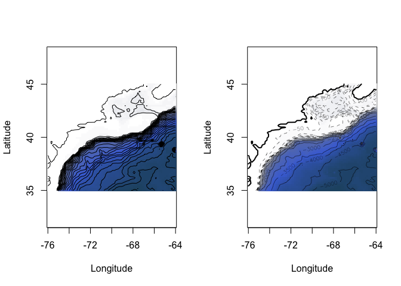<!-- -->

Now let's extract the values at our point locations.  I need some ocean points!  I'm going to use the metallo dataset which shows coral samples over the atlantic.


```r
library(marmap)

# get some data
data("metallo")
coraldata <- metallo 
coraldata.sf <- st_as_sf(coraldata,coords=c("lon","lat"))

# make a box a little bigger than our area. There are more elegant ways of doing this.
lon1 <- sign(extent(coraldata.sf)@xmin)*abs(extent(coraldata.sf)@xmin)-1
lon2 <- sign(extent(coraldata.sf)@xmax)*abs(extent(coraldata.sf)@xmax)+1
lat1 <- sign(extent(coraldata.sf)@ymin)*abs(extent(coraldata.sf)@ymin)-1
lat2 <- sign(extent(coraldata.sf)@ymax)*abs(extent(coraldata.sf)@ymax)+1

oceandepth_coral <- getNOAA.bathy(lon1, lon2, lat1, lat2, resolution = 10)
```

```
## Querying NOAA database ...
```

```
## This may take seconds to minutes, depending on grid size
```

```
## Building bathy matrix ...
```

```r
oceandepth_coral.raster <- as.raster(oceandepth_coral)

coraldata.sf$OceanDepth <- raster::extract(oceandepth_coral.raster,coraldata.sf)


# and plot

map1 <- tm_shape(oceandepth_coral.raster)+tm_raster(palette="Blues") +
  tm_shape(coraldata.sf)+tm_dots(size=.2)

map2 <- qtm(coraldata.sf,dots.col="OceanDepth",dots.palette="Blues",dots.size=.2)

tmap_mode("plot")
```

```
## tmap mode set to plotting
```

```r
tmap_arrange(map1,map2)
```

```
## Warning: Currect projection of shape coraldata.sf unknown. Long-lat (WGS84) is
## assumed.

## Warning: Currect projection of shape coraldata.sf unknown. Long-lat (WGS84) is
## assumed.

## Warning: Currect projection of shape coraldata.sf unknown. Long-lat (WGS84) is
## assumed.

## Warning: Currect projection of shape coraldata.sf unknown. Long-lat (WGS84) is
## assumed.
```

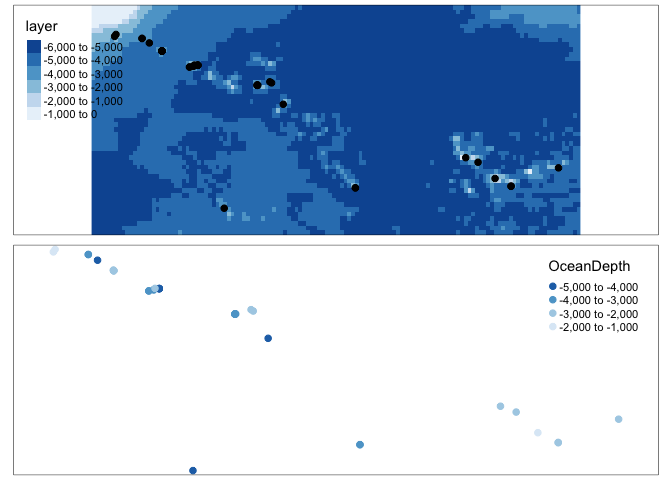<!-- -->

```r
rm(map1);rm(map2)
```


### Sea Surface Temperature Raw

Here's the tutorial. Happy to help folks work through it in labs

https://hansenjohnson.org/post/sst-in-r/


### Sea Surface Temperature CHANGE

Go here and download this dataset (the .nc file) into your project folder https://psl.noaa.gov/data/gridded/data.kaplan_sst.html.


This is a netcdf file and we can read it in using the raster package and the stack command,  It contains the anomaly (e.g. colder/hotter than average for each historical month)


```r
# rotate shifts the long from 0-360 to -180:180
SST_anom <- rotate(stack("sst.mon.anom.nc"))

# change the coastline data (downloaded in borders) to have the same projection
coast.world.sf <- st_transform(coast.world.sf,crs(SST_anom))

#For example make a plot
layer <- 2

plot(SST_anom[[layer]],zlim=c(-2,2),
     col = rev(RColorBrewer::brewer.pal(9, "RdBu")),
     main=names(SST_anom[[layer]]))
plot(st_geometry(coast.world.sf),add=TRUE)
```

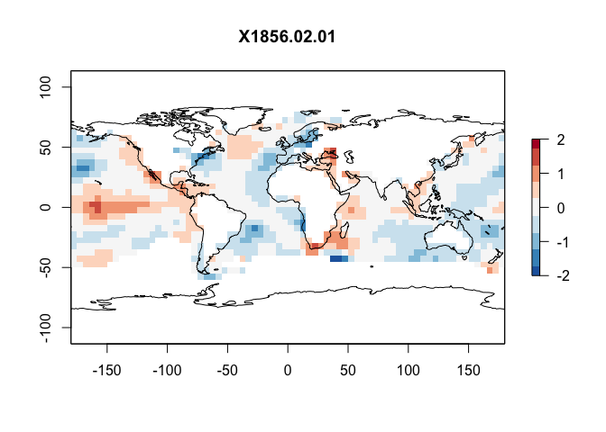<!-- -->

But we want the average change, so we take the mean


```r
meanSST.Change <- mean(SST_anom)


plot(meanSST.Change,zlim=c(-.5,.5),
     col = rev(RColorBrewer::brewer.pal(9, "PiYG")),
     main="Mean SST change")
plot(st_geometry(coast.world.sf),add=TRUE)
```

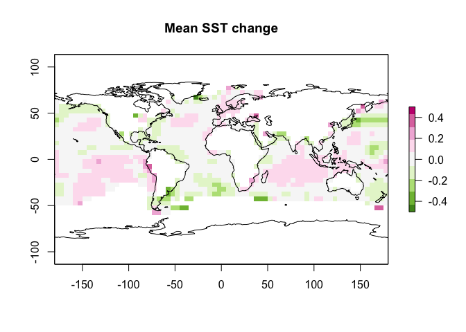<!-- -->

and let's extract for our coral points


```r
coraldata.sf$SSTChange <- raster::extract(meanSST.Change,coraldata.sf)

tmap_mode("view")
```

```
## tmap mode set to interactive viewing
```

```r
qtm(coraldata.sf,dots.col="SSTChange",dots.size=.2,dots.palette="PiYG")
```

```
## Warning: Currect projection of shape coraldata.sf unknown. Long-lat (WGS84) is
## assumed.
```

```
## Variable(s) "SSTChange" contains positive and negative values, so midpoint is set to 0. Set midpoint = NA to show the full spectrum of the color palette.
```

```{=html}
<div id="htmlwidget-dabdf9933eca604e6951" style="width:672px;height:480px;" class="leaflet html-widget"></div>
<script type="application/json" data-for="htmlwidget-dabdf9933eca604e6951">{"x":{"options":{"crs":{"crsClass":"L.CRS.EPSG3857","code":null,"proj4def":null,"projectedBounds":null,"options":{}}},"calls":[{"method":"createMapPane","args":["tmap401",401]},{"method":"createMapPane","args":["tmap402",402]},{"method":"addProviderTiles","args":["Esri.WorldGrayCanvas",null,"Esri.WorldGrayCanvas",{"minZoom":0,"maxZoom":18,"tileSize":256,"subdomains":"abc","errorTileUrl":"","tms":false,"noWrap":false,"zoomOffset":0,"zoomReverse":false,"opacity":1,"zIndex":1,"detectRetina":false,"pane":"tilePane"}]},{"method":"addProviderTiles","args":["OpenStreetMap",null,"OpenStreetMap",{"minZoom":0,"maxZoom":18,"tileSize":256,"subdomains":"abc","errorTileUrl":"","tms":false,"noWrap":false,"zoomOffset":0,"zoomReverse":false,"opacity":1,"zIndex":1,"detectRetina":false,"pane":"tilePane"}]},{"method":"addProviderTiles","args":["Esri.WorldTopoMap",null,"Esri.WorldTopoMap",{"minZoom":0,"maxZoom":18,"tileSize":256,"subdomains":"abc","errorTileUrl":"","tms":false,"noWrap":false,"zoomOffset":0,"zoomReverse":false,"opacity":1,"zIndex":1,"detectRetina":false,"pane":"tilePane"}]},{"method":"addCircleMarkers","args":[[33.7534,34.4802,34.4802,34.5345,34.5435,34.8153,35.1938,35.3935,35.5568,37.4605,38.1348,38.1348,38.1415,38.1463,38.1488,38.2245,38.2632,38.7885,38.7887,38.82,38.82,38.8529,38.8529,38.8529,38.8536,38.8553,38.86,39.3551,39.3551,39.3585,39.3585,39.3585,39.3716,39.6487,39.8079,39.8097,39.8815,39.9517],[-62.5849,-56.7358,-56.7358,-49.7932,-49.7925,-50.5058,-47.6767,-51.2655,-51.8148,-59.9513,-61.1161,-61.1161,-61.0878,-61.1153,-61.1022,-60.474,-60.5502,-64.1304,-64.1318,-63.959,-63.959,-63.7643,-63.7643,-63.7643,-63.7642,-63.7692,-63.9142,-65.3586,-65.3586,-65.3636,-65.3636,-65.3636,-65.3718,-65.9259,-66.25,-66.2492,-67.4735,-67.413],[8.94427190999916,8.94427190999916,8.94427190999916,8.94427190999916,8.94427190999916,8.94427190999916,8.94427190999916,8.94427190999916,8.94427190999916,8.94427190999916,8.94427190999916,8.94427190999916,8.94427190999916,8.94427190999916,8.94427190999916,8.94427190999916,8.94427190999916,8.94427190999916,8.94427190999916,8.94427190999916,8.94427190999916,8.94427190999916,8.94427190999916,8.94427190999916,8.94427190999916,8.94427190999916,8.94427190999916,8.94427190999916,8.94427190999916,8.94427190999916,8.94427190999916,8.94427190999916,8.94427190999916,8.94427190999916,8.94427190999916,8.94427190999916,8.94427190999916,8.94427190999916],["X2263","X2103","X2103.1","X2038","X1541","X1601","X2143","X2135","X1830","X1907","X1718","X1718.1","X1440","X1668","X1847","X1421","X1735","X1949","X2029","X1773","X1773.1","X2078","X2078.1","X2078.2","X2054","X1996","X2173","X1914","X1914.1","X1767","X1767.1","X1767.2","X1562","X2085","X2012","X1983","X1639","X1559"],"coraldata.sf",{"interactive":true,"className":"","pane":"tmap401","stroke":true,"color":"#666666","weight":1,"opacity":0.5,"fill":true,"fillColor":["#FBE6F1","#FBE6F1","#FBE6F1","#EBF5DB","#EBF5DB","#EBF5DB","#5C9E2A","#ACD978","#ACD978","#EBF5DB","#FBE6F1","#FBE6F1","#FBE6F1","#FBE6F1","#FBE6F1","#FBE6F1","#FBE6F1","#FBE6F1","#FBE6F1","#FBE6F1","#FBE6F1","#FBE6F1","#FBE6F1","#FBE6F1","#FBE6F1","#FBE6F1","#FBE6F1","#E389BB","#E389BB","#E389BB","#E389BB","#E389BB","#E389BB","#E389BB","#E389BB","#E389BB","#E389BB","#E389BB"],"fillOpacity":[1,1,1,1,1,1,1,1,1,1,1,1,1,1,1,1,1,1,1,1,1,1,1,1,1,1,1,1,1,1,1,1,1,1,1,1,1,1]},null,null,["<style> div.leaflet-popup-content {width:auto !important;overflow-y:auto; overflow-x:hidden;}<\/style><div style=\"max-height:25em;padding-right:0px;\"><table>\n\t\t\t   <thead><tr><th colspan=\"2\"><b>2263<\/b><\/th><\/thead><\/tr><tr><td style=\"color: #888888;\"><nobr>SSTChange<\/nobr><\/td><td align=\"right\"><nobr>-0.027<\/nobr><\/td><\/tr><\/table><\/div>","<style> div.leaflet-popup-content {width:auto !important;overflow-y:auto; overflow-x:hidden;}<\/style><div style=\"max-height:25em;padding-right:0px;\"><table>\n\t\t\t   <thead><tr><th colspan=\"2\"><b>2103<\/b><\/th><\/thead><\/tr><tr><td style=\"color: #888888;\"><nobr>SSTChange<\/nobr><\/td><td align=\"right\"><nobr>-0.003<\/nobr><\/td><\/tr><\/table><\/div>","<style> div.leaflet-popup-content {width:auto !important;overflow-y:auto; overflow-x:hidden;}<\/style><div style=\"max-height:25em;padding-right:0px;\"><table>\n\t\t\t   <thead><tr><th colspan=\"2\"><b>2103<\/b><\/th><\/thead><\/tr><tr><td style=\"color: #888888;\"><nobr>SSTChange<\/nobr><\/td><td align=\"right\"><nobr>-0.003<\/nobr><\/td><\/tr><\/table><\/div>","<style> div.leaflet-popup-content {width:auto !important;overflow-y:auto; overflow-x:hidden;}<\/style><div style=\"max-height:25em;padding-right:0px;\"><table>\n\t\t\t   <thead><tr><th colspan=\"2\"><b>2038<\/b><\/th><\/thead><\/tr><tr><td style=\"color: #888888;\"><nobr>SSTChange<\/nobr><\/td><td align=\"right\"><nobr>0.049<\/nobr><\/td><\/tr><\/table><\/div>","<style> div.leaflet-popup-content {width:auto !important;overflow-y:auto; overflow-x:hidden;}<\/style><div style=\"max-height:25em;padding-right:0px;\"><table>\n\t\t\t   <thead><tr><th colspan=\"2\"><b>1541<\/b><\/th><\/thead><\/tr><tr><td style=\"color: #888888;\"><nobr>SSTChange<\/nobr><\/td><td align=\"right\"><nobr>0.049<\/nobr><\/td><\/tr><\/table><\/div>","<style> div.leaflet-popup-content {width:auto !important;overflow-y:auto; overflow-x:hidden;}<\/style><div style=\"max-height:25em;padding-right:0px;\"><table>\n\t\t\t   <thead><tr><th colspan=\"2\"><b>1601<\/b><\/th><\/thead><\/tr><tr><td style=\"color: #888888;\"><nobr>SSTChange<\/nobr><\/td><td align=\"right\"><nobr>0.023<\/nobr><\/td><\/tr><\/table><\/div>","<style> div.leaflet-popup-content {width:auto !important;overflow-y:auto; overflow-x:hidden;}<\/style><div style=\"max-height:25em;padding-right:0px;\"><table>\n\t\t\t   <thead><tr><th colspan=\"2\"><b>2143<\/b><\/th><\/thead><\/tr><tr><td style=\"color: #888888;\"><nobr>SSTChange<\/nobr><\/td><td align=\"right\"><nobr>0.134<\/nobr><\/td><\/tr><\/table><\/div>","<style> div.leaflet-popup-content {width:auto !important;overflow-y:auto; overflow-x:hidden;}<\/style><div style=\"max-height:25em;padding-right:0px;\"><table>\n\t\t\t   <thead><tr><th colspan=\"2\"><b>2135<\/b><\/th><\/thead><\/tr><tr><td style=\"color: #888888;\"><nobr>SSTChange<\/nobr><\/td><td align=\"right\"><nobr>0.097<\/nobr><\/td><\/tr><\/table><\/div>","<style> div.leaflet-popup-content {width:auto !important;overflow-y:auto; overflow-x:hidden;}<\/style><div style=\"max-height:25em;padding-right:0px;\"><table>\n\t\t\t   <thead><tr><th colspan=\"2\"><b>1830<\/b><\/th><\/thead><\/tr><tr><td style=\"color: #888888;\"><nobr>SSTChange<\/nobr><\/td><td align=\"right\"><nobr>0.097<\/nobr><\/td><\/tr><\/table><\/div>","<style> div.leaflet-popup-content {width:auto !important;overflow-y:auto; overflow-x:hidden;}<\/style><div style=\"max-height:25em;padding-right:0px;\"><table>\n\t\t\t   <thead><tr><th colspan=\"2\"><b>1907<\/b><\/th><\/thead><\/tr><tr><td style=\"color: #888888;\"><nobr>SSTChange<\/nobr><\/td><td align=\"right\"><nobr>0.034<\/nobr><\/td><\/tr><\/table><\/div>","<style> div.leaflet-popup-content {width:auto !important;overflow-y:auto; overflow-x:hidden;}<\/style><div style=\"max-height:25em;padding-right:0px;\"><table>\n\t\t\t   <thead><tr><th colspan=\"2\"><b>1718<\/b><\/th><\/thead><\/tr><tr><td style=\"color: #888888;\"><nobr>SSTChange<\/nobr><\/td><td align=\"right\"><nobr>-0.041<\/nobr><\/td><\/tr><\/table><\/div>","<style> div.leaflet-popup-content {width:auto !important;overflow-y:auto; overflow-x:hidden;}<\/style><div style=\"max-height:25em;padding-right:0px;\"><table>\n\t\t\t   <thead><tr><th colspan=\"2\"><b>1718<\/b><\/th><\/thead><\/tr><tr><td style=\"color: #888888;\"><nobr>SSTChange<\/nobr><\/td><td align=\"right\"><nobr>-0.041<\/nobr><\/td><\/tr><\/table><\/div>","<style> div.leaflet-popup-content {width:auto !important;overflow-y:auto; overflow-x:hidden;}<\/style><div style=\"max-height:25em;padding-right:0px;\"><table>\n\t\t\t   <thead><tr><th colspan=\"2\"><b>1440<\/b><\/th><\/thead><\/tr><tr><td style=\"color: #888888;\"><nobr>SSTChange<\/nobr><\/td><td align=\"right\"><nobr>-0.041<\/nobr><\/td><\/tr><\/table><\/div>","<style> div.leaflet-popup-content {width:auto !important;overflow-y:auto; overflow-x:hidden;}<\/style><div style=\"max-height:25em;padding-right:0px;\"><table>\n\t\t\t   <thead><tr><th colspan=\"2\"><b>1668<\/b><\/th><\/thead><\/tr><tr><td style=\"color: #888888;\"><nobr>SSTChange<\/nobr><\/td><td align=\"right\"><nobr>-0.041<\/nobr><\/td><\/tr><\/table><\/div>","<style> div.leaflet-popup-content {width:auto !important;overflow-y:auto; overflow-x:hidden;}<\/style><div style=\"max-height:25em;padding-right:0px;\"><table>\n\t\t\t   <thead><tr><th colspan=\"2\"><b>1847<\/b><\/th><\/thead><\/tr><tr><td style=\"color: #888888;\"><nobr>SSTChange<\/nobr><\/td><td align=\"right\"><nobr>-0.041<\/nobr><\/td><\/tr><\/table><\/div>","<style> div.leaflet-popup-content {width:auto !important;overflow-y:auto; overflow-x:hidden;}<\/style><div style=\"max-height:25em;padding-right:0px;\"><table>\n\t\t\t   <thead><tr><th colspan=\"2\"><b>1421<\/b><\/th><\/thead><\/tr><tr><td style=\"color: #888888;\"><nobr>SSTChange<\/nobr><\/td><td align=\"right\"><nobr>-0.041<\/nobr><\/td><\/tr><\/table><\/div>","<style> div.leaflet-popup-content {width:auto !important;overflow-y:auto; overflow-x:hidden;}<\/style><div style=\"max-height:25em;padding-right:0px;\"><table>\n\t\t\t   <thead><tr><th colspan=\"2\"><b>1735<\/b><\/th><\/thead><\/tr><tr><td style=\"color: #888888;\"><nobr>SSTChange<\/nobr><\/td><td align=\"right\"><nobr>-0.041<\/nobr><\/td><\/tr><\/table><\/div>","<style> div.leaflet-popup-content {width:auto !important;overflow-y:auto; overflow-x:hidden;}<\/style><div style=\"max-height:25em;padding-right:0px;\"><table>\n\t\t\t   <thead><tr><th colspan=\"2\"><b>1949<\/b><\/th><\/thead><\/tr><tr><td style=\"color: #888888;\"><nobr>SSTChange<\/nobr><\/td><td align=\"right\"><nobr>-0.041<\/nobr><\/td><\/tr><\/table><\/div>","<style> div.leaflet-popup-content {width:auto !important;overflow-y:auto; overflow-x:hidden;}<\/style><div style=\"max-height:25em;padding-right:0px;\"><table>\n\t\t\t   <thead><tr><th colspan=\"2\"><b>2029<\/b><\/th><\/thead><\/tr><tr><td style=\"color: #888888;\"><nobr>SSTChange<\/nobr><\/td><td align=\"right\"><nobr>-0.041<\/nobr><\/td><\/tr><\/table><\/div>","<style> div.leaflet-popup-content {width:auto !important;overflow-y:auto; overflow-x:hidden;}<\/style><div style=\"max-height:25em;padding-right:0px;\"><table>\n\t\t\t   <thead><tr><th colspan=\"2\"><b>1773<\/b><\/th><\/thead><\/tr><tr><td style=\"color: #888888;\"><nobr>SSTChange<\/nobr><\/td><td align=\"right\"><nobr>-0.041<\/nobr><\/td><\/tr><\/table><\/div>","<style> div.leaflet-popup-content {width:auto !important;overflow-y:auto; overflow-x:hidden;}<\/style><div style=\"max-height:25em;padding-right:0px;\"><table>\n\t\t\t   <thead><tr><th colspan=\"2\"><b>1773<\/b><\/th><\/thead><\/tr><tr><td style=\"color: #888888;\"><nobr>SSTChange<\/nobr><\/td><td align=\"right\"><nobr>-0.041<\/nobr><\/td><\/tr><\/table><\/div>","<style> div.leaflet-popup-content {width:auto !important;overflow-y:auto; overflow-x:hidden;}<\/style><div style=\"max-height:25em;padding-right:0px;\"><table>\n\t\t\t   <thead><tr><th colspan=\"2\"><b>2078<\/b><\/th><\/thead><\/tr><tr><td style=\"color: #888888;\"><nobr>SSTChange<\/nobr><\/td><td align=\"right\"><nobr>-0.041<\/nobr><\/td><\/tr><\/table><\/div>","<style> div.leaflet-popup-content {width:auto !important;overflow-y:auto; overflow-x:hidden;}<\/style><div style=\"max-height:25em;padding-right:0px;\"><table>\n\t\t\t   <thead><tr><th colspan=\"2\"><b>2078<\/b><\/th><\/thead><\/tr><tr><td style=\"color: #888888;\"><nobr>SSTChange<\/nobr><\/td><td align=\"right\"><nobr>-0.041<\/nobr><\/td><\/tr><\/table><\/div>","<style> div.leaflet-popup-content {width:auto !important;overflow-y:auto; overflow-x:hidden;}<\/style><div style=\"max-height:25em;padding-right:0px;\"><table>\n\t\t\t   <thead><tr><th colspan=\"2\"><b>2078<\/b><\/th><\/thead><\/tr><tr><td style=\"color: #888888;\"><nobr>SSTChange<\/nobr><\/td><td align=\"right\"><nobr>-0.041<\/nobr><\/td><\/tr><\/table><\/div>","<style> div.leaflet-popup-content {width:auto !important;overflow-y:auto; overflow-x:hidden;}<\/style><div style=\"max-height:25em;padding-right:0px;\"><table>\n\t\t\t   <thead><tr><th colspan=\"2\"><b>2054<\/b><\/th><\/thead><\/tr><tr><td style=\"color: #888888;\"><nobr>SSTChange<\/nobr><\/td><td align=\"right\"><nobr>-0.041<\/nobr><\/td><\/tr><\/table><\/div>","<style> div.leaflet-popup-content {width:auto !important;overflow-y:auto; overflow-x:hidden;}<\/style><div style=\"max-height:25em;padding-right:0px;\"><table>\n\t\t\t   <thead><tr><th colspan=\"2\"><b>1996<\/b><\/th><\/thead><\/tr><tr><td style=\"color: #888888;\"><nobr>SSTChange<\/nobr><\/td><td align=\"right\"><nobr>-0.041<\/nobr><\/td><\/tr><\/table><\/div>","<style> div.leaflet-popup-content {width:auto !important;overflow-y:auto; overflow-x:hidden;}<\/style><div style=\"max-height:25em;padding-right:0px;\"><table>\n\t\t\t   <thead><tr><th colspan=\"2\"><b>2173<\/b><\/th><\/thead><\/tr><tr><td style=\"color: #888888;\"><nobr>SSTChange<\/nobr><\/td><td align=\"right\"><nobr>-0.041<\/nobr><\/td><\/tr><\/table><\/div>","<style> div.leaflet-popup-content {width:auto !important;overflow-y:auto; overflow-x:hidden;}<\/style><div style=\"max-height:25em;padding-right:0px;\"><table>\n\t\t\t   <thead><tr><th colspan=\"2\"><b>1914<\/b><\/th><\/thead><\/tr><tr><td style=\"color: #888888;\"><nobr>SSTChange<\/nobr><\/td><td align=\"right\"><nobr>-0.078<\/nobr><\/td><\/tr><\/table><\/div>","<style> div.leaflet-popup-content {width:auto !important;overflow-y:auto; overflow-x:hidden;}<\/style><div style=\"max-height:25em;padding-right:0px;\"><table>\n\t\t\t   <thead><tr><th colspan=\"2\"><b>1914<\/b><\/th><\/thead><\/tr><tr><td style=\"color: #888888;\"><nobr>SSTChange<\/nobr><\/td><td align=\"right\"><nobr>-0.078<\/nobr><\/td><\/tr><\/table><\/div>","<style> div.leaflet-popup-content {width:auto !important;overflow-y:auto; overflow-x:hidden;}<\/style><div style=\"max-height:25em;padding-right:0px;\"><table>\n\t\t\t   <thead><tr><th colspan=\"2\"><b>1767<\/b><\/th><\/thead><\/tr><tr><td style=\"color: #888888;\"><nobr>SSTChange<\/nobr><\/td><td align=\"right\"><nobr>-0.078<\/nobr><\/td><\/tr><\/table><\/div>","<style> div.leaflet-popup-content {width:auto !important;overflow-y:auto; overflow-x:hidden;}<\/style><div style=\"max-height:25em;padding-right:0px;\"><table>\n\t\t\t   <thead><tr><th colspan=\"2\"><b>1767<\/b><\/th><\/thead><\/tr><tr><td style=\"color: #888888;\"><nobr>SSTChange<\/nobr><\/td><td align=\"right\"><nobr>-0.078<\/nobr><\/td><\/tr><\/table><\/div>","<style> div.leaflet-popup-content {width:auto !important;overflow-y:auto; overflow-x:hidden;}<\/style><div style=\"max-height:25em;padding-right:0px;\"><table>\n\t\t\t   <thead><tr><th colspan=\"2\"><b>1767<\/b><\/th><\/thead><\/tr><tr><td style=\"color: #888888;\"><nobr>SSTChange<\/nobr><\/td><td align=\"right\"><nobr>-0.078<\/nobr><\/td><\/tr><\/table><\/div>","<style> div.leaflet-popup-content {width:auto !important;overflow-y:auto; overflow-x:hidden;}<\/style><div style=\"max-height:25em;padding-right:0px;\"><table>\n\t\t\t   <thead><tr><th colspan=\"2\"><b>1562<\/b><\/th><\/thead><\/tr><tr><td style=\"color: #888888;\"><nobr>SSTChange<\/nobr><\/td><td align=\"right\"><nobr>-0.078<\/nobr><\/td><\/tr><\/table><\/div>","<style> div.leaflet-popup-content {width:auto !important;overflow-y:auto; overflow-x:hidden;}<\/style><div style=\"max-height:25em;padding-right:0px;\"><table>\n\t\t\t   <thead><tr><th colspan=\"2\"><b>2085<\/b><\/th><\/thead><\/tr><tr><td style=\"color: #888888;\"><nobr>SSTChange<\/nobr><\/td><td align=\"right\"><nobr>-0.078<\/nobr><\/td><\/tr><\/table><\/div>","<style> div.leaflet-popup-content {width:auto !important;overflow-y:auto; overflow-x:hidden;}<\/style><div style=\"max-height:25em;padding-right:0px;\"><table>\n\t\t\t   <thead><tr><th colspan=\"2\"><b>2012<\/b><\/th><\/thead><\/tr><tr><td style=\"color: #888888;\"><nobr>SSTChange<\/nobr><\/td><td align=\"right\"><nobr>-0.078<\/nobr><\/td><\/tr><\/table><\/div>","<style> div.leaflet-popup-content {width:auto !important;overflow-y:auto; overflow-x:hidden;}<\/style><div style=\"max-height:25em;padding-right:0px;\"><table>\n\t\t\t   <thead><tr><th colspan=\"2\"><b>1983<\/b><\/th><\/thead><\/tr><tr><td style=\"color: #888888;\"><nobr>SSTChange<\/nobr><\/td><td align=\"right\"><nobr>-0.078<\/nobr><\/td><\/tr><\/table><\/div>","<style> div.leaflet-popup-content {width:auto !important;overflow-y:auto; overflow-x:hidden;}<\/style><div style=\"max-height:25em;padding-right:0px;\"><table>\n\t\t\t   <thead><tr><th colspan=\"2\"><b>1639<\/b><\/th><\/thead><\/tr><tr><td style=\"color: #888888;\"><nobr>SSTChange<\/nobr><\/td><td align=\"right\"><nobr>-0.078<\/nobr><\/td><\/tr><\/table><\/div>","<style> div.leaflet-popup-content {width:auto !important;overflow-y:auto; overflow-x:hidden;}<\/style><div style=\"max-height:25em;padding-right:0px;\"><table>\n\t\t\t   <thead><tr><th colspan=\"2\"><b>1559<\/b><\/th><\/thead><\/tr><tr><td style=\"color: #888888;\"><nobr>SSTChange<\/nobr><\/td><td align=\"right\"><nobr>-0.078<\/nobr><\/td><\/tr><\/table><\/div>"],null,["2263","2103","2103","2038","1541","1601","2143","2135","1830","1907","1718","1718","1440","1668","1847","1421","1735","1949","2029","1773","1773","2078","2078","2078","2054","1996","2173","1914","1914","1767","1767","1767","1562","2085","2012","1983","1639","1559"],{"interactive":false,"permanent":false,"direction":"auto","opacity":1,"offset":[0,0],"textsize":"10px","textOnly":false,"className":"","sticky":true},null]},{"method":"addLegend","args":[{"colors":["#E389BB","#FBE6F1","#EBF5DB","#ACD978","#5C9E2A"],"labels":["-0.10 to -0.05","-0.05 to 0.00","0.00 to 0.05","0.05 to 0.10","0.10 to 0.15"],"na_color":null,"na_label":"NA","opacity":1,"position":"topright","type":"unknown","title":"SSTChange","extra":null,"layerId":"legend401","className":"info legend coraldata.sf","group":"coraldata.sf"}]},{"method":"addLayersControl","args":[["Esri.WorldGrayCanvas","OpenStreetMap","Esri.WorldTopoMap"],"coraldata.sf",{"collapsed":true,"autoZIndex":true,"position":"topleft"}]},{"method":"addScaleBar","args":[{"maxWidth":100,"metric":true,"imperial":false,"updateWhenIdle":true,"position":"bottomright"}]}],"limits":{"lat":[33.7534,39.9517],"lng":[-67.4735,-47.6767]},"fitBounds":[33.7534,-67.4735,39.9517,-47.6767,[]]},"evals":[],"jsHooks":{"render":[{"code":"function(el, x, data) {\n  return (\n      function(el, x, data) {\n      // get the leaflet map\n      var map = this; //HTMLWidgets.find('#' + el.id);\n      // we need a new div element because we have to handle\n      // the mouseover output separately\n      // debugger;\n      function addElement () {\n      // generate new div Element\n      var newDiv = $(document.createElement('div'));\n      // append at end of leaflet htmlwidget container\n      $(el).append(newDiv);\n      //provide ID and style\n      newDiv.addClass('lnlt');\n      newDiv.css({\n      'position': 'relative',\n      'bottomleft':  '0px',\n      'background-color': 'rgba(255, 255, 255, 0.7)',\n      'box-shadow': '0 0 2px #bbb',\n      'background-clip': 'padding-box',\n      'margin': '0',\n      'padding-left': '5px',\n      'color': '#333',\n      'font': '9px/1.5 \"Helvetica Neue\", Arial, Helvetica, sans-serif',\n      'z-index': '700',\n      });\n      return newDiv;\n      }\n\n\n      // check for already existing lnlt class to not duplicate\n      var lnlt = $(el).find('.lnlt');\n\n      if(!lnlt.length) {\n      lnlt = addElement();\n\n      // grab the special div we generated in the beginning\n      // and put the mousmove output there\n\n      map.on('mousemove', function (e) {\n      if (e.originalEvent.ctrlKey) {\n      if (document.querySelector('.lnlt') === null) lnlt = addElement();\n      lnlt.text(\n                           ' lon: ' + (e.latlng.lng).toFixed(5) +\n                           ' | lat: ' + (e.latlng.lat).toFixed(5) +\n                           ' | zoom: ' + map.getZoom() +\n                           ' | x: ' + L.CRS.EPSG3857.project(e.latlng).x.toFixed(0) +\n                           ' | y: ' + L.CRS.EPSG3857.project(e.latlng).y.toFixed(0) +\n                           ' | epsg: 3857 ' +\n                           ' | proj4: +proj=merc +a=6378137 +b=6378137 +lat_ts=0.0 +lon_0=0.0 +x_0=0.0 +y_0=0 +k=1.0 +units=m +nadgrids=@null +no_defs ');\n      } else {\n      if (document.querySelector('.lnlt') === null) lnlt = addElement();\n      lnlt.text(\n                      ' lon: ' + (e.latlng.lng).toFixed(5) +\n                      ' | lat: ' + (e.latlng.lat).toFixed(5) +\n                      ' | zoom: ' + map.getZoom() + ' ');\n      }\n      });\n\n      // remove the lnlt div when mouse leaves map\n      map.on('mouseout', function (e) {\n      var strip = document.querySelector('.lnlt');\n      if( strip !==null) strip.remove();\n      });\n\n      };\n\n      //$(el).keypress(67, function(e) {\n      map.on('preclick', function(e) {\n      if (e.originalEvent.ctrlKey) {\n      if (document.querySelector('.lnlt') === null) lnlt = addElement();\n      lnlt.text(\n                      ' lon: ' + (e.latlng.lng).toFixed(5) +\n                      ' | lat: ' + (e.latlng.lat).toFixed(5) +\n                      ' | zoom: ' + map.getZoom() + ' ');\n      var txt = document.querySelector('.lnlt').textContent;\n      console.log(txt);\n      //txt.innerText.focus();\n      //txt.select();\n      setClipboardText('\"' + txt + '\"');\n      }\n      });\n\n      }\n      ).call(this.getMap(), el, x, data);\n}","data":null}]}}</script>
```


