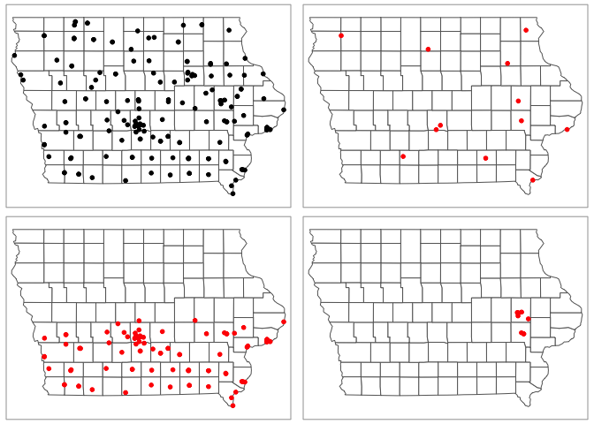
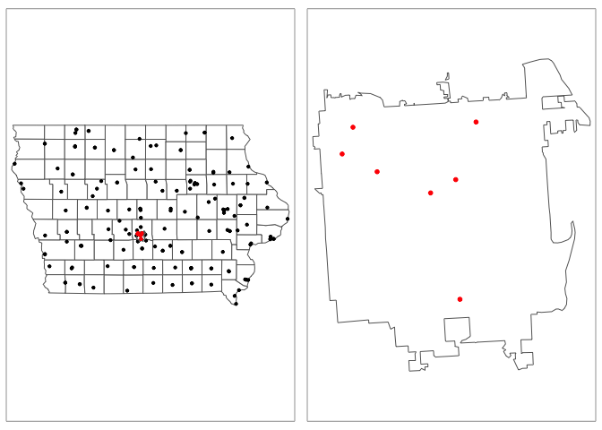

<style>
p.comment {
background-color: #DBDBDB;
padding: 10px;
border: 1px solid black;
margin-left: 0px;
border-radius: 5px;
font-style: normal;
}

h1.title {
  font-weight: bold;
  font-family: Arial;  
}

h2.title {
  font-family: Arial;  
}

</style>


<style type="text/css">
#TOC {
  font-size: 11px;
  font-family: Arial;
}
</style>


## Required libraries


## Cropping data/zooming in

### Required libraries


```r
library(sp)
library(sf)
library(elevatr)
library(USAboundaries)
library(raster)
library(tidycensus)
library(rnaturalearth)
library(tmap)
library(exactextractr)
library(units)
library(tigris)
library(rmapshaper)
library(FedData)
```

### Filtering point data sf

I am basing my examples on Iowan farmers market locations


```r
plot(st_geometry(IA_farmersmarket.sf),col=rgb(0,0,0,.5),pch=16)
plot(st_geometry(border.county.IA.sf),border="red",add=TRUE)
```

<!-- -->


Make sure your data is in sf format!   Now there are a few options. You could filter to one of the columns and crop that way. For my data I have these columns


```r
names(IA_farmersmarket.sf)
```

```
##  [1] "FID"         "City"        "County"      "Latitude"    "Location"   
##  [6] "Longitude"   "Market_Name" "Open_Dates"  "Open_Hours"  "State"      
## [11] "Weekday"     "geometry"
```

So for example


```r
# THE COMMA AT THE END IS IMPORTANT!
IA_farmersmarket.MONDAY.sf <- IA_farmersmarket.sf[which(IA_farmersmarket.sf$Weekday %in% "Monday"), ]

#or 
central_lat <-mean(IA_farmersmarket.sf$Latitude,na.rm=TRUE)
IA_farmersmarket.SOUTH.sf <- IA_farmersmarket.sf[which(IA_farmersmarket.sf$Latitude  < central_lat), ]

#or
IA_farmersmarket.UIOWA.sf <- IA_farmersmarket.sf[which(IA_farmersmarket.sf$County  %in% c("LINN","JOHNSON")), ]


map1 <- qtm(st_geometry(border.county.IA.sf),fill="white")+
        tm_shape(IA_farmersmarket.sf)+tm_dots(size=.1,col="black")

map2 <- qtm(st_geometry(border.county.IA.sf),fill="white")+
        tm_shape(IA_farmersmarket.MONDAY.sf)+tm_dots(size=.1,col="red")

map3 <- qtm(st_geometry(border.county.IA.sf),fill="white")+
        tm_shape(IA_farmersmarket.SOUTH.sf)+tm_dots(size=.1,col="red")

map4 <- qtm(st_geometry(border.county.IA.sf),fill="white")+
        tm_shape(IA_farmersmarket.UIOWA.sf)+tm_dots(size=.1,col="red")

tmap_arrange(map1,map2,map3,map4)
```

<!-- -->

```r
rm(map1);rm(map2);rm(map3);rm(map4)
```

### Cropping to a lon/lat box

Ocean folks, this one is for you!


```r
# Make sure your sf data is in lon/lat
IA_farmersmarket.sf  <-  st_transform(IA_farmersmarket.sf,4326)

# Turn it into sp data
IA_farmersmarket.sp <- as(IA_farmersmarket.sf,"Spatial")

# My new region from https://www.geoplaner.com/
Crop.Region <- as(extent(-94,-92,41,42), "SpatialPolygons")

# Subset the polygons to my new region
IA_farmersmarket.BOX.sp <- crop(IA_farmersmarket.sp, Crop.Region, byid=TRUE)

# and convert back to sf and your other map projection
IA_farmersmarket.BOX.sf <- st_as_sf(IA_farmersmarket.BOX.sp)

IA_farmersmarket.sf  <-  st_transform(IA_farmersmarket.sf,3744)
IA_farmersmarket.BOX.sf  <-  st_transform(IA_farmersmarket.BOX.sf,3744)


# and plot

map1 <- qtm(st_geometry(border.county.IA.sf),fill="white")+
        tm_shape(IA_farmersmarket.sf)+tm_dots(size=.1,col="black")

map2 <- qtm(st_geometry(border.county.IA.sf),fill="white")+
        tm_shape(IA_farmersmarket.BOX.sf)+tm_dots(size=.1,col="red")

# tell R the bounding box
mybox <- st_bbox(IA_farmersmarket.BOX.sf)

map3 <- qtm(st_geometry(border.county.IA.sf),fill="white",bb=mybox)+
        tm_shape(IA_farmersmarket.BOX.sf)+tm_dots(size=.1,col="red")

tmap_arrange(map2,map1,map3)
```

<!-- -->

```r
rm(map1);rm(map2);rm(map3)
```

### Cropping to a state/shapefile

Sometimes we want to crop to a state/shapefile.  For example imagine we want to crop to a city metropoliton area (see Lab 7)


```r
# This could be any sf boundary you want to crop to.
# it doesn't have to be a city - here i look for Des Moines
pl <- places(state = "IA", cb = TRUE, year=2017)
```

```
## 
Downloading: 16 kB     
Downloading: 16 kB     
Downloading: 32 kB     
Downloading: 32 kB     
Downloading: 65 kB     
Downloading: 65 kB     
Downloading: 97 kB     
Downloading: 97 kB     
Downloading: 120 kB     
Downloading: 120 kB     
Downloading: 150 kB     
Downloading: 150 kB     
Downloading: 190 kB     
Downloading: 190 kB     
Downloading: 230 kB     
Downloading: 230 kB     
Downloading: 230 kB     
Downloading: 230 kB     
Downloading: 250 kB     
Downloading: 250 kB     
Downloading: 270 kB     
Downloading: 270 kB     
Downloading: 310 kB     
Downloading: 310 kB     
Downloading: 320 kB     
Downloading: 320 kB     
Downloading: 320 kB     
Downloading: 320 kB
```

```r
DesMoines.borders.sf <- dplyr::filter(pl, NAME == "Des Moines")

# make sure they are the same map projection
IA_farmersmarket.sf  <-  st_transform(IA_farmersmarket.sf,4326)
DesMoines.borders.sf  <-  st_transform(DesMoines.borders.sf,4326)

# and crop and save to a new thing
DesMoines.Markets.sf <- ms_clip(target = IA_farmersmarket.sf, clip = DesMoines.borders.sf, remove_slivers = TRUE)

# change the map projection back
IA_farmersmarket.sf  <-  st_transform(IA_farmersmarket.sf,3744)
DesMoines.borders.sf  <-  st_transform(DesMoines.borders.sf,3744)
DesMoines.Markets.sf  <-  st_transform(DesMoines.Markets.sf,3744)


# and plot

map1 <- qtm(st_geometry(border.county.IA.sf),fill="white")+
        tm_shape(IA_farmersmarket.sf)+tm_dots(size=.05,col="black")+
        tm_shape(DesMoines.borders.sf)+tm_borders()+
        tm_shape(DesMoines.Markets.sf)+tm_dots(size=.05,col="red")
  

map2 <- qtm(st_geometry(DesMoines.borders.sf),fill="white")+
        tm_shape(DesMoines.Markets.sf)+tm_dots(size=.1,col="red")

tmap_arrange(map1,map2)
```

<!-- -->

```r
rm(map1);rm(map2)
```


## Adding in secondary data

IF IN DOUBT, TRANSFORM EVERYTHING INTO LONG/LAT MAP PROJECTION (4326) - and merge like that, *then* transform back to the one you want.  

You will need the normal libraries at the top of this tutorial.  I am going to extract some data to add to my Iowan Farm Market Locations:


### Extracting point values from polygons

This is very easy using the `st_join()` command from the `sf` package. To add my census data (or any sf polygon data) to my Iowa farmers market sf, I can simply do


```r
#--------------------------------------------------------------
# Transform all to lon/lat crs=4326 - just in case
#--------------------------------------------------------------
ACS_county.sf        <-  st_transform(ACS_county.sf,4326)
IA_farmersmarket.sf  <-  st_transform(IA_farmersmarket.sf,4326)

#--------------------------------------------------------------
# MAKE SURE THE POINT DATA GOES FIRST
# I'm calling it something new so I dont accidentally overwrite
#--------------------------------------------------------------
IA_farmers_census.sf <- st_join(IA_farmersmarket.sf,ACS_county.sf)

#--------------------------------------------------------------
# Transform back
#--------------------------------------------------------------
ACS_county.sf        <-  st_transform(ACS_county.sf,3744)
IA_farmersmarket.sf  <-  st_transform(IA_farmersmarket.sf,3744)
IA_farmers_census.sf <-  st_transform(IA_farmers_census.sf,3744)

#--------------------------------------------------------------
# Have a look at your new column names
#--------------------------------------------------------------
names(IA_farmers_census.sf)
```

```
##  [1] "FID"                    "City"                   "County"                
##  [4] "Latitude"               "Location"               "Longitude"             
##  [7] "Market_Name"            "Open_Dates"             "Open_Hours"            
## [10] "State"                  "Weekday"                "geometry"              
## [13] "GEOID"                  "NAME"                   "housevalueE"           
## [16] "housevalueM"            "total_popE"             "total_popM"            
## [19] "total_houseE"           "total_houseM"           "med.incomeE"           
## [22] "med.incomeM"            "County.areaE"           "PopulationDensityE"    
## [25] "Log_PopulationDensityE"
```

```r
#--------------------------------------------------------------
# Make my weekdays plot in the right order
#--------------------------------------------------------------
IA_farmers_census.sf$Weekday <- as.factor(IA_farmers_census.sf$Weekday)
levels(IA_farmers_census.sf$Weekday) <- c("Saturday","Sunday","Monday","Tuesday","Wednesday","Thursday","Friday")

#--------------------------------------------------------------
# and plot
#--------------------------------------------------------------
tmap_mode("plot")

map_Week     <- qtm(IA_farmers_census.sf,dots.col="Weekday",title="Market Day",
                    dots.size=.1,dots.palette="Spectral")+
        tm_shape(border.county.IA.sf)+tm_polygons(alpha=0)+
        tm_layout(legend.outside = TRUE,legend.outside.position	 = "bottom")

map_Popdens <- qtm(IA_farmers_census.sf,dots.col="med.incomeE",title="Median Income",
                   dots.size=.1,dots.palette="Blues")+
        tm_shape(border.county.IA.sf)+tm_polygons(alpha=0)+
        tm_layout(legend.outside = TRUE,legend.outside.position	 = "bottom")

tmap_arrange(map_Week,map_Popdens,ncol=2)
```

<!-- -->

```r
# clean up your workspace, optional but good practice unless you later need this map
rm(map_Week); rm(map_Popdens2)
```
### Extracting point values from rasters/fields

A raster is a field like elevation or land cover.


Here the elevation data is numeric whilst the land cover is categorical.

#### Extracting point values from numeric rasters 

This is very easy using the `extract()` command from the `raster` package. To extract my elevation data 

For point data, we choose simply the extract function.  Remember to put results=FALSE


```r
#--------------------------------------------------------------
# Turn everything to the same map projection
#--------------------------------------------------------------
IA_farmers_census.sf  <-  st_transform(IA_farmers_census.sf,4326)
elevation.raster_IA <- raster::projectRaster(elevation.raster_IA,crs=4326)

#--------------------------------------------------------------
# add to point data
#--------------------------------------------------------------
IA_farmers_census.sf$Elevation <- raster::extract(elevation.raster_IA,IA_farmersmarket.sf)

#--------------------------------------------------------------
# Turn everything to the final map projection
#--------------------------------------------------------------
elevation.raster_IA  <- raster::projectRaster(elevation.raster_IA,crs=3744)
IA_farmers_census.sf <-  st_transform(IA_farmers_census.sf,3744)

#--------------------------------------------------------------
# And plot
# see here for more colours: https://www.r-graph-gallery.com/38-rcolorbrewers-palettes.html
#--------------------------------------------------------------
tmap_mode("plot")

map_elev     <- tm_shape(elevation.raster_IA)+
                     tm_raster(title="Elevation",palette="PuRd")+
                tm_shape(IA_farmers_census.sf)+
                     tm_dots(size=.1)+
                tm_shape(border.county.IA.sf)+
                     tm_polygons(alpha=0)+
                tm_layout(legend.outside = TRUE,legend.outside.position	 = "bottom")


map_elev2 <- qtm(IA_farmers_census.sf,dots.col="Elevation",title="Height Above Sea Level",
                   dots.size=.1,dots.palette="PuRd")+
        tm_shape(border.county.IA.sf)+tm_polygons(alpha=0)+
        tm_layout(legend.outside = TRUE,legend.outside.position	 = "bottom")

tmap_arrange(map_elev,map_elev2,ncol=2)
```

<!-- -->

```r
rm(map_elev); rm(map_elev2)
```

#### Extracting point values from categorical rasters

This is exactly the same. I have an extra step just because I had a separate file with the category names,


```r
#--------------------------------------------------------------
# Turn everything to the same map projection
#--------------------------------------------------------------
IA_farmers_census.sf  <-  st_transform(IA_farmers_census.sf,crs(IA_Landcover))

#--------------------------------------------------------------
# add to point data
#--------------------------------------------------------------
IA_farmers_census.sf$LandcoverNumber <-  as.factor(raster::extract(IA_Landcover,IA_farmers_census.sf))

#--------------------------------------------------------------
# for the landcover data specifically, this might be better
#--------------------------------------------------------------
key <- nlcd_colors()[,c("ID","Class")]
names(key) <- c("LandcoverNumber","LandcoverClass")

IA_farmers_census.sf <- merge(IA_farmers_census.sf ,key,by="LandcoverNumber",all.x=TRUE,all.y=FALSE)
IA_farmers_census.sf$LandcoverClass <- as.factor(IA_farmers_census.sf$LandcoverClass )


#--------------------------------------------------------------
# Turn everything to the final map projection
#--------------------------------------------------------------
IA_farmers_census.sf <-  st_transform(IA_farmers_census.sf,3744)

#--------------------------------------------------------------
# And plot
# see here for more colours: https://www.r-graph-gallery.com/38-rcolorbrewers-palettes.html
#--------------------------------------------------------------
tmap_mode("plot")

map_lc1     <- tm_shape(IA_Landcover)+
                     tm_raster(title="Landcover")+
                tm_shape(IA_farmers_census.sf)+
                     tm_dots(size=.1)+
                tm_shape(border.county.IA.sf)+
                     tm_polygons(alpha=0)+
                tm_layout(legend.outside = TRUE,legend.outside.position	 = "bottom")

map_lc2 <- qtm(IA_farmers_census.sf,dots.col="LandcoverNumber",title="Land cover code", dots.size=.1)+
           tm_shape(border.county.IA.sf)+
              tm_polygons(alpha=0)+
           tm_layout(legend.outside = TRUE,legend.outside.position	 = "bottom")

map_lc3 <- qtm(IA_farmers_census.sf,dots.col="LandcoverClass",title="Land cover",dots.size=.1)+
           tm_shape(border.county.IA.sf)+
              tm_polygons(alpha=0)+
           tm_layout(legend.outside = TRUE,legend.outside.position	 = "bottom")


tmap_arrange(map_lc1,map_lc2,map_lc3,ncol=3)
```

<!-- -->

```r
rm(map_lc1); rm(map_lc1); rm(map_lc3)
```
