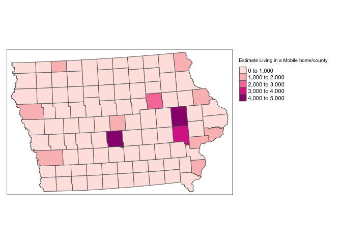
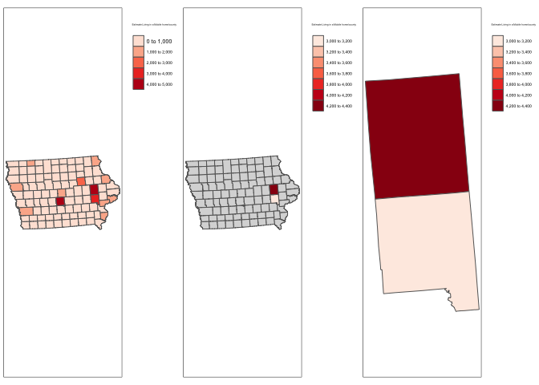
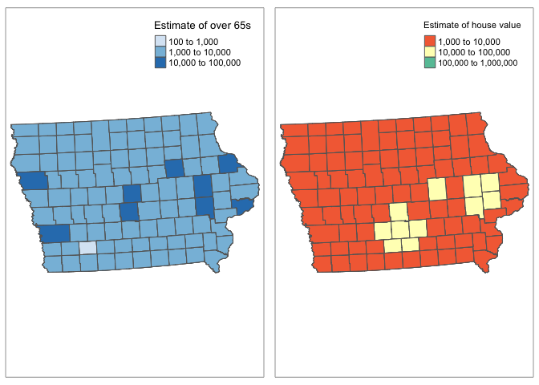
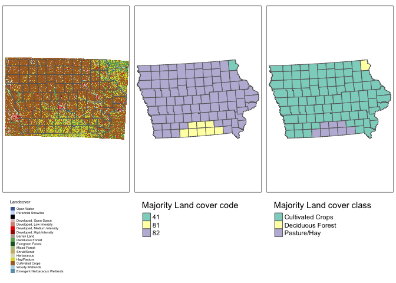

<style>
p.comment {
background-color: #DBDBDB;
padding: 10px;
border: 1px solid black;
margin-left: 0px;
border-radius: 5px;
font-style: normal;
}

h1.title {
  font-weight: bold;
  font-family: Arial;  
}

h2.title {
  font-family: Arial;  
}

</style>


<style type="text/css">
#TOC {
  font-size: 11px;
  font-family: Arial;
}
</style>


## Cropping data/zooming in

### Required libraries


```r
library(sp)
library(sf)
library(elevatr)
library(USAboundaries)
library(raster)
library(tidycensus)
library(rnaturalearth)
library(tmap)
library(exactextractr)
library(units)
library(tigris)
library(rmapshaper)
library(FedData)
```

### Filtering point data sf

I am basing my examples on Iowan SVI data, SVI_county.sf


```r
tmap_mode("plot")

tm_shape(SVI_county.sf)+
  tm_polygons("E_MOBILE",title="Estimate Living in a Mobile home/county",palette="RdPu")+
    tm_layout(legend.outside=TRUE)
```

<!-- -->

Make sure your data is in sf format!   Now there are a few options. You could filter to one of the columns and crop that way. For my data I have these columns


```r
names(SVI_county.sf)
```

```
##   [1] "ST"         "STATE"      "ST_ABBR"    "COUNTY"     "FIPS"      
##   [6] "LOCATION"   "AREA_SQMI"  "E_TOTPOP"   "M_TOTPOP"   "E_HU"      
##  [11] "M_HU"       "E_HH"       "M_HH"       "E_POV"      "M_POV"     
##  [16] "E_UNEMP"    "M_UNEMP"    "E_PCI"      "M_PCI"      "E_NOHSDP"  
##  [21] "M_NOHSDP"   "E_AGE65"    "M_AGE65"    "E_AGE17"    "M_AGE17"   
##  [26] "E_DISABL"   "M_DISABL"   "E_SNGPNT"   "M_SNGPNT"   "E_MINRTY"  
##  [31] "M_MINRTY"   "E_LIMENG"   "M_LIMENG"   "E_MUNIT"    "M_MUNIT"   
##  [36] "E_MOBILE"   "M_MOBILE"   "E_CROWD"    "M_CROWD"    "E_NOVEH"   
##  [41] "M_NOVEH"    "E_GROUPQ"   "M_GROUPQ"   "EP_POV"     "MP_POV"    
##  [46] "EP_UNEMP"   "MP_UNEMP"   "EP_PCI"     "MP_PCI"     "EP_NOHSDP" 
##  [51] "MP_NOHSDP"  "EP_AGE65"   "MP_AGE65"   "EP_AGE17"   "MP_AGE17"  
##  [56] "EP_DISABL"  "MP_DISABL"  "EP_SNGPNT"  "MP_SNGPNT"  "EP_MINRTY" 
##  [61] "MP_MINRTY"  "EP_LIMENG"  "MP_LIMENG"  "EP_MUNIT"   "MP_MUNIT"  
##  [66] "EP_MOBILE"  "MP_MOBILE"  "EP_CROWD"   "MP_CROWD"   "EP_NOVEH"  
##  [71] "MP_NOVEH"   "EP_GROUPQ"  "MP_GROUPQ"  "EPL_POV"    "EPL_UNEMP" 
##  [76] "EPL_PCI"    "EPL_NOHSDP" "SPL_THEME1" "RPL_THEME1" "EPL_AGE65" 
##  [81] "EPL_AGE17"  "EPL_DISABL" "EPL_SNGPNT" "SPL_THEME2" "RPL_THEME2"
##  [86] "EPL_MINRTY" "EPL_LIMENG" "SPL_THEME3" "RPL_THEME3" "EPL_MUNIT" 
##  [91] "EPL_MOBILE" "EPL_CROWD"  "EPL_NOVEH"  "EPL_GROUPQ" "SPL_THEME4"
##  [96] "RPL_THEME4" "SPL_THEMES" "RPL_THEMES" "F_POV"      "F_UNEMP"   
## [101] "F_PCI"      "F_NOHSDP"   "F_THEME1"   "F_AGE65"    "F_AGE17"   
## [106] "F_DISABL"   "F_SNGPNT"   "F_THEME2"   "F_MINRTY"   "F_LIMENG"  
## [111] "F_THEME3"   "F_MUNIT"    "F_MOBILE"   "F_CROWD"    "F_NOVEH"   
## [116] "F_GROUPQ"   "F_THEME4"   "F_TOTAL"    "E_UNINSUR"  "M_UNINSUR" 
## [121] "EP_UNINSUR" "MP_UNINSUR" "E_DAYPOP"   "Shape_STAr" "Shape_STLe"
## [126] "geometry"
```

So for example


```r
#or
SVI_county.UIOWA.sf <- dplyr::filter(SVI_county.sf, COUNTY %in% c("Linn","Johnson"))

map1 <- tm_shape(SVI_county.sf)+
  tm_polygons("E_MOBILE",title="Estimate Living in a Mobile home/county",palette="Reds")+
    tm_layout(legend.outside=TRUE)


map2 <- qtm(st_geometry(SVI_county.sf))+
           tm_shape(SVI_county.UIOWA.sf)+
             tm_polygons("E_MOBILE",title="Estimate Living in a Mobile home/county",palette="Reds")+
           tm_layout(legend.outside=TRUE)


map3 <- tm_shape(SVI_county.UIOWA.sf)+
  tm_polygons("E_MOBILE",title="Estimate Living in a Mobile home/county",palette="Reds")+
    tm_layout(legend.outside=TRUE)

tmap_arrange(map1,map2,map3)
```

<!-- -->

```r
rm(map1);rm(map2); rm(map3)
```

### Cropping to a lon/lat box

Ocean folks, this one is for you!


```r
# Make sure your sf data is in lon/lat
SVI_county.sf  <-  st_transform(SVI_county.sf,4326)

# Turn it into sp data
SVI_county.sp <- as(SVI_county.sf,"Spatial")

# My new region from https://www.geoplaner.com/
Crop.Region <- as(extent(-94,-92,41,42), "SpatialPolygons")

# Subset the polygons to my new region
SVI_county.BOX.sp <- crop(SVI_county.sp, Crop.Region, byid=TRUE)

# and convert back to sf and your other map projection
SVI_county.BOX.sf <- st_as_sf(SVI_county.BOX.sp)

SVI_county.sf  <-  st_transform(SVI_county.sf,3744)
SVI_county.BOX.sf  <-  st_transform(SVI_county.BOX.sf,3744)


# and plot -

map1 <- tm_shape(SVI_county.sf)+
             tm_polygons("E_TOTPOP",title="Estimate of the total population",
                         palette="Blues",style="log10_pretty")+
        tm_layout(legend.outside=TRUE)

map2 <- tm_shape(SVI_county.sf)+tm_borders()+
        tm_shape(SVI_county.BOX.sf)+
             tm_polygons("E_TOTPOP",title="Estimate of the total population",
                         palette="Blues",style="log10_pretty")+
        tm_layout(legend.outside=TRUE)

map3 <- tm_shape(SVI_county.BOX.sf)+
             tm_polygons("E_TOTPOP",title="Estimate of the total population",
                         palette="Blues",style="log10_pretty")+
        tm_layout(legend.outside=TRUE)

tmap_arrange(map2,map1,map3)
```

<!-- -->

```r
rm(map1);rm(map2);rm(map3)
```

### Cropping to a state/shapefile

Sometimes we want to crop to a state/shapefile.  For example imagine we want to crop to a city metropoliton area (see Lab 7)


```r
# This could be any sf boundary you want to crop to.
# it doesn't have to be a city - here i look for Des Moines
pl <- places(state = "IA", cb = TRUE, year=2017)
DesMoines.borders.sf <- dplyr::filter(pl, NAME == "Des Moines")

# make sure they are the same map projection
SVI_county.sf  <-  st_transform(SVI_county.sf,4326)
DesMoines.borders.sf  <-  st_transform(DesMoines.borders.sf,4326)

# and crop and save to a new thing
DesMoines.SVI.sf <- ms_clip(target = SVI_county.sf, clip = DesMoines.borders.sf, remove_slivers = TRUE)

# change the map projection back
SVI_county.sf  <-  st_transform(SVI_county.sf,3744)
DesMoines.borders.sf  <-  st_transform(DesMoines.borders.sf,3744)
DesMoines.SVI.sf  <-  st_transform(DesMoines.SVI.sf,3744)


# and plot

map1 <- qtm(st_geometry(border.county.IA.sf),fill="white")+
        tm_shape(DesMoines.SVI.sf)+
             tm_polygons("E_AGE65",title="Estimate of over 65s",
                         palette="Blues",style="log10_pretty")+
        tm_shape(DesMoines.borders.sf)+tm_borders()


map2 <- tm_shape(DesMoines.SVI.sf)+
             tm_polygons("E_AGE65",title="Estimate of over 65s",
                         palette="Blues",style="log10_pretty")+
        tm_shape(DesMoines.borders.sf)+tm_borders()

tmap_arrange(map1,map2)
```

<!-- -->

```r
rm(map1);rm(map2)
```


## Adding in secondary data

### Required libraries


```r
library(sp)
library(sf)
library(elevatr)
library(USAboundaries)
library(raster)
library(tidycensus)
library(rnaturalearth)
library(tmap)
library(exactextractr)
library(units)
library(tigris)
library(rmapshaper)
library(FedData)
```


### Averaging point values over polygons

There is a great tutorial here: 

This is very easy using the `st_join()` command from the `sf` package. To add my census data (or any sf polygon data) to my Iowa SVI data


```r
#--------------------------------------------------------------
# Transform all to lon/lat crs=4326 - just in case
#--------------------------------------------------------------
ACS_county.sf        <-  st_transform(ACS_county.sf,4326)
SVI_county.sf  <-  st_transform(SVI_county.sf,4326)

#--------------------------------------------------------------
# MAKE SURE THE POINT DATA GOES FIRST
# I'm calling it something new so I dont accidentally overwrite
#--------------------------------------------------------------
SVI_county.sf.all <- st_join(SVI_county.sf,ACS_county.sf)

#--------------------------------------------------------------
# Transform back
#--------------------------------------------------------------
ACS_county.sf        <-  st_transform(ACS_county.sf,3744)
SVI_county.sf  <-  st_transform(SVI_county.sf,3744)
SVI_county.sf.all <- st_transform(SVI_county.sf.all,3744)

#--------------------------------------------------------------
# and plot
#--------------------------------------------------------------
tmap_mode("plot")

map1 <- tm_shape(SVI_county.sf.all)+
             tm_polygons("E_AGE65",title="Estimate of over 65s",
                         palette="Blues",style="log10_pretty")


map2 <- tm_shape(SVI_county.sf.all)+
             tm_polygons("housevalueE",title="Estimate of house value",
                         palette="Spectral",style="log10_pretty")

tmap_arrange(map1,map2,ncol=2)
```

<!-- -->

```r
# clean up your workspace, optional but good practice unless you later need this map
rm(map2); rm(map1)
```


### Extracting polygon values from rasters/fields

A raster is a field like elevation or land cover.


Here the elevation data is numeric whilst the land cover is categorical.

#### Extracting polygon values from numeric rasters 

This is very easy using the `exact_extract()` command from the `exactextractr` package. To extract my elevation data 

For point data, we choose simply the extract function.  Remember to put results=FALSE


```r
#--------------------------------------------------------------
# Turn everything to the same map projection
#--------------------------------------------------------------
SVI_county.sf  <-  st_transform(SVI_county.sf,crs(elevation.raster_IA))

#--------------------------------------------------------------
# add to polygon data
#--------------------------------------------------------------
SVI_county.sf$ElevationMean <- exact_extract(elevation.raster_IA,SVI_county.sf,"mean")
SVI_county.sf$ElevationMax <- exact_extract(elevation.raster_IA,SVI_county.sf,"max")
SVI_county.sf$ElevationMin <- exact_extract(elevation.raster_IA,SVI_county.sf,"min")

#--------------------------------------------------------------
# Turn everything to the final map projection
#--------------------------------------------------------------
SVI_county.sf <-  st_transform(SVI_county.sf,3744)
```


```r
#--------------------------------------------------------------
# And plot
# see here for more colours: https://www.r-graph-gallery.com/38-rcolorbrewers-palettes.html
#--------------------------------------------------------------
tmap_mode("plot")

map_elev     <- tm_shape(border.county.IA.sf)+
                    tm_polygons(alpha=0)+
                tm_shape(elevation.raster_IA)+
                     tm_raster(title="Elevation",
                               palette="Spectral",style="cont",breaks=seq(100,600,100))+
               tm_shape(border.county.IA.sf)+
                    tm_polygons(alpha=0)+
                tm_layout(legend.outside = TRUE,legend.outside.position	 = "bottom")
                
map2 <- tm_shape(SVI_county.sf)+
             tm_polygons("ElevationMean",title="Mean Elevation in each county",
                         palette="Spectral",style="cont",breaks=seq(100,600,100))+
        tm_layout(legend.outside=TRUE,legend.outside.position	 = "bottom")


map3 <- tm_shape(SVI_county.sf)+
             tm_polygons("ElevationMax",title="Max Elevation in each county",
                         palette="Spectral",style="cont",breaks=seq(100,600,100))+
        tm_layout(legend.outside=TRUE,legend.outside.position	 = "bottom")

map4 <- tm_shape(SVI_county.sf)+
             tm_polygons("ElevationMin",title="Min Elevation in each county",
                         palette="Spectral",style="cont",breaks=seq(100,600,100))+
        tm_layout(legend.outside=TRUE,legend.outside.position	 = "bottom")

tmap_arrange(map_elev,map2,map3,map4,ncol=2)
```

<!-- -->

```r
rm(map_elev); rm(map2);rm(map3);rm(map4)
```

#### Extracting point values from categorical rasters

This is exactly the same but we use the "majority" function


```r
#--------------------------------------------------------------
# Turn everything to the same map projection
#--------------------------------------------------------------
SVI_county.sf         <-  st_transform(SVI_county.sf,crs(IA_Landcover))

#--------------------------------------------------------------
# add to polygon data
#--------------------------------------------------------------
SVI_county.sf$LandcoverNumber <- exact_extract(IA_Landcover,SVI_county.sf,"majority")

#--------------------------------------------------------------
# for the landcover data specifically, this might be better
#--------------------------------------------------------------
key <- nlcd_colors()[,c("ID","Class")]
names(key) <- c("LandcoverNumber","LandcoverClass")

SVI_county.sf <- merge(SVI_county.sf ,key,by="LandcoverNumber",all.x=TRUE,all.y=FALSE)

SVI_county.sf$LandcoverNumber <- as.factor(SVI_county.sf$LandcoverNumber )
SVI_county.sf$LandcoverClass <- as.factor(SVI_county.sf$LandcoverClass )

#--------------------------------------------------------------
# Turn everything to the final map projection
#--------------------------------------------------------------
SVI_county.sf <-  st_transform(SVI_county.sf,3744)

#--------------------------------------------------------------
# And plot
# see here for more colours: https://www.r-graph-gallery.com/38-rcolorbrewers-palettes.html
#--------------------------------------------------------------
tmap_mode("plot")

map_lc1     <- tm_shape(border.county.IA.sf)+
                    tm_polygons(alpha=0)+
                tm_shape(IA_Landcover)+
                     tm_raster(title="Landcover")+
               tm_shape(border.county.IA.sf)+
                    tm_polygons(alpha=0)+
                tm_layout(legend.outside = TRUE,legend.outside.position	 = "bottom")
                
map_lc2 <- tm_shape(SVI_county.sf)+
             tm_polygons("LandcoverNumber",title="Majority Land cover code")+
        tm_layout(legend.outside=TRUE,legend.outside.position	 = "bottom")

                
map_lc3 <- tm_shape(SVI_county.sf)+
             tm_polygons("LandcoverClass",title="Majority Land cover class")+
        tm_layout(legend.outside=TRUE,legend.outside.position	 = "bottom")


tmap_arrange(map_lc1,map_lc2,map_lc3,ncol=3)
```

<!-- -->

```r
rm(map_lc1); rm(map_lc1); rm(map_lc3)
```


