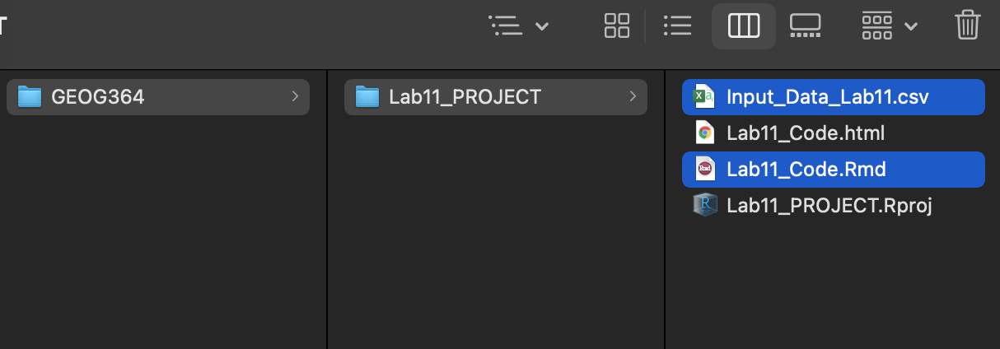

<style>
p.comment {
background-color: #DBDBDB;
padding: 10px;
border: 1px solid black;
margin-left: 25px;
border-radius: 5px;
font-style: normal;
}

h1.title {
  font-weight: bold;
  font-family: Arial;  
}

h2.title {
  font-family: Arial;  
}

</style>


<style type="text/css">
#TOC {
  font-size: 13px;
  font-family: Arial;
}
</style>

\

```{r setup, include=FALSE}
knitr::opts_chunk$set(echo = TRUE, warning=FALSE, message = FALSE)
```

You can complete your labs either on your laptops, or on R-Studio Cloud.  (There are also lab computers available, and the Penn State server, but both are out of date and can have bugs)

<br>

### To go from R-Studio Cloud to R-Desktop

1. On your computer, go to your GEOG364 folder (or make one!)
2. Make a subfolder named for that lab e.g. *Lab 1*
3. On your browser, open your project in R-studio cloud
4. In the files quadrant/tab, select the checkbox of all the files.
5. Click Export.  This will zip them into a folder.  Save that into your lab folder
6. Unzip. Double click the project.RProj file to reopen your lab on your computer

```{r, Tut0fig1, echo=FALSE}
knitr::include_graphics('Tutorial0a_fig1.png')
```


<br>


### To go from R-Desktop to R-Studio Cloud

1. On your browser, in R studio cloud make a new project and name it something relevant
2. Click the upload button
3. Navigate to the lab folder on your computer.  Choose ONLY the .Rmd file(s) and any input data as appropriate (RStudio-Cloud will make the rest)
4. Click on the .Rmd file name in the files in RStudio and you're good to go


<br>


```{r, Tut0fig2, echo=FALSE}
knitr::include_graphics('Tutorial0a_fig2.png')
```

<br>


```{r, Tut0fig3, echo=FALSE,out.width="70%",fig.align='centre'}

```


<br>


```{r, Tut0fig4, echo=FALSE,out.width="70%",fig.align='centre'}
knitr::include_graphics('Tutorial0a_fig4.png')
```

***


Website created and maintained by [Helen Greatrex](https://www.geog.psu.edu/directory/helen-greatrex). Website template by [Noli Brazil](https://nbrazil.faculty.ucdavis.edu/)