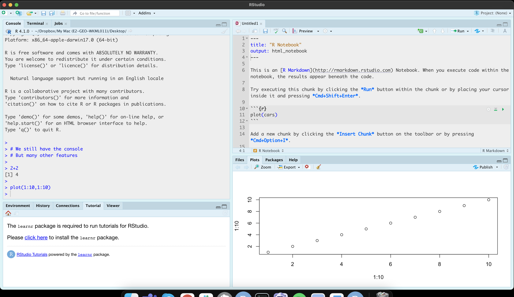

\

**R** is a programming language commonly used by statisticians and scientists across the world.  

By a "programming language", I mean it is a collection of commands that you can type into the computer in order to analyse and visualise data.  

The easiest way I find to think about R is that it is literally a language, like Spanish or Hindi, that is spoken by your computer. Learning R means learning vocabulary and grammar in order to communicate. It also means it will get easier with experience and practice..

There are two programmes needed to run R on your computer, "R" and "R-Studio"

### 1.1 What is R? {#S.Tutorial.1.1}

As described by Noli Brazil:*"R is a free, open source statistical programming language.  It is useful for data cleaning, analysis, and visualization. R is an interpreted language, not a compiled one. This means that you type something into R and it does it."* 

When you install R on your computer, you are essentially instantly teaching your computer to “speak in R” with some very basic Notepad-like software where you can enter commands."*

*The basic R console. You write in blue, the computer replies in black. The > means it is waiting for a command*

 

 
### 1.2 What is R-Studio? {#S.Tutorial.1.2}
 
More recently, **R-studio** has been designed as a piece of software to make it easier to programme in R. 

It’s Microsoft Word is compared to notepad; many more options and things to click. For example, you can easily see help files, run code, see your output and edit interactive visualisations.  R-Studio also allows us to make interactive documents called R-Markdown files.  

*R-studio is much more sophisticated*

 
  
 

 
### 1.3 This Course {#S.Tutorial.1.3}

For this course you will need BOTH R and R studio.  You have three options described in the next tutorial

1. Installing on your own computer (recommended)
2. R-Studio Cloud
3. Lab computers

**Please complete Tutorial 2 EVEN if you already have R/RStudio installed on your computer. It is important that you update them.**

 

***

Website created and maintained by [Helen Greatrex](https://www.geog.psu.edu/directory/helen-greatrex). Website template by [Noli Brazil](https://nbrazil.faculty.ucdavis.edu/)
