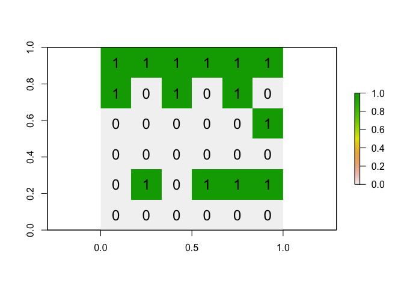
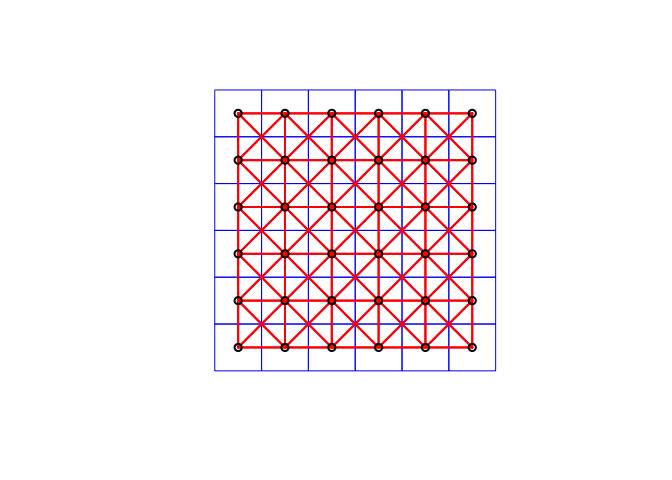
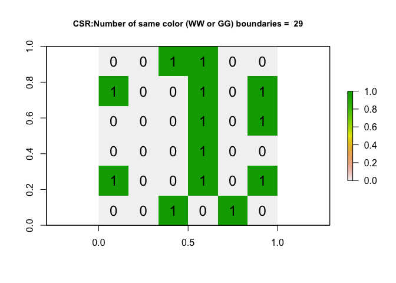
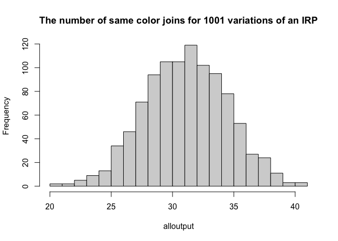
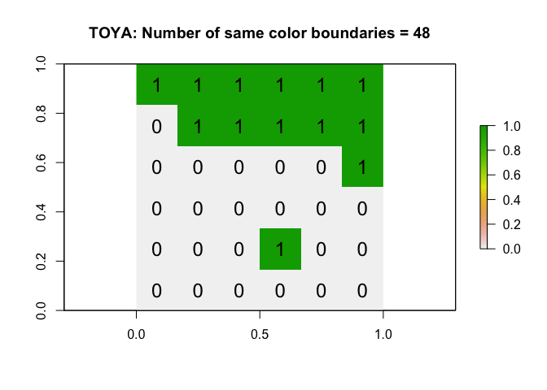
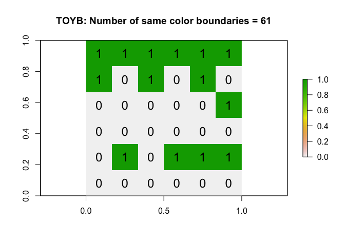

#Something New
- Creating our own function


```r
fahrenheit_to_celsius <- function(temp_F) {
  temp_C <- (temp_F - 32) * 5 / 9
  return(temp_C)
}
```


```r
celsius_to_kelvin <- function(temp_C) {
  temp_K <- temp_C + 273.15
  return(temp_K)
}

# freezing point of water in Kelvin
celsius_to_kelvin(0)
```

```
## [1] 273.15
```


```r
fahrenheit_to_kelvin <- function(temp_F) {
  temp_C <- fahrenheit_to_celsius(temp_F)
  temp_K <- celsius_to_kelvin(temp_C)
  return(temp_K)
}

# freezing point of water in Kelvin
fahrenheit_to_kelvin(32.0)
```

```
## [1] 273.15
```


```r
# we don't use min or max as they are standard R fucntion names
selectAny <- function(size, mini, maxi) {
f <- c() # create an empty vector
for(i in 1:size) { # repeat size times
f <- rbind(v, sample(mini:maxi, size = 1)) # add a random value to the vector
} # end loop
f # output the vector
} 
```


```r
standard.error <- function(x) {
    v <- var(x)
    n <- length(x)
    sqrt(v/n)
}
```

- An if statement


```r
x <- -20
if(x > 0){
print("Non-negative number")
} else {
print("Negative number")
}
```

```
## [1] "Negative number"
```


```r
x <- 10000
if (x < 0) {
print("Negative number")
} else if (x > 0) {
print("Positive number")
} else
print("Zero")
```

```
## [1] "Positive number"
```

# Join Counts

LLENA ESTO Y PONLO BONITO SE ESPECIFICA

Briefly explain what join counts are and why it is only appropriate to use use them for categorical or binary data (yes/no ; TRUE/FALSE). Feel free to use pictures/examples etc to help you explain it.


# Join Counts coding


```r
row.1 <- rep(1,6)  
row.2 <- c(0,1,1,1,1,1)
row.3 <- c(rep(0,5),1)
row.4 <- rep(0,6)
row.5 <- c(0,0,0,1,0,0)
row.6 <- rep(0,6)

ToyA_matrix <- matrix(c(row.1, row.2, row.3, row.4, row.5, row.6), 
                      nrow=6,ncol=6, byrow=TRUE)

ToyA_matrix
```

```
##      [,1] [,2] [,3] [,4] [,5] [,6]
## [1,]    1    1    1    1    1    1
## [2,]    0    1    1    1    1    1
## [3,]    0    0    0    0    0    1
## [4,]    0    0    0    0    0    0
## [5,]    0    0    0    1    0    0
## [6,]    0    0    0    0    0    0
```


```r
ToyA_raster <- raster(ToyA_matrix)

plot(ToyA_raster)
text(coordinates(ToyA_raster), labels=ToyA_raster[], cex=1.5)
```

<!-- -->

- rep() and c() commands do
Explain in your lab answers what the rep() and c() commands do. Feel free to use code examples!


```r
row.1 <- rep(1,6)  
row.2 <- c(1,0,1,0,1,0)
row.3 <- c(rep(0,5),1)
row.4 <- rep(0,6)
row.5 <- c(0,1,0,1,1,1)
row.6 <- rep(0,6)
ToyB_matrix <- matrix(c(row.1, row.2, row.3, row.4, row.5, row.6), 
                      nrow=6,ncol=6, byrow=TRUE)

ToyB_matrix
```

```
##      [,1] [,2] [,3] [,4] [,5] [,6]
## [1,]    1    1    1    1    1    1
## [2,]    1    0    1    0    1    0
## [3,]    0    0    0    0    0    1
## [4,]    0    0    0    0    0    0
## [5,]    0    1    0    1    1    1
## [6,]    0    0    0    0    0    0
```


```r
ToyB_raster <- raster(ToyB_matrix)

plot(ToyB_raster)
text(coordinates(ToyB_raster), labels=ToyB_raster[], cex=1.5)
```

<!-- -->


```r
# Step 1 - turn to polygon
ToyA_polygon    <- rasterToPolygons(ToyA_raster, dissolve=FALSE)
ToyA_spdep      <- SpatialPolygons(ToyA_polygon@polygons)

# Step 2 - Make list of neighbors
ToyA_nb.rook <- poly2nb(ToyA_spdep, queen = FALSE)

# Step 3 - Create weights matrix
ToyA_weights.rook <- nb2listw(ToyA_nb.rook, style='B')

# Step 4 - plot the neighbors
plot(ToyA_spdep, border='blue')
plot(ToyA_nb.rook, coordinates(ToyA_spdep), col='red', lwd=2, add=TRUE)
```

<!-- -->

## Spatial weights matrix
 Explain what a spatial-weights-matrix is, how adjacency can been used to create one (e.g. what are queens/rooks) or how distance might be used to create one (lecture 8A, Lecture 7B). **
 
 LLENA
 

```r
# Step 1 - turn to polygon
ToyB_polygon    <- rasterToPolygons(ToyB_raster, dissolve=FALSE)
ToyB_spdep      <- SpatialPolygons(ToyB_polygon@polygons)

# Step 2 - Make list of neighbors
ToyB_nb.queen <- poly2nb(ToyB_spdep, queen = TRUE)

# Step 3 - Create weights matrix
ToyB_weights.queen <- nb2listw(ToyB_nb.queen, style='B')

# Step 4 - plot the neighbors
plot(ToyB_spdep, border='blue')
plot(ToyB_nb.queen, coordinates(ToyB_spdep), col='red', lwd=2, add=TRUE)
```

<!-- -->
 
 Explain why your Queens adjacecy plot for the Toy_B data looks different to my Rooks adjacecy plot for the Toy_A data.

llena

HLG - THIS WAS THE OLD FUNCTION, THIS IS THE ONE I WAS TALKING ABOUT IN MY CANVAS MESSAGE.
I COPY/PASTED THIS FROM THE NEW VERSION OF MY INSTRUCTIONS


```r
toyIRP <- function(matrix_input, silent=FALSE){

  # find how big out input matrix is
  nrows  <- nrow(matrix_input)
  ncols <- nrow(matrix_input)
  numberones <- 13
  # make a list of all the ones and zeros
  alltheones  <- rep(1,numberones)
  allthezeros  <- rep(0, ((nrows*ncols) - numberones))
  # randomise
  randombinary <- sample(c(alltheones,allthezeros),size=(nrows*ncols),replace=FALSE)

  
  #---------------------------------------------------------------------------
  # Turn into a matrix and create the weights etc.
  #---------------------------------------------------------------------------
  IRP_matrix   <- matrix(randombinary, nrow=nrows,ncol=ncols, byrow=TRUE)
  IRP_raster   <- raster(IRP_matrix)
  IRP_polygon  <- rasterToPolygons(IRP_raster, dissolve=FALSE)
  IRP_spdep    <- SpatialPolygons(IRP_polygon@polygons)
  IRP_nb.rook  <- poly2nb(IRP_spdep, queen = FALSE)
  IRP_weights.rook <- nb2listw(IRP_nb.rook, style='B')
  IRB_jointest <- joincount.test(fx    = as.factor(IRP_polygon$layer), listw = IRP_weights.rook) 
  
  ww_gg_joincount <- IRB_jointest[[1]]$estimate[1]+  IRB_jointest[[2]]$estimate[1]
  
  # If you want to see the output (e.g. silent=FALSE) then plot
  if(silent == FALSE){
    plot(IRP_raster, 
         main = list(paste("CSR:Number of same color (WW or GG) boundaries = ",ww_gg_joincount),cex=.9))
    text(coordinates(IRP_raster), labels=IRP_raster[], cex=1.5)
  }
  
  return(ww_gg_joincount)
}
```

THIS WAS OUT OF DATE AND NEEDED TO BE UPDATED FROM THE NEW VERSION OF THE INSTRUCTIONS


```r
output <- toyIRP(ToyA_matrix, silent=FALSE)
```

<!-- -->

On average, if an IRP really did cause the pattern in the matrix, how many white-white joins would you expect to see? Why does the number change each time you run it?

LLENA


```r
# Run once
alloutput <-  toyIRP(ToyA_matrix, silent=TRUE)
  
# Repeat 200 times and add in the answer
for(n in 1:1000){
  newIRP <- toyIRP(ToyA_matrix, silent=TRUE)
  alloutput <-  c(alloutput, newIRP)
}  

#make a histogram of all the white-white joins
hist(alloutput, br=20, main="The number of same color joins for 1001 variations of an IRP")
```

<!-- -->

Given this output, what is your new expectation of the number of white-white joins if an IRP caused the process?

llena


Using this equation, if you have a 6x6 grid, how many same colour joins would you theoretically expect (hint, it would be the total number of joins minus E_BW)

llena


```r
# run the command
 ToyA_jointest <- joincount.test(fx = as.factor(ToyA_polygon$layer), 
                                listw = ToyA_weights.rook,        
                                alternative = "greater") 
 numberboundaries <- ToyA_jointest[[1]]$estimate[1]+  ToyA_jointest[[2]]$estimate[1]


# and plot
 plot(ToyA_raster, main = paste("TOYA: Number of same color boundaries =",numberboundaries))
 text(coordinates(ToyA_raster), labels=ToyA_raster[], cex=1.5)
```

<!-- -->


```r
# run the command
# run the command
 ToyB_jointest <- joincount.test(fx = as.factor(ToyB_polygon$layer), 
                                listw = ToyB_weights.queen,        
                                alternative = "greater") 
 numberboundaries <- ToyB_jointest[[1]]$estimate[1]+  ToyB_jointest[[2]]$estimate[1]


# and plot
 plot(ToyB_raster, main = paste("TOYB: Number of same color boundaries =",numberboundaries))
 text(coordinates(ToyB_raster), labels=ToyB_raster[], cex=1.5)
```

<!-- -->

Comparing against the histogram, is the number of white-white boundaries unusually high/low?? Does this suggest your data is unusually clustered/uniform compared to one created by an IRP?


LLENAAA


```r
ToyA_jointest <- joincount.test(fx    = as.factor(ToyA_polygon$layer), 
                                listw = ToyA_weights.rook,   
                                sampling = "nonfree",
                                alternative = "two.sided") 
```


In the joincount.test command, there is an argument, sampling = “nonfree”. Using the textbook pdf to help, explain the difference between free and non-free sampling when making our IRP pattern.
LLENA


```r
# White-to-white Join counts
ToyA_jointest[[1]]
```

```
## 
## 	Join count test under nonfree sampling
## 
## data:  as.factor(ToyA_polygon$layer) 
## weights: ToyA_weights.rook 
## 
## Std. deviate for 0 = 4.1544, p-value = 3.262e-05
## alternative hypothesis: two.sided
## sample estimates:
## Same colour statistic           Expectation              Variance 
##             33.000000             24.095238              4.594478
```

info to look attt
In the output, the test said the p-value was 3.262e-05 e.g. 0.00003262. This means that we would expect only ~0.003% of cases from an IRP-generated pattern to have 33 or more white-white joins (1 in 3000). It’s incredibly unusual to see this is the IRP was true.

In the joincount.test command, there is an argument, sampling = “nonfree”. Using the textbook pdf to help, explain the difference between free and non-free sampling when making our IRP pattern.


LLENA ESTOOOOOO

Interpretation

We can see that there are many more white-white joins joins than you might expect. In fact, looking at the low p-value, we can see that it is very unusual to see so many same-color joins (), so in this case, most people can can safely reject the null hypothesis.

So finally we can formally conclude:

The p-value for our test of white-white joins was 3.262e-05, so only 0.003262% of cases caused by an IRP-generated pattern (non-free sampling) would have seen 33 or more white-white joins.

I am willing to accept this level of uncertainty in the result. I have enough evidence to reject the null hypothesis and suggest that Toy_A is not caused by an IRP.


Use the steps above to run a joincount test for your Toy B hypothesis test (e.g. you are testing if it is unusually clustered) and interpret the output.

LLENA


```r
ToyB_jointest <- joincount.test(fx    = as.factor(ToyB_polygon$layer), 
                                listw = ToyB_weights.queen,   
                                sampling = "nonfree",
                                alternative = "two.sided") 
```


```r
ToyB_jointest[[1]]
```

```
## 
## 	Join count test under nonfree sampling
## 
## data:  as.factor(ToyB_polygon$layer) 
## weights: ToyB_weights.queen 
## 
## Std. deviate for 0 = 1.1676, p-value = 0.243
## alternative hypothesis: two.sided
## sample estimates:
## Same colour statistic           Expectation              Variance 
##              45.00000              40.33333              15.97386
```

REAL LIFE EXAMPLE
Step 17: The paper did not provide a map of how the territories looked - if you had to choose one of the maps below, which is most likely? Why?

llenaa


Step 18: At a significance value of 0.01, do these results indicate that the frogs preferred hunting prey in specific patches of their core areas? Or is there no evidence to reject the notion that they randomly hunted wherever they hopped?

llenaa


