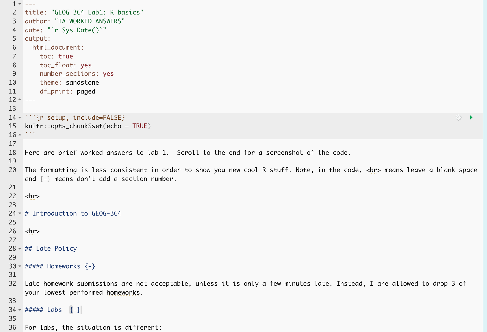
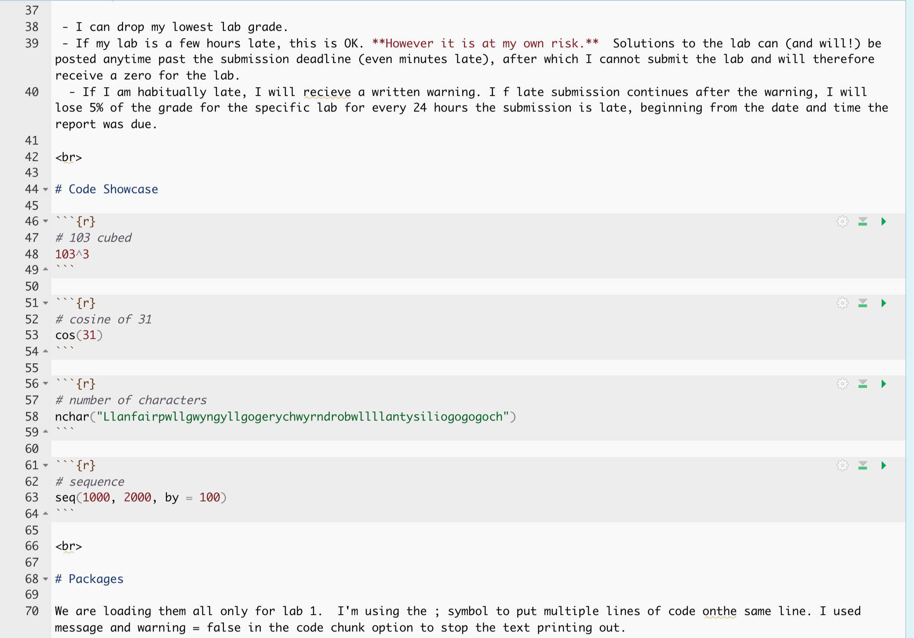
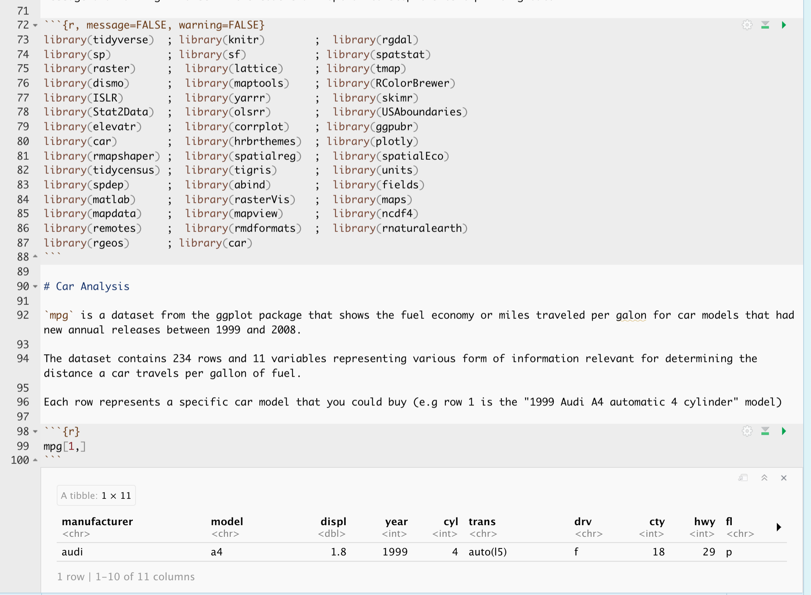

Here are brief worked answers to lab 1.  Scroll to the end for a screenshot of the code.

The formatting is less consistent in order to show you new cool R stuff. Note, in the code, <br> means leave a blank space and {-} means don't add a section number.

<br>

# Introduction to GEOG-364

<br>

## Late Policy

##### Homeworks {-}

Late homework submissions are not acceptable, unless it is only a few minutes late. Instead, I are allowed to drop 3 of your lowest performed homeworks. 

##### Labs  {-}

For labs, the situation is different:

 - I can drop my lowest lab grade. 
 - If my lab is a few hours late, this is OK. **However it is at my own risk.**  Solutions to the lab can (and will!) be posted anytime past the submission deadline (even minutes late), after which I cannot submit the lab and will therefore receive a zero for the lab.   
  - If I am habitually late, I will recieve a written warning. I f late submission continues after the warning, I will lose 5% of the grade for the specific lab for every 24 hours the submission is late, beginning from the date and time the report was due.

<br>

# Code Showcase 


```r
# 103 cubed
103^3
```

```
## [1] 1092727
```


```r
# cosine of 31
cos(31)
```

```
## [1] 0.9147424
```


```r
# number of characters
nchar("Llanfairpwllgwyngyllgogerychwyrndrobwllllantysiliogogogoch")
```

```
## [1] 58
```


```r
# sequence
seq(1000, 2000, by = 100)
```

```
##  [1] 1000 1100 1200 1300 1400 1500 1600 1700 1800 1900 2000
```

<br>

# Packages

We are loading them all only for lab 1.  I'm using the ; symbol to put multiple lines of code onthe same line. I used message and warning = false in the code chunk option to stop the text printing out.  


```r
library(tidyverse)  ; library(knitr)        ;  library(rgdal) 
library(sp)         ; library(sf)           ; library(spatstat) 
library(raster)     ;  library(lattice)     ; library(tmap) 
library(dismo)      ;  library(maptools)    ; library(RColorBrewer) 
library(ISLR)       ;  library(yarrr)       ;  library(skimr) 
library(Stat2Data)  ;  library(olsrr)       ;  library(USAboundaries) 
library(elevatr)    ;  library(corrplot)    ; library(ggpubr) 
library(car)        ;  library(hrbrthemes)  ; library(plotly) 
library(rmapshaper) ;  library(spatialreg)  ;  library(spatialEco) 
library(tidycensus) ;  library(tigris)      ;  library(units) 
library(spdep)      ;  library(abind)       ;  library(fields) 
library(matlab)     ;  library(rasterVis)   ;  library(maps)
library(mapdata)    ;  library(mapview)     ;  library(ncdf4) 
library(remotes)    ;  library(rmdformats)  ;  library(rnaturalearth) 
library(rgeos)      ; library(car)
```

# Car Analysis

`mpg` is a dataset from the ggplot package that shows the fuel economy or miles traveled per galon for car models that had new annual releases between 1999 and 2008. 

The dataset contains 234 rows and 11 variables representing various form of information relevant for determining the distance a car travels per gallon of fuel. 

Each row represents a specific car model that you could buy (e.g row 1 is the "1999 Audi A4 automatic 4 cylinder" model)


```r
mpg[1,]
```

<div data-pagedtable="false">
  <script data-pagedtable-source type="application/json">
{"columns":[{"label":["manufacturer"],"name":[1],"type":["chr"],"align":["left"]},{"label":["model"],"name":[2],"type":["chr"],"align":["left"]},{"label":["displ"],"name":[3],"type":["dbl"],"align":["right"]},{"label":["year"],"name":[4],"type":["int"],"align":["right"]},{"label":["cyl"],"name":[5],"type":["int"],"align":["right"]},{"label":["trans"],"name":[6],"type":["chr"],"align":["left"]},{"label":["drv"],"name":[7],"type":["chr"],"align":["left"]},{"label":["cty"],"name":[8],"type":["int"],"align":["right"]},{"label":["hwy"],"name":[9],"type":["int"],"align":["right"]},{"label":["fl"],"name":[10],"type":["chr"],"align":["left"]},{"label":["class"],"name":[11],"type":["chr"],"align":["left"]}],"data":[{"1":"audi","2":"a4","3":"1.8","4":"1999","5":"4","6":"auto(l5)","7":"f","8":"18","9":"29","10":"p","11":"compact"}],"options":{"columns":{"min":{},"max":[10]},"rows":{"min":[10],"max":[10]},"pages":{}}}
  </script>
</div>


```r
skim(mpg)
```


Table: Data summary

|                         |     |
|:------------------------|:----|
|Name                     |mpg  |
|Number of rows           |234  |
|Number of columns        |11   |
|_______________________  |     |
|Column type frequency:   |     |
|character                |6    |
|numeric                  |5    |
|________________________ |     |
|Group variables          |None |


**Variable type: character**

|skim_variable | n_missing| complete_rate| min| max| empty| n_unique| whitespace|
|:-------------|---------:|-------------:|---:|---:|-----:|--------:|----------:|
|manufacturer  |         0|             1|   4|  10|     0|       15|          0|
|model         |         0|             1|   2|  22|     0|       38|          0|
|trans         |         0|             1|   8|  10|     0|       10|          0|
|drv           |         0|             1|   1|   1|     0|        3|          0|
|fl            |         0|             1|   1|   1|     0|        5|          0|
|class         |         0|             1|   3|  10|     0|        7|          0|


**Variable type: numeric**

|skim_variable | n_missing| complete_rate|    mean|   sd|     p0|    p25|    p50|    p75| p100|hist  |
|:-------------|---------:|-------------:|-------:|----:|------:|------:|------:|------:|----:|:-----|
|displ         |         0|             1|    3.47| 1.29|    1.6|    2.4|    3.3|    4.6|    7|▇▆▆▃▁ |
|year          |         0|             1| 2003.50| 4.51| 1999.0| 1999.0| 2003.5| 2008.0| 2008|▇▁▁▁▇ |
|cyl           |         0|             1|    5.89| 1.61|    4.0|    4.0|    6.0|    8.0|    8|▇▁▇▁▇ |
|cty           |         0|             1|   16.86| 4.26|    9.0|   14.0|   17.0|   19.0|   35|▆▇▃▁▁ |
|hwy           |         0|             1|   23.44| 5.95|   12.0|   18.0|   24.0|   27.0|   44|▅▅▇▁▁ |


```r
# Choose the dataset and tell R the columns to plot
p <- ggplot(data = mpg) +                  
     geom_point(mapping = aes(x = displ, y = hwy, color = class)) 

ggplotly(p)  # Plot interactively
```

```{=html}
<div id="htmlwidget-b4027ae0c85f11564c21" style="width:672px;height:480px;" class="plotly html-widget"></div>
<script type="application/json" data-for="htmlwidget-b4027ae0c85f11564c21">{"x":{"data":[{"x":[5.7,5.7,6.2,6.2,7],"y":[26,23,26,25,24],"text":["displ: 5.7<br />hwy: 26<br />class: 2seater","displ: 5.7<br />hwy: 23<br />class: 2seater","displ: 6.2<br />hwy: 26<br />class: 2seater","displ: 6.2<br />hwy: 25<br />class: 2seater","displ: 7.0<br />hwy: 24<br />class: 2seater"],"type":"scatter","mode":"markers","marker":{"autocolorscale":false,"color":"rgba(248,118,109,1)","opacity":1,"size":5.66929133858268,"symbol":"circle","line":{"width":1.88976377952756,"color":"rgba(248,118,109,1)"}},"hoveron":"points","name":"2seater","legendgroup":"2seater","showlegend":true,"xaxis":"x","yaxis":"y","hoverinfo":"text","frame":null},{"x":[1.8,1.8,2,2,2.8,2.8,3.1,1.8,1.8,2,2,2.8,2.8,3.1,3.1,2.4,2.4,2.5,2.5,2.5,2.5,2.2,2.2,2.4,2.4,3,3,3.3,1.8,1.8,1.8,1.8,1.8,2,2,2,2,2.8,1.9,2,2,2,2,2.5,2.5,2.8,2.8],"y":[29,29,31,30,26,26,27,26,25,28,27,25,25,25,25,29,27,25,27,25,27,27,29,31,31,26,26,27,30,33,35,37,35,29,26,29,29,24,44,29,26,29,29,29,29,23,24],"text":["displ: 1.8<br />hwy: 29<br />class: compact","displ: 1.8<br />hwy: 29<br />class: compact","displ: 2.0<br />hwy: 31<br />class: compact","displ: 2.0<br />hwy: 30<br />class: compact","displ: 2.8<br />hwy: 26<br />class: compact","displ: 2.8<br />hwy: 26<br />class: compact","displ: 3.1<br />hwy: 27<br />class: compact","displ: 1.8<br />hwy: 26<br />class: compact","displ: 1.8<br />hwy: 25<br />class: compact","displ: 2.0<br />hwy: 28<br />class: compact","displ: 2.0<br />hwy: 27<br />class: compact","displ: 2.8<br />hwy: 25<br />class: compact","displ: 2.8<br />hwy: 25<br />class: compact","displ: 3.1<br />hwy: 25<br />class: compact","displ: 3.1<br />hwy: 25<br />class: compact","displ: 2.4<br />hwy: 29<br />class: compact","displ: 2.4<br />hwy: 27<br />class: compact","displ: 2.5<br />hwy: 25<br />class: compact","displ: 2.5<br />hwy: 27<br />class: compact","displ: 2.5<br />hwy: 25<br />class: compact","displ: 2.5<br />hwy: 27<br />class: compact","displ: 2.2<br />hwy: 27<br />class: compact","displ: 2.2<br />hwy: 29<br />class: compact","displ: 2.4<br />hwy: 31<br />class: compact","displ: 2.4<br />hwy: 31<br />class: compact","displ: 3.0<br />hwy: 26<br />class: compact","displ: 3.0<br />hwy: 26<br />class: compact","displ: 3.3<br />hwy: 27<br />class: compact","displ: 1.8<br />hwy: 30<br />class: compact","displ: 1.8<br />hwy: 33<br />class: compact","displ: 1.8<br />hwy: 35<br />class: compact","displ: 1.8<br />hwy: 37<br />class: compact","displ: 1.8<br />hwy: 35<br />class: compact","displ: 2.0<br />hwy: 29<br />class: compact","displ: 2.0<br />hwy: 26<br />class: compact","displ: 2.0<br />hwy: 29<br />class: compact","displ: 2.0<br />hwy: 29<br />class: compact","displ: 2.8<br />hwy: 24<br />class: compact","displ: 1.9<br />hwy: 44<br />class: compact","displ: 2.0<br />hwy: 29<br />class: compact","displ: 2.0<br />hwy: 26<br />class: compact","displ: 2.0<br />hwy: 29<br />class: compact","displ: 2.0<br />hwy: 29<br />class: compact","displ: 2.5<br />hwy: 29<br />class: compact","displ: 2.5<br />hwy: 29<br />class: compact","displ: 2.8<br />hwy: 23<br />class: compact","displ: 2.8<br />hwy: 24<br />class: compact"],"type":"scatter","mode":"markers","marker":{"autocolorscale":false,"color":"rgba(196,154,0,1)","opacity":1,"size":5.66929133858268,"symbol":"circle","line":{"width":1.88976377952756,"color":"rgba(196,154,0,1)"}},"hoveron":"points","name":"compact","legendgroup":"compact","showlegend":true,"xaxis":"x","yaxis":"y","hoverinfo":"text","frame":null},{"x":[2.8,3.1,4.2,2.4,2.4,3.1,3.5,3.6,2.4,2.4,2.4,2.4,2.5,2.5,3.3,2.5,2.5,3.5,3.5,3,3,3.5,3.1,3.8,3.8,3.8,5.3,2.2,2.2,2.4,2.4,3,3,3.5,1.8,1.8,2,2,2.8,2.8,3.6],"y":[24,25,23,27,30,26,29,26,26,27,30,31,26,26,28,31,32,27,26,26,25,25,26,26,27,28,25,29,27,31,31,26,26,28,29,29,28,29,26,26,26],"text":["displ: 2.8<br />hwy: 24<br />class: midsize","displ: 3.1<br />hwy: 25<br />class: midsize","displ: 4.2<br />hwy: 23<br />class: midsize","displ: 2.4<br />hwy: 27<br />class: midsize","displ: 2.4<br />hwy: 30<br />class: midsize","displ: 3.1<br />hwy: 26<br />class: midsize","displ: 3.5<br />hwy: 29<br />class: midsize","displ: 3.6<br />hwy: 26<br />class: midsize","displ: 2.4<br />hwy: 26<br />class: midsize","displ: 2.4<br />hwy: 27<br />class: midsize","displ: 2.4<br />hwy: 30<br />class: midsize","displ: 2.4<br />hwy: 31<br />class: midsize","displ: 2.5<br />hwy: 26<br />class: midsize","displ: 2.5<br />hwy: 26<br />class: midsize","displ: 3.3<br />hwy: 28<br />class: midsize","displ: 2.5<br />hwy: 31<br />class: midsize","displ: 2.5<br />hwy: 32<br />class: midsize","displ: 3.5<br />hwy: 27<br />class: midsize","displ: 3.5<br />hwy: 26<br />class: midsize","displ: 3.0<br />hwy: 26<br />class: midsize","displ: 3.0<br />hwy: 25<br />class: midsize","displ: 3.5<br />hwy: 25<br />class: midsize","displ: 3.1<br />hwy: 26<br />class: midsize","displ: 3.8<br />hwy: 26<br />class: midsize","displ: 3.8<br />hwy: 27<br />class: midsize","displ: 3.8<br />hwy: 28<br />class: midsize","displ: 5.3<br />hwy: 25<br />class: midsize","displ: 2.2<br />hwy: 29<br />class: midsize","displ: 2.2<br />hwy: 27<br />class: midsize","displ: 2.4<br />hwy: 31<br />class: midsize","displ: 2.4<br />hwy: 31<br />class: midsize","displ: 3.0<br />hwy: 26<br />class: midsize","displ: 3.0<br />hwy: 26<br />class: midsize","displ: 3.5<br />hwy: 28<br />class: midsize","displ: 1.8<br />hwy: 29<br />class: midsize","displ: 1.8<br />hwy: 29<br />class: midsize","displ: 2.0<br />hwy: 28<br />class: midsize","displ: 2.0<br />hwy: 29<br />class: midsize","displ: 2.8<br />hwy: 26<br />class: midsize","displ: 2.8<br />hwy: 26<br />class: midsize","displ: 3.6<br />hwy: 26<br />class: midsize"],"type":"scatter","mode":"markers","marker":{"autocolorscale":false,"color":"rgba(83,180,0,1)","opacity":1,"size":5.66929133858268,"symbol":"circle","line":{"width":1.88976377952756,"color":"rgba(83,180,0,1)"}},"hoveron":"points","name":"midsize","legendgroup":"midsize","showlegend":true,"xaxis":"x","yaxis":"y","hoverinfo":"text","frame":null},{"x":[2.4,3,3.3,3.3,3.3,3.3,3.3,3.8,3.8,3.8,4],"y":[24,24,22,22,24,24,17,22,21,23,23],"text":["displ: 2.4<br />hwy: 24<br />class: minivan","displ: 3.0<br />hwy: 24<br />class: minivan","displ: 3.3<br />hwy: 22<br />class: minivan","displ: 3.3<br />hwy: 22<br />class: minivan","displ: 3.3<br />hwy: 24<br />class: minivan","displ: 3.3<br />hwy: 24<br />class: minivan","displ: 3.3<br />hwy: 17<br />class: minivan","displ: 3.8<br />hwy: 22<br />class: minivan","displ: 3.8<br />hwy: 21<br />class: minivan","displ: 3.8<br />hwy: 23<br />class: minivan","displ: 4.0<br />hwy: 23<br />class: minivan"],"type":"scatter","mode":"markers","marker":{"autocolorscale":false,"color":"rgba(0,192,148,1)","opacity":1,"size":5.66929133858268,"symbol":"circle","line":{"width":1.88976377952756,"color":"rgba(0,192,148,1)"}},"hoveron":"points","name":"minivan","legendgroup":"minivan","showlegend":true,"xaxis":"x","yaxis":"y","hoverinfo":"text","frame":null},{"x":[3.7,3.7,3.9,3.9,4.7,4.7,4.7,5.2,5.2,4.7,4.7,4.7,4.7,4.7,4.7,5.2,5.2,5.7,5.9,4.2,4.2,4.6,4.6,4.6,5.4,5.4,2.7,2.7,2.7,3.4,3.4,4,4],"y":[19,18,17,17,19,19,12,17,15,16,12,17,17,16,12,15,16,17,15,17,17,16,16,17,15,17,20,20,22,17,19,18,20],"text":["displ: 3.7<br />hwy: 19<br />class: pickup","displ: 3.7<br />hwy: 18<br />class: pickup","displ: 3.9<br />hwy: 17<br />class: pickup","displ: 3.9<br />hwy: 17<br />class: pickup","displ: 4.7<br />hwy: 19<br />class: pickup","displ: 4.7<br />hwy: 19<br />class: pickup","displ: 4.7<br />hwy: 12<br />class: pickup","displ: 5.2<br />hwy: 17<br />class: pickup","displ: 5.2<br />hwy: 15<br />class: pickup","displ: 4.7<br />hwy: 16<br />class: pickup","displ: 4.7<br />hwy: 12<br />class: pickup","displ: 4.7<br />hwy: 17<br />class: pickup","displ: 4.7<br />hwy: 17<br />class: pickup","displ: 4.7<br />hwy: 16<br />class: pickup","displ: 4.7<br />hwy: 12<br />class: pickup","displ: 5.2<br />hwy: 15<br />class: pickup","displ: 5.2<br />hwy: 16<br />class: pickup","displ: 5.7<br />hwy: 17<br />class: pickup","displ: 5.9<br />hwy: 15<br />class: pickup","displ: 4.2<br />hwy: 17<br />class: pickup","displ: 4.2<br />hwy: 17<br />class: pickup","displ: 4.6<br />hwy: 16<br />class: pickup","displ: 4.6<br />hwy: 16<br />class: pickup","displ: 4.6<br />hwy: 17<br />class: pickup","displ: 5.4<br />hwy: 15<br />class: pickup","displ: 5.4<br />hwy: 17<br />class: pickup","displ: 2.7<br />hwy: 20<br />class: pickup","displ: 2.7<br />hwy: 20<br />class: pickup","displ: 2.7<br />hwy: 22<br />class: pickup","displ: 3.4<br />hwy: 17<br />class: pickup","displ: 3.4<br />hwy: 19<br />class: pickup","displ: 4.0<br />hwy: 18<br />class: pickup","displ: 4.0<br />hwy: 20<br />class: pickup"],"type":"scatter","mode":"markers","marker":{"autocolorscale":false,"color":"rgba(0,182,235,1)","opacity":1,"size":5.66929133858268,"symbol":"circle","line":{"width":1.88976377952756,"color":"rgba(0,182,235,1)"}},"hoveron":"points","name":"pickup","legendgroup":"pickup","showlegend":true,"xaxis":"x","yaxis":"y","hoverinfo":"text","frame":null},{"x":[3.8,3.8,4,4,4.6,4.6,4.6,4.6,5.4,1.6,1.6,1.6,1.6,1.6,1.8,1.8,1.8,2,2,2,2,2,2.7,2.7,2.7,2.2,2.2,2.5,2.5,1.9,1.9,2,2,2.5,2.5],"y":[26,25,26,24,21,22,23,22,20,33,32,32,29,32,34,36,36,29,26,29,28,27,24,24,24,26,26,26,26,44,41,29,26,28,29],"text":["displ: 3.8<br />hwy: 26<br />class: subcompact","displ: 3.8<br />hwy: 25<br />class: subcompact","displ: 4.0<br />hwy: 26<br />class: subcompact","displ: 4.0<br />hwy: 24<br />class: subcompact","displ: 4.6<br />hwy: 21<br />class: subcompact","displ: 4.6<br />hwy: 22<br />class: subcompact","displ: 4.6<br />hwy: 23<br />class: subcompact","displ: 4.6<br />hwy: 22<br />class: subcompact","displ: 5.4<br />hwy: 20<br />class: subcompact","displ: 1.6<br />hwy: 33<br />class: subcompact","displ: 1.6<br />hwy: 32<br />class: subcompact","displ: 1.6<br />hwy: 32<br />class: subcompact","displ: 1.6<br />hwy: 29<br />class: subcompact","displ: 1.6<br />hwy: 32<br />class: subcompact","displ: 1.8<br />hwy: 34<br />class: subcompact","displ: 1.8<br />hwy: 36<br />class: subcompact","displ: 1.8<br />hwy: 36<br />class: subcompact","displ: 2.0<br />hwy: 29<br />class: subcompact","displ: 2.0<br />hwy: 26<br />class: subcompact","displ: 2.0<br />hwy: 29<br />class: subcompact","displ: 2.0<br />hwy: 28<br />class: subcompact","displ: 2.0<br />hwy: 27<br />class: subcompact","displ: 2.7<br />hwy: 24<br />class: subcompact","displ: 2.7<br />hwy: 24<br />class: subcompact","displ: 2.7<br />hwy: 24<br />class: subcompact","displ: 2.2<br />hwy: 26<br />class: subcompact","displ: 2.2<br />hwy: 26<br />class: subcompact","displ: 2.5<br />hwy: 26<br />class: subcompact","displ: 2.5<br />hwy: 26<br />class: subcompact","displ: 1.9<br />hwy: 44<br />class: subcompact","displ: 1.9<br />hwy: 41<br />class: subcompact","displ: 2.0<br />hwy: 29<br />class: subcompact","displ: 2.0<br />hwy: 26<br />class: subcompact","displ: 2.5<br />hwy: 28<br />class: subcompact","displ: 2.5<br />hwy: 29<br />class: subcompact"],"type":"scatter","mode":"markers","marker":{"autocolorscale":false,"color":"rgba(165,138,255,1)","opacity":1,"size":5.66929133858268,"symbol":"circle","line":{"width":1.88976377952756,"color":"rgba(165,138,255,1)"}},"hoveron":"points","name":"subcompact","legendgroup":"subcompact","showlegend":true,"xaxis":"x","yaxis":"y","hoverinfo":"text","frame":null},{"x":[5.3,5.3,5.3,5.7,6,5.3,5.3,5.7,6.5,3.9,4.7,4.7,4.7,5.2,5.7,5.9,4.6,5.4,5.4,4,4,4,4,4.6,5,3,3.7,4,4.7,4.7,4.7,5.7,6.1,4,4.2,4.4,4.6,5.4,5.4,5.4,4,4,4.6,5,3.3,3.3,4,5.6,2.5,2.5,2.5,2.5,2.5,2.5,2.7,2.7,3.4,3.4,4,4.7,4.7,5.7],"y":[20,15,20,17,17,19,14,15,17,17,17,12,17,16,18,15,17,17,18,17,19,17,19,19,17,22,19,20,17,12,19,18,14,15,18,18,15,17,16,18,17,19,19,17,17,17,20,18,25,24,27,25,26,23,20,20,19,17,20,17,15,18],"text":["displ: 5.3<br />hwy: 20<br />class: suv","displ: 5.3<br />hwy: 15<br />class: suv","displ: 5.3<br />hwy: 20<br />class: suv","displ: 5.7<br />hwy: 17<br />class: suv","displ: 6.0<br />hwy: 17<br />class: suv","displ: 5.3<br />hwy: 19<br />class: suv","displ: 5.3<br />hwy: 14<br />class: suv","displ: 5.7<br />hwy: 15<br />class: suv","displ: 6.5<br />hwy: 17<br />class: suv","displ: 3.9<br />hwy: 17<br />class: suv","displ: 4.7<br />hwy: 17<br />class: suv","displ: 4.7<br />hwy: 12<br />class: suv","displ: 4.7<br />hwy: 17<br />class: suv","displ: 5.2<br />hwy: 16<br />class: suv","displ: 5.7<br />hwy: 18<br />class: suv","displ: 5.9<br />hwy: 15<br />class: suv","displ: 4.6<br />hwy: 17<br />class: suv","displ: 5.4<br />hwy: 17<br />class: suv","displ: 5.4<br />hwy: 18<br />class: suv","displ: 4.0<br />hwy: 17<br />class: suv","displ: 4.0<br />hwy: 19<br />class: suv","displ: 4.0<br />hwy: 17<br />class: suv","displ: 4.0<br />hwy: 19<br />class: suv","displ: 4.6<br />hwy: 19<br />class: suv","displ: 5.0<br />hwy: 17<br />class: suv","displ: 3.0<br />hwy: 22<br />class: suv","displ: 3.7<br />hwy: 19<br />class: suv","displ: 4.0<br />hwy: 20<br />class: suv","displ: 4.7<br />hwy: 17<br />class: suv","displ: 4.7<br />hwy: 12<br />class: suv","displ: 4.7<br />hwy: 19<br />class: suv","displ: 5.7<br />hwy: 18<br />class: suv","displ: 6.1<br />hwy: 14<br />class: suv","displ: 4.0<br />hwy: 15<br />class: suv","displ: 4.2<br />hwy: 18<br />class: suv","displ: 4.4<br />hwy: 18<br />class: suv","displ: 4.6<br />hwy: 15<br />class: suv","displ: 5.4<br />hwy: 17<br />class: suv","displ: 5.4<br />hwy: 16<br />class: suv","displ: 5.4<br />hwy: 18<br />class: suv","displ: 4.0<br />hwy: 17<br />class: suv","displ: 4.0<br />hwy: 19<br />class: suv","displ: 4.6<br />hwy: 19<br />class: suv","displ: 5.0<br />hwy: 17<br />class: suv","displ: 3.3<br />hwy: 17<br />class: suv","displ: 3.3<br />hwy: 17<br />class: suv","displ: 4.0<br />hwy: 20<br />class: suv","displ: 5.6<br />hwy: 18<br />class: suv","displ: 2.5<br />hwy: 25<br />class: suv","displ: 2.5<br />hwy: 24<br />class: suv","displ: 2.5<br />hwy: 27<br />class: suv","displ: 2.5<br />hwy: 25<br />class: suv","displ: 2.5<br />hwy: 26<br />class: suv","displ: 2.5<br />hwy: 23<br />class: suv","displ: 2.7<br />hwy: 20<br />class: suv","displ: 2.7<br />hwy: 20<br />class: suv","displ: 3.4<br />hwy: 19<br />class: suv","displ: 3.4<br />hwy: 17<br />class: suv","displ: 4.0<br />hwy: 20<br />class: suv","displ: 4.7<br />hwy: 17<br />class: suv","displ: 4.7<br />hwy: 15<br />class: suv","displ: 5.7<br />hwy: 18<br />class: suv"],"type":"scatter","mode":"markers","marker":{"autocolorscale":false,"color":"rgba(251,97,215,1)","opacity":1,"size":5.66929133858268,"symbol":"circle","line":{"width":1.88976377952756,"color":"rgba(251,97,215,1)"}},"hoveron":"points","name":"suv","legendgroup":"suv","showlegend":true,"xaxis":"x","yaxis":"y","hoverinfo":"text","frame":null}],"layout":{"margin":{"t":26.2283105022831,"r":7.30593607305936,"b":40.1826484018265,"l":37.2602739726027},"plot_bgcolor":"rgba(235,235,235,1)","paper_bgcolor":"rgba(255,255,255,1)","font":{"color":"rgba(0,0,0,1)","family":"","size":14.6118721461187},"xaxis":{"domain":[0,1],"automargin":true,"type":"linear","autorange":false,"range":[1.33,7.27],"tickmode":"array","ticktext":["2","3","4","5","6","7"],"tickvals":[2,3,4,5,6,7],"categoryorder":"array","categoryarray":["2","3","4","5","6","7"],"nticks":null,"ticks":"outside","tickcolor":"rgba(51,51,51,1)","ticklen":3.65296803652968,"tickwidth":0.66417600664176,"showticklabels":true,"tickfont":{"color":"rgba(77,77,77,1)","family":"","size":11.689497716895},"tickangle":-0,"showline":false,"linecolor":null,"linewidth":0,"showgrid":true,"gridcolor":"rgba(255,255,255,1)","gridwidth":0.66417600664176,"zeroline":false,"anchor":"y","title":{"text":"displ","font":{"color":"rgba(0,0,0,1)","family":"","size":14.6118721461187}},"hoverformat":".2f"},"yaxis":{"domain":[0,1],"automargin":true,"type":"linear","autorange":false,"range":[10.4,45.6],"tickmode":"array","ticktext":["20","30","40"],"tickvals":[20,30,40],"categoryorder":"array","categoryarray":["20","30","40"],"nticks":null,"ticks":"outside","tickcolor":"rgba(51,51,51,1)","ticklen":3.65296803652968,"tickwidth":0.66417600664176,"showticklabels":true,"tickfont":{"color":"rgba(77,77,77,1)","family":"","size":11.689497716895},"tickangle":-0,"showline":false,"linecolor":null,"linewidth":0,"showgrid":true,"gridcolor":"rgba(255,255,255,1)","gridwidth":0.66417600664176,"zeroline":false,"anchor":"x","title":{"text":"hwy","font":{"color":"rgba(0,0,0,1)","family":"","size":14.6118721461187}},"hoverformat":".2f"},"shapes":[{"type":"rect","fillcolor":null,"line":{"color":null,"width":0,"linetype":[]},"yref":"paper","xref":"paper","x0":0,"x1":1,"y0":0,"y1":1}],"showlegend":true,"legend":{"bgcolor":"rgba(255,255,255,1)","bordercolor":"transparent","borderwidth":1.88976377952756,"font":{"color":"rgba(0,0,0,1)","family":"","size":11.689497716895},"y":0.913385826771654},"annotations":[{"text":"class","x":1.02,"y":1,"showarrow":false,"ax":0,"ay":0,"font":{"color":"rgba(0,0,0,1)","family":"","size":14.6118721461187},"xref":"paper","yref":"paper","textangle":-0,"xanchor":"left","yanchor":"bottom","legendTitle":true}],"hovermode":"closest","barmode":"relative"},"config":{"doubleClick":"reset","showSendToCloud":false},"source":"A","attrs":{"166c130aaa78f":{"x":{},"y":{},"colour":{},"type":"scatter"}},"cur_data":"166c130aaa78f","visdat":{"166c130aaa78f":["function (y) ","x"]},"highlight":{"on":"plotly_click","persistent":false,"dynamic":false,"selectize":false,"opacityDim":0.2,"selected":{"opacity":1},"debounce":0},"shinyEvents":["plotly_hover","plotly_click","plotly_selected","plotly_relayout","plotly_brushed","plotly_brushing","plotly_clickannotation","plotly_doubleclick","plotly_deselect","plotly_afterplot","plotly_sunburstclick"],"base_url":"https://plot.ly"},"evals":[],"jsHooks":[]}</script>
```

**What’s the unit of observation? (e.g. what does one row correspond to)**

Each row in the dataset corresponds to a car model as uniquely identified by its characteristics. 

**What is the mean/average age of the cars in the dataset?**

From skim, I can see that on average, the avergae model manufacture year was June 2004 (2003.5). This means the average model age is 17.5 (2021-2003.5 = 17.5)

**How many cars are in the dataset? (hint, how many rows)**

There are 234 unique car models in the dataset.

**As fully as possible, describe the relationship between car’s engine size and its fuel efficiency on the highway**

In general, cars with large engine sizes have a low fuel efficiency. The scatterplot has a negative gradient, so as engine size increases, fuel efficiency goes down... 

BUT!  This depends on car class. We can observe from the figure that even cars of the same class have variable engine sizes.

*In general*, their fuel efficiency drops with increasing engine size.  However there are exceptions to this relationship where some of the car models e.g., the 2seater do not decrease fuel efficiency with increasing engine size.  

This is another (non-spatial) example of the ecological fallacy.  e.g. our relationship only holds for specific car type, so looking at the plot without the car-class dot colors would lead to an inappropriate conclusion.


<br>

# CODE EXAMPLE








