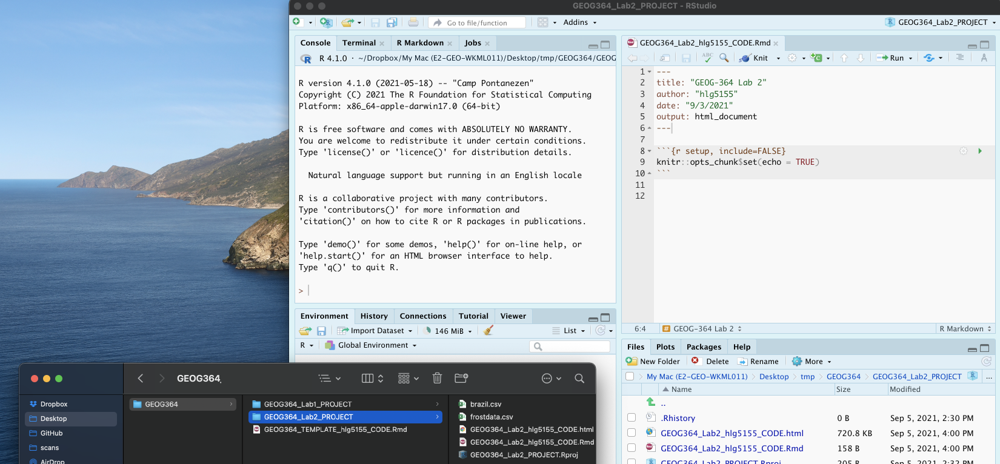

<style>
p.comment {
background-color: #DBDBDB;
padding: 10px;
border: 1px solid black;
margin-left: 0px;
border-radius: 5px;
font-style: normal;
}

h1.title {
  font-weight: bold;
  font-family: Arial;  
}

h2.title {
  font-family: Arial;  
}

</style>


<style type="text/css">
#TOC {
  font-size: 12px;
  font-family: Arial;
}
</style>

\


## Welcome to Lab 2!

<br>

The aim of this lab is to start looking at tables of data and to apply z-scores and t-tests on frost days in the USA.  

We will also be creating a lab script template that makes life easier in the future. As before, much of this is based on tutorials that I will point you to as we go through. By the end of this lab you will be able to:

 - 1. Make a markdown template
 - 2. Read in data from an excel file
 - 3. Conduct exploratory data analysis
 - 4. Wrangle a table of data
 - 5. Make initial plots and maps

Assignment 2 is due by midnight the night before your next lab on Canvas. Your job is to submit the requirements on this page.

See [**this page**](https://psu.instructure.com/courses/2120046/assignments/13274834) or go to canvas for assignment guidelines.

<p class="comment">**Need help?**  Add a screenshot/question to the discussion board here:    [**LAB 2 DISCUSSION BOARD**](https://psu.instructure.com/courses/2120046/discussion_topics/14125699)</p>

<br>
<br>  

## Step A: Make a lab script template

Setting up your markdown files takes time and can get repetitive. Making a template skips a lot of future set up. 

To to this, we are going to follow these steps:

 - A1 Set up the lab
 - A2 Understand and edit YAML code
 - A3 Load libraries
 - A4 Edit code chunk options to remove library output from your html files
 - A5 Save your lab script template 
  
<br>  

### A1. Set up the lab

First, we want to set up R in the same way as Lab 1, creating a project file and a blank markdown document.

1. [ ] Open R-Studio.<br>Create a new R-Project in your GEOG-364 folder called `GEOG364_Lab2_PROJECT`.<br>*Reminder: [Tutorial 2C: Projects](https://psu-spatial.github.io/Geog364-2021/pg_Tut2_startup.html)*.   
   
<br>  

2. [ ] Go on Canvas to the Lab 2 page and download the two datasets (frostdata.xlsx and NewYork.xslx).<br>Put them in your `GEOG364_Lab2_PROJECT` folder.

<br>  

3. [ ] We forgot to install some packages!<br>Go to to the packages tab, click install and download/install the `readxl`, `usmap`, `viridis` and the `ggstatsplot` packages.<br>*Reminder: [Tutorial 2B: Packages](https://psu-spatial.github.io/Geog364-2021/pg_Tut2_startup.html)* *and/or* *[Tutorial 3G: Packages cheatsheet](https://psu-spatial.github.io/Geog364-2021/pg_Tut3_basics.html#Tutorial_3G:_Packages)*.
   
<br>  

4. [ ] Create a new RMarkdown file titled `GEOG-364 Lab 2` and set the author name to your USER-ID e.g. hlg5155<br>We are doing this so that we can grade more anonymously.<br>*Reminder: [Tutorial 4B: Create a Markdown Doc](https://psu-spatial.github.io/Geog364-2021/pg_Tut4_markdown.html#Tutorial_4B:_Creating_a_markdown_document).* 
 
<br>  

5. [ ]  Delete all the text below line 11.<br>Press knit and save as `GEOG364_Lab2_userID_CODE.Rmd` e.g. for me `GEOG364_Lab2_hlg5155_CODE.Rmd`

<br>  

**Your R-Studio screen should look something like this. IF NOT, STOP AND TALK TO A TEACHER.** 
 


<br>  
 
### A2. Understand and edit your YAML code

Our output still looks pretty boring when we knit. Work through Markdown [Tutorial 4C, D and E](https://psu-spatial.github.io/Geog364-2021/pg_Tut4_markdown.html) to understand and edit your YAML code.

6. [ ]  Use the tutorial to change your YAML code to match the text in the tutorial. Your code should now include at a minimum
 
   + A floating table of contents (will appear as you add headings)
   + Auto-numbering sections 
   + A theme of your choice that's not lumen
 
<br>

### A3: Load libraries

We downloaded & installed many libraries last week.  As discussed, even though they are downloaded, we need to load them EVERY TIME we want to use them (in the way you click on an app on your phone before you can use it).  

It's best to do this at the the start of each script, so let's do this now. 

7. [ ] Click on your lab script (the Rmd file) after line 11.<br>Press enter a few times and make a new level-1 heading called `# Load Libraries`.<br>*[Reminder on headings: Tutorial 2G](https://psu-spatial.github.io/Geog364-2021/pg_Tut2_startup.html)*.  

<br>

8. [ ] Press enter a few times, then make a new code chunk containing this code.
   
   ```r
   library(tidyverse)
   library(sp)
   library(sf)
   library(readxl)
   library(skimr)
   library(tmap)
   library(USAboundaries)
   library(viridis)
   ```
  
<br>

9. [ ] Press the green arrow on the right of the code chunk to run the code inside it.<br>You will see a load of "welcome text" telling your details about the packages you just loaded.<br>Press the green arrow AGAIN. The text should disappear unless there is an error.<br>YOU NEED TO RE-RUN THIS CODE CHUNK EVERY TIME YOU OPEN R.  

 
<br>
 
### A4: Edit code chunk options

Press knit. You should see that all the "welcome text" has come back, making your report look unprofessional. 

Let's remove this by editing our code chunk options.  

10. [ ] Follow [Tutorial 4F](https://psu-spatial.github.io/Geog364-2021/pg_Tut4_markdown.html) to edit your global code chunk options to remove messages and warnings.


<br>
 
### A5: Save your lab script template

<p class="comment">Your lab script should now look like this, but with your theme and YAML options of choice (you might have a few different libraries than in my screenshot).  You should also be able to knit it successfully. If not, go back and do the previous sections!</p>

<br>


<br> 

You can use steps A1-A5 for every new lab to set up your lab script.  But it is much easier to save the file we have just created as a template, then in future labs we can just make a copy.  To do this quickly:

<br>  

11. [ ]  Go to the files tab (R should be "looking" in your Lab 2 folder).  
   a. Check the box by `GEOG364_Lab2_userID_CODE.Rmd` (with your ID)
   b. Now click on the More menu, then "Copy To".  
   c. Make a copy in your main GEOG-364 folder called `GEOG364_TEMPLATE_userID_CODE.Rmd`. 
   d. If you're on R-Studio-Cloud, just make a copy in the same folder.


 
<br>  


## Step B: Last Frost Date Analysis 

Now, the lab!   This section is based on data from Chapter 6 of the textbook.  Specifically we are going to conduct some exploratory data analysis on average last spring frost dates across the South East USA.

To to this, we are going to follow these steps:

 - B1 Investigate the topic before touching the data
 - B2 Read the excel file containing the data into R
 - B3 Calculate summary statistics and "wrangle" the data
 - B4 Calculate the z-score for each location
 - B5 Make some intial plots
 - B6 Make some intial maps
 - B7 Calculate a t-test

<br> 

### B1: Exploratory Investigations

**Before we touch any data, it's important to start with words.  We need to summarise what we already know about the dataset, the population under study and any important context.**

The aim of this lab is to analyse the "average last frost dates" obtained from weather stations across the South Eastern USA.  E.g. what day of year, _on average_, is the final day to get frost. See chapter 6 of the textbook for a brief summary.

The textbook (and us) are using data obtained from this dissertation to assess the spatial distribution of average spring frost dates:  *Parnell, 2005, "A Climatology of Frost Extremes Across the Southeast United States, 1950–2009":*<br> **https://www.proquest.com/openview/d5a7301f0cbe941ead48c96888f791b8/1?pq-origsite=gscholar&cbl=18750&diss=y**

<br>

12. [ ] Choose any state out of Alabama, Florida, Georgia, North Carolina, South Carolina or Virginia.<br>*Choose a different state to your friends*

<br>

13. [ ] Read the abstract of the study above to understand the dataset *(click the link and skim read pages iv and v, e.g. the bit before the table of contents)*. 

<br> 

14. [ ] In your script, press enter a few times, then make a new level-1 heading called `Last Spring Frost` and press enter a few times.*I'm going to stop saying, "press enter a few times", or "add a blank line" now. Keep doing it!*

<br>

15. [ ] In the text below, briefly summarise the topic and data (imagine you are asked to summarise in class)<br>For example you could summarise:
     + What topic/question are we studying?
     + What is the context?  Why was the original study conducted?
     + Specifically, what data are we using?  What is the unit of observation?
     + What are the constraints/boundaries of the data (e.g. it's an average across which years? Over what time-period?)
     + Anything else that might be relevant to someone analysing the data
     + Given the topic, are there any confounding variables, or things we should be thinking about. E.g. why might I be concerned about climate change looking at a single average last frost?
    

**Note,there is a spell check next to the knit button at the top of the script and press knit regularly to check it all looks good**     

<br> 

### B2: Read in the frostdata excel file

Go to your lab 2 folder. Double click `frostdata.xslx` to open it in excel and take a look at the data.<br>We now want to load this into R.

You should see a spreadsheet/table/data.frame with these columns:
  
  - *Station*: The name of the weather station             
  - *State*: The US State that the station resides in   
  - *Type_Fake*: A synthetic column I added to put in a "type" of station
  - *Latitude*: The latitude of the station (degrees)             
  - *Longitude*: The longitude of the station (degrees)      
  - *Elevation*: The elevation of the station (feet)      
  - *Dist_to_Coast*: The distance from the station to the coast (miles)    
  - *Avg_DOY_SpringFrost*: The Day-Of-Year of the average final spring frost date for that station
  
When I say Day-Of-Year, I mean a number from 1-365 representing the month/day of the year e.g. Jan-1:1, Jan-2:2... Jan-31:31, Feb-1:32... Dec-31:365.  We use this number instead of the month/day because its easier to analyse.

16. [ ] Use [Tutorial 6A](https://psu-spatial.github.io/Geog364-2021/pg_Tut6_input_output.html) to read the data into R and save as a variable called `frost`.

<br>

17. [ ] Take a look at the data.  To view the data as a spreadsheet like you did in excel:
    a. Either, go to the environment quadrant and click on its NAME (e.g. click the *word* frost not the blue arrow)
    b. Or.. use the command `View(frost)`.
    
<br>

### B3. Summary Statistics

Make a new level-2 heading called `Summary Statistics` e.g *## Summary Statisics*

<br>

#### B3.1 General summaries

18. [ ]  Create a new code chunk.  Apply the `glimpse()` command to the frost variable


19. [ ]  Create a new code chunk.  Apply the `skim()` command to the frost variable
 

20. [ ]  In the text below the code chunk, use your knowledge from your reading, this lab script and the skim command output, to summarise the dataset for someone who has never seen it before (e.g. FULL SENTENCES), including:

    - A specification of the unit-of-observation under study (as specific as possible). E.g. what does each row represent
    - What attributes/information we know about each unit?  E.g. what columns do we have
    - A description of each column & units as a bullet point/numbered list<br>*Help here: https://www.markdownguide.org/basic-syntax/*
    - The number of units in our sample (e.g. the number of rows)
    - The mean longitude
    - The standard deviation of the distance to the coast
    - Your chosen State.

<br> 

#### B3.2 Specific columns

Sometimes we want to deal with only one specific column in our spreadsheet/dataframe, for example applying the mean, standard deviation, inter-quartile range command to say just the distance_to_the_coast. 

To do this, we use the $ symbol. For example, here I'm simply selecting the data in the elevation column only and saving it to a new variable called elevationdata.


```r
elevationdata <- frost$Elevation
```

Try it yourself.  You should have seen that as you typed the $, it gave you all the available column names to choose from.

<br>

This means we can now easily summarise specific columns. For example: 

 - `summary(frost)` will create a summary of the whole spreadsheet, 
 - `summary(frost$Longitude)` will only summarise the Longitude column.  
 - `mean(frost$Dist_to_Coast)` will take the mean of the Dist_to_Coast column in the frost dataframe.  
 
 <br>

21. [ ]  Press enter a few times and make a new code chunk.  Inside, calculate:<br>
    - The mean of the Longitude column in the frost dataframe
    - The minimum distance to the coast using the `min` command.<br>*E.g. apply the `min` command to the `Dist_to_Coast` column of the frost dataframe*
    - The median climatological frost date.<br>*E.g. apply the `median` command to the `Avg_DOY_SpringFrost` column of the frost dataframe* (bonus - explain what the median is)
    - The interquartile range of the Latitude of the frost data (hint, google the command)

<br>

#### B3.2 Summaries by group

Make a new level 2 sub-heading called `Group statistics`.

<br> 

##### The table command

Sometimes we want to count the occurrences of some category in our dataset.  For example, if you look at the frost dataset, it might be interesting to know how many stations were in each US State.  To do this, we use the table command: 
We can use the table command to assess how many rows of our data.frame/spreadsheet fall into different groups.  See  [Tutorial 7B](https://psu-spatial.github.io/Geog364-2021/pg_Tut7_wrangle.html) for how to use it and some online tutorials.

22. [ ]  Use the table command on the State column of the frost dataframe.<br>In the text below the code chunk, in full sentences, tell me how many stations are in the US-State you chose in Step 14.<br>

<br> 

23. [ ]  Now create a two-way table of the `State` column vs the `Type_Fake` column.<br>In the text below the code chunk, in full sentences, tell me how many agricultural stations are in your chosen tate.

<br> 

##### Statistics by group

What if we want to do more than just count the number of rows?  Well, we can use the `group_by()` and `summarise()` commands and save the answer to a new variable.  

See  [Tutorial 7C](https://psu-spatial.github.io/Geog364-2021/pg_Tut7_wrangle.html) for a worked example.

24. [ ]  Copy/tweak the code in tutorial 7c to:
      + split the frost dataframe by the `State` column, 
      + Calculate the maximum, minimum and mean average spring final frost day (`Avg_DOY_SpringFrost`) 
      + save the result as a new variable called `frost.summary.state`.
      + print the results 
      + Using your output, write under the code chunk in a full sentence what the mean spring final frost Day of Year is for your chosen state.     
     

#### B3.3 Histograms

Sometimes it's just nice to visualise a distribution, using a histogram.  You can see tiny mini ones for each variable/column in the output of the skim command, but let's make something more professional.

<br>

25. [ ] Using [Tutorial 10A](https://psu-spatial.github.io/Geog364-2021/pg_Tut10_plot.html), create a histogram of the Elevation column in the frost dataset.  be as creative/professional as possible.

<br>


#### B3.4 Testing Normality

For many applications, we also want to assess whether our data has a specific distribution or not (for example, normal, exponential..).  We can do this using a plot called a QQ-plot (quantile-quantile plot) and statistical tests such as the Wilks-Shapiro test for normality. 

This is covered in [Tutorial 9A](https://psu-spatial.github.io/Geog364-2021/pg_Tut9_dist_stats.html#Tutorial_9A:_Testing_normality)

26. [ ] Using a QQ-Norm plot and referring back to your histogram, describe the distribution and assess the normality of the the Elevation column of the frost data.

<br>

### B4 Creating z-scores

Make a new level-2 heading called `Z-Score mapping`

In the lecture, we talked about finding z-scores (e.g. how unusual a value is AKA how many standard deviations away from the mean).  Let's calculate a new column in our dataset with the z-score of the last spring frost date.  

27. [ ]  Create a new code chunk and copy/run this code.
    
    ```r
    mean.frost <- mean(frost$Avg_DOY_SpringFrost)
    sd.frost <- sd(frost$Avg_DOY_SpringFrost)
    
    frost$ZScore <- (frost$Avg_DOY_SpringFrost - mean.frost) / sd.frost
    ```

Hopefully you can see that we're just applying the Z-score equation to each row of the Avg_DOY_SpringFrost column of the frost dataset:

<p align="center">

</p>


Have a look at the frost table itself (e.g. click on its name in the environment tab), or look at the summary. you should see the new column. Essentially the ZScore column now contains a normalised value of how unusually early or late that location is.

<br>

### B5 Spatial mapping

Make a new level 2 sub-heading called `Mapping`.

So far, we have ignored the fact our data has a location!  We will cover this in more detail in lab 3, but for now, let's make a quick map.  To do this, we need to make R realise that our data contains spatial coordinates.

Create a new code chunk and add this code:

28. [ ]  Create a code chunk and copy/run this code. WE will discuss this in detail next week.
    
    ```r
    frost.sf <- st_as_sf(frost,coords = c("Longitude", "Latitude"),crs=4326)
    ```

<br>

The QTM command allows us to make  quick interactive plots.

29. [ ]  Create a code chunk and copy/run this code. It should make an interactive map of the Elevation column. Tweak the code to map your z-scores AKA recreate the map in Chapter 6 of the textbook.

    
    ```r
    tmap_mode("view")
    qtm(frost.sf,dots.col="Elevation")
    ```
    
    ```{=html}
    <div id="htmlwidget-5ac47ac030054a071275" style="width:672px;height:480px;" class="leaflet html-widget"></div>
    <script type="application/json" data-for="htmlwidget-5ac47ac030054a071275">{"x":{"options":{"crs":{"crsClass":"L.CRS.EPSG3857","code":null,"proj4def":null,"projectedBounds":null,"options":{}}},"calls":[{"method":"createMapPane","args":["tmap401",401]},{"method":"createMapPane","args":["tmap402",402]},{"method":"addProviderTiles","args":["Esri.WorldGrayCanvas",null,"Esri.WorldGrayCanvas",{"minZoom":0,"maxZoom":18,"tileSize":256,"subdomains":"abc","errorTileUrl":"","tms":false,"noWrap":false,"zoomOffset":0,"zoomReverse":false,"opacity":1,"zIndex":1,"detectRetina":false,"pane":"tilePane"}]},{"method":"addProviderTiles","args":["OpenStreetMap",null,"OpenStreetMap",{"minZoom":0,"maxZoom":18,"tileSize":256,"subdomains":"abc","errorTileUrl":"","tms":false,"noWrap":false,"zoomOffset":0,"zoomReverse":false,"opacity":1,"zIndex":1,"detectRetina":false,"pane":"tilePane"}]},{"method":"addProviderTiles","args":["Esri.WorldTopoMap",null,"Esri.WorldTopoMap",{"minZoom":0,"maxZoom":18,"tileSize":256,"subdomains":"abc","errorTileUrl":"","tms":false,"noWrap":false,"zoomOffset":0,"zoomReverse":false,"opacity":1,"zIndex":1,"detectRetina":false,"pane":"tilePane"}]},{"method":"addCircleMarkers","args":[[34.57,32.02,34.17,30.67,30.18,32.87,35.92,36.5,33.98,32.78,34.93,34.2,34.08,34.67,30.72,36.98,36.02,37.3,35.88,35.2,33.92,36.1,35.52,37.33,36.32,35.07,34.63,33.83,36.58,34.3,34.73,35.4,33.03,33.93,34.98,32.68,35.78,34.37,32.13,31.17,34.63,35.92,35.73,33.5,34,31.98,34.5,35.67,29.17,34.2,28.8,31.25,35.33,33.4,35.8,34.53,33.73,35.48,34.75,32.2,35.03,33.08,34.58,32.28,31.45,30.78,33.6,34.3,31.53,30.4,32.68,33.45,34.25,31.8,34.67,33.42],[-85.62,-85.75,-86.82,-81.47,-82.6,-85.18,-79.08,-80.65,-81.02,-79.93,-81.03,-81.42,-82.58,-82.82,-86.1,-79.9,-76.55,-77.28,-77.53,-77.55,-78.02,-78.3,-78.35,-78.38,-78.43,-78.87,-79.03,-79.05,-79.38,-79.88,-79.88,-80.2,-80.23,-80.35,-80.52,-80.92,-80.93,-81.1,-81.22,-81.5,-81.52,-81.53,-81.67,-81.7,-81.77,-81.95,-82.02,-82.03,-82.08,-82.17,-82.32,-82.32,-82.45,-82.62,-82.67,-82.67,-82.7,-82.97,-83.08,-83.2,-83.2,-83.25,-83.33,-83.47,-83.48,-83.57,-83.85,-83.87,-84.15,-84.35,-84.52,-84.82,-85.15,-85.97,-86.05,-86.13],[2.82842712474619,2.82842712474619,2.82842712474619,2.82842712474619,2.82842712474619,2.82842712474619,2.82842712474619,2.82842712474619,2.82842712474619,2.82842712474619,2.82842712474619,2.82842712474619,2.82842712474619,2.82842712474619,2.82842712474619,2.82842712474619,2.82842712474619,2.82842712474619,2.82842712474619,2.82842712474619,2.82842712474619,2.82842712474619,2.82842712474619,2.82842712474619,2.82842712474619,2.82842712474619,2.82842712474619,2.82842712474619,2.82842712474619,2.82842712474619,2.82842712474619,2.82842712474619,2.82842712474619,2.82842712474619,2.82842712474619,2.82842712474619,2.82842712474619,2.82842712474619,2.82842712474619,2.82842712474619,2.82842712474619,2.82842712474619,2.82842712474619,2.82842712474619,2.82842712474619,2.82842712474619,2.82842712474619,2.82842712474619,2.82842712474619,2.82842712474619,2.82842712474619,2.82842712474619,2.82842712474619,2.82842712474619,2.82842712474619,2.82842712474619,2.82842712474619,2.82842712474619,2.82842712474619,2.82842712474619,2.82842712474619,2.82842712474619,2.82842712474619,2.82842712474619,2.82842712474619,2.82842712474619,2.82842712474619,2.82842712474619,2.82842712474619,2.82842712474619,2.82842712474619,2.82842712474619,2.82842712474619,2.82842712474619,2.82842712474619,2.82842712474619],["Valley","Union","Saint","Fernandina","Lake","West","Chapel","Mt","Columbia","Charlestown","Winthrop","Little","Calhoun","Clemson","De","Rocky","Edenton","Hopewell","Tarboro","Kinston","Southport","Louisburg","Smithfield","Farmville","Henderson","Fayetteville","Lumberton","Conway","Danville","Darlington","Cheraw","Albemarle","Summerville","Sumter","Monroe","Yemassee","Statesville","Winnsboro","Savannah","Brunswick","Santuck","Lenoir","Morganton","Aiken","Saluda","Glennville","Laurens","Marion","Ocala","Greenwood","Inverness","Waycross","Hendersonville","Warrenton","Marshall","Anderson","Washington","Waynesville","Walhalla","Eastman","Highlands","Milledgeville","Toccoa","Hawkinsville","Tifton","Quitman","Covington","Gainesville","Albany","Tallahassee","Talbotton","Newnan","Rome","Troy","Scottsboro","Talladega"],"frost.sf",{"interactive":true,"className":"","pane":"tmap401","stroke":true,"color":"#666666","weight":1,"opacity":0.5,"fill":true,"fillColor":["#FECF66","#FFFBD4","#FEECA5","#FFFBD4","#FFFBD4","#FEECA5","#FEECA5","#FECF66","#FFFBD4","#FFFBD4","#FEECA5","#FEECA5","#FEECA5","#FEECA5","#FFFBD4","#FECF66","#FFFBD4","#FFFBD4","#FFFBD4","#FFFBD4","#FFFBD4","#FFFBD4","#FFFBD4","#FFFBD4","#FEECA5","#FFFBD4","#FFFBD4","#FFFBD4","#FFFBD4","#FFFBD4","#FFFBD4","#FEECA5","#FFFBD4","#FFFBD4","#FEECA5","#FFFBD4","#FEECA5","#FEECA5","#FFFBD4","#FFFBD4","#FEECA5","#FECF66","#FECF66","#FEECA5","#FFFBD4","#FFFBD4","#FEECA5","#FECF66","#FFFBD4","#FEECA5","#FFFBD4","#FFFBD4","#EC7114","#FFFBD4","#EC7114","#FEECA5","#FEECA5","#C74A02","#FEECA5","#FFFBD4","#8E3004","#FFFBD4","#FECF66","#FFFBD4","#FFFBD4","#FFFBD4","#FEECA5","#FECF66","#FFFBD4","#FFFBD4","#FEECA5","#FEECA5","#FEECA5","#FEECA5","#FEECA5","#FFFBD4"],"fillOpacity":[1,1,1,1,1,1,1,1,1,1,1,1,1,1,1,1,1,1,1,1,1,1,1,1,1,1,1,1,1,1,1,1,1,1,1,1,1,1,1,1,1,1,1,1,1,1,1,1,1,1,1,1,1,1,1,1,1,1,1,1,1,1,1,1,1,1,1,1,1,1,1,1,1,1,1,1]},null,null,["<style> div.leaflet-popup-content {width:auto !important;overflow-y:auto; overflow-x:hidden;}<\/style><div style=\"max-height:25em;padding-right:0px;\"><table>\n\t\t\t   <thead><tr><th colspan=\"2\"><b>Valley<\/b><\/th><\/thead><\/tr><tr><td style=\"color: #888888;\"><nobr>Elevation<\/nobr><\/td><td align=\"right\"><nobr>1,020<\/nobr><\/td><\/tr><\/table><\/div>","<style> div.leaflet-popup-content {width:auto !important;overflow-y:auto; overflow-x:hidden;}<\/style><div style=\"max-height:25em;padding-right:0px;\"><table>\n\t\t\t   <thead><tr><th colspan=\"2\"><b>Union<\/b><\/th><\/thead><\/tr><tr><td style=\"color: #888888;\"><nobr>Elevation<\/nobr><\/td><td align=\"right\"><nobr>440<\/nobr><\/td><\/tr><\/table><\/div>","<style> div.leaflet-popup-content {width:auto !important;overflow-y:auto; overflow-x:hidden;}<\/style><div style=\"max-height:25em;padding-right:0px;\"><table>\n\t\t\t   <thead><tr><th colspan=\"2\"><b>Saint<\/b><\/th><\/thead><\/tr><tr><td style=\"color: #888888;\"><nobr>Elevation<\/nobr><\/td><td align=\"right\"><nobr>800<\/nobr><\/td><\/tr><\/table><\/div>","<style> div.leaflet-popup-content {width:auto !important;overflow-y:auto; overflow-x:hidden;}<\/style><div style=\"max-height:25em;padding-right:0px;\"><table>\n\t\t\t   <thead><tr><th colspan=\"2\"><b>Fernandina<\/b><\/th><\/thead><\/tr><tr><td style=\"color: #888888;\"><nobr>Elevation<\/nobr><\/td><td align=\"right\"><nobr>13<\/nobr><\/td><\/tr><\/table><\/div>","<style> div.leaflet-popup-content {width:auto !important;overflow-y:auto; overflow-x:hidden;}<\/style><div style=\"max-height:25em;padding-right:0px;\"><table>\n\t\t\t   <thead><tr><th colspan=\"2\"><b>Lake<\/b><\/th><\/thead><\/tr><tr><td style=\"color: #888888;\"><nobr>Elevation<\/nobr><\/td><td align=\"right\"><nobr>195<\/nobr><\/td><\/tr><\/table><\/div>","<style> div.leaflet-popup-content {width:auto !important;overflow-y:auto; overflow-x:hidden;}<\/style><div style=\"max-height:25em;padding-right:0px;\"><table>\n\t\t\t   <thead><tr><th colspan=\"2\"><b>West<\/b><\/th><\/thead><\/tr><tr><td style=\"color: #888888;\"><nobr>Elevation<\/nobr><\/td><td align=\"right\"><nobr>575<\/nobr><\/td><\/tr><\/table><\/div>","<style> div.leaflet-popup-content {width:auto !important;overflow-y:auto; overflow-x:hidden;}<\/style><div style=\"max-height:25em;padding-right:0px;\"><table>\n\t\t\t   <thead><tr><th colspan=\"2\"><b>Chapel<\/b><\/th><\/thead><\/tr><tr><td style=\"color: #888888;\"><nobr>Elevation<\/nobr><\/td><td align=\"right\"><nobr>500<\/nobr><\/td><\/tr><\/table><\/div>","<style> div.leaflet-popup-content {width:auto !important;overflow-y:auto; overflow-x:hidden;}<\/style><div style=\"max-height:25em;padding-right:0px;\"><table>\n\t\t\t   <thead><tr><th colspan=\"2\"><b>Mt<\/b><\/th><\/thead><\/tr><tr><td style=\"color: #888888;\"><nobr>Elevation<\/nobr><\/td><td align=\"right\"><nobr>1,041<\/nobr><\/td><\/tr><\/table><\/div>","<style> div.leaflet-popup-content {width:auto !important;overflow-y:auto; overflow-x:hidden;}<\/style><div style=\"max-height:25em;padding-right:0px;\"><table>\n\t\t\t   <thead><tr><th colspan=\"2\"><b>Columbia<\/b><\/th><\/thead><\/tr><tr><td style=\"color: #888888;\"><nobr>Elevation<\/nobr><\/td><td align=\"right\"><nobr>242<\/nobr><\/td><\/tr><\/table><\/div>","<style> div.leaflet-popup-content {width:auto !important;overflow-y:auto; overflow-x:hidden;}<\/style><div style=\"max-height:25em;padding-right:0px;\"><table>\n\t\t\t   <thead><tr><th colspan=\"2\"><b>Charlestown<\/b><\/th><\/thead><\/tr><tr><td style=\"color: #888888;\"><nobr>Elevation<\/nobr><\/td><td align=\"right\"><nobr>10<\/nobr><\/td><\/tr><\/table><\/div>","<style> div.leaflet-popup-content {width:auto !important;overflow-y:auto; overflow-x:hidden;}<\/style><div style=\"max-height:25em;padding-right:0px;\"><table>\n\t\t\t   <thead><tr><th colspan=\"2\"><b>Winthrop<\/b><\/th><\/thead><\/tr><tr><td style=\"color: #888888;\"><nobr>Elevation<\/nobr><\/td><td align=\"right\"><nobr>690<\/nobr><\/td><\/tr><\/table><\/div>","<style> div.leaflet-popup-content {width:auto !important;overflow-y:auto; overflow-x:hidden;}<\/style><div style=\"max-height:25em;padding-right:0px;\"><table>\n\t\t\t   <thead><tr><th colspan=\"2\"><b>Little<\/b><\/th><\/thead><\/tr><tr><td style=\"color: #888888;\"><nobr>Elevation<\/nobr><\/td><td align=\"right\"><nobr>711<\/nobr><\/td><\/tr><\/table><\/div>","<style> div.leaflet-popup-content {width:auto !important;overflow-y:auto; overflow-x:hidden;}<\/style><div style=\"max-height:25em;padding-right:0px;\"><table>\n\t\t\t   <thead><tr><th colspan=\"2\"><b>Calhoun<\/b><\/th><\/thead><\/tr><tr><td style=\"color: #888888;\"><nobr>Elevation<\/nobr><\/td><td align=\"right\"><nobr>530<\/nobr><\/td><\/tr><\/table><\/div>","<style> div.leaflet-popup-content {width:auto !important;overflow-y:auto; overflow-x:hidden;}<\/style><div style=\"max-height:25em;padding-right:0px;\"><table>\n\t\t\t   <thead><tr><th colspan=\"2\"><b>Clemson<\/b><\/th><\/thead><\/tr><tr><td style=\"color: #888888;\"><nobr>Elevation<\/nobr><\/td><td align=\"right\"><nobr>824<\/nobr><\/td><\/tr><\/table><\/div>","<style> div.leaflet-popup-content {width:auto !important;overflow-y:auto; overflow-x:hidden;}<\/style><div style=\"max-height:25em;padding-right:0px;\"><table>\n\t\t\t   <thead><tr><th colspan=\"2\"><b>De<\/b><\/th><\/thead><\/tr><tr><td style=\"color: #888888;\"><nobr>Elevation<\/nobr><\/td><td align=\"right\"><nobr>245<\/nobr><\/td><\/tr><\/table><\/div>","<style> div.leaflet-popup-content {width:auto !important;overflow-y:auto; overflow-x:hidden;}<\/style><div style=\"max-height:25em;padding-right:0px;\"><table>\n\t\t\t   <thead><tr><th colspan=\"2\"><b>Rocky<\/b><\/th><\/thead><\/tr><tr><td style=\"color: #888888;\"><nobr>Elevation<\/nobr><\/td><td align=\"right\"><nobr>1,315<\/nobr><\/td><\/tr><\/table><\/div>","<style> div.leaflet-popup-content {width:auto !important;overflow-y:auto; overflow-x:hidden;}<\/style><div style=\"max-height:25em;padding-right:0px;\"><table>\n\t\t\t   <thead><tr><th colspan=\"2\"><b>Edenton<\/b><\/th><\/thead><\/tr><tr><td style=\"color: #888888;\"><nobr>Elevation<\/nobr><\/td><td align=\"right\"><nobr>10<\/nobr><\/td><\/tr><\/table><\/div>","<style> div.leaflet-popup-content {width:auto !important;overflow-y:auto; overflow-x:hidden;}<\/style><div style=\"max-height:25em;padding-right:0px;\"><table>\n\t\t\t   <thead><tr><th colspan=\"2\"><b>Hopewell<\/b><\/th><\/thead><\/tr><tr><td style=\"color: #888888;\"><nobr>Elevation<\/nobr><\/td><td align=\"right\"><nobr>40<\/nobr><\/td><\/tr><\/table><\/div>","<style> div.leaflet-popup-content {width:auto !important;overflow-y:auto; overflow-x:hidden;}<\/style><div style=\"max-height:25em;padding-right:0px;\"><table>\n\t\t\t   <thead><tr><th colspan=\"2\"><b>Tarboro<\/b><\/th><\/thead><\/tr><tr><td style=\"color: #888888;\"><nobr>Elevation<\/nobr><\/td><td align=\"right\"><nobr>35<\/nobr><\/td><\/tr><\/table><\/div>","<style> div.leaflet-popup-content {width:auto !important;overflow-y:auto; overflow-x:hidden;}<\/style><div style=\"max-height:25em;padding-right:0px;\"><table>\n\t\t\t   <thead><tr><th colspan=\"2\"><b>Kinston<\/b><\/th><\/thead><\/tr><tr><td style=\"color: #888888;\"><nobr>Elevation<\/nobr><\/td><td align=\"right\"><nobr>24<\/nobr><\/td><\/tr><\/table><\/div>","<style> div.leaflet-popup-content {width:auto !important;overflow-y:auto; overflow-x:hidden;}<\/style><div style=\"max-height:25em;padding-right:0px;\"><table>\n\t\t\t   <thead><tr><th colspan=\"2\"><b>Southport<\/b><\/th><\/thead><\/tr><tr><td style=\"color: #888888;\"><nobr>Elevation<\/nobr><\/td><td align=\"right\"><nobr>20<\/nobr><\/td><\/tr><\/table><\/div>","<style> div.leaflet-popup-content {width:auto !important;overflow-y:auto; overflow-x:hidden;}<\/style><div style=\"max-height:25em;padding-right:0px;\"><table>\n\t\t\t   <thead><tr><th colspan=\"2\"><b>Louisburg<\/b><\/th><\/thead><\/tr><tr><td style=\"color: #888888;\"><nobr>Elevation<\/nobr><\/td><td align=\"right\"><nobr>260<\/nobr><\/td><\/tr><\/table><\/div>","<style> div.leaflet-popup-content {width:auto !important;overflow-y:auto; overflow-x:hidden;}<\/style><div style=\"max-height:25em;padding-right:0px;\"><table>\n\t\t\t   <thead><tr><th colspan=\"2\"><b>Smithfield<\/b><\/th><\/thead><\/tr><tr><td style=\"color: #888888;\"><nobr>Elevation<\/nobr><\/td><td align=\"right\"><nobr>150<\/nobr><\/td><\/tr><\/table><\/div>","<style> div.leaflet-popup-content {width:auto !important;overflow-y:auto; overflow-x:hidden;}<\/style><div style=\"max-height:25em;padding-right:0px;\"><table>\n\t\t\t   <thead><tr><th colspan=\"2\"><b>Farmville<\/b><\/th><\/thead><\/tr><tr><td style=\"color: #888888;\"><nobr>Elevation<\/nobr><\/td><td align=\"right\"><nobr>450<\/nobr><\/td><\/tr><\/table><\/div>","<style> div.leaflet-popup-content {width:auto !important;overflow-y:auto; overflow-x:hidden;}<\/style><div style=\"max-height:25em;padding-right:0px;\"><table>\n\t\t\t   <thead><tr><th colspan=\"2\"><b>Henderson<\/b><\/th><\/thead><\/tr><tr><td style=\"color: #888888;\"><nobr>Elevation<\/nobr><\/td><td align=\"right\"><nobr>512<\/nobr><\/td><\/tr><\/table><\/div>","<style> div.leaflet-popup-content {width:auto !important;overflow-y:auto; overflow-x:hidden;}<\/style><div style=\"max-height:25em;padding-right:0px;\"><table>\n\t\t\t   <thead><tr><th colspan=\"2\"><b>Fayetteville<\/b><\/th><\/thead><\/tr><tr><td style=\"color: #888888;\"><nobr>Elevation<\/nobr><\/td><td align=\"right\"><nobr>96<\/nobr><\/td><\/tr><\/table><\/div>","<style> div.leaflet-popup-content {width:auto !important;overflow-y:auto; overflow-x:hidden;}<\/style><div style=\"max-height:25em;padding-right:0px;\"><table>\n\t\t\t   <thead><tr><th colspan=\"2\"><b>Lumberton<\/b><\/th><\/thead><\/tr><tr><td style=\"color: #888888;\"><nobr>Elevation<\/nobr><\/td><td align=\"right\"><nobr>131<\/nobr><\/td><\/tr><\/table><\/div>","<style> div.leaflet-popup-content {width:auto !important;overflow-y:auto; overflow-x:hidden;}<\/style><div style=\"max-height:25em;padding-right:0px;\"><table>\n\t\t\t   <thead><tr><th colspan=\"2\"><b>Conway<\/b><\/th><\/thead><\/tr><tr><td style=\"color: #888888;\"><nobr>Elevation<\/nobr><\/td><td align=\"right\"><nobr>20<\/nobr><\/td><\/tr><\/table><\/div>","<style> div.leaflet-popup-content {width:auto !important;overflow-y:auto; overflow-x:hidden;}<\/style><div style=\"max-height:25em;padding-right:0px;\"><table>\n\t\t\t   <thead><tr><th colspan=\"2\"><b>Danville<\/b><\/th><\/thead><\/tr><tr><td style=\"color: #888888;\"><nobr>Elevation<\/nobr><\/td><td align=\"right\"><nobr>410<\/nobr><\/td><\/tr><\/table><\/div>","<style> div.leaflet-popup-content {width:auto !important;overflow-y:auto; overflow-x:hidden;}<\/style><div style=\"max-height:25em;padding-right:0px;\"><table>\n\t\t\t   <thead><tr><th colspan=\"2\"><b>Darlington<\/b><\/th><\/thead><\/tr><tr><td style=\"color: #888888;\"><nobr>Elevation<\/nobr><\/td><td align=\"right\"><nobr>150<\/nobr><\/td><\/tr><\/table><\/div>","<style> div.leaflet-popup-content {width:auto !important;overflow-y:auto; overflow-x:hidden;}<\/style><div style=\"max-height:25em;padding-right:0px;\"><table>\n\t\t\t   <thead><tr><th colspan=\"2\"><b>Cheraw<\/b><\/th><\/thead><\/tr><tr><td style=\"color: #888888;\"><nobr>Elevation<\/nobr><\/td><td align=\"right\"><nobr>140<\/nobr><\/td><\/tr><\/table><\/div>","<style> div.leaflet-popup-content {width:auto !important;overflow-y:auto; overflow-x:hidden;}<\/style><div style=\"max-height:25em;padding-right:0px;\"><table>\n\t\t\t   <thead><tr><th colspan=\"2\"><b>Albemarle<\/b><\/th><\/thead><\/tr><tr><td style=\"color: #888888;\"><nobr>Elevation<\/nobr><\/td><td align=\"right\"><nobr>610<\/nobr><\/td><\/tr><\/table><\/div>","<style> div.leaflet-popup-content {width:auto !important;overflow-y:auto; overflow-x:hidden;}<\/style><div style=\"max-height:25em;padding-right:0px;\"><table>\n\t\t\t   <thead><tr><th colspan=\"2\"><b>Summerville<\/b><\/th><\/thead><\/tr><tr><td style=\"color: #888888;\"><nobr>Elevation<\/nobr><\/td><td align=\"right\"><nobr>65<\/nobr><\/td><\/tr><\/table><\/div>","<style> div.leaflet-popup-content {width:auto !important;overflow-y:auto; overflow-x:hidden;}<\/style><div style=\"max-height:25em;padding-right:0px;\"><table>\n\t\t\t   <thead><tr><th colspan=\"2\"><b>Sumter<\/b><\/th><\/thead><\/tr><tr><td style=\"color: #888888;\"><nobr>Elevation<\/nobr><\/td><td align=\"right\"><nobr>177<\/nobr><\/td><\/tr><\/table><\/div>","<style> div.leaflet-popup-content {width:auto !important;overflow-y:auto; overflow-x:hidden;}<\/style><div style=\"max-height:25em;padding-right:0px;\"><table>\n\t\t\t   <thead><tr><th colspan=\"2\"><b>Monroe<\/b><\/th><\/thead><\/tr><tr><td style=\"color: #888888;\"><nobr>Elevation<\/nobr><\/td><td align=\"right\"><nobr>550<\/nobr><\/td><\/tr><\/table><\/div>","<style> div.leaflet-popup-content {width:auto !important;overflow-y:auto; overflow-x:hidden;}<\/style><div style=\"max-height:25em;padding-right:0px;\"><table>\n\t\t\t   <thead><tr><th colspan=\"2\"><b>Yemassee<\/b><\/th><\/thead><\/tr><tr><td style=\"color: #888888;\"><nobr>Elevation<\/nobr><\/td><td align=\"right\"><nobr>79<\/nobr><\/td><\/tr><\/table><\/div>","<style> div.leaflet-popup-content {width:auto !important;overflow-y:auto; overflow-x:hidden;}<\/style><div style=\"max-height:25em;padding-right:0px;\"><table>\n\t\t\t   <thead><tr><th colspan=\"2\"><b>Statesville<\/b><\/th><\/thead><\/tr><tr><td style=\"color: #888888;\"><nobr>Elevation<\/nobr><\/td><td align=\"right\"><nobr>951<\/nobr><\/td><\/tr><\/table><\/div>","<style> div.leaflet-popup-content {width:auto !important;overflow-y:auto; overflow-x:hidden;}<\/style><div style=\"max-height:25em;padding-right:0px;\"><table>\n\t\t\t   <thead><tr><th colspan=\"2\"><b>Winnsboro<\/b><\/th><\/thead><\/tr><tr><td style=\"color: #888888;\"><nobr>Elevation<\/nobr><\/td><td align=\"right\"><nobr>560<\/nobr><\/td><\/tr><\/table><\/div>","<style> div.leaflet-popup-content {width:auto !important;overflow-y:auto; overflow-x:hidden;}<\/style><div style=\"max-height:25em;padding-right:0px;\"><table>\n\t\t\t   <thead><tr><th colspan=\"2\"><b>Savannah<\/b><\/th><\/thead><\/tr><tr><td style=\"color: #888888;\"><nobr>Elevation<\/nobr><\/td><td align=\"right\"><nobr>46<\/nobr><\/td><\/tr><\/table><\/div>","<style> div.leaflet-popup-content {width:auto !important;overflow-y:auto; overflow-x:hidden;}<\/style><div style=\"max-height:25em;padding-right:0px;\"><table>\n\t\t\t   <thead><tr><th colspan=\"2\"><b>Brunswick<\/b><\/th><\/thead><\/tr><tr><td style=\"color: #888888;\"><nobr>Elevation<\/nobr><\/td><td align=\"right\"><nobr>13<\/nobr><\/td><\/tr><\/table><\/div>","<style> div.leaflet-popup-content {width:auto !important;overflow-y:auto; overflow-x:hidden;}<\/style><div style=\"max-height:25em;padding-right:0px;\"><table>\n\t\t\t   <thead><tr><th colspan=\"2\"><b>Santuck<\/b><\/th><\/thead><\/tr><tr><td style=\"color: #888888;\"><nobr>Elevation<\/nobr><\/td><td align=\"right\"><nobr>520<\/nobr><\/td><\/tr><\/table><\/div>","<style> div.leaflet-popup-content {width:auto !important;overflow-y:auto; overflow-x:hidden;}<\/style><div style=\"max-height:25em;padding-right:0px;\"><table>\n\t\t\t   <thead><tr><th colspan=\"2\"><b>Lenoir<\/b><\/th><\/thead><\/tr><tr><td style=\"color: #888888;\"><nobr>Elevation<\/nobr><\/td><td align=\"right\"><nobr>1,200<\/nobr><\/td><\/tr><\/table><\/div>","<style> div.leaflet-popup-content {width:auto !important;overflow-y:auto; overflow-x:hidden;}<\/style><div style=\"max-height:25em;padding-right:0px;\"><table>\n\t\t\t   <thead><tr><th colspan=\"2\"><b>Morganton<\/b><\/th><\/thead><\/tr><tr><td style=\"color: #888888;\"><nobr>Elevation<\/nobr><\/td><td align=\"right\"><nobr>1,160<\/nobr><\/td><\/tr><\/table><\/div>","<style> div.leaflet-popup-content {width:auto !important;overflow-y:auto; overflow-x:hidden;}<\/style><div style=\"max-height:25em;padding-right:0px;\"><table>\n\t\t\t   <thead><tr><th colspan=\"2\"><b>Aiken<\/b><\/th><\/thead><\/tr><tr><td style=\"color: #888888;\"><nobr>Elevation<\/nobr><\/td><td align=\"right\"><nobr>502<\/nobr><\/td><\/tr><\/table><\/div>","<style> div.leaflet-popup-content {width:auto !important;overflow-y:auto; overflow-x:hidden;}<\/style><div style=\"max-height:25em;padding-right:0px;\"><table>\n\t\t\t   <thead><tr><th colspan=\"2\"><b>Saluda<\/b><\/th><\/thead><\/tr><tr><td style=\"color: #888888;\"><nobr>Elevation<\/nobr><\/td><td align=\"right\"><nobr>480<\/nobr><\/td><\/tr><\/table><\/div>","<style> div.leaflet-popup-content {width:auto !important;overflow-y:auto; overflow-x:hidden;}<\/style><div style=\"max-height:25em;padding-right:0px;\"><table>\n\t\t\t   <thead><tr><th colspan=\"2\"><b>Glennville<\/b><\/th><\/thead><\/tr><tr><td style=\"color: #888888;\"><nobr>Elevation<\/nobr><\/td><td align=\"right\"><nobr>200<\/nobr><\/td><\/tr><\/table><\/div>","<style> div.leaflet-popup-content {width:auto !important;overflow-y:auto; overflow-x:hidden;}<\/style><div style=\"max-height:25em;padding-right:0px;\"><table>\n\t\t\t   <thead><tr><th colspan=\"2\"><b>Laurens<\/b><\/th><\/thead><\/tr><tr><td style=\"color: #888888;\"><nobr>Elevation<\/nobr><\/td><td align=\"right\"><nobr>589<\/nobr><\/td><\/tr><\/table><\/div>","<style> div.leaflet-popup-content {width:auto !important;overflow-y:auto; overflow-x:hidden;}<\/style><div style=\"max-height:25em;padding-right:0px;\"><table>\n\t\t\t   <thead><tr><th colspan=\"2\"><b>Marion<\/b><\/th><\/thead><\/tr><tr><td style=\"color: #888888;\"><nobr>Elevation<\/nobr><\/td><td align=\"right\"><nobr>1,466<\/nobr><\/td><\/tr><\/table><\/div>","<style> div.leaflet-popup-content {width:auto !important;overflow-y:auto; overflow-x:hidden;}<\/style><div style=\"max-height:25em;padding-right:0px;\"><table>\n\t\t\t   <thead><tr><th colspan=\"2\"><b>Ocala<\/b><\/th><\/thead><\/tr><tr><td style=\"color: #888888;\"><nobr>Elevation<\/nobr><\/td><td align=\"right\"><nobr>75<\/nobr><\/td><\/tr><\/table><\/div>","<style> div.leaflet-popup-content {width:auto !important;overflow-y:auto; overflow-x:hidden;}<\/style><div style=\"max-height:25em;padding-right:0px;\"><table>\n\t\t\t   <thead><tr><th colspan=\"2\"><b>Greenwood<\/b><\/th><\/thead><\/tr><tr><td style=\"color: #888888;\"><nobr>Elevation<\/nobr><\/td><td align=\"right\"><nobr>669<\/nobr><\/td><\/tr><\/table><\/div>","<style> div.leaflet-popup-content {width:auto !important;overflow-y:auto; overflow-x:hidden;}<\/style><div style=\"max-height:25em;padding-right:0px;\"><table>\n\t\t\t   <thead><tr><th colspan=\"2\"><b>Inverness<\/b><\/th><\/thead><\/tr><tr><td style=\"color: #888888;\"><nobr>Elevation<\/nobr><\/td><td align=\"right\"><nobr>40<\/nobr><\/td><\/tr><\/table><\/div>","<style> div.leaflet-popup-content {width:auto !important;overflow-y:auto; overflow-x:hidden;}<\/style><div style=\"max-height:25em;padding-right:0px;\"><table>\n\t\t\t   <thead><tr><th colspan=\"2\"><b>Waycross<\/b><\/th><\/thead><\/tr><tr><td style=\"color: #888888;\"><nobr>Elevation<\/nobr><\/td><td align=\"right\"><nobr>145<\/nobr><\/td><\/tr><\/table><\/div>","<style> div.leaflet-popup-content {width:auto !important;overflow-y:auto; overflow-x:hidden;}<\/style><div style=\"max-height:25em;padding-right:0px;\"><table>\n\t\t\t   <thead><tr><th colspan=\"2\"><b>Hendersonville<\/b><\/th><\/thead><\/tr><tr><td style=\"color: #888888;\"><nobr>Elevation<\/nobr><\/td><td align=\"right\"><nobr>2,160<\/nobr><\/td><\/tr><\/table><\/div>","<style> div.leaflet-popup-content {width:auto !important;overflow-y:auto; overflow-x:hidden;}<\/style><div style=\"max-height:25em;padding-right:0px;\"><table>\n\t\t\t   <thead><tr><th colspan=\"2\"><b>Warrenton<\/b><\/th><\/thead><\/tr><tr><td style=\"color: #888888;\"><nobr>Elevation<\/nobr><\/td><td align=\"right\"><nobr>490<\/nobr><\/td><\/tr><\/table><\/div>","<style> div.leaflet-popup-content {width:auto !important;overflow-y:auto; overflow-x:hidden;}<\/style><div style=\"max-height:25em;padding-right:0px;\"><table>\n\t\t\t   <thead><tr><th colspan=\"2\"><b>Marshall<\/b><\/th><\/thead><\/tr><tr><td style=\"color: #888888;\"><nobr>Elevation<\/nobr><\/td><td align=\"right\"><nobr>2,000<\/nobr><\/td><\/tr><\/table><\/div>","<style> div.leaflet-popup-content {width:auto !important;overflow-y:auto; overflow-x:hidden;}<\/style><div style=\"max-height:25em;padding-right:0px;\"><table>\n\t\t\t   <thead><tr><th colspan=\"2\"><b>Anderson<\/b><\/th><\/thead><\/tr><tr><td style=\"color: #888888;\"><nobr>Elevation<\/nobr><\/td><td align=\"right\"><nobr>800<\/nobr><\/td><\/tr><\/table><\/div>","<style> div.leaflet-popup-content {width:auto !important;overflow-y:auto; overflow-x:hidden;}<\/style><div style=\"max-height:25em;padding-right:0px;\"><table>\n\t\t\t   <thead><tr><th colspan=\"2\"><b>Washington<\/b><\/th><\/thead><\/tr><tr><td style=\"color: #888888;\"><nobr>Elevation<\/nobr><\/td><td align=\"right\"><nobr>620<\/nobr><\/td><\/tr><\/table><\/div>","<style> div.leaflet-popup-content {width:auto !important;overflow-y:auto; overflow-x:hidden;}<\/style><div style=\"max-height:25em;padding-right:0px;\"><table>\n\t\t\t   <thead><tr><th colspan=\"2\"><b>Waynesville<\/b><\/th><\/thead><\/tr><tr><td style=\"color: #888888;\"><nobr>Elevation<\/nobr><\/td><td align=\"right\"><nobr>2,658<\/nobr><\/td><\/tr><\/table><\/div>","<style> div.leaflet-popup-content {width:auto !important;overflow-y:auto; overflow-x:hidden;}<\/style><div style=\"max-height:25em;padding-right:0px;\"><table>\n\t\t\t   <thead><tr><th colspan=\"2\"><b>Walhalla<\/b><\/th><\/thead><\/tr><tr><td style=\"color: #888888;\"><nobr>Elevation<\/nobr><\/td><td align=\"right\"><nobr>980<\/nobr><\/td><\/tr><\/table><\/div>","<style> div.leaflet-popup-content {width:auto !important;overflow-y:auto; overflow-x:hidden;}<\/style><div style=\"max-height:25em;padding-right:0px;\"><table>\n\t\t\t   <thead><tr><th colspan=\"2\"><b>Eastman<\/b><\/th><\/thead><\/tr><tr><td style=\"color: #888888;\"><nobr>Elevation<\/nobr><\/td><td align=\"right\"><nobr>400<\/nobr><\/td><\/tr><\/table><\/div>","<style> div.leaflet-popup-content {width:auto !important;overflow-y:auto; overflow-x:hidden;}<\/style><div style=\"max-height:25em;padding-right:0px;\"><table>\n\t\t\t   <thead><tr><th colspan=\"2\"><b>Highlands<\/b><\/th><\/thead><\/tr><tr><td style=\"color: #888888;\"><nobr>Elevation<\/nobr><\/td><td align=\"right\"><nobr>3,333<\/nobr><\/td><\/tr><\/table><\/div>","<style> div.leaflet-popup-content {width:auto !important;overflow-y:auto; overflow-x:hidden;}<\/style><div style=\"max-height:25em;padding-right:0px;\"><table>\n\t\t\t   <thead><tr><th colspan=\"2\"><b>Milledgeville<\/b><\/th><\/thead><\/tr><tr><td style=\"color: #888888;\"><nobr>Elevation<\/nobr><\/td><td align=\"right\"><nobr>368<\/nobr><\/td><\/tr><\/table><\/div>","<style> div.leaflet-popup-content {width:auto !important;overflow-y:auto; overflow-x:hidden;}<\/style><div style=\"max-height:25em;padding-right:0px;\"><table>\n\t\t\t   <thead><tr><th colspan=\"2\"><b>Toccoa<\/b><\/th><\/thead><\/tr><tr><td style=\"color: #888888;\"><nobr>Elevation<\/nobr><\/td><td align=\"right\"><nobr>1,012<\/nobr><\/td><\/tr><\/table><\/div>","<style> div.leaflet-popup-content {width:auto !important;overflow-y:auto; overflow-x:hidden;}<\/style><div style=\"max-height:25em;padding-right:0px;\"><table>\n\t\t\t   <thead><tr><th colspan=\"2\"><b>Hawkinsville<\/b><\/th><\/thead><\/tr><tr><td style=\"color: #888888;\"><nobr>Elevation<\/nobr><\/td><td align=\"right\"><nobr>245<\/nobr><\/td><\/tr><\/table><\/div>","<style> div.leaflet-popup-content {width:auto !important;overflow-y:auto; overflow-x:hidden;}<\/style><div style=\"max-height:25em;padding-right:0px;\"><table>\n\t\t\t   <thead><tr><th colspan=\"2\"><b>Tifton<\/b><\/th><\/thead><\/tr><tr><td style=\"color: #888888;\"><nobr>Elevation<\/nobr><\/td><td align=\"right\"><nobr>380<\/nobr><\/td><\/tr><\/table><\/div>","<style> div.leaflet-popup-content {width:auto !important;overflow-y:auto; overflow-x:hidden;}<\/style><div style=\"max-height:25em;padding-right:0px;\"><table>\n\t\t\t   <thead><tr><th colspan=\"2\"><b>Quitman<\/b><\/th><\/thead><\/tr><tr><td style=\"color: #888888;\"><nobr>Elevation<\/nobr><\/td><td align=\"right\"><nobr>185<\/nobr><\/td><\/tr><\/table><\/div>","<style> div.leaflet-popup-content {width:auto !important;overflow-y:auto; overflow-x:hidden;}<\/style><div style=\"max-height:25em;padding-right:0px;\"><table>\n\t\t\t   <thead><tr><th colspan=\"2\"><b>Covington<\/b><\/th><\/thead><\/tr><tr><td style=\"color: #888888;\"><nobr>Elevation<\/nobr><\/td><td align=\"right\"><nobr>769<\/nobr><\/td><\/tr><\/table><\/div>","<style> div.leaflet-popup-content {width:auto !important;overflow-y:auto; overflow-x:hidden;}<\/style><div style=\"max-height:25em;padding-right:0px;\"><table>\n\t\t\t   <thead><tr><th colspan=\"2\"><b>Gainesville<\/b><\/th><\/thead><\/tr><tr><td style=\"color: #888888;\"><nobr>Elevation<\/nobr><\/td><td align=\"right\"><nobr>1,170<\/nobr><\/td><\/tr><\/table><\/div>","<style> div.leaflet-popup-content {width:auto !important;overflow-y:auto; overflow-x:hidden;}<\/style><div style=\"max-height:25em;padding-right:0px;\"><table>\n\t\t\t   <thead><tr><th colspan=\"2\"><b>Albany<\/b><\/th><\/thead><\/tr><tr><td style=\"color: #888888;\"><nobr>Elevation<\/nobr><\/td><td align=\"right\"><nobr>180<\/nobr><\/td><\/tr><\/table><\/div>","<style> div.leaflet-popup-content {width:auto !important;overflow-y:auto; overflow-x:hidden;}<\/style><div style=\"max-height:25em;padding-right:0px;\"><table>\n\t\t\t   <thead><tr><th colspan=\"2\"><b>Tallahassee<\/b><\/th><\/thead><\/tr><tr><td style=\"color: #888888;\"><nobr>Elevation<\/nobr><\/td><td align=\"right\"><nobr>55<\/nobr><\/td><\/tr><\/table><\/div>","<style> div.leaflet-popup-content {width:auto !important;overflow-y:auto; overflow-x:hidden;}<\/style><div style=\"max-height:25em;padding-right:0px;\"><table>\n\t\t\t   <thead><tr><th colspan=\"2\"><b>Talbotton<\/b><\/th><\/thead><\/tr><tr><td style=\"color: #888888;\"><nobr>Elevation<\/nobr><\/td><td align=\"right\"><nobr>640<\/nobr><\/td><\/tr><\/table><\/div>","<style> div.leaflet-popup-content {width:auto !important;overflow-y:auto; overflow-x:hidden;}<\/style><div style=\"max-height:25em;padding-right:0px;\"><table>\n\t\t\t   <thead><tr><th colspan=\"2\"><b>Newnan<\/b><\/th><\/thead><\/tr><tr><td style=\"color: #888888;\"><nobr>Elevation<\/nobr><\/td><td align=\"right\"><nobr>894<\/nobr><\/td><\/tr><\/table><\/div>","<style> div.leaflet-popup-content {width:auto !important;overflow-y:auto; overflow-x:hidden;}<\/style><div style=\"max-height:25em;padding-right:0px;\"><table>\n\t\t\t   <thead><tr><th colspan=\"2\"><b>Rome<\/b><\/th><\/thead><\/tr><tr><td style=\"color: #888888;\"><nobr>Elevation<\/nobr><\/td><td align=\"right\"><nobr>659<\/nobr><\/td><\/tr><\/table><\/div>","<style> div.leaflet-popup-content {width:auto !important;overflow-y:auto; overflow-x:hidden;}<\/style><div style=\"max-height:25em;padding-right:0px;\"><table>\n\t\t\t   <thead><tr><th colspan=\"2\"><b>Troy<\/b><\/th><\/thead><\/tr><tr><td style=\"color: #888888;\"><nobr>Elevation<\/nobr><\/td><td align=\"right\"><nobr>542<\/nobr><\/td><\/tr><\/table><\/div>","<style> div.leaflet-popup-content {width:auto !important;overflow-y:auto; overflow-x:hidden;}<\/style><div style=\"max-height:25em;padding-right:0px;\"><table>\n\t\t\t   <thead><tr><th colspan=\"2\"><b>Scottsboro<\/b><\/th><\/thead><\/tr><tr><td style=\"color: #888888;\"><nobr>Elevation<\/nobr><\/td><td align=\"right\"><nobr>615<\/nobr><\/td><\/tr><\/table><\/div>","<style> div.leaflet-popup-content {width:auto !important;overflow-y:auto; overflow-x:hidden;}<\/style><div style=\"max-height:25em;padding-right:0px;\"><table>\n\t\t\t   <thead><tr><th colspan=\"2\"><b>Talladega<\/b><\/th><\/thead><\/tr><tr><td style=\"color: #888888;\"><nobr>Elevation<\/nobr><\/td><td align=\"right\"><nobr>448<\/nobr><\/td><\/tr><\/table><\/div>"],null,["Valley","Union","Saint","Fernandina","Lake","West","Chapel","Mt","Columbia","Charlestown","Winthrop","Little","Calhoun","Clemson","De","Rocky","Edenton","Hopewell","Tarboro","Kinston","Southport","Louisburg","Smithfield","Farmville","Henderson","Fayetteville","Lumberton","Conway","Danville","Darlington","Cheraw","Albemarle","Summerville","Sumter","Monroe","Yemassee","Statesville","Winnsboro","Savannah","Brunswick","Santuck","Lenoir","Morganton","Aiken","Saluda","Glennville","Laurens","Marion","Ocala","Greenwood","Inverness","Waycross","Hendersonville","Warrenton","Marshall","Anderson","Washington","Waynesville","Walhalla","Eastman","Highlands","Milledgeville","Toccoa","Hawkinsville","Tifton","Quitman","Covington","Gainesville","Albany","Tallahassee","Talbotton","Newnan","Rome","Troy","Scottsboro","Talladega"],{"interactive":false,"permanent":false,"direction":"auto","opacity":1,"offset":[0,0],"textsize":"10px","textOnly":false,"className":"","sticky":true},null]},{"method":"addLegend","args":[{"colors":["#FFFBD4","#FEECA5","#FECF66","#FEA332","#EC7114","#C74A02","#8E3004"],"labels":["0 to 500","500 to 1,000","1,000 to 1,500","1,500 to 2,000","2,000 to 2,500","2,500 to 3,000","3,000 to 3,500"],"na_color":null,"na_label":"NA","opacity":1,"position":"topright","type":"unknown","title":"Elevation","extra":null,"layerId":"legend401","className":"info legend frost.sf","group":"frost.sf"}]},{"method":"addLayersControl","args":[["Esri.WorldGrayCanvas","OpenStreetMap","Esri.WorldTopoMap"],"frost.sf",{"collapsed":true,"autoZIndex":true,"position":"topleft"}]},{"method":"addScaleBar","args":[{"maxWidth":100,"metric":true,"imperial":false,"updateWhenIdle":true,"position":"bottomright"}]}],"limits":{"lat":[28.8,37.33],"lng":[-86.82,-76.55]},"fitBounds":[28.8,-86.82,37.33,-76.55,[]]},"evals":[],"jsHooks":{"render":[{"code":"function(el, x, data) {\n  return (\n      function(el, x, data) {\n      // get the leaflet map\n      var map = this; //HTMLWidgets.find('#' + el.id);\n      // we need a new div element because we have to handle\n      // the mouseover output separately\n      // debugger;\n      function addElement () {\n      // generate new div Element\n      var newDiv = $(document.createElement('div'));\n      // append at end of leaflet htmlwidget container\n      $(el).append(newDiv);\n      //provide ID and style\n      newDiv.addClass('lnlt');\n      newDiv.css({\n      'position': 'relative',\n      'bottomleft':  '0px',\n      'background-color': 'rgba(255, 255, 255, 0.7)',\n      'box-shadow': '0 0 2px #bbb',\n      'background-clip': 'padding-box',\n      'margin': '0',\n      'padding-left': '5px',\n      'color': '#333',\n      'font': '9px/1.5 \"Helvetica Neue\", Arial, Helvetica, sans-serif',\n      'z-index': '700',\n      });\n      return newDiv;\n      }\n\n\n      // check for already existing lnlt class to not duplicate\n      var lnlt = $(el).find('.lnlt');\n\n      if(!lnlt.length) {\n      lnlt = addElement();\n\n      // grab the special div we generated in the beginning\n      // and put the mousmove output there\n\n      map.on('mousemove', function (e) {\n      if (e.originalEvent.ctrlKey) {\n      if (document.querySelector('.lnlt') === null) lnlt = addElement();\n      lnlt.text(\n                           ' lon: ' + (e.latlng.lng).toFixed(5) +\n                           ' | lat: ' + (e.latlng.lat).toFixed(5) +\n                           ' | zoom: ' + map.getZoom() +\n                           ' | x: ' + L.CRS.EPSG3857.project(e.latlng).x.toFixed(0) +\n                           ' | y: ' + L.CRS.EPSG3857.project(e.latlng).y.toFixed(0) +\n                           ' | epsg: 3857 ' +\n                           ' | proj4: +proj=merc +a=6378137 +b=6378137 +lat_ts=0.0 +lon_0=0.0 +x_0=0.0 +y_0=0 +k=1.0 +units=m +nadgrids=@null +no_defs ');\n      } else {\n      if (document.querySelector('.lnlt') === null) lnlt = addElement();\n      lnlt.text(\n                      ' lon: ' + (e.latlng.lng).toFixed(5) +\n                      ' | lat: ' + (e.latlng.lat).toFixed(5) +\n                      ' | zoom: ' + map.getZoom() + ' ');\n      }\n      });\n\n      // remove the lnlt div when mouse leaves map\n      map.on('mouseout', function (e) {\n      var strip = document.querySelector('.lnlt');\n      if( strip !==null) strip.remove();\n      });\n\n      };\n\n      //$(el).keypress(67, function(e) {\n      map.on('preclick', function(e) {\n      if (e.originalEvent.ctrlKey) {\n      if (document.querySelector('.lnlt') === null) lnlt = addElement();\n      lnlt.text(\n                      ' lon: ' + (e.latlng.lng).toFixed(5) +\n                      ' | lat: ' + (e.latlng.lat).toFixed(5) +\n                      ' | zoom: ' + map.getZoom() + ' ');\n      var txt = document.querySelector('.lnlt').textContent;\n      console.log(txt);\n      //txt.innerText.focus();\n      //txt.select();\n      setClipboardText('\"' + txt + '\"');\n      }\n      });\n\n      }\n      ).call(this.getMap(), el, x, data);\n}","data":null}]}}</script>
    ```

<br>

30. [ ] You can now make QTM maps for any variable/column in the dataset e.g. `qtm(frost.sf,dots.col="Elevation")` for the elevation column.<br>Play with the different variables, explore the data and reflect on what you have learned in the Exploratory Data Analysis. (Hint, the textbook chapter 6 might help) <br>
   For example, you could include thoughts/plots/maps/statistics on questions such as:
     + What is the pattern of the last spring frost dates and what influences it? 
     + Was it appropriate to apply the Z-score in this case? (prove it!)
     + Is the last frost day a raster or a vector dataset? Are there consequences of using a point dataset to measure it?

<br>

## Step C New York Data Analysis

Now it's your turn!  


The other file in your Lab 2 folder should be called NewYork.xlsx.  It contains real airbnb price data across New York City for 2021 from this source (http://insideairbnb.com/get-the-data.html - I did some quality control)

Use what you have learned to read the data into R, explore it and tell me what you find.  

**DO NOT SPEND ALL DAY ON THIS!<br>Set a timer for 45mins, turn off the internet and see how far you get.  That is enough (if you do more, that's fine, but about 45mins work (MAX) is all I expect here)** 

Hint, follow the same steps.  AKA

 - Create a heading then describe the dataset in words in a few sentences
 - Use headings/sub-headings etc to keep your analysis tidy.  Knit often!
 - Create a new heading called Data input
 - Read in the data and assign it to a variable like `NewYork`
 - Create a new heading called Exploratory Data Analysis and see what you find e.g.
     + Describe the dataset itself e.g. what variables are there, what's the unit of observation, how much data is there
     + Do some summary statistics, tables, plots and maps
     + See what interesting stories you find.  For example, you could look at the rental type in each district, make maps, plot prices, summarise prices by district/location/type/bedrooms, see if one area is unusually high/low and google to find out why....  

This is brand new data that I have not looked at myself. There will be many interesting stories in it, so try to find your own path through the data (e.g. try to take a different route to anyone you work with closely)

Good luck!

<br>


## Step D. Submitting your Lab

Remember to save your work throughout and to spell check your writing (left of the knit button). Now, press the knit button again. If you have not made any mistakes in the code then R should create a html file in your lab 2 folder which includes your answers. If you look at your lab 2 folder, you should see this there - complete with a very recent time-stamp.

In that folder, double click on the html file.  This will open it in your browser. CHECK THAT THIS IS WHAT YOU WANT TO SUBMIT

Now go to Canvas and submit BOTH your html and your .Rmd file in Lab 2.

<br>


## Lab 2 submission check-list

*You lose points on a sliding scale as things don't work out or are missed*

**HTML FILE SUBMISSION - 7 marks**

**RMD CODE SUBMISSION - 7 marks**

**MARKDOWN/CODE STYLE - 16 MARKS**

 - Your code and document is neat and easy to read. LOOK AT YOUR HTML FILE IN YOUR WEB-BROWSER BEFORE YOU SUBMIT.You have written in full sentences, it is clear what your answers are referring to.*
    
**MARKDOWN LEVEL-UP: YOU MADE YOUR YAML WORK: 10 MARKS** 

 - Your markdown file knits correctly and includes a new theme, a floating table of contents and autonumbered sections. Your libraries do not print out the "welcome text"* <br>  

**FROST DATE: ALL THE WORDS: 10 MARKS** 

 - Full marks for thoughtful answers to all the questions written in a way that tells the reader all they need to know about the study.  For example
     + *Full marks would say that the unit of observation is weather stations sampled where the mean frost date in Feb/March in the USA, talking about the 1950:1999 average, mentioning why climate might be a confounding factor*.<br>
     + *~7 or 8/10  You clearly tried hard to answer everything but maybe missed some nuance.  You said the unit of observation was the weather station etc.* <br>
     + *6/10: You tried hard & used full sentences but several things missing or factually incorrect* <br>
     + *4 or 5/10 You wrote anything.*<br>
     

**FROST DATE: SUMMARY STATISTICS: 10 MARKS**

 - You have clearly done the summary statistics and answered the questions in a way that's easy for us to find as graders.*
 
 
**FROST DATE: TABLES & SUMMARYS BY GROUP: 10 MARKS** 

 - You managed to create your tables and summaries by group and answered all associated questions (1 way table, 2 way table and summary by group), so lose a few marks for each missing.*
 
 
**FROST DATE: PLOTS: 10 MARKS**

 - The histograms and spatial maps are all there and look good.  You also thoughtfully answered all the questions asked in these sections.


**NEW YORK: EXPLORATION: 20 MARKS** 

 - This is all your "show me something new!" 
    + *5/20  - Marks for attempting anything*
    + *10/20 - You read in the data and did the basic summaries, maybe a basic plot*
    + *14/20 - You managed to make professional looking plots or maps and you have text describing things you have found.*
    + *18/20 - More sophisticated work, especially interpreting output. You thoughtfully chose your analysis rather than just randomly making plots*
    + *20/20 - Wow, we just learned stuff - you could share this with the AirBnb folks (THIS IS HARD TO ACHIEVE)* 


[100 marks total]

Overall, here is what your lab should correspond to:

<table class=" lightable-classic-2 table table-striped table-hover table-responsive" style='font-family: "Arial Narrow", "Source Sans Pro", sans-serif; margin-left: auto; margin-right: auto; margin-left: auto; margin-right: auto;'>
 <thead>
  <tr>
   <th style="text-align:left;"> Grade </th>
   <th style="text-align:left;"> % Mark </th>
   <th style="text-align:left;"> Rubric </th>
  </tr>
 </thead>
<tbody>
  <tr>
   <td style="text-align:left;"> A* </td>
   <td style="text-align:left;"> 98-100 </td>
   <td style="text-align:left;"> Exceptional.  Not only was it near perfect, but the graders learned something.  THIS IS HARD TO GET. </td>
  </tr>
  <tr>
   <td style="text-align:left;"> NA </td>
   <td style="text-align:left;"> 96+ </td>
   <td style="text-align:left;"> You went above and beyond </td>
  </tr>
  <tr>
   <td style="text-align:left;"> A </td>
   <td style="text-align:left;"> 93+: </td>
   <td style="text-align:left;"> Everything asked for with high quality.   Class example </td>
  </tr>
  <tr>
   <td style="text-align:left;"> A- </td>
   <td style="text-align:left;"> 90+ </td>
   <td style="text-align:left;"> The odd minor mistake, All code done but not written up in full sentences etc. A little less care </td>
  </tr>
  <tr>
   <td style="text-align:left;"> B+ </td>
   <td style="text-align:left;"> 87+ </td>
   <td style="text-align:left;"> More minor mistakes.  Things like missing units, getting the odd question wrong, no workings shown </td>
  </tr>
  <tr>
   <td style="text-align:left;"> B </td>
   <td style="text-align:left;"> 83+ </td>
   <td style="text-align:left;"> Solid work but the odd larger mistake or missing answer.  Completely misinterpreted something, that type of thing </td>
  </tr>
  <tr>
   <td style="text-align:left;"> B- </td>
   <td style="text-align:left;"> 80+ </td>
   <td style="text-align:left;"> Starting to miss entire/questions sections, or multiple larger mistakes. Still a solid attempt.  </td>
  </tr>
  <tr>
   <td style="text-align:left;"> C+ </td>
   <td style="text-align:left;"> 77+ </td>
   <td style="text-align:left;"> You made a good effort and did some things well, but there were a lot of problems. (e.g. you wrote up the text well, but messed up the code) </td>
  </tr>
  <tr>
   <td style="text-align:left;"> C </td>
   <td style="text-align:left;"> 70+ </td>
   <td style="text-align:left;"> It’s clear you tried and learned something.  Just attending labs will get you this much as we can help you get to this stage </td>
  </tr>
  <tr>
   <td style="text-align:left;"> D </td>
   <td style="text-align:left;"> 60+ </td>
   <td style="text-align:left;"> You attempt the lab and submit something. Not clear you put in much effort or you had real issues </td>
  </tr>
  <tr>
   <td style="text-align:left;"> F </td>
   <td style="text-align:left;"> 0+ </td>
   <td style="text-align:left;"> Didn’t submit, or incredibly limited attempt.  </td>
  </tr>
</tbody>
</table>


***

Website created and maintained by [Helen Greatrex](https://www.geog.psu.edu/directory/helen-greatrex). Website template by [Noli Brazil](https://nbrazil.faculty.ucdavis.edu/)
