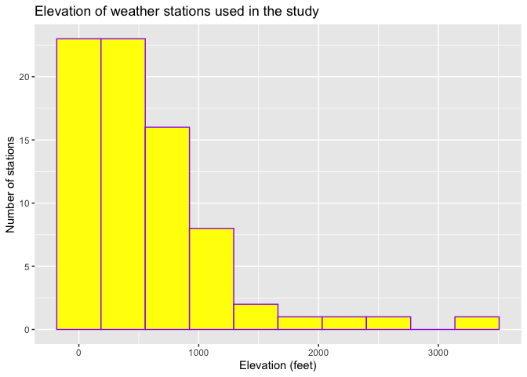
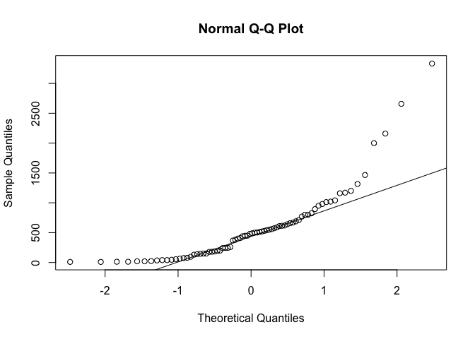

# Load Libraries


```r
library(tidyverse)
library(sp)
library(sf)
library(readxl)
library(skimr)
library(tmap)
library(USAboundaries)
library(viridis)
```


# Last Spring Frost

* The original study was conducted to examine characteristics of the growing period across the southeastern United States during the spring season. 

* The study aimed to understand the spatial and temporal variability of last spring frost dates, synoptic conditions that are associated with frost extremes, and the agricultural impacts of the extreme frost events during the start of the growing season. 

* The data set contains last spring frost dates for weather stations across the southeastern United States collected between 1950 and 1999. 

* The last print frost dates were generated from daily minimum temperature data from the stations. 

* Only weather stations that had the last spring frost date occurring between February and late March were included. A total of 92 stations met the criteria. 

* Looking at the average last frost date over time and across space can provide insights about possible climate change. However, it is important to consider other factors that might have influenced any such changes in the last spring frost date. Changes in vegetation patterns (or land cover) for example can influence both frost occurrence as well as local climate. Increased human settlements/urbanization is another factor that can influence local micro-climates and therefore frost occurrences. 

* Climate change can also be a confounding factor given that it will determine the spatial and temporal distribution of frost occurrences (early or late occurrences) by influencing among other things precipitation, temperature and the longitudinal (north-south) gradient of temperature. 

## Summary Statistics


```r
#frost <- read_excel("frostdata.xlsx")
```


```r
glimpse(frost)
```

```
## Rows: 76
## Columns: 8
## $ Station             <chr> "Valley", "Union", "Saint", "Fernandina", "Lake", …
## $ State               <chr> "AL", "AL", "AL", "FL", "FL", "GA", "NC", "NC", "S…
## $ Type_Fake           <chr> "City", "City", "Airport", "City", "City", "City",…
## $ Avg_DOY_SpringFrost <dbl> 109.88, 82.27, 99.85, 46.89, 60.65, 85.63, 101.28,…
## $ Latitude            <dbl> 34.57, 32.02, 34.17, 30.67, 30.18, 32.87, 35.92, 3…
## $ Longitude           <dbl> -85.62, -85.75, -86.82, -81.47, -82.60, -85.18, -7…
## $ Elevation           <dbl> 1020, 440, 800, 13, 195, 575, 500, 1041, 242, 10, …
## $ Dist_to_Coast       <dbl> 294.992, 121.515, 252.062, 1.148, 62.972, 187.456,…
```


```r
skim(frost)
```


<table style='width: auto;'
        class='table table-condensed'>
<caption>Data summary</caption>
 <thead>
  <tr>
   <th style="text-align:left;">   </th>
   <th style="text-align:left;">   </th>
  </tr>
 </thead>
<tbody>
  <tr>
   <td style="text-align:left;"> Name </td>
   <td style="text-align:left;"> frost </td>
  </tr>
  <tr>
   <td style="text-align:left;"> Number of rows </td>
   <td style="text-align:left;"> 76 </td>
  </tr>
  <tr>
   <td style="text-align:left;"> Number of columns </td>
   <td style="text-align:left;"> 8 </td>
  </tr>
  <tr>
   <td style="text-align:left;"> _______________________ </td>
   <td style="text-align:left;">  </td>
  </tr>
  <tr>
   <td style="text-align:left;"> Column type frequency: </td>
   <td style="text-align:left;">  </td>
  </tr>
  <tr>
   <td style="text-align:left;"> character </td>
   <td style="text-align:left;"> 3 </td>
  </tr>
  <tr>
   <td style="text-align:left;"> numeric </td>
   <td style="text-align:left;"> 5 </td>
  </tr>
  <tr>
   <td style="text-align:left;"> ________________________ </td>
   <td style="text-align:left;">  </td>
  </tr>
  <tr>
   <td style="text-align:left;"> Group variables </td>
   <td style="text-align:left;"> None </td>
  </tr>
</tbody>
</table>


**Variable type: character**

<table>
 <thead>
  <tr>
   <th style="text-align:left;"> skim_variable </th>
   <th style="text-align:right;"> n_missing </th>
   <th style="text-align:right;"> complete_rate </th>
   <th style="text-align:right;"> min </th>
   <th style="text-align:right;"> max </th>
   <th style="text-align:right;"> empty </th>
   <th style="text-align:right;"> n_unique </th>
   <th style="text-align:right;"> whitespace </th>
  </tr>
 </thead>
<tbody>
  <tr>
   <td style="text-align:left;"> Station </td>
   <td style="text-align:right;"> 0 </td>
   <td style="text-align:right;"> 1 </td>
   <td style="text-align:right;"> 2 </td>
   <td style="text-align:right;"> 14 </td>
   <td style="text-align:right;"> 0 </td>
   <td style="text-align:right;"> 76 </td>
   <td style="text-align:right;"> 0 </td>
  </tr>
  <tr>
   <td style="text-align:left;"> State </td>
   <td style="text-align:right;"> 0 </td>
   <td style="text-align:right;"> 1 </td>
   <td style="text-align:right;"> 2 </td>
   <td style="text-align:right;"> 2 </td>
   <td style="text-align:right;"> 0 </td>
   <td style="text-align:right;"> 6 </td>
   <td style="text-align:right;"> 0 </td>
  </tr>
  <tr>
   <td style="text-align:left;"> Type_Fake </td>
   <td style="text-align:right;"> 0 </td>
   <td style="text-align:right;"> 1 </td>
   <td style="text-align:right;"> 4 </td>
   <td style="text-align:right;"> 29 </td>
   <td style="text-align:right;"> 0 </td>
   <td style="text-align:right;"> 3 </td>
   <td style="text-align:right;"> 0 </td>
  </tr>
</tbody>
</table>


**Variable type: numeric**

<table>
 <thead>
  <tr>
   <th style="text-align:left;"> skim_variable </th>
   <th style="text-align:right;"> n_missing </th>
   <th style="text-align:right;"> complete_rate </th>
   <th style="text-align:right;"> mean </th>
   <th style="text-align:right;"> sd </th>
   <th style="text-align:right;"> p0 </th>
   <th style="text-align:right;"> p25 </th>
   <th style="text-align:right;"> p50 </th>
   <th style="text-align:right;"> p75 </th>
   <th style="text-align:right;"> p100 </th>
   <th style="text-align:left;"> hist </th>
  </tr>
 </thead>
<tbody>
  <tr>
   <td style="text-align:left;"> Avg_DOY_SpringFrost </td>
   <td style="text-align:right;"> 0 </td>
   <td style="text-align:right;"> 1 </td>
   <td style="text-align:right;"> 89.44 </td>
   <td style="text-align:right;"> 15.80 </td>
   <td style="text-align:right;"> 46.89 </td>
   <td style="text-align:right;"> 83.91 </td>
   <td style="text-align:right;"> 90.87 </td>
   <td style="text-align:right;"> 98.78 </td>
   <td style="text-align:right;"> 118.29 </td>
   <td style="text-align:left;"> ▁▂▅▇▃ </td>
  </tr>
  <tr>
   <td style="text-align:left;"> Latitude </td>
   <td style="text-align:right;"> 0 </td>
   <td style="text-align:right;"> 1 </td>
   <td style="text-align:right;"> 33.91 </td>
   <td style="text-align:right;"> 1.89 </td>
   <td style="text-align:right;"> 28.80 </td>
   <td style="text-align:right;"> 32.76 </td>
   <td style="text-align:right;"> 34.23 </td>
   <td style="text-align:right;"> 35.23 </td>
   <td style="text-align:right;"> 37.33 </td>
   <td style="text-align:left;"> ▁▃▃▇▃ </td>
  </tr>
  <tr>
   <td style="text-align:left;"> Longitude </td>
   <td style="text-align:right;"> 0 </td>
   <td style="text-align:right;"> 1 </td>
   <td style="text-align:right;"> -81.84 </td>
   <td style="text-align:right;"> 2.38 </td>
   <td style="text-align:right;"> -86.82 </td>
   <td style="text-align:right;"> -83.27 </td>
   <td style="text-align:right;"> -81.98 </td>
   <td style="text-align:right;"> -80.22 </td>
   <td style="text-align:right;"> -76.55 </td>
   <td style="text-align:left;"> ▃▅▇▃▂ </td>
  </tr>
  <tr>
   <td style="text-align:left;"> Elevation </td>
   <td style="text-align:right;"> 0 </td>
   <td style="text-align:right;"> 1 </td>
   <td style="text-align:right;"> 569.72 </td>
   <td style="text-align:right;"> 601.27 </td>
   <td style="text-align:right;"> 10.00 </td>
   <td style="text-align:right;"> 148.75 </td>
   <td style="text-align:right;"> 485.00 </td>
   <td style="text-align:right;"> 725.50 </td>
   <td style="text-align:right;"> 3333.00 </td>
   <td style="text-align:left;"> ▇▂▁▁▁ </td>
  </tr>
  <tr>
   <td style="text-align:left;"> Dist_to_Coast </td>
   <td style="text-align:right;"> 0 </td>
   <td style="text-align:right;"> 1 </td>
   <td style="text-align:right;"> 129.44 </td>
   <td style="text-align:right;"> 80.48 </td>
   <td style="text-align:right;"> 1.15 </td>
   <td style="text-align:right;"> 59.19 </td>
   <td style="text-align:right;"> 128.78 </td>
   <td style="text-align:right;"> 192.64 </td>
   <td style="text-align:right;"> 298.91 </td>
   <td style="text-align:left;"> ▇▆▇▇▂ </td>
  </tr>
</tbody>
</table>


The population being studied here are weather stations across several states (Alabama, Florida, Georgia, North Carolina, South Carolina or Virginia) in southeastern USA. Stations were sampled/selected based on the criteria that the average last frost spring date occurred between early February and late March. The unit of observation is a weather station. There are 76 units (stations) each within a row in the data set. The dataset has 8 columns each with a specific attribute of the weather station. Below is a description of the columns:

- Station: The name of the weather station
- State: The US State that the station resides in
- Type_Fake: The type of environment within which the station reside in
- Latitude: The latitude of the station (degrees)
- Longitude: The longitude of the station (degrees)
- Elevation: The elevation of the station (feet)
- Dist_to_Coast: The distance from the station to the coast (miles)
- Avg_DOY_SpringFrost: The Day-Of-Year of the average final spring frost date for that station

There are a total of 76 stations.

The mean longitude of the stations locations is -81.8 degrees

The standard deviation of the stations distance to the coast is 80.5 miles

My chosen State is Alabama.


```r
tmp <- mean(frost$Longitude,na.rm=TRUE)
mdist <- min(frost$Dist_to_Coast,na.rm=TRUE)
medDate <- median(frost$Avg_DOY_SpringFrost,na.rm=TRUE)
iqrange <- IQR(frost$Latitude)
```

Note, I used the inline code option from lab 4 to answer this, but I'm also showing the code I wrote by putting ` around it.

 - The mean of the Longitude column is: `tmp` `{r  tmp}
 - The minimum distance to the coast is: `mdist` `{r  mdist}
 - The median climatological frost date: `medDate` `{r  mdist}
 - The interquartile range of the Latitude `medDate` `{r  mdist}

print(paste0("The minimum distance to the coast: ", mdist))
print(paste0("The median climatological frost date: ", medDate))
print(paste0("The interquartile range of the Latitude: ", medDate))
```

The median climatological frost date (90.87) is the median Julian date of the average final spring frost date.

## Grouping data


```r
table(frost$State)
```

```
## 
## AL FL GA NC SC VA 
##  6  6 19 21 20  4
```

My chosen state is Alabama, and it has six stations.


```r
table(frost$State, frost$Type_Fake)
```

```
##     
##      Agricultural_Research_Station Airport City
##   AL                             1       2    3
##   FL                             1       0    5
##   GA                             4       7    8
##   NC                             3       3   15
##   SC                             7       6    7
##   VA                             0       4    0
```

There is one agricultural station in Alabama.


```r
frost.summary.state <- group_by(frost, by=State) %>%
                          summarise(max(Avg_DOY_SpringFrost),
                                    min(Avg_DOY_SpringFrost),
                                    mean(Avg_DOY_SpringFrost))
frost.summary.state
```

<div data-pagedtable="false">
  <script data-pagedtable-source type="application/json">
{"columns":[{"label":["by"],"name":[1],"type":["chr"],"align":["left"]},{"label":["max(Avg_DOY_SpringFrost)"],"name":[2],"type":["dbl"],"align":["right"]},{"label":["min(Avg_DOY_SpringFrost)"],"name":[3],"type":["dbl"],"align":["right"]},{"label":["mean(Avg_DOY_SpringFrost)"],"name":[4],"type":["dbl"],"align":["right"]}],"data":[{"1":"AL","2":"109.88","3":"74.41","4":"93.71000"},{"1":"FL","2":"75.78","3":"46.89","4":"59.66500"},{"1":"GA","2":"97.27","3":"48.43","4":"80.63632"},{"1":"NC","2":"118.29","3":"82.85","4":"101.99619"},{"1":"SC","2":"107.35","3":"75.42","4":"89.30150"},{"1":"VA","2":"111.15","3":"96.00","4":"104.32500"}],"options":{"columns":{"min":{},"max":[10]},"rows":{"min":[10],"max":[10]},"pages":{}}}
  </script>
</div>

The mean spring final frost Day of Year for Alabama is 93.71. This means day 94 begining January first.

Ignore the warning messages, this is part of the strange website issues right now


```
## List of 3
##  $ axis.title.x:List of 11
##   ..$ family       : NULL
##   ..$ face         : chr "bold"
##   ..$ colour       : chr "black"
##   ..$ size         : num 14
##   ..$ hjust        : NULL
##   ..$ vjust        : NULL
##   ..$ angle        : NULL
##   ..$ lineheight   : NULL
##   ..$ margin       : NULL
##   ..$ debug        : NULL
##   ..$ inherit.blank: logi FALSE
##   ..- attr(*, "class")= chr [1:2] "element_text" "element"
##  $ axis.title.y:List of 11
##   ..$ family       : NULL
##   ..$ face         : chr "bold"
##   ..$ colour       : chr "black"
##   ..$ size         : num 14
##   ..$ hjust        : NULL
##   ..$ vjust        : NULL
##   ..$ angle        : NULL
##   ..$ lineheight   : NULL
##   ..$ margin       : NULL
##   ..$ debug        : NULL
##   ..$ inherit.blank: logi FALSE
##   ..- attr(*, "class")= chr [1:2] "element_text" "element"
##  $ axis.text   :List of 11
##   ..$ family       : NULL
##   ..$ face         : chr "bold"
##   ..$ colour       : NULL
##   ..$ size         : num 14
##   ..$ hjust        : NULL
##   ..$ vjust        : NULL
##   ..$ angle        : NULL
##   ..$ lineheight   : NULL
##   ..$ margin       : NULL
##   ..$ debug        : NULL
##   ..$ inherit.blank: logi FALSE
##   ..- attr(*, "class")= chr [1:2] "element_text" "element"
##  - attr(*, "class")= chr [1:2] "theme" "gg"
##  - attr(*, "complete")= logi FALSE
##  - attr(*, "validate")= logi TRUE
```

 
<!-- -->

# Testing Normality


```r
qqnorm(frost$Elevation)
qqline(frost$Elevation)
```

<!-- -->

Based on the histogram and the QQ plot, it appears that the elevation values are not normally distributed. Looking at the histogram we see that the values are positively skewed. That means we have most of the values on one (right) side of the histogram instead of in the middle as it would be for a normal distribution. Looking at the QQ plot, we can confirm that the low elevation values are indeed much higher than would be expected for a normal distribution and the high elevation values are slightly higher than would be expected for a normal distribution. 

## Z-Score mapping


```r
frost$ZScore <- ( frost$Avg_DOY_SpringFrost - mean(frost$Avg_DOY_SpringFrost)  ) / sd(frost$Avg_DOY_SpringFrost)
```

## Mapping 


```r
frost.sf <- st_as_sf(frost,coords = c("Longitude", "Latitude"),crs=4326)
```


```r
tmap_mode("view")
qtm(frost.sf,dots.col="ZScore")
```

```{=html}
<div id="htmlwidget-a5d12deeaa8228e14d80" style="width:672px;height:480px;" class="leaflet html-widget"></div>
<script type="application/json" data-for="htmlwidget-a5d12deeaa8228e14d80">{"x":{"options":{"crs":{"crsClass":"L.CRS.EPSG3857","code":null,"proj4def":null,"projectedBounds":null,"options":{}}},"calls":[{"method":"createMapPane","args":["tmap401",401]},{"method":"createMapPane","args":["tmap402",402]},{"method":"addProviderTiles","args":["Esri.WorldGrayCanvas",null,"Esri.WorldGrayCanvas",{"minZoom":0,"maxZoom":18,"tileSize":256,"subdomains":"abc","errorTileUrl":"","tms":false,"noWrap":false,"zoomOffset":0,"zoomReverse":false,"opacity":1,"zIndex":1,"detectRetina":false,"pane":"tilePane"}]},{"method":"addProviderTiles","args":["OpenStreetMap",null,"OpenStreetMap",{"minZoom":0,"maxZoom":18,"tileSize":256,"subdomains":"abc","errorTileUrl":"","tms":false,"noWrap":false,"zoomOffset":0,"zoomReverse":false,"opacity":1,"zIndex":1,"detectRetina":false,"pane":"tilePane"}]},{"method":"addProviderTiles","args":["Esri.WorldTopoMap",null,"Esri.WorldTopoMap",{"minZoom":0,"maxZoom":18,"tileSize":256,"subdomains":"abc","errorTileUrl":"","tms":false,"noWrap":false,"zoomOffset":0,"zoomReverse":false,"opacity":1,"zIndex":1,"detectRetina":false,"pane":"tilePane"}]},{"method":"addCircleMarkers","args":[[34.57,32.02,34.17,30.67,30.18,32.87,35.92,36.5,33.98,32.78,34.93,34.2,34.08,34.67,30.72,36.98,36.02,37.3,35.88,35.2,33.92,36.1,35.52,37.33,36.32,35.07,34.63,33.83,36.58,34.3,34.73,35.4,33.03,33.93,34.98,32.68,35.78,34.37,32.13,31.17,34.63,35.92,35.73,33.5,34,31.98,34.5,35.67,29.17,34.2,28.8,31.25,35.33,33.4,35.8,34.53,33.73,35.48,34.75,32.2,35.03,33.08,34.58,32.28,31.45,30.78,33.6,34.3,31.53,30.4,32.68,33.45,34.25,31.8,34.67,33.42],[-85.62,-85.75,-86.82,-81.47,-82.6,-85.18,-79.08,-80.65,-81.02,-79.93,-81.03,-81.42,-82.58,-82.82,-86.1,-79.9,-76.55,-77.28,-77.53,-77.55,-78.02,-78.3,-78.35,-78.38,-78.43,-78.87,-79.03,-79.05,-79.38,-79.88,-79.88,-80.2,-80.23,-80.35,-80.52,-80.92,-80.93,-81.1,-81.22,-81.5,-81.52,-81.53,-81.67,-81.7,-81.77,-81.95,-82.02,-82.03,-82.08,-82.17,-82.32,-82.32,-82.45,-82.62,-82.67,-82.67,-82.7,-82.97,-83.08,-83.2,-83.2,-83.25,-83.33,-83.47,-83.48,-83.57,-83.85,-83.87,-84.15,-84.35,-84.52,-84.82,-85.15,-85.97,-86.05,-86.13],[2.82842712474619,2.82842712474619,2.82842712474619,2.82842712474619,2.82842712474619,2.82842712474619,2.82842712474619,2.82842712474619,2.82842712474619,2.82842712474619,2.82842712474619,2.82842712474619,2.82842712474619,2.82842712474619,2.82842712474619,2.82842712474619,2.82842712474619,2.82842712474619,2.82842712474619,2.82842712474619,2.82842712474619,2.82842712474619,2.82842712474619,2.82842712474619,2.82842712474619,2.82842712474619,2.82842712474619,2.82842712474619,2.82842712474619,2.82842712474619,2.82842712474619,2.82842712474619,2.82842712474619,2.82842712474619,2.82842712474619,2.82842712474619,2.82842712474619,2.82842712474619,2.82842712474619,2.82842712474619,2.82842712474619,2.82842712474619,2.82842712474619,2.82842712474619,2.82842712474619,2.82842712474619,2.82842712474619,2.82842712474619,2.82842712474619,2.82842712474619,2.82842712474619,2.82842712474619,2.82842712474619,2.82842712474619,2.82842712474619,2.82842712474619,2.82842712474619,2.82842712474619,2.82842712474619,2.82842712474619,2.82842712474619,2.82842712474619,2.82842712474619,2.82842712474619,2.82842712474619,2.82842712474619,2.82842712474619,2.82842712474619,2.82842712474619,2.82842712474619,2.82842712474619,2.82842712474619,2.82842712474619,2.82842712474619,2.82842712474619,2.82842712474619],["Valley","Union","Saint","Fernandina","Lake","West","Chapel","Mt","Columbia","Charlestown","Winthrop","Little","Calhoun","Clemson","De","Rocky","Edenton","Hopewell","Tarboro","Kinston","Southport","Louisburg","Smithfield","Farmville","Henderson","Fayetteville","Lumberton","Conway","Danville","Darlington","Cheraw","Albemarle","Summerville","Sumter","Monroe","Yemassee","Statesville","Winnsboro","Savannah","Brunswick","Santuck","Lenoir","Morganton","Aiken","Saluda","Glennville","Laurens","Marion","Ocala","Greenwood","Inverness","Waycross","Hendersonville","Warrenton","Marshall","Anderson","Washington","Waynesville","Walhalla","Eastman","Highlands","Milledgeville","Toccoa","Hawkinsville","Tifton","Quitman","Covington","Gainesville","Albany","Tallahassee","Talbotton","Newnan","Rome","Troy","Scottsboro","Talladega"],"frost.sf",{"interactive":true,"className":"","pane":"tmap401","stroke":true,"color":"#666666","weight":1,"opacity":0.5,"fill":true,"fillColor":["#79C565","#FEE99A","#E4F39A","#DF422F","#FBA15A","#FEE99A","#E4F39A","#79C565","#FEE99A","#FEE99A","#FEE99A","#FEE99A","#E4F39A","#E4F39A","#FBA15A","#79C565","#FEE99A","#E4F39A","#E4F39A","#E4F39A","#FEE99A","#79C565","#E4F39A","#79C565","#79C565","#E4F39A","#E4F39A","#FEE99A","#E4F39A","#FEE99A","#E4F39A","#E4F39A","#FEE99A","#FEE99A","#E4F39A","#FEE99A","#79C565","#E4F39A","#FBA15A","#DF422F","#E4F39A","#E4F39A","#79C565","#E4F39A","#E4F39A","#FBA15A","#E4F39A","#E4F39A","#DF422F","#E4F39A","#DF422F","#FEE99A","#79C565","#FEE99A","#79C565","#E4F39A","#FEE99A","#E4F39A","#79C565","#FBA15A","#79C565","#E4F39A","#E4F39A","#FEE99A","#FEE99A","#FBA15A","#E4F39A","#E4F39A","#FEE99A","#FEE99A","#E4F39A","#E4F39A","#E4F39A","#FEE99A","#E4F39A","#E4F39A"],"fillOpacity":[1,1,1,1,1,1,1,1,1,1,1,1,1,1,1,1,1,1,1,1,1,1,1,1,1,1,1,1,1,1,1,1,1,1,1,1,1,1,1,1,1,1,1,1,1,1,1,1,1,1,1,1,1,1,1,1,1,1,1,1,1,1,1,1,1,1,1,1,1,1,1,1,1,1,1,1]},null,null,["<style> div.leaflet-popup-content {width:auto !important;overflow-y:auto; overflow-x:hidden;}<\/style><div style=\"max-height:25em;padding-right:0px;\"><table>\n\t\t\t   <thead><tr><th colspan=\"2\"><b>Valley<\/b><\/th><\/thead><\/tr><tr><td style=\"color: #888888;\"><nobr>ZScore<\/nobr><\/td><td align=\"right\"><nobr>1.293<\/nobr><\/td><\/tr><\/table><\/div>","<style> div.leaflet-popup-content {width:auto !important;overflow-y:auto; overflow-x:hidden;}<\/style><div style=\"max-height:25em;padding-right:0px;\"><table>\n\t\t\t   <thead><tr><th colspan=\"2\"><b>Union<\/b><\/th><\/thead><\/tr><tr><td style=\"color: #888888;\"><nobr>ZScore<\/nobr><\/td><td align=\"right\"><nobr>-0.454<\/nobr><\/td><\/tr><\/table><\/div>","<style> div.leaflet-popup-content {width:auto !important;overflow-y:auto; overflow-x:hidden;}<\/style><div style=\"max-height:25em;padding-right:0px;\"><table>\n\t\t\t   <thead><tr><th colspan=\"2\"><b>Saint<\/b><\/th><\/thead><\/tr><tr><td style=\"color: #888888;\"><nobr>ZScore<\/nobr><\/td><td align=\"right\"><nobr>0.659<\/nobr><\/td><\/tr><\/table><\/div>","<style> div.leaflet-popup-content {width:auto !important;overflow-y:auto; overflow-x:hidden;}<\/style><div style=\"max-height:25em;padding-right:0px;\"><table>\n\t\t\t   <thead><tr><th colspan=\"2\"><b>Fernandina<\/b><\/th><\/thead><\/tr><tr><td style=\"color: #888888;\"><nobr>ZScore<\/nobr><\/td><td align=\"right\"><nobr>-2.693<\/nobr><\/td><\/tr><\/table><\/div>","<style> div.leaflet-popup-content {width:auto !important;overflow-y:auto; overflow-x:hidden;}<\/style><div style=\"max-height:25em;padding-right:0px;\"><table>\n\t\t\t   <thead><tr><th colspan=\"2\"><b>Lake<\/b><\/th><\/thead><\/tr><tr><td style=\"color: #888888;\"><nobr>ZScore<\/nobr><\/td><td align=\"right\"><nobr>-1.822<\/nobr><\/td><\/tr><\/table><\/div>","<style> div.leaflet-popup-content {width:auto !important;overflow-y:auto; overflow-x:hidden;}<\/style><div style=\"max-height:25em;padding-right:0px;\"><table>\n\t\t\t   <thead><tr><th colspan=\"2\"><b>West<\/b><\/th><\/thead><\/tr><tr><td style=\"color: #888888;\"><nobr>ZScore<\/nobr><\/td><td align=\"right\"><nobr>-0.241<\/nobr><\/td><\/tr><\/table><\/div>","<style> div.leaflet-popup-content {width:auto !important;overflow-y:auto; overflow-x:hidden;}<\/style><div style=\"max-height:25em;padding-right:0px;\"><table>\n\t\t\t   <thead><tr><th colspan=\"2\"><b>Chapel<\/b><\/th><\/thead><\/tr><tr><td style=\"color: #888888;\"><nobr>ZScore<\/nobr><\/td><td align=\"right\"><nobr>0.749<\/nobr><\/td><\/tr><\/table><\/div>","<style> div.leaflet-popup-content {width:auto !important;overflow-y:auto; overflow-x:hidden;}<\/style><div style=\"max-height:25em;padding-right:0px;\"><table>\n\t\t\t   <thead><tr><th colspan=\"2\"><b>Mt<\/b><\/th><\/thead><\/tr><tr><td style=\"color: #888888;\"><nobr>ZScore<\/nobr><\/td><td align=\"right\"><nobr>1.520<\/nobr><\/td><\/tr><\/table><\/div>","<style> div.leaflet-popup-content {width:auto !important;overflow-y:auto; overflow-x:hidden;}<\/style><div style=\"max-height:25em;padding-right:0px;\"><table>\n\t\t\t   <thead><tr><th colspan=\"2\"><b>Columbia<\/b><\/th><\/thead><\/tr><tr><td style=\"color: #888888;\"><nobr>ZScore<\/nobr><\/td><td align=\"right\"><nobr>-0.852<\/nobr><\/td><\/tr><\/table><\/div>","<style> div.leaflet-popup-content {width:auto !important;overflow-y:auto; overflow-x:hidden;}<\/style><div style=\"max-height:25em;padding-right:0px;\"><table>\n\t\t\t   <thead><tr><th colspan=\"2\"><b>Charlestown<\/b><\/th><\/thead><\/tr><tr><td style=\"color: #888888;\"><nobr>ZScore<\/nobr><\/td><td align=\"right\"><nobr>-0.304<\/nobr><\/td><\/tr><\/table><\/div>","<style> div.leaflet-popup-content {width:auto !important;overflow-y:auto; overflow-x:hidden;}<\/style><div style=\"max-height:25em;padding-right:0px;\"><table>\n\t\t\t   <thead><tr><th colspan=\"2\"><b>Winthrop<\/b><\/th><\/thead><\/tr><tr><td style=\"color: #888888;\"><nobr>ZScore<\/nobr><\/td><td align=\"right\"><nobr>-0.139<\/nobr><\/td><\/tr><\/table><\/div>","<style> div.leaflet-popup-content {width:auto !important;overflow-y:auto; overflow-x:hidden;}<\/style><div style=\"max-height:25em;padding-right:0px;\"><table>\n\t\t\t   <thead><tr><th colspan=\"2\"><b>Little<\/b><\/th><\/thead><\/tr><tr><td style=\"color: #888888;\"><nobr>ZScore<\/nobr><\/td><td align=\"right\"><nobr>-0.111<\/nobr><\/td><\/tr><\/table><\/div>","<style> div.leaflet-popup-content {width:auto !important;overflow-y:auto; overflow-x:hidden;}<\/style><div style=\"max-height:25em;padding-right:0px;\"><table>\n\t\t\t   <thead><tr><th colspan=\"2\"><b>Calhoun<\/b><\/th><\/thead><\/tr><tr><td style=\"color: #888888;\"><nobr>ZScore<\/nobr><\/td><td align=\"right\"><nobr>0.130<\/nobr><\/td><\/tr><\/table><\/div>","<style> div.leaflet-popup-content {width:auto !important;overflow-y:auto; overflow-x:hidden;}<\/style><div style=\"max-height:25em;padding-right:0px;\"><table>\n\t\t\t   <thead><tr><th colspan=\"2\"><b>Clemson<\/b><\/th><\/thead><\/tr><tr><td style=\"color: #888888;\"><nobr>ZScore<\/nobr><\/td><td align=\"right\"><nobr>0.262<\/nobr><\/td><\/tr><\/table><\/div>","<style> div.leaflet-popup-content {width:auto !important;overflow-y:auto; overflow-x:hidden;}<\/style><div style=\"max-height:25em;padding-right:0px;\"><table>\n\t\t\t   <thead><tr><th colspan=\"2\"><b>De<\/b><\/th><\/thead><\/tr><tr><td style=\"color: #888888;\"><nobr>ZScore<\/nobr><\/td><td align=\"right\"><nobr>-1.146<\/nobr><\/td><\/tr><\/table><\/div>","<style> div.leaflet-popup-content {width:auto !important;overflow-y:auto; overflow-x:hidden;}<\/style><div style=\"max-height:25em;padding-right:0px;\"><table>\n\t\t\t   <thead><tr><th colspan=\"2\"><b>Rocky<\/b><\/th><\/thead><\/tr><tr><td style=\"color: #888888;\"><nobr>ZScore<\/nobr><\/td><td align=\"right\"><nobr>1.374<\/nobr><\/td><\/tr><\/table><\/div>","<style> div.leaflet-popup-content {width:auto !important;overflow-y:auto; overflow-x:hidden;}<\/style><div style=\"max-height:25em;padding-right:0px;\"><table>\n\t\t\t   <thead><tr><th colspan=\"2\"><b>Edenton<\/b><\/th><\/thead><\/tr><tr><td style=\"color: #888888;\"><nobr>ZScore<\/nobr><\/td><td align=\"right\"><nobr>-0.264<\/nobr><\/td><\/tr><\/table><\/div>","<style> div.leaflet-popup-content {width:auto !important;overflow-y:auto; overflow-x:hidden;}<\/style><div style=\"max-height:25em;padding-right:0px;\"><table>\n\t\t\t   <thead><tr><th colspan=\"2\"><b>Hopewell<\/b><\/th><\/thead><\/tr><tr><td style=\"color: #888888;\"><nobr>ZScore<\/nobr><\/td><td align=\"right\"><nobr>0.415<\/nobr><\/td><\/tr><\/table><\/div>","<style> div.leaflet-popup-content {width:auto !important;overflow-y:auto; overflow-x:hidden;}<\/style><div style=\"max-height:25em;padding-right:0px;\"><table>\n\t\t\t   <thead><tr><th colspan=\"2\"><b>Tarboro<\/b><\/th><\/thead><\/tr><tr><td style=\"color: #888888;\"><nobr>ZScore<\/nobr><\/td><td align=\"right\"><nobr>0.239<\/nobr><\/td><\/tr><\/table><\/div>","<style> div.leaflet-popup-content {width:auto !important;overflow-y:auto; overflow-x:hidden;}<\/style><div style=\"max-height:25em;padding-right:0px;\"><table>\n\t\t\t   <thead><tr><th colspan=\"2\"><b>Kinston<\/b><\/th><\/thead><\/tr><tr><td style=\"color: #888888;\"><nobr>ZScore<\/nobr><\/td><td align=\"right\"><nobr>0.126<\/nobr><\/td><\/tr><\/table><\/div>","<style> div.leaflet-popup-content {width:auto !important;overflow-y:auto; overflow-x:hidden;}<\/style><div style=\"max-height:25em;padding-right:0px;\"><table>\n\t\t\t   <thead><tr><th colspan=\"2\"><b>Southport<\/b><\/th><\/thead><\/tr><tr><td style=\"color: #888888;\"><nobr>ZScore<\/nobr><\/td><td align=\"right\"><nobr>-0.417<\/nobr><\/td><\/tr><\/table><\/div>","<style> div.leaflet-popup-content {width:auto !important;overflow-y:auto; overflow-x:hidden;}<\/style><div style=\"max-height:25em;padding-right:0px;\"><table>\n\t\t\t   <thead><tr><th colspan=\"2\"><b>Louisburg<\/b><\/th><\/thead><\/tr><tr><td style=\"color: #888888;\"><nobr>ZScore<\/nobr><\/td><td align=\"right\"><nobr>1.462<\/nobr><\/td><\/tr><\/table><\/div>","<style> div.leaflet-popup-content {width:auto !important;overflow-y:auto; overflow-x:hidden;}<\/style><div style=\"max-height:25em;padding-right:0px;\"><table>\n\t\t\t   <thead><tr><th colspan=\"2\"><b>Smithfield<\/b><\/th><\/thead><\/tr><tr><td style=\"color: #888888;\"><nobr>ZScore<\/nobr><\/td><td align=\"right\"><nobr>0.536<\/nobr><\/td><\/tr><\/table><\/div>","<style> div.leaflet-popup-content {width:auto !important;overflow-y:auto; overflow-x:hidden;}<\/style><div style=\"max-height:25em;padding-right:0px;\"><table>\n\t\t\t   <thead><tr><th colspan=\"2\"><b>Farmville<\/b><\/th><\/thead><\/tr><tr><td style=\"color: #888888;\"><nobr>ZScore<\/nobr><\/td><td align=\"right\"><nobr>1.340<\/nobr><\/td><\/tr><\/table><\/div>","<style> div.leaflet-popup-content {width:auto !important;overflow-y:auto; overflow-x:hidden;}<\/style><div style=\"max-height:25em;padding-right:0px;\"><table>\n\t\t\t   <thead><tr><th colspan=\"2\"><b>Henderson<\/b><\/th><\/thead><\/tr><tr><td style=\"color: #888888;\"><nobr>ZScore<\/nobr><\/td><td align=\"right\"><nobr>1.343<\/nobr><\/td><\/tr><\/table><\/div>","<style> div.leaflet-popup-content {width:auto !important;overflow-y:auto; overflow-x:hidden;}<\/style><div style=\"max-height:25em;padding-right:0px;\"><table>\n\t\t\t   <thead><tr><th colspan=\"2\"><b>Fayetteville<\/b><\/th><\/thead><\/tr><tr><td style=\"color: #888888;\"><nobr>ZScore<\/nobr><\/td><td align=\"right\"><nobr>0.090<\/nobr><\/td><\/tr><\/table><\/div>","<style> div.leaflet-popup-content {width:auto !important;overflow-y:auto; overflow-x:hidden;}<\/style><div style=\"max-height:25em;padding-right:0px;\"><table>\n\t\t\t   <thead><tr><th colspan=\"2\"><b>Lumberton<\/b><\/th><\/thead><\/tr><tr><td style=\"color: #888888;\"><nobr>ZScore<\/nobr><\/td><td align=\"right\"><nobr>0.181<\/nobr><\/td><\/tr><\/table><\/div>","<style> div.leaflet-popup-content {width:auto !important;overflow-y:auto; overflow-x:hidden;}<\/style><div style=\"max-height:25em;padding-right:0px;\"><table>\n\t\t\t   <thead><tr><th colspan=\"2\"><b>Conway<\/b><\/th><\/thead><\/tr><tr><td style=\"color: #888888;\"><nobr>ZScore<\/nobr><\/td><td align=\"right\"><nobr>-0.887<\/nobr><\/td><\/tr><\/table><\/div>","<style> div.leaflet-popup-content {width:auto !important;overflow-y:auto; overflow-x:hidden;}<\/style><div style=\"max-height:25em;padding-right:0px;\"><table>\n\t\t\t   <thead><tr><th colspan=\"2\"><b>Danville<\/b><\/th><\/thead><\/tr><tr><td style=\"color: #888888;\"><nobr>ZScore<\/nobr><\/td><td align=\"right\"><nobr>0.638<\/nobr><\/td><\/tr><\/table><\/div>","<style> div.leaflet-popup-content {width:auto !important;overflow-y:auto; overflow-x:hidden;}<\/style><div style=\"max-height:25em;padding-right:0px;\"><table>\n\t\t\t   <thead><tr><th colspan=\"2\"><b>Darlington<\/b><\/th><\/thead><\/tr><tr><td style=\"color: #888888;\"><nobr>ZScore<\/nobr><\/td><td align=\"right\"><nobr>-0.232<\/nobr><\/td><\/tr><\/table><\/div>","<style> div.leaflet-popup-content {width:auto !important;overflow-y:auto; overflow-x:hidden;}<\/style><div style=\"max-height:25em;padding-right:0px;\"><table>\n\t\t\t   <thead><tr><th colspan=\"2\"><b>Cheraw<\/b><\/th><\/thead><\/tr><tr><td style=\"color: #888888;\"><nobr>ZScore<\/nobr><\/td><td align=\"right\"><nobr>0.007<\/nobr><\/td><\/tr><\/table><\/div>","<style> div.leaflet-popup-content {width:auto !important;overflow-y:auto; overflow-x:hidden;}<\/style><div style=\"max-height:25em;padding-right:0px;\"><table>\n\t\t\t   <thead><tr><th colspan=\"2\"><b>Albemarle<\/b><\/th><\/thead><\/tr><tr><td style=\"color: #888888;\"><nobr>ZScore<\/nobr><\/td><td align=\"right\"><nobr>0.575<\/nobr><\/td><\/tr><\/table><\/div>","<style> div.leaflet-popup-content {width:auto !important;overflow-y:auto; overflow-x:hidden;}<\/style><div style=\"max-height:25em;padding-right:0px;\"><table>\n\t\t\t   <thead><tr><th colspan=\"2\"><b>Summerville<\/b><\/th><\/thead><\/tr><tr><td style=\"color: #888888;\"><nobr>ZScore<\/nobr><\/td><td align=\"right\"><nobr>-0.327<\/nobr><\/td><\/tr><\/table><\/div>","<style> div.leaflet-popup-content {width:auto !important;overflow-y:auto; overflow-x:hidden;}<\/style><div style=\"max-height:25em;padding-right:0px;\"><table>\n\t\t\t   <thead><tr><th colspan=\"2\"><b>Sumter<\/b><\/th><\/thead><\/tr><tr><td style=\"color: #888888;\"><nobr>ZScore<\/nobr><\/td><td align=\"right\"><nobr>-0.254<\/nobr><\/td><\/tr><\/table><\/div>","<style> div.leaflet-popup-content {width:auto !important;overflow-y:auto; overflow-x:hidden;}<\/style><div style=\"max-height:25em;padding-right:0px;\"><table>\n\t\t\t   <thead><tr><th colspan=\"2\"><b>Monroe<\/b><\/th><\/thead><\/tr><tr><td style=\"color: #888888;\"><nobr>ZScore<\/nobr><\/td><td align=\"right\"><nobr>0.719<\/nobr><\/td><\/tr><\/table><\/div>","<style> div.leaflet-popup-content {width:auto !important;overflow-y:auto; overflow-x:hidden;}<\/style><div style=\"max-height:25em;padding-right:0px;\"><table>\n\t\t\t   <thead><tr><th colspan=\"2\"><b>Yemassee<\/b><\/th><\/thead><\/tr><tr><td style=\"color: #888888;\"><nobr>ZScore<\/nobr><\/td><td align=\"right\"><nobr>-0.139<\/nobr><\/td><\/tr><\/table><\/div>","<style> div.leaflet-popup-content {width:auto !important;overflow-y:auto; overflow-x:hidden;}<\/style><div style=\"max-height:25em;padding-right:0px;\"><table>\n\t\t\t   <thead><tr><th colspan=\"2\"><b>Statesville<\/b><\/th><\/thead><\/tr><tr><td style=\"color: #888888;\"><nobr>ZScore<\/nobr><\/td><td align=\"right\"><nobr>1.326<\/nobr><\/td><\/tr><\/table><\/div>","<style> div.leaflet-popup-content {width:auto !important;overflow-y:auto; overflow-x:hidden;}<\/style><div style=\"max-height:25em;padding-right:0px;\"><table>\n\t\t\t   <thead><tr><th colspan=\"2\"><b>Winnsboro<\/b><\/th><\/thead><\/tr><tr><td style=\"color: #888888;\"><nobr>ZScore<\/nobr><\/td><td align=\"right\"><nobr>0.069<\/nobr><\/td><\/tr><\/table><\/div>","<style> div.leaflet-popup-content {width:auto !important;overflow-y:auto; overflow-x:hidden;}<\/style><div style=\"max-height:25em;padding-right:0px;\"><table>\n\t\t\t   <thead><tr><th colspan=\"2\"><b>Savannah<\/b><\/th><\/thead><\/tr><tr><td style=\"color: #888888;\"><nobr>ZScore<\/nobr><\/td><td align=\"right\"><nobr>-1.479<\/nobr><\/td><\/tr><\/table><\/div>","<style> div.leaflet-popup-content {width:auto !important;overflow-y:auto; overflow-x:hidden;}<\/style><div style=\"max-height:25em;padding-right:0px;\"><table>\n\t\t\t   <thead><tr><th colspan=\"2\"><b>Brunswick<\/b><\/th><\/thead><\/tr><tr><td style=\"color: #888888;\"><nobr>ZScore<\/nobr><\/td><td align=\"right\"><nobr>-2.595<\/nobr><\/td><\/tr><\/table><\/div>","<style> div.leaflet-popup-content {width:auto !important;overflow-y:auto; overflow-x:hidden;}<\/style><div style=\"max-height:25em;padding-right:0px;\"><table>\n\t\t\t   <thead><tr><th colspan=\"2\"><b>Santuck<\/b><\/th><\/thead><\/tr><tr><td style=\"color: #888888;\"><nobr>ZScore<\/nobr><\/td><td align=\"right\"><nobr>0.218<\/nobr><\/td><\/tr><\/table><\/div>","<style> div.leaflet-popup-content {width:auto !important;overflow-y:auto; overflow-x:hidden;}<\/style><div style=\"max-height:25em;padding-right:0px;\"><table>\n\t\t\t   <thead><tr><th colspan=\"2\"><b>Lenoir<\/b><\/th><\/thead><\/tr><tr><td style=\"color: #888888;\"><nobr>ZScore<\/nobr><\/td><td align=\"right\"><nobr>0.899<\/nobr><\/td><\/tr><\/table><\/div>","<style> div.leaflet-popup-content {width:auto !important;overflow-y:auto; overflow-x:hidden;}<\/style><div style=\"max-height:25em;padding-right:0px;\"><table>\n\t\t\t   <thead><tr><th colspan=\"2\"><b>Morganton<\/b><\/th><\/thead><\/tr><tr><td style=\"color: #888888;\"><nobr>ZScore<\/nobr><\/td><td align=\"right\"><nobr>1.159<\/nobr><\/td><\/tr><\/table><\/div>","<style> div.leaflet-popup-content {width:auto !important;overflow-y:auto; overflow-x:hidden;}<\/style><div style=\"max-height:25em;padding-right:0px;\"><table>\n\t\t\t   <thead><tr><th colspan=\"2\"><b>Aiken<\/b><\/th><\/thead><\/tr><tr><td style=\"color: #888888;\"><nobr>ZScore<\/nobr><\/td><td align=\"right\"><nobr>0.002<\/nobr><\/td><\/tr><\/table><\/div>","<style> div.leaflet-popup-content {width:auto !important;overflow-y:auto; overflow-x:hidden;}<\/style><div style=\"max-height:25em;padding-right:0px;\"><table>\n\t\t\t   <thead><tr><th colspan=\"2\"><b>Saluda<\/b><\/th><\/thead><\/tr><tr><td style=\"color: #888888;\"><nobr>ZScore<\/nobr><\/td><td align=\"right\"><nobr>0.314<\/nobr><\/td><\/tr><\/table><\/div>","<style> div.leaflet-popup-content {width:auto !important;overflow-y:auto; overflow-x:hidden;}<\/style><div style=\"max-height:25em;padding-right:0px;\"><table>\n\t\t\t   <thead><tr><th colspan=\"2\"><b>Glennville<\/b><\/th><\/thead><\/tr><tr><td style=\"color: #888888;\"><nobr>ZScore<\/nobr><\/td><td align=\"right\"><nobr>-1.442<\/nobr><\/td><\/tr><\/table><\/div>","<style> div.leaflet-popup-content {width:auto !important;overflow-y:auto; overflow-x:hidden;}<\/style><div style=\"max-height:25em;padding-right:0px;\"><table>\n\t\t\t   <thead><tr><th colspan=\"2\"><b>Laurens<\/b><\/th><\/thead><\/tr><tr><td style=\"color: #888888;\"><nobr>ZScore<\/nobr><\/td><td align=\"right\"><nobr>0.466<\/nobr><\/td><\/tr><\/table><\/div>","<style> div.leaflet-popup-content {width:auto !important;overflow-y:auto; overflow-x:hidden;}<\/style><div style=\"max-height:25em;padding-right:0px;\"><table>\n\t\t\t   <thead><tr><th colspan=\"2\"><b>Marion<\/b><\/th><\/thead><\/tr><tr><td style=\"color: #888888;\"><nobr>ZScore<\/nobr><\/td><td align=\"right\"><nobr>0.754<\/nobr><\/td><\/tr><\/table><\/div>","<style> div.leaflet-popup-content {width:auto !important;overflow-y:auto; overflow-x:hidden;}<\/style><div style=\"max-height:25em;padding-right:0px;\"><table>\n\t\t\t   <thead><tr><th colspan=\"2\"><b>Ocala<\/b><\/th><\/thead><\/tr><tr><td style=\"color: #888888;\"><nobr>ZScore<\/nobr><\/td><td align=\"right\"><nobr>-2.322<\/nobr><\/td><\/tr><\/table><\/div>","<style> div.leaflet-popup-content {width:auto !important;overflow-y:auto; overflow-x:hidden;}<\/style><div style=\"max-height:25em;padding-right:0px;\"><table>\n\t\t\t   <thead><tr><th colspan=\"2\"><b>Greenwood<\/b><\/th><\/thead><\/tr><tr><td style=\"color: #888888;\"><nobr>ZScore<\/nobr><\/td><td align=\"right\"><nobr>0.316<\/nobr><\/td><\/tr><\/table><\/div>","<style> div.leaflet-popup-content {width:auto !important;overflow-y:auto; overflow-x:hidden;}<\/style><div style=\"max-height:25em;padding-right:0px;\"><table>\n\t\t\t   <thead><tr><th colspan=\"2\"><b>Inverness<\/b><\/th><\/thead><\/tr><tr><td style=\"color: #888888;\"><nobr>ZScore<\/nobr><\/td><td align=\"right\"><nobr>-2.458<\/nobr><\/td><\/tr><\/table><\/div>","<style> div.leaflet-popup-content {width:auto !important;overflow-y:auto; overflow-x:hidden;}<\/style><div style=\"max-height:25em;padding-right:0px;\"><table>\n\t\t\t   <thead><tr><th colspan=\"2\"><b>Waycross<\/b><\/th><\/thead><\/tr><tr><td style=\"color: #888888;\"><nobr>ZScore<\/nobr><\/td><td align=\"right\"><nobr>-0.858<\/nobr><\/td><\/tr><\/table><\/div>","<style> div.leaflet-popup-content {width:auto !important;overflow-y:auto; overflow-x:hidden;}<\/style><div style=\"max-height:25em;padding-right:0px;\"><table>\n\t\t\t   <thead><tr><th colspan=\"2\"><b>Hendersonville<\/b><\/th><\/thead><\/tr><tr><td style=\"color: #888888;\"><nobr>ZScore<\/nobr><\/td><td align=\"right\"><nobr>1.290<\/nobr><\/td><\/tr><\/table><\/div>","<style> div.leaflet-popup-content {width:auto !important;overflow-y:auto; overflow-x:hidden;}<\/style><div style=\"max-height:25em;padding-right:0px;\"><table>\n\t\t\t   <thead><tr><th colspan=\"2\"><b>Warrenton<\/b><\/th><\/thead><\/tr><tr><td style=\"color: #888888;\"><nobr>ZScore<\/nobr><\/td><td align=\"right\"><nobr>-0.232<\/nobr><\/td><\/tr><\/table><\/div>","<style> div.leaflet-popup-content {width:auto !important;overflow-y:auto; overflow-x:hidden;}<\/style><div style=\"max-height:25em;padding-right:0px;\"><table>\n\t\t\t   <thead><tr><th colspan=\"2\"><b>Marshall<\/b><\/th><\/thead><\/tr><tr><td style=\"color: #888888;\"><nobr>ZScore<\/nobr><\/td><td align=\"right\"><nobr>1.825<\/nobr><\/td><\/tr><\/table><\/div>","<style> div.leaflet-popup-content {width:auto !important;overflow-y:auto; overflow-x:hidden;}<\/style><div style=\"max-height:25em;padding-right:0px;\"><table>\n\t\t\t   <thead><tr><th colspan=\"2\"><b>Anderson<\/b><\/th><\/thead><\/tr><tr><td style=\"color: #888888;\"><nobr>ZScore<\/nobr><\/td><td align=\"right\"><nobr>0.154<\/nobr><\/td><\/tr><\/table><\/div>","<style> div.leaflet-popup-content {width:auto !important;overflow-y:auto; overflow-x:hidden;}<\/style><div style=\"max-height:25em;padding-right:0px;\"><table>\n\t\t\t   <thead><tr><th colspan=\"2\"><b>Washington<\/b><\/th><\/thead><\/tr><tr><td style=\"color: #888888;\"><nobr>ZScore<\/nobr><\/td><td align=\"right\"><nobr>-0.024<\/nobr><\/td><\/tr><\/table><\/div>","<style> div.leaflet-popup-content {width:auto !important;overflow-y:auto; overflow-x:hidden;}<\/style><div style=\"max-height:25em;padding-right:0px;\"><table>\n\t\t\t   <thead><tr><th colspan=\"2\"><b>Waynesville<\/b><\/th><\/thead><\/tr><tr><td style=\"color: #888888;\"><nobr>ZScore<\/nobr><\/td><td align=\"right\"><nobr>0.777<\/nobr><\/td><\/tr><\/table><\/div>","<style> div.leaflet-popup-content {width:auto !important;overflow-y:auto; overflow-x:hidden;}<\/style><div style=\"max-height:25em;padding-right:0px;\"><table>\n\t\t\t   <thead><tr><th colspan=\"2\"><b>Walhalla<\/b><\/th><\/thead><\/tr><tr><td style=\"color: #888888;\"><nobr>ZScore<\/nobr><\/td><td align=\"right\"><nobr>1.133<\/nobr><\/td><\/tr><\/table><\/div>","<style> div.leaflet-popup-content {width:auto !important;overflow-y:auto; overflow-x:hidden;}<\/style><div style=\"max-height:25em;padding-right:0px;\"><table>\n\t\t\t   <thead><tr><th colspan=\"2\"><b>Eastman<\/b><\/th><\/thead><\/tr><tr><td style=\"color: #888888;\"><nobr>ZScore<\/nobr><\/td><td align=\"right\"><nobr>-1.137<\/nobr><\/td><\/tr><\/table><\/div>","<style> div.leaflet-popup-content {width:auto !important;overflow-y:auto; overflow-x:hidden;}<\/style><div style=\"max-height:25em;padding-right:0px;\"><table>\n\t\t\t   <thead><tr><th colspan=\"2\"><b>Highlands<\/b><\/th><\/thead><\/tr><tr><td style=\"color: #888888;\"><nobr>ZScore<\/nobr><\/td><td align=\"right\"><nobr>1.791<\/nobr><\/td><\/tr><\/table><\/div>","<style> div.leaflet-popup-content {width:auto !important;overflow-y:auto; overflow-x:hidden;}<\/style><div style=\"max-height:25em;padding-right:0px;\"><table>\n\t\t\t   <thead><tr><th colspan=\"2\"><b>Milledgeville<\/b><\/th><\/thead><\/tr><tr><td style=\"color: #888888;\"><nobr>ZScore<\/nobr><\/td><td align=\"right\"><nobr>0.091<\/nobr><\/td><\/tr><\/table><\/div>","<style> div.leaflet-popup-content {width:auto !important;overflow-y:auto; overflow-x:hidden;}<\/style><div style=\"max-height:25em;padding-right:0px;\"><table>\n\t\t\t   <thead><tr><th colspan=\"2\"><b>Toccoa<\/b><\/th><\/thead><\/tr><tr><td style=\"color: #888888;\"><nobr>ZScore<\/nobr><\/td><td align=\"right\"><nobr>0.025<\/nobr><\/td><\/tr><\/table><\/div>","<style> div.leaflet-popup-content {width:auto !important;overflow-y:auto; overflow-x:hidden;}<\/style><div style=\"max-height:25em;padding-right:0px;\"><table>\n\t\t\t   <thead><tr><th colspan=\"2\"><b>Hawkinsville<\/b><\/th><\/thead><\/tr><tr><td style=\"color: #888888;\"><nobr>ZScore<\/nobr><\/td><td align=\"right\"><nobr>-0.900<\/nobr><\/td><\/tr><\/table><\/div>","<style> div.leaflet-popup-content {width:auto !important;overflow-y:auto; overflow-x:hidden;}<\/style><div style=\"max-height:25em;padding-right:0px;\"><table>\n\t\t\t   <thead><tr><th colspan=\"2\"><b>Tifton<\/b><\/th><\/thead><\/tr><tr><td style=\"color: #888888;\"><nobr>ZScore<\/nobr><\/td><td align=\"right\"><nobr>-0.137<\/nobr><\/td><\/tr><\/table><\/div>","<style> div.leaflet-popup-content {width:auto !important;overflow-y:auto; overflow-x:hidden;}<\/style><div style=\"max-height:25em;padding-right:0px;\"><table>\n\t\t\t   <thead><tr><th colspan=\"2\"><b>Quitman<\/b><\/th><\/thead><\/tr><tr><td style=\"color: #888888;\"><nobr>ZScore<\/nobr><\/td><td align=\"right\"><nobr>-1.516<\/nobr><\/td><\/tr><\/table><\/div>","<style> div.leaflet-popup-content {width:auto !important;overflow-y:auto; overflow-x:hidden;}<\/style><div style=\"max-height:25em;padding-right:0px;\"><table>\n\t\t\t   <thead><tr><th colspan=\"2\"><b>Covington<\/b><\/th><\/thead><\/tr><tr><td style=\"color: #888888;\"><nobr>ZScore<\/nobr><\/td><td align=\"right\"><nobr>0.080<\/nobr><\/td><\/tr><\/table><\/div>","<style> div.leaflet-popup-content {width:auto !important;overflow-y:auto; overflow-x:hidden;}<\/style><div style=\"max-height:25em;padding-right:0px;\"><table>\n\t\t\t   <thead><tr><th colspan=\"2\"><b>Gainesville<\/b><\/th><\/thead><\/tr><tr><td style=\"color: #888888;\"><nobr>ZScore<\/nobr><\/td><td align=\"right\"><nobr>0.006<\/nobr><\/td><\/tr><\/table><\/div>","<style> div.leaflet-popup-content {width:auto !important;overflow-y:auto; overflow-x:hidden;}<\/style><div style=\"max-height:25em;padding-right:0px;\"><table>\n\t\t\t   <thead><tr><th colspan=\"2\"><b>Albany<\/b><\/th><\/thead><\/tr><tr><td style=\"color: #888888;\"><nobr>ZScore<\/nobr><\/td><td align=\"right\"><nobr>-0.987<\/nobr><\/td><\/tr><\/table><\/div>","<style> div.leaflet-popup-content {width:auto !important;overflow-y:auto; overflow-x:hidden;}<\/style><div style=\"max-height:25em;padding-right:0px;\"><table>\n\t\t\t   <thead><tr><th colspan=\"2\"><b>Tallahassee<\/b><\/th><\/thead><\/tr><tr><td style=\"color: #888888;\"><nobr>ZScore<\/nobr><\/td><td align=\"right\"><nobr>-0.865<\/nobr><\/td><\/tr><\/table><\/div>","<style> div.leaflet-popup-content {width:auto !important;overflow-y:auto; overflow-x:hidden;}<\/style><div style=\"max-height:25em;padding-right:0px;\"><table>\n\t\t\t   <thead><tr><th colspan=\"2\"><b>Talbotton<\/b><\/th><\/thead><\/tr><tr><td style=\"color: #888888;\"><nobr>ZScore<\/nobr><\/td><td align=\"right\"><nobr>0.171<\/nobr><\/td><\/tr><\/table><\/div>","<style> div.leaflet-popup-content {width:auto !important;overflow-y:auto; overflow-x:hidden;}<\/style><div style=\"max-height:25em;padding-right:0px;\"><table>\n\t\t\t   <thead><tr><th colspan=\"2\"><b>Newnan<\/b><\/th><\/thead><\/tr><tr><td style=\"color: #888888;\"><nobr>ZScore<\/nobr><\/td><td align=\"right\"><nobr>0.091<\/nobr><\/td><\/tr><\/table><\/div>","<style> div.leaflet-popup-content {width:auto !important;overflow-y:auto; overflow-x:hidden;}<\/style><div style=\"max-height:25em;padding-right:0px;\"><table>\n\t\t\t   <thead><tr><th colspan=\"2\"><b>Rome<\/b><\/th><\/thead><\/tr><tr><td style=\"color: #888888;\"><nobr>ZScore<\/nobr><\/td><td align=\"right\"><nobr>0.495<\/nobr><\/td><\/tr><\/table><\/div>","<style> div.leaflet-popup-content {width:auto !important;overflow-y:auto; overflow-x:hidden;}<\/style><div style=\"max-height:25em;padding-right:0px;\"><table>\n\t\t\t   <thead><tr><th colspan=\"2\"><b>Troy<\/b><\/th><\/thead><\/tr><tr><td style=\"color: #888888;\"><nobr>ZScore<\/nobr><\/td><td align=\"right\"><nobr>-0.951<\/nobr><\/td><\/tr><\/table><\/div>","<style> div.leaflet-popup-content {width:auto !important;overflow-y:auto; overflow-x:hidden;}<\/style><div style=\"max-height:25em;padding-right:0px;\"><table>\n\t\t\t   <thead><tr><th colspan=\"2\"><b>Scottsboro<\/b><\/th><\/thead><\/tr><tr><td style=\"color: #888888;\"><nobr>ZScore<\/nobr><\/td><td align=\"right\"><nobr>0.543<\/nobr><\/td><\/tr><\/table><\/div>","<style> div.leaflet-popup-content {width:auto !important;overflow-y:auto; overflow-x:hidden;}<\/style><div style=\"max-height:25em;padding-right:0px;\"><table>\n\t\t\t   <thead><tr><th colspan=\"2\"><b>Talladega<\/b><\/th><\/thead><\/tr><tr><td style=\"color: #888888;\"><nobr>ZScore<\/nobr><\/td><td align=\"right\"><nobr>0.531<\/nobr><\/td><\/tr><\/table><\/div>"],null,["Valley","Union","Saint","Fernandina","Lake","West","Chapel","Mt","Columbia","Charlestown","Winthrop","Little","Calhoun","Clemson","De","Rocky","Edenton","Hopewell","Tarboro","Kinston","Southport","Louisburg","Smithfield","Farmville","Henderson","Fayetteville","Lumberton","Conway","Danville","Darlington","Cheraw","Albemarle","Summerville","Sumter","Monroe","Yemassee","Statesville","Winnsboro","Savannah","Brunswick","Santuck","Lenoir","Morganton","Aiken","Saluda","Glennville","Laurens","Marion","Ocala","Greenwood","Inverness","Waycross","Hendersonville","Warrenton","Marshall","Anderson","Washington","Waynesville","Walhalla","Eastman","Highlands","Milledgeville","Toccoa","Hawkinsville","Tifton","Quitman","Covington","Gainesville","Albany","Tallahassee","Talbotton","Newnan","Rome","Troy","Scottsboro","Talladega"],{"interactive":false,"permanent":false,"direction":"auto","opacity":1,"offset":[0,0],"textsize":"10px","textOnly":false,"className":"","sticky":true},null]},{"method":"addLegend","args":[{"colors":["#DF422F","#FBA15A","#FEE99A","#E4F39A","#79C565"],"labels":["-3 to -2","-2 to -1","-1 to 0","0 to 1","1 to 2"],"na_color":null,"na_label":"NA","opacity":1,"position":"topright","type":"unknown","title":"ZScore","extra":null,"layerId":"legend401","className":"info legend frost.sf","group":"frost.sf"}]},{"method":"addLayersControl","args":[["Esri.WorldGrayCanvas","OpenStreetMap","Esri.WorldTopoMap"],"frost.sf",{"collapsed":true,"autoZIndex":true,"position":"topleft"}]},{"method":"addScaleBar","args":[{"maxWidth":100,"metric":true,"imperial":false,"updateWhenIdle":true,"position":"bottomright"}]}],"limits":{"lat":[28.8,37.33],"lng":[-86.82,-76.55]},"fitBounds":[28.8,-86.82,37.33,-76.55,[]]},"evals":[],"jsHooks":{"render":[{"code":"function(el, x, data) {\n  return (\n      function(el, x, data) {\n      // get the leaflet map\n      var map = this; //HTMLWidgets.find('#' + el.id);\n      // we need a new div element because we have to handle\n      // the mouseover output separately\n      // debugger;\n      function addElement () {\n      // generate new div Element\n      var newDiv = $(document.createElement('div'));\n      // append at end of leaflet htmlwidget container\n      $(el).append(newDiv);\n      //provide ID and style\n      newDiv.addClass('lnlt');\n      newDiv.css({\n      'position': 'relative',\n      'bottomleft':  '0px',\n      'background-color': 'rgba(255, 255, 255, 0.7)',\n      'box-shadow': '0 0 2px #bbb',\n      'background-clip': 'padding-box',\n      'margin': '0',\n      'padding-left': '5px',\n      'color': '#333',\n      'font': '9px/1.5 \"Helvetica Neue\", Arial, Helvetica, sans-serif',\n      'z-index': '700',\n      });\n      return newDiv;\n      }\n\n\n      // check for already existing lnlt class to not duplicate\n      var lnlt = $(el).find('.lnlt');\n\n      if(!lnlt.length) {\n      lnlt = addElement();\n\n      // grab the special div we generated in the beginning\n      // and put the mousmove output there\n\n      map.on('mousemove', function (e) {\n      if (e.originalEvent.ctrlKey) {\n      if (document.querySelector('.lnlt') === null) lnlt = addElement();\n      lnlt.text(\n                           ' lon: ' + (e.latlng.lng).toFixed(5) +\n                           ' | lat: ' + (e.latlng.lat).toFixed(5) +\n                           ' | zoom: ' + map.getZoom() +\n                           ' | x: ' + L.CRS.EPSG3857.project(e.latlng).x.toFixed(0) +\n                           ' | y: ' + L.CRS.EPSG3857.project(e.latlng).y.toFixed(0) +\n                           ' | epsg: 3857 ' +\n                           ' | proj4: +proj=merc +a=6378137 +b=6378137 +lat_ts=0.0 +lon_0=0.0 +x_0=0.0 +y_0=0 +k=1.0 +units=m +nadgrids=@null +no_defs ');\n      } else {\n      if (document.querySelector('.lnlt') === null) lnlt = addElement();\n      lnlt.text(\n                      ' lon: ' + (e.latlng.lng).toFixed(5) +\n                      ' | lat: ' + (e.latlng.lat).toFixed(5) +\n                      ' | zoom: ' + map.getZoom() + ' ');\n      }\n      });\n\n      // remove the lnlt div when mouse leaves map\n      map.on('mouseout', function (e) {\n      var strip = document.querySelector('.lnlt');\n      if( strip !==null) strip.remove();\n      });\n\n      };\n\n      //$(el).keypress(67, function(e) {\n      map.on('preclick', function(e) {\n      if (e.originalEvent.ctrlKey) {\n      if (document.querySelector('.lnlt') === null) lnlt = addElement();\n      lnlt.text(\n                      ' lon: ' + (e.latlng.lng).toFixed(5) +\n                      ' | lat: ' + (e.latlng.lat).toFixed(5) +\n                      ' | zoom: ' + map.getZoom() + ' ');\n      var txt = document.querySelector('.lnlt').textContent;\n      console.log(txt);\n      //txt.innerText.focus();\n      //txt.select();\n      setClipboardText('\"' + txt + '\"');\n      }\n      });\n\n      }\n      ).call(this.getMap(), el, x, data);\n}","data":null}]}}</script>
```

### _QTM Map for last frost date_


```r
tmap_mode("view")
qtm(frost.sf,dots.col="Avg_DOY_SpringFrost")
```

```{=html}
<div id="htmlwidget-7e4b7848785660152280" style="width:672px;height:480px;" class="leaflet html-widget"></div>
<script type="application/json" data-for="htmlwidget-7e4b7848785660152280">{"x":{"options":{"crs":{"crsClass":"L.CRS.EPSG3857","code":null,"proj4def":null,"projectedBounds":null,"options":{}}},"calls":[{"method":"createMapPane","args":["tmap401",401]},{"method":"createMapPane","args":["tmap402",402]},{"method":"addProviderTiles","args":["Esri.WorldGrayCanvas",null,"Esri.WorldGrayCanvas",{"minZoom":0,"maxZoom":18,"tileSize":256,"subdomains":"abc","errorTileUrl":"","tms":false,"noWrap":false,"zoomOffset":0,"zoomReverse":false,"opacity":1,"zIndex":1,"detectRetina":false,"pane":"tilePane"}]},{"method":"addProviderTiles","args":["OpenStreetMap",null,"OpenStreetMap",{"minZoom":0,"maxZoom":18,"tileSize":256,"subdomains":"abc","errorTileUrl":"","tms":false,"noWrap":false,"zoomOffset":0,"zoomReverse":false,"opacity":1,"zIndex":1,"detectRetina":false,"pane":"tilePane"}]},{"method":"addProviderTiles","args":["Esri.WorldTopoMap",null,"Esri.WorldTopoMap",{"minZoom":0,"maxZoom":18,"tileSize":256,"subdomains":"abc","errorTileUrl":"","tms":false,"noWrap":false,"zoomOffset":0,"zoomReverse":false,"opacity":1,"zIndex":1,"detectRetina":false,"pane":"tilePane"}]},{"method":"addCircleMarkers","args":[[34.57,32.02,34.17,30.67,30.18,32.87,35.92,36.5,33.98,32.78,34.93,34.2,34.08,34.67,30.72,36.98,36.02,37.3,35.88,35.2,33.92,36.1,35.52,37.33,36.32,35.07,34.63,33.83,36.58,34.3,34.73,35.4,33.03,33.93,34.98,32.68,35.78,34.37,32.13,31.17,34.63,35.92,35.73,33.5,34,31.98,34.5,35.67,29.17,34.2,28.8,31.25,35.33,33.4,35.8,34.53,33.73,35.48,34.75,32.2,35.03,33.08,34.58,32.28,31.45,30.78,33.6,34.3,31.53,30.4,32.68,33.45,34.25,31.8,34.67,33.42],[-85.62,-85.75,-86.82,-81.47,-82.6,-85.18,-79.08,-80.65,-81.02,-79.93,-81.03,-81.42,-82.58,-82.82,-86.1,-79.9,-76.55,-77.28,-77.53,-77.55,-78.02,-78.3,-78.35,-78.38,-78.43,-78.87,-79.03,-79.05,-79.38,-79.88,-79.88,-80.2,-80.23,-80.35,-80.52,-80.92,-80.93,-81.1,-81.22,-81.5,-81.52,-81.53,-81.67,-81.7,-81.77,-81.95,-82.02,-82.03,-82.08,-82.17,-82.32,-82.32,-82.45,-82.62,-82.67,-82.67,-82.7,-82.97,-83.08,-83.2,-83.2,-83.25,-83.33,-83.47,-83.48,-83.57,-83.85,-83.87,-84.15,-84.35,-84.52,-84.82,-85.15,-85.97,-86.05,-86.13],[2.82842712474619,2.82842712474619,2.82842712474619,2.82842712474619,2.82842712474619,2.82842712474619,2.82842712474619,2.82842712474619,2.82842712474619,2.82842712474619,2.82842712474619,2.82842712474619,2.82842712474619,2.82842712474619,2.82842712474619,2.82842712474619,2.82842712474619,2.82842712474619,2.82842712474619,2.82842712474619,2.82842712474619,2.82842712474619,2.82842712474619,2.82842712474619,2.82842712474619,2.82842712474619,2.82842712474619,2.82842712474619,2.82842712474619,2.82842712474619,2.82842712474619,2.82842712474619,2.82842712474619,2.82842712474619,2.82842712474619,2.82842712474619,2.82842712474619,2.82842712474619,2.82842712474619,2.82842712474619,2.82842712474619,2.82842712474619,2.82842712474619,2.82842712474619,2.82842712474619,2.82842712474619,2.82842712474619,2.82842712474619,2.82842712474619,2.82842712474619,2.82842712474619,2.82842712474619,2.82842712474619,2.82842712474619,2.82842712474619,2.82842712474619,2.82842712474619,2.82842712474619,2.82842712474619,2.82842712474619,2.82842712474619,2.82842712474619,2.82842712474619,2.82842712474619,2.82842712474619,2.82842712474619,2.82842712474619,2.82842712474619,2.82842712474619,2.82842712474619,2.82842712474619,2.82842712474619,2.82842712474619,2.82842712474619,2.82842712474619,2.82842712474619],["Valley","Union","Saint","Fernandina","Lake","West","Chapel","Mt","Columbia","Charlestown","Winthrop","Little","Calhoun","Clemson","De","Rocky","Edenton","Hopewell","Tarboro","Kinston","Southport","Louisburg","Smithfield","Farmville","Henderson","Fayetteville","Lumberton","Conway","Danville","Darlington","Cheraw","Albemarle","Summerville","Sumter","Monroe","Yemassee","Statesville","Winnsboro","Savannah","Brunswick","Santuck","Lenoir","Morganton","Aiken","Saluda","Glennville","Laurens","Marion","Ocala","Greenwood","Inverness","Waycross","Hendersonville","Warrenton","Marshall","Anderson","Washington","Waynesville","Walhalla","Eastman","Highlands","Milledgeville","Toccoa","Hawkinsville","Tifton","Quitman","Covington","Gainesville","Albany","Tallahassee","Talbotton","Newnan","Rome","Troy","Scottsboro","Talladega"],"frost.sf",{"interactive":true,"className":"","pane":"tmap401","stroke":true,"color":"#666666","weight":1,"opacity":0.5,"fill":true,"fillColor":["#CC4C02","#F88B22","#F88B22","#FEF6BA","#FECF66","#F88B22","#CC4C02","#CC4C02","#FECF66","#F88B22","#F88B22","#F88B22","#F88B22","#F88B22","#FECF66","#CC4C02","#F88B22","#F88B22","#F88B22","#F88B22","#F88B22","#CC4C02","#F88B22","#CC4C02","#CC4C02","#F88B22","#F88B22","#FECF66","#F88B22","#F88B22","#F88B22","#F88B22","#F88B22","#F88B22","#CC4C02","#F88B22","#CC4C02","#F88B22","#FECF66","#FEF6BA","#F88B22","#CC4C02","#CC4C02","#F88B22","#F88B22","#FECF66","#F88B22","#CC4C02","#FEF6BA","#F88B22","#FEF6BA","#FECF66","#CC4C02","#F88B22","#CC4C02","#F88B22","#F88B22","#CC4C02","#CC4C02","#FECF66","#CC4C02","#F88B22","#F88B22","#FECF66","#F88B22","#FECF66","#F88B22","#F88B22","#FECF66","#FECF66","#F88B22","#F88B22","#F88B22","#FECF66","#F88B22","#F88B22"],"fillOpacity":[1,1,1,1,1,1,1,1,1,1,1,1,1,1,1,1,1,1,1,1,1,1,1,1,1,1,1,1,1,1,1,1,1,1,1,1,1,1,1,1,1,1,1,1,1,1,1,1,1,1,1,1,1,1,1,1,1,1,1,1,1,1,1,1,1,1,1,1,1,1,1,1,1,1,1,1]},null,null,["<style> div.leaflet-popup-content {width:auto !important;overflow-y:auto; overflow-x:hidden;}<\/style><div style=\"max-height:25em;padding-right:0px;\"><table>\n\t\t\t   <thead><tr><th colspan=\"2\"><b>Valley<\/b><\/th><\/thead><\/tr><tr><td style=\"color: #888888;\"><nobr>Avg_DOY_SpringFrost<\/nobr><\/td><td align=\"right\"><nobr>109.88<\/nobr><\/td><\/tr><\/table><\/div>","<style> div.leaflet-popup-content {width:auto !important;overflow-y:auto; overflow-x:hidden;}<\/style><div style=\"max-height:25em;padding-right:0px;\"><table>\n\t\t\t   <thead><tr><th colspan=\"2\"><b>Union<\/b><\/th><\/thead><\/tr><tr><td style=\"color: #888888;\"><nobr>Avg_DOY_SpringFrost<\/nobr><\/td><td align=\"right\"><nobr>82.27<\/nobr><\/td><\/tr><\/table><\/div>","<style> div.leaflet-popup-content {width:auto !important;overflow-y:auto; overflow-x:hidden;}<\/style><div style=\"max-height:25em;padding-right:0px;\"><table>\n\t\t\t   <thead><tr><th colspan=\"2\"><b>Saint<\/b><\/th><\/thead><\/tr><tr><td style=\"color: #888888;\"><nobr>Avg_DOY_SpringFrost<\/nobr><\/td><td align=\"right\"><nobr>99.85<\/nobr><\/td><\/tr><\/table><\/div>","<style> div.leaflet-popup-content {width:auto !important;overflow-y:auto; overflow-x:hidden;}<\/style><div style=\"max-height:25em;padding-right:0px;\"><table>\n\t\t\t   <thead><tr><th colspan=\"2\"><b>Fernandina<\/b><\/th><\/thead><\/tr><tr><td style=\"color: #888888;\"><nobr>Avg_DOY_SpringFrost<\/nobr><\/td><td align=\"right\"><nobr>46.89<\/nobr><\/td><\/tr><\/table><\/div>","<style> div.leaflet-popup-content {width:auto !important;overflow-y:auto; overflow-x:hidden;}<\/style><div style=\"max-height:25em;padding-right:0px;\"><table>\n\t\t\t   <thead><tr><th colspan=\"2\"><b>Lake<\/b><\/th><\/thead><\/tr><tr><td style=\"color: #888888;\"><nobr>Avg_DOY_SpringFrost<\/nobr><\/td><td align=\"right\"><nobr>60.65<\/nobr><\/td><\/tr><\/table><\/div>","<style> div.leaflet-popup-content {width:auto !important;overflow-y:auto; overflow-x:hidden;}<\/style><div style=\"max-height:25em;padding-right:0px;\"><table>\n\t\t\t   <thead><tr><th colspan=\"2\"><b>West<\/b><\/th><\/thead><\/tr><tr><td style=\"color: #888888;\"><nobr>Avg_DOY_SpringFrost<\/nobr><\/td><td align=\"right\"><nobr>85.63<\/nobr><\/td><\/tr><\/table><\/div>","<style> div.leaflet-popup-content {width:auto !important;overflow-y:auto; overflow-x:hidden;}<\/style><div style=\"max-height:25em;padding-right:0px;\"><table>\n\t\t\t   <thead><tr><th colspan=\"2\"><b>Chapel<\/b><\/th><\/thead><\/tr><tr><td style=\"color: #888888;\"><nobr>Avg_DOY_SpringFrost<\/nobr><\/td><td align=\"right\"><nobr>101.28<\/nobr><\/td><\/tr><\/table><\/div>","<style> div.leaflet-popup-content {width:auto !important;overflow-y:auto; overflow-x:hidden;}<\/style><div style=\"max-height:25em;padding-right:0px;\"><table>\n\t\t\t   <thead><tr><th colspan=\"2\"><b>Mt<\/b><\/th><\/thead><\/tr><tr><td style=\"color: #888888;\"><nobr>Avg_DOY_SpringFrost<\/nobr><\/td><td align=\"right\"><nobr>113.47<\/nobr><\/td><\/tr><\/table><\/div>","<style> div.leaflet-popup-content {width:auto !important;overflow-y:auto; overflow-x:hidden;}<\/style><div style=\"max-height:25em;padding-right:0px;\"><table>\n\t\t\t   <thead><tr><th colspan=\"2\"><b>Columbia<\/b><\/th><\/thead><\/tr><tr><td style=\"color: #888888;\"><nobr>Avg_DOY_SpringFrost<\/nobr><\/td><td align=\"right\"><nobr>75.98<\/nobr><\/td><\/tr><\/table><\/div>","<style> div.leaflet-popup-content {width:auto !important;overflow-y:auto; overflow-x:hidden;}<\/style><div style=\"max-height:25em;padding-right:0px;\"><table>\n\t\t\t   <thead><tr><th colspan=\"2\"><b>Charlestown<\/b><\/th><\/thead><\/tr><tr><td style=\"color: #888888;\"><nobr>Avg_DOY_SpringFrost<\/nobr><\/td><td align=\"right\"><nobr>84.63<\/nobr><\/td><\/tr><\/table><\/div>","<style> div.leaflet-popup-content {width:auto !important;overflow-y:auto; overflow-x:hidden;}<\/style><div style=\"max-height:25em;padding-right:0px;\"><table>\n\t\t\t   <thead><tr><th colspan=\"2\"><b>Winthrop<\/b><\/th><\/thead><\/tr><tr><td style=\"color: #888888;\"><nobr>Avg_DOY_SpringFrost<\/nobr><\/td><td align=\"right\"><nobr>87.24<\/nobr><\/td><\/tr><\/table><\/div>","<style> div.leaflet-popup-content {width:auto !important;overflow-y:auto; overflow-x:hidden;}<\/style><div style=\"max-height:25em;padding-right:0px;\"><table>\n\t\t\t   <thead><tr><th colspan=\"2\"><b>Little<\/b><\/th><\/thead><\/tr><tr><td style=\"color: #888888;\"><nobr>Avg_DOY_SpringFrost<\/nobr><\/td><td align=\"right\"><nobr>87.68<\/nobr><\/td><\/tr><\/table><\/div>","<style> div.leaflet-popup-content {width:auto !important;overflow-y:auto; overflow-x:hidden;}<\/style><div style=\"max-height:25em;padding-right:0px;\"><table>\n\t\t\t   <thead><tr><th colspan=\"2\"><b>Calhoun<\/b><\/th><\/thead><\/tr><tr><td style=\"color: #888888;\"><nobr>Avg_DOY_SpringFrost<\/nobr><\/td><td align=\"right\"><nobr>91.49<\/nobr><\/td><\/tr><\/table><\/div>","<style> div.leaflet-popup-content {width:auto !important;overflow-y:auto; overflow-x:hidden;}<\/style><div style=\"max-height:25em;padding-right:0px;\"><table>\n\t\t\t   <thead><tr><th colspan=\"2\"><b>Clemson<\/b><\/th><\/thead><\/tr><tr><td style=\"color: #888888;\"><nobr>Avg_DOY_SpringFrost<\/nobr><\/td><td align=\"right\"><nobr>93.58<\/nobr><\/td><\/tr><\/table><\/div>","<style> div.leaflet-popup-content {width:auto !important;overflow-y:auto; overflow-x:hidden;}<\/style><div style=\"max-height:25em;padding-right:0px;\"><table>\n\t\t\t   <thead><tr><th colspan=\"2\"><b>De<\/b><\/th><\/thead><\/tr><tr><td style=\"color: #888888;\"><nobr>Avg_DOY_SpringFrost<\/nobr><\/td><td align=\"right\"><nobr>71.33<\/nobr><\/td><\/tr><\/table><\/div>","<style> div.leaflet-popup-content {width:auto !important;overflow-y:auto; overflow-x:hidden;}<\/style><div style=\"max-height:25em;padding-right:0px;\"><table>\n\t\t\t   <thead><tr><th colspan=\"2\"><b>Rocky<\/b><\/th><\/thead><\/tr><tr><td style=\"color: #888888;\"><nobr>Avg_DOY_SpringFrost<\/nobr><\/td><td align=\"right\"><nobr>111.15<\/nobr><\/td><\/tr><\/table><\/div>","<style> div.leaflet-popup-content {width:auto !important;overflow-y:auto; overflow-x:hidden;}<\/style><div style=\"max-height:25em;padding-right:0px;\"><table>\n\t\t\t   <thead><tr><th colspan=\"2\"><b>Edenton<\/b><\/th><\/thead><\/tr><tr><td style=\"color: #888888;\"><nobr>Avg_DOY_SpringFrost<\/nobr><\/td><td align=\"right\"><nobr>85.27<\/nobr><\/td><\/tr><\/table><\/div>","<style> div.leaflet-popup-content {width:auto !important;overflow-y:auto; overflow-x:hidden;}<\/style><div style=\"max-height:25em;padding-right:0px;\"><table>\n\t\t\t   <thead><tr><th colspan=\"2\"><b>Hopewell<\/b><\/th><\/thead><\/tr><tr><td style=\"color: #888888;\"><nobr>Avg_DOY_SpringFrost<\/nobr><\/td><td align=\"right\"><nobr>96.00<\/nobr><\/td><\/tr><\/table><\/div>","<style> div.leaflet-popup-content {width:auto !important;overflow-y:auto; overflow-x:hidden;}<\/style><div style=\"max-height:25em;padding-right:0px;\"><table>\n\t\t\t   <thead><tr><th colspan=\"2\"><b>Tarboro<\/b><\/th><\/thead><\/tr><tr><td style=\"color: #888888;\"><nobr>Avg_DOY_SpringFrost<\/nobr><\/td><td align=\"right\"><nobr>93.22<\/nobr><\/td><\/tr><\/table><\/div>","<style> div.leaflet-popup-content {width:auto !important;overflow-y:auto; overflow-x:hidden;}<\/style><div style=\"max-height:25em;padding-right:0px;\"><table>\n\t\t\t   <thead><tr><th colspan=\"2\"><b>Kinston<\/b><\/th><\/thead><\/tr><tr><td style=\"color: #888888;\"><nobr>Avg_DOY_SpringFrost<\/nobr><\/td><td align=\"right\"><nobr>91.44<\/nobr><\/td><\/tr><\/table><\/div>","<style> div.leaflet-popup-content {width:auto !important;overflow-y:auto; overflow-x:hidden;}<\/style><div style=\"max-height:25em;padding-right:0px;\"><table>\n\t\t\t   <thead><tr><th colspan=\"2\"><b>Southport<\/b><\/th><\/thead><\/tr><tr><td style=\"color: #888888;\"><nobr>Avg_DOY_SpringFrost<\/nobr><\/td><td align=\"right\"><nobr>82.85<\/nobr><\/td><\/tr><\/table><\/div>","<style> div.leaflet-popup-content {width:auto !important;overflow-y:auto; overflow-x:hidden;}<\/style><div style=\"max-height:25em;padding-right:0px;\"><table>\n\t\t\t   <thead><tr><th colspan=\"2\"><b>Louisburg<\/b><\/th><\/thead><\/tr><tr><td style=\"color: #888888;\"><nobr>Avg_DOY_SpringFrost<\/nobr><\/td><td align=\"right\"><nobr>112.55<\/nobr><\/td><\/tr><\/table><\/div>","<style> div.leaflet-popup-content {width:auto !important;overflow-y:auto; overflow-x:hidden;}<\/style><div style=\"max-height:25em;padding-right:0px;\"><table>\n\t\t\t   <thead><tr><th colspan=\"2\"><b>Smithfield<\/b><\/th><\/thead><\/tr><tr><td style=\"color: #888888;\"><nobr>Avg_DOY_SpringFrost<\/nobr><\/td><td align=\"right\"><nobr>97.92<\/nobr><\/td><\/tr><\/table><\/div>","<style> div.leaflet-popup-content {width:auto !important;overflow-y:auto; overflow-x:hidden;}<\/style><div style=\"max-height:25em;padding-right:0px;\"><table>\n\t\t\t   <thead><tr><th colspan=\"2\"><b>Farmville<\/b><\/th><\/thead><\/tr><tr><td style=\"color: #888888;\"><nobr>Avg_DOY_SpringFrost<\/nobr><\/td><td align=\"right\"><nobr>110.62<\/nobr><\/td><\/tr><\/table><\/div>","<style> div.leaflet-popup-content {width:auto !important;overflow-y:auto; overflow-x:hidden;}<\/style><div style=\"max-height:25em;padding-right:0px;\"><table>\n\t\t\t   <thead><tr><th colspan=\"2\"><b>Henderson<\/b><\/th><\/thead><\/tr><tr><td style=\"color: #888888;\"><nobr>Avg_DOY_SpringFrost<\/nobr><\/td><td align=\"right\"><nobr>110.67<\/nobr><\/td><\/tr><\/table><\/div>","<style> div.leaflet-popup-content {width:auto !important;overflow-y:auto; overflow-x:hidden;}<\/style><div style=\"max-height:25em;padding-right:0px;\"><table>\n\t\t\t   <thead><tr><th colspan=\"2\"><b>Fayetteville<\/b><\/th><\/thead><\/tr><tr><td style=\"color: #888888;\"><nobr>Avg_DOY_SpringFrost<\/nobr><\/td><td align=\"right\"><nobr>90.86<\/nobr><\/td><\/tr><\/table><\/div>","<style> div.leaflet-popup-content {width:auto !important;overflow-y:auto; overflow-x:hidden;}<\/style><div style=\"max-height:25em;padding-right:0px;\"><table>\n\t\t\t   <thead><tr><th colspan=\"2\"><b>Lumberton<\/b><\/th><\/thead><\/tr><tr><td style=\"color: #888888;\"><nobr>Avg_DOY_SpringFrost<\/nobr><\/td><td align=\"right\"><nobr>92.31<\/nobr><\/td><\/tr><\/table><\/div>","<style> div.leaflet-popup-content {width:auto !important;overflow-y:auto; overflow-x:hidden;}<\/style><div style=\"max-height:25em;padding-right:0px;\"><table>\n\t\t\t   <thead><tr><th colspan=\"2\"><b>Conway<\/b><\/th><\/thead><\/tr><tr><td style=\"color: #888888;\"><nobr>Avg_DOY_SpringFrost<\/nobr><\/td><td align=\"right\"><nobr>75.42<\/nobr><\/td><\/tr><\/table><\/div>","<style> div.leaflet-popup-content {width:auto !important;overflow-y:auto; overflow-x:hidden;}<\/style><div style=\"max-height:25em;padding-right:0px;\"><table>\n\t\t\t   <thead><tr><th colspan=\"2\"><b>Danville<\/b><\/th><\/thead><\/tr><tr><td style=\"color: #888888;\"><nobr>Avg_DOY_SpringFrost<\/nobr><\/td><td align=\"right\"><nobr>99.53<\/nobr><\/td><\/tr><\/table><\/div>","<style> div.leaflet-popup-content {width:auto !important;overflow-y:auto; overflow-x:hidden;}<\/style><div style=\"max-height:25em;padding-right:0px;\"><table>\n\t\t\t   <thead><tr><th colspan=\"2\"><b>Darlington<\/b><\/th><\/thead><\/tr><tr><td style=\"color: #888888;\"><nobr>Avg_DOY_SpringFrost<\/nobr><\/td><td align=\"right\"><nobr>85.77<\/nobr><\/td><\/tr><\/table><\/div>","<style> div.leaflet-popup-content {width:auto !important;overflow-y:auto; overflow-x:hidden;}<\/style><div style=\"max-height:25em;padding-right:0px;\"><table>\n\t\t\t   <thead><tr><th colspan=\"2\"><b>Cheraw<\/b><\/th><\/thead><\/tr><tr><td style=\"color: #888888;\"><nobr>Avg_DOY_SpringFrost<\/nobr><\/td><td align=\"right\"><nobr>89.55<\/nobr><\/td><\/tr><\/table><\/div>","<style> div.leaflet-popup-content {width:auto !important;overflow-y:auto; overflow-x:hidden;}<\/style><div style=\"max-height:25em;padding-right:0px;\"><table>\n\t\t\t   <thead><tr><th colspan=\"2\"><b>Albemarle<\/b><\/th><\/thead><\/tr><tr><td style=\"color: #888888;\"><nobr>Avg_DOY_SpringFrost<\/nobr><\/td><td align=\"right\"><nobr>98.53<\/nobr><\/td><\/tr><\/table><\/div>","<style> div.leaflet-popup-content {width:auto !important;overflow-y:auto; overflow-x:hidden;}<\/style><div style=\"max-height:25em;padding-right:0px;\"><table>\n\t\t\t   <thead><tr><th colspan=\"2\"><b>Summerville<\/b><\/th><\/thead><\/tr><tr><td style=\"color: #888888;\"><nobr>Avg_DOY_SpringFrost<\/nobr><\/td><td align=\"right\"><nobr>84.27<\/nobr><\/td><\/tr><\/table><\/div>","<style> div.leaflet-popup-content {width:auto !important;overflow-y:auto; overflow-x:hidden;}<\/style><div style=\"max-height:25em;padding-right:0px;\"><table>\n\t\t\t   <thead><tr><th colspan=\"2\"><b>Sumter<\/b><\/th><\/thead><\/tr><tr><td style=\"color: #888888;\"><nobr>Avg_DOY_SpringFrost<\/nobr><\/td><td align=\"right\"><nobr>85.43<\/nobr><\/td><\/tr><\/table><\/div>","<style> div.leaflet-popup-content {width:auto !important;overflow-y:auto; overflow-x:hidden;}<\/style><div style=\"max-height:25em;padding-right:0px;\"><table>\n\t\t\t   <thead><tr><th colspan=\"2\"><b>Monroe<\/b><\/th><\/thead><\/tr><tr><td style=\"color: #888888;\"><nobr>Avg_DOY_SpringFrost<\/nobr><\/td><td align=\"right\"><nobr>100.80<\/nobr><\/td><\/tr><\/table><\/div>","<style> div.leaflet-popup-content {width:auto !important;overflow-y:auto; overflow-x:hidden;}<\/style><div style=\"max-height:25em;padding-right:0px;\"><table>\n\t\t\t   <thead><tr><th colspan=\"2\"><b>Yemassee<\/b><\/th><\/thead><\/tr><tr><td style=\"color: #888888;\"><nobr>Avg_DOY_SpringFrost<\/nobr><\/td><td align=\"right\"><nobr>87.24<\/nobr><\/td><\/tr><\/table><\/div>","<style> div.leaflet-popup-content {width:auto !important;overflow-y:auto; overflow-x:hidden;}<\/style><div style=\"max-height:25em;padding-right:0px;\"><table>\n\t\t\t   <thead><tr><th colspan=\"2\"><b>Statesville<\/b><\/th><\/thead><\/tr><tr><td style=\"color: #888888;\"><nobr>Avg_DOY_SpringFrost<\/nobr><\/td><td align=\"right\"><nobr>110.40<\/nobr><\/td><\/tr><\/table><\/div>","<style> div.leaflet-popup-content {width:auto !important;overflow-y:auto; overflow-x:hidden;}<\/style><div style=\"max-height:25em;padding-right:0px;\"><table>\n\t\t\t   <thead><tr><th colspan=\"2\"><b>Winnsboro<\/b><\/th><\/thead><\/tr><tr><td style=\"color: #888888;\"><nobr>Avg_DOY_SpringFrost<\/nobr><\/td><td align=\"right\"><nobr>90.53<\/nobr><\/td><\/tr><\/table><\/div>","<style> div.leaflet-popup-content {width:auto !important;overflow-y:auto; overflow-x:hidden;}<\/style><div style=\"max-height:25em;padding-right:0px;\"><table>\n\t\t\t   <thead><tr><th colspan=\"2\"><b>Savannah<\/b><\/th><\/thead><\/tr><tr><td style=\"color: #888888;\"><nobr>Avg_DOY_SpringFrost<\/nobr><\/td><td align=\"right\"><nobr>66.07<\/nobr><\/td><\/tr><\/table><\/div>","<style> div.leaflet-popup-content {width:auto !important;overflow-y:auto; overflow-x:hidden;}<\/style><div style=\"max-height:25em;padding-right:0px;\"><table>\n\t\t\t   <thead><tr><th colspan=\"2\"><b>Brunswick<\/b><\/th><\/thead><\/tr><tr><td style=\"color: #888888;\"><nobr>Avg_DOY_SpringFrost<\/nobr><\/td><td align=\"right\"><nobr>48.43<\/nobr><\/td><\/tr><\/table><\/div>","<style> div.leaflet-popup-content {width:auto !important;overflow-y:auto; overflow-x:hidden;}<\/style><div style=\"max-height:25em;padding-right:0px;\"><table>\n\t\t\t   <thead><tr><th colspan=\"2\"><b>Santuck<\/b><\/th><\/thead><\/tr><tr><td style=\"color: #888888;\"><nobr>Avg_DOY_SpringFrost<\/nobr><\/td><td align=\"right\"><nobr>92.88<\/nobr><\/td><\/tr><\/table><\/div>","<style> div.leaflet-popup-content {width:auto !important;overflow-y:auto; overflow-x:hidden;}<\/style><div style=\"max-height:25em;padding-right:0px;\"><table>\n\t\t\t   <thead><tr><th colspan=\"2\"><b>Lenoir<\/b><\/th><\/thead><\/tr><tr><td style=\"color: #888888;\"><nobr>Avg_DOY_SpringFrost<\/nobr><\/td><td align=\"right\"><nobr>103.65<\/nobr><\/td><\/tr><\/table><\/div>","<style> div.leaflet-popup-content {width:auto !important;overflow-y:auto; overflow-x:hidden;}<\/style><div style=\"max-height:25em;padding-right:0px;\"><table>\n\t\t\t   <thead><tr><th colspan=\"2\"><b>Morganton<\/b><\/th><\/thead><\/tr><tr><td style=\"color: #888888;\"><nobr>Avg_DOY_SpringFrost<\/nobr><\/td><td align=\"right\"><nobr>107.75<\/nobr><\/td><\/tr><\/table><\/div>","<style> div.leaflet-popup-content {width:auto !important;overflow-y:auto; overflow-x:hidden;}<\/style><div style=\"max-height:25em;padding-right:0px;\"><table>\n\t\t\t   <thead><tr><th colspan=\"2\"><b>Aiken<\/b><\/th><\/thead><\/tr><tr><td style=\"color: #888888;\"><nobr>Avg_DOY_SpringFrost<\/nobr><\/td><td align=\"right\"><nobr>89.47<\/nobr><\/td><\/tr><\/table><\/div>","<style> div.leaflet-popup-content {width:auto !important;overflow-y:auto; overflow-x:hidden;}<\/style><div style=\"max-height:25em;padding-right:0px;\"><table>\n\t\t\t   <thead><tr><th colspan=\"2\"><b>Saluda<\/b><\/th><\/thead><\/tr><tr><td style=\"color: #888888;\"><nobr>Avg_DOY_SpringFrost<\/nobr><\/td><td align=\"right\"><nobr>94.40<\/nobr><\/td><\/tr><\/table><\/div>","<style> div.leaflet-popup-content {width:auto !important;overflow-y:auto; overflow-x:hidden;}<\/style><div style=\"max-height:25em;padding-right:0px;\"><table>\n\t\t\t   <thead><tr><th colspan=\"2\"><b>Glennville<\/b><\/th><\/thead><\/tr><tr><td style=\"color: #888888;\"><nobr>Avg_DOY_SpringFrost<\/nobr><\/td><td align=\"right\"><nobr>66.66<\/nobr><\/td><\/tr><\/table><\/div>","<style> div.leaflet-popup-content {width:auto !important;overflow-y:auto; overflow-x:hidden;}<\/style><div style=\"max-height:25em;padding-right:0px;\"><table>\n\t\t\t   <thead><tr><th colspan=\"2\"><b>Laurens<\/b><\/th><\/thead><\/tr><tr><td style=\"color: #888888;\"><nobr>Avg_DOY_SpringFrost<\/nobr><\/td><td align=\"right\"><nobr>96.80<\/nobr><\/td><\/tr><\/table><\/div>","<style> div.leaflet-popup-content {width:auto !important;overflow-y:auto; overflow-x:hidden;}<\/style><div style=\"max-height:25em;padding-right:0px;\"><table>\n\t\t\t   <thead><tr><th colspan=\"2\"><b>Marion<\/b><\/th><\/thead><\/tr><tr><td style=\"color: #888888;\"><nobr>Avg_DOY_SpringFrost<\/nobr><\/td><td align=\"right\"><nobr>101.36<\/nobr><\/td><\/tr><\/table><\/div>","<style> div.leaflet-popup-content {width:auto !important;overflow-y:auto; overflow-x:hidden;}<\/style><div style=\"max-height:25em;padding-right:0px;\"><table>\n\t\t\t   <thead><tr><th colspan=\"2\"><b>Ocala<\/b><\/th><\/thead><\/tr><tr><td style=\"color: #888888;\"><nobr>Avg_DOY_SpringFrost<\/nobr><\/td><td align=\"right\"><nobr>52.74<\/nobr><\/td><\/tr><\/table><\/div>","<style> div.leaflet-popup-content {width:auto !important;overflow-y:auto; overflow-x:hidden;}<\/style><div style=\"max-height:25em;padding-right:0px;\"><table>\n\t\t\t   <thead><tr><th colspan=\"2\"><b>Greenwood<\/b><\/th><\/thead><\/tr><tr><td style=\"color: #888888;\"><nobr>Avg_DOY_SpringFrost<\/nobr><\/td><td align=\"right\"><nobr>94.44<\/nobr><\/td><\/tr><\/table><\/div>","<style> div.leaflet-popup-content {width:auto !important;overflow-y:auto; overflow-x:hidden;}<\/style><div style=\"max-height:25em;padding-right:0px;\"><table>\n\t\t\t   <thead><tr><th colspan=\"2\"><b>Inverness<\/b><\/th><\/thead><\/tr><tr><td style=\"color: #888888;\"><nobr>Avg_DOY_SpringFrost<\/nobr><\/td><td align=\"right\"><nobr>50.60<\/nobr><\/td><\/tr><\/table><\/div>","<style> div.leaflet-popup-content {width:auto !important;overflow-y:auto; overflow-x:hidden;}<\/style><div style=\"max-height:25em;padding-right:0px;\"><table>\n\t\t\t   <thead><tr><th colspan=\"2\"><b>Waycross<\/b><\/th><\/thead><\/tr><tr><td style=\"color: #888888;\"><nobr>Avg_DOY_SpringFrost<\/nobr><\/td><td align=\"right\"><nobr>75.89<\/nobr><\/td><\/tr><\/table><\/div>","<style> div.leaflet-popup-content {width:auto !important;overflow-y:auto; overflow-x:hidden;}<\/style><div style=\"max-height:25em;padding-right:0px;\"><table>\n\t\t\t   <thead><tr><th colspan=\"2\"><b>Hendersonville<\/b><\/th><\/thead><\/tr><tr><td style=\"color: #888888;\"><nobr>Avg_DOY_SpringFrost<\/nobr><\/td><td align=\"right\"><nobr>109.83<\/nobr><\/td><\/tr><\/table><\/div>","<style> div.leaflet-popup-content {width:auto !important;overflow-y:auto; overflow-x:hidden;}<\/style><div style=\"max-height:25em;padding-right:0px;\"><table>\n\t\t\t   <thead><tr><th colspan=\"2\"><b>Warrenton<\/b><\/th><\/thead><\/tr><tr><td style=\"color: #888888;\"><nobr>Avg_DOY_SpringFrost<\/nobr><\/td><td align=\"right\"><nobr>85.78<\/nobr><\/td><\/tr><\/table><\/div>","<style> div.leaflet-popup-content {width:auto !important;overflow-y:auto; overflow-x:hidden;}<\/style><div style=\"max-height:25em;padding-right:0px;\"><table>\n\t\t\t   <thead><tr><th colspan=\"2\"><b>Marshall<\/b><\/th><\/thead><\/tr><tr><td style=\"color: #888888;\"><nobr>Avg_DOY_SpringFrost<\/nobr><\/td><td align=\"right\"><nobr>118.29<\/nobr><\/td><\/tr><\/table><\/div>","<style> div.leaflet-popup-content {width:auto !important;overflow-y:auto; overflow-x:hidden;}<\/style><div style=\"max-height:25em;padding-right:0px;\"><table>\n\t\t\t   <thead><tr><th colspan=\"2\"><b>Anderson<\/b><\/th><\/thead><\/tr><tr><td style=\"color: #888888;\"><nobr>Avg_DOY_SpringFrost<\/nobr><\/td><td align=\"right\"><nobr>91.88<\/nobr><\/td><\/tr><\/table><\/div>","<style> div.leaflet-popup-content {width:auto !important;overflow-y:auto; overflow-x:hidden;}<\/style><div style=\"max-height:25em;padding-right:0px;\"><table>\n\t\t\t   <thead><tr><th colspan=\"2\"><b>Washington<\/b><\/th><\/thead><\/tr><tr><td style=\"color: #888888;\"><nobr>Avg_DOY_SpringFrost<\/nobr><\/td><td align=\"right\"><nobr>89.07<\/nobr><\/td><\/tr><\/table><\/div>","<style> div.leaflet-popup-content {width:auto !important;overflow-y:auto; overflow-x:hidden;}<\/style><div style=\"max-height:25em;padding-right:0px;\"><table>\n\t\t\t   <thead><tr><th colspan=\"2\"><b>Waynesville<\/b><\/th><\/thead><\/tr><tr><td style=\"color: #888888;\"><nobr>Avg_DOY_SpringFrost<\/nobr><\/td><td align=\"right\"><nobr>101.72<\/nobr><\/td><\/tr><\/table><\/div>","<style> div.leaflet-popup-content {width:auto !important;overflow-y:auto; overflow-x:hidden;}<\/style><div style=\"max-height:25em;padding-right:0px;\"><table>\n\t\t\t   <thead><tr><th colspan=\"2\"><b>Walhalla<\/b><\/th><\/thead><\/tr><tr><td style=\"color: #888888;\"><nobr>Avg_DOY_SpringFrost<\/nobr><\/td><td align=\"right\"><nobr>107.35<\/nobr><\/td><\/tr><\/table><\/div>","<style> div.leaflet-popup-content {width:auto !important;overflow-y:auto; overflow-x:hidden;}<\/style><div style=\"max-height:25em;padding-right:0px;\"><table>\n\t\t\t   <thead><tr><th colspan=\"2\"><b>Eastman<\/b><\/th><\/thead><\/tr><tr><td style=\"color: #888888;\"><nobr>Avg_DOY_SpringFrost<\/nobr><\/td><td align=\"right\"><nobr>71.48<\/nobr><\/td><\/tr><\/table><\/div>","<style> div.leaflet-popup-content {width:auto !important;overflow-y:auto; overflow-x:hidden;}<\/style><div style=\"max-height:25em;padding-right:0px;\"><table>\n\t\t\t   <thead><tr><th colspan=\"2\"><b>Highlands<\/b><\/th><\/thead><\/tr><tr><td style=\"color: #888888;\"><nobr>Avg_DOY_SpringFrost<\/nobr><\/td><td align=\"right\"><nobr>117.75<\/nobr><\/td><\/tr><\/table><\/div>","<style> div.leaflet-popup-content {width:auto !important;overflow-y:auto; overflow-x:hidden;}<\/style><div style=\"max-height:25em;padding-right:0px;\"><table>\n\t\t\t   <thead><tr><th colspan=\"2\"><b>Milledgeville<\/b><\/th><\/thead><\/tr><tr><td style=\"color: #888888;\"><nobr>Avg_DOY_SpringFrost<\/nobr><\/td><td align=\"right\"><nobr>90.88<\/nobr><\/td><\/tr><\/table><\/div>","<style> div.leaflet-popup-content {width:auto !important;overflow-y:auto; overflow-x:hidden;}<\/style><div style=\"max-height:25em;padding-right:0px;\"><table>\n\t\t\t   <thead><tr><th colspan=\"2\"><b>Toccoa<\/b><\/th><\/thead><\/tr><tr><td style=\"color: #888888;\"><nobr>Avg_DOY_SpringFrost<\/nobr><\/td><td align=\"right\"><nobr>89.83<\/nobr><\/td><\/tr><\/table><\/div>","<style> div.leaflet-popup-content {width:auto !important;overflow-y:auto; overflow-x:hidden;}<\/style><div style=\"max-height:25em;padding-right:0px;\"><table>\n\t\t\t   <thead><tr><th colspan=\"2\"><b>Hawkinsville<\/b><\/th><\/thead><\/tr><tr><td style=\"color: #888888;\"><nobr>Avg_DOY_SpringFrost<\/nobr><\/td><td align=\"right\"><nobr>75.22<\/nobr><\/td><\/tr><\/table><\/div>","<style> div.leaflet-popup-content {width:auto !important;overflow-y:auto; overflow-x:hidden;}<\/style><div style=\"max-height:25em;padding-right:0px;\"><table>\n\t\t\t   <thead><tr><th colspan=\"2\"><b>Tifton<\/b><\/th><\/thead><\/tr><tr><td style=\"color: #888888;\"><nobr>Avg_DOY_SpringFrost<\/nobr><\/td><td align=\"right\"><nobr>87.27<\/nobr><\/td><\/tr><\/table><\/div>","<style> div.leaflet-popup-content {width:auto !important;overflow-y:auto; overflow-x:hidden;}<\/style><div style=\"max-height:25em;padding-right:0px;\"><table>\n\t\t\t   <thead><tr><th colspan=\"2\"><b>Quitman<\/b><\/th><\/thead><\/tr><tr><td style=\"color: #888888;\"><nobr>Avg_DOY_SpringFrost<\/nobr><\/td><td align=\"right\"><nobr>65.49<\/nobr><\/td><\/tr><\/table><\/div>","<style> div.leaflet-popup-content {width:auto !important;overflow-y:auto; overflow-x:hidden;}<\/style><div style=\"max-height:25em;padding-right:0px;\"><table>\n\t\t\t   <thead><tr><th colspan=\"2\"><b>Covington<\/b><\/th><\/thead><\/tr><tr><td style=\"color: #888888;\"><nobr>Avg_DOY_SpringFrost<\/nobr><\/td><td align=\"right\"><nobr>90.71<\/nobr><\/td><\/tr><\/table><\/div>","<style> div.leaflet-popup-content {width:auto !important;overflow-y:auto; overflow-x:hidden;}<\/style><div style=\"max-height:25em;padding-right:0px;\"><table>\n\t\t\t   <thead><tr><th colspan=\"2\"><b>Gainesville<\/b><\/th><\/thead><\/tr><tr><td style=\"color: #888888;\"><nobr>Avg_DOY_SpringFrost<\/nobr><\/td><td align=\"right\"><nobr>89.53<\/nobr><\/td><\/tr><\/table><\/div>","<style> div.leaflet-popup-content {width:auto !important;overflow-y:auto; overflow-x:hidden;}<\/style><div style=\"max-height:25em;padding-right:0px;\"><table>\n\t\t\t   <thead><tr><th colspan=\"2\"><b>Albany<\/b><\/th><\/thead><\/tr><tr><td style=\"color: #888888;\"><nobr>Avg_DOY_SpringFrost<\/nobr><\/td><td align=\"right\"><nobr>73.85<\/nobr><\/td><\/tr><\/table><\/div>","<style> div.leaflet-popup-content {width:auto !important;overflow-y:auto; overflow-x:hidden;}<\/style><div style=\"max-height:25em;padding-right:0px;\"><table>\n\t\t\t   <thead><tr><th colspan=\"2\"><b>Tallahassee<\/b><\/th><\/thead><\/tr><tr><td style=\"color: #888888;\"><nobr>Avg_DOY_SpringFrost<\/nobr><\/td><td align=\"right\"><nobr>75.78<\/nobr><\/td><\/tr><\/table><\/div>","<style> div.leaflet-popup-content {width:auto !important;overflow-y:auto; overflow-x:hidden;}<\/style><div style=\"max-height:25em;padding-right:0px;\"><table>\n\t\t\t   <thead><tr><th colspan=\"2\"><b>Talbotton<\/b><\/th><\/thead><\/tr><tr><td style=\"color: #888888;\"><nobr>Avg_DOY_SpringFrost<\/nobr><\/td><td align=\"right\"><nobr>92.15<\/nobr><\/td><\/tr><\/table><\/div>","<style> div.leaflet-popup-content {width:auto !important;overflow-y:auto; overflow-x:hidden;}<\/style><div style=\"max-height:25em;padding-right:0px;\"><table>\n\t\t\t   <thead><tr><th colspan=\"2\"><b>Newnan<\/b><\/th><\/thead><\/tr><tr><td style=\"color: #888888;\"><nobr>Avg_DOY_SpringFrost<\/nobr><\/td><td align=\"right\"><nobr>90.88<\/nobr><\/td><\/tr><\/table><\/div>","<style> div.leaflet-popup-content {width:auto !important;overflow-y:auto; overflow-x:hidden;}<\/style><div style=\"max-height:25em;padding-right:0px;\"><table>\n\t\t\t   <thead><tr><th colspan=\"2\"><b>Rome<\/b><\/th><\/thead><\/tr><tr><td style=\"color: #888888;\"><nobr>Avg_DOY_SpringFrost<\/nobr><\/td><td align=\"right\"><nobr>97.27<\/nobr><\/td><\/tr><\/table><\/div>","<style> div.leaflet-popup-content {width:auto !important;overflow-y:auto; overflow-x:hidden;}<\/style><div style=\"max-height:25em;padding-right:0px;\"><table>\n\t\t\t   <thead><tr><th colspan=\"2\"><b>Troy<\/b><\/th><\/thead><\/tr><tr><td style=\"color: #888888;\"><nobr>Avg_DOY_SpringFrost<\/nobr><\/td><td align=\"right\"><nobr>74.41<\/nobr><\/td><\/tr><\/table><\/div>","<style> div.leaflet-popup-content {width:auto !important;overflow-y:auto; overflow-x:hidden;}<\/style><div style=\"max-height:25em;padding-right:0px;\"><table>\n\t\t\t   <thead><tr><th colspan=\"2\"><b>Scottsboro<\/b><\/th><\/thead><\/tr><tr><td style=\"color: #888888;\"><nobr>Avg_DOY_SpringFrost<\/nobr><\/td><td align=\"right\"><nobr>98.02<\/nobr><\/td><\/tr><\/table><\/div>","<style> div.leaflet-popup-content {width:auto !important;overflow-y:auto; overflow-x:hidden;}<\/style><div style=\"max-height:25em;padding-right:0px;\"><table>\n\t\t\t   <thead><tr><th colspan=\"2\"><b>Talladega<\/b><\/th><\/thead><\/tr><tr><td style=\"color: #888888;\"><nobr>Avg_DOY_SpringFrost<\/nobr><\/td><td align=\"right\"><nobr>97.83<\/nobr><\/td><\/tr><\/table><\/div>"],null,["Valley","Union","Saint","Fernandina","Lake","West","Chapel","Mt","Columbia","Charlestown","Winthrop","Little","Calhoun","Clemson","De","Rocky","Edenton","Hopewell","Tarboro","Kinston","Southport","Louisburg","Smithfield","Farmville","Henderson","Fayetteville","Lumberton","Conway","Danville","Darlington","Cheraw","Albemarle","Summerville","Sumter","Monroe","Yemassee","Statesville","Winnsboro","Savannah","Brunswick","Santuck","Lenoir","Morganton","Aiken","Saluda","Glennville","Laurens","Marion","Ocala","Greenwood","Inverness","Waycross","Hendersonville","Warrenton","Marshall","Anderson","Washington","Waynesville","Walhalla","Eastman","Highlands","Milledgeville","Toccoa","Hawkinsville","Tifton","Quitman","Covington","Gainesville","Albany","Tallahassee","Talbotton","Newnan","Rome","Troy","Scottsboro","Talladega"],{"interactive":false,"permanent":false,"direction":"auto","opacity":1,"offset":[0,0],"textsize":"10px","textOnly":false,"className":"","sticky":true},null]},{"method":"addLegend","args":[{"colors":["#FEF6BA","#FECF66","#F88B22","#CC4C02"],"labels":["40 to 60","60 to 80","80 to 100","100 to 120"],"na_color":null,"na_label":"NA","opacity":1,"position":"topright","type":"unknown","title":"Avg_DOY_SpringFrost","extra":null,"layerId":"legend401","className":"info legend frost.sf","group":"frost.sf"}]},{"method":"addLayersControl","args":[["Esri.WorldGrayCanvas","OpenStreetMap","Esri.WorldTopoMap"],"frost.sf",{"collapsed":true,"autoZIndex":true,"position":"topleft"}]},{"method":"addScaleBar","args":[{"maxWidth":100,"metric":true,"imperial":false,"updateWhenIdle":true,"position":"bottomright"}]}],"limits":{"lat":[28.8,37.33],"lng":[-86.82,-76.55]},"fitBounds":[28.8,-86.82,37.33,-76.55,[]]},"evals":[],"jsHooks":{"render":[{"code":"function(el, x, data) {\n  return (\n      function(el, x, data) {\n      // get the leaflet map\n      var map = this; //HTMLWidgets.find('#' + el.id);\n      // we need a new div element because we have to handle\n      // the mouseover output separately\n      // debugger;\n      function addElement () {\n      // generate new div Element\n      var newDiv = $(document.createElement('div'));\n      // append at end of leaflet htmlwidget container\n      $(el).append(newDiv);\n      //provide ID and style\n      newDiv.addClass('lnlt');\n      newDiv.css({\n      'position': 'relative',\n      'bottomleft':  '0px',\n      'background-color': 'rgba(255, 255, 255, 0.7)',\n      'box-shadow': '0 0 2px #bbb',\n      'background-clip': 'padding-box',\n      'margin': '0',\n      'padding-left': '5px',\n      'color': '#333',\n      'font': '9px/1.5 \"Helvetica Neue\", Arial, Helvetica, sans-serif',\n      'z-index': '700',\n      });\n      return newDiv;\n      }\n\n\n      // check for already existing lnlt class to not duplicate\n      var lnlt = $(el).find('.lnlt');\n\n      if(!lnlt.length) {\n      lnlt = addElement();\n\n      // grab the special div we generated in the beginning\n      // and put the mousmove output there\n\n      map.on('mousemove', function (e) {\n      if (e.originalEvent.ctrlKey) {\n      if (document.querySelector('.lnlt') === null) lnlt = addElement();\n      lnlt.text(\n                           ' lon: ' + (e.latlng.lng).toFixed(5) +\n                           ' | lat: ' + (e.latlng.lat).toFixed(5) +\n                           ' | zoom: ' + map.getZoom() +\n                           ' | x: ' + L.CRS.EPSG3857.project(e.latlng).x.toFixed(0) +\n                           ' | y: ' + L.CRS.EPSG3857.project(e.latlng).y.toFixed(0) +\n                           ' | epsg: 3857 ' +\n                           ' | proj4: +proj=merc +a=6378137 +b=6378137 +lat_ts=0.0 +lon_0=0.0 +x_0=0.0 +y_0=0 +k=1.0 +units=m +nadgrids=@null +no_defs ');\n      } else {\n      if (document.querySelector('.lnlt') === null) lnlt = addElement();\n      lnlt.text(\n                      ' lon: ' + (e.latlng.lng).toFixed(5) +\n                      ' | lat: ' + (e.latlng.lat).toFixed(5) +\n                      ' | zoom: ' + map.getZoom() + ' ');\n      }\n      });\n\n      // remove the lnlt div when mouse leaves map\n      map.on('mouseout', function (e) {\n      var strip = document.querySelector('.lnlt');\n      if( strip !==null) strip.remove();\n      });\n\n      };\n\n      //$(el).keypress(67, function(e) {\n      map.on('preclick', function(e) {\n      if (e.originalEvent.ctrlKey) {\n      if (document.querySelector('.lnlt') === null) lnlt = addElement();\n      lnlt.text(\n                      ' lon: ' + (e.latlng.lng).toFixed(5) +\n                      ' | lat: ' + (e.latlng.lat).toFixed(5) +\n                      ' | zoom: ' + map.getZoom() + ' ');\n      var txt = document.querySelector('.lnlt').textContent;\n      console.log(txt);\n      //txt.innerText.focus();\n      //txt.select();\n      setClipboardText('\"' + txt + '\"');\n      }\n      });\n\n      }\n      ).call(this.getMap(), el, x, data);\n}","data":null}]}}</script>
```

### _QTM Map for distance to coast_


```r
tmap_mode("view")
qtm(frost.sf,dots.col="Dist_to_Coast")
```

```{=html}
<div id="htmlwidget-d570b8e426d5e39982b8" style="width:672px;height:480px;" class="leaflet html-widget"></div>
<script type="application/json" data-for="htmlwidget-d570b8e426d5e39982b8">{"x":{"options":{"crs":{"crsClass":"L.CRS.EPSG3857","code":null,"proj4def":null,"projectedBounds":null,"options":{}}},"calls":[{"method":"createMapPane","args":["tmap401",401]},{"method":"createMapPane","args":["tmap402",402]},{"method":"addProviderTiles","args":["Esri.WorldGrayCanvas",null,"Esri.WorldGrayCanvas",{"minZoom":0,"maxZoom":18,"tileSize":256,"subdomains":"abc","errorTileUrl":"","tms":false,"noWrap":false,"zoomOffset":0,"zoomReverse":false,"opacity":1,"zIndex":1,"detectRetina":false,"pane":"tilePane"}]},{"method":"addProviderTiles","args":["OpenStreetMap",null,"OpenStreetMap",{"minZoom":0,"maxZoom":18,"tileSize":256,"subdomains":"abc","errorTileUrl":"","tms":false,"noWrap":false,"zoomOffset":0,"zoomReverse":false,"opacity":1,"zIndex":1,"detectRetina":false,"pane":"tilePane"}]},{"method":"addProviderTiles","args":["Esri.WorldTopoMap",null,"Esri.WorldTopoMap",{"minZoom":0,"maxZoom":18,"tileSize":256,"subdomains":"abc","errorTileUrl":"","tms":false,"noWrap":false,"zoomOffset":0,"zoomReverse":false,"opacity":1,"zIndex":1,"detectRetina":false,"pane":"tilePane"}]},{"method":"addCircleMarkers","args":[[34.57,32.02,34.17,30.67,30.18,32.87,35.92,36.5,33.98,32.78,34.93,34.2,34.08,34.67,30.72,36.98,36.02,37.3,35.88,35.2,33.92,36.1,35.52,37.33,36.32,35.07,34.63,33.83,36.58,34.3,34.73,35.4,33.03,33.93,34.98,32.68,35.78,34.37,32.13,31.17,34.63,35.92,35.73,33.5,34,31.98,34.5,35.67,29.17,34.2,28.8,31.25,35.33,33.4,35.8,34.53,33.73,35.48,34.75,32.2,35.03,33.08,34.58,32.28,31.45,30.78,33.6,34.3,31.53,30.4,32.68,33.45,34.25,31.8,34.67,33.42],[-85.62,-85.75,-86.82,-81.47,-82.6,-85.18,-79.08,-80.65,-81.02,-79.93,-81.03,-81.42,-82.58,-82.82,-86.1,-79.9,-76.55,-77.28,-77.53,-77.55,-78.02,-78.3,-78.35,-78.38,-78.43,-78.87,-79.03,-79.05,-79.38,-79.88,-79.88,-80.2,-80.23,-80.35,-80.52,-80.92,-80.93,-81.1,-81.22,-81.5,-81.52,-81.53,-81.67,-81.7,-81.77,-81.95,-82.02,-82.03,-82.08,-82.17,-82.32,-82.32,-82.45,-82.62,-82.67,-82.67,-82.7,-82.97,-83.08,-83.2,-83.2,-83.25,-83.33,-83.47,-83.48,-83.57,-83.85,-83.87,-84.15,-84.35,-84.52,-84.82,-85.15,-85.97,-86.05,-86.13],[2.82842712474619,2.82842712474619,2.82842712474619,2.82842712474619,2.82842712474619,2.82842712474619,2.82842712474619,2.82842712474619,2.82842712474619,2.82842712474619,2.82842712474619,2.82842712474619,2.82842712474619,2.82842712474619,2.82842712474619,2.82842712474619,2.82842712474619,2.82842712474619,2.82842712474619,2.82842712474619,2.82842712474619,2.82842712474619,2.82842712474619,2.82842712474619,2.82842712474619,2.82842712474619,2.82842712474619,2.82842712474619,2.82842712474619,2.82842712474619,2.82842712474619,2.82842712474619,2.82842712474619,2.82842712474619,2.82842712474619,2.82842712474619,2.82842712474619,2.82842712474619,2.82842712474619,2.82842712474619,2.82842712474619,2.82842712474619,2.82842712474619,2.82842712474619,2.82842712474619,2.82842712474619,2.82842712474619,2.82842712474619,2.82842712474619,2.82842712474619,2.82842712474619,2.82842712474619,2.82842712474619,2.82842712474619,2.82842712474619,2.82842712474619,2.82842712474619,2.82842712474619,2.82842712474619,2.82842712474619,2.82842712474619,2.82842712474619,2.82842712474619,2.82842712474619,2.82842712474619,2.82842712474619,2.82842712474619,2.82842712474619,2.82842712474619,2.82842712474619,2.82842712474619,2.82842712474619,2.82842712474619,2.82842712474619,2.82842712474619,2.82842712474619],["Valley","Union","Saint","Fernandina","Lake","West","Chapel","Mt","Columbia","Charlestown","Winthrop","Little","Calhoun","Clemson","De","Rocky","Edenton","Hopewell","Tarboro","Kinston","Southport","Louisburg","Smithfield","Farmville","Henderson","Fayetteville","Lumberton","Conway","Danville","Darlington","Cheraw","Albemarle","Summerville","Sumter","Monroe","Yemassee","Statesville","Winnsboro","Savannah","Brunswick","Santuck","Lenoir","Morganton","Aiken","Saluda","Glennville","Laurens","Marion","Ocala","Greenwood","Inverness","Waycross","Hendersonville","Warrenton","Marshall","Anderson","Washington","Waynesville","Walhalla","Eastman","Highlands","Milledgeville","Toccoa","Hawkinsville","Tifton","Quitman","Covington","Gainesville","Albany","Tallahassee","Talbotton","Newnan","Rome","Troy","Scottsboro","Talladega"],"frost.sf",{"interactive":true,"className":"","pane":"tmap401","stroke":true,"color":"#666666","weight":1,"opacity":0.5,"fill":true,"fillColor":["#A33803","#FEBE4A","#A33803","#FFFACE","#FEE697","#F88B22","#FEBE4A","#DB5D0A","#FEBE4A","#FFFACE","#FEBE4A","#FEBE4A","#F88B22","#DB5D0A","#FFFACE","#F88B22","#FFFACE","#FFFACE","#FFFACE","#FFFACE","#FFFACE","#FEE697","#FEE697","#FEE697","#FEE697","#FEE697","#FEE697","#FFFACE","#F88B22","#FEE697","#FEE697","#FEBE4A","#FFFACE","#FEE697","#FEBE4A","#FFFACE","#F88B22","#FEBE4A","#FFFACE","#FFFACE","#F88B22","#DB5D0A","#DB5D0A","#FEE697","#FEBE4A","#FFFACE","#F88B22","#DB5D0A","#FFFACE","#F88B22","#FFFACE","#FEE697","#DB5D0A","#FEBE4A","#A33803","#F88B22","#F88B22","#A33803","#DB5D0A","#FEBE4A","#DB5D0A","#F88B22","#DB5D0A","#F88B22","#FEBE4A","#FEE697","#DB5D0A","#DB5D0A","#FEBE4A","#FFFACE","#F88B22","#DB5D0A","#A33803","#FEBE4A","#A33803","#DB5D0A"],"fillOpacity":[1,1,1,1,1,1,1,1,1,1,1,1,1,1,1,1,1,1,1,1,1,1,1,1,1,1,1,1,1,1,1,1,1,1,1,1,1,1,1,1,1,1,1,1,1,1,1,1,1,1,1,1,1,1,1,1,1,1,1,1,1,1,1,1,1,1,1,1,1,1,1,1,1,1,1,1]},null,null,["<style> div.leaflet-popup-content {width:auto !important;overflow-y:auto; overflow-x:hidden;}<\/style><div style=\"max-height:25em;padding-right:0px;\"><table>\n\t\t\t   <thead><tr><th colspan=\"2\"><b>Valley<\/b><\/th><\/thead><\/tr><tr><td style=\"color: #888888;\"><nobr>Dist_to_Coast<\/nobr><\/td><td align=\"right\"><nobr>294.99<\/nobr><\/td><\/tr><\/table><\/div>","<style> div.leaflet-popup-content {width:auto !important;overflow-y:auto; overflow-x:hidden;}<\/style><div style=\"max-height:25em;padding-right:0px;\"><table>\n\t\t\t   <thead><tr><th colspan=\"2\"><b>Union<\/b><\/th><\/thead><\/tr><tr><td style=\"color: #888888;\"><nobr>Dist_to_Coast<\/nobr><\/td><td align=\"right\"><nobr>121.52<\/nobr><\/td><\/tr><\/table><\/div>","<style> div.leaflet-popup-content {width:auto !important;overflow-y:auto; overflow-x:hidden;}<\/style><div style=\"max-height:25em;padding-right:0px;\"><table>\n\t\t\t   <thead><tr><th colspan=\"2\"><b>Saint<\/b><\/th><\/thead><\/tr><tr><td style=\"color: #888888;\"><nobr>Dist_to_Coast<\/nobr><\/td><td align=\"right\"><nobr>252.06<\/nobr><\/td><\/tr><\/table><\/div>","<style> div.leaflet-popup-content {width:auto !important;overflow-y:auto; overflow-x:hidden;}<\/style><div style=\"max-height:25em;padding-right:0px;\"><table>\n\t\t\t   <thead><tr><th colspan=\"2\"><b>Fernandina<\/b><\/th><\/thead><\/tr><tr><td style=\"color: #888888;\"><nobr>Dist_to_Coast<\/nobr><\/td><td align=\"right\"><nobr>1.15<\/nobr><\/td><\/tr><\/table><\/div>","<style> div.leaflet-popup-content {width:auto !important;overflow-y:auto; overflow-x:hidden;}<\/style><div style=\"max-height:25em;padding-right:0px;\"><table>\n\t\t\t   <thead><tr><th colspan=\"2\"><b>Lake<\/b><\/th><\/thead><\/tr><tr><td style=\"color: #888888;\"><nobr>Dist_to_Coast<\/nobr><\/td><td align=\"right\"><nobr>62.97<\/nobr><\/td><\/tr><\/table><\/div>","<style> div.leaflet-popup-content {width:auto !important;overflow-y:auto; overflow-x:hidden;}<\/style><div style=\"max-height:25em;padding-right:0px;\"><table>\n\t\t\t   <thead><tr><th colspan=\"2\"><b>West<\/b><\/th><\/thead><\/tr><tr><td style=\"color: #888888;\"><nobr>Dist_to_Coast<\/nobr><\/td><td align=\"right\"><nobr>187.46<\/nobr><\/td><\/tr><\/table><\/div>","<style> div.leaflet-popup-content {width:auto !important;overflow-y:auto; overflow-x:hidden;}<\/style><div style=\"max-height:25em;padding-right:0px;\"><table>\n\t\t\t   <thead><tr><th colspan=\"2\"><b>Chapel<\/b><\/th><\/thead><\/tr><tr><td style=\"color: #888888;\"><nobr>Dist_to_Coast<\/nobr><\/td><td align=\"right\"><nobr>131.58<\/nobr><\/td><\/tr><\/table><\/div>","<style> div.leaflet-popup-content {width:auto !important;overflow-y:auto; overflow-x:hidden;}<\/style><div style=\"max-height:25em;padding-right:0px;\"><table>\n\t\t\t   <thead><tr><th colspan=\"2\"><b>Mt<\/b><\/th><\/thead><\/tr><tr><td style=\"color: #888888;\"><nobr>Dist_to_Coast<\/nobr><\/td><td align=\"right\"><nobr>215.74<\/nobr><\/td><\/tr><\/table><\/div>","<style> div.leaflet-popup-content {width:auto !important;overflow-y:auto; overflow-x:hidden;}<\/style><div style=\"max-height:25em;padding-right:0px;\"><table>\n\t\t\t   <thead><tr><th colspan=\"2\"><b>Columbia<\/b><\/th><\/thead><\/tr><tr><td style=\"color: #888888;\"><nobr>Dist_to_Coast<\/nobr><\/td><td align=\"right\"><nobr>106.96<\/nobr><\/td><\/tr><\/table><\/div>","<style> div.leaflet-popup-content {width:auto !important;overflow-y:auto; overflow-x:hidden;}<\/style><div style=\"max-height:25em;padding-right:0px;\"><table>\n\t\t\t   <thead><tr><th colspan=\"2\"><b>Charlestown<\/b><\/th><\/thead><\/tr><tr><td style=\"color: #888888;\"><nobr>Dist_to_Coast<\/nobr><\/td><td align=\"right\"><nobr>4.95<\/nobr><\/td><\/tr><\/table><\/div>","<style> div.leaflet-popup-content {width:auto !important;overflow-y:auto; overflow-x:hidden;}<\/style><div style=\"max-height:25em;padding-right:0px;\"><table>\n\t\t\t   <thead><tr><th colspan=\"2\"><b>Winthrop<\/b><\/th><\/thead><\/tr><tr><td style=\"color: #888888;\"><nobr>Dist_to_Coast<\/nobr><\/td><td align=\"right\"><nobr>148.51<\/nobr><\/td><\/tr><\/table><\/div>","<style> div.leaflet-popup-content {width:auto !important;overflow-y:auto; overflow-x:hidden;}<\/style><div style=\"max-height:25em;padding-right:0px;\"><table>\n\t\t\t   <thead><tr><th colspan=\"2\"><b>Little<\/b><\/th><\/thead><\/tr><tr><td style=\"color: #888888;\"><nobr>Dist_to_Coast<\/nobr><\/td><td align=\"right\"><nobr>130.57<\/nobr><\/td><\/tr><\/table><\/div>","<style> div.leaflet-popup-content {width:auto !important;overflow-y:auto; overflow-x:hidden;}<\/style><div style=\"max-height:25em;padding-right:0px;\"><table>\n\t\t\t   <thead><tr><th colspan=\"2\"><b>Calhoun<\/b><\/th><\/thead><\/tr><tr><td style=\"color: #888888;\"><nobr>Dist_to_Coast<\/nobr><\/td><td align=\"right\"><nobr>164.00<\/nobr><\/td><\/tr><\/table><\/div>","<style> div.leaflet-popup-content {width:auto !important;overflow-y:auto; overflow-x:hidden;}<\/style><div style=\"max-height:25em;padding-right:0px;\"><table>\n\t\t\t   <thead><tr><th colspan=\"2\"><b>Clemson<\/b><\/th><\/thead><\/tr><tr><td style=\"color: #888888;\"><nobr>Dist_to_Coast<\/nobr><\/td><td align=\"right\"><nobr>202.33<\/nobr><\/td><\/tr><\/table><\/div>","<style> div.leaflet-popup-content {width:auto !important;overflow-y:auto; overflow-x:hidden;}<\/style><div style=\"max-height:25em;padding-right:0px;\"><table>\n\t\t\t   <thead><tr><th colspan=\"2\"><b>De<\/b><\/th><\/thead><\/tr><tr><td style=\"color: #888888;\"><nobr>Dist_to_Coast<\/nobr><\/td><td align=\"right\"><nobr>29.39<\/nobr><\/td><\/tr><\/table><\/div>","<style> div.leaflet-popup-content {width:auto !important;overflow-y:auto; overflow-x:hidden;}<\/style><div style=\"max-height:25em;padding-right:0px;\"><table>\n\t\t\t   <thead><tr><th colspan=\"2\"><b>Rocky<\/b><\/th><\/thead><\/tr><tr><td style=\"color: #888888;\"><nobr>Dist_to_Coast<\/nobr><\/td><td align=\"right\"><nobr>179.82<\/nobr><\/td><\/tr><\/table><\/div>","<style> div.leaflet-popup-content {width:auto !important;overflow-y:auto; overflow-x:hidden;}<\/style><div style=\"max-height:25em;padding-right:0px;\"><table>\n\t\t\t   <thead><tr><th colspan=\"2\"><b>Edenton<\/b><\/th><\/thead><\/tr><tr><td style=\"color: #888888;\"><nobr>Dist_to_Coast<\/nobr><\/td><td align=\"right\"><nobr>1.25<\/nobr><\/td><\/tr><\/table><\/div>","<style> div.leaflet-popup-content {width:auto !important;overflow-y:auto; overflow-x:hidden;}<\/style><div style=\"max-height:25em;padding-right:0px;\"><table>\n\t\t\t   <thead><tr><th colspan=\"2\"><b>Hopewell<\/b><\/th><\/thead><\/tr><tr><td style=\"color: #888888;\"><nobr>Dist_to_Coast<\/nobr><\/td><td align=\"right\"><nobr>46.27<\/nobr><\/td><\/tr><\/table><\/div>","<style> div.leaflet-popup-content {width:auto !important;overflow-y:auto; overflow-x:hidden;}<\/style><div style=\"max-height:25em;padding-right:0px;\"><table>\n\t\t\t   <thead><tr><th colspan=\"2\"><b>Tarboro<\/b><\/th><\/thead><\/tr><tr><td style=\"color: #888888;\"><nobr>Dist_to_Coast<\/nobr><\/td><td align=\"right\"><nobr>45.26<\/nobr><\/td><\/tr><\/table><\/div>","<style> div.leaflet-popup-content {width:auto !important;overflow-y:auto; overflow-x:hidden;}<\/style><div style=\"max-height:25em;padding-right:0px;\"><table>\n\t\t\t   <thead><tr><th colspan=\"2\"><b>Kinston<\/b><\/th><\/thead><\/tr><tr><td style=\"color: #888888;\"><nobr>Dist_to_Coast<\/nobr><\/td><td align=\"right\"><nobr>45.43<\/nobr><\/td><\/tr><\/table><\/div>","<style> div.leaflet-popup-content {width:auto !important;overflow-y:auto; overflow-x:hidden;}<\/style><div style=\"max-height:25em;padding-right:0px;\"><table>\n\t\t\t   <thead><tr><th colspan=\"2\"><b>Southport<\/b><\/th><\/thead><\/tr><tr><td style=\"color: #888888;\"><nobr>Dist_to_Coast<\/nobr><\/td><td align=\"right\"><nobr>3.42<\/nobr><\/td><\/tr><\/table><\/div>","<style> div.leaflet-popup-content {width:auto !important;overflow-y:auto; overflow-x:hidden;}<\/style><div style=\"max-height:25em;padding-right:0px;\"><table>\n\t\t\t   <thead><tr><th colspan=\"2\"><b>Louisburg<\/b><\/th><\/thead><\/tr><tr><td style=\"color: #888888;\"><nobr>Dist_to_Coast<\/nobr><\/td><td align=\"right\"><nobr>88.45<\/nobr><\/td><\/tr><\/table><\/div>","<style> div.leaflet-popup-content {width:auto !important;overflow-y:auto; overflow-x:hidden;}<\/style><div style=\"max-height:25em;padding-right:0px;\"><table>\n\t\t\t   <thead><tr><th colspan=\"2\"><b>Smithfield<\/b><\/th><\/thead><\/tr><tr><td style=\"color: #888888;\"><nobr>Dist_to_Coast<\/nobr><\/td><td align=\"right\"><nobr>88.08<\/nobr><\/td><\/tr><\/table><\/div>","<style> div.leaflet-popup-content {width:auto !important;overflow-y:auto; overflow-x:hidden;}<\/style><div style=\"max-height:25em;padding-right:0px;\"><table>\n\t\t\t   <thead><tr><th colspan=\"2\"><b>Farmville<\/b><\/th><\/thead><\/tr><tr><td style=\"color: #888888;\"><nobr>Dist_to_Coast<\/nobr><\/td><td align=\"right\"><nobr>97.08<\/nobr><\/td><\/tr><\/table><\/div>","<style> div.leaflet-popup-content {width:auto !important;overflow-y:auto; overflow-x:hidden;}<\/style><div style=\"max-height:25em;padding-right:0px;\"><table>\n\t\t\t   <thead><tr><th colspan=\"2\"><b>Henderson<\/b><\/th><\/thead><\/tr><tr><td style=\"color: #888888;\"><nobr>Dist_to_Coast<\/nobr><\/td><td align=\"right\"><nobr>97.90<\/nobr><\/td><\/tr><\/table><\/div>","<style> div.leaflet-popup-content {width:auto !important;overflow-y:auto; overflow-x:hidden;}<\/style><div style=\"max-height:25em;padding-right:0px;\"><table>\n\t\t\t   <thead><tr><th colspan=\"2\"><b>Fayetteville<\/b><\/th><\/thead><\/tr><tr><td style=\"color: #888888;\"><nobr>Dist_to_Coast<\/nobr><\/td><td align=\"right\"><nobr>84.13<\/nobr><\/td><\/tr><\/table><\/div>","<style> div.leaflet-popup-content {width:auto !important;overflow-y:auto; overflow-x:hidden;}<\/style><div style=\"max-height:25em;padding-right:0px;\"><table>\n\t\t\t   <thead><tr><th colspan=\"2\"><b>Lumberton<\/b><\/th><\/thead><\/tr><tr><td style=\"color: #888888;\"><nobr>Dist_to_Coast<\/nobr><\/td><td align=\"right\"><nobr>60.13<\/nobr><\/td><\/tr><\/table><\/div>","<style> div.leaflet-popup-content {width:auto !important;overflow-y:auto; overflow-x:hidden;}<\/style><div style=\"max-height:25em;padding-right:0px;\"><table>\n\t\t\t   <thead><tr><th colspan=\"2\"><b>Conway<\/b><\/th><\/thead><\/tr><tr><td style=\"color: #888888;\"><nobr>Dist_to_Coast<\/nobr><\/td><td align=\"right\"><nobr>13.63<\/nobr><\/td><\/tr><\/table><\/div>","<style> div.leaflet-popup-content {width:auto !important;overflow-y:auto; overflow-x:hidden;}<\/style><div style=\"max-height:25em;padding-right:0px;\"><table>\n\t\t\t   <thead><tr><th colspan=\"2\"><b>Danville<\/b><\/th><\/thead><\/tr><tr><td style=\"color: #888888;\"><nobr>Dist_to_Coast<\/nobr><\/td><td align=\"right\"><nobr>153.23<\/nobr><\/td><\/tr><\/table><\/div>","<style> div.leaflet-popup-content {width:auto !important;overflow-y:auto; overflow-x:hidden;}<\/style><div style=\"max-height:25em;padding-right:0px;\"><table>\n\t\t\t   <thead><tr><th colspan=\"2\"><b>Darlington<\/b><\/th><\/thead><\/tr><tr><td style=\"color: #888888;\"><nobr>Dist_to_Coast<\/nobr><\/td><td align=\"right\"><nobr>70.46<\/nobr><\/td><\/tr><\/table><\/div>","<style> div.leaflet-popup-content {width:auto !important;overflow-y:auto; overflow-x:hidden;}<\/style><div style=\"max-height:25em;padding-right:0px;\"><table>\n\t\t\t   <thead><tr><th colspan=\"2\"><b>Cheraw<\/b><\/th><\/thead><\/tr><tr><td style=\"color: #888888;\"><nobr>Dist_to_Coast<\/nobr><\/td><td align=\"right\"><nobr>91.31<\/nobr><\/td><\/tr><\/table><\/div>","<style> div.leaflet-popup-content {width:auto !important;overflow-y:auto; overflow-x:hidden;}<\/style><div style=\"max-height:25em;padding-right:0px;\"><table>\n\t\t\t   <thead><tr><th colspan=\"2\"><b>Albemarle<\/b><\/th><\/thead><\/tr><tr><td style=\"color: #888888;\"><nobr>Dist_to_Coast<\/nobr><\/td><td align=\"right\"><nobr>138.77<\/nobr><\/td><\/tr><\/table><\/div>","<style> div.leaflet-popup-content {width:auto !important;overflow-y:auto; overflow-x:hidden;}<\/style><div style=\"max-height:25em;padding-right:0px;\"><table>\n\t\t\t   <thead><tr><th colspan=\"2\"><b>Summerville<\/b><\/th><\/thead><\/tr><tr><td style=\"color: #888888;\"><nobr>Dist_to_Coast<\/nobr><\/td><td align=\"right\"><nobr>29.34<\/nobr><\/td><\/tr><\/table><\/div>","<style> div.leaflet-popup-content {width:auto !important;overflow-y:auto; overflow-x:hidden;}<\/style><div style=\"max-height:25em;padding-right:0px;\"><table>\n\t\t\t   <thead><tr><th colspan=\"2\"><b>Sumter<\/b><\/th><\/thead><\/tr><tr><td style=\"color: #888888;\"><nobr>Dist_to_Coast<\/nobr><\/td><td align=\"right\"><nobr>78.08<\/nobr><\/td><\/tr><\/table><\/div>","<style> div.leaflet-popup-content {width:auto !important;overflow-y:auto; overflow-x:hidden;}<\/style><div style=\"max-height:25em;padding-right:0px;\"><table>\n\t\t\t   <thead><tr><th colspan=\"2\"><b>Monroe<\/b><\/th><\/thead><\/tr><tr><td style=\"color: #888888;\"><nobr>Dist_to_Coast<\/nobr><\/td><td align=\"right\"><nobr>128.85<\/nobr><\/td><\/tr><\/table><\/div>","<style> div.leaflet-popup-content {width:auto !important;overflow-y:auto; overflow-x:hidden;}<\/style><div style=\"max-height:25em;padding-right:0px;\"><table>\n\t\t\t   <thead><tr><th colspan=\"2\"><b>Yemassee<\/b><\/th><\/thead><\/tr><tr><td style=\"color: #888888;\"><nobr>Dist_to_Coast<\/nobr><\/td><td align=\"right\"><nobr>28.95<\/nobr><\/td><\/tr><\/table><\/div>","<style> div.leaflet-popup-content {width:auto !important;overflow-y:auto; overflow-x:hidden;}<\/style><div style=\"max-height:25em;padding-right:0px;\"><table>\n\t\t\t   <thead><tr><th colspan=\"2\"><b>Statesville<\/b><\/th><\/thead><\/tr><tr><td style=\"color: #888888;\"><nobr>Dist_to_Coast<\/nobr><\/td><td align=\"right\"><nobr>184.59<\/nobr><\/td><\/tr><\/table><\/div>","<style> div.leaflet-popup-content {width:auto !important;overflow-y:auto; overflow-x:hidden;}<\/style><div style=\"max-height:25em;padding-right:0px;\"><table>\n\t\t\t   <thead><tr><th colspan=\"2\"><b>Winnsboro<\/b><\/th><\/thead><\/tr><tr><td style=\"color: #888888;\"><nobr>Dist_to_Coast<\/nobr><\/td><td align=\"right\"><nobr>128.66<\/nobr><\/td><\/tr><\/table><\/div>","<style> div.leaflet-popup-content {width:auto !important;overflow-y:auto; overflow-x:hidden;}<\/style><div style=\"max-height:25em;padding-right:0px;\"><table>\n\t\t\t   <thead><tr><th colspan=\"2\"><b>Savannah<\/b><\/th><\/thead><\/tr><tr><td style=\"color: #888888;\"><nobr>Dist_to_Coast<\/nobr><\/td><td align=\"right\"><nobr>18.66<\/nobr><\/td><\/tr><\/table><\/div>","<style> div.leaflet-popup-content {width:auto !important;overflow-y:auto; overflow-x:hidden;}<\/style><div style=\"max-height:25em;padding-right:0px;\"><table>\n\t\t\t   <thead><tr><th colspan=\"2\"><b>Brunswick<\/b><\/th><\/thead><\/tr><tr><td style=\"color: #888888;\"><nobr>Dist_to_Coast<\/nobr><\/td><td align=\"right\"><nobr>7.17<\/nobr><\/td><\/tr><\/table><\/div>","<style> div.leaflet-popup-content {width:auto !important;overflow-y:auto; overflow-x:hidden;}<\/style><div style=\"max-height:25em;padding-right:0px;\"><table>\n\t\t\t   <thead><tr><th colspan=\"2\"><b>Santuck<\/b><\/th><\/thead><\/tr><tr><td style=\"color: #888888;\"><nobr>Dist_to_Coast<\/nobr><\/td><td align=\"right\"><nobr>158.14<\/nobr><\/td><\/tr><\/table><\/div>","<style> div.leaflet-popup-content {width:auto !important;overflow-y:auto; overflow-x:hidden;}<\/style><div style=\"max-height:25em;padding-right:0px;\"><table>\n\t\t\t   <thead><tr><th colspan=\"2\"><b>Lenoir<\/b><\/th><\/thead><\/tr><tr><td style=\"color: #888888;\"><nobr>Dist_to_Coast<\/nobr><\/td><td align=\"right\"><nobr>214.56<\/nobr><\/td><\/tr><\/table><\/div>","<style> div.leaflet-popup-content {width:auto !important;overflow-y:auto; overflow-x:hidden;}<\/style><div style=\"max-height:25em;padding-right:0px;\"><table>\n\t\t\t   <thead><tr><th colspan=\"2\"><b>Morganton<\/b><\/th><\/thead><\/tr><tr><td style=\"color: #888888;\"><nobr>Dist_to_Coast<\/nobr><\/td><td align=\"right\"><nobr>211.53<\/nobr><\/td><\/tr><\/table><\/div>","<style> div.leaflet-popup-content {width:auto !important;overflow-y:auto; overflow-x:hidden;}<\/style><div style=\"max-height:25em;padding-right:0px;\"><table>\n\t\t\t   <thead><tr><th colspan=\"2\"><b>Aiken<\/b><\/th><\/thead><\/tr><tr><td style=\"color: #888888;\"><nobr>Dist_to_Coast<\/nobr><\/td><td align=\"right\"><nobr>99.80<\/nobr><\/td><\/tr><\/table><\/div>","<style> div.leaflet-popup-content {width:auto !important;overflow-y:auto; overflow-x:hidden;}<\/style><div style=\"max-height:25em;padding-right:0px;\"><table>\n\t\t\t   <thead><tr><th colspan=\"2\"><b>Saluda<\/b><\/th><\/thead><\/tr><tr><td style=\"color: #888888;\"><nobr>Dist_to_Coast<\/nobr><\/td><td align=\"right\"><nobr>128.72<\/nobr><\/td><\/tr><\/table><\/div>","<style> div.leaflet-popup-content {width:auto !important;overflow-y:auto; overflow-x:hidden;}<\/style><div style=\"max-height:25em;padding-right:0px;\"><table>\n\t\t\t   <thead><tr><th colspan=\"2\"><b>Glennville<\/b><\/th><\/thead><\/tr><tr><td style=\"color: #888888;\"><nobr>Dist_to_Coast<\/nobr><\/td><td align=\"right\"><nobr>48.36<\/nobr><\/td><\/tr><\/table><\/div>","<style> div.leaflet-popup-content {width:auto !important;overflow-y:auto; overflow-x:hidden;}<\/style><div style=\"max-height:25em;padding-right:0px;\"><table>\n\t\t\t   <thead><tr><th colspan=\"2\"><b>Laurens<\/b><\/th><\/thead><\/tr><tr><td style=\"color: #888888;\"><nobr>Dist_to_Coast<\/nobr><\/td><td align=\"right\"><nobr>165.20<\/nobr><\/td><\/tr><\/table><\/div>","<style> div.leaflet-popup-content {width:auto !important;overflow-y:auto; overflow-x:hidden;}<\/style><div style=\"max-height:25em;padding-right:0px;\"><table>\n\t\t\t   <thead><tr><th colspan=\"2\"><b>Marion<\/b><\/th><\/thead><\/tr><tr><td style=\"color: #888888;\"><nobr>Dist_to_Coast<\/nobr><\/td><td align=\"right\"><nobr>224.17<\/nobr><\/td><\/tr><\/table><\/div>","<style> div.leaflet-popup-content {width:auto !important;overflow-y:auto; overflow-x:hidden;}<\/style><div style=\"max-height:25em;padding-right:0px;\"><table>\n\t\t\t   <thead><tr><th colspan=\"2\"><b>Ocala<\/b><\/th><\/thead><\/tr><tr><td style=\"color: #888888;\"><nobr>Dist_to_Coast<\/nobr><\/td><td align=\"right\"><nobr>41.64<\/nobr><\/td><\/tr><\/table><\/div>","<style> div.leaflet-popup-content {width:auto !important;overflow-y:auto; overflow-x:hidden;}<\/style><div style=\"max-height:25em;padding-right:0px;\"><table>\n\t\t\t   <thead><tr><th colspan=\"2\"><b>Greenwood<\/b><\/th><\/thead><\/tr><tr><td style=\"color: #888888;\"><nobr>Dist_to_Coast<\/nobr><\/td><td align=\"right\"><nobr>153.62<\/nobr><\/td><\/tr><\/table><\/div>","<style> div.leaflet-popup-content {width:auto !important;overflow-y:auto; overflow-x:hidden;}<\/style><div style=\"max-height:25em;padding-right:0px;\"><table>\n\t\t\t   <thead><tr><th colspan=\"2\"><b>Inverness<\/b><\/th><\/thead><\/tr><tr><td style=\"color: #888888;\"><nobr>Dist_to_Coast<\/nobr><\/td><td align=\"right\"><nobr>20.50<\/nobr><\/td><\/tr><\/table><\/div>","<style> div.leaflet-popup-content {width:auto !important;overflow-y:auto; overflow-x:hidden;}<\/style><div style=\"max-height:25em;padding-right:0px;\"><table>\n\t\t\t   <thead><tr><th colspan=\"2\"><b>Waycross<\/b><\/th><\/thead><\/tr><tr><td style=\"color: #888888;\"><nobr>Dist_to_Coast<\/nobr><\/td><td align=\"right\"><nobr>52.42<\/nobr><\/td><\/tr><\/table><\/div>","<style> div.leaflet-popup-content {width:auto !important;overflow-y:auto; overflow-x:hidden;}<\/style><div style=\"max-height:25em;padding-right:0px;\"><table>\n\t\t\t   <thead><tr><th colspan=\"2\"><b>Hendersonville<\/b><\/th><\/thead><\/tr><tr><td style=\"color: #888888;\"><nobr>Dist_to_Coast<\/nobr><\/td><td align=\"right\"><nobr>226.57<\/nobr><\/td><\/tr><\/table><\/div>","<style> div.leaflet-popup-content {width:auto !important;overflow-y:auto; overflow-x:hidden;}<\/style><div style=\"max-height:25em;padding-right:0px;\"><table>\n\t\t\t   <thead><tr><th colspan=\"2\"><b>Warrenton<\/b><\/th><\/thead><\/tr><tr><td style=\"color: #888888;\"><nobr>Dist_to_Coast<\/nobr><\/td><td align=\"right\"><nobr>136.28<\/nobr><\/td><\/tr><\/table><\/div>","<style> div.leaflet-popup-content {width:auto !important;overflow-y:auto; overflow-x:hidden;}<\/style><div style=\"max-height:25em;padding-right:0px;\"><table>\n\t\t\t   <thead><tr><th colspan=\"2\"><b>Marshall<\/b><\/th><\/thead><\/tr><tr><td style=\"color: #888888;\"><nobr>Dist_to_Coast<\/nobr><\/td><td align=\"right\"><nobr>258.30<\/nobr><\/td><\/tr><\/table><\/div>","<style> div.leaflet-popup-content {width:auto !important;overflow-y:auto; overflow-x:hidden;}<\/style><div style=\"max-height:25em;padding-right:0px;\"><table>\n\t\t\t   <thead><tr><th colspan=\"2\"><b>Anderson<\/b><\/th><\/thead><\/tr><tr><td style=\"color: #888888;\"><nobr>Dist_to_Coast<\/nobr><\/td><td align=\"right\"><nobr>189.57<\/nobr><\/td><\/tr><\/table><\/div>","<style> div.leaflet-popup-content {width:auto !important;overflow-y:auto; overflow-x:hidden;}<\/style><div style=\"max-height:25em;padding-right:0px;\"><table>\n\t\t\t   <thead><tr><th colspan=\"2\"><b>Washington<\/b><\/th><\/thead><\/tr><tr><td style=\"color: #888888;\"><nobr>Dist_to_Coast<\/nobr><\/td><td align=\"right\"><nobr>153.83<\/nobr><\/td><\/tr><\/table><\/div>","<style> div.leaflet-popup-content {width:auto !important;overflow-y:auto; overflow-x:hidden;}<\/style><div style=\"max-height:25em;padding-right:0px;\"><table>\n\t\t\t   <thead><tr><th colspan=\"2\"><b>Waynesville<\/b><\/th><\/thead><\/tr><tr><td style=\"color: #888888;\"><nobr>Dist_to_Coast<\/nobr><\/td><td align=\"right\"><nobr>251.11<\/nobr><\/td><\/tr><\/table><\/div>","<style> div.leaflet-popup-content {width:auto !important;overflow-y:auto; overflow-x:hidden;}<\/style><div style=\"max-height:25em;padding-right:0px;\"><table>\n\t\t\t   <thead><tr><th colspan=\"2\"><b>Walhalla<\/b><\/th><\/thead><\/tr><tr><td style=\"color: #888888;\"><nobr>Dist_to_Coast<\/nobr><\/td><td align=\"right\"><nobr>216.47<\/nobr><\/td><\/tr><\/table><\/div>","<style> div.leaflet-popup-content {width:auto !important;overflow-y:auto; overflow-x:hidden;}<\/style><div style=\"max-height:25em;padding-right:0px;\"><table>\n\t\t\t   <thead><tr><th colspan=\"2\"><b>Eastman<\/b><\/th><\/thead><\/tr><tr><td style=\"color: #888888;\"><nobr>Dist_to_Coast<\/nobr><\/td><td align=\"right\"><nobr>122.54<\/nobr><\/td><\/tr><\/table><\/div>","<style> div.leaflet-popup-content {width:auto !important;overflow-y:auto; overflow-x:hidden;}<\/style><div style=\"max-height:25em;padding-right:0px;\"><table>\n\t\t\t   <thead><tr><th colspan=\"2\"><b>Highlands<\/b><\/th><\/thead><\/tr><tr><td style=\"color: #888888;\"><nobr>Dist_to_Coast<\/nobr><\/td><td align=\"right\"><nobr>235.13<\/nobr><\/td><\/tr><\/table><\/div>","<style> div.leaflet-popup-content {width:auto !important;overflow-y:auto; overflow-x:hidden;}<\/style><div style=\"max-height:25em;padding-right:0px;\"><table>\n\t\t\t   <thead><tr><th colspan=\"2\"><b>Milledgeville<\/b><\/th><\/thead><\/tr><tr><td style=\"color: #888888;\"><nobr>Dist_to_Coast<\/nobr><\/td><td align=\"right\"><nobr>153.27<\/nobr><\/td><\/tr><\/table><\/div>","<style> div.leaflet-popup-content {width:auto !important;overflow-y:auto; overflow-x:hidden;}<\/style><div style=\"max-height:25em;padding-right:0px;\"><table>\n\t\t\t   <thead><tr><th colspan=\"2\"><b>Toccoa<\/b><\/th><\/thead><\/tr><tr><td style=\"color: #888888;\"><nobr>Dist_to_Coast<\/nobr><\/td><td align=\"right\"><nobr>218.85<\/nobr><\/td><\/tr><\/table><\/div>","<style> div.leaflet-popup-content {width:auto !important;overflow-y:auto; overflow-x:hidden;}<\/style><div style=\"max-height:25em;padding-right:0px;\"><table>\n\t\t\t   <thead><tr><th colspan=\"2\"><b>Hawkinsville<\/b><\/th><\/thead><\/tr><tr><td style=\"color: #888888;\"><nobr>Dist_to_Coast<\/nobr><\/td><td align=\"right\"><nobr>171.73<\/nobr><\/td><\/tr><\/table><\/div>","<style> div.leaflet-popup-content {width:auto !important;overflow-y:auto; overflow-x:hidden;}<\/style><div style=\"max-height:25em;padding-right:0px;\"><table>\n\t\t\t   <thead><tr><th colspan=\"2\"><b>Tifton<\/b><\/th><\/thead><\/tr><tr><td style=\"color: #888888;\"><nobr>Dist_to_Coast<\/nobr><\/td><td align=\"right\"><nobr>101.13<\/nobr><\/td><\/tr><\/table><\/div>","<style> div.leaflet-popup-content {width:auto !important;overflow-y:auto; overflow-x:hidden;}<\/style><div style=\"max-height:25em;padding-right:0px;\"><table>\n\t\t\t   <thead><tr><th colspan=\"2\"><b>Quitman<\/b><\/th><\/thead><\/tr><tr><td style=\"color: #888888;\"><nobr>Dist_to_Coast<\/nobr><\/td><td align=\"right\"><nobr>56.35<\/nobr><\/td><\/tr><\/table><\/div>","<style> div.leaflet-popup-content {width:auto !important;overflow-y:auto; overflow-x:hidden;}<\/style><div style=\"max-height:25em;padding-right:0px;\"><table>\n\t\t\t   <thead><tr><th colspan=\"2\"><b>Covington<\/b><\/th><\/thead><\/tr><tr><td style=\"color: #888888;\"><nobr>Dist_to_Coast<\/nobr><\/td><td align=\"right\"><nobr>201.84<\/nobr><\/td><\/tr><\/table><\/div>","<style> div.leaflet-popup-content {width:auto !important;overflow-y:auto; overflow-x:hidden;}<\/style><div style=\"max-height:25em;padding-right:0px;\"><table>\n\t\t\t   <thead><tr><th colspan=\"2\"><b>Gainesville<\/b><\/th><\/thead><\/tr><tr><td style=\"color: #888888;\"><nobr>Dist_to_Coast<\/nobr><\/td><td align=\"right\"><nobr>230.76<\/nobr><\/td><\/tr><\/table><\/div>","<style> div.leaflet-popup-content {width:auto !important;overflow-y:auto; overflow-x:hidden;}<\/style><div style=\"max-height:25em;padding-right:0px;\"><table>\n\t\t\t   <thead><tr><th colspan=\"2\"><b>Albany<\/b><\/th><\/thead><\/tr><tr><td style=\"color: #888888;\"><nobr>Dist_to_Coast<\/nobr><\/td><td align=\"right\"><nobr>101.20<\/nobr><\/td><\/tr><\/table><\/div>","<style> div.leaflet-popup-content {width:auto !important;overflow-y:auto; overflow-x:hidden;}<\/style><div style=\"max-height:25em;padding-right:0px;\"><table>\n\t\t\t   <thead><tr><th colspan=\"2\"><b>Tallahassee<\/b><\/th><\/thead><\/tr><tr><td style=\"color: #888888;\"><nobr>Dist_to_Coast<\/nobr><\/td><td align=\"right\"><nobr>23.24<\/nobr><\/td><\/tr><\/table><\/div>","<style> div.leaflet-popup-content {width:auto !important;overflow-y:auto; overflow-x:hidden;}<\/style><div style=\"max-height:25em;padding-right:0px;\"><table>\n\t\t\t   <thead><tr><th colspan=\"2\"><b>Talbotton<\/b><\/th><\/thead><\/tr><tr><td style=\"color: #888888;\"><nobr>Dist_to_Coast<\/nobr><\/td><td align=\"right\"><nobr>180.94<\/nobr><\/td><\/tr><\/table><\/div>","<style> div.leaflet-popup-content {width:auto !important;overflow-y:auto; overflow-x:hidden;}<\/style><div style=\"max-height:25em;padding-right:0px;\"><table>\n\t\t\t   <thead><tr><th colspan=\"2\"><b>Newnan<\/b><\/th><\/thead><\/tr><tr><td style=\"color: #888888;\"><nobr>Dist_to_Coast<\/nobr><\/td><td align=\"right\"><nobr>232.16<\/nobr><\/td><\/tr><\/table><\/div>","<style> div.leaflet-popup-content {width:auto !important;overflow-y:auto; overflow-x:hidden;}<\/style><div style=\"max-height:25em;padding-right:0px;\"><table>\n\t\t\t   <thead><tr><th colspan=\"2\"><b>Rome<\/b><\/th><\/thead><\/tr><tr><td style=\"color: #888888;\"><nobr>Dist_to_Coast<\/nobr><\/td><td align=\"right\"><nobr>278.89<\/nobr><\/td><\/tr><\/table><\/div>","<style> div.leaflet-popup-content {width:auto !important;overflow-y:auto; overflow-x:hidden;}<\/style><div style=\"max-height:25em;padding-right:0px;\"><table>\n\t\t\t   <thead><tr><th colspan=\"2\"><b>Troy<\/b><\/th><\/thead><\/tr><tr><td style=\"color: #888888;\"><nobr>Dist_to_Coast<\/nobr><\/td><td align=\"right\"><nobr>103.58<\/nobr><\/td><\/tr><\/table><\/div>","<style> div.leaflet-popup-content {width:auto !important;overflow-y:auto; overflow-x:hidden;}<\/style><div style=\"max-height:25em;padding-right:0px;\"><table>\n\t\t\t   <thead><tr><th colspan=\"2\"><b>Scottsboro<\/b><\/th><\/thead><\/tr><tr><td style=\"color: #888888;\"><nobr>Dist_to_Coast<\/nobr><\/td><td align=\"right\"><nobr>298.91<\/nobr><\/td><\/tr><\/table><\/div>","<style> div.leaflet-popup-content {width:auto !important;overflow-y:auto; overflow-x:hidden;}<\/style><div style=\"max-height:25em;padding-right:0px;\"><table>\n\t\t\t   <thead><tr><th colspan=\"2\"><b>Talladega<\/b><\/th><\/thead><\/tr><tr><td style=\"color: #888888;\"><nobr>Dist_to_Coast<\/nobr><\/td><td align=\"right\"><nobr>212.84<\/nobr><\/td><\/tr><\/table><\/div>"],null,["Valley","Union","Saint","Fernandina","Lake","West","Chapel","Mt","Columbia","Charlestown","Winthrop","Little","Calhoun","Clemson","De","Rocky","Edenton","Hopewell","Tarboro","Kinston","Southport","Louisburg","Smithfield","Farmville","Henderson","Fayetteville","Lumberton","Conway","Danville","Darlington","Cheraw","Albemarle","Summerville","Sumter","Monroe","Yemassee","Statesville","Winnsboro","Savannah","Brunswick","Santuck","Lenoir","Morganton","Aiken","Saluda","Glennville","Laurens","Marion","Ocala","Greenwood","Inverness","Waycross","Hendersonville","Warrenton","Marshall","Anderson","Washington","Waynesville","Walhalla","Eastman","Highlands","Milledgeville","Toccoa","Hawkinsville","Tifton","Quitman","Covington","Gainesville","Albany","Tallahassee","Talbotton","Newnan","Rome","Troy","Scottsboro","Talladega"],{"interactive":false,"permanent":false,"direction":"auto","opacity":1,"offset":[0,0],"textsize":"10px","textOnly":false,"className":"","sticky":true},null]},{"method":"addLegend","args":[{"colors":["#FFFACE","#FEE697","#FEBE4A","#F88B22","#DB5D0A","#A33803"],"labels":["0 to 50","50 to 100","100 to 150","150 to 200","200 to 250","250 to 300"],"na_color":null,"na_label":"NA","opacity":1,"position":"topright","type":"unknown","title":"Dist_to_Coast","extra":null,"layerId":"legend401","className":"info legend frost.sf","group":"frost.sf"}]},{"method":"addLayersControl","args":[["Esri.WorldGrayCanvas","OpenStreetMap","Esri.WorldTopoMap"],"frost.sf",{"collapsed":true,"autoZIndex":true,"position":"topleft"}]},{"method":"addScaleBar","args":[{"maxWidth":100,"metric":true,"imperial":false,"updateWhenIdle":true,"position":"bottomright"}]}],"limits":{"lat":[28.8,37.33],"lng":[-86.82,-76.55]},"fitBounds":[28.8,-86.82,37.33,-76.55,[]]},"evals":[],"jsHooks":{"render":[{"code":"function(el, x, data) {\n  return (\n      function(el, x, data) {\n      // get the leaflet map\n      var map = this; //HTMLWidgets.find('#' + el.id);\n      // we need a new div element because we have to handle\n      // the mouseover output separately\n      // debugger;\n      function addElement () {\n      // generate new div Element\n      var newDiv = $(document.createElement('div'));\n      // append at end of leaflet htmlwidget container\n      $(el).append(newDiv);\n      //provide ID and style\n      newDiv.addClass('lnlt');\n      newDiv.css({\n      'position': 'relative',\n      'bottomleft':  '0px',\n      'background-color': 'rgba(255, 255, 255, 0.7)',\n      'box-shadow': '0 0 2px #bbb',\n      'background-clip': 'padding-box',\n      'margin': '0',\n      'padding-left': '5px',\n      'color': '#333',\n      'font': '9px/1.5 \"Helvetica Neue\", Arial, Helvetica, sans-serif',\n      'z-index': '700',\n      });\n      return newDiv;\n      }\n\n\n      // check for already existing lnlt class to not duplicate\n      var lnlt = $(el).find('.lnlt');\n\n      if(!lnlt.length) {\n      lnlt = addElement();\n\n      // grab the special div we generated in the beginning\n      // and put the mousmove output there\n\n      map.on('mousemove', function (e) {\n      if (e.originalEvent.ctrlKey) {\n      if (document.querySelector('.lnlt') === null) lnlt = addElement();\n      lnlt.text(\n                           ' lon: ' + (e.latlng.lng).toFixed(5) +\n                           ' | lat: ' + (e.latlng.lat).toFixed(5) +\n                           ' | zoom: ' + map.getZoom() +\n                           ' | x: ' + L.CRS.EPSG3857.project(e.latlng).x.toFixed(0) +\n                           ' | y: ' + L.CRS.EPSG3857.project(e.latlng).y.toFixed(0) +\n                           ' | epsg: 3857 ' +\n                           ' | proj4: +proj=merc +a=6378137 +b=6378137 +lat_ts=0.0 +lon_0=0.0 +x_0=0.0 +y_0=0 +k=1.0 +units=m +nadgrids=@null +no_defs ');\n      } else {\n      if (document.querySelector('.lnlt') === null) lnlt = addElement();\n      lnlt.text(\n                      ' lon: ' + (e.latlng.lng).toFixed(5) +\n                      ' | lat: ' + (e.latlng.lat).toFixed(5) +\n                      ' | zoom: ' + map.getZoom() + ' ');\n      }\n      });\n\n      // remove the lnlt div when mouse leaves map\n      map.on('mouseout', function (e) {\n      var strip = document.querySelector('.lnlt');\n      if( strip !==null) strip.remove();\n      });\n\n      };\n\n      //$(el).keypress(67, function(e) {\n      map.on('preclick', function(e) {\n      if (e.originalEvent.ctrlKey) {\n      if (document.querySelector('.lnlt') === null) lnlt = addElement();\n      lnlt.text(\n                      ' lon: ' + (e.latlng.lng).toFixed(5) +\n                      ' | lat: ' + (e.latlng.lat).toFixed(5) +\n                      ' | zoom: ' + map.getZoom() + ' ');\n      var txt = document.querySelector('.lnlt').textContent;\n      console.log(txt);\n      //txt.innerText.focus();\n      //txt.select();\n      setClipboardText('\"' + txt + '\"');\n      }\n      });\n\n      }\n      ).call(this.getMap(), el, x, data);\n}","data":null}]}}</script>
```

### _QTM Map for Elevation_


```r
tmap_mode("view")
qtm(frost.sf,dots.col="Elevation")
```

```{=html}
<div id="htmlwidget-3b64b612f4b6bf2d1e3a" style="width:672px;height:480px;" class="leaflet html-widget"></div>
<script type="application/json" data-for="htmlwidget-3b64b612f4b6bf2d1e3a">{"x":{"options":{"crs":{"crsClass":"L.CRS.EPSG3857","code":null,"proj4def":null,"projectedBounds":null,"options":{}}},"calls":[{"method":"createMapPane","args":["tmap401",401]},{"method":"createMapPane","args":["tmap402",402]},{"method":"addProviderTiles","args":["Esri.WorldGrayCanvas",null,"Esri.WorldGrayCanvas",{"minZoom":0,"maxZoom":18,"tileSize":256,"subdomains":"abc","errorTileUrl":"","tms":false,"noWrap":false,"zoomOffset":0,"zoomReverse":false,"opacity":1,"zIndex":1,"detectRetina":false,"pane":"tilePane"}]},{"method":"addProviderTiles","args":["OpenStreetMap",null,"OpenStreetMap",{"minZoom":0,"maxZoom":18,"tileSize":256,"subdomains":"abc","errorTileUrl":"","tms":false,"noWrap":false,"zoomOffset":0,"zoomReverse":false,"opacity":1,"zIndex":1,"detectRetina":false,"pane":"tilePane"}]},{"method":"addProviderTiles","args":["Esri.WorldTopoMap",null,"Esri.WorldTopoMap",{"minZoom":0,"maxZoom":18,"tileSize":256,"subdomains":"abc","errorTileUrl":"","tms":false,"noWrap":false,"zoomOffset":0,"zoomReverse":false,"opacity":1,"zIndex":1,"detectRetina":false,"pane":"tilePane"}]},{"method":"addCircleMarkers","args":[[34.57,32.02,34.17,30.67,30.18,32.87,35.92,36.5,33.98,32.78,34.93,34.2,34.08,34.67,30.72,36.98,36.02,37.3,35.88,35.2,33.92,36.1,35.52,37.33,36.32,35.07,34.63,33.83,36.58,34.3,34.73,35.4,33.03,33.93,34.98,32.68,35.78,34.37,32.13,31.17,34.63,35.92,35.73,33.5,34,31.98,34.5,35.67,29.17,34.2,28.8,31.25,35.33,33.4,35.8,34.53,33.73,35.48,34.75,32.2,35.03,33.08,34.58,32.28,31.45,30.78,33.6,34.3,31.53,30.4,32.68,33.45,34.25,31.8,34.67,33.42],[-85.62,-85.75,-86.82,-81.47,-82.6,-85.18,-79.08,-80.65,-81.02,-79.93,-81.03,-81.42,-82.58,-82.82,-86.1,-79.9,-76.55,-77.28,-77.53,-77.55,-78.02,-78.3,-78.35,-78.38,-78.43,-78.87,-79.03,-79.05,-79.38,-79.88,-79.88,-80.2,-80.23,-80.35,-80.52,-80.92,-80.93,-81.1,-81.22,-81.5,-81.52,-81.53,-81.67,-81.7,-81.77,-81.95,-82.02,-82.03,-82.08,-82.17,-82.32,-82.32,-82.45,-82.62,-82.67,-82.67,-82.7,-82.97,-83.08,-83.2,-83.2,-83.25,-83.33,-83.47,-83.48,-83.57,-83.85,-83.87,-84.15,-84.35,-84.52,-84.82,-85.15,-85.97,-86.05,-86.13],[2.82842712474619,2.82842712474619,2.82842712474619,2.82842712474619,2.82842712474619,2.82842712474619,2.82842712474619,2.82842712474619,2.82842712474619,2.82842712474619,2.82842712474619,2.82842712474619,2.82842712474619,2.82842712474619,2.82842712474619,2.82842712474619,2.82842712474619,2.82842712474619,2.82842712474619,2.82842712474619,2.82842712474619,2.82842712474619,2.82842712474619,2.82842712474619,2.82842712474619,2.82842712474619,2.82842712474619,2.82842712474619,2.82842712474619,2.82842712474619,2.82842712474619,2.82842712474619,2.82842712474619,2.82842712474619,2.82842712474619,2.82842712474619,2.82842712474619,2.82842712474619,2.82842712474619,2.82842712474619,2.82842712474619,2.82842712474619,2.82842712474619,2.82842712474619,2.82842712474619,2.82842712474619,2.82842712474619,2.82842712474619,2.82842712474619,2.82842712474619,2.82842712474619,2.82842712474619,2.82842712474619,2.82842712474619,2.82842712474619,2.82842712474619,2.82842712474619,2.82842712474619,2.82842712474619,2.82842712474619,2.82842712474619,2.82842712474619,2.82842712474619,2.82842712474619,2.82842712474619,2.82842712474619,2.82842712474619,2.82842712474619,2.82842712474619,2.82842712474619,2.82842712474619,2.82842712474619,2.82842712474619,2.82842712474619,2.82842712474619,2.82842712474619],["Valley","Union","Saint","Fernandina","Lake","West","Chapel","Mt","Columbia","Charlestown","Winthrop","Little","Calhoun","Clemson","De","Rocky","Edenton","Hopewell","Tarboro","Kinston","Southport","Louisburg","Smithfield","Farmville","Henderson","Fayetteville","Lumberton","Conway","Danville","Darlington","Cheraw","Albemarle","Summerville","Sumter","Monroe","Yemassee","Statesville","Winnsboro","Savannah","Brunswick","Santuck","Lenoir","Morganton","Aiken","Saluda","Glennville","Laurens","Marion","Ocala","Greenwood","Inverness","Waycross","Hendersonville","Warrenton","Marshall","Anderson","Washington","Waynesville","Walhalla","Eastman","Highlands","Milledgeville","Toccoa","Hawkinsville","Tifton","Quitman","Covington","Gainesville","Albany","Tallahassee","Talbotton","Newnan","Rome","Troy","Scottsboro","Talladega"],"frost.sf",{"interactive":true,"className":"","pane":"tmap401","stroke":true,"color":"#666666","weight":1,"opacity":0.5,"fill":true,"fillColor":["#FECF66","#FFFBD4","#FEECA5","#FFFBD4","#FFFBD4","#FEECA5","#FEECA5","#FECF66","#FFFBD4","#FFFBD4","#FEECA5","#FEECA5","#FEECA5","#FEECA5","#FFFBD4","#FECF66","#FFFBD4","#FFFBD4","#FFFBD4","#FFFBD4","#FFFBD4","#FFFBD4","#FFFBD4","#FFFBD4","#FEECA5","#FFFBD4","#FFFBD4","#FFFBD4","#FFFBD4","#FFFBD4","#FFFBD4","#FEECA5","#FFFBD4","#FFFBD4","#FEECA5","#FFFBD4","#FEECA5","#FEECA5","#FFFBD4","#FFFBD4","#FEECA5","#FECF66","#FECF66","#FEECA5","#FFFBD4","#FFFBD4","#FEECA5","#FECF66","#FFFBD4","#FEECA5","#FFFBD4","#FFFBD4","#EC7114","#FFFBD4","#EC7114","#FEECA5","#FEECA5","#C74A02","#FEECA5","#FFFBD4","#8E3004","#FFFBD4","#FECF66","#FFFBD4","#FFFBD4","#FFFBD4","#FEECA5","#FECF66","#FFFBD4","#FFFBD4","#FEECA5","#FEECA5","#FEECA5","#FEECA5","#FEECA5","#FFFBD4"],"fillOpacity":[1,1,1,1,1,1,1,1,1,1,1,1,1,1,1,1,1,1,1,1,1,1,1,1,1,1,1,1,1,1,1,1,1,1,1,1,1,1,1,1,1,1,1,1,1,1,1,1,1,1,1,1,1,1,1,1,1,1,1,1,1,1,1,1,1,1,1,1,1,1,1,1,1,1,1,1]},null,null,["<style> div.leaflet-popup-content {width:auto !important;overflow-y:auto; overflow-x:hidden;}<\/style><div style=\"max-height:25em;padding-right:0px;\"><table>\n\t\t\t   <thead><tr><th colspan=\"2\"><b>Valley<\/b><\/th><\/thead><\/tr><tr><td style=\"color: #888888;\"><nobr>Elevation<\/nobr><\/td><td align=\"right\"><nobr>1,020<\/nobr><\/td><\/tr><\/table><\/div>","<style> div.leaflet-popup-content {width:auto !important;overflow-y:auto; overflow-x:hidden;}<\/style><div style=\"max-height:25em;padding-right:0px;\"><table>\n\t\t\t   <thead><tr><th colspan=\"2\"><b>Union<\/b><\/th><\/thead><\/tr><tr><td style=\"color: #888888;\"><nobr>Elevation<\/nobr><\/td><td align=\"right\"><nobr>440<\/nobr><\/td><\/tr><\/table><\/div>","<style> div.leaflet-popup-content {width:auto !important;overflow-y:auto; overflow-x:hidden;}<\/style><div style=\"max-height:25em;padding-right:0px;\"><table>\n\t\t\t   <thead><tr><th colspan=\"2\"><b>Saint<\/b><\/th><\/thead><\/tr><tr><td style=\"color: #888888;\"><nobr>Elevation<\/nobr><\/td><td align=\"right\"><nobr>800<\/nobr><\/td><\/tr><\/table><\/div>","<style> div.leaflet-popup-content {width:auto !important;overflow-y:auto; overflow-x:hidden;}<\/style><div style=\"max-height:25em;padding-right:0px;\"><table>\n\t\t\t   <thead><tr><th colspan=\"2\"><b>Fernandina<\/b><\/th><\/thead><\/tr><tr><td style=\"color: #888888;\"><nobr>Elevation<\/nobr><\/td><td align=\"right\"><nobr>13<\/nobr><\/td><\/tr><\/table><\/div>","<style> div.leaflet-popup-content {width:auto !important;overflow-y:auto; overflow-x:hidden;}<\/style><div style=\"max-height:25em;padding-right:0px;\"><table>\n\t\t\t   <thead><tr><th colspan=\"2\"><b>Lake<\/b><\/th><\/thead><\/tr><tr><td style=\"color: #888888;\"><nobr>Elevation<\/nobr><\/td><td align=\"right\"><nobr>195<\/nobr><\/td><\/tr><\/table><\/div>","<style> div.leaflet-popup-content {width:auto !important;overflow-y:auto; overflow-x:hidden;}<\/style><div style=\"max-height:25em;padding-right:0px;\"><table>\n\t\t\t   <thead><tr><th colspan=\"2\"><b>West<\/b><\/th><\/thead><\/tr><tr><td style=\"color: #888888;\"><nobr>Elevation<\/nobr><\/td><td align=\"right\"><nobr>575<\/nobr><\/td><\/tr><\/table><\/div>","<style> div.leaflet-popup-content {width:auto !important;overflow-y:auto; overflow-x:hidden;}<\/style><div style=\"max-height:25em;padding-right:0px;\"><table>\n\t\t\t   <thead><tr><th colspan=\"2\"><b>Chapel<\/b><\/th><\/thead><\/tr><tr><td style=\"color: #888888;\"><nobr>Elevation<\/nobr><\/td><td align=\"right\"><nobr>500<\/nobr><\/td><\/tr><\/table><\/div>","<style> div.leaflet-popup-content {width:auto !important;overflow-y:auto; overflow-x:hidden;}<\/style><div style=\"max-height:25em;padding-right:0px;\"><table>\n\t\t\t   <thead><tr><th colspan=\"2\"><b>Mt<\/b><\/th><\/thead><\/tr><tr><td style=\"color: #888888;\"><nobr>Elevation<\/nobr><\/td><td align=\"right\"><nobr>1,041<\/nobr><\/td><\/tr><\/table><\/div>","<style> div.leaflet-popup-content {width:auto !important;overflow-y:auto; overflow-x:hidden;}<\/style><div style=\"max-height:25em;padding-right:0px;\"><table>\n\t\t\t   <thead><tr><th colspan=\"2\"><b>Columbia<\/b><\/th><\/thead><\/tr><tr><td style=\"color: #888888;\"><nobr>Elevation<\/nobr><\/td><td align=\"right\"><nobr>242<\/nobr><\/td><\/tr><\/table><\/div>","<style> div.leaflet-popup-content {width:auto !important;overflow-y:auto; overflow-x:hidden;}<\/style><div style=\"max-height:25em;padding-right:0px;\"><table>\n\t\t\t   <thead><tr><th colspan=\"2\"><b>Charlestown<\/b><\/th><\/thead><\/tr><tr><td style=\"color: #888888;\"><nobr>Elevation<\/nobr><\/td><td align=\"right\"><nobr>10<\/nobr><\/td><\/tr><\/table><\/div>","<style> div.leaflet-popup-content {width:auto !important;overflow-y:auto; overflow-x:hidden;}<\/style><div style=\"max-height:25em;padding-right:0px;\"><table>\n\t\t\t   <thead><tr><th colspan=\"2\"><b>Winthrop<\/b><\/th><\/thead><\/tr><tr><td style=\"color: #888888;\"><nobr>Elevation<\/nobr><\/td><td align=\"right\"><nobr>690<\/nobr><\/td><\/tr><\/table><\/div>","<style> div.leaflet-popup-content {width:auto !important;overflow-y:auto; overflow-x:hidden;}<\/style><div style=\"max-height:25em;padding-right:0px;\"><table>\n\t\t\t   <thead><tr><th colspan=\"2\"><b>Little<\/b><\/th><\/thead><\/tr><tr><td style=\"color: #888888;\"><nobr>Elevation<\/nobr><\/td><td align=\"right\"><nobr>711<\/nobr><\/td><\/tr><\/table><\/div>","<style> div.leaflet-popup-content {width:auto !important;overflow-y:auto; overflow-x:hidden;}<\/style><div style=\"max-height:25em;padding-right:0px;\"><table>\n\t\t\t   <thead><tr><th colspan=\"2\"><b>Calhoun<\/b><\/th><\/thead><\/tr><tr><td style=\"color: #888888;\"><nobr>Elevation<\/nobr><\/td><td align=\"right\"><nobr>530<\/nobr><\/td><\/tr><\/table><\/div>","<style> div.leaflet-popup-content {width:auto !important;overflow-y:auto; overflow-x:hidden;}<\/style><div style=\"max-height:25em;padding-right:0px;\"><table>\n\t\t\t   <thead><tr><th colspan=\"2\"><b>Clemson<\/b><\/th><\/thead><\/tr><tr><td style=\"color: #888888;\"><nobr>Elevation<\/nobr><\/td><td align=\"right\"><nobr>824<\/nobr><\/td><\/tr><\/table><\/div>","<style> div.leaflet-popup-content {width:auto !important;overflow-y:auto; overflow-x:hidden;}<\/style><div style=\"max-height:25em;padding-right:0px;\"><table>\n\t\t\t   <thead><tr><th colspan=\"2\"><b>De<\/b><\/th><\/thead><\/tr><tr><td style=\"color: #888888;\"><nobr>Elevation<\/nobr><\/td><td align=\"right\"><nobr>245<\/nobr><\/td><\/tr><\/table><\/div>","<style> div.leaflet-popup-content {width:auto !important;overflow-y:auto; overflow-x:hidden;}<\/style><div style=\"max-height:25em;padding-right:0px;\"><table>\n\t\t\t   <thead><tr><th colspan=\"2\"><b>Rocky<\/b><\/th><\/thead><\/tr><tr><td style=\"color: #888888;\"><nobr>Elevation<\/nobr><\/td><td align=\"right\"><nobr>1,315<\/nobr><\/td><\/tr><\/table><\/div>","<style> div.leaflet-popup-content {width:auto !important;overflow-y:auto; overflow-x:hidden;}<\/style><div style=\"max-height:25em;padding-right:0px;\"><table>\n\t\t\t   <thead><tr><th colspan=\"2\"><b>Edenton<\/b><\/th><\/thead><\/tr><tr><td style=\"color: #888888;\"><nobr>Elevation<\/nobr><\/td><td align=\"right\"><nobr>10<\/nobr><\/td><\/tr><\/table><\/div>","<style> div.leaflet-popup-content {width:auto !important;overflow-y:auto; overflow-x:hidden;}<\/style><div style=\"max-height:25em;padding-right:0px;\"><table>\n\t\t\t   <thead><tr><th colspan=\"2\"><b>Hopewell<\/b><\/th><\/thead><\/tr><tr><td style=\"color: #888888;\"><nobr>Elevation<\/nobr><\/td><td align=\"right\"><nobr>40<\/nobr><\/td><\/tr><\/table><\/div>","<style> div.leaflet-popup-content {width:auto !important;overflow-y:auto; overflow-x:hidden;}<\/style><div style=\"max-height:25em;padding-right:0px;\"><table>\n\t\t\t   <thead><tr><th colspan=\"2\"><b>Tarboro<\/b><\/th><\/thead><\/tr><tr><td style=\"color: #888888;\"><nobr>Elevation<\/nobr><\/td><td align=\"right\"><nobr>35<\/nobr><\/td><\/tr><\/table><\/div>","<style> div.leaflet-popup-content {width:auto !important;overflow-y:auto; overflow-x:hidden;}<\/style><div style=\"max-height:25em;padding-right:0px;\"><table>\n\t\t\t   <thead><tr><th colspan=\"2\"><b>Kinston<\/b><\/th><\/thead><\/tr><tr><td style=\"color: #888888;\"><nobr>Elevation<\/nobr><\/td><td align=\"right\"><nobr>24<\/nobr><\/td><\/tr><\/table><\/div>","<style> div.leaflet-popup-content {width:auto !important;overflow-y:auto; overflow-x:hidden;}<\/style><div style=\"max-height:25em;padding-right:0px;\"><table>\n\t\t\t   <thead><tr><th colspan=\"2\"><b>Southport<\/b><\/th><\/thead><\/tr><tr><td style=\"color: #888888;\"><nobr>Elevation<\/nobr><\/td><td align=\"right\"><nobr>20<\/nobr><\/td><\/tr><\/table><\/div>","<style> div.leaflet-popup-content {width:auto !important;overflow-y:auto; overflow-x:hidden;}<\/style><div style=\"max-height:25em;padding-right:0px;\"><table>\n\t\t\t   <thead><tr><th colspan=\"2\"><b>Louisburg<\/b><\/th><\/thead><\/tr><tr><td style=\"color: #888888;\"><nobr>Elevation<\/nobr><\/td><td align=\"right\"><nobr>260<\/nobr><\/td><\/tr><\/table><\/div>","<style> div.leaflet-popup-content {width:auto !important;overflow-y:auto; overflow-x:hidden;}<\/style><div style=\"max-height:25em;padding-right:0px;\"><table>\n\t\t\t   <thead><tr><th colspan=\"2\"><b>Smithfield<\/b><\/th><\/thead><\/tr><tr><td style=\"color: #888888;\"><nobr>Elevation<\/nobr><\/td><td align=\"right\"><nobr>150<\/nobr><\/td><\/tr><\/table><\/div>","<style> div.leaflet-popup-content {width:auto !important;overflow-y:auto; overflow-x:hidden;}<\/style><div style=\"max-height:25em;padding-right:0px;\"><table>\n\t\t\t   <thead><tr><th colspan=\"2\"><b>Farmville<\/b><\/th><\/thead><\/tr><tr><td style=\"color: #888888;\"><nobr>Elevation<\/nobr><\/td><td align=\"right\"><nobr>450<\/nobr><\/td><\/tr><\/table><\/div>","<style> div.leaflet-popup-content {width:auto !important;overflow-y:auto; overflow-x:hidden;}<\/style><div style=\"max-height:25em;padding-right:0px;\"><table>\n\t\t\t   <thead><tr><th colspan=\"2\"><b>Henderson<\/b><\/th><\/thead><\/tr><tr><td style=\"color: #888888;\"><nobr>Elevation<\/nobr><\/td><td align=\"right\"><nobr>512<\/nobr><\/td><\/tr><\/table><\/div>","<style> div.leaflet-popup-content {width:auto !important;overflow-y:auto; overflow-x:hidden;}<\/style><div style=\"max-height:25em;padding-right:0px;\"><table>\n\t\t\t   <thead><tr><th colspan=\"2\"><b>Fayetteville<\/b><\/th><\/thead><\/tr><tr><td style=\"color: #888888;\"><nobr>Elevation<\/nobr><\/td><td align=\"right\"><nobr>96<\/nobr><\/td><\/tr><\/table><\/div>","<style> div.leaflet-popup-content {width:auto !important;overflow-y:auto; overflow-x:hidden;}<\/style><div style=\"max-height:25em;padding-right:0px;\"><table>\n\t\t\t   <thead><tr><th colspan=\"2\"><b>Lumberton<\/b><\/th><\/thead><\/tr><tr><td style=\"color: #888888;\"><nobr>Elevation<\/nobr><\/td><td align=\"right\"><nobr>131<\/nobr><\/td><\/tr><\/table><\/div>","<style> div.leaflet-popup-content {width:auto !important;overflow-y:auto; overflow-x:hidden;}<\/style><div style=\"max-height:25em;padding-right:0px;\"><table>\n\t\t\t   <thead><tr><th colspan=\"2\"><b>Conway<\/b><\/th><\/thead><\/tr><tr><td style=\"color: #888888;\"><nobr>Elevation<\/nobr><\/td><td align=\"right\"><nobr>20<\/nobr><\/td><\/tr><\/table><\/div>","<style> div.leaflet-popup-content {width:auto !important;overflow-y:auto; overflow-x:hidden;}<\/style><div style=\"max-height:25em;padding-right:0px;\"><table>\n\t\t\t   <thead><tr><th colspan=\"2\"><b>Danville<\/b><\/th><\/thead><\/tr><tr><td style=\"color: #888888;\"><nobr>Elevation<\/nobr><\/td><td align=\"right\"><nobr>410<\/nobr><\/td><\/tr><\/table><\/div>","<style> div.leaflet-popup-content {width:auto !important;overflow-y:auto; overflow-x:hidden;}<\/style><div style=\"max-height:25em;padding-right:0px;\"><table>\n\t\t\t   <thead><tr><th colspan=\"2\"><b>Darlington<\/b><\/th><\/thead><\/tr><tr><td style=\"color: #888888;\"><nobr>Elevation<\/nobr><\/td><td align=\"right\"><nobr>150<\/nobr><\/td><\/tr><\/table><\/div>","<style> div.leaflet-popup-content {width:auto !important;overflow-y:auto; overflow-x:hidden;}<\/style><div style=\"max-height:25em;padding-right:0px;\"><table>\n\t\t\t   <thead><tr><th colspan=\"2\"><b>Cheraw<\/b><\/th><\/thead><\/tr><tr><td style=\"color: #888888;\"><nobr>Elevation<\/nobr><\/td><td align=\"right\"><nobr>140<\/nobr><\/td><\/tr><\/table><\/div>","<style> div.leaflet-popup-content {width:auto !important;overflow-y:auto; overflow-x:hidden;}<\/style><div style=\"max-height:25em;padding-right:0px;\"><table>\n\t\t\t   <thead><tr><th colspan=\"2\"><b>Albemarle<\/b><\/th><\/thead><\/tr><tr><td style=\"color: #888888;\"><nobr>Elevation<\/nobr><\/td><td align=\"right\"><nobr>610<\/nobr><\/td><\/tr><\/table><\/div>","<style> div.leaflet-popup-content {width:auto !important;overflow-y:auto; overflow-x:hidden;}<\/style><div style=\"max-height:25em;padding-right:0px;\"><table>\n\t\t\t   <thead><tr><th colspan=\"2\"><b>Summerville<\/b><\/th><\/thead><\/tr><tr><td style=\"color: #888888;\"><nobr>Elevation<\/nobr><\/td><td align=\"right\"><nobr>65<\/nobr><\/td><\/tr><\/table><\/div>","<style> div.leaflet-popup-content {width:auto !important;overflow-y:auto; overflow-x:hidden;}<\/style><div style=\"max-height:25em;padding-right:0px;\"><table>\n\t\t\t   <thead><tr><th colspan=\"2\"><b>Sumter<\/b><\/th><\/thead><\/tr><tr><td style=\"color: #888888;\"><nobr>Elevation<\/nobr><\/td><td align=\"right\"><nobr>177<\/nobr><\/td><\/tr><\/table><\/div>","<style> div.leaflet-popup-content {width:auto !important;overflow-y:auto; overflow-x:hidden;}<\/style><div style=\"max-height:25em;padding-right:0px;\"><table>\n\t\t\t   <thead><tr><th colspan=\"2\"><b>Monroe<\/b><\/th><\/thead><\/tr><tr><td style=\"color: #888888;\"><nobr>Elevation<\/nobr><\/td><td align=\"right\"><nobr>550<\/nobr><\/td><\/tr><\/table><\/div>","<style> div.leaflet-popup-content {width:auto !important;overflow-y:auto; overflow-x:hidden;}<\/style><div style=\"max-height:25em;padding-right:0px;\"><table>\n\t\t\t   <thead><tr><th colspan=\"2\"><b>Yemassee<\/b><\/th><\/thead><\/tr><tr><td style=\"color: #888888;\"><nobr>Elevation<\/nobr><\/td><td align=\"right\"><nobr>79<\/nobr><\/td><\/tr><\/table><\/div>","<style> div.leaflet-popup-content {width:auto !important;overflow-y:auto; overflow-x:hidden;}<\/style><div style=\"max-height:25em;padding-right:0px;\"><table>\n\t\t\t   <thead><tr><th colspan=\"2\"><b>Statesville<\/b><\/th><\/thead><\/tr><tr><td style=\"color: #888888;\"><nobr>Elevation<\/nobr><\/td><td align=\"right\"><nobr>951<\/nobr><\/td><\/tr><\/table><\/div>","<style> div.leaflet-popup-content {width:auto !important;overflow-y:auto; overflow-x:hidden;}<\/style><div style=\"max-height:25em;padding-right:0px;\"><table>\n\t\t\t   <thead><tr><th colspan=\"2\"><b>Winnsboro<\/b><\/th><\/thead><\/tr><tr><td style=\"color: #888888;\"><nobr>Elevation<\/nobr><\/td><td align=\"right\"><nobr>560<\/nobr><\/td><\/tr><\/table><\/div>","<style> div.leaflet-popup-content {width:auto !important;overflow-y:auto; overflow-x:hidden;}<\/style><div style=\"max-height:25em;padding-right:0px;\"><table>\n\t\t\t   <thead><tr><th colspan=\"2\"><b>Savannah<\/b><\/th><\/thead><\/tr><tr><td style=\"color: #888888;\"><nobr>Elevation<\/nobr><\/td><td align=\"right\"><nobr>46<\/nobr><\/td><\/tr><\/table><\/div>","<style> div.leaflet-popup-content {width:auto !important;overflow-y:auto; overflow-x:hidden;}<\/style><div style=\"max-height:25em;padding-right:0px;\"><table>\n\t\t\t   <thead><tr><th colspan=\"2\"><b>Brunswick<\/b><\/th><\/thead><\/tr><tr><td style=\"color: #888888;\"><nobr>Elevation<\/nobr><\/td><td align=\"right\"><nobr>13<\/nobr><\/td><\/tr><\/table><\/div>","<style> div.leaflet-popup-content {width:auto !important;overflow-y:auto; overflow-x:hidden;}<\/style><div style=\"max-height:25em;padding-right:0px;\"><table>\n\t\t\t   <thead><tr><th colspan=\"2\"><b>Santuck<\/b><\/th><\/thead><\/tr><tr><td style=\"color: #888888;\"><nobr>Elevation<\/nobr><\/td><td align=\"right\"><nobr>520<\/nobr><\/td><\/tr><\/table><\/div>","<style> div.leaflet-popup-content {width:auto !important;overflow-y:auto; overflow-x:hidden;}<\/style><div style=\"max-height:25em;padding-right:0px;\"><table>\n\t\t\t   <thead><tr><th colspan=\"2\"><b>Lenoir<\/b><\/th><\/thead><\/tr><tr><td style=\"color: #888888;\"><nobr>Elevation<\/nobr><\/td><td align=\"right\"><nobr>1,200<\/nobr><\/td><\/tr><\/table><\/div>","<style> div.leaflet-popup-content {width:auto !important;overflow-y:auto; overflow-x:hidden;}<\/style><div style=\"max-height:25em;padding-right:0px;\"><table>\n\t\t\t   <thead><tr><th colspan=\"2\"><b>Morganton<\/b><\/th><\/thead><\/tr><tr><td style=\"color: #888888;\"><nobr>Elevation<\/nobr><\/td><td align=\"right\"><nobr>1,160<\/nobr><\/td><\/tr><\/table><\/div>","<style> div.leaflet-popup-content {width:auto !important;overflow-y:auto; overflow-x:hidden;}<\/style><div style=\"max-height:25em;padding-right:0px;\"><table>\n\t\t\t   <thead><tr><th colspan=\"2\"><b>Aiken<\/b><\/th><\/thead><\/tr><tr><td style=\"color: #888888;\"><nobr>Elevation<\/nobr><\/td><td align=\"right\"><nobr>502<\/nobr><\/td><\/tr><\/table><\/div>","<style> div.leaflet-popup-content {width:auto !important;overflow-y:auto; overflow-x:hidden;}<\/style><div style=\"max-height:25em;padding-right:0px;\"><table>\n\t\t\t   <thead><tr><th colspan=\"2\"><b>Saluda<\/b><\/th><\/thead><\/tr><tr><td style=\"color: #888888;\"><nobr>Elevation<\/nobr><\/td><td align=\"right\"><nobr>480<\/nobr><\/td><\/tr><\/table><\/div>","<style> div.leaflet-popup-content {width:auto !important;overflow-y:auto; overflow-x:hidden;}<\/style><div style=\"max-height:25em;padding-right:0px;\"><table>\n\t\t\t   <thead><tr><th colspan=\"2\"><b>Glennville<\/b><\/th><\/thead><\/tr><tr><td style=\"color: #888888;\"><nobr>Elevation<\/nobr><\/td><td align=\"right\"><nobr>200<\/nobr><\/td><\/tr><\/table><\/div>","<style> div.leaflet-popup-content {width:auto !important;overflow-y:auto; overflow-x:hidden;}<\/style><div style=\"max-height:25em;padding-right:0px;\"><table>\n\t\t\t   <thead><tr><th colspan=\"2\"><b>Laurens<\/b><\/th><\/thead><\/tr><tr><td style=\"color: #888888;\"><nobr>Elevation<\/nobr><\/td><td align=\"right\"><nobr>589<\/nobr><\/td><\/tr><\/table><\/div>","<style> div.leaflet-popup-content {width:auto !important;overflow-y:auto; overflow-x:hidden;}<\/style><div style=\"max-height:25em;padding-right:0px;\"><table>\n\t\t\t   <thead><tr><th colspan=\"2\"><b>Marion<\/b><\/th><\/thead><\/tr><tr><td style=\"color: #888888;\"><nobr>Elevation<\/nobr><\/td><td align=\"right\"><nobr>1,466<\/nobr><\/td><\/tr><\/table><\/div>","<style> div.leaflet-popup-content {width:auto !important;overflow-y:auto; overflow-x:hidden;}<\/style><div style=\"max-height:25em;padding-right:0px;\"><table>\n\t\t\t   <thead><tr><th colspan=\"2\"><b>Ocala<\/b><\/th><\/thead><\/tr><tr><td style=\"color: #888888;\"><nobr>Elevation<\/nobr><\/td><td align=\"right\"><nobr>75<\/nobr><\/td><\/tr><\/table><\/div>","<style> div.leaflet-popup-content {width:auto !important;overflow-y:auto; overflow-x:hidden;}<\/style><div style=\"max-height:25em;padding-right:0px;\"><table>\n\t\t\t   <thead><tr><th colspan=\"2\"><b>Greenwood<\/b><\/th><\/thead><\/tr><tr><td style=\"color: #888888;\"><nobr>Elevation<\/nobr><\/td><td align=\"right\"><nobr>669<\/nobr><\/td><\/tr><\/table><\/div>","<style> div.leaflet-popup-content {width:auto !important;overflow-y:auto; overflow-x:hidden;}<\/style><div style=\"max-height:25em;padding-right:0px;\"><table>\n\t\t\t   <thead><tr><th colspan=\"2\"><b>Inverness<\/b><\/th><\/thead><\/tr><tr><td style=\"color: #888888;\"><nobr>Elevation<\/nobr><\/td><td align=\"right\"><nobr>40<\/nobr><\/td><\/tr><\/table><\/div>","<style> div.leaflet-popup-content {width:auto !important;overflow-y:auto; overflow-x:hidden;}<\/style><div style=\"max-height:25em;padding-right:0px;\"><table>\n\t\t\t   <thead><tr><th colspan=\"2\"><b>Waycross<\/b><\/th><\/thead><\/tr><tr><td style=\"color: #888888;\"><nobr>Elevation<\/nobr><\/td><td align=\"right\"><nobr>145<\/nobr><\/td><\/tr><\/table><\/div>","<style> div.leaflet-popup-content {width:auto !important;overflow-y:auto; overflow-x:hidden;}<\/style><div style=\"max-height:25em;padding-right:0px;\"><table>\n\t\t\t   <thead><tr><th colspan=\"2\"><b>Hendersonville<\/b><\/th><\/thead><\/tr><tr><td style=\"color: #888888;\"><nobr>Elevation<\/nobr><\/td><td align=\"right\"><nobr>2,160<\/nobr><\/td><\/tr><\/table><\/div>","<style> div.leaflet-popup-content {width:auto !important;overflow-y:auto; overflow-x:hidden;}<\/style><div style=\"max-height:25em;padding-right:0px;\"><table>\n\t\t\t   <thead><tr><th colspan=\"2\"><b>Warrenton<\/b><\/th><\/thead><\/tr><tr><td style=\"color: #888888;\"><nobr>Elevation<\/nobr><\/td><td align=\"right\"><nobr>490<\/nobr><\/td><\/tr><\/table><\/div>","<style> div.leaflet-popup-content {width:auto !important;overflow-y:auto; overflow-x:hidden;}<\/style><div style=\"max-height:25em;padding-right:0px;\"><table>\n\t\t\t   <thead><tr><th colspan=\"2\"><b>Marshall<\/b><\/th><\/thead><\/tr><tr><td style=\"color: #888888;\"><nobr>Elevation<\/nobr><\/td><td align=\"right\"><nobr>2,000<\/nobr><\/td><\/tr><\/table><\/div>","<style> div.leaflet-popup-content {width:auto !important;overflow-y:auto; overflow-x:hidden;}<\/style><div style=\"max-height:25em;padding-right:0px;\"><table>\n\t\t\t   <thead><tr><th colspan=\"2\"><b>Anderson<\/b><\/th><\/thead><\/tr><tr><td style=\"color: #888888;\"><nobr>Elevation<\/nobr><\/td><td align=\"right\"><nobr>800<\/nobr><\/td><\/tr><\/table><\/div>","<style> div.leaflet-popup-content {width:auto !important;overflow-y:auto; overflow-x:hidden;}<\/style><div style=\"max-height:25em;padding-right:0px;\"><table>\n\t\t\t   <thead><tr><th colspan=\"2\"><b>Washington<\/b><\/th><\/thead><\/tr><tr><td style=\"color: #888888;\"><nobr>Elevation<\/nobr><\/td><td align=\"right\"><nobr>620<\/nobr><\/td><\/tr><\/table><\/div>","<style> div.leaflet-popup-content {width:auto !important;overflow-y:auto; overflow-x:hidden;}<\/style><div style=\"max-height:25em;padding-right:0px;\"><table>\n\t\t\t   <thead><tr><th colspan=\"2\"><b>Waynesville<\/b><\/th><\/thead><\/tr><tr><td style=\"color: #888888;\"><nobr>Elevation<\/nobr><\/td><td align=\"right\"><nobr>2,658<\/nobr><\/td><\/tr><\/table><\/div>","<style> div.leaflet-popup-content {width:auto !important;overflow-y:auto; overflow-x:hidden;}<\/style><div style=\"max-height:25em;padding-right:0px;\"><table>\n\t\t\t   <thead><tr><th colspan=\"2\"><b>Walhalla<\/b><\/th><\/thead><\/tr><tr><td style=\"color: #888888;\"><nobr>Elevation<\/nobr><\/td><td align=\"right\"><nobr>980<\/nobr><\/td><\/tr><\/table><\/div>","<style> div.leaflet-popup-content {width:auto !important;overflow-y:auto; overflow-x:hidden;}<\/style><div style=\"max-height:25em;padding-right:0px;\"><table>\n\t\t\t   <thead><tr><th colspan=\"2\"><b>Eastman<\/b><\/th><\/thead><\/tr><tr><td style=\"color: #888888;\"><nobr>Elevation<\/nobr><\/td><td align=\"right\"><nobr>400<\/nobr><\/td><\/tr><\/table><\/div>","<style> div.leaflet-popup-content {width:auto !important;overflow-y:auto; overflow-x:hidden;}<\/style><div style=\"max-height:25em;padding-right:0px;\"><table>\n\t\t\t   <thead><tr><th colspan=\"2\"><b>Highlands<\/b><\/th><\/thead><\/tr><tr><td style=\"color: #888888;\"><nobr>Elevation<\/nobr><\/td><td align=\"right\"><nobr>3,333<\/nobr><\/td><\/tr><\/table><\/div>","<style> div.leaflet-popup-content {width:auto !important;overflow-y:auto; overflow-x:hidden;}<\/style><div style=\"max-height:25em;padding-right:0px;\"><table>\n\t\t\t   <thead><tr><th colspan=\"2\"><b>Milledgeville<\/b><\/th><\/thead><\/tr><tr><td style=\"color: #888888;\"><nobr>Elevation<\/nobr><\/td><td align=\"right\"><nobr>368<\/nobr><\/td><\/tr><\/table><\/div>","<style> div.leaflet-popup-content {width:auto !important;overflow-y:auto; overflow-x:hidden;}<\/style><div style=\"max-height:25em;padding-right:0px;\"><table>\n\t\t\t   <thead><tr><th colspan=\"2\"><b>Toccoa<\/b><\/th><\/thead><\/tr><tr><td style=\"color: #888888;\"><nobr>Elevation<\/nobr><\/td><td align=\"right\"><nobr>1,012<\/nobr><\/td><\/tr><\/table><\/div>","<style> div.leaflet-popup-content {width:auto !important;overflow-y:auto; overflow-x:hidden;}<\/style><div style=\"max-height:25em;padding-right:0px;\"><table>\n\t\t\t   <thead><tr><th colspan=\"2\"><b>Hawkinsville<\/b><\/th><\/thead><\/tr><tr><td style=\"color: #888888;\"><nobr>Elevation<\/nobr><\/td><td align=\"right\"><nobr>245<\/nobr><\/td><\/tr><\/table><\/div>","<style> div.leaflet-popup-content {width:auto !important;overflow-y:auto; overflow-x:hidden;}<\/style><div style=\"max-height:25em;padding-right:0px;\"><table>\n\t\t\t   <thead><tr><th colspan=\"2\"><b>Tifton<\/b><\/th><\/thead><\/tr><tr><td style=\"color: #888888;\"><nobr>Elevation<\/nobr><\/td><td align=\"right\"><nobr>380<\/nobr><\/td><\/tr><\/table><\/div>","<style> div.leaflet-popup-content {width:auto !important;overflow-y:auto; overflow-x:hidden;}<\/style><div style=\"max-height:25em;padding-right:0px;\"><table>\n\t\t\t   <thead><tr><th colspan=\"2\"><b>Quitman<\/b><\/th><\/thead><\/tr><tr><td style=\"color: #888888;\"><nobr>Elevation<\/nobr><\/td><td align=\"right\"><nobr>185<\/nobr><\/td><\/tr><\/table><\/div>","<style> div.leaflet-popup-content {width:auto !important;overflow-y:auto; overflow-x:hidden;}<\/style><div style=\"max-height:25em;padding-right:0px;\"><table>\n\t\t\t   <thead><tr><th colspan=\"2\"><b>Covington<\/b><\/th><\/thead><\/tr><tr><td style=\"color: #888888;\"><nobr>Elevation<\/nobr><\/td><td align=\"right\"><nobr>769<\/nobr><\/td><\/tr><\/table><\/div>","<style> div.leaflet-popup-content {width:auto !important;overflow-y:auto; overflow-x:hidden;}<\/style><div style=\"max-height:25em;padding-right:0px;\"><table>\n\t\t\t   <thead><tr><th colspan=\"2\"><b>Gainesville<\/b><\/th><\/thead><\/tr><tr><td style=\"color: #888888;\"><nobr>Elevation<\/nobr><\/td><td align=\"right\"><nobr>1,170<\/nobr><\/td><\/tr><\/table><\/div>","<style> div.leaflet-popup-content {width:auto !important;overflow-y:auto; overflow-x:hidden;}<\/style><div style=\"max-height:25em;padding-right:0px;\"><table>\n\t\t\t   <thead><tr><th colspan=\"2\"><b>Albany<\/b><\/th><\/thead><\/tr><tr><td style=\"color: #888888;\"><nobr>Elevation<\/nobr><\/td><td align=\"right\"><nobr>180<\/nobr><\/td><\/tr><\/table><\/div>","<style> div.leaflet-popup-content {width:auto !important;overflow-y:auto; overflow-x:hidden;}<\/style><div style=\"max-height:25em;padding-right:0px;\"><table>\n\t\t\t   <thead><tr><th colspan=\"2\"><b>Tallahassee<\/b><\/th><\/thead><\/tr><tr><td style=\"color: #888888;\"><nobr>Elevation<\/nobr><\/td><td align=\"right\"><nobr>55<\/nobr><\/td><\/tr><\/table><\/div>","<style> div.leaflet-popup-content {width:auto !important;overflow-y:auto; overflow-x:hidden;}<\/style><div style=\"max-height:25em;padding-right:0px;\"><table>\n\t\t\t   <thead><tr><th colspan=\"2\"><b>Talbotton<\/b><\/th><\/thead><\/tr><tr><td style=\"color: #888888;\"><nobr>Elevation<\/nobr><\/td><td align=\"right\"><nobr>640<\/nobr><\/td><\/tr><\/table><\/div>","<style> div.leaflet-popup-content {width:auto !important;overflow-y:auto; overflow-x:hidden;}<\/style><div style=\"max-height:25em;padding-right:0px;\"><table>\n\t\t\t   <thead><tr><th colspan=\"2\"><b>Newnan<\/b><\/th><\/thead><\/tr><tr><td style=\"color: #888888;\"><nobr>Elevation<\/nobr><\/td><td align=\"right\"><nobr>894<\/nobr><\/td><\/tr><\/table><\/div>","<style> div.leaflet-popup-content {width:auto !important;overflow-y:auto; overflow-x:hidden;}<\/style><div style=\"max-height:25em;padding-right:0px;\"><table>\n\t\t\t   <thead><tr><th colspan=\"2\"><b>Rome<\/b><\/th><\/thead><\/tr><tr><td style=\"color: #888888;\"><nobr>Elevation<\/nobr><\/td><td align=\"right\"><nobr>659<\/nobr><\/td><\/tr><\/table><\/div>","<style> div.leaflet-popup-content {width:auto !important;overflow-y:auto; overflow-x:hidden;}<\/style><div style=\"max-height:25em;padding-right:0px;\"><table>\n\t\t\t   <thead><tr><th colspan=\"2\"><b>Troy<\/b><\/th><\/thead><\/tr><tr><td style=\"color: #888888;\"><nobr>Elevation<\/nobr><\/td><td align=\"right\"><nobr>542<\/nobr><\/td><\/tr><\/table><\/div>","<style> div.leaflet-popup-content {width:auto !important;overflow-y:auto; overflow-x:hidden;}<\/style><div style=\"max-height:25em;padding-right:0px;\"><table>\n\t\t\t   <thead><tr><th colspan=\"2\"><b>Scottsboro<\/b><\/th><\/thead><\/tr><tr><td style=\"color: #888888;\"><nobr>Elevation<\/nobr><\/td><td align=\"right\"><nobr>615<\/nobr><\/td><\/tr><\/table><\/div>","<style> div.leaflet-popup-content {width:auto !important;overflow-y:auto; overflow-x:hidden;}<\/style><div style=\"max-height:25em;padding-right:0px;\"><table>\n\t\t\t   <thead><tr><th colspan=\"2\"><b>Talladega<\/b><\/th><\/thead><\/tr><tr><td style=\"color: #888888;\"><nobr>Elevation<\/nobr><\/td><td align=\"right\"><nobr>448<\/nobr><\/td><\/tr><\/table><\/div>"],null,["Valley","Union","Saint","Fernandina","Lake","West","Chapel","Mt","Columbia","Charlestown","Winthrop","Little","Calhoun","Clemson","De","Rocky","Edenton","Hopewell","Tarboro","Kinston","Southport","Louisburg","Smithfield","Farmville","Henderson","Fayetteville","Lumberton","Conway","Danville","Darlington","Cheraw","Albemarle","Summerville","Sumter","Monroe","Yemassee","Statesville","Winnsboro","Savannah","Brunswick","Santuck","Lenoir","Morganton","Aiken","Saluda","Glennville","Laurens","Marion","Ocala","Greenwood","Inverness","Waycross","Hendersonville","Warrenton","Marshall","Anderson","Washington","Waynesville","Walhalla","Eastman","Highlands","Milledgeville","Toccoa","Hawkinsville","Tifton","Quitman","Covington","Gainesville","Albany","Tallahassee","Talbotton","Newnan","Rome","Troy","Scottsboro","Talladega"],{"interactive":false,"permanent":false,"direction":"auto","opacity":1,"offset":[0,0],"textsize":"10px","textOnly":false,"className":"","sticky":true},null]},{"method":"addLegend","args":[{"colors":["#FFFBD4","#FEECA5","#FECF66","#FEA332","#EC7114","#C74A02","#8E3004"],"labels":["0 to 500","500 to 1,000","1,000 to 1,500","1,500 to 2,000","2,000 to 2,500","2,500 to 3,000","3,000 to 3,500"],"na_color":null,"na_label":"NA","opacity":1,"position":"topright","type":"unknown","title":"Elevation","extra":null,"layerId":"legend401","className":"info legend frost.sf","group":"frost.sf"}]},{"method":"addLayersControl","args":[["Esri.WorldGrayCanvas","OpenStreetMap","Esri.WorldTopoMap"],"frost.sf",{"collapsed":true,"autoZIndex":true,"position":"topleft"}]},{"method":"addScaleBar","args":[{"maxWidth":100,"metric":true,"imperial":false,"updateWhenIdle":true,"position":"bottomright"}]}],"limits":{"lat":[28.8,37.33],"lng":[-86.82,-76.55]},"fitBounds":[28.8,-86.82,37.33,-76.55,[]]},"evals":[],"jsHooks":{"render":[{"code":"function(el, x, data) {\n  return (\n      function(el, x, data) {\n      // get the leaflet map\n      var map = this; //HTMLWidgets.find('#' + el.id);\n      // we need a new div element because we have to handle\n      // the mouseover output separately\n      // debugger;\n      function addElement () {\n      // generate new div Element\n      var newDiv = $(document.createElement('div'));\n      // append at end of leaflet htmlwidget container\n      $(el).append(newDiv);\n      //provide ID and style\n      newDiv.addClass('lnlt');\n      newDiv.css({\n      'position': 'relative',\n      'bottomleft':  '0px',\n      'background-color': 'rgba(255, 255, 255, 0.7)',\n      'box-shadow': '0 0 2px #bbb',\n      'background-clip': 'padding-box',\n      'margin': '0',\n      'padding-left': '5px',\n      'color': '#333',\n      'font': '9px/1.5 \"Helvetica Neue\", Arial, Helvetica, sans-serif',\n      'z-index': '700',\n      });\n      return newDiv;\n      }\n\n\n      // check for already existing lnlt class to not duplicate\n      var lnlt = $(el).find('.lnlt');\n\n      if(!lnlt.length) {\n      lnlt = addElement();\n\n      // grab the special div we generated in the beginning\n      // and put the mousmove output there\n\n      map.on('mousemove', function (e) {\n      if (e.originalEvent.ctrlKey) {\n      if (document.querySelector('.lnlt') === null) lnlt = addElement();\n      lnlt.text(\n                           ' lon: ' + (e.latlng.lng).toFixed(5) +\n                           ' | lat: ' + (e.latlng.lat).toFixed(5) +\n                           ' | zoom: ' + map.getZoom() +\n                           ' | x: ' + L.CRS.EPSG3857.project(e.latlng).x.toFixed(0) +\n                           ' | y: ' + L.CRS.EPSG3857.project(e.latlng).y.toFixed(0) +\n                           ' | epsg: 3857 ' +\n                           ' | proj4: +proj=merc +a=6378137 +b=6378137 +lat_ts=0.0 +lon_0=0.0 +x_0=0.0 +y_0=0 +k=1.0 +units=m +nadgrids=@null +no_defs ');\n      } else {\n      if (document.querySelector('.lnlt') === null) lnlt = addElement();\n      lnlt.text(\n                      ' lon: ' + (e.latlng.lng).toFixed(5) +\n                      ' | lat: ' + (e.latlng.lat).toFixed(5) +\n                      ' | zoom: ' + map.getZoom() + ' ');\n      }\n      });\n\n      // remove the lnlt div when mouse leaves map\n      map.on('mouseout', function (e) {\n      var strip = document.querySelector('.lnlt');\n      if( strip !==null) strip.remove();\n      });\n\n      };\n\n      //$(el).keypress(67, function(e) {\n      map.on('preclick', function(e) {\n      if (e.originalEvent.ctrlKey) {\n      if (document.querySelector('.lnlt') === null) lnlt = addElement();\n      lnlt.text(\n                      ' lon: ' + (e.latlng.lng).toFixed(5) +\n                      ' | lat: ' + (e.latlng.lat).toFixed(5) +\n                      ' | zoom: ' + map.getZoom() + ' ');\n      var txt = document.querySelector('.lnlt').textContent;\n      console.log(txt);\n      //txt.innerText.focus();\n      //txt.select();\n      setClipboardText('\"' + txt + '\"');\n      }\n      });\n\n      }\n      ).call(this.getMap(), el, x, data);\n}","data":null}]}}</script>
```

### _Observations_

**What is the pattern of the last spring frost dates and what influences it?**

* The last spring frost date is correlated with elevation and distance to the coastline. Areas with high elevation and those further from the coastline have their last spring frost date coming much later in the year (prolonged cold period) than low elevation areas and those close to the coastline.

**Was it appropriate to apply the Z-score in this case? (prove it!)**

* The observed relationship between last spring frost date and elevation/distance to coast, does not tell us much about the spatial pattern of anomalies in the appearance of last spring frost date. The Z-Score shows that areas high elevation areas and those further from the coast have their last spring frost date appearing earlier than normal and the those areas with low elevation and closer to the coast have their last spring frost date appearing later than normal. However, z-scores are most appropriate for use with normally distributed data and our variable in this case "the last spring frost date" is not normally distributed. See the Q-Q plot below showing that our variable is not normally distributed.


```r
qqnorm(frost$Avg_DOY_SpringFrost)
qqline(frost$Avg_DOY_SpringFrost)
```

<!-- -->

**Is the last frost day a raster or a vector dataset? Are there consequences of using a point dataset to measure it?**

* The last spring frost date is vector data. These are represented in point format. The consequence of representing this variable in point rather than raster format is that were are only able to asses data for the point locations (stations) for which we have data and not other areas surrounding them.


# New York Data Analysis

[**Student to explore this on their own - we're coming back to it in future labs**]{color="red"}

