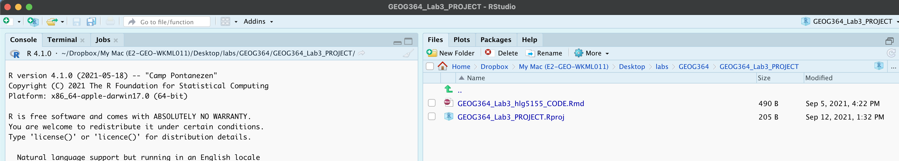

<style>
p.comment {
background-color: #DBDBDB;
padding: 10px;
border: 1px solid black;
margin-left: 0px;
border-radius: 5px;
font-style: normal;
}

h1.title {
  font-weight: bold;
  font-family: Arial;  
}

h2.title {
  font-family: Arial;  
}

</style>


<style type="text/css">
#TOC {
  font-size: 12px;
  font-family: Arial;
}
</style>

\
```{r setup, include=FALSE}
knitr::opts_chunk$set(echo = TRUE, warning=FALSE, message = FALSE)
```


```{r,include=FALSE,echo=FALSE}
# invisible data read
library(tidyverse)
library(sp)
library(sf)
library(readxl)
library(skimr)
library(tmap)
library(USAboundaries)
library(viridis)
library(rnaturalearth)

frost <- readxl::read_excel("pg_364Data_1frostday.xlsx")
firefly <- readxl::read_excel("pg_364Data_3Firefly.xlsx")
```

## Welcome to Lab 3!

<br>

The aim of this lab is to learn more about manipulating our data.frames, and also to start working with spatial data. We will also learn about some new markdown techniques for "inline code" and adding pictures. By the end of the lab you will be able to.

 - 1. Understand code comments
 - 2. Insert a photo/screenshot into your report.
 - 3. Filter and manipulate your tables of data
 - 4. Convert your data to spatial
 - 5. Make some maps

Assignment 3 is due by midnight the night before your next lab on Canvas. Your job is to submit the requirements on this page.

See [**this page**](https://psu.instructure.com/courses/2120046/assignments/13274835) or go to canvas for assignment guidelines.

<p class="comment">**Need help?**  Add a screenshot/question to the discussion board here:    [**LAB 3 DISCUSSION BOARD**](https://psu.instructure.com/courses/2120046/discussion_topics/14125711)</p>

<br>

<div style="margin-bottom:25px;">
</div>  
## Step A: Set up the lab

First, we want to set up R in the same way as Lab 1 and 2, creating a project file and a blank markdown document.

1. Open R-Studio.<br>Create a new R-Project in your GEOG-364 folder called `GEOG364_Lab3_PROJECT`.<br>*Reminder: [Tutorial 2C: Projects](https://psu-spatial.github.io/Geog364-2021/pg_Tut2_startup.html)*.   
   
<br>  

2. Go on Canvas to the Lab 3 page and download the dataset (firefly.xlsx).<br>Put it in your `GEOG364_Lab3_PROJECT` folder (or use the upload button in R-studio cloud).  Your directory should look like this.  If things don't look like this, ask for help.<br>*On a desktop, if your code template ended up in your lab 2 folder, move it into the main GEOG-364 one.*

```{r, Lab3Fig1, echo=FALSE, fig.align='center',out.width="70%"}

```

<br>

3. Let's retrieve our lab template: 
    a. *If you're on your own computer:*<br>
       + Make a **COPY** of the template Rmd file.
       <br>
       + Rename the **COPY** `GEOG364_Lab3_userID_CODE.Rmd` e.g. for me GEOG364_Lab3_hlg5155_CODE.Rmd
       <br>
       + Move GEOG364_Lab3_userID_CODE.Rmd into your GEOG364_Lab3_PROJECT folder.
       <br>
    
    <br>
    
    b. *If you're using R-studio cloud.*<br>
       + Click on your Lab 2 project folder
       <br>
       + In the files tab, click the check box by your template file, then click the More button/Export and download it.
       <br>
       + Click on Workspaces (top left) and enter your Lab 3 project folder.
       <br>
       + In the files tab, click upload and upload the template
       <br>
       + Now click the check box by the template file and rename to `GEOG364_Lab3_userID_CODE.Rmd`
       <br> e.g. for me GEOG364_Lab3_hlg5155_CODE.Rmd<br>

<br>

In both cases, your "Lab 3" R-Studio should look like this.  If not ASK FOR HELP

```{r, Lab3Fig2, echo=FALSE, fig.align='center',out.width="100%"}

```


<br>

4. Click on the .Rmd file in the files tab.  It should open the script.  
     + Change the title to Lab 3.  <br>    
     + Change the theme if you like :) If you want a big change, check out darkly.<br>     
     + Edit the library code chunk so it looks like this:
       ```{r,eval=FALSE}
       library(knitr) 
       library(tidyverse)
       library(sf)
       library(sp)
       library(tmap)
       library(skimr)
       library(rnaturalearth)
       library(readxl)
       ```
<br>   
   + In the **CONSOLE**, run this command to download the RNaturalEarth highres data (this is a one off).<br> *If running this comes up with an error like "skipping install because it's not changed, it means you have already downloaded this and can move on.*
       ```{r,eval=FALSE}
       remotes::install_github("ropenscilabs/rnaturalearthhires")
       ```
<br>

5. Press knit. You screen should look like this.  If so,congrats! If not, ASK FOR HELP

```{r, Lab3Fig3, echo=FALSE, fig.align='center',out.width="90%"}
knitr::include_graphics('pg_364Lab3_Spatial_2021_fig3.png')
```

<br>

<div style="margin-bottom:25px;">
</div>  
## Step B: Commenting code

6. Read [Tutorial 15A: Comments](https://psu-spatial.github.io/Geog364-2021/pg_Tut15_coding.html) to understand about code comments.

<br>
 
7. Rename your "first heading" to "Code Comments"  (or create a level 1 heading called Code Comments)

<br>

8. Create a new code chunk and inside, calculate the number of characters in the word "elephant". Write some brief comments INSIDE the code chunk to explain what you did.<br> Below the code chunk in the text, explain why comments might be useful.

<br>

<div style="margin-bottom:25px;">
</div>  
## Step C: Adding photos to text.

Reports look better with pictures & photos. 

9. Use [Tutorial 4H](https://psu-spatial.github.io/Geog364-2021/pg_Tut4_markdown.html#Tutorial_4H:_Adding_photos) to add any picture/photo of your choosing.  

<br>

10. In the figure caption, make sure you include the source.<br>Below the picture, explain why you chose it! 

<br>

11. Explain also why you added echo=FALSE into the code chunk options (hint: https://rmarkdown.rstudio.com/lesson-3.html)

<br>

<div style="margin-bottom:25px;">
</div> 
## Step D: Firefly analysis

Now, the lab!   We are going to examine some crowd-sourced data with firefly sightings across the USA.

To to this, we are going to follow these steps.  You'll notice they are very similar to Lab 2.... (the aim of each lab is that it builds on the ones before)

 - B1 Investigate the topic before touching the data
 - B2 Read the file containing the data into R
 - B3 Explore the "meta data" e.g. summarise the data itself
 - B4 Calculate summary statistics on our columns of interest
 - B5 Make the data spatial
 - B6 Make some maps

<br> 

### D1: Exploratory Investigations

The aim of this lab is to explore spatial patterns in reported sightings of fireflies/lightning bugs. Refresh your knowledge on fireflies (these are just ideas.. spend 5-10mins on this max)

 - here: https://www.massaudubon.org/learn/nature-wildlife/insects-arachnids/fireflies/about 
 - or this video if you're a visual learner: https://www.youtube.com/watch?v=Y7RI1qjB2r8
 - https://www.massaudubon.org/get-involved/community-science/firefly-watch/resources
    
Although fireflies are well loved insects, we don't actually have a map of where they are - or if they are declining or increasing.  For example, we don't know how climate change, pesticides or light population are affecting their numbers. 

To gain more data, a group of researchers started a citizen-science project called Firefly Watch where people could submit their firefly observations.  See more here:

https://www.massaudubon.org/get-involved/community-science/firefly-watch
 
We are going to analyse some of the data from the project.


<br> 

12. Make a new level-1, heading called "Study Summary"

<br>

13. Summarise the topic.  For example, you could:
     + Introduce fireflies as a topic and explain why we might want to map them<br>
     + Summarise a few facts about fireflies from your reading.<br>
     + In a new paragraph, explain the aim of the firefly watch study and how someone submits an observation.<br>
     + Make it look good!  Include formatting of your choice (sub-headings, bold, bullet points, photos..).
     
<br>

<p class="comment">There is a spell check next to the knit button at the top of the script. Press knit regularly to check it all looks good</p>


<br>

<div style="margin-bottom:25px;">
</div>
### D2: Read in firefly data file.

14. Make a new level-1, heading called "Data Description".  Use [Tutorial 6A](https://psu-spatial.github.io/Geog364-2021/pg_Tut6_input_output.html) to read the data into R and save as a variable called `firefly`.

<br>

15. In your read_excel code above, edit the code chunk option so that echo=FALSE and the code doesn't show up in your final report. [Tutorial 4F](https://psu-spatial.github.io/Geog364-2021/pg_Tut4_markdown.html#Tutorial_4F:_Formatting_code_chunks) or (https://rmarkdown.rstudio.com/lesson-3.html)


<br>

16. Now, explore the table itself and write up your results. Specifically:
     + Have a look at the data using the View command  (`View(firefly)`), or clicking on its name
   <br>
     + Choose some summary statistics from [Tutorial 8](https://psu-spatial.github.io/Geog364-2021/pg_Tut8_summarystat.html) to assess the data (or others!).<br>
    
<br>
   
17. Use your analysis to answer these questions IN FULL SENTENCES in the text.
     + How many observations are there? (how many rows)<br><br>
     + What is the unit of observation (e.g. what does each row represent?) 
   <br> *hint.. this is NOT one row for each firefly in the USA! See Labs/lectures for more*<br><br>
     + What variables do we have?  E.g. what columns do we have for each observation?<br><br>
     + Which years do we have data for?  How many observations in each year? (hint, apply  the `table()` command to the Year column of the firefly dataset)<br><br>
     + Is Pennsylvania included in the dataset? How many observations were taken in PA?

I SHOULD BE ABLE TO SEE IN YOUR CODE WHERE YOU GOT EACH ANSWER (e.g. leave your code visible)

<br>

<div style="margin-bottom:25px;">
</div>
### D3: Data wrangling

18. Make a new level-2, heading called "Data Wrangling".<br>Read the new Tutorials on filtering and arranging data: [Tutorial 7D](https://psu-spatial.github.io/Geog364-2021/pg_Tut7_wrangle.html)

<br> 

19. Do the following tasks
     + Use R to find the value of the second row and the 4th column in your data<br><br>
     + Filter just the rows of data that in April, and save to a new variable called april.firefly

<br>     
     
20. If you look closely at your summary, you might find there are some unusual temperature values.<br>.Let's assume that the temperature of 8000F is not likely to be true.  Filter the data so that the temperature is below 200F and overwrite (e.g. save the result as a variable called firefly).

<br>

<div style="margin-bottom:25px;">
</div>
### D4: Making your data spatial

21. Make a new level-1, heading called "Spatial Data".<br>Read the new Tutorial on spatial data basics: [Tutorial 11A](https://psu-spatial.github.io/Geog364-2021/pg_Tut11_spatial101.html#Tut11a_basics)

<br> 

22. In the text, explain why someone who has data in lat/long projection is unable to plot it with country borders in UTM Zone 17 projection.  

<br> 

23. Read the new Tutorial 11 and 11a on creating sp data: [Tutorial 11B](https://psu-spatial.github.io/Geog364-2021/pg_Tut11_spatial101.html#Tutorial_11B:_Vector_Data)

<br> 

24. In a new paragraph, explain if you think the firefly data is marked, and if so, give an example of a mark.  What does the st_geometry() command do when plotting marked data?

<br>

25. Your firefly data is in standard lat/lon, so EPSG=4326.<br>
Use [Tutorial 11B](https://psu-spatial.github.io/Geog364-2021//pg_Tut11_spatial101.html#b_Converting_a_dataframe_in_R_to_spatial_sf) Make a sf version of your firefly data and assign it to a variable called firefly.sf.  You can leave it in lon/lat/4326 this lab.

<br>

26. Use [Tutorial 11Bc](https://psu-spatial.github.io/Geog364-2021/pg_Tut11_spatial101.html#Tut11bc_read) to load rnaturalearth state-boundaries for US States. Assign to a variable called states.sf and use st_transform to convert to projection 4326.


<br>

### D5: Making maps

Let's now see how our data looks plotted.  Create a new level-1 heading called "Data Maps", then in a new code chunk enter the following code. You should see a basic plot with the firefly locations and the state borders.  If so, congrats!  If not, you need to adjust your projections or something has happened.

```{r,include=FALSE}
firefly.sf <- st_as_sf(firefly,crs=4326,coords=c("Longitude","Latitude"))
states.sf <- ne_states(country="united states of america",returnclass="sf")
                       
                     
```


```{r}
plot(st_geometry(firefly.sf),
     pch=16,
     col=rgb(0,0,1,.5),
     cex=.5,
     main="Firefly locations")

plot(st_geometry(states.sf),add=TRUE)
```

27. Recreate this plot in your report.  Google the `rgb()` command and edit your plot so that the points are semi-transparent purple. (hint https://www.r-graph-gallery.com/43-rgb-colors.html )


The plot above is still pretty basic, so lets explore another of the big packages available to let you make "pretty plots" of spatial data.  There are three big mapping functions in R:  ggmap, tmap and leaflet.  We're going to look at tmap.  

Look at the command below, you can see that we're building a series of layers linked by the + symbol.


```{r}
tmap_mode("plot")                             # Set the static plot mode

myplot <- tm_shape(firefly.sf) +               # Load the firefly data 
          tm_dots(col="black", size=0.05) +    # Plot it as dots
          tm_shape(states.sf) +                # Load the state borders
          tm_borders(lwd=.5)                   # Plot them as just borders
  
myplot
```

I have saved it as a variable called myplot and printed its name so that it's saved in R.  This means I can now turn on the interactive view mode and re-plot

```{r}
tmap_mode("view")
myplot
```

and back to static:
```{r}
tmap_mode("plot")
myplot
```

28. Get the tmap plots working in your lab-script.  Now explore and summarise any spatial patterns you see in the data.<br>Comment especially if the data appears to follow Tobler's law.

<br>

29. A friend of mine is convinced that the firefly sightings are linked to temperatures and elevation.  Another friend is convinced that they are linked to light pollution and cities.<br>Change the base-maps in the INTERACTIVE MAP (there's a layer button under the zoom) to explore and comment on this topic.  For example the terrain layer gives a sense of elevation and the open maps layer will let you see where the cities are..

<br> 

30. HARD QUESTION.  The reality is neither of the hypotheses stated above!  Why does your data appear to overlap with cities?


 
## Steo E. Above and beyond

This is back!  Remember that an A is 93%, so you can ignore this section and still easily get an A.

But here is your time to shine. Also, if you are struggling in another part of the lab, you can use this to gain back points.

**To get the final 4 marks in the lab, you need to show me something new, e.g. you need to go above and beyond the lab questions in some way.** 

 - You get 2/4 for doing something new in any way
 - You get 4/4 for something really impressive or multiple small things.
 
Please tell us in your R script what you did!

For example, these would get 2/4:

 - Copying code from earlier in the lab to plot the firefly data, then changing the point shape to crosses, or adding in other plot formats
 - Adding a new YAML element (you will have to do this at the top and describe what you did here)
 - Showing me you know how to do some new markdown format (tables, links,equations), https://rmarkdown.rstudio.com/lesson-6.html
 - Something you think of - be creative!

<br>

For 4/4 

 - You could read your new york data back in and show off some analysis you learned in Lab 3 there.
 - Find a new package and make it work.  For example papeR and summarize is very cool.
 - See if you can use the elevatr package to read in and plot an elevation map of the USA. Bonus if you can make it a background for the firefly data.
 - You could make and submit (ADDITIONALLY) a working pdf of your lab script
 - Really be creative here.  Someone last year worked out how to plot their points as emojis!


## Step F. Submitting your Lab

Remember to save your work throughout and to spell check your writing (left of the knit button). Now, press the knit button again. If you have not made any mistakes in the code then R should create a html file in your lab 2 folder which includes your answers. If you look at your lab 2 folder, you should see this there - complete with a very recent time-stamp.

In that folder, double click on the html file.  This will open it in your browser. CHECK THAT THIS IS WHAT YOU WANT TO SUBMIT

Now go to Canvas and submit BOTH your html and your .Rmd file in Lab 2.

<br>

## Lab 3 submission check-list

**HTML FILE SUBMISSION - 5 marks**

**RMD CODE SUBMISSION - 5 marks**

**MARKDOWN/CODE STYLE - 16 MARKS**

Your code and document is neat and easy to read. LOOK AT YOUR HTML FILE IN YOUR WEB-BROWSER BEFORE YOU SUBMIT.You have written in full sentences, it is clear what your answers are referring to. YOU HAVE USED THE SPELL CHECK. SPELLING ERRORS LOSE YOU MARKS.
    
**MARKDOWN LEVEL-UP: 10 MARKS** 

You have successfully commented your code and added a photo of your choice.<br>  
*Full marks = everything down at a high standard, in full sentences as appropriate with no parts of your answer missing. Imagine it as an example I use in class*

**FIREFLY:Description 15 MARKS** 

You fully described the firefly dataset.<br>
*Full marks = everything down at a high standard, in full sentences as appropriate with no parts of your answer missing*


**FIREFLY:Summary 15 MARKS** 

You successfully read in and summarised the firefly dataset, answering all questions.<br>
*Full marks = everything down at a high standard, in full sentences as appropriate with no parts of your answer missing*

 
**FIREFLY: Data wrangling & spatial: 15 MARKS** 

You included all the code and successfully answered the questions. You successfully converted your data into spatial data, downloaded the state borders and managed to get the plots working.

**FIREFLY: Spatial exploration: 15 MARKS** 

You sensitively (in full sentences) explored the spatial patterns in the firefly data, commenting on Tobler's law and fully answering Questions 28-30.

**Above and beyond: 4 MARKS**

You get 2/4 for doing something new in any way and 4/4 for something really impressive or multiple small things.


[100 marks total]


***

Website created and maintained by [Helen Greatrex](https://www.geog.psu.edu/directory/helen-greatrex). Website template by [Noli Brazil](https://nbrazil.faculty.ucdavis.edu/)