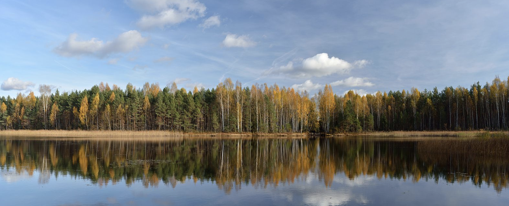
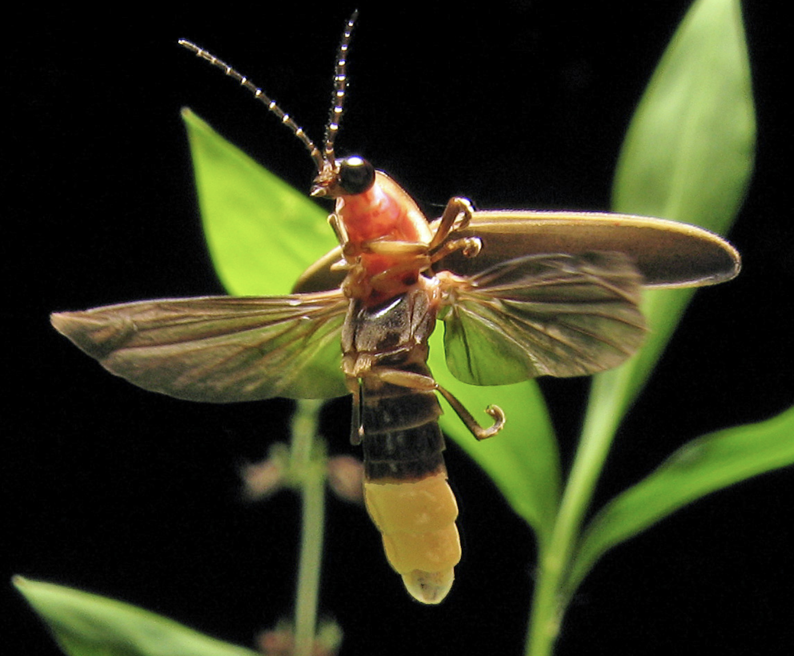

```{r setup, include=FALSE}
knitr::opts_chunk$set(echo = TRUE, message=FALSE, warning=FALSE)
firefly <- readxl::read_excel("pg_364Data_3Firefly.xlsx")

```

# Load Libraries

```{r, message=FALSE, warning=FALSE}
library(knitr)
library(tidyverse)
library(sf)
library(sp)
library(tmap)
library(skimr)
library(rnaturalearth)
library(readxl)
```

# Code Comments

```{r}
#I am calculating the number of characters in the work 'elephant'
num <- nchar("elephant")

```

Comments are important for differentiating between R commands and regular text within a console. Comments tell R not to interpret that part of the information as command but to ignore it. Adding comments help to document the things we do for future reference. Comments are also useful for excluding pieces of code that we do not want to run.

***Adding a photo***

```{r, echo=FALSE,fig.align='center', out.width="70%",fig.cap="A beautiful landscape, image from: By Ivar Leidus - Own work, CC BY-SA 3.0, https://commons.wikimedia.org/w/index.php?curid=29024401"}

```

I chose to include a picture of a beautiful landscape because I really like natural landscapes.

***echo=FALSE*** was added in the code chunk in order to make sure that the code for inserting the picture does not show up in the resulting html when I knit, and that only the output (picture) is visible.

# Study Summary

***About fireflies***

Fireflies are beetles that use a chemical reaction in their abdomen to emit light. These lights are often seen as flashes that come on and off in darkness as thy fly. Depending on the species or group, some fireflies will emit the light in quick flashes, others in long lasting glows and others produce a light that is invisible to the human eye. It is believed that the flashing patterns are a way that fireflies communicate or attract mates.

```{r, echo=FALSE, fig.align='center', out.width="70%",fig.cap="A firefly, image from: art farmer from evansville indiana, usa, CC BY-SA 2.0 <https://creativecommons.org/licenses/by-sa/2.0>, via Wikimedia Commons"}

```

***Why study fireflies?***

Fireflies are highly beneficial insects because they play a great role as pollinators. Fireflies feed on pollen and nectar and are therefore very effective pollinators as they move from flower to flower.

***The aim of the firefly watch study***

The Firefly Watch project aims to map firefly locations. These maps help to determine changes in firefly populations and understand the factors that could lead to any such changes. Anyone can participate in the project by observing and reporting firefly sightings in their backyard. To participate, one need to first identify a suitable location/habitat at which to observe fireflies. 

They also need to create an account at [this site](https://www.massaudubon.org/get-involved/community-science/firefly-watch) where they submit observations. Reports should include the number of flashing fireflies observed over the course of 10 minutes in three 10 second periods and the number of flashing patterns seen. Participants are also required to provide additional details about the location of observation including:

-   Habitat type (and if it was mowed that firefly season)
-   Temperature
-   Precipitation
-   Wind
-   Cloud cover
-   Artificial light presence

# Data Description

```{r, echo=FALSE,eval=FALSE}
firefly <- read_excel("fireflydata.xlsx")
```

The firefly data set contains 20134 locations where people looked for fireflies and 12 attributes related to each observation location.


**How many observations are there? (how many rows)**

```{r}
nrow(firefly)
```

There are `r `nrow(firefly)` observations of fireflies.

**What is the unit of observation (e.g. what does each row represent?)**

The unit of observation is a person's (observer) firefly sightings at a selected location and specific time.

**What variables do we have? E.g. what columns do we have for each observation?**

The variables contain more information related to the specific observation location. These include:

```{r, }
names(firefly)
```

Where:

-   Year: The year of observation
-   Month: Month of observation
-   Day: Day of observation
-   Latitude: The y geographic coordinates of location observed
-   Longitude: The x geographic coordinates of location observed
-   State: The state within which the observation was made
-   Country: Country of observation
-   Location: The setting or locality where observation was made
-   Backyard: Whether or not they were observed in the backyard
-   Temperature: The temperature in degrees farenheits at the time of observation
-   Number.Seen.in.10.s: The number of fireflies that were seen within a 10 second period
-   Clouds: Sky conditions, whether or not it was cloudy at the time of observation

**Which years do we have data for? How many observations in each year?**

These are the years for which we have data for:

```{r}
table(firefly$Year)
```

**Is Pennsylvania included in the dataset? How many observations were taken in PA?**

```{r}
'PA' %in% firefly$State
```

Pennsylvania is included in the dataset.

```{r}
table(firefly$State)
```

We have 1728 observations for Pennsylvania.

## Data Wrangling

***Second row and the 4th column***

```{r}
firefly[2,4]
```

The value of the second row and the 4th column is a ***latitude location, 42.3683 degrees***

***The rows of data that are in April.***

```{r}
april.firefly <- filter(firefly, Month==4)
```

***Only keep data where temperature is below 200 F (more realistic values)***

```{r}
firefly <- filter(firefly, Temperature_F < 200)
```

# Spatial Data

Based on tutorial 11a, it is not possible to plot data that is in lat/lon projection on a map with country borders in UTM Zone because these are two different coordinate systems that use [**different units**]{.ul} to place items on the surface of the earth. The lat/long coordinate system uses degrees and UTM uses meters.

The firefly data [**is marked**]{.ul}. This is because it contains 10 attributes (excluding lat/lon coordinates) that provide us more information about the location where fireflies were observed. In this dataset, example marks include temperature, cloud conditions, year, month, and day of observation, whether or not the location was in a backyard.

The [**st_geometry()**]{.ul} command tell R to [**ignore marks**]{.ul} when plotting data that is marked. This ignores all the marks and only plots the locations of points (if point data) or borders of polygon (if polygon data).

***Converting firefly data to sf***

```{r}
firefly.sf <- st_as_sf(firefly,coords = c("Longitude", "Latitude"),crs=4326)
```

***Loading rnaturalearth state-boundaries for US States and convert to projection 4325 (geographic)***

```{r}
states.sf <- ne_states(country="united states of america",returnclass = "sf")

# Transform to 4326
states.sf <- st_transform(states.sf,crs=4326)
```

# Data Maps

***A basic map of the firefly locations***

```{r}
plot(st_geometry(firefly.sf),
     pch=16,
     col=rgb(0.6,0.2,1,.5),#semi-transparent purple
     #col=rgb(0,0,1,.5),
     cex=.5,
     main="Firefly locations")

plot(st_geometry(states.sf),add=TRUE)
```

***Using "tmap" to make pretty plots***

```{r}
tmap_mode("plot")                             # Set the static plot mode

myplot <- tm_shape(firefly.sf) +               # Load the firefly data 
          tm_dots(col="black", size=0.05) +    # Plot it as dots
          tm_shape(states.sf) +                # Load the state borders
          tm_borders(lwd=.5)                   # Plot them as just borders
  
myplot
```

***Turning on the interactive view mode***

```{r}
tmap_mode("view")
myplot
```

***Summarize any spatial patterns you see in the data. Comment especially if the data appears to follow Tobler's law.***

Looking at the distribution of points on the map, it does appears as though the points are clustered. First, most of the points are in the eastern half of the country. Looking at the local distribution of the points, we also see aspects of spatial autocorrelation whereby fireflies are observed at or near the same localized location in smaller clumps around

***A friend of mine is convinced that the firefly sightings are linked to temperatures and elevation. Another friend is convinced that they are linked to light pollution and cities. Change the base-maps in the interactive maps (there's a layer button) to explore and comment on this topic.***

It does appear that firefly sightings are more on low that high elevation areas. This could be related to there not being a lot of people living in very high elevated locations possibly dies to the rugged terrain. It is also likely (thought not currently possible to prove) that fireflies may prefer warmer environments at low elevation to cold high elevated areas.

The data points appear to overlap with cities. This is shown by how clustered the points are close to major cities. This may not be related to there being lights or to light pollution in cities. Most people are in cities, and since this is crowd-sourced data, it is expected that most reports would be near cities.

***Why does your data appear to overlap with cities?***

This is most likely because that is where people are. The data are collected by people, and so it is expected that there would be more observations close to where most people live.

[**Above and beyond**]{.ul}

Students to indicate here what they did beyond what is required in the lab.
