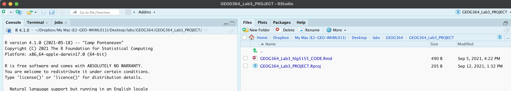
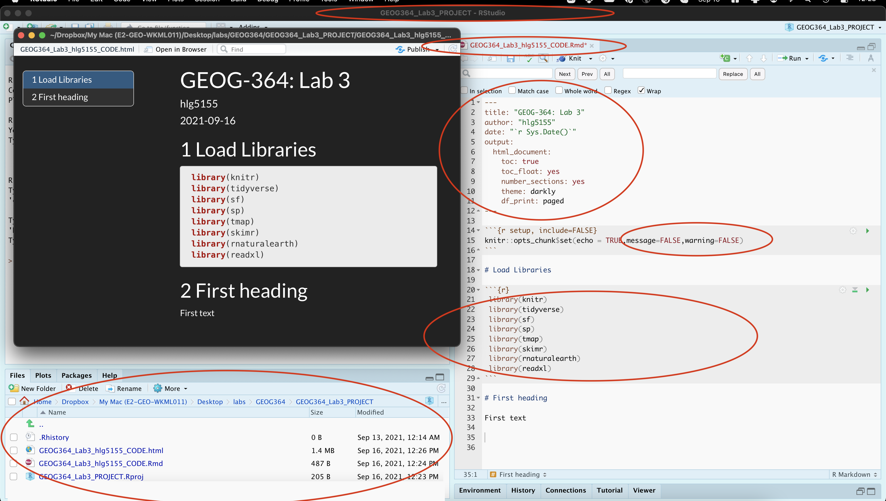
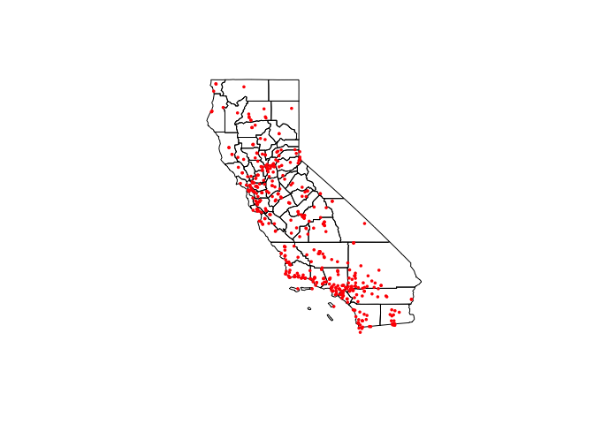
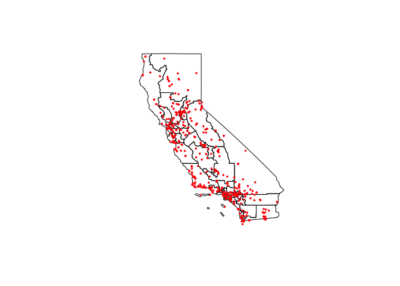
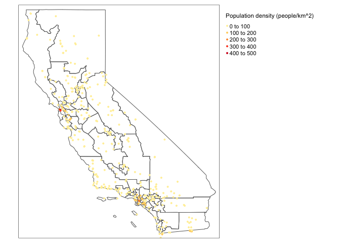
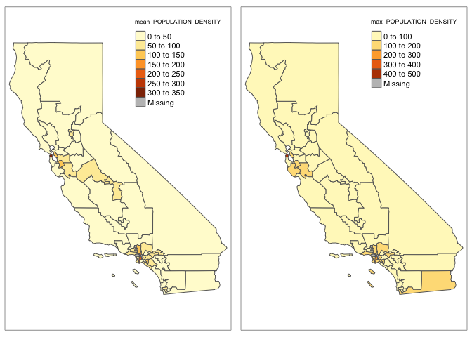
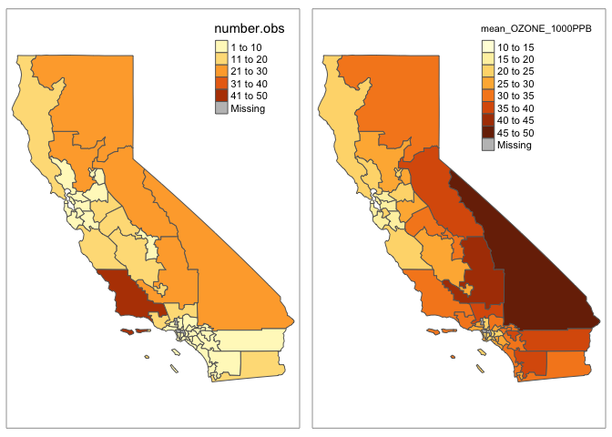

<style>
p.comment {
background-color: #DBDBDB;
padding: 10px;
border: 1px solid black;
margin-left: 0px;
border-radius: 5px;
font-style: normal;
}

h1.title {
  font-weight: bold;
  font-family: Arial;  
}

h2.title {
  font-family: Arial;  
}

</style>


<style type="text/css">
#TOC {
  font-size: 11px;
  font-family: Arial;
}
</style>

\


## Welcome to Lab 4!

<br>

The aim of this lab is start getting more comfortable making high quality maps and manipulating data.  We will also learn about some new markdown techniques for "inline code" and adding equations By the end of the lab you will be able to.

 - 1. Use inline code commands
 - 2. Insert an equation into your text and data
 - 3. Make beautiful spatial plots
 - 4. Read in shapefiles and manipulate your data spatially
 - 5. Re-analyse your new york data

Assignment 4 is due by midnight the night before your next lab on Canvas. Your job is to submit the requirements on this page.

See [**your canvas assignment here**](https://psu.instructure.com/courses/2120046/assignments/13274836).  E.g go to canvas for assignment guidelines.

<p class="comment">**Need help?**  Add a screenshot/question to the discussion board here:    [**LAB 4 DISCUSSION BOARD**](https://psu.instructure.com/courses/2120046/discussion_topics/14125712)</p>

<br>
<br>

<div style="margin-bottom:25px;">
</div>  
## A: Set up the lab


Set up R-Studio in the same way as before, creating a project file and a blank markdown document.<br>This will be the last time I am going to spell it out.

1. **Step 1**<br>Open R-Studio.<br>Create a new R-Project in your GEOG-364 folder called `GEOG364_Lab4_PROJECT`.<br>*Reminder: [Tutorial 2C: Projects](https://psu-spatial.github.io/Geog364-2021/pg_Tut2_startup.html)*.   
  

<br>  

2. **Step 2**<br>Go on Canvas to the Lab 4 page and download any datasets as needed (`ozone.csv`) <br>Put it/them in your `GEOG364_Lab4_PROJECT` folder.  See the lab 3 instructions for how it should look.

<br>

3. **Step 3**<br>Make a copy of the lab template: 
    a. *If you're on your own computer:*<br>
       + Make a **COPY** of the template Rmd file.
       <br>
       + Rename the **COPY** `GEOG364_Lab4_userID_CODE.Rmd` e.g. for me GEOG364_Lab3_hlg5155_CODE.Rmd
       <br>
       + Move GEOG364_Lab4_userID_CODE.Rmd into your GEOG364_Lab4_PROJECT folder.
       <br>
    
    <br>
    
    b. *If you're using R-studio cloud.*<br>
       + MAKE SURE YOU WENT TO YOUR WORKSPACE AND MADE A LAB 4 PROJECT!
       + Click on your Lab 4 project folder
       <br>
       + In the files tab, click the check box by your template file, click More/Export & download it.
       <br>
       + Click on Workspaces (top left) and enter your Lab 4 project folder.
       <br>
       + In the files tab, click upload and upload the template
       <br>
       + Now click the check box by the template file and rename to `GEOG364_Lab4_userID_CODE.Rmd`
       <br> e.g. for me GEOG364_Lab4_hlg5155_CODE.Rmd<br>

<br>

In both cases, your "Lab 4" R-Studio should look like this but for lab 4.  If not ASK FOR HELP

<div class="figure" style="text-align: center">

<p class="caption">*This is for lab 3 but you get the idea.*</p>
</div>

<br>

<p class="comment">**IMPORTANT! Did you open R via your lab 4 project file?** If R-studio *isn't* "looking in" your lab 4 folder in Files, or doesn't have your lab 4 project name on the logo/at the top of the screen, close R studio, go to your lab 4 folder and double click the .Rproj to open your lab 4 project</p>

<br>

4. **Step 4**<br>Click on your lab 4 .Rmd file in the files tab to open the script<br>(You should not have to search if you are in your Lab 4 project):<br>
     + Change the title to Lab 4.    
     + Change the theme if you like     
     + Edit the library code chunk so it looks like this:
       
       ```r
       library(knitr) 
       library(tidyverse)
       library(sf)
       library(sp)
       library(tmap)
       library(skimr)
       library(rnaturalearth)
       library(readxl)
       ```
     + Add in message=FALSE and warning=FALSE inside the top code chunk (see screenshot below) to remove the packages printing all the text
     + If you accidentally messed up something remember you can re-copy your YAML code or options from a previous lab.<br>*The easiest way to do this is to navigate on your computer to that lab folder then double click the project file for the old lab to open an entirely new version of R-Studio for that lab. Then nothing gets confused*<br>*equally on the cloud, make a new tab in your browser, go to your workspace (top left), and open the other project there*<br>     
     + Press knit.

<br>   

You screen should now look like this but for Lab 4 and your options.  If so,congrats<br>If not, ASK FOR HELP.  

<div class="figure" style="text-align: center">

<p class="caption">*Note, your message=FALSE and warning = FALSE can go in the general options like my screenshot, or in the code chunk options for the library chunk*</p>
</div>

<br>

<div style="margin-bottom:25px;">
</div>  
## B: Markdown Edits

We are now going to insert "inline code" along with mathematical equations:

5. **Step 5: Visual editor**<br>Read the section: [Tutorial 4G: Visual Editor](https://psu-spatial.github.io/Geog364-2021/pg_Tut4_markdown.html#Tutorial_4G:_Formatting_text) to turn on the markdown visual editor (near the top of 4G)

<br>

6. **Step 6: Inline code**<br>Follow the new inline-code tutorial in [Tutorial 4F: Inline Code](https://psu-spatial.github.io/Geog364-2021/pg_Tut4_markdown.html#Tutorial_4F:_Formatting_code_chunks) to understand about inline code

<br> 

7. **Step 7: Equations**<br>Follow [Tutorial 4I: Equations](https://psu-spatial.github.io/Geog364-2021/pg_Tut4_markdown.html#Tutorial_4I:_Adding_equations) to understand about adding equations.

<br> 

8. **Step 8:**<br> Make a new section called Markdown.<br>*Feel free to use subsections, numbers, font formats throughout to make it look professional as possible<br> IF YOU SKIPPED STEPS 6,7,8, GO DO THEM.* 

<br>


9. **Step 9:**<br>Now, attempt the following tasks, which are building on those tutorials but also on what you learnt in Labs 1,2 & 3:<br>[TUTORIAL 4: MARKDOWN](https://psu-spatial.github.io/Geog364-2021/pg_Tut4_markdown.html#Tutorial_4G:_Formatting_text) HAS THE ANSWERS.

   a. **Visual editor**<br>Write a short paragraph to explain the difference between pattern and process ([**See Lecture 5A & Sullivan chapter pdf**](https://psu.instructure.com/courses/2120046/pages/lecture-5a-maup-pattern-vs-process)).<br>Use the visual editor to play with the fonts & formats.<br>*[you are being graded on the paragraph content not the format, so go wild]*<br><br>
   b. **Inline code**
      + COPY your frost data from Lab 2 to your Lab 4 folder.    
      + In a code chunk, read in the data to a variable called frost.  
      + In the same code chunk, calculate 
         + *the mean of the Elevation column*
         + *the number of rows*  
         + *the number of columns( hint `nrow() and ncol()`)*
         + Save the answers to sensibly named variables e.g. `frost.elev`,`frost.nrow`....<br>
      + Edit the code chunk options so that the code and output are invisible when you press knit (you will still see them in the editing window).<br><br>
      + In the text make a new paragraph, that says<br>_*"In lab 2, we read in a dataset called frostdata.xlsx.  The data has XXXX rows and YYYY columns,  The mean of the Elevation column is ZZZZ UNITS."*_.<br><br>Replace XXXX, YYYY and ZZZZ with inline code that creates the answers automatically and UNITS with the appropriate units.<br><br>   
   c. **Rounding**<br> Your mean elevation is to too many decimal places in your sentence.<br>Use the  `round()` command to round your output to a sensible number of significant figures.<br>To do this:<br> 
      + See this tutorials below on round (or google)  https://www.datasciencemadesimple.com/round-function-in-r/
      + Make a new copy of your sentence about frost, 
      + Now edit the inline code chunk to round the mean of the elevation to an appropriate number of decimal places for your units.<br>
      + Your final sentence should look something link this but about your frost data and with a good number of decimal places for your units.<br><br>*"In the inbuilt starwars dataset, there are 87 rows and  14 columns.  The average height of a character is 174.4 cm."*
   d. **Equations**<br> In a new paragraph, describe the Z score and include the equation properly formatted.<br>
   
   
<br>

<div style="margin-bottom:25px;">
</div>  
## C: Better spatial plots

<br> 

This is the final "lego" lab e.g. where it is more about building blocks than statistics.  So let's improve our maps. There are some wonderful tutorials online, much better than I could write.  So we shall work through one of them

10. **Step 10:**<br>Tutorial script.<br>We need a place for you to work through the tutorial.  Follow step 3 to make a new copy of your lab template and put it in the Lab 4 folder.**This time, call your copy  `GEOG364_MapTutorial.Rmd`**

<p class="comment">**You do NOT have to submit your tutorial file**</p>

11. **Step 11:**<br>Work through the tutorial.<br>Go here: https://mgimond.github.io/Spatial/mapping-data-in-r.html <br> Work through the mapping tutorial at that page, copying the code into code chunks in your tutorial lab script, checking it works and trying to understand why each line of code is there.

12. **Step 12:**<br> Once you are done, close your tutorial script so that you don't accidentally edit it for your Lab 4. 

<br>

<div style="margin-bottom:25px;">
</div>  
## D: Ozone & MAUP

### Lab Background

<span style="color:#134f5c">As cities increase in size, it is  important to understand atmospheric air pollution. Two major pollutants include Ozone (O3) and particulates (PM 2.5). In this lab, we will map them and explore their impact on populations in California.</span>

<span style="color:#134f5c">Ozone is a naturally occurring molecule made up of three Oxygen atoms. 90% of the plant’s ozone exists in the “ozone layer”, which exists approximately 20-25km above sea level, in the stratosphere. Stratospheric ozone is crucial for human life, as it absorbs damaging solar ultra-violet radiation (see the “ozone hole” for the importance of natural ozone).</span>

<span style="color:#134f5c">However, 10% of the planet’s ozone is found in the lowest levels of the atmosphere, in the air which we breathe. It is created when pollutants such as NOx and VOCs (emitted by cars and industry) react with sunlight.</span>

<span style="color:#134f5c">Strong evidence exists that the risk of premature death increases with increased amounts of low-level-ozone.Too much ozone can cause immediate health problems such as asthma. Over the longer term, ozone exposure can exacerbate pre-existing lung and heart health problems.  It is therefore important to map the spread of ozone to support public health policy.</span> 

<span style="color:#134f5c">To explore this issue, ozone measurements were taken across the State of California. Population density has also been recorded at each site using this source: https://sedac.ciesin.columbia.edu/data/set/gpw-v4-population-density-rev11.</span>

 - <span style="color:#134f5c">*The units of the ozone measurements are in “1000 parts per billion”.</span>
 - <span style="color:#134f5c">*The units of population density are people per square km.</span>


<br>
<br>

### Basics

13. **Step 13:**<br>Read the `ozone.csv` data into R and assign to a variable called `ozone`.<br>*hint! Like HW4 you need a the `read.csv()` command instead of the read_excel one. Tutorial here if you're stuck (https://www.datacamp.com/community/tutorials/r-data-import-tutorial)*

<br>

14. **Step 14: Summary Statistics...**<br>This is week 4, you know the drill! Explore the data and tell me professionally in the text:<br>

   a. Tell me more about Ozone pollution and health.  What's the big deal (feel free to use REFERENCED pictures/screenshots)<br><br>
   b. Tell me what you know about the data/study.  Imagine you are a journalist or a policy maker - be critical!  If some aspect of the "meta data" (the data source, author, population etc.) is missing, make sure to note it.<br><br>
   b. Tell me about the data you just read into R e.g.
      + What is the unit of observation for this data
      + Is the data marked?  If so, what are the marks? (e.g. what columns are there)
      + How many observations are there? (e.g. how many rows)
      + What are the summary statistics - do they look reasonable?
      + What does the histograms of the ozone column look like (remember to get the exact column name you can use the command `names(ozonedata)`)?<br>
      + Use a QQ-Norm to plot to assess if the data in the ozone column is normally distributed. (hint, see the QQQplot here http://www.sthda.com/english/wiki/normality-test-in-r if you want a prettier one)
      + BONUS!  Conduct and interpret in full sentences, a Wilks-Shapiro test to assess if the data is normal (hint: tutorial: http://www.sthda.com/english/wiki/normality-test-in-r)

<br>

15. **Step 15: Research hypothesis...**<br>From what you (now) know about ozone, how do you expect the pattern of ozone to be distributed over California?  What influences it and what are confounding factors?


### Spatial mapping


16. **Step 16: Convert to spatial...**<br>Make a new code chunk<br>Use *Reminder: [Tutorial 11Bb convert-to-sf: Projects](https://psu-spatial.github.io/Geog364-2021/pg_Tut11_spatial101.html#b_Converting_a_dataframe_in_R_to_spatial_sf)* to do the following:
   a. Look at the ozone data and note the colunm names containing the x and y coordinates (CASE SENSITIVE)<br>
   b. Convert `ozone` to sf format and assign the result to a variable called `ozone.sf`<br>*hint, the current map projection is Lat/Long 4326*<br><br>
   c. Check it works. use the command `plot(st_geometry(ozone.sf))` to make sure it converted OK.  Hint, to understand what I was asking last week with st_geometry, also try `plot(ozone.sf)`  and `plot(ozone$LONGITUDE,ozone$LATITUDE)`
   
<br>  

16. **Step 17: First map...**<br>Use the previous labs and tutorials to make an interactive map of ozone levels. Use the layers button to explore the data.  Does the distribution agree with what you expected? (hint, rural Joshua Tree has some of the highest Ozone levels..)
   
   
<br>   


18. **Step 18: Download county borders**<br>Make a new code chunk<br>Use this code to download county borders for California and plot to check (ignore the warnings). Luckily for us they are in the same map projection. you should see something like this:

   
   ```r
   ca_counties.sf <- us_boundaries(states="CA", type = "county")
   
   plot(st_geometry(ca_counties.sf))
   plot(st_geometry(ozone.sf),add=TRUE,col="red",pch=16,cex=.5)
   ```
   
   <!-- -->

19. **Step 19: Download congressional borders**<br>Make a new code chunk<br>Use this code to download congressional borders for California and plot to check (ignore the warnings). Luckily for us they are in the same map projection. you should see something like this:

   
   ```r
   ca_congress.sf <- us_boundaries(states="CA", type = "congressional")
   
   plot(st_geometry(ca_congress.sf))
   plot(st_geometry(ozone.sf),add=TRUE,col="red",pch=16,cex=.5)
   ```
   
   <!-- -->

Here are my prettier tmaps of population density over ozone tracts.


```r
# Plot the population density data, the col is the column name
# You can run the command tmaptools::palette_explorer() in the console and choose a more appropriate palette (you will need to install the shinyjs package)
tmap_mode("view")
tm_shape(ca_congress.sf) + tm_borders() +
  tm_shape(ozone.sf) +
  tm_dots(col="POPULATION_DENSITY", palette = "YlOrRd", 
          title="Population density (people/km^2)", size=0.04) +
  tm_legend(legend.outside=TRUE)+
  tm_basemap(leaflet::providers$OpenStreetMap.DE)
```

```{=html}
<div id="htmlwidget-d09438e1b673768b3891" style="width:672px;height:480px;" class="leaflet html-widget"></div>
<script type="application/json" data-for="htmlwidget-d09438e1b673768b3891">{"x":{"options":{"crs":{"crsClass":"L.CRS.EPSG3857","code":null,"proj4def":null,"projectedBounds":null,"options":{}}},"calls":[{"method":"createMapPane","args":["tmap401",401]},{"method":"createMapPane","args":["tmap402",402]},{"method":"addProviderTiles","args":["OpenStreetMap.DE",null,"OpenStreetMap.DE",{"minZoom":0,"maxZoom":18,"tileSize":256,"subdomains":"abc","errorTileUrl":"","tms":false,"noWrap":false,"zoomOffset":0,"zoomReverse":false,"opacity":1,"zIndex":1,"detectRetina":false,"pane":"tilePane"}]},{"method":"addPolygons","args":[[[[{"lng":[-118.333295892977,-118.280171,-118.286737,-118.282233,-118.255899,-118.156253,-118.151294,-118.167641,-118.224576,-118.231926185873,-118.258687,-118.317205,-118.333295892977],"lat":[33.7211848352577,33.770738,33.797818,33.909176,33.960169,33.951038,33.879807,33.852641,33.824381,33.7152954678275,33.703741,33.712818,33.7211848352577]}]],[[{"lng":[-118.151294,-118.090378,-118.14416,-118.077894,-118.068568,-118.055805,-118.038141,-118.020741,-118.005042,-118.025871,-118.037666,-118.037637,-118.055716,-118.007638,-117.992997,-117.966691,-117.976593,-118.028714,-118.028622,-118.041422,-118.058655,-118.063268,-118.107685,-118.167641,-118.151294],"lat":[33.879807,33.931675,34.033463,34.0356,34.062836,34.063617,34.058596,34.040214,34.037303,34.029944,34.032769,34.02699,34.011063,34.015076,33.949929,33.946058,33.90281,33.866242,33.850894,33.83562,33.846127,33.82422,33.847001,33.852641,33.879807]}]],[[{"lng":[-118.470888,-118.322859,-118.317685,-118.259997,-118.280718,-118.300249,-118.421291,-118.470888],"lat":[34.041334,34.061812,34.036589,34.031129,33.967874,33.959022,33.980169,34.041334]}]],[[{"lng":[-118.493485,-118.405275,-118.40124,-118.315025,-118.39005,-118.359127,-118.490194,-118.467782,-118.508501,-118.493485],"lat":[34.377541,34.380621,34.287972,34.274199,34.252205,34.181224,34.186635,34.291162,34.333767,34.377541]}]],[[{"lng":[-118.421291,-118.300249,-118.280718,-118.255899,-118.282233,-118.286737,-118.318282,-118.421291],"lat":[33.980169,33.959022,33.967874,33.960169,33.909176,33.797818,33.774982,33.980169]}]],[[{"lng":[-118.405275,-118.324865,-118.324812,-118.20508,-118.189689,-118.198208,-118.154065,-118.168053,-118.198191,-118.256226,-118.322677,-118.389733,-118.375305,-118.325721,-118.359127,-118.39005,-118.315025,-118.40124,-118.405275],"lat":[34.380621,34.43863,34.379157,34.37965,34.380712,34.236789,34.132094,34.123923,34.151626,34.067847,34.078953,34.07649,34.123538,34.153253,34.181224,34.252205,34.274199,34.287972,34.380621]}]],[[{"lng":[-118.259997,-118.191416,-118.168228,-118.14416,-118.090378,-118.151294,-118.156253,-118.255899,-118.280718,-118.259997],"lat":[34.031129,34.012859,34.047848,34.033463,33.931675,33.879807,33.951038,33.960169,33.967874,34.031129]}]],[[{"lng":[-117.693545,-117.619281,-117.636938,-117.467773,-117.410311,-117.425578,-117.270462,-117.262251,-117.164972,-117.260996,-117.051766,-117.121669,-117.104737,-117.121293,-117.225373,-117.371588,-117.352928,-117.524027,-117.70429,-117.693545],"lat":[34.121627,34.121585,34.164934,34.172204,34.202664,34.234203,34.194209,34.165007,34.14581,34.115762,34.080612,34.073494,34.004015,34.003916,34.018715,34.019399,34.106792,34.07718,34.095055,34.121627]}]],[[{"lng":[-122.333711,-122.303931,-122.328714287407,-122.27108,-122.14026,-122.086939,-122.162802519462,-122.163049,-122.213774,-122.24981,-122.252452,-122.312974,-122.333711],"lat":[37.809797,37.830087,37.8938323463208,37.905824,37.804562,37.727715,37.6672730133697,37.667933,37.698695,37.726406,37.755129,37.777244,37.809797]}]],[[{"lng":[-122.518088,-122.496786,-122.496784,-122.500678019083,-122.389826876588,-122.39319,-122.360219,-122.244372,-122.168449,-122.129199702224,-122.11724,-122.081473,-122.144933,-122.247998,-122.303907,-122.25281,-122.405590143901,-122.401323,-122.409258,-122.443687,-122.445987,-122.493789,-122.516689,-122.518088],"lat":[37.576138,37.612136,37.686433,37.7081325680179,37.708331,37.707531,37.592501,37.55814,37.504143,37.5213219985908,37.506721,37.477838,37.4582,37.490081,37.423273,37.371911,37.3149650377439,37.337009,37.374805,37.435941,37.461541,37.492341,37.52134,37.576138]}]],[[{"lng":[-118.322677,-118.256226,-118.198191,-118.168053,-118.177993,-118.168228,-118.191416,-118.259997,-118.317685,-118.322859,-118.322677],"lat":[34.078953,34.067847,34.151626,34.123923,34.110323,34.047848,34.012859,34.031129,34.036589,34.061812,34.078953]}]],[[{"lng":[-122.511983,-122.465396,-122.398139,-122.385323,-122.376462,-122.356784,-122.361749,-122.389826876588,-122.500678019083,-122.505601251345,-122.511983],"lat":[37.77113,37.800879,37.80563,37.790724,37.738558,37.729505,37.71501,37.708331,37.7081325680179,37.7355674652407,37.77113]}]],[[{"lng":[-121.602894,-121.559868,-121.494384,-121.403575,-121.381658,-121.30883,-121.401488,-121.372196,-121.441272,-121.401816,-121.444971,-121.446238,-121.505168,-121.558069,-121.58768,-121.58815,-121.582898,-121.582724,-121.570491,-121.576173,-121.553609,-121.633774,-121.602894],"lat":[38.735838,38.736302,38.637106,38.672272,38.727796,38.72279,38.581489,38.503696,38.503045,38.437777,38.441637,38.458975,38.469807,38.501876,38.502708,38.542337,38.551004,38.579445,38.582635,38.59767,38.603326,38.686164,38.735838]}]],[[{"lng":[-117.121293,-117.104737,-116.929357,-116.929558,-116.300631,-115.316212,-115.316065,-114.43009113852,-114.435504,-114.454807,-114.509568,-114.534987,-114.508708,-114.505638,-114.520465,-114.504863,-114.496565,-114.504993,-114.525201,-114.529186,-114.524599,-114.597283,-114.629146518189,-114.830833,-115.467506,-116.085165,-116.197591,-116.821826,-116.815938,-116.899325,-116.934767,-116.858768,-116.841301,-116.923771,-116.997103,-117.069814,-117.036149,-117.060516,-116.957973,-117.035028,-117.125874,-117.121293],"lat":[34.003916,34.004015,34.004914,34.034113,34.032544,34.03411,34.077843,34.0789314062795,34.042615,34.010968,33.957264,33.928499,33.90064,33.864276,33.827778,33.760465,33.719155,33.693022,33.661583,33.60665,33.552231,33.490653,33.4335449999998,33.430094,33.426992,33.425932,33.428893,33.426873,33.472327,33.51339,33.611262,33.626835,33.728548,33.729631,33.700157,33.745493,33.751114,33.837296,33.903722,33.933779,33.989913,34.003916]}]],[[{"lng":[-117.732258297614,-117.686695,-117.673928,-117.552502,-117.457937,-117.51021,-117.509722,-117.364272,-117.259308,-117.247472,-117.192732,-117.221149,-117.120806,-117.120776,-117.089848,-117.169866,-117.272139427178,-117.28077,-117.315278,-117.362572,-117.445583,-117.547693,-117.59588,-117.596188685737,-117.645582,-117.715349,-117.726486,-117.732258297614],"lat":[33.4879550239786,33.487096,33.559069,33.643485,33.602189,33.533999,33.505019,33.505025,33.454513,33.280997,33.209348,33.094929,33.125762,33.062622,33.049039,32.970231,32.9755245825488,33.012343,33.093504,33.168437,33.268517,33.365491,33.386629,33.3869649943199,33.440728,33.460556,33.483427,33.4879550239786]}]],[[{"lng":[-121.556959,-121.370615,-121.308965,-121.245673,-121.169701,-120.978297,-120.995696,-120.920993,-120.926449,-120.653274,-120.387613,-120.38767,-120.989811,-120.963812,-121.226804,-121.282271,-121.404636,-121.459051,-121.409693,-121.472648,-121.471925,-121.556655,-121.556959],"lat":[37.743051,37.800321,37.75992,37.840986,37.768378,37.800743,37.760178,37.737947,38.077421,37.831858,37.633704,37.633364,37.395871,37.346144,37.134774,37.183675,37.155989,37.282739,37.382013,37.48217,37.481783,37.542732,37.743051]}]],[[{"lng":[-117.28217,-117.27387,-117.262905,-117.25617,-117.256160535149,-117.25447,-117.272139427178,-117.169866,-117.089848,-117.120776,-117.114145,-117.087907,-117.038091,-117.047361,-117.009394,-116.90576,-117.02973,-116.996124,-116.9404,-116.997828,-117.008987,-117.18901,-117.148008,-117.17719654845,-117.196767,-117.246069,-117.255169,-117.25497,-117.280971,-117.28217],"lat":[32.839547,32.851447,32.849349,32.859447,32.8596735941017,32.900146,32.9755245825488,32.970231,33.049039,33.062622,33.079891,33.057654,33.064735,33.067936,33.114185,33.091399,33.065814,33.007672,32.985194,32.959568,32.814989,32.792533,32.719347,32.6769976233918,32.688851,32.669352,32.700051,32.786948,32.822247,32.839547]}]],[[{"lng":[-117.86753,-117.83764,-117.834001,-117.745831,-117.675053,-117.533999,-117.412987,-117.457937,-117.552502,-117.673928,-117.723416,-117.85677,-117.86753],"lat":[33.691631,33.71126,33.838856,33.879235,33.868725,33.710355,33.659045,33.602189,33.643485,33.559069,33.607785,33.63841,33.691631]}]],[[{"lng":[-117.673749,-117.655375,-117.610947,-117.558269,-117.497593,-117.383582,-117.401465,-117.330693,-117.301097,-117.223303,-117.184744,-117.208774,-117.035028,-116.957973,-117.060516,-117.036149,-117.069814,-116.997103,-116.923771,-116.841301,-116.858768,-116.934767,-116.899325,-116.815938,-116.821826,-117.030861,-117.089024,-117.054871,-117.101226,-117.126381,-117.170353,-117.190604,-117.144254,-117.250495,-117.259308,-117.364272,-117.509722,-117.51021,-117.457937,-117.412987,-117.533999,-117.675053,-117.673749],"lat":[33.870831,33.924343,33.925114,34.018906,33.882986,33.886798,33.79974,33.800351,33.742406,33.714066,33.735657,33.867642,33.933779,33.903722,33.837296,33.751114,33.745493,33.700157,33.729631,33.728548,33.626835,33.611262,33.51339,33.472327,33.426873,33.426931,33.430286,33.4871,33.530648,33.51845,33.533248,33.512946,33.475092,33.451629,33.454513,33.505025,33.505019,33.533999,33.602189,33.659045,33.710355,33.868725,33.870831]}]],[[{"lng":[-118.894474,-118.326281,-118.324314,-118.306448,-118.210009,-118.134802,-118.146383,-118.060184,-117.889478,-117.774184,-117.774368,-117.667292,-117.655235,-117.92173,-117.992208,-118.078509,-118.184744,-118.20508,-118.324812,-118.324865,-118.405275,-118.493485,-118.508501,-118.526306,-118.633461,-118.667708,-118.715778,-118.781613,-118.828787,-118.76145,-118.652285,-118.738618,-118.881364,-118.894474],"lat":[34.817972,34.819726,34.664644,34.645488,34.63095,34.689356,34.762434,34.777679,34.778207,34.76458,34.823301,34.822526,34.397222,34.426104,34.499246,34.499185,34.4537,34.37965,34.379157,34.43863,34.380621,34.377541,34.333767,34.274502,34.269522,34.236692,34.223925,34.208404,34.246214,34.311638,34.323392,34.498969,34.790629,34.817972]}]],[[{"lng":[-122.162802519462,-122.086939,-122.14026,-122.045473,-122.004809,-121.995556,-121.994368,-121.968536,-121.964934,-121.900635,-121.87811,-121.883195,-121.873542,-121.58056,-121.556936,-121.556959,-121.556655,-121.471925,-121.472648,-121.855762,-121.932146,-122.038506,-122.11724,-122.129199702224,-122.111998,-122.144396,-122.152905,-122.162802519462],"lat":[37.6672730133697,37.727715,37.804562,37.798126,37.770571,37.782338,37.775738,37.782995,37.793016,37.788665,37.781274,37.742993,37.739317,37.812467,37.817218,37.743051,37.542732,37.481783,37.48217,37.484537,37.573315,37.563408,37.506721,37.5213219985908,37.528851,37.581866,37.640771,37.6672730133697]}]],[[{"lng":[-118.028714,-117.976593,-117.966691,-117.992997,-118.007638,-117.869595,-117.818922,-117.825001,-117.767752,-117.744066,-117.666502,-117.655375,-117.673749,-117.675053,-117.745831,-117.834001,-117.837107,-117.9979,-118.028622,-118.028714],"lat":[33.866242,33.90281,33.946058,33.949929,34.015076,33.993051,34.063656,34.032159,34.019429,34.019808,33.948985,33.924343,33.870831,33.868725,33.879235,33.838856,33.868172,33.835661,33.850894,33.866242]}]],[[{"lng":[-117.250495,-117.144254,-117.190604,-117.170353,-117.126381,-117.101226,-117.054871,-117.089024,-117.030861,-116.821826,-116.197591,-116.085165,-116.08109,-116.105634,-116.479715,-116.527936,-116.718882,-116.751947,-116.846337,-116.798169,-116.851638,-116.930839,-116.964809,-116.928055,-116.963614,-117.008987,-116.997828,-116.9404,-116.996124,-117.02973,-116.90576,-117.009394,-117.047361,-117.038091,-117.087907,-117.114145,-117.120776,-117.120806,-117.221149,-117.192732,-117.247472,-117.259308,-117.250495],"lat":[33.451629,33.475092,33.512946,33.533248,33.51845,33.530648,33.4871,33.430286,33.426931,33.426873,33.428893,33.425932,33.074833,32.72157,32.733328,32.816405,32.81593,32.773229,32.759836,32.708179,32.651681,32.647283,32.705656,32.77786,32.82956,32.814989,32.959568,32.985194,33.007672,33.065814,33.091399,33.114185,33.067936,33.064735,33.057654,33.079891,33.062622,33.125762,33.094929,33.209348,33.280997,33.454513,33.451629]}]],[[{"lng":[-122.06731672906,-121.972392,-121.809076,-121.738697,-121.581354,-121.548009,-121.55304,-121.58622,-121.54795,-121.49092,-121.501488,-121.451972,-121.418246,-121.215406,-121.234683,-121.141523,-120.918731,-120.597155,-120.596562,-120.678582,-120.62691,-120.667551,-120.433053,-120.315068,-120.27576,-120.213979,-120.75065,-121.347053956004,-121.406823,-121.462264,-121.4862,-121.531876,-121.574602,-121.622009,-121.680145,-121.779851,-121.826425,-121.888491,-121.903195,-121.9416,-121.970427,-121.923866,-121.860604,-121.814462,-121.796826,-121.791544,-121.812732426762,-121.862266,-121.906468,-121.95167,-122.027174,-122.06731672906],"lat":[36.9535956897314,37.085562,37.069301,36.989991,36.899152,36.917391,36.96886,37.041489,37.05264,36.98861,36.971895,36.98884,36.960549,36.961248,36.926894,36.836656,36.740381,36.488235,36.328488,36.267319,36.203227,36.138057,35.968933,35.907186,35.905881,35.789276,35.791131,35.7951862038146,35.844623,35.885618,35.970348,36.014368,36.025156,36.099695,36.165818,36.227407,36.24186,36.30281,36.393603,36.485602,36.582754,36.634559,36.611136,36.682858,36.777543,36.815186,36.8500494437455,36.931552,36.96895,36.97145,36.95115,36.9535956897314]}]],[[{"lng":[-119.442353,-119.07905,-119.059604,-118.955458,-118.937361,-118.771007,-118.738618,-118.652285,-118.76145,-118.828787,-118.781613,-118.715778,-118.667944,-118.693834,-118.723374,-118.788889,-118.792895,-118.808796,-118.847649,-118.853954,-118.851042,-118.856473,-118.940801,-118.944479511459,-118.954722,-119.069959,-119.109784,-119.227743,-119.257043,-119.270144,-119.276614251859,-119.297427,-119.377469,-119.324093,-119.442269,-119.442353],"lat":[34.561101,34.561728,34.422314,34.42247,34.468219,34.4677,34.498969,34.323392,34.311638,34.246214,34.208404,34.223925,34.199166,34.168557,34.167861,34.168214,34.146059,34.131985,34.11032,34.111912,34.118767,34.126765,34.074967,34.046738953351,34.048167,34.09047,34.094566,34.161728,34.213304,34.252903,34.2563404250143,34.344438,34.391773,34.463778,34.463949,34.561101]}],[{"lng":[-119.470736656944,-119.442654,-119.364214,-119.363065,-119.391587,-119.487719557382,-119.470736656944],"lat":[34.053996622104,34.054156,34.050794,34.000548,33.994636,33.9965151543893,34.053996622104]}],[{"lng":[-119.578942,-119.510489,-119.427171,-119.429559,-119.464725,-119.545872,-119.578942],"lat":[33.278628,33.307269,33.266023,33.228167,33.215432,33.233406,33.278628]}]],[[{"lng":[-121.932158,-121.781884,-121.855762,-121.472648,-121.409693,-121.459051,-121.404636,-121.282271,-121.226804,-121.245887,-121.215406,-121.418246,-121.451972,-121.501488,-121.49092,-121.54795,-121.58622,-121.55304,-121.548009,-121.581354,-121.738697,-121.809076,-121.84629,-121.804155,-121.759391,-121.923501,-121.932158],"lat":[37.337661,37.404648,37.484537,37.48217,37.382013,37.282739,37.155989,37.183675,37.134774,36.983036,36.961248,36.960549,36.98884,36.971895,36.98861,37.05264,37.041489,36.96886,36.917391,36.899152,36.989991,37.069301,37.09702,37.189705,37.185574,37.278353,37.337661]}]],[[{"lng":[-118.20508,-118.184744,-118.078509,-117.992208,-117.92173,-117.655235,-117.646374,-117.677405,-117.636938,-117.619281,-117.693545,-117.70429,-117.711067,-117.750704,-117.75473,-117.861742,-117.959989,-118.068568,-118.077894,-118.14416,-118.168228,-118.177993,-118.168053,-118.154065,-118.198208,-118.189689,-118.20508],"lat":[34.37965,34.4537,34.499185,34.499246,34.426104,34.397222,34.28917,34.166103,34.164934,34.121585,34.121627,34.095055,34.079536,34.10964,34.165366,34.117106,34.194165,34.062836,34.0356,34.033463,34.047848,34.110323,34.123923,34.132094,34.236789,34.380712,34.37965]}]],[[{"lng":[-122.11724,-122.038506,-121.932146,-121.855762,-121.781884,-121.932158,-122.068552,-122.091815,-122.034672,-122.059673,-122.081473,-122.11724],"lat":[37.506721,37.563408,37.573315,37.484537,37.404648,37.337661,37.279163,37.300675,37.426438,37.464087,37.477838,37.506721]}]],[[{"lng":[-122.425258,-122.367582,-122.368891,-122.342803852188,-122.245327,-122.073995,-122.095733,-122.050386,-121.878235,-121.862462,-121.80127,-121.851272,-121.822059,-121.58056,-121.873542,-121.883195,-121.87811,-121.900635,-121.964934,-121.968536,-121.994368,-121.995556,-122.004809,-122.045473,-122.14026,-122.27108,-122.328714287407,-122.33453,-122.378709,-122.425258],"lat":[37.955672,37.978168,38.007948,38.0092538777817,37.964942,37.993252,38.048355,38.060198,38.049318,38.06603,38.021622,37.968723,37.935528,37.812467,37.739317,37.742993,37.781274,37.788665,37.793016,37.782995,37.775738,37.782338,37.770571,37.798126,37.804562,37.905824,37.8938323463208,37.908791,37.905191,37.955672]}]],[[{"lng":[-120.65595,-120.590566,-120.541696,-120.450341,-120.456246,-120.370256,-120.229179,-120.057776,-120.042545,-119.934104,-119.907304,-119.844509,-119.681975,-119.592453,-119.55201,-119.468346,-119.466322,-119.546131,-119.573194,-119.528286,-119.528792,-119.474892,-119.474607,-119.529358,-119.536161,-119.441327,-119.232135,-119.143074,-119.161487,-119.107424,-118.982708,-118.854851,-118.803729,-119.053437,-119.090113,-119.074796,-119.251812,-119.265315,-119.145871,-119.109856,-119.019247,-119.039754,-118.994015,-118.931955,-118.914302,-118.799211,-118.752687,-118.752633,-118.815399,-118.850814,-118.846575,-118.917603,-118.945395,-118.979723,-119.109921,-119.109923,-119.232831,-119.252718,-119.309803,-119.349286,-119.521314,-119.597819,-119.647663,-119.806984,-119.913659,-120.086674,-120.085922,-120.193918,-120.194146,-120.213979,-120.27576,-120.315068,-120.433053,-120.667551,-120.62691,-120.678582,-120.596562,-120.597155,-120.918731,-120.65595],"lat":[36.952832,36.952641,37.044505,36.911172,36.862863,36.78494,36.769687,36.82286,36.778646,36.764235,36.662162,36.692117,36.700256,36.677654,36.721234,36.648198,36.575238,36.508963,36.488835,36.487545,36.401465,36.400953,36.269025,36.26985,36.050782,36.08854,36.111922,36.098488,36.022448,35.977722,35.991701,35.81853,35.790347,35.790748,35.5871,35.441365,35.441672,35.303535,35.296225,35.237999,35.252199,35.339474,35.397486,35.379705,35.325259,35.325612,35.292419,35.209365,35.209149,35.150971,35.045413,35.045422,34.986008,35.094577,35.094531,35.180502,35.194404,35.267352,35.26627,35.299839,35.367887,35.41487,35.499283,35.499112,35.439262,35.526554,35.614524,35.614359,35.789204,35.789276,35.905881,35.907186,35.968933,36.138057,36.203227,36.267319,36.328488,36.488235,36.740381,36.952832]}]],[[{"lng":[-119.932338,-119.813734,-119.713182,-119.705356,-119.674305,-119.548228,-119.490053,-119.408903,-119.344281,-119.303152,-119.265445,-119.112529,-119.06844,-119.088295,-119.174791,-119.246539,-119.185919,-119.170867,-119.085125,-119.11609,-119.118207,-119.064109,-119.117392,-119.143074,-119.232135,-119.441327,-119.536161,-119.529358,-119.474607,-119.474892,-119.528792,-119.528286,-119.573194,-119.546131,-119.466322,-119.468346,-119.55201,-119.592453,-119.681975,-119.700068,-119.844318,-119.932338],"lat":[36.843323,36.850412,36.991638,36.999794,36.916314,36.84674,36.762762,36.793346,36.793231,36.726761,36.751644,36.742889,36.699975,36.657514,36.658878,36.512829,36.50552,36.437547,36.428181,36.366356,36.267891,36.196297,36.181707,36.098488,36.111922,36.08854,36.050782,36.26985,36.269025,36.400953,36.401465,36.487545,36.488835,36.508963,36.575238,36.648198,36.721234,36.677654,36.700256,36.785635,36.786454,36.843323]}]],[[{"lng":[-118.715778,-118.667708,-118.633461,-118.526306,-118.508501,-118.467782,-118.490194,-118.359127,-118.325721,-118.375305,-118.548086,-118.693829,-118.693834,-118.667944,-118.715778],"lat":[34.223925,34.236692,34.269522,34.274502,34.333767,34.291162,34.186635,34.181224,34.153253,34.123538,34.125821,34.150975,34.168557,34.199166,34.223925]}]],[[{"lng":[-117.818922,-117.756134,-117.750704,-117.711067,-117.70429,-117.524027,-117.352928,-117.371588,-117.375278,-117.558269,-117.610947,-117.655375,-117.666502,-117.744066,-117.767752,-117.825001,-117.818922],"lat":[34.063656,34.089966,34.10964,34.079536,34.095055,34.07718,34.106792,34.019399,34.033875,34.018906,33.925114,33.924343,33.948985,34.019808,34.019429,34.032159,34.063656]}]],[[{"lng":[-117.9979,-117.837107,-117.834001,-117.83764,-117.86753,-117.929607,-117.920251,-118.017493,-117.9979],"lat":[33.835661,33.868172,33.838856,33.71126,33.691631,33.70187,33.759791,33.824458,33.835661]}]],[[{"lng":[-121.488365,-121.444971,-121.401816,-121.441272,-121.372196,-121.401488,-121.30883,-121.141009,-121.132924,-121.118617,-121.027507,-121.027084,-121.222512,-121.282267,-121.282806,-121.319404,-121.358469,-121.48098,-121.488365],"lat":[38.430008,38.441637,38.437777,38.503045,38.503696,38.581489,38.72279,38.71198,38.70546,38.717118,38.508292,38.300252,38.244406,38.249836,38.291309,38.305351,38.372708,38.394412,38.430008]}]],[[{"lng":[-122.405590143901,-122.25281,-122.303907,-122.247998,-122.144933,-122.081473,-122.059673,-122.034672,-122.091815,-122.068552,-121.932158,-121.923501,-121.759391,-121.804155,-121.84629,-121.809076,-121.972392,-122.06731672906,-122.105976,-122.20618,-122.260481,-122.284882,-122.294310191913,-122.322971,-122.344029,-122.397065,-122.418452,-122.405590143901],"lat":[37.3149650377439,37.371911,37.423273,37.490081,37.4582,37.477838,37.464087,37.426438,37.300675,37.279163,37.337661,37.278353,37.185574,37.189705,37.09702,37.069301,37.085562,36.9535956897314,36.955951,37.013949,37.072548,37.101747,37.105141386718,37.11546,37.144099,37.187249,37.248521,37.3149650377439]}]],[[{"lng":[-117.558269,-117.375278,-117.371588,-117.225373,-117.121293,-117.125874,-117.035028,-117.208774,-117.184744,-117.223303,-117.301097,-117.330693,-117.401465,-117.383582,-117.497593,-117.558269],"lat":[34.018906,34.033875,34.019399,34.018715,34.003916,33.989913,33.933779,33.867642,33.735657,33.714066,33.742406,33.800351,33.79974,33.886798,33.882986,34.018906]}]],[[{"lng":[-118.093099,-118.0774,-118.071736,-118.006907,-117.920251,-117.929607,-117.86753,-117.85677,-117.723416,-117.673928,-117.686695,-117.732258297614,-117.814188,-117.840289,-117.927091,-118.000593,-118.088896,-118.115076722882,-118.093099],"lat":[33.786152,33.775718,33.787522,33.737257,33.759791,33.70187,33.691631,33.63841,33.607785,33.559069,33.487096,33.4879550239786,33.552224,33.573523,33.605521,33.654319,33.729817,33.743803322895,33.786152]}]],[[{"lng":[-118.068568,-117.959989,-117.861742,-117.75473,-117.750704,-117.756134,-117.818922,-117.869595,-118.007638,-118.055716,-118.037637,-118.037666,-118.025871,-118.005042,-118.020741,-118.038141,-118.055805,-118.068568],"lat":[34.062836,34.194165,34.117106,34.165366,34.10964,34.089966,34.063656,33.993051,34.015076,34.011063,34.02699,34.032769,34.029944,34.037303,34.040214,34.058596,34.063617,34.062836]}]],[[{"lng":[-121.226804,-120.963812,-120.989811,-120.38767,-120.177636,-120.052055,-120.106385,-120.018585,-119.910955,-119.767608,-119.713182,-119.813734,-119.932338,-119.844318,-119.700068,-119.681975,-119.844509,-119.907304,-119.934104,-120.042545,-120.057776,-120.229179,-120.370256,-120.456246,-120.450341,-120.541696,-120.590566,-120.65595,-120.918731,-121.141523,-121.234683,-121.215406,-121.245887,-121.226804],"lat":[37.134774,37.346144,37.395871,37.633364,37.261526,37.183108,37.167153,37.08033,37.070682,36.962185,36.991638,36.850412,36.843323,36.786454,36.785635,36.700256,36.692117,36.662162,36.764235,36.778646,36.82286,36.769687,36.78494,36.862863,36.911172,37.044505,36.952641,36.952832,36.740381,36.836656,36.926894,36.961248,36.983036,37.134774]}]],[[{"lng":[-123.660205,-123.703768,-123.642812,-123.565442,-123.519112836804,-123.43477,-123.347562,-123.231001260578,-123.145959,-123.045254,-122.80008,-122.501135,-122.289749096157,-122.289527,-122.101922,-121.846712,-121.675348,-121.447539998048,-121.43961,-121.251099,-121.035195,-120.879925710236,-120.692219,-120.501069,-120.181563,-119.999168,-119.999276,-119.99828,-119.999866,-119.999231,-119.997533,-119.996155,-119.997124,-119.997634,-119.999935448085,-120.00174,-120.003028919657,-120.004795512304,-120.036657,-120.085856,-120.126368,-120.151049,-120.220406,-120.242849,-120.322378,-120.5546,-120.557296,-120.691317,-120.925269,-120.920665,-121.037502,-121.040511,-121.293425,-121.332135,-121.279533,-121.266132,-121.127481,-121.022085,-121.058203,-121.009477,-121.076695,-121.149907,-121.305122,-121.405968,-121.62376,-121.640786,-121.908269,-121.899109,-121.890013,-122.008857,-122.136161,-122.192334,-122.193535,-122.159755,-122.195455,-121.967868,-122.026498,-122.046471,-122.911794,-122.937654,-122.950077,-122.909787,-122.934013,-122.989623,-122.97755,-123.065426,-123.068789,-122.998682,-122.903738,-122.845954,-122.695298,-122.752197,-122.669839,-122.666058,-122.600458,-122.607363,-122.527753,-122.513354,-122.457144,-122.445453,-122.498376,-122.522636,-122.50389,-122.585241,-122.653686,-122.811342,-122.885921,-122.973382,-122.897411,-122.917529,-123.036808,-123.109077,-123.23948,-123.273402,-123.408291,-123.487831,-123.661363,-123.61179,-123.648046,-123.719174,-123.660205],"lat":[41.714055,41.829117,41.889353,41.903141,41.9991725180329,42.001641,41.999108,42.004970062256,42.009247,42.003049,42.004071,42.00846,42.0077647304966,42.007764,42.005766,42.00307,42.000351,41.9971900332726,41.99708,41.99757,41.993323,41.9934832599849,41.993677,41.993785,41.994588,41.99454,41.874891,41.618765,41.183974,40.865899,40.720992,40.32125,40.126363,39.956505,39.7224069247242,39.538852,39.4450457761605,39.3164750119585,39.316334,39.387325,39.370001,39.378289,39.363124,39.380432,39.316427,39.315596,39.218687,39.204377,39.104205,39.01642,38.915689,38.915538,38.92649,39.042021,39.034618,39.272717,39.380237,39.391558,39.537043,39.639459,39.597264,39.526446,39.519585,39.340569,39.295621,39.305514,39.303878,39.357286,39.383864,39.413567,39.414499,39.385257,39.583626,39.645786,39.7112,39.722397,39.800137,39.797648,39.799485,39.798156,39.907718,39.936385,39.978131,40.145496,40.241285,40.286971,40.332233,40.418142,40.445071,40.505181,40.572514,40.688985,40.773567,40.825875,40.899749,40.957748,41.014395,41.088227,41.096611,41.15793,41.182675,41.213525,41.342985,41.359008,41.289237,41.202451,41.205142,41.112074,41.028475,40.99399,41.004058,41.075429,41.075763,41.122891,41.179944,41.376934,41.38209,41.462127,41.535024,41.595613,41.714055]}]],[[{"lng":[-119.916216,-119.857304,-119.739472,-119.5667,-119.470736656944,-119.487719557382,-119.554472,-119.662825,-119.721206,-119.795938,-119.873358,-119.876916,-119.916216],"lat":[34.058351,34.071298,34.049299,34.053452,34.053996622104,33.9965151543893,33.99782,33.985889,33.959583,33.962929,33.980375,34.023527,34.058351]}],[{"lng":[-120.368278,-120.24248,-120.135853,-120.055107,-119.984316,-119.973691,-120.049682,-120.121817,-120.179049,-120.200085,-120.36484,-120.454134,-120.368278],"lat":[34.076465,34.057172,34.026087,34.037729,33.983948,33.942481,33.914563,33.895712,33.927994,33.956904,33.991781,34.028081,34.076465]}],[{"lng":[-121.347053956004,-120.75065,-120.213979,-120.194146,-120.193918,-120.085922,-120.086674,-119.913659,-119.880045,-119.880172,-119.809346,-119.809449,-119.666663,-119.667056,-119.553641,-119.560975,-119.472719,-119.472754,-119.442352,-119.276946,-119.243645,-118.976721,-118.881364,-118.738618,-118.771007,-118.937361,-118.955458,-119.059604,-119.07905,-119.442353,-119.442269,-119.324093,-119.377469,-119.297427,-119.276614251859,-119.313034,-119.37578,-119.461036,-119.477946706724,-119.536957,-119.616862,-119.684666,-119.709067,-119.785871,-119.835771,-119.873971,-119.971951,-120.050682,-120.141165,-120.295051,-120.451425,-120.511421,-120.550092,-120.581293,-120.622575,-120.645739,-120.60197,-120.614852,-120.62632,-120.610266,-120.670835,-120.65030521184,-120.63357,-120.629583,-120.635787,-120.675074,-120.714185,-120.756086,-120.846674,-120.89679,-120.87957,-120.862133,-120.884757,-120.955863,-121.003359,-121.11424,-121.166712,-121.272322,-121.314632,-121.332449,-121.347053956004],"lat":[35.7951862038146,35.791131,35.789276,35.789204,35.614359,35.614524,35.526554,35.439262,35.439133,35.351211,35.350865,35.263584,35.262527,35.174809,35.179975,35.087673,35.076885,34.901174,34.901274,34.879675,34.814178,34.812199,34.790629,34.498969,34.4677,34.468219,34.42247,34.422314,34.561728,34.561101,34.463949,34.463778,34.391773,34.344438,34.2563404250143,34.275689,34.321118,34.374064,34.3788375587756,34.395495,34.420995,34.408297,34.395397,34.415997,34.415796,34.408795,34.444641,34.461651,34.473405,34.470623,34.447094,34.522953,34.542794,34.556959,34.554017,34.581035,34.692095,34.730709,34.738072,34.85818,34.904115,34.9751663022687,35.033085,35.078362,35.123805,35.153061,35.175998,35.160459,35.204429,35.247877,35.294184,35.360763,35.430196,35.453743,35.46071,35.57172,35.635399,35.666711,35.71331,35.783106,35.7951862038146]}]],[[{"lng":[-121.469356,-121.414399,-121.414779,-121.365643,-121.332135,-121.293425,-121.040511,-121.037502,-120.920665,-120.925269,-120.691317,-120.557296,-120.5546,-120.322378,-120.242849,-120.220406,-120.151049,-120.126368,-120.085856,-120.036657,-120.004795512304,-120.005142,-120.003364028833,-120.002614842913,-120.001975250867,-120.001014,-119.904315,-119.587679,-119.585406144839,-119.619066,-119.542367,-119.639205,-119.651509,-119.604182,-119.632671,-119.576496,-119.469456,-119.345922,-119.30459,-119.308389,-119.200283,-119.20128,-119.268979,-119.124068,-119.022363,-118.91706,-118.850474,-118.775014,-118.786736,-118.716016,-118.654593,-118.592661,-118.437137,-118.360831,-118.389758,-118.360586,-118.982441,-118.984779,-119.088295,-119.06844,-119.112529,-119.265445,-119.303152,-119.344281,-119.408903,-119.490053,-119.548228,-119.674305,-119.705356,-119.713182,-119.767608,-119.910955,-120.018585,-120.106385,-120.052055,-120.177636,-120.38767,-120.387613,-120.653274,-120.926449,-120.942113,-120.995497,-121.027084,-121.027507,-121.118617,-121.132924,-121.141009,-121.30883,-121.381658,-121.484396,-121.469356],"lat":[38.925992,38.926214,38.996452,39.031743,39.042021,38.92649,38.915538,38.915689,39.01642,39.104205,39.204377,39.218687,39.315596,39.316427,39.380432,39.363124,39.378289,39.370001,39.387325,39.316334,39.3164750119585,39.291258,39.1656267640688,39.1126893740958,39.0674958744683,38.999574,38.933324,38.714734,38.7131509006712,38.603529,38.481657,38.32688,38.286462,38.234961,38.198858,38.157661,38.128283,38.083113,38.023891,37.946824,37.885827,37.804329,37.73923,37.7338,37.585737,37.550336,37.475796,37.463052,37.34338,37.328208,37.141826,37.138147,37.059818,36.887734,36.834466,36.744773,36.741646,36.657147,36.657514,36.699975,36.742889,36.751644,36.726761,36.793231,36.793346,36.762762,36.84674,36.916314,36.999794,36.991638,36.962185,37.070682,37.08033,37.167153,37.183108,37.261526,37.633364,37.633704,37.831858,38.077421,38.096328,38.225402,38.300252,38.508292,38.717118,38.70546,38.71198,38.72279,38.727796,38.734598,38.925992]}]],[[{"lng":[-123.056115,-122.9786,-122.964848,-122.912436,-122.761101,-122.651054,-122.612,-122.545265,-122.480819,-122.403941,-122.421904,-122.395056,-122.287998,-122.224206,-122.168301,-122.103281,-122.126389,-122.061379,-122.205982,-122.195971,-122.092625,-122.050386,-122.095733,-122.073995,-122.245327,-122.342803852188,-122.321706,-122.262861,-122.269320054917,-122.301804,-122.393588,-122.397581230624,-122.488499639259,-122.505707,-122.530667,-122.578627,-122.578316,-122.734751,-122.838894,-122.846016,-122.821459,-122.746018,-122.694453,-122.658196,-122.602659,-122.646421,-122.627396,-122.77248,-122.821592,-122.948865,-122.98664,-123.056212,-123.056115],"lat":[39.048815,39.043537,39.094524,39.029578,39.00605,38.946133,38.899875,38.964118,38.989002,38.925289,38.90377,38.864245,38.839931,38.699984,38.655296,38.513348,38.428918,38.327411,38.315713,38.162991,38.142039,38.060198,38.048355,37.993252,37.964942,38.0092538777817,38.01031,38.051473,38.0603744975312,38.105142,38.143449,38.1420035972533,38.1090944743082,38.115526,38.174101,38.209775,38.25156,38.310751,38.434944,38.483031,38.518221,38.488785,38.548208,38.520122,38.557496,38.598593,38.667506,38.82153,38.85014,38.90022,38.997283,39.021096,39.048815]}]],[[{"lng":[-119.913659,-119.806984,-119.647663,-119.597819,-119.521314,-119.349286,-119.309803,-119.252718,-119.232831,-119.109923,-119.109921,-118.979723,-118.945395,-118.917603,-118.846575,-118.850814,-118.815399,-118.752633,-118.752687,-118.799211,-118.914302,-118.931955,-118.994015,-119.039754,-119.019247,-119.109856,-119.145871,-119.265315,-119.251812,-119.074796,-119.090113,-119.053437,-118.803729,-118.854851,-118.982708,-119.107424,-119.161487,-119.143074,-119.117392,-119.064109,-119.118207,-119.11609,-119.085125,-119.170867,-119.185919,-119.246539,-119.174791,-119.088295,-118.984779,-118.982441,-118.360586,-118.366328,-118.274624,-118.21482,-118.100317,-118.127147,-118.033611,-118.003577,-117.980761,-118.005489,-118.008043,-117.924459,-117.632996,-117.651986,-117.616195,-117.630126,-117.632011,-117.667292,-117.774368,-117.774184,-117.889478,-118.060184,-118.146383,-118.134802,-118.210009,-118.306448,-118.324314,-118.326281,-118.894474,-118.881364,-118.976721,-119.243645,-119.276946,-119.442352,-119.472754,-119.472719,-119.560975,-119.553641,-119.667056,-119.666663,-119.809449,-119.809346,-119.880172,-119.880045,-119.913659],"lat":[35.439262,35.499112,35.499283,35.41487,35.367887,35.299839,35.26627,35.267352,35.194404,35.180502,35.094531,35.094577,34.986008,35.045422,35.045413,35.150971,35.209149,35.209365,35.292419,35.325612,35.325259,35.379705,35.397486,35.339474,35.252199,35.237999,35.296225,35.303535,35.441672,35.441365,35.5871,35.790748,35.790347,35.81853,35.991701,35.977722,36.022448,36.098488,36.181707,36.196297,36.267891,36.366356,36.428181,36.437547,36.50552,36.512829,36.658878,36.657514,36.657147,36.741646,36.744773,36.691635,36.597334,36.435036,36.346137,36.279656,36.008944,35.983718,35.867515,35.862699,35.789161,35.798149,35.797251,35.709934,35.680856,35.564071,34.82227,34.822526,34.823301,34.76458,34.778207,34.777679,34.762434,34.689356,34.63095,34.645488,34.664644,34.819726,34.817972,34.790629,34.812199,34.814178,34.879675,34.901274,34.901174,35.076885,35.087673,35.179975,35.174809,35.262527,35.263584,35.350865,35.351211,35.439133,35.439262]}]],[[{"lng":[-119.639205,-119.542367,-119.619066,-119.585406144839,-119.328704521076,-119.279262,-119.157226100872,-118.949673,-118.500958,-118.427995325157,-118.022181,-117.833504044144,-117.68061,-117.244917,-117.166000564031,-117.000895,-116.488233,-116.375875,-116.093601,-115.892975,-115.846113922762,-115.648032019625,-115.647683,-115.404537,-115.303743,-115.160068,-115.043812,-114.804249,-114.633487,-114.629769,-114.634382,-114.576452,-114.490971,-114.465246,-114.422382,-114.378223,-114.378852,-114.335372,-114.264317,-114.172845,-114.14093,-114.14081715128,-114.139055,-114.17805,-114.229715,-114.292806,-114.348052,-114.405941,-114.428026,-114.43009113852,-115.316065,-115.316212,-116.300631,-116.929558,-116.929357,-117.104737,-117.121669,-117.051766,-117.260996,-117.164972,-117.262251,-117.270462,-117.425578,-117.410311,-117.467773,-117.636938,-117.677405,-117.646374,-117.655235,-117.667292,-117.632011,-117.630126,-117.616195,-117.651986,-117.632996,-117.924459,-118.008043,-118.005489,-117.980761,-118.003577,-118.033611,-118.127147,-118.100317,-118.21482,-118.274624,-118.366328,-118.360586,-118.389758,-118.360831,-118.437137,-118.592661,-118.654593,-118.716016,-118.786736,-118.775014,-118.850474,-118.91706,-119.022363,-119.124068,-119.268979,-119.20128,-119.200283,-119.308389,-119.30459,-119.345922,-119.469456,-119.576496,-119.632671,-119.604182,-119.651509,-119.639205],"lat":[38.32688,38.481657,38.603529,38.7131509006712,38.5343519277975,38.499914,38.4143919717613,38.26894,37.949019,37.8962242809098,37.602583,37.4649387662445,37.353399,37.030244,36.9712075385903,36.847694,36.459097,36.372562,36.155805,35.999967,35.9635526731109,35.8096292126029,35.809358,35.617605,35.538207,35.424129,35.332012,35.139689,35.001857,34.94304,34.87289,34.8153,34.724848,34.691202,34.580711,34.516521,34.450376,34.450038,34.401329,34.344979,34.305919,34.3031275138817,34.259538,34.239969,34.186928,34.166725,34.134458,34.11154,34.092787,34.0789314062795,34.077843,34.03411,34.032544,34.034113,34.004914,34.004015,34.073494,34.080612,34.115762,34.14581,34.165007,34.194209,34.234203,34.202664,34.172204,34.164934,34.166103,34.28917,34.397222,34.822526,34.82227,35.564071,35.680856,35.709934,35.797251,35.798149,35.789161,35.862699,35.867515,35.983718,36.008944,36.279656,36.346137,36.435036,36.597334,36.691635,36.744773,36.834466,36.887734,37.059818,37.138147,37.141826,37.328208,37.34338,37.463052,37.475796,37.550336,37.585737,37.7338,37.73923,37.804329,37.885827,37.946824,38.023891,38.083113,38.128283,38.157661,38.198858,38.234961,38.286462,38.32688]}]],[[{"lng":[-118.940801,-118.856473,-118.851042,-118.853954,-118.847649,-118.808796,-118.792895,-118.788889,-118.723374,-118.693834,-118.693829,-118.548086,-118.375305,-118.389733,-118.322677,-118.322859,-118.470888,-118.421291,-118.318282,-118.286737,-118.280171,-118.333295892977,-118.354705,-118.396606,-118.428407,-118.394307,-118.412708,-118.460611,-118.519514,-118.603572,-118.679366,-118.744952,-118.805114,-118.854653,-118.944479511459,-118.940801],"lat":[34.074967,34.126765,34.118767,34.111912,34.11032,34.131985,34.146059,34.168214,34.167861,34.168557,34.150975,34.125821,34.123538,34.07649,34.078953,34.061812,34.041334,33.980169,33.774982,33.797818,33.770738,33.7211848352577,33.732317,33.735917,33.774715,33.804315,33.883913,33.969111,34.027509,34.039048,34.033255,34.032103,34.001239,34.034215,34.046738953351,34.074967]}]],[[{"lng":[-117.17719654845,-117.148008,-117.051077,-117.072835,-116.99963,-116.930839,-116.851638,-116.798169,-116.846337,-116.751947,-116.718882,-116.527936,-116.479715,-116.105634,-116.08109,-116.085165,-115.467506,-114.830833,-114.629146518189,-114.635183,-114.673901,-114.725282,-114.707348,-114.707962,-114.723259,-114.674491,-114.678097,-114.679359,-114.706175,-114.670803,-114.628293,-114.575161,-114.517066790281,-114.511343,-114.481315,-114.47664,-114.463127,-114.468971,-114.531746,-114.570675,-114.617386523962,-114.667493,-114.705717,-114.719633,-115.000802,-115.465164,-116.04662,-116.10617888905,-116.540643,-116.62705,-116.857154,-117.124862,-117.132038955738,-117.136664,-117.168866,-117.17719654845],"lat":[32.6769976233918,32.719347,32.742268,32.681556,32.577965,32.647283,32.651681,32.708179,32.759836,32.773229,32.81593,32.816405,32.733328,32.72157,33.074833,33.425932,33.426992,33.430094,33.4335449999998,33.422726,33.418299,33.405048,33.376628,33.323421,33.288079,33.255597,33.2303,33.159519,33.105335,33.037984,33.031052,33.036542,33.0246287635685,33.023455,32.972064,32.923628,32.901884,32.845155,32.782503,32.747417,32.7410527731766,32.734226,32.741581,32.718763,32.699676,32.6671,32.623353,32.6185781426356,32.583747,32.576261,32.557459,32.534156,32.5856011873821,32.618754,32.671952,32.6769976233918]}]],[[{"lng":[-118.224576,-118.167641,-118.107685,-118.063268,-118.058655,-118.041422,-118.028622,-117.9979,-118.017493,-117.920251,-118.006907,-118.071736,-118.0774,-118.093099,-118.115076722882,-118.132698,-118.1837,-118.231926185873,-118.224576],"lat":[33.824381,33.852641,33.847001,33.82422,33.846127,33.83562,33.850894,33.835661,33.824458,33.759791,33.737257,33.787522,33.775718,33.786152,33.743803322895,33.753217,33.736118,33.7152954678275,33.824381]}],[{"lng":[-118.593969,-118.484785,-118.370323,-118.286261,-118.325244,-118.374768,-118.465368,-118.482609,-118.563442,-118.593969],"lat":[33.467198,33.487483,33.409285,33.351463,33.299075,33.320065,33.326056,33.369914,33.434381,33.467198]}],[{"lng":[-118.594033,-118.540069,-118.446771,-118.353504,-118.425634,-118.487908,-118.581513,-118.641578,-118.594033],"lat":[33.035951,32.980933,32.895424,32.821962,32.800595,32.84459,32.931672,33.017129,33.035951]}]],[[{"lng":[-123.077812,-122.994839,-123.075114,-123.063181,-122.89031,-122.885352,-122.892676,-122.937654,-122.911794,-122.046471,-122.026498,-121.967868,-122.195455,-122.159755,-122.193535,-122.192334,-122.136161,-122.008857,-121.890013,-121.899109,-121.908269,-121.640786,-121.62376,-121.405968,-121.305122,-121.149907,-121.076695,-121.009477,-121.058203,-121.022085,-121.127481,-121.266132,-121.279533,-121.332135,-121.365643,-121.414779,-121.414399,-121.469356,-121.484396,-121.381658,-121.403575,-121.494384,-121.559868,-121.602894,-121.633774,-121.553609,-121.576173,-121.570491,-121.582724,-121.582898,-121.58815,-121.58768,-121.558069,-121.505168,-121.446238,-121.444971,-121.488365,-121.48098,-121.358469,-121.319404,-121.458101,-121.448142,-121.472138,-121.580022,-121.673065,-121.737824,-121.80127,-121.862462,-121.878235,-122.050386,-122.092625,-122.195971,-122.205982,-122.061379,-122.126389,-122.103281,-122.168301,-122.224206,-122.287998,-122.395056,-122.421904,-122.403941,-122.480819,-122.545265,-122.612,-122.651054,-122.761101,-122.912436,-122.964848,-122.9786,-123.056115,-123.077812],"lat":[39.173791,39.235924,39.407683,39.503539,39.529014,39.580108,39.708898,39.798156,39.799485,39.797648,39.800137,39.722397,39.7112,39.645786,39.583626,39.385257,39.414499,39.413567,39.383864,39.357286,39.303878,39.305514,39.295621,39.340569,39.519585,39.526446,39.597264,39.639459,39.537043,39.391558,39.380237,39.272717,39.034618,39.042021,39.031743,38.996452,38.926214,38.925992,38.734598,38.727796,38.672272,38.637106,38.736302,38.735838,38.686164,38.603326,38.59767,38.582635,38.579445,38.551004,38.542337,38.502708,38.501876,38.469807,38.458975,38.441637,38.430008,38.394412,38.372708,38.305351,38.284257,38.255008,38.259659,38.094414,38.093518,38.02663,38.021622,38.06603,38.049318,38.060198,38.142039,38.162991,38.315713,38.327411,38.428918,38.513348,38.655296,38.699984,38.839931,38.864245,38.90377,38.925289,38.989002,38.964118,38.899875,38.946133,39.00605,39.029578,39.094524,39.043537,39.048815,39.173791]}]],[[{"lng":[-121.851272,-121.80127,-121.737824,-121.673065,-121.580022,-121.472138,-121.448142,-121.458101,-121.319404,-121.282806,-121.282267,-121.222512,-121.027084,-120.995497,-120.942113,-120.926449,-120.920993,-120.995696,-120.978297,-121.169701,-121.245673,-121.308965,-121.370615,-121.556959,-121.556936,-121.58056,-121.822059,-121.851272],"lat":[37.968723,38.021622,38.02663,38.093518,38.094414,38.259659,38.255008,38.284257,38.305351,38.291309,38.249836,38.244406,38.300252,38.225402,38.096328,38.077421,37.737947,37.760178,37.800743,37.768378,37.840986,37.75992,37.800321,37.743051,37.817218,37.812467,37.935528,37.968723]}]],[[{"lng":[-117.18901,-117.008987,-116.963614,-116.928055,-116.964809,-116.930839,-116.99963,-117.072835,-117.051077,-117.148008,-117.18901],"lat":[32.792533,32.814989,32.82956,32.77786,32.705656,32.647283,32.577965,32.681556,32.742268,32.719347,32.792533]}]],[[{"lng":[-124.387023,-124.301355,-124.176715,-124.118147,-124.125448,-124.154513,-124.163988,-124.122677,-124.092284,-124.063076,-124.067473659422,-124.081987,-124.116037,-124.143479,-124.154246,-124.19104,-124.245027,-124.219592,-124.203402,-124.211605,-124.001188,-123.822037598588,-123.656998,-123.519112836804,-123.565442,-123.642812,-123.703768,-123.660205,-123.719174,-123.648046,-123.61179,-123.661363,-123.487831,-123.408291,-123.273402,-123.23948,-123.109077,-123.036808,-122.917529,-122.897411,-122.973382,-122.885921,-122.811342,-122.653686,-122.585241,-122.50389,-122.522636,-122.498376,-122.445453,-122.457144,-122.513354,-122.527753,-122.607363,-122.600458,-122.666058,-122.669839,-122.752197,-122.695298,-122.845954,-122.903738,-122.998682,-123.068789,-123.065426,-122.97755,-122.989623,-122.934013,-122.909787,-122.950077,-122.937654,-122.892676,-122.885352,-122.89031,-123.063181,-123.075114,-122.994839,-123.077812,-123.056115,-123.056212,-122.98664,-122.948865,-122.821592,-122.77248,-122.627396,-122.646421,-122.602659,-122.658196,-122.694453,-122.746018,-122.821459,-122.846016,-122.838894,-122.734751,-122.578316,-122.578627,-122.530667,-122.505707,-122.488499639259,-122.491283,-122.499465,-122.452995,-122.488665,-122.486375,-122.448413,-122.41847,-122.483483,-122.537285,-122.60129,-122.678474,-122.70264,-122.754606,-122.797405,-122.856573,-122.939711,-122.97439,-123.011533,-122.960889,-122.953629,-122.987149,-122.986319,-123.003146477056,-123.004122,-123.053504,-123.068437,-123.085572,-123.166428,-123.249797,-123.331899,-123.349612,-123.441774,-123.514784,-123.540922011634,-123.571987,-123.638637,-123.659846,-123.71054,-123.732892,-123.69074,-123.721505,-123.765891,-123.798991,-123.825331,-123.81469,-123.766475,-123.782322,-123.792659,-123.829545,-123.851714,-123.907664,-123.954952,-124.02520517453,-124.035904,-124.068908,-124.087086,-124.139952,-124.187874,-124.258405,-124.34307,-124.363414,-124.353124,-124.365357,-124.409591,-124.387023],"lat":[40.504954,40.659643,40.843618,40.989263,41.048504,41.087159,41.138675,41.189726,41.287695,41.439579,41.4647361884909,41.547761,41.628849,41.709284,41.728801,41.736079,41.7923,41.846432,41.940964,41.99846,41.996146,41.995620816947,41.995137,41.9991725180329,41.903141,41.889353,41.829117,41.714055,41.595613,41.535024,41.462127,41.38209,41.376934,41.179944,41.122891,41.075763,41.075429,41.004058,40.99399,41.028475,41.112074,41.205142,41.202451,41.289237,41.359008,41.342985,41.213525,41.182675,41.15793,41.096611,41.088227,41.014395,40.957748,40.899749,40.825875,40.773567,40.688985,40.572514,40.505181,40.445071,40.418142,40.332233,40.286971,40.241285,40.145496,39.978131,39.936385,39.907718,39.798156,39.708898,39.580108,39.529014,39.503539,39.407683,39.235924,39.173791,39.048815,39.021096,38.997283,38.90022,38.85014,38.82153,38.667506,38.598593,38.557496,38.520122,38.548208,38.488785,38.518221,38.483031,38.434944,38.310751,38.25156,38.209775,38.174101,38.115526,38.1090944743082,38.108087,38.032165,37.996167,37.966714,37.921881,37.89341,37.852721,37.826728,37.830328,37.875126,37.906604,37.89382,37.935527,37.976657,38.016717,38.031908,37.992429,38.003438,38.112962,38.17567,38.237538,38.273164,38.2957052387145,38.297012,38.299385,38.33521,38.390525,38.474947,38.511045,38.565542,38.596805,38.699744,38.741966,38.7676562160393,38.798189,38.843865,38.872529,38.91323,38.954994,39.021293,39.125327,39.193657,39.271355,39.360814,39.446538,39.552803,39.621486,39.684122,39.723071,39.832041,39.863028,39.922373,40.001299341669,40.013319,40.021307,40.078442,40.11635,40.130542,40.184277,40.243979,40.260974,40.331425,40.374855,40.438076,40.504954]}]]],["X1","X2","X3","X4","X5","X6","X7","X8","X9","X10","X11","X12","X13","X14","X15","X16","X17","X18","X19","X20","X21","X22","X23","X24","X25","X26","X27","X28","X29","X30","X31","X32","X33","X34","X35","X36","X37","X38","X39","X40","X41","X42","X43","X44","X45","X46","X47","X48","X49","X50","X51","X52","X53"],"ca_congress.sf",{"interactive":false,"className":"","pane":"tmap401","stroke":true,"color":"#666666","weight":1,"opacity":1,"fill":true,"fillOpacity":0,"dashArray":"none","smoothFactor":1,"noClip":false},null,null,null,{"interactive":false,"permanent":false,"direction":"auto","opacity":1,"offset":[0,0],"textsize":"10px","textOnly":false,"className":"","sticky":true},null]},{"method":"addCircleMarkers","args":[[38.6988,34.4622,40.8019,36.8136,36.7055,36.4819,37.0508,34.7122,36.3325,32.8364,33.9208,37.3019,33.7958,36.6,36.4286,36.5691,37.3725,34.1072,34.0588,37.302,37.5227,34.2805,34.7094,34.423,37.9516,35.283,38.0169,38.4436,39.2025,36.5975,39.7575,38.7122,37.4824,38.956,35.3578,40.7755,39.9369,38.5352,35.435,34.448,34.9583,33.9215,36.4988,34.385,34.1322,34.9507,33.7958,34.0141,36.48,35.7592,37.3538,34.5097,37.5393,34.0666,33.8194,36.14,39.3274,37.6477,34.3136,33.9583,34.2377,34.1066,37.8013,37.9508,38.545,40.5808,33.9252,34.4458,33.1278,34.1005,32.7919,32.7272,39.1222,34.012,37.5358,38.156,35.627,34.5233,33.7416,34.0341,33.6561,34.1494,35.3458,40.5847,36.9997,35.3664,38.4803,37.7841,32.7908,37.0119,35.0397,33.9463,38.582,35.6333,34.1437,39.413,37.7486,34.6377,37.775,36.7252,32.9524,34.1041,37.685,37.7661,34.046,37.958,41.8333,36.9835,39.0125,36.2,38.2369,33.1188,38.13,33.9305,34.4202,38.9458,32.795,38.1025,37.34,34.4436,34.1991,38.95,34.1061,33.8241,37.3711,36.853,32.8422,33.5019,36.977,38.675,34.0152,40.4516,34.3711,34.1364,34.1033,38.6727,34.1758,34.0505,37.6388,34.2413,34.4166,33.9211,33.1963,37.9266,37.5466,40.7311,36.748,33.7888,38.3516,34.75,40.94,34.2438,36.5116,36.3315,37.006,32.7922,37.9052,37.8288,33.0191,35.4311,33.9288,39.15,32.6314,36.9547,34.6077,34.0005,34.6838,35.3125,33.6272,37.639,34.9527,37.228,36.3417,37.9727,33.8202,36.8433,33.979,34.415,34.148,38.441,37.7197,32.998,34.4158,38.3113,38.7919,34.1211,35.1239,39.0994,36.564,34.269,34.5136,37.682,34.4025,34.4459,35.2822,33.7083,40.8848,38.9416,38.2989,35.366,38.6136,37.2638,37.3916,39.1888,34.1935,41.7267,34.3866,34.018,33.953,34.0583,35.4381,33.7461,36.6986,37.1125,37.804,38.0066,37.6541,37.8869,38.5911,34.2541,40.9052,40.5514,34.425,37.9391,37.6419,36.8417,34.2741,38.7658,34.1444,34.388,38.5898,33.7083,34.2761,33.1777,39.523,38.885,38.9394,36.2269,33.2027,34.0666,34.0664,33.938,39.033,37.6458,36.0064,35.0513,34.8938,32.5516,33.6738,34.577,36.573,35.2086,33.6119,33.6763,34.9245,36.7366,34.4777,38.945,37.8933,34.5119,33.0419,34.5275,35.6147,38.7461,34.5416,39.1388,34.4777,34.5041,32.7092,35.4917,37.9819,37.3913,34.4718,40.5372,37.7099,33.34,38.3025,34.4733,35.0208,35.5036,37.06,36.4991,34.2099,36.9325,38.0413,38.683,35.7742,34.2522,34.7233,38.3427,34.4266,37.4883,32.6739,35.0208,38.6738,37.3244,37.5383,39.0997,34.4033,36.9666,37.3616,34.6899,38.7897,36.7819,39.1447,38.568,40.1714,34.4518,41.561,38.7247,37.7133,38.7133,39.9397,33.5261,37.2817,34.5961,36.8194,41.8457,39.2668,34.4147,33.858,40.4531,38.6536,36.4936,34.074,37.7502,33.7505,32.7938,34.4897,34.45,39.4044,39.1583,35.0503,34.1419,39.2336,36.3147,33.95,37.0522,37.74,32.6761,39.5172,32.5308,37.0794,32.4975,33.0325,38.2019,35.3853,35.3566,37.412,36.5089,34.0694,34.4455,38.3527,39.3181,40.2622,37.7366,37.1383,38.0505,35.1333,33.9208,34.4166,32.6742,34.0166,32.5136,32.3533,32.6213,33.2136,38.683,36.1022,38.8906,40.1749,33.2169,36.9839,32.6291,32.6583,32.6402,36.4292,37.9633,38.4719,36.8672,34.2391,35.7744,37.6422,35.0036,34.5569,34.7375,34.6116,38.6366,37.743,38.6605,35.0316,32.575,34.7247,34.1022,34.375,33.6297,38.2269,39.2508,39.0436,36.4911,34.943,38.8117,32.6983,36.6941,37.68,39.7141,35.6441,34.5122,34.3833,34.4044,37.3558,34.0352,33.7861,34.6713,37.7869,38.0533,37.3483,37.743,34.4278,36.7669,36.803,37.9602,39.1841,38.8422,33.6121,33.8306,32.9783,38.3583,32.5702,37.7336,33.9508,38.9102,35.2566,32.7013,34.0102,35.22,37.6825,33.7411,34.8166,33.9956,39.5338,40.7769,38.0655,36.2092,37.8778,38.6507,33.9013,40.6892,34.007,35.2366,36.6342],[-121.2711,-120.0258,-124.163,-119.7402,-119.7413,-121.7333,-121.9694,-118.1391,-119.2908,-117.1289,-118.3703,-120.4819,-117.968,-121.894,-118.7677,-118.7738,-122.0786,-116.7238,-117.1477,-120.482,-120.8666,-119.3152,-119.4652,-119.703,-121.2688,-120.659,-121.8836,-122.7091,-122.0177,-119.5036,-121.8422,-121.3811,-122.2033,-122.647,-119.019,-124.1897,-120.9461,-121.773,-118.9875,-119.242,-120.4291,-117.5722,-118.8238,-118.53,-118.1277,-120.4341,-118.0327,-118.0605,-121.731,-117.3771,-118.4,-116.6805,-119.6523,-116.85,-116.4899,-120.359,-120.1847,-118.9733,-116.5,-117.3973,-116.3427,-117.2736,-122.2672,-122.3569,-121.739,-121.6061,-117.9522,-119.2447,-117.0753,-117.4922,-115.435,-117.1536,-121.6033,-117.688,-121.9616,-121.69,-120.6897,-117.3036,-116.9583,-116.9458,-117.9297,-117.8763,-118.8505,-122.3858,-121.5752,-120.8428,-121.4745,-122.4311,-116.9424,-122.1939,-120.4793,-117.4011,-121.493,-120.6916,-116.0541,-123.3536,-119.5869,-120.4577,-122.418,-119.75,-117.2633,-118.4083,-121.7658,-122.3977,-118.447,-121.29,-123.9666,-121.9888,-122.0913,-118.7,-122.0561,-115.1844,-121.271,-117.5511,-119.6997,-119.9669,-116.9619,-122.238,-121.8874,-119.2444,-118.5327,-119.94,-117.4573,-118.1894,-121.1322,-121.401,-116.7683,-117.6619,-121.898,-121.1858,-119.3608,-122.3,-119.3061,-117.9239,-117.6288,-121.7883,-118.3169,-118.4566,-120.9961,-117.2755,-119.6999,-116.8583,-117.3102,-122.0782,-119.8416,-122.9411,-119.771,-117.2277,-121.9933,-118.9133,-123.63,-116.9111,-121.4405,-119.6592,-121.567,-115.5631,-121.1463,-120.9111,-115.4605,-118.9791,-118.2108,-123.207,-117.0592,-120.0366,-120.0733,-117.4152,-120.603,-119.6166,-117.6911,-120.996,-120.4319,-121.9791,-120.1088,-122.5183,-117.9138,-121.3622,-118.032,-118.793,-119.194,-122.713,-122.1608,-116.7333,-117.2861,-122.2941,-121.2083,-117.3019,-120.6322,-120.9541,-118.773,-118.78,-120.0055,-121.767,-118.8244,-119.8287,-120.6578,-115.7797,-121.6694,-119.9583,-122.4567,-120.849,-121.3678,-122.0219,-121.8425,-121.998,-118.8665,-122.6336,-119.4172,-116.1894,-117.395,-117.75,-119.0167,-117.8669,-121.6325,-118.6875,-122.27,-121.6413,-122.0305,-121.9736,-121.5161,-119.1433,-120.3477,-122.3808,-117.5897,-122.0247,-120.9942,-119.8828,-118.7011,-121.5191,-117.8499,-118.5338,-121.5096,-116.2158,-118.6836,-115.39,-122.2077,-121.9688,-121.1055,-121.1152,-117.3672,-117.75,-118.2267,-118.352,-122.9219,-118.9664,-119.9588,-119.4027,-117.0244,-116.9383,-117.9258,-120.64,-121.805,-118.7758,-114.6013,-117.3309,-120.4018,-118.9566,-120.2063,-119.9703,-119.8415,-120.4998,-116.8669,-120.1963,-120.6549,-121.2647,-119.7911,-121.6191,-120.2125,-117.3297,-117.1539,-120.6681,-120.3786,-121.8422,-120.2218,-121.5764,-122.1163,-118.32,-121.4208,-120.1941,-120.5639,-119.2725,-122,-121.1717,-118.87,-121.7872,-122.8002,-121.8122,-117.3686,-119.1431,-120.4258,-120.7644,-118.4958,-120.8364,-115.5164,-120.5336,-120.9411,-121.9243,-121.2719,-120.9541,-119.4572,-120.0388,-118.3939,-118.1327,-121.2169,-119.7731,-123.2002,-121.4936,-122.255,-120.4592,-124.0841,-120.8219,-119.7058,-121.5853,-120.9441,-117.1661,-120.4336,-120.6327,-119.7164,-123.9812,-121.007,-119.8788,-117.8761,-122.2986,-122.9005,-118.8286,-118.399,-119.5869,-117.8694,-116.9602,-120.0458,-120.42,-123.3497,-121.75,-118.1478,-116.0553,-121.0555,-119.6436,-117.84,-122.0144,-121.5319,-115.4831,-122.1897,-116.9869,-121.5999,-116.9763,-115.6236,-120.6802,-119.0144,-119.0627,-121.1029,-116.8478,-116.3888,-119.8283,-121.9627,-120.8456,-122.0928,-121.5341,-119.2686,-120.2997,-118.425,-116.8583,-119.2458,-115.3911,-120.05,-117.1163,-117.0558,-115.3977,-115.5453,-121.1644,-119.5658,-121,-122.2366,-117.3961,-121.9908,-115.4463,-115.4266,-115.5063,-118.7628,-122.3399,-121.2277,-120.01,-117.6208,-117.3722,-120.9936,-117.6511,-118.1116,-117.565,-117.2888,-121.5144,-122.1699,-121.7305,-120.5008,-116.6186,-116.1577,-117.2858,-117.4477,-117.6755,-122.0758,-119.9563,-119.9486,-118.8341,-120.4355,-120.0331,-117.1333,-121.6233,-121.78,-121.6177,-120.23,-117.325,-118.5283,-118.8097,-122.0511,-118.2166,-118.2463,-118.1305,-122.2799,-122.2211,-121.8947,-119.5938,-119.6908,-119.8275,-119.7691,-122.3566,-120.1219,-120.4066,-114.6005,-117.9384,-115.5382,-121.95,-116.5514,-122.3833,-118.4304,-119.9952,-120.6688,-117.1527,-118.0668,-120.04,-121.4405,-115.8206,-118.8866,-117.4933,-122.1908,-124.1775,-122.1507,-121.1263,-122.3013,-121.5067,-118.205,-122.4021,-117.521,-118.7894,-120.3823],[4,4,4,4,4,4,4,4,4,4,4,4,4,4,4,4,4,4,4,4,4,4,4,4,4,4,4,4,4,4,4,4,4,4,4,4,4,4,4,4,4,4,4,4,4,4,4,4,4,4,4,4,4,4,4,4,4,4,4,4,4,4,4,4,4,4,4,4,4,4,4,4,4,4,4,4,4,4,4,4,4,4,4,4,4,4,4,4,4,4,4,4,4,4,4,4,4,4,4,4,4,4,4,4,4,4,4,4,4,4,4,4,4,4,4,4,4,4,4,4,4,4,4,4,4,4,4,4,4,4,4,4,4,4,4,4,4,4,4,4,4,4,4,4,4,4,4,4,4,4,4,4,4,4,4,4,4,4,4,4,4,4,4,4,4,4,4,4,4,4,4,4,4,4,4,4,4,4,4,4,4,4,4,4,4,4,4,4,4,4,4,4,4,4,4,4,4,4,4,4,4,4,4,4,4,4,4,4,4,4,4,4,4,4,4,4,4,4,4,4,4,4,4,4,4,4,4,4,4,4,4,4,4,4,4,4,4,4,4,4,4,4,4,4,4,4,4,4,4,4,4,4,4,4,4,4,4,4,4,4,4,4,4,4,4,4,4,4,4,4,4,4,4,4,4,4,4,4,4,4,4,4,4,4,4,4,4,4,4,4,4,4,4,4,4,4,4,4,4,4,4,4,4,4,4,4,4,4,4,4,4,4,4,4,4,4,4,4,4,4,4,4,4,4,4,4,4,4,4,4,4,4,4,4,4,4,4,4,4,4,4,4,4,4,4,4,4,4,4,4,4,4,4,4,4,4,4,4,4,4,4,4,4,4,4,4,4,4,4,4,4,4,4,4,4,4,4,4,4,4,4,4,4,4,4,4,4,4,4,4,4,4,4,4,4,4,4,4,4,4,4,4,4,4,4,4,4,4,4,4,4,4,4,4,4,4,4,4,4,4,4,4,4,4,4,4,4,4,4,4,4,4,4,4,4,4,4,4,4,4,4,4,4,4,4,4,4,4,4,4,4],["X2001","X2008","X2011","X2012","X2013","X2016","X2029","X2031","X2032","X2040","X2045","X2046","X2050","X2051","X2061","X2069","X2070","X2071","X2077","X2084","X2086","X2088","X2091","X2092","X2094","X2097","X2102","X2105","X2109","X2114","X2115","X2123","X2125","X2127","X2131","X2137","X2139","X2143","X2146","X2147","X2148","X2149","X2156","X2159","X2160","X2161","X2164","X2166","X2171","X2174","X2179","X2180","X2183","X2188","X2199","X2207","X2208","X2209","X2210","X2211","X2220","X2221","X2225","X2236","X2238","X2244","X2249","X2255","X2263","X2266","X2269","X2274","X2291","X2292","X2293","X2294","X2297","X2299","X2300","X2301","X2306","X2310","X2312","X2313","X2320","X2321","X2324","X2325","X2327","X2329","X2332","X2333","X2335","X2342","X2345","X2347","X2353","X2360","X2365","X2367","X2368","X2371","X2372","X2373","X2379","X2381","X2382","X2393","X2395","X2396","X2397","X2401","X2402","X2403","X2404","X2405","X2407","X2410","X2413","X2414","X2420","X2427","X2428","X2429","X2437","X2456","X2460","X2468","X2470","X2472","X2474","X2478","X2482","X2484","X2485","X2490","X2492","X2494","X2498","X2499","X2500","X2514","X2515","X2516","X2517","X2522","X2523","X2525","X2529","X2532","X2533","X2540","X2541","X2545","X2547","X2551","X2553","X2554","X2561","X2562","X2583","X2586","X2589","X2591","X2593","X2596","X2599","X2600","X2603","X2604","X2609","X2613","X2617","X2622","X2623","X2628","X2632","X2636","X2640","X2643","X2646","X2647","X2650","X2655","X2656","X2669","X2671","X2678","X2680","X2681","X2686","X2690","X2702","X2708","X2709","X2711","X2722","X2724","X2726","X2727","X2731","X2733","X2739","X2744","X2748","X2752","X2756","X2757","X2762","X2767","X2772","X2781","X2789","X2799","X2803","X2804","X2806","X2810","X2818","X2821","X2827","X2829","X2830","X2831","X2833","X2844","X2845","X2848","X2849","X2855","X2872","X2878","X2880","X2885","X2888","X2889","X2891","X2894","X2897","X2898","X2899","X2907","X2914","X2915","X2916","X2919","X2923","X2933","X2937","X2938","X2939","X2941","X2942","X2943","X2944","X2945","X2947","X2948","X2949","X2950","X2951","X2954","X2955","X2956","X2957","X2958","X2962","X2963","X2964","X2965","X2968","X2969","X2970","X2972","X2973","X2974","X2977","X2978","X2979","X2981","X2982","X2983","X2984","X2985","X2986","X2988","X2990","X2991","X2992","X2993","X2995","X2996","X2997","X2998","X2999","X3000","X3001","X3002","X3003","X3004","X3006","X3007","X3008","X3009","X3010","X3011","X3014","X3015","X3016","X3017","X3018","X3019","X3020","X3021","X3022","X3023","X3026","X3027","X3028","X3029","X3031","X3032","X3033","X3038","X3039","X3045","X3082","X3091","X3101","X3106","X3116","X3117","X3121","X3124","X3126","X3129","X3130","X3133","X3134","X3135","X3137","X3138","X3140","X3141","X3143","X3144","X3145","X3146","X3147","X3151","X3152","X3153","X3155","X3157","X3158","X3159","X3160","X3164","X3165","X3168","X3172","X3173","X3177","X3178","X3183","X3185","X3186","X3187","X3194","X3196","X3197","X3198","X3200","X3201","X3202","X3203","X3206","X3207","X3209","X3211","X3212","X3215","X3216","X3218","X3219","X3220","X3222","X3223","X3247","X3249","X3251","X3255","X3257","X3258","X3259","X3265","X3415","X3481","X3482","X3484","X3486","X3487","X3488","X3489","X3490","X3491","X3495","X3500","X3502","X3505","X3507","X3508","X3509","X3658","X3659","X3660","X3661","X3664","X3665","X3666","X3667","X3668","X3669","X3671","X3673","X3674","X3675","X3678","X3681","X3682","X3683","X3685","X3688","X3690","X3693","X3694","X3696","X3697","X3701","X3702","X3714","X3716","X3723","X3726","X3727","X3738","X3743","X3746","X3747","X3758","X3759"],"ozone.sf",{"interactive":true,"className":"","pane":"tmap402","stroke":true,"color":"#666666","weight":1,"opacity":0.5,"fill":true,"fillColor":["#FFF0A8","#FFF0A8","#FFF0A8","#FFF0A8","#FFF0A8","#FFF0A8","#FFF0A8","#FFF0A8","#FFF0A8","#FFF0A8","#FFF0A8","#FFF0A8","#FED26F","#FFF0A8","#FFF0A8","#FFF0A8","#FED26F","#FFF0A8","#FFF0A8","#FFF0A8","#FFF0A8","#FFF0A8","#FFF0A8","#FFF0A8","#FFF0A8","#FFF0A8","#FFF0A8","#FFF0A8","#FFF0A8","#FFF0A8","#FFF0A8","#FFF0A8","#FFF0A8","#FFF0A8","#FFF0A8","#FFF0A8","#FFF0A8","#FFF0A8","#FFF0A8","#FFF0A8","#FFF0A8","#FFF0A8","#FFF0A8","#FFF0A8","#FED26F","#FFF0A8","#FED26F","#FFF0A8","#FFF0A8","#FFF0A8","#FFF0A8","#FFF0A8","#FFF0A8","#FFF0A8","#FFF0A8","#FFF0A8","#FFF0A8","#FFF0A8","#FFF0A8","#FFF0A8","#FFF0A8","#FFF0A8","#FED26F","#FFF0A8","#FFF0A8","#FFF0A8","#FFF0A8","#FFF0A8","#FFF0A8","#FFF0A8","#FFF0A8","#FFF0A8","#FFF0A8","#FFF0A8","#FED26F","#FFF0A8","#FFF0A8","#FFF0A8","#FFF0A8","#FFF0A8","#FFF0A8","#FFF0A8","#FFF0A8","#FFF0A8","#FFF0A8","#FFF0A8","#FFF0A8","#FD9B42","#FFF0A8","#FFF0A8","#FFF0A8","#FFF0A8","#FFF0A8","#FFF0A8","#FFF0A8","#FFF0A8","#FFF0A8","#FFF0A8","#FD9B42","#FFF0A8","#FFF0A8","#FFF0A8","#FFF0A8","#D30F20","#FFF0A8","#FFF0A8","#FFF0A8","#FFF0A8","#FFF0A8","#FFF0A8","#FFF0A8","#FFF0A8","#FFF0A8","#FFF0A8","#FFF0A8","#FFF0A8","#FFF0A8","#FFF0A8","#FED26F","#FFF0A8","#FFF0A8","#FFF0A8","#FFF0A8","#FFF0A8","#FFF0A8","#FFF0A8","#FFF0A8","#FFF0A8","#FFF0A8","#FFF0A8","#FFF0A8","#FFF0A8","#FFF0A8","#FFF0A8","#FFF0A8","#FFF0A8","#FED26F","#FFF0A8","#FFF0A8","#FFF0A8","#FFF0A8","#FFF0A8","#FFF0A8","#FFF0A8","#FFF0A8","#FFF0A8","#FFF0A8","#FFF0A8","#FFF0A8","#FFF0A8","#FFF0A8","#FFF0A8","#FFF0A8","#FFF0A8","#FFF0A8","#FFF0A8","#FFF0A8","#FFF0A8","#FFF0A8","#FFF0A8","#FD9B42","#FFF0A8","#FFF0A8","#FFF0A8","#FFF0A8","#FFF0A8","#FFF0A8","#FFF0A8","#FFF0A8","#FFF0A8","#FFF0A8","#FFF0A8","#FFF0A8","#FFF0A8","#FED26F","#FFF0A8","#FED26F","#FFF0A8","#FFF0A8","#FFF0A8","#FFF0A8","#FFF0A8","#FFF0A8","#FFF0A8","#FFF0A8","#FFF0A8","#FFF0A8","#FFF0A8","#FFF0A8","#FFF0A8","#FFF0A8","#FFF0A8","#FFF0A8","#FFF0A8","#FFF0A8","#FFF0A8","#FFF0A8","#FFF0A8","#FFF0A8","#FFF0A8","#FFF0A8","#FFF0A8","#FED26F","#FFF0A8","#FFF0A8","#FFF0A8","#FFF0A8","#FFF0A8","#FFF0A8","#FED26F","#FFF0A8","#FED26F","#FFF0A8","#FFF0A8","#FED26F","#FFF0A8","#FFF0A8","#FFF0A8","#FFF0A8","#FFF0A8","#FFF0A8","#FFF0A8","#FFF0A8","#FFF0A8","#FFF0A8","#FFF0A8","#FFF0A8","#FFF0A8","#FFF0A8","#FFF0A8","#FFF0A8","#FFF0A8","#FFF0A8","#FFF0A8","#FFF0A8","#FFF0A8","#FFF0A8","#FFF0A8","#FFF0A8","#FFF0A8","#FED26F","#FED26F","#FFF0A8","#FFF0A8","#FFF0A8","#FFF0A8","#FFF0A8","#FFF0A8","#FFF0A8","#FFF0A8","#FFF0A8","#FFF0A8","#FFF0A8","#FFF0A8","#FFF0A8","#FFF0A8","#FFF0A8","#FFF0A8","#FFF0A8","#FFF0A8","#FFF0A8","#FFF0A8","#FFF0A8","#FFF0A8","#FFF0A8","#FFF0A8","#FFF0A8","#FFF0A8","#FFF0A8","#FFF0A8","#FFF0A8","#FED26F","#FFF0A8","#FFF0A8","#FED26F","#FFF0A8","#FFF0A8","#FFF0A8","#FFF0A8","#FFF0A8","#FFF0A8","#FFF0A8","#FFF0A8","#FFF0A8","#FFF0A8","#FFF0A8","#FFF0A8","#FFF0A8","#FFF0A8","#FFF0A8","#FFF0A8","#FFF0A8","#FFF0A8","#FFF0A8","#FFF0A8","#FFF0A8","#FFF0A8","#FFF0A8","#FFF0A8","#FFF0A8","#FFF0A8","#FFF0A8","#FFF0A8","#FFF0A8","#FFF0A8","#FFF0A8","#FFF0A8","#FFF0A8","#FFF0A8","#FFF0A8","#FFF0A8","#FFF0A8","#FFF0A8","#FFF0A8","#FFF0A8","#FFF0A8","#FFF0A8","#FFF0A8","#FFF0A8","#FFF0A8","#FFF0A8","#FFF0A8","#FFF0A8","#FFF0A8","#FFF0A8","#FFF0A8","#FED26F","#FFF0A8","#FFF0A8","#FFF0A8","#FFF0A8","#FFF0A8","#FFF0A8","#FFF0A8","#FFF0A8","#FFF0A8","#FFF0A8","#FFF0A8","#FFF0A8","#FFF0A8","#FFF0A8","#FFF0A8","#FFF0A8","#FED26F","#FFF0A8","#FFF0A8","#FFF0A8","#FFF0A8","#FFF0A8","#FFF0A8","#FFF0A8","#FFF0A8","#FFF0A8","#FFF0A8","#FFF0A8","#FFF0A8","#FFF0A8","#FFF0A8","#FFF0A8","#FFF0A8","#FFF0A8","#FFF0A8","#FFF0A8","#FFF0A8","#FFF0A8","#FED26F","#FFF0A8","#FFF0A8","#FFF0A8","#FFF0A8","#FFF0A8","#FFF0A8","#FFF0A8","#FED26F","#FFF0A8","#FED26F","#FFF0A8","#FFF0A8","#FFF0A8","#FFF0A8","#FFF0A8","#FFF0A8","#FFF0A8","#FFF0A8","#FFF0A8","#FFF0A8","#FFF0A8","#FFF0A8","#FED26F","#FFF0A8","#FFF0A8","#FFF0A8","#FFF0A8","#FFF0A8","#FFF0A8","#FFF0A8","#FFF0A8","#FFF0A8","#FFF0A8","#FFF0A8","#FFF0A8","#FFF0A8","#FED26F","#FFF0A8","#FFF0A8","#FFF0A8","#FFF0A8","#FFF0A8","#FFF0A8","#FFF0A8","#FFF0A8","#FED26F","#FED26F","#FFF0A8","#FFF0A8","#FFF0A8","#FED26F","#FFF0A8","#FFF0A8","#FFF0A8","#FFF0A8","#FFF0A8","#FFF0A8","#FFF0A8","#FFF0A8","#FED26F","#FFF0A8","#FFF0A8","#FFF0A8","#FB4B29","#FED26F","#FFF0A8","#FFF0A8","#FFF0A8","#FED26F","#FFF0A8","#FFF0A8","#FFF0A8","#FFF0A8","#FFF0A8","#FFF0A8","#FFF0A8","#FFF0A8","#FFF0A8","#FED26F","#FFF0A8","#FD9B42","#FFF0A8","#FFF0A8","#FFF0A8","#FFF0A8"],"fillOpacity":[1,1,1,1,1,1,1,1,1,1,1,1,1,1,1,1,1,1,1,1,1,1,1,1,1,1,1,1,1,1,1,1,1,1,1,1,1,1,1,1,1,1,1,1,1,1,1,1,1,1,1,1,1,1,1,1,1,1,1,1,1,1,1,1,1,1,1,1,1,1,1,1,1,1,1,1,1,1,1,1,1,1,1,1,1,1,1,1,1,1,1,1,1,1,1,1,1,1,1,1,1,1,1,1,1,1,1,1,1,1,1,1,1,1,1,1,1,1,1,1,1,1,1,1,1,1,1,1,1,1,1,1,1,1,1,1,1,1,1,1,1,1,1,1,1,1,1,1,1,1,1,1,1,1,1,1,1,1,1,1,1,1,1,1,1,1,1,1,1,1,1,1,1,1,1,1,1,1,1,1,1,1,1,1,1,1,1,1,1,1,1,1,1,1,1,1,1,1,1,1,1,1,1,1,1,1,1,1,1,1,1,1,1,1,1,1,1,1,1,1,1,1,1,1,1,1,1,1,1,1,1,1,1,1,1,1,1,1,1,1,1,1,1,1,1,1,1,1,1,1,1,1,1,1,1,1,1,1,1,1,1,1,1,1,1,1,1,1,1,1,1,1,1,1,1,1,1,1,1,1,1,1,1,1,1,1,1,1,1,1,1,1,1,1,1,1,1,1,1,1,1,1,1,1,1,1,1,1,1,1,1,1,1,1,1,1,1,1,1,1,1,1,1,1,1,1,1,1,1,1,1,1,1,1,1,1,1,1,1,1,1,1,1,1,1,1,1,1,1,1,1,1,1,1,1,1,1,1,1,1,1,1,1,1,1,1,1,1,1,1,1,1,1,1,1,1,1,1,1,1,1,1,1,1,1,1,1,1,1,1,1,1,1,1,1,1,1,1,1,1,1,1,1,1,1,1,1,1,1,1,1,1,1,1,1,1,1,1,1,1,1,1,1,1,1,1,1,1,1,1,1,1,1,1,1,1,1,1,1,1,1,1,1,1,1,1,1,1,1,1,1]},null,null,["<style> div.leaflet-popup-content {width:auto !important;overflow-y:auto; overflow-x:hidden;}<\/style><div style=\"max-height:25em;padding-right:0px;\"><table>\n\t\t\t   <thead><tr><th colspan=\"2\"><b>2001<\/b><\/th><\/thead><\/tr><tr><td style=\"color: #888888;\"><nobr>POPULATION_DENSITY<\/nobr><\/td><td align=\"right\"><nobr>39.61028<\/nobr><\/td><\/tr><\/table><\/div>","<style> div.leaflet-popup-content {width:auto !important;overflow-y:auto; overflow-x:hidden;}<\/style><div style=\"max-height:25em;padding-right:0px;\"><table>\n\t\t\t   <thead><tr><th colspan=\"2\"><b>2008<\/b><\/th><\/thead><\/tr><tr><td style=\"color: #888888;\"><nobr>POPULATION_DENSITY<\/nobr><\/td><td align=\"right\"><nobr>0.12155<\/nobr><\/td><\/tr><\/table><\/div>","<style> div.leaflet-popup-content {width:auto !important;overflow-y:auto; overflow-x:hidden;}<\/style><div style=\"max-height:25em;padding-right:0px;\"><table>\n\t\t\t   <thead><tr><th colspan=\"2\"><b>2011<\/b><\/th><\/thead><\/tr><tr><td style=\"color: #888888;\"><nobr>POPULATION_DENSITY<\/nobr><\/td><td align=\"right\"><nobr>17.58001<\/nobr><\/td><\/tr><\/table><\/div>","<style> div.leaflet-popup-content {width:auto !important;overflow-y:auto; overflow-x:hidden;}<\/style><div style=\"max-height:25em;padding-right:0px;\"><table>\n\t\t\t   <thead><tr><th colspan=\"2\"><b>2012<\/b><\/th><\/thead><\/tr><tr><td style=\"color: #888888;\"><nobr>POPULATION_DENSITY<\/nobr><\/td><td align=\"right\"><nobr>54.46195<\/nobr><\/td><\/tr><\/table><\/div>","<style> div.leaflet-popup-content {width:auto !important;overflow-y:auto; overflow-x:hidden;}<\/style><div style=\"max-height:25em;padding-right:0px;\"><table>\n\t\t\t   <thead><tr><th colspan=\"2\"><b>2013<\/b><\/th><\/thead><\/tr><tr><td style=\"color: #888888;\"><nobr>POPULATION_DENSITY<\/nobr><\/td><td align=\"right\"><nobr>81.12875<\/nobr><\/td><\/tr><\/table><\/div>","<style> div.leaflet-popup-content {width:auto !important;overflow-y:auto; overflow-x:hidden;}<\/style><div style=\"max-height:25em;padding-right:0px;\"><table>\n\t\t\t   <thead><tr><th colspan=\"2\"><b>2016<\/b><\/th><\/thead><\/tr><tr><td style=\"color: #888888;\"><nobr>POPULATION_DENSITY<\/nobr><\/td><td align=\"right\"><nobr>2.26202<\/nobr><\/td><\/tr><\/table><\/div>","<style> div.leaflet-popup-content {width:auto !important;overflow-y:auto; overflow-x:hidden;}<\/style><div style=\"max-height:25em;padding-right:0px;\"><table>\n\t\t\t   <thead><tr><th colspan=\"2\"><b>2029<\/b><\/th><\/thead><\/tr><tr><td style=\"color: #888888;\"><nobr>POPULATION_DENSITY<\/nobr><\/td><td align=\"right\"><nobr>6.68823<\/nobr><\/td><\/tr><\/table><\/div>","<style> div.leaflet-popup-content {width:auto !important;overflow-y:auto; overflow-x:hidden;}<\/style><div style=\"max-height:25em;padding-right:0px;\"><table>\n\t\t\t   <thead><tr><th colspan=\"2\"><b>2031<\/b><\/th><\/thead><\/tr><tr><td style=\"color: #888888;\"><nobr>POPULATION_DENSITY<\/nobr><\/td><td align=\"right\"><nobr>19.03510<\/nobr><\/td><\/tr><\/table><\/div>","<style> div.leaflet-popup-content {width:auto !important;overflow-y:auto; overflow-x:hidden;}<\/style><div style=\"max-height:25em;padding-right:0px;\"><table>\n\t\t\t   <thead><tr><th colspan=\"2\"><b>2032<\/b><\/th><\/thead><\/tr><tr><td style=\"color: #888888;\"><nobr>POPULATION_DENSITY<\/nobr><\/td><td align=\"right\"><nobr>50.85437<\/nobr><\/td><\/tr><\/table><\/div>","<style> div.leaflet-popup-content {width:auto !important;overflow-y:auto; overflow-x:hidden;}<\/style><div style=\"max-height:25em;padding-right:0px;\"><table>\n\t\t\t   <thead><tr><th colspan=\"2\"><b>2040<\/b><\/th><\/thead><\/tr><tr><td style=\"color: #888888;\"><nobr>POPULATION_DENSITY<\/nobr><\/td><td align=\"right\"><nobr>0.12695<\/nobr><\/td><\/tr><\/table><\/div>","<style> div.leaflet-popup-content {width:auto !important;overflow-y:auto; overflow-x:hidden;}<\/style><div style=\"max-height:25em;padding-right:0px;\"><table>\n\t\t\t   <thead><tr><th colspan=\"2\"><b>2045<\/b><\/th><\/thead><\/tr><tr><td style=\"color: #888888;\"><nobr>POPULATION_DENSITY<\/nobr><\/td><td align=\"right\"><nobr>33.62910<\/nobr><\/td><\/tr><\/table><\/div>","<style> div.leaflet-popup-content {width:auto !important;overflow-y:auto; overflow-x:hidden;}<\/style><div style=\"max-height:25em;padding-right:0px;\"><table>\n\t\t\t   <thead><tr><th colspan=\"2\"><b>2046<\/b><\/th><\/thead><\/tr><tr><td style=\"color: #888888;\"><nobr>POPULATION_DENSITY<\/nobr><\/td><td align=\"right\"><nobr>25.77308<\/nobr><\/td><\/tr><\/table><\/div>","<style> div.leaflet-popup-content {width:auto !important;overflow-y:auto; overflow-x:hidden;}<\/style><div style=\"max-height:25em;padding-right:0px;\"><table>\n\t\t\t   <thead><tr><th colspan=\"2\"><b>2050<\/b><\/th><\/thead><\/tr><tr><td style=\"color: #888888;\"><nobr>POPULATION_DENSITY<\/nobr><\/td><td align=\"right\"><nobr>168.18344<\/nobr><\/td><\/tr><\/table><\/div>","<style> div.leaflet-popup-content {width:auto !important;overflow-y:auto; overflow-x:hidden;}<\/style><div style=\"max-height:25em;padding-right:0px;\"><table>\n\t\t\t   <thead><tr><th colspan=\"2\"><b>2051<\/b><\/th><\/thead><\/tr><tr><td style=\"color: #888888;\"><nobr>POPULATION_DENSITY<\/nobr><\/td><td align=\"right\"><nobr>64.43681<\/nobr><\/td><\/tr><\/table><\/div>","<style> div.leaflet-popup-content {width:auto !important;overflow-y:auto; overflow-x:hidden;}<\/style><div style=\"max-height:25em;padding-right:0px;\"><table>\n\t\t\t   <thead><tr><th colspan=\"2\"><b>2061<\/b><\/th><\/thead><\/tr><tr><td style=\"color: #888888;\"><nobr>POPULATION_DENSITY<\/nobr><\/td><td align=\"right\"><nobr>0.00425<\/nobr><\/td><\/tr><\/table><\/div>","<style> div.leaflet-popup-content {width:auto !important;overflow-y:auto; overflow-x:hidden;}<\/style><div style=\"max-height:25em;padding-right:0px;\"><table>\n\t\t\t   <thead><tr><th colspan=\"2\"><b>2069<\/b><\/th><\/thead><\/tr><tr><td style=\"color: #888888;\"><nobr>POPULATION_DENSITY<\/nobr><\/td><td align=\"right\"><nobr>0.00175<\/nobr><\/td><\/tr><\/table><\/div>","<style> div.leaflet-popup-content {width:auto !important;overflow-y:auto; overflow-x:hidden;}<\/style><div style=\"max-height:25em;padding-right:0px;\"><table>\n\t\t\t   <thead><tr><th colspan=\"2\"><b>2070<\/b><\/th><\/thead><\/tr><tr><td style=\"color: #888888;\"><nobr>POPULATION_DENSITY<\/nobr><\/td><td align=\"right\"><nobr>119.84226<\/nobr><\/td><\/tr><\/table><\/div>","<style> div.leaflet-popup-content {width:auto !important;overflow-y:auto; overflow-x:hidden;}<\/style><div style=\"max-height:25em;padding-right:0px;\"><table>\n\t\t\t   <thead><tr><th colspan=\"2\"><b>2071<\/b><\/th><\/thead><\/tr><tr><td style=\"color: #888888;\"><nobr>POPULATION_DENSITY<\/nobr><\/td><td align=\"right\"><nobr>0.00248<\/nobr><\/td><\/tr><\/table><\/div>","<style> div.leaflet-popup-content {width:auto !important;overflow-y:auto; overflow-x:hidden;}<\/style><div style=\"max-height:25em;padding-right:0px;\"><table>\n\t\t\t   <thead><tr><th colspan=\"2\"><b>2077<\/b><\/th><\/thead><\/tr><tr><td style=\"color: #888888;\"><nobr>POPULATION_DENSITY<\/nobr><\/td><td align=\"right\"><nobr>61.27826<\/nobr><\/td><\/tr><\/table><\/div>","<style> div.leaflet-popup-content {width:auto !important;overflow-y:auto; overflow-x:hidden;}<\/style><div style=\"max-height:25em;padding-right:0px;\"><table>\n\t\t\t   <thead><tr><th colspan=\"2\"><b>2084<\/b><\/th><\/thead><\/tr><tr><td style=\"color: #888888;\"><nobr>POPULATION_DENSITY<\/nobr><\/td><td align=\"right\"><nobr>25.77308<\/nobr><\/td><\/tr><\/table><\/div>","<style> div.leaflet-popup-content {width:auto !important;overflow-y:auto; overflow-x:hidden;}<\/style><div style=\"max-height:25em;padding-right:0px;\"><table>\n\t\t\t   <thead><tr><th colspan=\"2\"><b>2086<\/b><\/th><\/thead><\/tr><tr><td style=\"color: #888888;\"><nobr>POPULATION_DENSITY<\/nobr><\/td><td align=\"right\"><nobr>9.47560<\/nobr><\/td><\/tr><\/table><\/div>","<style> div.leaflet-popup-content {width:auto !important;overflow-y:auto; overflow-x:hidden;}<\/style><div style=\"max-height:25em;padding-right:0px;\"><table>\n\t\t\t   <thead><tr><th colspan=\"2\"><b>2088<\/b><\/th><\/thead><\/tr><tr><td style=\"color: #888888;\"><nobr>POPULATION_DENSITY<\/nobr><\/td><td align=\"right\"><nobr>0.12683<\/nobr><\/td><\/tr><\/table><\/div>","<style> div.leaflet-popup-content {width:auto !important;overflow-y:auto; overflow-x:hidden;}<\/style><div style=\"max-height:25em;padding-right:0px;\"><table>\n\t\t\t   <thead><tr><th colspan=\"2\"><b>2091<\/b><\/th><\/thead><\/tr><tr><td style=\"color: #888888;\"><nobr>POPULATION_DENSITY<\/nobr><\/td><td align=\"right\"><nobr>0.00066<\/nobr><\/td><\/tr><\/table><\/div>","<style> div.leaflet-popup-content {width:auto !important;overflow-y:auto; overflow-x:hidden;}<\/style><div style=\"max-height:25em;padding-right:0px;\"><table>\n\t\t\t   <thead><tr><th colspan=\"2\"><b>2092<\/b><\/th><\/thead><\/tr><tr><td style=\"color: #888888;\"><nobr>POPULATION_DENSITY<\/nobr><\/td><td align=\"right\"><nobr>78.69096<\/nobr><\/td><\/tr><\/table><\/div>","<style> div.leaflet-popup-content {width:auto !important;overflow-y:auto; overflow-x:hidden;}<\/style><div style=\"max-height:25em;padding-right:0px;\"><table>\n\t\t\t   <thead><tr><th colspan=\"2\"><b>2094<\/b><\/th><\/thead><\/tr><tr><td style=\"color: #888888;\"><nobr>POPULATION_DENSITY<\/nobr><\/td><td align=\"right\"><nobr>54.16161<\/nobr><\/td><\/tr><\/table><\/div>","<style> div.leaflet-popup-content {width:auto !important;overflow-y:auto; overflow-x:hidden;}<\/style><div style=\"max-height:25em;padding-right:0px;\"><table>\n\t\t\t   <thead><tr><th colspan=\"2\"><b>2097<\/b><\/th><\/thead><\/tr><tr><td style=\"color: #888888;\"><nobr>POPULATION_DENSITY<\/nobr><\/td><td align=\"right\"><nobr>28.50988<\/nobr><\/td><\/tr><\/table><\/div>","<style> div.leaflet-popup-content {width:auto !important;overflow-y:auto; overflow-x:hidden;}<\/style><div style=\"max-height:25em;padding-right:0px;\"><table>\n\t\t\t   <thead><tr><th colspan=\"2\"><b>2102<\/b><\/th><\/thead><\/tr><tr><td style=\"color: #888888;\"><nobr>POPULATION_DENSITY<\/nobr><\/td><td align=\"right\"><nobr>70.59593<\/nobr><\/td><\/tr><\/table><\/div>","<style> div.leaflet-popup-content {width:auto !important;overflow-y:auto; overflow-x:hidden;}<\/style><div style=\"max-height:25em;padding-right:0px;\"><table>\n\t\t\t   <thead><tr><th colspan=\"2\"><b>2105<\/b><\/th><\/thead><\/tr><tr><td style=\"color: #888888;\"><nobr>POPULATION_DENSITY<\/nobr><\/td><td align=\"right\"><nobr>47.52735<\/nobr><\/td><\/tr><\/table><\/div>","<style> div.leaflet-popup-content {width:auto !important;overflow-y:auto; overflow-x:hidden;}<\/style><div style=\"max-height:25em;padding-right:0px;\"><table>\n\t\t\t   <thead><tr><th colspan=\"2\"><b>2109<\/b><\/th><\/thead><\/tr><tr><td style=\"color: #888888;\"><nobr>POPULATION_DENSITY<\/nobr><\/td><td align=\"right\"><nobr>5.97172<\/nobr><\/td><\/tr><\/table><\/div>","<style> div.leaflet-popup-content {width:auto !important;overflow-y:auto; overflow-x:hidden;}<\/style><div style=\"max-height:25em;padding-right:0px;\"><table>\n\t\t\t   <thead><tr><th colspan=\"2\"><b>2114<\/b><\/th><\/thead><\/tr><tr><td style=\"color: #888888;\"><nobr>POPULATION_DENSITY<\/nobr><\/td><td align=\"right\"><nobr>14.07014<\/nobr><\/td><\/tr><\/table><\/div>","<style> div.leaflet-popup-content {width:auto !important;overflow-y:auto; overflow-x:hidden;}<\/style><div style=\"max-height:25em;padding-right:0px;\"><table>\n\t\t\t   <thead><tr><th colspan=\"2\"><b>2115<\/b><\/th><\/thead><\/tr><tr><td style=\"color: #888888;\"><nobr>POPULATION_DENSITY<\/nobr><\/td><td align=\"right\"><nobr>45.46657<\/nobr><\/td><\/tr><\/table><\/div>","<style> div.leaflet-popup-content {width:auto !important;overflow-y:auto; overflow-x:hidden;}<\/style><div style=\"max-height:25em;padding-right:0px;\"><table>\n\t\t\t   <thead><tr><th colspan=\"2\"><b>2123<\/b><\/th><\/thead><\/tr><tr><td style=\"color: #888888;\"><nobr>POPULATION_DENSITY<\/nobr><\/td><td align=\"right\"><nobr>28.10191<\/nobr><\/td><\/tr><\/table><\/div>","<style> div.leaflet-popup-content {width:auto !important;overflow-y:auto; overflow-x:hidden;}<\/style><div style=\"max-height:25em;padding-right:0px;\"><table>\n\t\t\t   <thead><tr><th colspan=\"2\"><b>2125<\/b><\/th><\/thead><\/tr><tr><td style=\"color: #888888;\"><nobr>POPULATION_DENSITY<\/nobr><\/td><td align=\"right\"><nobr>17.10453<\/nobr><\/td><\/tr><\/table><\/div>","<style> div.leaflet-popup-content {width:auto !important;overflow-y:auto; overflow-x:hidden;}<\/style><div style=\"max-height:25em;padding-right:0px;\"><table>\n\t\t\t   <thead><tr><th colspan=\"2\"><b>2127<\/b><\/th><\/thead><\/tr><tr><td style=\"color: #888888;\"><nobr>POPULATION_DENSITY<\/nobr><\/td><td align=\"right\"><nobr>3.26167<\/nobr><\/td><\/tr><\/table><\/div>","<style> div.leaflet-popup-content {width:auto !important;overflow-y:auto; overflow-x:hidden;}<\/style><div style=\"max-height:25em;padding-right:0px;\"><table>\n\t\t\t   <thead><tr><th colspan=\"2\"><b>2131<\/b><\/th><\/thead><\/tr><tr><td style=\"color: #888888;\"><nobr>POPULATION_DENSITY<\/nobr><\/td><td align=\"right\"><nobr>45.54813<\/nobr><\/td><\/tr><\/table><\/div>","<style> div.leaflet-popup-content {width:auto !important;overflow-y:auto; overflow-x:hidden;}<\/style><div style=\"max-height:25em;padding-right:0px;\"><table>\n\t\t\t   <thead><tr><th colspan=\"2\"><b>2137<\/b><\/th><\/thead><\/tr><tr><td style=\"color: #888888;\"><nobr>POPULATION_DENSITY<\/nobr><\/td><td align=\"right\"><nobr>0.05391<\/nobr><\/td><\/tr><\/table><\/div>","<style> div.leaflet-popup-content {width:auto !important;overflow-y:auto; overflow-x:hidden;}<\/style><div style=\"max-height:25em;padding-right:0px;\"><table>\n\t\t\t   <thead><tr><th colspan=\"2\"><b>2139<\/b><\/th><\/thead><\/tr><tr><td style=\"color: #888888;\"><nobr>POPULATION_DENSITY<\/nobr><\/td><td align=\"right\"><nobr>0.72649<\/nobr><\/td><\/tr><\/table><\/div>","<style> div.leaflet-popup-content {width:auto !important;overflow-y:auto; overflow-x:hidden;}<\/style><div style=\"max-height:25em;padding-right:0px;\"><table>\n\t\t\t   <thead><tr><th colspan=\"2\"><b>2143<\/b><\/th><\/thead><\/tr><tr><td style=\"color: #888888;\"><nobr>POPULATION_DENSITY<\/nobr><\/td><td align=\"right\"><nobr>2.20651<\/nobr><\/td><\/tr><\/table><\/div>","<style> div.leaflet-popup-content {width:auto !important;overflow-y:auto; overflow-x:hidden;}<\/style><div style=\"max-height:25em;padding-right:0px;\"><table>\n\t\t\t   <thead><tr><th colspan=\"2\"><b>2146<\/b><\/th><\/thead><\/tr><tr><td style=\"color: #888888;\"><nobr>POPULATION_DENSITY<\/nobr><\/td><td align=\"right\"><nobr>34.01072<\/nobr><\/td><\/tr><\/table><\/div>","<style> div.leaflet-popup-content {width:auto !important;overflow-y:auto; overflow-x:hidden;}<\/style><div style=\"max-height:25em;padding-right:0px;\"><table>\n\t\t\t   <thead><tr><th colspan=\"2\"><b>2147<\/b><\/th><\/thead><\/tr><tr><td style=\"color: #888888;\"><nobr>POPULATION_DENSITY<\/nobr><\/td><td align=\"right\"><nobr>1.11445<\/nobr><\/td><\/tr><\/table><\/div>","<style> div.leaflet-popup-content {width:auto !important;overflow-y:auto; overflow-x:hidden;}<\/style><div style=\"max-height:25em;padding-right:0px;\"><table>\n\t\t\t   <thead><tr><th colspan=\"2\"><b>2148<\/b><\/th><\/thead><\/tr><tr><td style=\"color: #888888;\"><nobr>POPULATION_DENSITY<\/nobr><\/td><td align=\"right\"><nobr>96.14260<\/nobr><\/td><\/tr><\/table><\/div>","<style> div.leaflet-popup-content {width:auto !important;overflow-y:auto; overflow-x:hidden;}<\/style><div style=\"max-height:25em;padding-right:0px;\"><table>\n\t\t\t   <thead><tr><th colspan=\"2\"><b>2149<\/b><\/th><\/thead><\/tr><tr><td style=\"color: #888888;\"><nobr>POPULATION_DENSITY<\/nobr><\/td><td align=\"right\"><nobr>22.92568<\/nobr><\/td><\/tr><\/table><\/div>","<style> div.leaflet-popup-content {width:auto !important;overflow-y:auto; overflow-x:hidden;}<\/style><div style=\"max-height:25em;padding-right:0px;\"><table>\n\t\t\t   <thead><tr><th colspan=\"2\"><b>2156<\/b><\/th><\/thead><\/tr><tr><td style=\"color: #888888;\"><nobr>POPULATION_DENSITY<\/nobr><\/td><td align=\"right\"><nobr>0.00785<\/nobr><\/td><\/tr><\/table><\/div>","<style> div.leaflet-popup-content {width:auto !important;overflow-y:auto; overflow-x:hidden;}<\/style><div style=\"max-height:25em;padding-right:0px;\"><table>\n\t\t\t   <thead><tr><th colspan=\"2\"><b>2159<\/b><\/th><\/thead><\/tr><tr><td style=\"color: #888888;\"><nobr>POPULATION_DENSITY<\/nobr><\/td><td align=\"right\"><nobr>75.67275<\/nobr><\/td><\/tr><\/table><\/div>","<style> div.leaflet-popup-content {width:auto !important;overflow-y:auto; overflow-x:hidden;}<\/style><div style=\"max-height:25em;padding-right:0px;\"><table>\n\t\t\t   <thead><tr><th colspan=\"2\"><b>2160<\/b><\/th><\/thead><\/tr><tr><td style=\"color: #888888;\"><nobr>POPULATION_DENSITY<\/nobr><\/td><td align=\"right\"><nobr>136.82806<\/nobr><\/td><\/tr><\/table><\/div>","<style> div.leaflet-popup-content {width:auto !important;overflow-y:auto; overflow-x:hidden;}<\/style><div style=\"max-height:25em;padding-right:0px;\"><table>\n\t\t\t   <thead><tr><th colspan=\"2\"><b>2161<\/b><\/th><\/thead><\/tr><tr><td style=\"color: #888888;\"><nobr>POPULATION_DENSITY<\/nobr><\/td><td align=\"right\"><nobr>96.14260<\/nobr><\/td><\/tr><\/table><\/div>","<style> div.leaflet-popup-content {width:auto !important;overflow-y:auto; overflow-x:hidden;}<\/style><div style=\"max-height:25em;padding-right:0px;\"><table>\n\t\t\t   <thead><tr><th colspan=\"2\"><b>2164<\/b><\/th><\/thead><\/tr><tr><td style=\"color: #888888;\"><nobr>POPULATION_DENSITY<\/nobr><\/td><td align=\"right\"><nobr>108.05720<\/nobr><\/td><\/tr><\/table><\/div>","<style> div.leaflet-popup-content {width:auto !important;overflow-y:auto; overflow-x:hidden;}<\/style><div style=\"max-height:25em;padding-right:0px;\"><table>\n\t\t\t   <thead><tr><th colspan=\"2\"><b>2166<\/b><\/th><\/thead><\/tr><tr><td style=\"color: #888888;\"><nobr>POPULATION_DENSITY<\/nobr><\/td><td align=\"right\"><nobr>47.51037<\/nobr><\/td><\/tr><\/table><\/div>","<style> div.leaflet-popup-content {width:auto !important;overflow-y:auto; overflow-x:hidden;}<\/style><div style=\"max-height:25em;padding-right:0px;\"><table>\n\t\t\t   <thead><tr><th colspan=\"2\"><b>2171<\/b><\/th><\/thead><\/tr><tr><td style=\"color: #888888;\"><nobr>POPULATION_DENSITY<\/nobr><\/td><td align=\"right\"><nobr>2.26202<\/nobr><\/td><\/tr><\/table><\/div>","<style> div.leaflet-popup-content {width:auto !important;overflow-y:auto; overflow-x:hidden;}<\/style><div style=\"max-height:25em;padding-right:0px;\"><table>\n\t\t\t   <thead><tr><th colspan=\"2\"><b>2174<\/b><\/th><\/thead><\/tr><tr><td style=\"color: #888888;\"><nobr>POPULATION_DENSITY<\/nobr><\/td><td align=\"right\"><nobr>0.59799<\/nobr><\/td><\/tr><\/table><\/div>","<style> div.leaflet-popup-content {width:auto !important;overflow-y:auto; overflow-x:hidden;}<\/style><div style=\"max-height:25em;padding-right:0px;\"><table>\n\t\t\t   <thead><tr><th colspan=\"2\"><b>2179<\/b><\/th><\/thead><\/tr><tr><td style=\"color: #888888;\"><nobr>POPULATION_DENSITY<\/nobr><\/td><td align=\"right\"><nobr>8.06821<\/nobr><\/td><\/tr><\/table><\/div>","<style> div.leaflet-popup-content {width:auto !important;overflow-y:auto; overflow-x:hidden;}<\/style><div style=\"max-height:25em;padding-right:0px;\"><table>\n\t\t\t   <thead><tr><th colspan=\"2\"><b>2180<\/b><\/th><\/thead><\/tr><tr><td style=\"color: #888888;\"><nobr>POPULATION_DENSITY<\/nobr><\/td><td align=\"right\"><nobr>0.00000<\/nobr><\/td><\/tr><\/table><\/div>","<style> div.leaflet-popup-content {width:auto !important;overflow-y:auto; overflow-x:hidden;}<\/style><div style=\"max-height:25em;padding-right:0px;\"><table>\n\t\t\t   <thead><tr><th colspan=\"2\"><b>2183<\/b><\/th><\/thead><\/tr><tr><td style=\"color: #888888;\"><nobr>POPULATION_DENSITY<\/nobr><\/td><td align=\"right\"><nobr>0.01153<\/nobr><\/td><\/tr><\/table><\/div>","<style> div.leaflet-popup-content {width:auto !important;overflow-y:auto; overflow-x:hidden;}<\/style><div style=\"max-height:25em;padding-right:0px;\"><table>\n\t\t\t   <thead><tr><th colspan=\"2\"><b>2188<\/b><\/th><\/thead><\/tr><tr><td style=\"color: #888888;\"><nobr>POPULATION_DENSITY<\/nobr><\/td><td align=\"right\"><nobr>0.00043<\/nobr><\/td><\/tr><\/table><\/div>","<style> div.leaflet-popup-content {width:auto !important;overflow-y:auto; overflow-x:hidden;}<\/style><div style=\"max-height:25em;padding-right:0px;\"><table>\n\t\t\t   <thead><tr><th colspan=\"2\"><b>2199<\/b><\/th><\/thead><\/tr><tr><td style=\"color: #888888;\"><nobr>POPULATION_DENSITY<\/nobr><\/td><td align=\"right\"><nobr>19.46854<\/nobr><\/td><\/tr><\/table><\/div>","<style> div.leaflet-popup-content {width:auto !important;overflow-y:auto; overflow-x:hidden;}<\/style><div style=\"max-height:25em;padding-right:0px;\"><table>\n\t\t\t   <thead><tr><th colspan=\"2\"><b>2207<\/b><\/th><\/thead><\/tr><tr><td style=\"color: #888888;\"><nobr>POPULATION_DENSITY<\/nobr><\/td><td align=\"right\"><nobr>0.03676<\/nobr><\/td><\/tr><\/table><\/div>","<style> div.leaflet-popup-content {width:auto !important;overflow-y:auto; overflow-x:hidden;}<\/style><div style=\"max-height:25em;padding-right:0px;\"><table>\n\t\t\t   <thead><tr><th colspan=\"2\"><b>2208<\/b><\/th><\/thead><\/tr><tr><td style=\"color: #888888;\"><nobr>POPULATION_DENSITY<\/nobr><\/td><td align=\"right\"><nobr>4.96281<\/nobr><\/td><\/tr><\/table><\/div>","<style> div.leaflet-popup-content {width:auto !important;overflow-y:auto; overflow-x:hidden;}<\/style><div style=\"max-height:25em;padding-right:0px;\"><table>\n\t\t\t   <thead><tr><th colspan=\"2\"><b>2209<\/b><\/th><\/thead><\/tr><tr><td style=\"color: #888888;\"><nobr>POPULATION_DENSITY<\/nobr><\/td><td align=\"right\"><nobr>0.00450<\/nobr><\/td><\/tr><\/table><\/div>","<style> div.leaflet-popup-content {width:auto !important;overflow-y:auto; overflow-x:hidden;}<\/style><div style=\"max-height:25em;padding-right:0px;\"><table>\n\t\t\t   <thead><tr><th colspan=\"2\"><b>2210<\/b><\/th><\/thead><\/tr><tr><td style=\"color: #888888;\"><nobr>POPULATION_DENSITY<\/nobr><\/td><td align=\"right\"><nobr>0.26574<\/nobr><\/td><\/tr><\/table><\/div>","<style> div.leaflet-popup-content {width:auto !important;overflow-y:auto; overflow-x:hidden;}<\/style><div style=\"max-height:25em;padding-right:0px;\"><table>\n\t\t\t   <thead><tr><th colspan=\"2\"><b>2211<\/b><\/th><\/thead><\/tr><tr><td style=\"color: #888888;\"><nobr>POPULATION_DENSITY<\/nobr><\/td><td align=\"right\"><nobr>31.09933<\/nobr><\/td><\/tr><\/table><\/div>","<style> div.leaflet-popup-content {width:auto !important;overflow-y:auto; overflow-x:hidden;}<\/style><div style=\"max-height:25em;padding-right:0px;\"><table>\n\t\t\t   <thead><tr><th colspan=\"2\"><b>2220<\/b><\/th><\/thead><\/tr><tr><td style=\"color: #888888;\"><nobr>POPULATION_DENSITY<\/nobr><\/td><td align=\"right\"><nobr>1.06804<\/nobr><\/td><\/tr><\/table><\/div>","<style> div.leaflet-popup-content {width:auto !important;overflow-y:auto; overflow-x:hidden;}<\/style><div style=\"max-height:25em;padding-right:0px;\"><table>\n\t\t\t   <thead><tr><th colspan=\"2\"><b>2221<\/b><\/th><\/thead><\/tr><tr><td style=\"color: #888888;\"><nobr>POPULATION_DENSITY<\/nobr><\/td><td align=\"right\"><nobr>62.74502<\/nobr><\/td><\/tr><\/table><\/div>","<style> div.leaflet-popup-content {width:auto !important;overflow-y:auto; overflow-x:hidden;}<\/style><div style=\"max-height:25em;padding-right:0px;\"><table>\n\t\t\t   <thead><tr><th colspan=\"2\"><b>2225<\/b><\/th><\/thead><\/tr><tr><td style=\"color: #888888;\"><nobr>POPULATION_DENSITY<\/nobr><\/td><td align=\"right\"><nobr>194.16088<\/nobr><\/td><\/tr><\/table><\/div>","<style> div.leaflet-popup-content {width:auto !important;overflow-y:auto; overflow-x:hidden;}<\/style><div style=\"max-height:25em;padding-right:0px;\"><table>\n\t\t\t   <thead><tr><th colspan=\"2\"><b>2236<\/b><\/th><\/thead><\/tr><tr><td style=\"color: #888888;\"><nobr>POPULATION_DENSITY<\/nobr><\/td><td align=\"right\"><nobr>0.01955<\/nobr><\/td><\/tr><\/table><\/div>","<style> div.leaflet-popup-content {width:auto !important;overflow-y:auto; overflow-x:hidden;}<\/style><div style=\"max-height:25em;padding-right:0px;\"><table>\n\t\t\t   <thead><tr><th colspan=\"2\"><b>2238<\/b><\/th><\/thead><\/tr><tr><td style=\"color: #888888;\"><nobr>POPULATION_DENSITY<\/nobr><\/td><td align=\"right\"><nobr>59.66806<\/nobr><\/td><\/tr><\/table><\/div>","<style> div.leaflet-popup-content {width:auto !important;overflow-y:auto; overflow-x:hidden;}<\/style><div style=\"max-height:25em;padding-right:0px;\"><table>\n\t\t\t   <thead><tr><th colspan=\"2\"><b>2244<\/b><\/th><\/thead><\/tr><tr><td style=\"color: #888888;\"><nobr>POPULATION_DENSITY<\/nobr><\/td><td align=\"right\"><nobr>0.00000<\/nobr><\/td><\/tr><\/table><\/div>","<style> div.leaflet-popup-content {width:auto !important;overflow-y:auto; overflow-x:hidden;}<\/style><div style=\"max-height:25em;padding-right:0px;\"><table>\n\t\t\t   <thead><tr><th colspan=\"2\"><b>2249<\/b><\/th><\/thead><\/tr><tr><td style=\"color: #888888;\"><nobr>POPULATION_DENSITY<\/nobr><\/td><td align=\"right\"><nobr>94.36702<\/nobr><\/td><\/tr><\/table><\/div>","<style> div.leaflet-popup-content {width:auto !important;overflow-y:auto; overflow-x:hidden;}<\/style><div style=\"max-height:25em;padding-right:0px;\"><table>\n\t\t\t   <thead><tr><th colspan=\"2\"><b>2255<\/b><\/th><\/thead><\/tr><tr><td style=\"color: #888888;\"><nobr>POPULATION_DENSITY<\/nobr><\/td><td align=\"right\"><nobr>1.11445<\/nobr><\/td><\/tr><\/table><\/div>","<style> div.leaflet-popup-content {width:auto !important;overflow-y:auto; overflow-x:hidden;}<\/style><div style=\"max-height:25em;padding-right:0px;\"><table>\n\t\t\t   <thead><tr><th colspan=\"2\"><b>2263<\/b><\/th><\/thead><\/tr><tr><td style=\"color: #888888;\"><nobr>POPULATION_DENSITY<\/nobr><\/td><td align=\"right\"><nobr>70.45981<\/nobr><\/td><\/tr><\/table><\/div>","<style> div.leaflet-popup-content {width:auto !important;overflow-y:auto; overflow-x:hidden;}<\/style><div style=\"max-height:25em;padding-right:0px;\"><table>\n\t\t\t   <thead><tr><th colspan=\"2\"><b>2266<\/b><\/th><\/thead><\/tr><tr><td style=\"color: #888888;\"><nobr>POPULATION_DENSITY<\/nobr><\/td><td align=\"right\"><nobr>49.56437<\/nobr><\/td><\/tr><\/table><\/div>","<style> div.leaflet-popup-content {width:auto !important;overflow-y:auto; overflow-x:hidden;}<\/style><div style=\"max-height:25em;padding-right:0px;\"><table>\n\t\t\t   <thead><tr><th colspan=\"2\"><b>2269<\/b><\/th><\/thead><\/tr><tr><td style=\"color: #888888;\"><nobr>POPULATION_DENSITY<\/nobr><\/td><td align=\"right\"><nobr>0.44945<\/nobr><\/td><\/tr><\/table><\/div>","<style> div.leaflet-popup-content {width:auto !important;overflow-y:auto; overflow-x:hidden;}<\/style><div style=\"max-height:25em;padding-right:0px;\"><table>\n\t\t\t   <thead><tr><th colspan=\"2\"><b>2274<\/b><\/th><\/thead><\/tr><tr><td style=\"color: #888888;\"><nobr>POPULATION_DENSITY<\/nobr><\/td><td align=\"right\"><nobr>63.74918<\/nobr><\/td><\/tr><\/table><\/div>","<style> div.leaflet-popup-content {width:auto !important;overflow-y:auto; overflow-x:hidden;}<\/style><div style=\"max-height:25em;padding-right:0px;\"><table>\n\t\t\t   <thead><tr><th colspan=\"2\"><b>2291<\/b><\/th><\/thead><\/tr><tr><td style=\"color: #888888;\"><nobr>POPULATION_DENSITY<\/nobr><\/td><td align=\"right\"><nobr>33.93232<\/nobr><\/td><\/tr><\/table><\/div>","<style> div.leaflet-popup-content {width:auto !important;overflow-y:auto; overflow-x:hidden;}<\/style><div style=\"max-height:25em;padding-right:0px;\"><table>\n\t\t\t   <thead><tr><th colspan=\"2\"><b>2292<\/b><\/th><\/thead><\/tr><tr><td style=\"color: #888888;\"><nobr>POPULATION_DENSITY<\/nobr><\/td><td align=\"right\"><nobr>65.38220<\/nobr><\/td><\/tr><\/table><\/div>","<style> div.leaflet-popup-content {width:auto !important;overflow-y:auto; overflow-x:hidden;}<\/style><div style=\"max-height:25em;padding-right:0px;\"><table>\n\t\t\t   <thead><tr><th colspan=\"2\"><b>2293<\/b><\/th><\/thead><\/tr><tr><td style=\"color: #888888;\"><nobr>POPULATION_DENSITY<\/nobr><\/td><td align=\"right\"><nobr>104.01712<\/nobr><\/td><\/tr><\/table><\/div>","<style> div.leaflet-popup-content {width:auto !important;overflow-y:auto; overflow-x:hidden;}<\/style><div style=\"max-height:25em;padding-right:0px;\"><table>\n\t\t\t   <thead><tr><th colspan=\"2\"><b>2294<\/b><\/th><\/thead><\/tr><tr><td style=\"color: #888888;\"><nobr>POPULATION_DENSITY<\/nobr><\/td><td align=\"right\"><nobr>5.38129<\/nobr><\/td><\/tr><\/table><\/div>","<style> div.leaflet-popup-content {width:auto !important;overflow-y:auto; overflow-x:hidden;}<\/style><div style=\"max-height:25em;padding-right:0px;\"><table>\n\t\t\t   <thead><tr><th colspan=\"2\"><b>2297<\/b><\/th><\/thead><\/tr><tr><td style=\"color: #888888;\"><nobr>POPULATION_DENSITY<\/nobr><\/td><td align=\"right\"><nobr>0.79518<\/nobr><\/td><\/tr><\/table><\/div>","<style> div.leaflet-popup-content {width:auto !important;overflow-y:auto; overflow-x:hidden;}<\/style><div style=\"max-height:25em;padding-right:0px;\"><table>\n\t\t\t   <thead><tr><th colspan=\"2\"><b>2299<\/b><\/th><\/thead><\/tr><tr><td style=\"color: #888888;\"><nobr>POPULATION_DENSITY<\/nobr><\/td><td align=\"right\"><nobr>7.56171<\/nobr><\/td><\/tr><\/table><\/div>","<style> div.leaflet-popup-content {width:auto !important;overflow-y:auto; overflow-x:hidden;}<\/style><div style=\"max-height:25em;padding-right:0px;\"><table>\n\t\t\t   <thead><tr><th colspan=\"2\"><b>2300<\/b><\/th><\/thead><\/tr><tr><td style=\"color: #888888;\"><nobr>POPULATION_DENSITY<\/nobr><\/td><td align=\"right\"><nobr>44.52268<\/nobr><\/td><\/tr><\/table><\/div>","<style> div.leaflet-popup-content {width:auto !important;overflow-y:auto; overflow-x:hidden;}<\/style><div style=\"max-height:25em;padding-right:0px;\"><table>\n\t\t\t   <thead><tr><th colspan=\"2\"><b>2301<\/b><\/th><\/thead><\/tr><tr><td style=\"color: #888888;\"><nobr>POPULATION_DENSITY<\/nobr><\/td><td align=\"right\"><nobr>0.36573<\/nobr><\/td><\/tr><\/table><\/div>","<style> div.leaflet-popup-content {width:auto !important;overflow-y:auto; overflow-x:hidden;}<\/style><div style=\"max-height:25em;padding-right:0px;\"><table>\n\t\t\t   <thead><tr><th colspan=\"2\"><b>2306<\/b><\/th><\/thead><\/tr><tr><td style=\"color: #888888;\"><nobr>POPULATION_DENSITY<\/nobr><\/td><td align=\"right\"><nobr>69.17317<\/nobr><\/td><\/tr><\/table><\/div>","<style> div.leaflet-popup-content {width:auto !important;overflow-y:auto; overflow-x:hidden;}<\/style><div style=\"max-height:25em;padding-right:0px;\"><table>\n\t\t\t   <thead><tr><th colspan=\"2\"><b>2310<\/b><\/th><\/thead><\/tr><tr><td style=\"color: #888888;\"><nobr>POPULATION_DENSITY<\/nobr><\/td><td align=\"right\"><nobr>0.10970<\/nobr><\/td><\/tr><\/table><\/div>","<style> div.leaflet-popup-content {width:auto !important;overflow-y:auto; overflow-x:hidden;}<\/style><div style=\"max-height:25em;padding-right:0px;\"><table>\n\t\t\t   <thead><tr><th colspan=\"2\"><b>2312<\/b><\/th><\/thead><\/tr><tr><td style=\"color: #888888;\"><nobr>POPULATION_DENSITY<\/nobr><\/td><td align=\"right\"><nobr>0.60750<\/nobr><\/td><\/tr><\/table><\/div>","<style> div.leaflet-popup-content {width:auto !important;overflow-y:auto; overflow-x:hidden;}<\/style><div style=\"max-height:25em;padding-right:0px;\"><table>\n\t\t\t   <thead><tr><th colspan=\"2\"><b>2313<\/b><\/th><\/thead><\/tr><tr><td style=\"color: #888888;\"><nobr>POPULATION_DENSITY<\/nobr><\/td><td align=\"right\"><nobr>27.56222<\/nobr><\/td><\/tr><\/table><\/div>","<style> div.leaflet-popup-content {width:auto !important;overflow-y:auto; overflow-x:hidden;}<\/style><div style=\"max-height:25em;padding-right:0px;\"><table>\n\t\t\t   <thead><tr><th colspan=\"2\"><b>2320<\/b><\/th><\/thead><\/tr><tr><td style=\"color: #888888;\"><nobr>POPULATION_DENSITY<\/nobr><\/td><td align=\"right\"><nobr>54.16929<\/nobr><\/td><\/tr><\/table><\/div>","<style> div.leaflet-popup-content {width:auto !important;overflow-y:auto; overflow-x:hidden;}<\/style><div style=\"max-height:25em;padding-right:0px;\"><table>\n\t\t\t   <thead><tr><th colspan=\"2\"><b>2321<\/b><\/th><\/thead><\/tr><tr><td style=\"color: #888888;\"><nobr>POPULATION_DENSITY<\/nobr><\/td><td align=\"right\"><nobr>13.60303<\/nobr><\/td><\/tr><\/table><\/div>","<style> div.leaflet-popup-content {width:auto !important;overflow-y:auto; overflow-x:hidden;}<\/style><div style=\"max-height:25em;padding-right:0px;\"><table>\n\t\t\t   <thead><tr><th colspan=\"2\"><b>2324<\/b><\/th><\/thead><\/tr><tr><td style=\"color: #888888;\"><nobr>POPULATION_DENSITY<\/nobr><\/td><td align=\"right\"><nobr>69.21843<\/nobr><\/td><\/tr><\/table><\/div>","<style> div.leaflet-popup-content {width:auto !important;overflow-y:auto; overflow-x:hidden;}<\/style><div style=\"max-height:25em;padding-right:0px;\"><table>\n\t\t\t   <thead><tr><th colspan=\"2\"><b>2325<\/b><\/th><\/thead><\/tr><tr><td style=\"color: #888888;\"><nobr>POPULATION_DENSITY<\/nobr><\/td><td align=\"right\"><nobr>294.12215<\/nobr><\/td><\/tr><\/table><\/div>","<style> div.leaflet-popup-content {width:auto !important;overflow-y:auto; overflow-x:hidden;}<\/style><div style=\"max-height:25em;padding-right:0px;\"><table>\n\t\t\t   <thead><tr><th colspan=\"2\"><b>2327<\/b><\/th><\/thead><\/tr><tr><td style=\"color: #888888;\"><nobr>POPULATION_DENSITY<\/nobr><\/td><td align=\"right\"><nobr>52.69237<\/nobr><\/td><\/tr><\/table><\/div>","<style> div.leaflet-popup-content {width:auto !important;overflow-y:auto; overflow-x:hidden;}<\/style><div style=\"max-height:25em;padding-right:0px;\"><table>\n\t\t\t   <thead><tr><th colspan=\"2\"><b>2329<\/b><\/th><\/thead><\/tr><tr><td style=\"color: #888888;\"><nobr>POPULATION_DENSITY<\/nobr><\/td><td align=\"right\"><nobr>0.27747<\/nobr><\/td><\/tr><\/table><\/div>","<style> div.leaflet-popup-content {width:auto !important;overflow-y:auto; overflow-x:hidden;}<\/style><div style=\"max-height:25em;padding-right:0px;\"><table>\n\t\t\t   <thead><tr><th colspan=\"2\"><b>2332<\/b><\/th><\/thead><\/tr><tr><td style=\"color: #888888;\"><nobr>POPULATION_DENSITY<\/nobr><\/td><td align=\"right\"><nobr>4.17480<\/nobr><\/td><\/tr><\/table><\/div>","<style> div.leaflet-popup-content {width:auto !important;overflow-y:auto; overflow-x:hidden;}<\/style><div style=\"max-height:25em;padding-right:0px;\"><table>\n\t\t\t   <thead><tr><th colspan=\"2\"><b>2333<\/b><\/th><\/thead><\/tr><tr><td style=\"color: #888888;\"><nobr>POPULATION_DENSITY<\/nobr><\/td><td align=\"right\"><nobr>31.09933<\/nobr><\/td><\/tr><\/table><\/div>","<style> div.leaflet-popup-content {width:auto !important;overflow-y:auto; overflow-x:hidden;}<\/style><div style=\"max-height:25em;padding-right:0px;\"><table>\n\t\t\t   <thead><tr><th colspan=\"2\"><b>2335<\/b><\/th><\/thead><\/tr><tr><td style=\"color: #888888;\"><nobr>POPULATION_DENSITY<\/nobr><\/td><td align=\"right\"><nobr>63.58881<\/nobr><\/td><\/tr><\/table><\/div>","<style> div.leaflet-popup-content {width:auto !important;overflow-y:auto; overflow-x:hidden;}<\/style><div style=\"max-height:25em;padding-right:0px;\"><table>\n\t\t\t   <thead><tr><th colspan=\"2\"><b>2342<\/b><\/th><\/thead><\/tr><tr><td style=\"color: #888888;\"><nobr>POPULATION_DENSITY<\/nobr><\/td><td align=\"right\"><nobr>0.79518<\/nobr><\/td><\/tr><\/table><\/div>","<style> div.leaflet-popup-content {width:auto !important;overflow-y:auto; overflow-x:hidden;}<\/style><div style=\"max-height:25em;padding-right:0px;\"><table>\n\t\t\t   <thead><tr><th colspan=\"2\"><b>2345<\/b><\/th><\/thead><\/tr><tr><td style=\"color: #888888;\"><nobr>POPULATION_DENSITY<\/nobr><\/td><td align=\"right\"><nobr>13.86171<\/nobr><\/td><\/tr><\/table><\/div>","<style> div.leaflet-popup-content {width:auto !important;overflow-y:auto; overflow-x:hidden;}<\/style><div style=\"max-height:25em;padding-right:0px;\"><table>\n\t\t\t   <thead><tr><th colspan=\"2\"><b>2347<\/b><\/th><\/thead><\/tr><tr><td style=\"color: #888888;\"><nobr>POPULATION_DENSITY<\/nobr><\/td><td align=\"right\"><nobr>1.25489<\/nobr><\/td><\/tr><\/table><\/div>","<style> div.leaflet-popup-content {width:auto !important;overflow-y:auto; overflow-x:hidden;}<\/style><div style=\"max-height:25em;padding-right:0px;\"><table>\n\t\t\t   <thead><tr><th colspan=\"2\"><b>2353<\/b><\/th><\/thead><\/tr><tr><td style=\"color: #888888;\"><nobr>POPULATION_DENSITY<\/nobr><\/td><td align=\"right\"><nobr>0.16120<\/nobr><\/td><\/tr><\/table><\/div>","<style> div.leaflet-popup-content {width:auto !important;overflow-y:auto; overflow-x:hidden;}<\/style><div style=\"max-height:25em;padding-right:0px;\"><table>\n\t\t\t   <thead><tr><th colspan=\"2\"><b>2360<\/b><\/th><\/thead><\/tr><tr><td style=\"color: #888888;\"><nobr>POPULATION_DENSITY<\/nobr><\/td><td align=\"right\"><nobr>45.35113<\/nobr><\/td><\/tr><\/table><\/div>","<style> div.leaflet-popup-content {width:auto !important;overflow-y:auto; overflow-x:hidden;}<\/style><div style=\"max-height:25em;padding-right:0px;\"><table>\n\t\t\t   <thead><tr><th colspan=\"2\"><b>2365<\/b><\/th><\/thead><\/tr><tr><td style=\"color: #888888;\"><nobr>POPULATION_DENSITY<\/nobr><\/td><td align=\"right\"><nobr>294.12215<\/nobr><\/td><\/tr><\/table><\/div>","<style> div.leaflet-popup-content {width:auto !important;overflow-y:auto; overflow-x:hidden;}<\/style><div style=\"max-height:25em;padding-right:0px;\"><table>\n\t\t\t   <thead><tr><th colspan=\"2\"><b>2367<\/b><\/th><\/thead><\/tr><tr><td style=\"color: #888888;\"><nobr>POPULATION_DENSITY<\/nobr><\/td><td align=\"right\"><nobr>81.12875<\/nobr><\/td><\/tr><\/table><\/div>","<style> div.leaflet-popup-content {width:auto !important;overflow-y:auto; overflow-x:hidden;}<\/style><div style=\"max-height:25em;padding-right:0px;\"><table>\n\t\t\t   <thead><tr><th colspan=\"2\"><b>2368<\/b><\/th><\/thead><\/tr><tr><td style=\"color: #888888;\"><nobr>POPULATION_DENSITY<\/nobr><\/td><td align=\"right\"><nobr>42.55771<\/nobr><\/td><\/tr><\/table><\/div>","<style> div.leaflet-popup-content {width:auto !important;overflow-y:auto; overflow-x:hidden;}<\/style><div style=\"max-height:25em;padding-right:0px;\"><table>\n\t\t\t   <thead><tr><th colspan=\"2\"><b>2371<\/b><\/th><\/thead><\/tr><tr><td style=\"color: #888888;\"><nobr>POPULATION_DENSITY<\/nobr><\/td><td align=\"right\"><nobr>20.75366<\/nobr><\/td><\/tr><\/table><\/div>","<style> div.leaflet-popup-content {width:auto !important;overflow-y:auto; overflow-x:hidden;}<\/style><div style=\"max-height:25em;padding-right:0px;\"><table>\n\t\t\t   <thead><tr><th colspan=\"2\"><b>2372<\/b><\/th><\/thead><\/tr><tr><td style=\"color: #888888;\"><nobr>POPULATION_DENSITY<\/nobr><\/td><td align=\"right\"><nobr>67.15074<\/nobr><\/td><\/tr><\/table><\/div>","<style> div.leaflet-popup-content {width:auto !important;overflow-y:auto; overflow-x:hidden;}<\/style><div style=\"max-height:25em;padding-right:0px;\"><table>\n\t\t\t   <thead><tr><th colspan=\"2\"><b>2373<\/b><\/th><\/thead><\/tr><tr><td style=\"color: #888888;\"><nobr>POPULATION_DENSITY<\/nobr><\/td><td align=\"right\"><nobr>406.62520<\/nobr><\/td><\/tr><\/table><\/div>","<style> div.leaflet-popup-content {width:auto !important;overflow-y:auto; overflow-x:hidden;}<\/style><div style=\"max-height:25em;padding-right:0px;\"><table>\n\t\t\t   <thead><tr><th colspan=\"2\"><b>2379<\/b><\/th><\/thead><\/tr><tr><td style=\"color: #888888;\"><nobr>POPULATION_DENSITY<\/nobr><\/td><td align=\"right\"><nobr>86.40413<\/nobr><\/td><\/tr><\/table><\/div>","<style> div.leaflet-popup-content {width:auto !important;overflow-y:auto; overflow-x:hidden;}<\/style><div style=\"max-height:25em;padding-right:0px;\"><table>\n\t\t\t   <thead><tr><th colspan=\"2\"><b>2381<\/b><\/th><\/thead><\/tr><tr><td style=\"color: #888888;\"><nobr>POPULATION_DENSITY<\/nobr><\/td><td align=\"right\"><nobr>90.28142<\/nobr><\/td><\/tr><\/table><\/div>","<style> div.leaflet-popup-content {width:auto !important;overflow-y:auto; overflow-x:hidden;}<\/style><div style=\"max-height:25em;padding-right:0px;\"><table>\n\t\t\t   <thead><tr><th colspan=\"2\"><b>2382<\/b><\/th><\/thead><\/tr><tr><td style=\"color: #888888;\"><nobr>POPULATION_DENSITY<\/nobr><\/td><td align=\"right\"><nobr>1.29046<\/nobr><\/td><\/tr><\/table><\/div>","<style> div.leaflet-popup-content {width:auto !important;overflow-y:auto; overflow-x:hidden;}<\/style><div style=\"max-height:25em;padding-right:0px;\"><table>\n\t\t\t   <thead><tr><th colspan=\"2\"><b>2393<\/b><\/th><\/thead><\/tr><tr><td style=\"color: #888888;\"><nobr>POPULATION_DENSITY<\/nobr><\/td><td align=\"right\"><nobr>14.21924<\/nobr><\/td><\/tr><\/table><\/div>","<style> div.leaflet-popup-content {width:auto !important;overflow-y:auto; overflow-x:hidden;}<\/style><div style=\"max-height:25em;padding-right:0px;\"><table>\n\t\t\t   <thead><tr><th colspan=\"2\"><b>2395<\/b><\/th><\/thead><\/tr><tr><td style=\"color: #888888;\"><nobr>POPULATION_DENSITY<\/nobr><\/td><td align=\"right\"><nobr>0.17733<\/nobr><\/td><\/tr><\/table><\/div>","<style> div.leaflet-popup-content {width:auto !important;overflow-y:auto; overflow-x:hidden;}<\/style><div style=\"max-height:25em;padding-right:0px;\"><table>\n\t\t\t   <thead><tr><th colspan=\"2\"><b>2396<\/b><\/th><\/thead><\/tr><tr><td style=\"color: #888888;\"><nobr>POPULATION_DENSITY<\/nobr><\/td><td align=\"right\"><nobr>0.00926<\/nobr><\/td><\/tr><\/table><\/div>","<style> div.leaflet-popup-content {width:auto !important;overflow-y:auto; overflow-x:hidden;}<\/style><div style=\"max-height:25em;padding-right:0px;\"><table>\n\t\t\t   <thead><tr><th colspan=\"2\"><b>2397<\/b><\/th><\/thead><\/tr><tr><td style=\"color: #888888;\"><nobr>POPULATION_DENSITY<\/nobr><\/td><td align=\"right\"><nobr>57.07014<\/nobr><\/td><\/tr><\/table><\/div>","<style> div.leaflet-popup-content {width:auto !important;overflow-y:auto; overflow-x:hidden;}<\/style><div style=\"max-height:25em;padding-right:0px;\"><table>\n\t\t\t   <thead><tr><th colspan=\"2\"><b>2401<\/b><\/th><\/thead><\/tr><tr><td style=\"color: #888888;\"><nobr>POPULATION_DENSITY<\/nobr><\/td><td align=\"right\"><nobr>0.00000<\/nobr><\/td><\/tr><\/table><\/div>","<style> div.leaflet-popup-content {width:auto !important;overflow-y:auto; overflow-x:hidden;}<\/style><div style=\"max-height:25em;padding-right:0px;\"><table>\n\t\t\t   <thead><tr><th colspan=\"2\"><b>2402<\/b><\/th><\/thead><\/tr><tr><td style=\"color: #888888;\"><nobr>POPULATION_DENSITY<\/nobr><\/td><td align=\"right\"><nobr>29.52539<\/nobr><\/td><\/tr><\/table><\/div>","<style> div.leaflet-popup-content {width:auto !important;overflow-y:auto; overflow-x:hidden;}<\/style><div style=\"max-height:25em;padding-right:0px;\"><table>\n\t\t\t   <thead><tr><th colspan=\"2\"><b>2403<\/b><\/th><\/thead><\/tr><tr><td style=\"color: #888888;\"><nobr>POPULATION_DENSITY<\/nobr><\/td><td align=\"right\"><nobr>31.09562<\/nobr><\/td><\/tr><\/table><\/div>","<style> div.leaflet-popup-content {width:auto !important;overflow-y:auto; overflow-x:hidden;}<\/style><div style=\"max-height:25em;padding-right:0px;\"><table>\n\t\t\t   <thead><tr><th colspan=\"2\"><b>2404<\/b><\/th><\/thead><\/tr><tr><td style=\"color: #888888;\"><nobr>POPULATION_DENSITY<\/nobr><\/td><td align=\"right\"><nobr>78.69096<\/nobr><\/td><\/tr><\/table><\/div>","<style> div.leaflet-popup-content {width:auto !important;overflow-y:auto; overflow-x:hidden;}<\/style><div style=\"max-height:25em;padding-right:0px;\"><table>\n\t\t\t   <thead><tr><th colspan=\"2\"><b>2405<\/b><\/th><\/thead><\/tr><tr><td style=\"color: #888888;\"><nobr>POPULATION_DENSITY<\/nobr><\/td><td align=\"right\"><nobr>7.74502<\/nobr><\/td><\/tr><\/table><\/div>","<style> div.leaflet-popup-content {width:auto !important;overflow-y:auto; overflow-x:hidden;}<\/style><div style=\"max-height:25em;padding-right:0px;\"><table>\n\t\t\t   <thead><tr><th colspan=\"2\"><b>2407<\/b><\/th><\/thead><\/tr><tr><td style=\"color: #888888;\"><nobr>POPULATION_DENSITY<\/nobr><\/td><td align=\"right\"><nobr>52.69237<\/nobr><\/td><\/tr><\/table><\/div>","<style> div.leaflet-popup-content {width:auto !important;overflow-y:auto; overflow-x:hidden;}<\/style><div style=\"max-height:25em;padding-right:0px;\"><table>\n\t\t\t   <thead><tr><th colspan=\"2\"><b>2410<\/b><\/th><\/thead><\/tr><tr><td style=\"color: #888888;\"><nobr>POPULATION_DENSITY<\/nobr><\/td><td align=\"right\"><nobr>43.81933<\/nobr><\/td><\/tr><\/table><\/div>","<style> div.leaflet-popup-content {width:auto !important;overflow-y:auto; overflow-x:hidden;}<\/style><div style=\"max-height:25em;padding-right:0px;\"><table>\n\t\t\t   <thead><tr><th colspan=\"2\"><b>2413<\/b><\/th><\/thead><\/tr><tr><td style=\"color: #888888;\"><nobr>POPULATION_DENSITY<\/nobr><\/td><td align=\"right\"><nobr>105.70251<\/nobr><\/td><\/tr><\/table><\/div>","<style> div.leaflet-popup-content {width:auto !important;overflow-y:auto; overflow-x:hidden;}<\/style><div style=\"max-height:25em;padding-right:0px;\"><table>\n\t\t\t   <thead><tr><th colspan=\"2\"><b>2414<\/b><\/th><\/thead><\/tr><tr><td style=\"color: #888888;\"><nobr>POPULATION_DENSITY<\/nobr><\/td><td align=\"right\"><nobr>1.11445<\/nobr><\/td><\/tr><\/table><\/div>","<style> div.leaflet-popup-content {width:auto !important;overflow-y:auto; overflow-x:hidden;}<\/style><div style=\"max-height:25em;padding-right:0px;\"><table>\n\t\t\t   <thead><tr><th colspan=\"2\"><b>2420<\/b><\/th><\/thead><\/tr><tr><td style=\"color: #888888;\"><nobr>POPULATION_DENSITY<\/nobr><\/td><td align=\"right\"><nobr>97.73021<\/nobr><\/td><\/tr><\/table><\/div>","<style> div.leaflet-popup-content {width:auto !important;overflow-y:auto; overflow-x:hidden;}<\/style><div style=\"max-height:25em;padding-right:0px;\"><table>\n\t\t\t   <thead><tr><th colspan=\"2\"><b>2427<\/b><\/th><\/thead><\/tr><tr><td style=\"color: #888888;\"><nobr>POPULATION_DENSITY<\/nobr><\/td><td align=\"right\"><nobr>7.74502<\/nobr><\/td><\/tr><\/table><\/div>","<style> div.leaflet-popup-content {width:auto !important;overflow-y:auto; overflow-x:hidden;}<\/style><div style=\"max-height:25em;padding-right:0px;\"><table>\n\t\t\t   <thead><tr><th colspan=\"2\"><b>2428<\/b><\/th><\/thead><\/tr><tr><td style=\"color: #888888;\"><nobr>POPULATION_DENSITY<\/nobr><\/td><td align=\"right\"><nobr>46.63984<\/nobr><\/td><\/tr><\/table><\/div>","<style> div.leaflet-popup-content {width:auto !important;overflow-y:auto; overflow-x:hidden;}<\/style><div style=\"max-height:25em;padding-right:0px;\"><table>\n\t\t\t   <thead><tr><th colspan=\"2\"><b>2429<\/b><\/th><\/thead><\/tr><tr><td style=\"color: #888888;\"><nobr>POPULATION_DENSITY<\/nobr><\/td><td align=\"right\"><nobr>34.17979<\/nobr><\/td><\/tr><\/table><\/div>","<style> div.leaflet-popup-content {width:auto !important;overflow-y:auto; overflow-x:hidden;}<\/style><div style=\"max-height:25em;padding-right:0px;\"><table>\n\t\t\t   <thead><tr><th colspan=\"2\"><b>2437<\/b><\/th><\/thead><\/tr><tr><td style=\"color: #888888;\"><nobr>POPULATION_DENSITY<\/nobr><\/td><td align=\"right\"><nobr>0.00703<\/nobr><\/td><\/tr><\/table><\/div>","<style> div.leaflet-popup-content {width:auto !important;overflow-y:auto; overflow-x:hidden;}<\/style><div style=\"max-height:25em;padding-right:0px;\"><table>\n\t\t\t   <thead><tr><th colspan=\"2\"><b>2456<\/b><\/th><\/thead><\/tr><tr><td style=\"color: #888888;\"><nobr>POPULATION_DENSITY<\/nobr><\/td><td align=\"right\"><nobr>12.33563<\/nobr><\/td><\/tr><\/table><\/div>","<style> div.leaflet-popup-content {width:auto !important;overflow-y:auto; overflow-x:hidden;}<\/style><div style=\"max-height:25em;padding-right:0px;\"><table>\n\t\t\t   <thead><tr><th colspan=\"2\"><b>2460<\/b><\/th><\/thead><\/tr><tr><td style=\"color: #888888;\"><nobr>POPULATION_DENSITY<\/nobr><\/td><td align=\"right\"><nobr>10.24234<\/nobr><\/td><\/tr><\/table><\/div>","<style> div.leaflet-popup-content {width:auto !important;overflow-y:auto; overflow-x:hidden;}<\/style><div style=\"max-height:25em;padding-right:0px;\"><table>\n\t\t\t   <thead><tr><th colspan=\"2\"><b>2468<\/b><\/th><\/thead><\/tr><tr><td style=\"color: #888888;\"><nobr>POPULATION_DENSITY<\/nobr><\/td><td align=\"right\"><nobr>67.59220<\/nobr><\/td><\/tr><\/table><\/div>","<style> div.leaflet-popup-content {width:auto !important;overflow-y:auto; overflow-x:hidden;}<\/style><div style=\"max-height:25em;padding-right:0px;\"><table>\n\t\t\t   <thead><tr><th colspan=\"2\"><b>2470<\/b><\/th><\/thead><\/tr><tr><td style=\"color: #888888;\"><nobr>POPULATION_DENSITY<\/nobr><\/td><td align=\"right\"><nobr>52.85347<\/nobr><\/td><\/tr><\/table><\/div>","<style> div.leaflet-popup-content {width:auto !important;overflow-y:auto; overflow-x:hidden;}<\/style><div style=\"max-height:25em;padding-right:0px;\"><table>\n\t\t\t   <thead><tr><th colspan=\"2\"><b>2472<\/b><\/th><\/thead><\/tr><tr><td style=\"color: #888888;\"><nobr>POPULATION_DENSITY<\/nobr><\/td><td align=\"right\"><nobr>38.05180<\/nobr><\/td><\/tr><\/table><\/div>","<style> div.leaflet-popup-content {width:auto !important;overflow-y:auto; overflow-x:hidden;}<\/style><div style=\"max-height:25em;padding-right:0px;\"><table>\n\t\t\t   <thead><tr><th colspan=\"2\"><b>2474<\/b><\/th><\/thead><\/tr><tr><td style=\"color: #888888;\"><nobr>POPULATION_DENSITY<\/nobr><\/td><td align=\"right\"><nobr>0.00000<\/nobr><\/td><\/tr><\/table><\/div>","<style> div.leaflet-popup-content {width:auto !important;overflow-y:auto; overflow-x:hidden;}<\/style><div style=\"max-height:25em;padding-right:0px;\"><table>\n\t\t\t   <thead><tr><th colspan=\"2\"><b>2478<\/b><\/th><\/thead><\/tr><tr><td style=\"color: #888888;\"><nobr>POPULATION_DENSITY<\/nobr><\/td><td align=\"right\"><nobr>13.55087<\/nobr><\/td><\/tr><\/table><\/div>","<style> div.leaflet-popup-content {width:auto !important;overflow-y:auto; overflow-x:hidden;}<\/style><div style=\"max-height:25em;padding-right:0px;\"><table>\n\t\t\t   <thead><tr><th colspan=\"2\"><b>2482<\/b><\/th><\/thead><\/tr><tr><td style=\"color: #888888;\"><nobr>POPULATION_DENSITY<\/nobr><\/td><td align=\"right\"><nobr>12.92196<\/nobr><\/td><\/tr><\/table><\/div>","<style> div.leaflet-popup-content {width:auto !important;overflow-y:auto; overflow-x:hidden;}<\/style><div style=\"max-height:25em;padding-right:0px;\"><table>\n\t\t\t   <thead><tr><th colspan=\"2\"><b>2484<\/b><\/th><\/thead><\/tr><tr><td style=\"color: #888888;\"><nobr>POPULATION_DENSITY<\/nobr><\/td><td align=\"right\"><nobr>26.94314<\/nobr><\/td><\/tr><\/table><\/div>","<style> div.leaflet-popup-content {width:auto !important;overflow-y:auto; overflow-x:hidden;}<\/style><div style=\"max-height:25em;padding-right:0px;\"><table>\n\t\t\t   <thead><tr><th colspan=\"2\"><b>2485<\/b><\/th><\/thead><\/tr><tr><td style=\"color: #888888;\"><nobr>POPULATION_DENSITY<\/nobr><\/td><td align=\"right\"><nobr>82.96143<\/nobr><\/td><\/tr><\/table><\/div>","<style> div.leaflet-popup-content {width:auto !important;overflow-y:auto; overflow-x:hidden;}<\/style><div style=\"max-height:25em;padding-right:0px;\"><table>\n\t\t\t   <thead><tr><th colspan=\"2\"><b>2490<\/b><\/th><\/thead><\/tr><tr><td style=\"color: #888888;\"><nobr>POPULATION_DENSITY<\/nobr><\/td><td align=\"right\"><nobr>17.94696<\/nobr><\/td><\/tr><\/table><\/div>","<style> div.leaflet-popup-content {width:auto !important;overflow-y:auto; overflow-x:hidden;}<\/style><div style=\"max-height:25em;padding-right:0px;\"><table>\n\t\t\t   <thead><tr><th colspan=\"2\"><b>2492<\/b><\/th><\/thead><\/tr><tr><td style=\"color: #888888;\"><nobr>POPULATION_DENSITY<\/nobr><\/td><td align=\"right\"><nobr>117.80064<\/nobr><\/td><\/tr><\/table><\/div>","<style> div.leaflet-popup-content {width:auto !important;overflow-y:auto; overflow-x:hidden;}<\/style><div style=\"max-height:25em;padding-right:0px;\"><table>\n\t\t\t   <thead><tr><th colspan=\"2\"><b>2494<\/b><\/th><\/thead><\/tr><tr><td style=\"color: #888888;\"><nobr>POPULATION_DENSITY<\/nobr><\/td><td align=\"right\"><nobr>86.40413<\/nobr><\/td><\/tr><\/table><\/div>","<style> div.leaflet-popup-content {width:auto !important;overflow-y:auto; overflow-x:hidden;}<\/style><div style=\"max-height:25em;padding-right:0px;\"><table>\n\t\t\t   <thead><tr><th colspan=\"2\"><b>2498<\/b><\/th><\/thead><\/tr><tr><td style=\"color: #888888;\"><nobr>POPULATION_DENSITY<\/nobr><\/td><td align=\"right\"><nobr>52.28615<\/nobr><\/td><\/tr><\/table><\/div>","<style> div.leaflet-popup-content {width:auto !important;overflow-y:auto; overflow-x:hidden;}<\/style><div style=\"max-height:25em;padding-right:0px;\"><table>\n\t\t\t   <thead><tr><th colspan=\"2\"><b>2499<\/b><\/th><\/thead><\/tr><tr><td style=\"color: #888888;\"><nobr>POPULATION_DENSITY<\/nobr><\/td><td align=\"right\"><nobr>1.74281<\/nobr><\/td><\/tr><\/table><\/div>","<style> div.leaflet-popup-content {width:auto !important;overflow-y:auto; overflow-x:hidden;}<\/style><div style=\"max-height:25em;padding-right:0px;\"><table>\n\t\t\t   <thead><tr><th colspan=\"2\"><b>2500<\/b><\/th><\/thead><\/tr><tr><td style=\"color: #888888;\"><nobr>POPULATION_DENSITY<\/nobr><\/td><td align=\"right\"><nobr>78.69096<\/nobr><\/td><\/tr><\/table><\/div>","<style> div.leaflet-popup-content {width:auto !important;overflow-y:auto; overflow-x:hidden;}<\/style><div style=\"max-height:25em;padding-right:0px;\"><table>\n\t\t\t   <thead><tr><th colspan=\"2\"><b>2514<\/b><\/th><\/thead><\/tr><tr><td style=\"color: #888888;\"><nobr>POPULATION_DENSITY<\/nobr><\/td><td align=\"right\"><nobr>19.80419<\/nobr><\/td><\/tr><\/table><\/div>","<style> div.leaflet-popup-content {width:auto !important;overflow-y:auto; overflow-x:hidden;}<\/style><div style=\"max-height:25em;padding-right:0px;\"><table>\n\t\t\t   <thead><tr><th colspan=\"2\"><b>2515<\/b><\/th><\/thead><\/tr><tr><td style=\"color: #888888;\"><nobr>POPULATION_DENSITY<\/nobr><\/td><td align=\"right\"><nobr>75.80296<\/nobr><\/td><\/tr><\/table><\/div>","<style> div.leaflet-popup-content {width:auto !important;overflow-y:auto; overflow-x:hidden;}<\/style><div style=\"max-height:25em;padding-right:0px;\"><table>\n\t\t\t   <thead><tr><th colspan=\"2\"><b>2516<\/b><\/th><\/thead><\/tr><tr><td style=\"color: #888888;\"><nobr>POPULATION_DENSITY<\/nobr><\/td><td align=\"right\"><nobr>25.65920<\/nobr><\/td><\/tr><\/table><\/div>","<style> div.leaflet-popup-content {width:auto !important;overflow-y:auto; overflow-x:hidden;}<\/style><div style=\"max-height:25em;padding-right:0px;\"><table>\n\t\t\t   <thead><tr><th colspan=\"2\"><b>2517<\/b><\/th><\/thead><\/tr><tr><td style=\"color: #888888;\"><nobr>POPULATION_DENSITY<\/nobr><\/td><td align=\"right\"><nobr>0.19594<\/nobr><\/td><\/tr><\/table><\/div>","<style> div.leaflet-popup-content {width:auto !important;overflow-y:auto; overflow-x:hidden;}<\/style><div style=\"max-height:25em;padding-right:0px;\"><table>\n\t\t\t   <thead><tr><th colspan=\"2\"><b>2522<\/b><\/th><\/thead><\/tr><tr><td style=\"color: #888888;\"><nobr>POPULATION_DENSITY<\/nobr><\/td><td align=\"right\"><nobr>0.01553<\/nobr><\/td><\/tr><\/table><\/div>","<style> div.leaflet-popup-content {width:auto !important;overflow-y:auto; overflow-x:hidden;}<\/style><div style=\"max-height:25em;padding-right:0px;\"><table>\n\t\t\t   <thead><tr><th colspan=\"2\"><b>2523<\/b><\/th><\/thead><\/tr><tr><td style=\"color: #888888;\"><nobr>POPULATION_DENSITY<\/nobr><\/td><td align=\"right\"><nobr>86.13756<\/nobr><\/td><\/tr><\/table><\/div>","<style> div.leaflet-popup-content {width:auto !important;overflow-y:auto; overflow-x:hidden;}<\/style><div style=\"max-height:25em;padding-right:0px;\"><table>\n\t\t\t   <thead><tr><th colspan=\"2\"><b>2525<\/b><\/th><\/thead><\/tr><tr><td style=\"color: #888888;\"><nobr>POPULATION_DENSITY<\/nobr><\/td><td align=\"right\"><nobr>45.41562<\/nobr><\/td><\/tr><\/table><\/div>","<style> div.leaflet-popup-content {width:auto !important;overflow-y:auto; overflow-x:hidden;}<\/style><div style=\"max-height:25em;padding-right:0px;\"><table>\n\t\t\t   <thead><tr><th colspan=\"2\"><b>2529<\/b><\/th><\/thead><\/tr><tr><td style=\"color: #888888;\"><nobr>POPULATION_DENSITY<\/nobr><\/td><td align=\"right\"><nobr>18.52388<\/nobr><\/td><\/tr><\/table><\/div>","<style> div.leaflet-popup-content {width:auto !important;overflow-y:auto; overflow-x:hidden;}<\/style><div style=\"max-height:25em;padding-right:0px;\"><table>\n\t\t\t   <thead><tr><th colspan=\"2\"><b>2532<\/b><\/th><\/thead><\/tr><tr><td style=\"color: #888888;\"><nobr>POPULATION_DENSITY<\/nobr><\/td><td align=\"right\"><nobr>0.00029<\/nobr><\/td><\/tr><\/table><\/div>","<style> div.leaflet-popup-content {width:auto !important;overflow-y:auto; overflow-x:hidden;}<\/style><div style=\"max-height:25em;padding-right:0px;\"><table>\n\t\t\t   <thead><tr><th colspan=\"2\"><b>2533<\/b><\/th><\/thead><\/tr><tr><td style=\"color: #888888;\"><nobr>POPULATION_DENSITY<\/nobr><\/td><td align=\"right\"><nobr>1.01192<\/nobr><\/td><\/tr><\/table><\/div>","<style> div.leaflet-popup-content {width:auto !important;overflow-y:auto; overflow-x:hidden;}<\/style><div style=\"max-height:25em;padding-right:0px;\"><table>\n\t\t\t   <thead><tr><th colspan=\"2\"><b>2540<\/b><\/th><\/thead><\/tr><tr><td style=\"color: #888888;\"><nobr>POPULATION_DENSITY<\/nobr><\/td><td align=\"right\"><nobr>1.21917<\/nobr><\/td><\/tr><\/table><\/div>","<style> div.leaflet-popup-content {width:auto !important;overflow-y:auto; overflow-x:hidden;}<\/style><div style=\"max-height:25em;padding-right:0px;\"><table>\n\t\t\t   <thead><tr><th colspan=\"2\"><b>2541<\/b><\/th><\/thead><\/tr><tr><td style=\"color: #888888;\"><nobr>POPULATION_DENSITY<\/nobr><\/td><td align=\"right\"><nobr>0.37236<\/nobr><\/td><\/tr><\/table><\/div>","<style> div.leaflet-popup-content {width:auto !important;overflow-y:auto; overflow-x:hidden;}<\/style><div style=\"max-height:25em;padding-right:0px;\"><table>\n\t\t\t   <thead><tr><th colspan=\"2\"><b>2545<\/b><\/th><\/thead><\/tr><tr><td style=\"color: #888888;\"><nobr>POPULATION_DENSITY<\/nobr><\/td><td align=\"right\"><nobr>10.99913<\/nobr><\/td><\/tr><\/table><\/div>","<style> div.leaflet-popup-content {width:auto !important;overflow-y:auto; overflow-x:hidden;}<\/style><div style=\"max-height:25em;padding-right:0px;\"><table>\n\t\t\t   <thead><tr><th colspan=\"2\"><b>2547<\/b><\/th><\/thead><\/tr><tr><td style=\"color: #888888;\"><nobr>POPULATION_DENSITY<\/nobr><\/td><td align=\"right\"><nobr>54.16929<\/nobr><\/td><\/tr><\/table><\/div>","<style> div.leaflet-popup-content {width:auto !important;overflow-y:auto; overflow-x:hidden;}<\/style><div style=\"max-height:25em;padding-right:0px;\"><table>\n\t\t\t   <thead><tr><th colspan=\"2\"><b>2551<\/b><\/th><\/thead><\/tr><tr><td style=\"color: #888888;\"><nobr>POPULATION_DENSITY<\/nobr><\/td><td align=\"right\"><nobr>6.66836<\/nobr><\/td><\/tr><\/table><\/div>","<style> div.leaflet-popup-content {width:auto !important;overflow-y:auto; overflow-x:hidden;}<\/style><div style=\"max-height:25em;padding-right:0px;\"><table>\n\t\t\t   <thead><tr><th colspan=\"2\"><b>2553<\/b><\/th><\/thead><\/tr><tr><td style=\"color: #888888;\"><nobr>POPULATION_DENSITY<\/nobr><\/td><td align=\"right\"><nobr>0.60669<\/nobr><\/td><\/tr><\/table><\/div>","<style> div.leaflet-popup-content {width:auto !important;overflow-y:auto; overflow-x:hidden;}<\/style><div style=\"max-height:25em;padding-right:0px;\"><table>\n\t\t\t   <thead><tr><th colspan=\"2\"><b>2554<\/b><\/th><\/thead><\/tr><tr><td style=\"color: #888888;\"><nobr>POPULATION_DENSITY<\/nobr><\/td><td align=\"right\"><nobr>0.67525<\/nobr><\/td><\/tr><\/table><\/div>","<style> div.leaflet-popup-content {width:auto !important;overflow-y:auto; overflow-x:hidden;}<\/style><div style=\"max-height:25em;padding-right:0px;\"><table>\n\t\t\t   <thead><tr><th colspan=\"2\"><b>2561<\/b><\/th><\/thead><\/tr><tr><td style=\"color: #888888;\"><nobr>POPULATION_DENSITY<\/nobr><\/td><td align=\"right\"><nobr>0.01264<\/nobr><\/td><\/tr><\/table><\/div>","<style> div.leaflet-popup-content {width:auto !important;overflow-y:auto; overflow-x:hidden;}<\/style><div style=\"max-height:25em;padding-right:0px;\"><table>\n\t\t\t   <thead><tr><th colspan=\"2\"><b>2562<\/b><\/th><\/thead><\/tr><tr><td style=\"color: #888888;\"><nobr>POPULATION_DENSITY<\/nobr><\/td><td align=\"right\"><nobr>0.04034<\/nobr><\/td><\/tr><\/table><\/div>","<style> div.leaflet-popup-content {width:auto !important;overflow-y:auto; overflow-x:hidden;}<\/style><div style=\"max-height:25em;padding-right:0px;\"><table>\n\t\t\t   <thead><tr><th colspan=\"2\"><b>2583<\/b><\/th><\/thead><\/tr><tr><td style=\"color: #888888;\"><nobr>POPULATION_DENSITY<\/nobr><\/td><td align=\"right\"><nobr>236.63852<\/nobr><\/td><\/tr><\/table><\/div>","<style> div.leaflet-popup-content {width:auto !important;overflow-y:auto; overflow-x:hidden;}<\/style><div style=\"max-height:25em;padding-right:0px;\"><table>\n\t\t\t   <thead><tr><th colspan=\"2\"><b>2586<\/b><\/th><\/thead><\/tr><tr><td style=\"color: #888888;\"><nobr>POPULATION_DENSITY<\/nobr><\/td><td align=\"right\"><nobr>5.71319<\/nobr><\/td><\/tr><\/table><\/div>","<style> div.leaflet-popup-content {width:auto !important;overflow-y:auto; overflow-x:hidden;}<\/style><div style=\"max-height:25em;padding-right:0px;\"><table>\n\t\t\t   <thead><tr><th colspan=\"2\"><b>2589<\/b><\/th><\/thead><\/tr><tr><td style=\"color: #888888;\"><nobr>POPULATION_DENSITY<\/nobr><\/td><td align=\"right\"><nobr>79.10796<\/nobr><\/td><\/tr><\/table><\/div>","<style> div.leaflet-popup-content {width:auto !important;overflow-y:auto; overflow-x:hidden;}<\/style><div style=\"max-height:25em;padding-right:0px;\"><table>\n\t\t\t   <thead><tr><th colspan=\"2\"><b>2591<\/b><\/th><\/thead><\/tr><tr><td style=\"color: #888888;\"><nobr>POPULATION_DENSITY<\/nobr><\/td><td align=\"right\"><nobr>63.42293<\/nobr><\/td><\/tr><\/table><\/div>","<style> div.leaflet-popup-content {width:auto !important;overflow-y:auto; overflow-x:hidden;}<\/style><div style=\"max-height:25em;padding-right:0px;\"><table>\n\t\t\t   <thead><tr><th colspan=\"2\"><b>2593<\/b><\/th><\/thead><\/tr><tr><td style=\"color: #888888;\"><nobr>POPULATION_DENSITY<\/nobr><\/td><td align=\"right\"><nobr>5.02247<\/nobr><\/td><\/tr><\/table><\/div>","<style> div.leaflet-popup-content {width:auto !important;overflow-y:auto; overflow-x:hidden;}<\/style><div style=\"max-height:25em;padding-right:0px;\"><table>\n\t\t\t   <thead><tr><th colspan=\"2\"><b>2596<\/b><\/th><\/thead><\/tr><tr><td style=\"color: #888888;\"><nobr>POPULATION_DENSITY<\/nobr><\/td><td align=\"right\"><nobr>21.73097<\/nobr><\/td><\/tr><\/table><\/div>","<style> div.leaflet-popup-content {width:auto !important;overflow-y:auto; overflow-x:hidden;}<\/style><div style=\"max-height:25em;padding-right:0px;\"><table>\n\t\t\t   <thead><tr><th colspan=\"2\"><b>2599<\/b><\/th><\/thead><\/tr><tr><td style=\"color: #888888;\"><nobr>POPULATION_DENSITY<\/nobr><\/td><td align=\"right\"><nobr>0.00000<\/nobr><\/td><\/tr><\/table><\/div>","<style> div.leaflet-popup-content {width:auto !important;overflow-y:auto; overflow-x:hidden;}<\/style><div style=\"max-height:25em;padding-right:0px;\"><table>\n\t\t\t   <thead><tr><th colspan=\"2\"><b>2600<\/b><\/th><\/thead><\/tr><tr><td style=\"color: #888888;\"><nobr>POPULATION_DENSITY<\/nobr><\/td><td align=\"right\"><nobr>0.04259<\/nobr><\/td><\/tr><\/table><\/div>","<style> div.leaflet-popup-content {width:auto !important;overflow-y:auto; overflow-x:hidden;}<\/style><div style=\"max-height:25em;padding-right:0px;\"><table>\n\t\t\t   <thead><tr><th colspan=\"2\"><b>2603<\/b><\/th><\/thead><\/tr><tr><td style=\"color: #888888;\"><nobr>POPULATION_DENSITY<\/nobr><\/td><td align=\"right\"><nobr>12.96871<\/nobr><\/td><\/tr><\/table><\/div>","<style> div.leaflet-popup-content {width:auto !important;overflow-y:auto; overflow-x:hidden;}<\/style><div style=\"max-height:25em;padding-right:0px;\"><table>\n\t\t\t   <thead><tr><th colspan=\"2\"><b>2604<\/b><\/th><\/thead><\/tr><tr><td style=\"color: #888888;\"><nobr>POPULATION_DENSITY<\/nobr><\/td><td align=\"right\"><nobr>52.28615<\/nobr><\/td><\/tr><\/table><\/div>","<style> div.leaflet-popup-content {width:auto !important;overflow-y:auto; overflow-x:hidden;}<\/style><div style=\"max-height:25em;padding-right:0px;\"><table>\n\t\t\t   <thead><tr><th colspan=\"2\"><b>2609<\/b><\/th><\/thead><\/tr><tr><td style=\"color: #888888;\"><nobr>POPULATION_DENSITY<\/nobr><\/td><td align=\"right\"><nobr>96.14260<\/nobr><\/td><\/tr><\/table><\/div>","<style> div.leaflet-popup-content {width:auto !important;overflow-y:auto; overflow-x:hidden;}<\/style><div style=\"max-height:25em;padding-right:0px;\"><table>\n\t\t\t   <thead><tr><th colspan=\"2\"><b>2613<\/b><\/th><\/thead><\/tr><tr><td style=\"color: #888888;\"><nobr>POPULATION_DENSITY<\/nobr><\/td><td align=\"right\"><nobr>39.14048<\/nobr><\/td><\/tr><\/table><\/div>","<style> div.leaflet-popup-content {width:auto !important;overflow-y:auto; overflow-x:hidden;}<\/style><div style=\"max-height:25em;padding-right:0px;\"><table>\n\t\t\t   <thead><tr><th colspan=\"2\"><b>2617<\/b><\/th><\/thead><\/tr><tr><td style=\"color: #888888;\"><nobr>POPULATION_DENSITY<\/nobr><\/td><td align=\"right\"><nobr>0.11201<\/nobr><\/td><\/tr><\/table><\/div>","<style> div.leaflet-popup-content {width:auto !important;overflow-y:auto; overflow-x:hidden;}<\/style><div style=\"max-height:25em;padding-right:0px;\"><table>\n\t\t\t   <thead><tr><th colspan=\"2\"><b>2622<\/b><\/th><\/thead><\/tr><tr><td style=\"color: #888888;\"><nobr>POPULATION_DENSITY<\/nobr><\/td><td align=\"right\"><nobr>74.87938<\/nobr><\/td><\/tr><\/table><\/div>","<style> div.leaflet-popup-content {width:auto !important;overflow-y:auto; overflow-x:hidden;}<\/style><div style=\"max-height:25em;padding-right:0px;\"><table>\n\t\t\t   <thead><tr><th colspan=\"2\"><b>2623<\/b><\/th><\/thead><\/tr><tr><td style=\"color: #888888;\"><nobr>POPULATION_DENSITY<\/nobr><\/td><td align=\"right\"><nobr>151.06829<\/nobr><\/td><\/tr><\/table><\/div>","<style> div.leaflet-popup-content {width:auto !important;overflow-y:auto; overflow-x:hidden;}<\/style><div style=\"max-height:25em;padding-right:0px;\"><table>\n\t\t\t   <thead><tr><th colspan=\"2\"><b>2628<\/b><\/th><\/thead><\/tr><tr><td style=\"color: #888888;\"><nobr>POPULATION_DENSITY<\/nobr><\/td><td align=\"right\"><nobr>53.69271<\/nobr><\/td><\/tr><\/table><\/div>","<style> div.leaflet-popup-content {width:auto !important;overflow-y:auto; overflow-x:hidden;}<\/style><div style=\"max-height:25em;padding-right:0px;\"><table>\n\t\t\t   <thead><tr><th colspan=\"2\"><b>2632<\/b><\/th><\/thead><\/tr><tr><td style=\"color: #888888;\"><nobr>POPULATION_DENSITY<\/nobr><\/td><td align=\"right\"><nobr>118.52683<\/nobr><\/td><\/tr><\/table><\/div>","<style> div.leaflet-popup-content {width:auto !important;overflow-y:auto; overflow-x:hidden;}<\/style><div style=\"max-height:25em;padding-right:0px;\"><table>\n\t\t\t   <thead><tr><th colspan=\"2\"><b>2636<\/b><\/th><\/thead><\/tr><tr><td style=\"color: #888888;\"><nobr>POPULATION_DENSITY<\/nobr><\/td><td align=\"right\"><nobr>0.38800<\/nobr><\/td><\/tr><\/table><\/div>","<style> div.leaflet-popup-content {width:auto !important;overflow-y:auto; overflow-x:hidden;}<\/style><div style=\"max-height:25em;padding-right:0px;\"><table>\n\t\t\t   <thead><tr><th colspan=\"2\"><b>2640<\/b><\/th><\/thead><\/tr><tr><td style=\"color: #888888;\"><nobr>POPULATION_DENSITY<\/nobr><\/td><td align=\"right\"><nobr>51.91920<\/nobr><\/td><\/tr><\/table><\/div>","<style> div.leaflet-popup-content {width:auto !important;overflow-y:auto; overflow-x:hidden;}<\/style><div style=\"max-height:25em;padding-right:0px;\"><table>\n\t\t\t   <thead><tr><th colspan=\"2\"><b>2643<\/b><\/th><\/thead><\/tr><tr><td style=\"color: #888888;\"><nobr>POPULATION_DENSITY<\/nobr><\/td><td align=\"right\"><nobr>47.52735<\/nobr><\/td><\/tr><\/table><\/div>","<style> div.leaflet-popup-content {width:auto !important;overflow-y:auto; overflow-x:hidden;}<\/style><div style=\"max-height:25em;padding-right:0px;\"><table>\n\t\t\t   <thead><tr><th colspan=\"2\"><b>2646<\/b><\/th><\/thead><\/tr><tr><td style=\"color: #888888;\"><nobr>POPULATION_DENSITY<\/nobr><\/td><td align=\"right\"><nobr>74.03170<\/nobr><\/td><\/tr><\/table><\/div>","<style> div.leaflet-popup-content {width:auto !important;overflow-y:auto; overflow-x:hidden;}<\/style><div style=\"max-height:25em;padding-right:0px;\"><table>\n\t\t\t   <thead><tr><th colspan=\"2\"><b>2647<\/b><\/th><\/thead><\/tr><tr><td style=\"color: #888888;\"><nobr>POPULATION_DENSITY<\/nobr><\/td><td align=\"right\"><nobr>4.85330<\/nobr><\/td><\/tr><\/table><\/div>","<style> div.leaflet-popup-content {width:auto !important;overflow-y:auto; overflow-x:hidden;}<\/style><div style=\"max-height:25em;padding-right:0px;\"><table>\n\t\t\t   <thead><tr><th colspan=\"2\"><b>2650<\/b><\/th><\/thead><\/tr><tr><td style=\"color: #888888;\"><nobr>POPULATION_DENSITY<\/nobr><\/td><td align=\"right\"><nobr>25.56686<\/nobr><\/td><\/tr><\/table><\/div>","<style> div.leaflet-popup-content {width:auto !important;overflow-y:auto; overflow-x:hidden;}<\/style><div style=\"max-height:25em;padding-right:0px;\"><table>\n\t\t\t   <thead><tr><th colspan=\"2\"><b>2655<\/b><\/th><\/thead><\/tr><tr><td style=\"color: #888888;\"><nobr>POPULATION_DENSITY<\/nobr><\/td><td align=\"right\"><nobr>77.31411<\/nobr><\/td><\/tr><\/table><\/div>","<style> div.leaflet-popup-content {width:auto !important;overflow-y:auto; overflow-x:hidden;}<\/style><div style=\"max-height:25em;padding-right:0px;\"><table>\n\t\t\t   <thead><tr><th colspan=\"2\"><b>2656<\/b><\/th><\/thead><\/tr><tr><td style=\"color: #888888;\"><nobr>POPULATION_DENSITY<\/nobr><\/td><td align=\"right\"><nobr>17.01381<\/nobr><\/td><\/tr><\/table><\/div>","<style> div.leaflet-popup-content {width:auto !important;overflow-y:auto; overflow-x:hidden;}<\/style><div style=\"max-height:25em;padding-right:0px;\"><table>\n\t\t\t   <thead><tr><th colspan=\"2\"><b>2669<\/b><\/th><\/thead><\/tr><tr><td style=\"color: #888888;\"><nobr>POPULATION_DENSITY<\/nobr><\/td><td align=\"right\"><nobr>62.74502<\/nobr><\/td><\/tr><\/table><\/div>","<style> div.leaflet-popup-content {width:auto !important;overflow-y:auto; overflow-x:hidden;}<\/style><div style=\"max-height:25em;padding-right:0px;\"><table>\n\t\t\t   <thead><tr><th colspan=\"2\"><b>2671<\/b><\/th><\/thead><\/tr><tr><td style=\"color: #888888;\"><nobr>POPULATION_DENSITY<\/nobr><\/td><td align=\"right\"><nobr>12.58636<\/nobr><\/td><\/tr><\/table><\/div>","<style> div.leaflet-popup-content {width:auto !important;overflow-y:auto; overflow-x:hidden;}<\/style><div style=\"max-height:25em;padding-right:0px;\"><table>\n\t\t\t   <thead><tr><th colspan=\"2\"><b>2678<\/b><\/th><\/thead><\/tr><tr><td style=\"color: #888888;\"><nobr>POPULATION_DENSITY<\/nobr><\/td><td align=\"right\"><nobr>2.61356<\/nobr><\/td><\/tr><\/table><\/div>","<style> div.leaflet-popup-content {width:auto !important;overflow-y:auto; overflow-x:hidden;}<\/style><div style=\"max-height:25em;padding-right:0px;\"><table>\n\t\t\t   <thead><tr><th colspan=\"2\"><b>2680<\/b><\/th><\/thead><\/tr><tr><td style=\"color: #888888;\"><nobr>POPULATION_DENSITY<\/nobr><\/td><td align=\"right\"><nobr>0.00175<\/nobr><\/td><\/tr><\/table><\/div>","<style> div.leaflet-popup-content {width:auto !important;overflow-y:auto; overflow-x:hidden;}<\/style><div style=\"max-height:25em;padding-right:0px;\"><table>\n\t\t\t   <thead><tr><th colspan=\"2\"><b>2681<\/b><\/th><\/thead><\/tr><tr><td style=\"color: #888888;\"><nobr>POPULATION_DENSITY<\/nobr><\/td><td align=\"right\"><nobr>19.47194<\/nobr><\/td><\/tr><\/table><\/div>","<style> div.leaflet-popup-content {width:auto !important;overflow-y:auto; overflow-x:hidden;}<\/style><div style=\"max-height:25em;padding-right:0px;\"><table>\n\t\t\t   <thead><tr><th colspan=\"2\"><b>2686<\/b><\/th><\/thead><\/tr><tr><td style=\"color: #888888;\"><nobr>POPULATION_DENSITY<\/nobr><\/td><td align=\"right\"><nobr>0.03273<\/nobr><\/td><\/tr><\/table><\/div>","<style> div.leaflet-popup-content {width:auto !important;overflow-y:auto; overflow-x:hidden;}<\/style><div style=\"max-height:25em;padding-right:0px;\"><table>\n\t\t\t   <thead><tr><th colspan=\"2\"><b>2690<\/b><\/th><\/thead><\/tr><tr><td style=\"color: #888888;\"><nobr>POPULATION_DENSITY<\/nobr><\/td><td align=\"right\"><nobr>67.15074<\/nobr><\/td><\/tr><\/table><\/div>","<style> div.leaflet-popup-content {width:auto !important;overflow-y:auto; overflow-x:hidden;}<\/style><div style=\"max-height:25em;padding-right:0px;\"><table>\n\t\t\t   <thead><tr><th colspan=\"2\"><b>2702<\/b><\/th><\/thead><\/tr><tr><td style=\"color: #888888;\"><nobr>POPULATION_DENSITY<\/nobr><\/td><td align=\"right\"><nobr>0.00747<\/nobr><\/td><\/tr><\/table><\/div>","<style> div.leaflet-popup-content {width:auto !important;overflow-y:auto; overflow-x:hidden;}<\/style><div style=\"max-height:25em;padding-right:0px;\"><table>\n\t\t\t   <thead><tr><th colspan=\"2\"><b>2708<\/b><\/th><\/thead><\/tr><tr><td style=\"color: #888888;\"><nobr>POPULATION_DENSITY<\/nobr><\/td><td align=\"right\"><nobr>0.24863<\/nobr><\/td><\/tr><\/table><\/div>","<style> div.leaflet-popup-content {width:auto !important;overflow-y:auto; overflow-x:hidden;}<\/style><div style=\"max-height:25em;padding-right:0px;\"><table>\n\t\t\t   <thead><tr><th colspan=\"2\"><b>2709<\/b><\/th><\/thead><\/tr><tr><td style=\"color: #888888;\"><nobr>POPULATION_DENSITY<\/nobr><\/td><td align=\"right\"><nobr>28.50988<\/nobr><\/td><\/tr><\/table><\/div>","<style> div.leaflet-popup-content {width:auto !important;overflow-y:auto; overflow-x:hidden;}<\/style><div style=\"max-height:25em;padding-right:0px;\"><table>\n\t\t\t   <thead><tr><th colspan=\"2\"><b>2711<\/b><\/th><\/thead><\/tr><tr><td style=\"color: #888888;\"><nobr>POPULATION_DENSITY<\/nobr><\/td><td align=\"right\"><nobr>0.00024<\/nobr><\/td><\/tr><\/table><\/div>","<style> div.leaflet-popup-content {width:auto !important;overflow-y:auto; overflow-x:hidden;}<\/style><div style=\"max-height:25em;padding-right:0px;\"><table>\n\t\t\t   <thead><tr><th colspan=\"2\"><b>2722<\/b><\/th><\/thead><\/tr><tr><td style=\"color: #888888;\"><nobr>POPULATION_DENSITY<\/nobr><\/td><td align=\"right\"><nobr>1.88000<\/nobr><\/td><\/tr><\/table><\/div>","<style> div.leaflet-popup-content {width:auto !important;overflow-y:auto; overflow-x:hidden;}<\/style><div style=\"max-height:25em;padding-right:0px;\"><table>\n\t\t\t   <thead><tr><th colspan=\"2\"><b>2724<\/b><\/th><\/thead><\/tr><tr><td style=\"color: #888888;\"><nobr>POPULATION_DENSITY<\/nobr><\/td><td align=\"right\"><nobr>7.74502<\/nobr><\/td><\/tr><\/table><\/div>","<style> div.leaflet-popup-content {width:auto !important;overflow-y:auto; overflow-x:hidden;}<\/style><div style=\"max-height:25em;padding-right:0px;\"><table>\n\t\t\t   <thead><tr><th colspan=\"2\"><b>2726<\/b><\/th><\/thead><\/tr><tr><td style=\"color: #888888;\"><nobr>POPULATION_DENSITY<\/nobr><\/td><td align=\"right\"><nobr>44.60955<\/nobr><\/td><\/tr><\/table><\/div>","<style> div.leaflet-popup-content {width:auto !important;overflow-y:auto; overflow-x:hidden;}<\/style><div style=\"max-height:25em;padding-right:0px;\"><table>\n\t\t\t   <thead><tr><th colspan=\"2\"><b>2727<\/b><\/th><\/thead><\/tr><tr><td style=\"color: #888888;\"><nobr>POPULATION_DENSITY<\/nobr><\/td><td align=\"right\"><nobr>13.60303<\/nobr><\/td><\/tr><\/table><\/div>","<style> div.leaflet-popup-content {width:auto !important;overflow-y:auto; overflow-x:hidden;}<\/style><div style=\"max-height:25em;padding-right:0px;\"><table>\n\t\t\t   <thead><tr><th colspan=\"2\"><b>2731<\/b><\/th><\/thead><\/tr><tr><td style=\"color: #888888;\"><nobr>POPULATION_DENSITY<\/nobr><\/td><td align=\"right\"><nobr>27.36668<\/nobr><\/td><\/tr><\/table><\/div>","<style> div.leaflet-popup-content {width:auto !important;overflow-y:auto; overflow-x:hidden;}<\/style><div style=\"max-height:25em;padding-right:0px;\"><table>\n\t\t\t   <thead><tr><th colspan=\"2\"><b>2733<\/b><\/th><\/thead><\/tr><tr><td style=\"color: #888888;\"><nobr>POPULATION_DENSITY<\/nobr><\/td><td align=\"right\"><nobr>5.06617<\/nobr><\/td><\/tr><\/table><\/div>","<style> div.leaflet-popup-content {width:auto !important;overflow-y:auto; overflow-x:hidden;}<\/style><div style=\"max-height:25em;padding-right:0px;\"><table>\n\t\t\t   <thead><tr><th colspan=\"2\"><b>2739<\/b><\/th><\/thead><\/tr><tr><td style=\"color: #888888;\"><nobr>POPULATION_DENSITY<\/nobr><\/td><td align=\"right\"><nobr>120.27425<\/nobr><\/td><\/tr><\/table><\/div>","<style> div.leaflet-popup-content {width:auto !important;overflow-y:auto; overflow-x:hidden;}<\/style><div style=\"max-height:25em;padding-right:0px;\"><table>\n\t\t\t   <thead><tr><th colspan=\"2\"><b>2744<\/b><\/th><\/thead><\/tr><tr><td style=\"color: #888888;\"><nobr>POPULATION_DENSITY<\/nobr><\/td><td align=\"right\"><nobr>5.97172<\/nobr><\/td><\/tr><\/table><\/div>","<style> div.leaflet-popup-content {width:auto !important;overflow-y:auto; overflow-x:hidden;}<\/style><div style=\"max-height:25em;padding-right:0px;\"><table>\n\t\t\t   <thead><tr><th colspan=\"2\"><b>2748<\/b><\/th><\/thead><\/tr><tr><td style=\"color: #888888;\"><nobr>POPULATION_DENSITY<\/nobr><\/td><td align=\"right\"><nobr>23.81668<\/nobr><\/td><\/tr><\/table><\/div>","<style> div.leaflet-popup-content {width:auto !important;overflow-y:auto; overflow-x:hidden;}<\/style><div style=\"max-height:25em;padding-right:0px;\"><table>\n\t\t\t   <thead><tr><th colspan=\"2\"><b>2752<\/b><\/th><\/thead><\/tr><tr><td style=\"color: #888888;\"><nobr>POPULATION_DENSITY<\/nobr><\/td><td align=\"right\"><nobr>15.72271<\/nobr><\/td><\/tr><\/table><\/div>","<style> div.leaflet-popup-content {width:auto !important;overflow-y:auto; overflow-x:hidden;}<\/style><div style=\"max-height:25em;padding-right:0px;\"><table>\n\t\t\t   <thead><tr><th colspan=\"2\"><b>2756<\/b><\/th><\/thead><\/tr><tr><td style=\"color: #888888;\"><nobr>POPULATION_DENSITY<\/nobr><\/td><td align=\"right\"><nobr>0.34487<\/nobr><\/td><\/tr><\/table><\/div>","<style> div.leaflet-popup-content {width:auto !important;overflow-y:auto; overflow-x:hidden;}<\/style><div style=\"max-height:25em;padding-right:0px;\"><table>\n\t\t\t   <thead><tr><th colspan=\"2\"><b>2757<\/b><\/th><\/thead><\/tr><tr><td style=\"color: #888888;\"><nobr>POPULATION_DENSITY<\/nobr><\/td><td align=\"right\"><nobr>0.00000<\/nobr><\/td><\/tr><\/table><\/div>","<style> div.leaflet-popup-content {width:auto !important;overflow-y:auto; overflow-x:hidden;}<\/style><div style=\"max-height:25em;padding-right:0px;\"><table>\n\t\t\t   <thead><tr><th colspan=\"2\"><b>2762<\/b><\/th><\/thead><\/tr><tr><td style=\"color: #888888;\"><nobr>POPULATION_DENSITY<\/nobr><\/td><td align=\"right\"><nobr>45.74920<\/nobr><\/td><\/tr><\/table><\/div>","<style> div.leaflet-popup-content {width:auto !important;overflow-y:auto; overflow-x:hidden;}<\/style><div style=\"max-height:25em;padding-right:0px;\"><table>\n\t\t\t   <thead><tr><th colspan=\"2\"><b>2767<\/b><\/th><\/thead><\/tr><tr><td style=\"color: #888888;\"><nobr>POPULATION_DENSITY<\/nobr><\/td><td align=\"right\"><nobr>103.34045<\/nobr><\/td><\/tr><\/table><\/div>","<style> div.leaflet-popup-content {width:auto !important;overflow-y:auto; overflow-x:hidden;}<\/style><div style=\"max-height:25em;padding-right:0px;\"><table>\n\t\t\t   <thead><tr><th colspan=\"2\"><b>2772<\/b><\/th><\/thead><\/tr><tr><td style=\"color: #888888;\"><nobr>POPULATION_DENSITY<\/nobr><\/td><td align=\"right\"><nobr>0.00824<\/nobr><\/td><\/tr><\/table><\/div>","<style> div.leaflet-popup-content {width:auto !important;overflow-y:auto; overflow-x:hidden;}<\/style><div style=\"max-height:25em;padding-right:0px;\"><table>\n\t\t\t   <thead><tr><th colspan=\"2\"><b>2781<\/b><\/th><\/thead><\/tr><tr><td style=\"color: #888888;\"><nobr>POPULATION_DENSITY<\/nobr><\/td><td align=\"right\"><nobr>168.18578<\/nobr><\/td><\/tr><\/table><\/div>","<style> div.leaflet-popup-content {width:auto !important;overflow-y:auto; overflow-x:hidden;}<\/style><div style=\"max-height:25em;padding-right:0px;\"><table>\n\t\t\t   <thead><tr><th colspan=\"2\"><b>2789<\/b><\/th><\/thead><\/tr><tr><td style=\"color: #888888;\"><nobr>POPULATION_DENSITY<\/nobr><\/td><td align=\"right\"><nobr>56.28308<\/nobr><\/td><\/tr><\/table><\/div>","<style> div.leaflet-popup-content {width:auto !important;overflow-y:auto; overflow-x:hidden;}<\/style><div style=\"max-height:25em;padding-right:0px;\"><table>\n\t\t\t   <thead><tr><th colspan=\"2\"><b>2799<\/b><\/th><\/thead><\/tr><tr><td style=\"color: #888888;\"><nobr>POPULATION_DENSITY<\/nobr><\/td><td align=\"right\"><nobr>0.00008<\/nobr><\/td><\/tr><\/table><\/div>","<style> div.leaflet-popup-content {width:auto !important;overflow-y:auto; overflow-x:hidden;}<\/style><div style=\"max-height:25em;padding-right:0px;\"><table>\n\t\t\t   <thead><tr><th colspan=\"2\"><b>2803<\/b><\/th><\/thead><\/tr><tr><td style=\"color: #888888;\"><nobr>POPULATION_DENSITY<\/nobr><\/td><td align=\"right\"><nobr>194.16088<\/nobr><\/td><\/tr><\/table><\/div>","<style> div.leaflet-popup-content {width:auto !important;overflow-y:auto; overflow-x:hidden;}<\/style><div style=\"max-height:25em;padding-right:0px;\"><table>\n\t\t\t   <thead><tr><th colspan=\"2\"><b>2804<\/b><\/th><\/thead><\/tr><tr><td style=\"color: #888888;\"><nobr>POPULATION_DENSITY<\/nobr><\/td><td align=\"right\"><nobr>4.36121<\/nobr><\/td><\/tr><\/table><\/div>","<style> div.leaflet-popup-content {width:auto !important;overflow-y:auto; overflow-x:hidden;}<\/style><div style=\"max-height:25em;padding-right:0px;\"><table>\n\t\t\t   <thead><tr><th colspan=\"2\"><b>2806<\/b><\/th><\/thead><\/tr><tr><td style=\"color: #888888;\"><nobr>POPULATION_DENSITY<\/nobr><\/td><td align=\"right\"><nobr>90.31404<\/nobr><\/td><\/tr><\/table><\/div>","<style> div.leaflet-popup-content {width:auto !important;overflow-y:auto; overflow-x:hidden;}<\/style><div style=\"max-height:25em;padding-right:0px;\"><table>\n\t\t\t   <thead><tr><th colspan=\"2\"><b>2810<\/b><\/th><\/thead><\/tr><tr><td style=\"color: #888888;\"><nobr>POPULATION_DENSITY<\/nobr><\/td><td align=\"right\"><nobr>1.96825<\/nobr><\/td><\/tr><\/table><\/div>","<style> div.leaflet-popup-content {width:auto !important;overflow-y:auto; overflow-x:hidden;}<\/style><div style=\"max-height:25em;padding-right:0px;\"><table>\n\t\t\t   <thead><tr><th colspan=\"2\"><b>2818<\/b><\/th><\/thead><\/tr><tr><td style=\"color: #888888;\"><nobr>POPULATION_DENSITY<\/nobr><\/td><td align=\"right\"><nobr>63.58881<\/nobr><\/td><\/tr><\/table><\/div>","<style> div.leaflet-popup-content {width:auto !important;overflow-y:auto; overflow-x:hidden;}<\/style><div style=\"max-height:25em;padding-right:0px;\"><table>\n\t\t\t   <thead><tr><th colspan=\"2\"><b>2821<\/b><\/th><\/thead><\/tr><tr><td style=\"color: #888888;\"><nobr>POPULATION_DENSITY<\/nobr><\/td><td align=\"right\"><nobr>23.23823<\/nobr><\/td><\/tr><\/table><\/div>","<style> div.leaflet-popup-content {width:auto !important;overflow-y:auto; overflow-x:hidden;}<\/style><div style=\"max-height:25em;padding-right:0px;\"><table>\n\t\t\t   <thead><tr><th colspan=\"2\"><b>2827<\/b><\/th><\/thead><\/tr><tr><td style=\"color: #888888;\"><nobr>POPULATION_DENSITY<\/nobr><\/td><td align=\"right\"><nobr>0.00192<\/nobr><\/td><\/tr><\/table><\/div>","<style> div.leaflet-popup-content {width:auto !important;overflow-y:auto; overflow-x:hidden;}<\/style><div style=\"max-height:25em;padding-right:0px;\"><table>\n\t\t\t   <thead><tr><th colspan=\"2\"><b>2829<\/b><\/th><\/thead><\/tr><tr><td style=\"color: #888888;\"><nobr>POPULATION_DENSITY<\/nobr><\/td><td align=\"right\"><nobr>30.07311<\/nobr><\/td><\/tr><\/table><\/div>","<style> div.leaflet-popup-content {width:auto !important;overflow-y:auto; overflow-x:hidden;}<\/style><div style=\"max-height:25em;padding-right:0px;\"><table>\n\t\t\t   <thead><tr><th colspan=\"2\"><b>2830<\/b><\/th><\/thead><\/tr><tr><td style=\"color: #888888;\"><nobr>POPULATION_DENSITY<\/nobr><\/td><td align=\"right\"><nobr>2.72544<\/nobr><\/td><\/tr><\/table><\/div>","<style> div.leaflet-popup-content {width:auto !important;overflow-y:auto; overflow-x:hidden;}<\/style><div style=\"max-height:25em;padding-right:0px;\"><table>\n\t\t\t   <thead><tr><th colspan=\"2\"><b>2831<\/b><\/th><\/thead><\/tr><tr><td style=\"color: #888888;\"><nobr>POPULATION_DENSITY<\/nobr><\/td><td align=\"right\"><nobr>50.71819<\/nobr><\/td><\/tr><\/table><\/div>","<style> div.leaflet-popup-content {width:auto !important;overflow-y:auto; overflow-x:hidden;}<\/style><div style=\"max-height:25em;padding-right:0px;\"><table>\n\t\t\t   <thead><tr><th colspan=\"2\"><b>2833<\/b><\/th><\/thead><\/tr><tr><td style=\"color: #888888;\"><nobr>POPULATION_DENSITY<\/nobr><\/td><td align=\"right\"><nobr>52.28615<\/nobr><\/td><\/tr><\/table><\/div>","<style> div.leaflet-popup-content {width:auto !important;overflow-y:auto; overflow-x:hidden;}<\/style><div style=\"max-height:25em;padding-right:0px;\"><table>\n\t\t\t   <thead><tr><th colspan=\"2\"><b>2844<\/b><\/th><\/thead><\/tr><tr><td style=\"color: #888888;\"><nobr>POPULATION_DENSITY<\/nobr><\/td><td align=\"right\"><nobr>21.15681<\/nobr><\/td><\/tr><\/table><\/div>","<style> div.leaflet-popup-content {width:auto !important;overflow-y:auto; overflow-x:hidden;}<\/style><div style=\"max-height:25em;padding-right:0px;\"><table>\n\t\t\t   <thead><tr><th colspan=\"2\"><b>2845<\/b><\/th><\/thead><\/tr><tr><td style=\"color: #888888;\"><nobr>POPULATION_DENSITY<\/nobr><\/td><td align=\"right\"><nobr>8.39844<\/nobr><\/td><\/tr><\/table><\/div>","<style> div.leaflet-popup-content {width:auto !important;overflow-y:auto; overflow-x:hidden;}<\/style><div style=\"max-height:25em;padding-right:0px;\"><table>\n\t\t\t   <thead><tr><th colspan=\"2\"><b>2848<\/b><\/th><\/thead><\/tr><tr><td style=\"color: #888888;\"><nobr>POPULATION_DENSITY<\/nobr><\/td><td align=\"right\"><nobr>0.08103<\/nobr><\/td><\/tr><\/table><\/div>","<style> div.leaflet-popup-content {width:auto !important;overflow-y:auto; overflow-x:hidden;}<\/style><div style=\"max-height:25em;padding-right:0px;\"><table>\n\t\t\t   <thead><tr><th colspan=\"2\"><b>2849<\/b><\/th><\/thead><\/tr><tr><td style=\"color: #888888;\"><nobr>POPULATION_DENSITY<\/nobr><\/td><td align=\"right\"><nobr>52.71161<\/nobr><\/td><\/tr><\/table><\/div>","<style> div.leaflet-popup-content {width:auto !important;overflow-y:auto; overflow-x:hidden;}<\/style><div style=\"max-height:25em;padding-right:0px;\"><table>\n\t\t\t   <thead><tr><th colspan=\"2\"><b>2855<\/b><\/th><\/thead><\/tr><tr><td style=\"color: #888888;\"><nobr>POPULATION_DENSITY<\/nobr><\/td><td align=\"right\"><nobr>75.67275<\/nobr><\/td><\/tr><\/table><\/div>","<style> div.leaflet-popup-content {width:auto !important;overflow-y:auto; overflow-x:hidden;}<\/style><div style=\"max-height:25em;padding-right:0px;\"><table>\n\t\t\t   <thead><tr><th colspan=\"2\"><b>2872<\/b><\/th><\/thead><\/tr><tr><td style=\"color: #888888;\"><nobr>POPULATION_DENSITY<\/nobr><\/td><td align=\"right\"><nobr>63.58881<\/nobr><\/td><\/tr><\/table><\/div>","<style> div.leaflet-popup-content {width:auto !important;overflow-y:auto; overflow-x:hidden;}<\/style><div style=\"max-height:25em;padding-right:0px;\"><table>\n\t\t\t   <thead><tr><th colspan=\"2\"><b>2878<\/b><\/th><\/thead><\/tr><tr><td style=\"color: #888888;\"><nobr>POPULATION_DENSITY<\/nobr><\/td><td align=\"right\"><nobr>52.05674<\/nobr><\/td><\/tr><\/table><\/div>","<style> div.leaflet-popup-content {width:auto !important;overflow-y:auto; overflow-x:hidden;}<\/style><div style=\"max-height:25em;padding-right:0px;\"><table>\n\t\t\t   <thead><tr><th colspan=\"2\"><b>2880<\/b><\/th><\/thead><\/tr><tr><td style=\"color: #888888;\"><nobr>POPULATION_DENSITY<\/nobr><\/td><td align=\"right\"><nobr>9.69902<\/nobr><\/td><\/tr><\/table><\/div>","<style> div.leaflet-popup-content {width:auto !important;overflow-y:auto; overflow-x:hidden;}<\/style><div style=\"max-height:25em;padding-right:0px;\"><table>\n\t\t\t   <thead><tr><th colspan=\"2\"><b>2885<\/b><\/th><\/thead><\/tr><tr><td style=\"color: #888888;\"><nobr>POPULATION_DENSITY<\/nobr><\/td><td align=\"right\"><nobr>0.00000<\/nobr><\/td><\/tr><\/table><\/div>","<style> div.leaflet-popup-content {width:auto !important;overflow-y:auto; overflow-x:hidden;}<\/style><div style=\"max-height:25em;padding-right:0px;\"><table>\n\t\t\t   <thead><tr><th colspan=\"2\"><b>2888<\/b><\/th><\/thead><\/tr><tr><td style=\"color: #888888;\"><nobr>POPULATION_DENSITY<\/nobr><\/td><td align=\"right\"><nobr>0.11163<\/nobr><\/td><\/tr><\/table><\/div>","<style> div.leaflet-popup-content {width:auto !important;overflow-y:auto; overflow-x:hidden;}<\/style><div style=\"max-height:25em;padding-right:0px;\"><table>\n\t\t\t   <thead><tr><th colspan=\"2\"><b>2889<\/b><\/th><\/thead><\/tr><tr><td style=\"color: #888888;\"><nobr>POPULATION_DENSITY<\/nobr><\/td><td align=\"right\"><nobr>2.14263<\/nobr><\/td><\/tr><\/table><\/div>","<style> div.leaflet-popup-content {width:auto !important;overflow-y:auto; overflow-x:hidden;}<\/style><div style=\"max-height:25em;padding-right:0px;\"><table>\n\t\t\t   <thead><tr><th colspan=\"2\"><b>2891<\/b><\/th><\/thead><\/tr><tr><td style=\"color: #888888;\"><nobr>POPULATION_DENSITY<\/nobr><\/td><td align=\"right\"><nobr>1.01485<\/nobr><\/td><\/tr><\/table><\/div>","<style> div.leaflet-popup-content {width:auto !important;overflow-y:auto; overflow-x:hidden;}<\/style><div style=\"max-height:25em;padding-right:0px;\"><table>\n\t\t\t   <thead><tr><th colspan=\"2\"><b>2894<\/b><\/th><\/thead><\/tr><tr><td style=\"color: #888888;\"><nobr>POPULATION_DENSITY<\/nobr><\/td><td align=\"right\"><nobr>18.37961<\/nobr><\/td><\/tr><\/table><\/div>","<style> div.leaflet-popup-content {width:auto !important;overflow-y:auto; overflow-x:hidden;}<\/style><div style=\"max-height:25em;padding-right:0px;\"><table>\n\t\t\t   <thead><tr><th colspan=\"2\"><b>2897<\/b><\/th><\/thead><\/tr><tr><td style=\"color: #888888;\"><nobr>POPULATION_DENSITY<\/nobr><\/td><td align=\"right\"><nobr>24.46912<\/nobr><\/td><\/tr><\/table><\/div>","<style> div.leaflet-popup-content {width:auto !important;overflow-y:auto; overflow-x:hidden;}<\/style><div style=\"max-height:25em;padding-right:0px;\"><table>\n\t\t\t   <thead><tr><th colspan=\"2\"><b>2898<\/b><\/th><\/thead><\/tr><tr><td style=\"color: #888888;\"><nobr>POPULATION_DENSITY<\/nobr><\/td><td align=\"right\"><nobr>61.29689<\/nobr><\/td><\/tr><\/table><\/div>","<style> div.leaflet-popup-content {width:auto !important;overflow-y:auto; overflow-x:hidden;}<\/style><div style=\"max-height:25em;padding-right:0px;\"><table>\n\t\t\t   <thead><tr><th colspan=\"2\"><b>2899<\/b><\/th><\/thead><\/tr><tr><td style=\"color: #888888;\"><nobr>POPULATION_DENSITY<\/nobr><\/td><td align=\"right\"><nobr>129.45501<\/nobr><\/td><\/tr><\/table><\/div>","<style> div.leaflet-popup-content {width:auto !important;overflow-y:auto; overflow-x:hidden;}<\/style><div style=\"max-height:25em;padding-right:0px;\"><table>\n\t\t\t   <thead><tr><th colspan=\"2\"><b>2907<\/b><\/th><\/thead><\/tr><tr><td style=\"color: #888888;\"><nobr>POPULATION_DENSITY<\/nobr><\/td><td align=\"right\"><nobr>141.81295<\/nobr><\/td><\/tr><\/table><\/div>","<style> div.leaflet-popup-content {width:auto !important;overflow-y:auto; overflow-x:hidden;}<\/style><div style=\"max-height:25em;padding-right:0px;\"><table>\n\t\t\t   <thead><tr><th colspan=\"2\"><b>2914<\/b><\/th><\/thead><\/tr><tr><td style=\"color: #888888;\"><nobr>POPULATION_DENSITY<\/nobr><\/td><td align=\"right\"><nobr>8.38646<\/nobr><\/td><\/tr><\/table><\/div>","<style> div.leaflet-popup-content {width:auto !important;overflow-y:auto; overflow-x:hidden;}<\/style><div style=\"max-height:25em;padding-right:0px;\"><table>\n\t\t\t   <thead><tr><th colspan=\"2\"><b>2915<\/b><\/th><\/thead><\/tr><tr><td style=\"color: #888888;\"><nobr>POPULATION_DENSITY<\/nobr><\/td><td align=\"right\"><nobr>16.37300<\/nobr><\/td><\/tr><\/table><\/div>","<style> div.leaflet-popup-content {width:auto !important;overflow-y:auto; overflow-x:hidden;}<\/style><div style=\"max-height:25em;padding-right:0px;\"><table>\n\t\t\t   <thead><tr><th colspan=\"2\"><b>2916<\/b><\/th><\/thead><\/tr><tr><td style=\"color: #888888;\"><nobr>POPULATION_DENSITY<\/nobr><\/td><td align=\"right\"><nobr>2.56579<\/nobr><\/td><\/tr><\/table><\/div>","<style> div.leaflet-popup-content {width:auto !important;overflow-y:auto; overflow-x:hidden;}<\/style><div style=\"max-height:25em;padding-right:0px;\"><table>\n\t\t\t   <thead><tr><th colspan=\"2\"><b>2919<\/b><\/th><\/thead><\/tr><tr><td style=\"color: #888888;\"><nobr>POPULATION_DENSITY<\/nobr><\/td><td align=\"right\"><nobr>0.01851<\/nobr><\/td><\/tr><\/table><\/div>","<style> div.leaflet-popup-content {width:auto !important;overflow-y:auto; overflow-x:hidden;}<\/style><div style=\"max-height:25em;padding-right:0px;\"><table>\n\t\t\t   <thead><tr><th colspan=\"2\"><b>2923<\/b><\/th><\/thead><\/tr><tr><td style=\"color: #888888;\"><nobr>POPULATION_DENSITY<\/nobr><\/td><td align=\"right\"><nobr>5.07777<\/nobr><\/td><\/tr><\/table><\/div>","<style> div.leaflet-popup-content {width:auto !important;overflow-y:auto; overflow-x:hidden;}<\/style><div style=\"max-height:25em;padding-right:0px;\"><table>\n\t\t\t   <thead><tr><th colspan=\"2\"><b>2933<\/b><\/th><\/thead><\/tr><tr><td style=\"color: #888888;\"><nobr>POPULATION_DENSITY<\/nobr><\/td><td align=\"right\"><nobr>2.08427<\/nobr><\/td><\/tr><\/table><\/div>","<style> div.leaflet-popup-content {width:auto !important;overflow-y:auto; overflow-x:hidden;}<\/style><div style=\"max-height:25em;padding-right:0px;\"><table>\n\t\t\t   <thead><tr><th colspan=\"2\"><b>2937<\/b><\/th><\/thead><\/tr><tr><td style=\"color: #888888;\"><nobr>POPULATION_DENSITY<\/nobr><\/td><td align=\"right\"><nobr>69.17317<\/nobr><\/td><\/tr><\/table><\/div>","<style> div.leaflet-popup-content {width:auto !important;overflow-y:auto; overflow-x:hidden;}<\/style><div style=\"max-height:25em;padding-right:0px;\"><table>\n\t\t\t   <thead><tr><th colspan=\"2\"><b>2938<\/b><\/th><\/thead><\/tr><tr><td style=\"color: #888888;\"><nobr>POPULATION_DENSITY<\/nobr><\/td><td align=\"right\"><nobr>0.00000<\/nobr><\/td><\/tr><\/table><\/div>","<style> div.leaflet-popup-content {width:auto !important;overflow-y:auto; overflow-x:hidden;}<\/style><div style=\"max-height:25em;padding-right:0px;\"><table>\n\t\t\t   <thead><tr><th colspan=\"2\"><b>2939<\/b><\/th><\/thead><\/tr><tr><td style=\"color: #888888;\"><nobr>POPULATION_DENSITY<\/nobr><\/td><td align=\"right\"><nobr>19.09697<\/nobr><\/td><\/tr><\/table><\/div>","<style> div.leaflet-popup-content {width:auto !important;overflow-y:auto; overflow-x:hidden;}<\/style><div style=\"max-height:25em;padding-right:0px;\"><table>\n\t\t\t   <thead><tr><th colspan=\"2\"><b>2941<\/b><\/th><\/thead><\/tr><tr><td style=\"color: #888888;\"><nobr>POPULATION_DENSITY<\/nobr><\/td><td align=\"right\"><nobr>4.81508<\/nobr><\/td><\/tr><\/table><\/div>","<style> div.leaflet-popup-content {width:auto !important;overflow-y:auto; overflow-x:hidden;}<\/style><div style=\"max-height:25em;padding-right:0px;\"><table>\n\t\t\t   <thead><tr><th colspan=\"2\"><b>2942<\/b><\/th><\/thead><\/tr><tr><td style=\"color: #888888;\"><nobr>POPULATION_DENSITY<\/nobr><\/td><td align=\"right\"><nobr>1.74577<\/nobr><\/td><\/tr><\/table><\/div>","<style> div.leaflet-popup-content {width:auto !important;overflow-y:auto; overflow-x:hidden;}<\/style><div style=\"max-height:25em;padding-right:0px;\"><table>\n\t\t\t   <thead><tr><th colspan=\"2\"><b>2943<\/b><\/th><\/thead><\/tr><tr><td style=\"color: #888888;\"><nobr>POPULATION_DENSITY<\/nobr><\/td><td align=\"right\"><nobr>15.49350<\/nobr><\/td><\/tr><\/table><\/div>","<style> div.leaflet-popup-content {width:auto !important;overflow-y:auto; overflow-x:hidden;}<\/style><div style=\"max-height:25em;padding-right:0px;\"><table>\n\t\t\t   <thead><tr><th colspan=\"2\"><b>2944<\/b><\/th><\/thead><\/tr><tr><td style=\"color: #888888;\"><nobr>POPULATION_DENSITY<\/nobr><\/td><td align=\"right\"><nobr>93.65790<\/nobr><\/td><\/tr><\/table><\/div>","<style> div.leaflet-popup-content {width:auto !important;overflow-y:auto; overflow-x:hidden;}<\/style><div style=\"max-height:25em;padding-right:0px;\"><table>\n\t\t\t   <thead><tr><th colspan=\"2\"><b>2945<\/b><\/th><\/thead><\/tr><tr><td style=\"color: #888888;\"><nobr>POPULATION_DENSITY<\/nobr><\/td><td align=\"right\"><nobr>0.00331<\/nobr><\/td><\/tr><\/table><\/div>","<style> div.leaflet-popup-content {width:auto !important;overflow-y:auto; overflow-x:hidden;}<\/style><div style=\"max-height:25em;padding-right:0px;\"><table>\n\t\t\t   <thead><tr><th colspan=\"2\"><b>2947<\/b><\/th><\/thead><\/tr><tr><td style=\"color: #888888;\"><nobr>POPULATION_DENSITY<\/nobr><\/td><td align=\"right\"><nobr>0.00000<\/nobr><\/td><\/tr><\/table><\/div>","<style> div.leaflet-popup-content {width:auto !important;overflow-y:auto; overflow-x:hidden;}<\/style><div style=\"max-height:25em;padding-right:0px;\"><table>\n\t\t\t   <thead><tr><th colspan=\"2\"><b>2948<\/b><\/th><\/thead><\/tr><tr><td style=\"color: #888888;\"><nobr>POPULATION_DENSITY<\/nobr><\/td><td align=\"right\"><nobr>7.74502<\/nobr><\/td><\/tr><\/table><\/div>","<style> div.leaflet-popup-content {width:auto !important;overflow-y:auto; overflow-x:hidden;}<\/style><div style=\"max-height:25em;padding-right:0px;\"><table>\n\t\t\t   <thead><tr><th colspan=\"2\"><b>2949<\/b><\/th><\/thead><\/tr><tr><td style=\"color: #888888;\"><nobr>POPULATION_DENSITY<\/nobr><\/td><td align=\"right\"><nobr>0.01808<\/nobr><\/td><\/tr><\/table><\/div>","<style> div.leaflet-popup-content {width:auto !important;overflow-y:auto; overflow-x:hidden;}<\/style><div style=\"max-height:25em;padding-right:0px;\"><table>\n\t\t\t   <thead><tr><th colspan=\"2\"><b>2950<\/b><\/th><\/thead><\/tr><tr><td style=\"color: #888888;\"><nobr>POPULATION_DENSITY<\/nobr><\/td><td align=\"right\"><nobr>0.04372<\/nobr><\/td><\/tr><\/table><\/div>","<style> div.leaflet-popup-content {width:auto !important;overflow-y:auto; overflow-x:hidden;}<\/style><div style=\"max-height:25em;padding-right:0px;\"><table>\n\t\t\t   <thead><tr><th colspan=\"2\"><b>2951<\/b><\/th><\/thead><\/tr><tr><td style=\"color: #888888;\"><nobr>POPULATION_DENSITY<\/nobr><\/td><td align=\"right\"><nobr>3.51780<\/nobr><\/td><\/tr><\/table><\/div>","<style> div.leaflet-popup-content {width:auto !important;overflow-y:auto; overflow-x:hidden;}<\/style><div style=\"max-height:25em;padding-right:0px;\"><table>\n\t\t\t   <thead><tr><th colspan=\"2\"><b>2954<\/b><\/th><\/thead><\/tr><tr><td style=\"color: #888888;\"><nobr>POPULATION_DENSITY<\/nobr><\/td><td align=\"right\"><nobr>0.03212<\/nobr><\/td><\/tr><\/table><\/div>","<style> div.leaflet-popup-content {width:auto !important;overflow-y:auto; overflow-x:hidden;}<\/style><div style=\"max-height:25em;padding-right:0px;\"><table>\n\t\t\t   <thead><tr><th colspan=\"2\"><b>2955<\/b><\/th><\/thead><\/tr><tr><td style=\"color: #888888;\"><nobr>POPULATION_DENSITY<\/nobr><\/td><td align=\"right\"><nobr>22.43598<\/nobr><\/td><\/tr><\/table><\/div>","<style> div.leaflet-popup-content {width:auto !important;overflow-y:auto; overflow-x:hidden;}<\/style><div style=\"max-height:25em;padding-right:0px;\"><table>\n\t\t\t   <thead><tr><th colspan=\"2\"><b>2956<\/b><\/th><\/thead><\/tr><tr><td style=\"color: #888888;\"><nobr>POPULATION_DENSITY<\/nobr><\/td><td align=\"right\"><nobr>32.66501<\/nobr><\/td><\/tr><\/table><\/div>","<style> div.leaflet-popup-content {width:auto !important;overflow-y:auto; overflow-x:hidden;}<\/style><div style=\"max-height:25em;padding-right:0px;\"><table>\n\t\t\t   <thead><tr><th colspan=\"2\"><b>2957<\/b><\/th><\/thead><\/tr><tr><td style=\"color: #888888;\"><nobr>POPULATION_DENSITY<\/nobr><\/td><td align=\"right\"><nobr>0.15785<\/nobr><\/td><\/tr><\/table><\/div>","<style> div.leaflet-popup-content {width:auto !important;overflow-y:auto; overflow-x:hidden;}<\/style><div style=\"max-height:25em;padding-right:0px;\"><table>\n\t\t\t   <thead><tr><th colspan=\"2\"><b>2958<\/b><\/th><\/thead><\/tr><tr><td style=\"color: #888888;\"><nobr>POPULATION_DENSITY<\/nobr><\/td><td align=\"right\"><nobr>48.15766<\/nobr><\/td><\/tr><\/table><\/div>","<style> div.leaflet-popup-content {width:auto !important;overflow-y:auto; overflow-x:hidden;}<\/style><div style=\"max-height:25em;padding-right:0px;\"><table>\n\t\t\t   <thead><tr><th colspan=\"2\"><b>2962<\/b><\/th><\/thead><\/tr><tr><td style=\"color: #888888;\"><nobr>POPULATION_DENSITY<\/nobr><\/td><td align=\"right\"><nobr>0.00000<\/nobr><\/td><\/tr><\/table><\/div>","<style> div.leaflet-popup-content {width:auto !important;overflow-y:auto; overflow-x:hidden;}<\/style><div style=\"max-height:25em;padding-right:0px;\"><table>\n\t\t\t   <thead><tr><th colspan=\"2\"><b>2963<\/b><\/th><\/thead><\/tr><tr><td style=\"color: #888888;\"><nobr>POPULATION_DENSITY<\/nobr><\/td><td align=\"right\"><nobr>39.25185<\/nobr><\/td><\/tr><\/table><\/div>","<style> div.leaflet-popup-content {width:auto !important;overflow-y:auto; overflow-x:hidden;}<\/style><div style=\"max-height:25em;padding-right:0px;\"><table>\n\t\t\t   <thead><tr><th colspan=\"2\"><b>2964<\/b><\/th><\/thead><\/tr><tr><td style=\"color: #888888;\"><nobr>POPULATION_DENSITY<\/nobr><\/td><td align=\"right\"><nobr>63.74918<\/nobr><\/td><\/tr><\/table><\/div>","<style> div.leaflet-popup-content {width:auto !important;overflow-y:auto; overflow-x:hidden;}<\/style><div style=\"max-height:25em;padding-right:0px;\"><table>\n\t\t\t   <thead><tr><th colspan=\"2\"><b>2965<\/b><\/th><\/thead><\/tr><tr><td style=\"color: #888888;\"><nobr>POPULATION_DENSITY<\/nobr><\/td><td align=\"right\"><nobr>12.01063<\/nobr><\/td><\/tr><\/table><\/div>","<style> div.leaflet-popup-content {width:auto !important;overflow-y:auto; overflow-x:hidden;}<\/style><div style=\"max-height:25em;padding-right:0px;\"><table>\n\t\t\t   <thead><tr><th colspan=\"2\"><b>2968<\/b><\/th><\/thead><\/tr><tr><td style=\"color: #888888;\"><nobr>POPULATION_DENSITY<\/nobr><\/td><td align=\"right\"><nobr>5.90938<\/nobr><\/td><\/tr><\/table><\/div>","<style> div.leaflet-popup-content {width:auto !important;overflow-y:auto; overflow-x:hidden;}<\/style><div style=\"max-height:25em;padding-right:0px;\"><table>\n\t\t\t   <thead><tr><th colspan=\"2\"><b>2969<\/b><\/th><\/thead><\/tr><tr><td style=\"color: #888888;\"><nobr>POPULATION_DENSITY<\/nobr><\/td><td align=\"right\"><nobr>120.27425<\/nobr><\/td><\/tr><\/table><\/div>","<style> div.leaflet-popup-content {width:auto !important;overflow-y:auto; overflow-x:hidden;}<\/style><div style=\"max-height:25em;padding-right:0px;\"><table>\n\t\t\t   <thead><tr><th colspan=\"2\"><b>2970<\/b><\/th><\/thead><\/tr><tr><td style=\"color: #888888;\"><nobr>POPULATION_DENSITY<\/nobr><\/td><td align=\"right\"><nobr>0.00000<\/nobr><\/td><\/tr><\/table><\/div>","<style> div.leaflet-popup-content {width:auto !important;overflow-y:auto; overflow-x:hidden;}<\/style><div style=\"max-height:25em;padding-right:0px;\"><table>\n\t\t\t   <thead><tr><th colspan=\"2\"><b>2972<\/b><\/th><\/thead><\/tr><tr><td style=\"color: #888888;\"><nobr>POPULATION_DENSITY<\/nobr><\/td><td align=\"right\"><nobr>0.00000<\/nobr><\/td><\/tr><\/table><\/div>","<style> div.leaflet-popup-content {width:auto !important;overflow-y:auto; overflow-x:hidden;}<\/style><div style=\"max-height:25em;padding-right:0px;\"><table>\n\t\t\t   <thead><tr><th colspan=\"2\"><b>2973<\/b><\/th><\/thead><\/tr><tr><td style=\"color: #888888;\"><nobr>POPULATION_DENSITY<\/nobr><\/td><td align=\"right\"><nobr>106.22902<\/nobr><\/td><\/tr><\/table><\/div>","<style> div.leaflet-popup-content {width:auto !important;overflow-y:auto; overflow-x:hidden;}<\/style><div style=\"max-height:25em;padding-right:0px;\"><table>\n\t\t\t   <thead><tr><th colspan=\"2\"><b>2974<\/b><\/th><\/thead><\/tr><tr><td style=\"color: #888888;\"><nobr>POPULATION_DENSITY<\/nobr><\/td><td align=\"right\"><nobr>0.70647<\/nobr><\/td><\/tr><\/table><\/div>","<style> div.leaflet-popup-content {width:auto !important;overflow-y:auto; overflow-x:hidden;}<\/style><div style=\"max-height:25em;padding-right:0px;\"><table>\n\t\t\t   <thead><tr><th colspan=\"2\"><b>2977<\/b><\/th><\/thead><\/tr><tr><td style=\"color: #888888;\"><nobr>POPULATION_DENSITY<\/nobr><\/td><td align=\"right\"><nobr>3.67505<\/nobr><\/td><\/tr><\/table><\/div>","<style> div.leaflet-popup-content {width:auto !important;overflow-y:auto; overflow-x:hidden;}<\/style><div style=\"max-height:25em;padding-right:0px;\"><table>\n\t\t\t   <thead><tr><th colspan=\"2\"><b>2978<\/b><\/th><\/thead><\/tr><tr><td style=\"color: #888888;\"><nobr>POPULATION_DENSITY<\/nobr><\/td><td align=\"right\"><nobr>0.00000<\/nobr><\/td><\/tr><\/table><\/div>","<style> div.leaflet-popup-content {width:auto !important;overflow-y:auto; overflow-x:hidden;}<\/style><div style=\"max-height:25em;padding-right:0px;\"><table>\n\t\t\t   <thead><tr><th colspan=\"2\"><b>2979<\/b><\/th><\/thead><\/tr><tr><td style=\"color: #888888;\"><nobr>POPULATION_DENSITY<\/nobr><\/td><td align=\"right\"><nobr>0.01242<\/nobr><\/td><\/tr><\/table><\/div>","<style> div.leaflet-popup-content {width:auto !important;overflow-y:auto; overflow-x:hidden;}<\/style><div style=\"max-height:25em;padding-right:0px;\"><table>\n\t\t\t   <thead><tr><th colspan=\"2\"><b>2981<\/b><\/th><\/thead><\/tr><tr><td style=\"color: #888888;\"><nobr>POPULATION_DENSITY<\/nobr><\/td><td align=\"right\"><nobr>1.17591<\/nobr><\/td><\/tr><\/table><\/div>","<style> div.leaflet-popup-content {width:auto !important;overflow-y:auto; overflow-x:hidden;}<\/style><div style=\"max-height:25em;padding-right:0px;\"><table>\n\t\t\t   <thead><tr><th colspan=\"2\"><b>2982<\/b><\/th><\/thead><\/tr><tr><td style=\"color: #888888;\"><nobr>POPULATION_DENSITY<\/nobr><\/td><td align=\"right\"><nobr>19.85358<\/nobr><\/td><\/tr><\/table><\/div>","<style> div.leaflet-popup-content {width:auto !important;overflow-y:auto; overflow-x:hidden;}<\/style><div style=\"max-height:25em;padding-right:0px;\"><table>\n\t\t\t   <thead><tr><th colspan=\"2\"><b>2983<\/b><\/th><\/thead><\/tr><tr><td style=\"color: #888888;\"><nobr>POPULATION_DENSITY<\/nobr><\/td><td align=\"right\"><nobr>0.01916<\/nobr><\/td><\/tr><\/table><\/div>","<style> div.leaflet-popup-content {width:auto !important;overflow-y:auto; overflow-x:hidden;}<\/style><div style=\"max-height:25em;padding-right:0px;\"><table>\n\t\t\t   <thead><tr><th colspan=\"2\"><b>2984<\/b><\/th><\/thead><\/tr><tr><td style=\"color: #888888;\"><nobr>POPULATION_DENSITY<\/nobr><\/td><td align=\"right\"><nobr>23.81668<\/nobr><\/td><\/tr><\/table><\/div>","<style> div.leaflet-popup-content {width:auto !important;overflow-y:auto; overflow-x:hidden;}<\/style><div style=\"max-height:25em;padding-right:0px;\"><table>\n\t\t\t   <thead><tr><th colspan=\"2\"><b>2985<\/b><\/th><\/thead><\/tr><tr><td style=\"color: #888888;\"><nobr>POPULATION_DENSITY<\/nobr><\/td><td align=\"right\"><nobr>5.96211<\/nobr><\/td><\/tr><\/table><\/div>","<style> div.leaflet-popup-content {width:auto !important;overflow-y:auto; overflow-x:hidden;}<\/style><div style=\"max-height:25em;padding-right:0px;\"><table>\n\t\t\t   <thead><tr><th colspan=\"2\"><b>2986<\/b><\/th><\/thead><\/tr><tr><td style=\"color: #888888;\"><nobr>POPULATION_DENSITY<\/nobr><\/td><td align=\"right\"><nobr>2.55114<\/nobr><\/td><\/tr><\/table><\/div>","<style> div.leaflet-popup-content {width:auto !important;overflow-y:auto; overflow-x:hidden;}<\/style><div style=\"max-height:25em;padding-right:0px;\"><table>\n\t\t\t   <thead><tr><th colspan=\"2\"><b>2988<\/b><\/th><\/thead><\/tr><tr><td style=\"color: #888888;\"><nobr>POPULATION_DENSITY<\/nobr><\/td><td align=\"right\"><nobr>17.94696<\/nobr><\/td><\/tr><\/table><\/div>","<style> div.leaflet-popup-content {width:auto !important;overflow-y:auto; overflow-x:hidden;}<\/style><div style=\"max-height:25em;padding-right:0px;\"><table>\n\t\t\t   <thead><tr><th colspan=\"2\"><b>2990<\/b><\/th><\/thead><\/tr><tr><td style=\"color: #888888;\"><nobr>POPULATION_DENSITY<\/nobr><\/td><td align=\"right\"><nobr>0.03784<\/nobr><\/td><\/tr><\/table><\/div>","<style> div.leaflet-popup-content {width:auto !important;overflow-y:auto; overflow-x:hidden;}<\/style><div style=\"max-height:25em;padding-right:0px;\"><table>\n\t\t\t   <thead><tr><th colspan=\"2\"><b>2991<\/b><\/th><\/thead><\/tr><tr><td style=\"color: #888888;\"><nobr>POPULATION_DENSITY<\/nobr><\/td><td align=\"right\"><nobr>23.23823<\/nobr><\/td><\/tr><\/table><\/div>","<style> div.leaflet-popup-content {width:auto !important;overflow-y:auto; overflow-x:hidden;}<\/style><div style=\"max-height:25em;padding-right:0px;\"><table>\n\t\t\t   <thead><tr><th colspan=\"2\"><b>2992<\/b><\/th><\/thead><\/tr><tr><td style=\"color: #888888;\"><nobr>POPULATION_DENSITY<\/nobr><\/td><td align=\"right\"><nobr>1.07360<\/nobr><\/td><\/tr><\/table><\/div>","<style> div.leaflet-popup-content {width:auto !important;overflow-y:auto; overflow-x:hidden;}<\/style><div style=\"max-height:25em;padding-right:0px;\"><table>\n\t\t\t   <thead><tr><th colspan=\"2\"><b>2993<\/b><\/th><\/thead><\/tr><tr><td style=\"color: #888888;\"><nobr>POPULATION_DENSITY<\/nobr><\/td><td align=\"right\"><nobr>9.86008<\/nobr><\/td><\/tr><\/table><\/div>","<style> div.leaflet-popup-content {width:auto !important;overflow-y:auto; overflow-x:hidden;}<\/style><div style=\"max-height:25em;padding-right:0px;\"><table>\n\t\t\t   <thead><tr><th colspan=\"2\"><b>2995<\/b><\/th><\/thead><\/tr><tr><td style=\"color: #888888;\"><nobr>POPULATION_DENSITY<\/nobr><\/td><td align=\"right\"><nobr>63.86114<\/nobr><\/td><\/tr><\/table><\/div>","<style> div.leaflet-popup-content {width:auto !important;overflow-y:auto; overflow-x:hidden;}<\/style><div style=\"max-height:25em;padding-right:0px;\"><table>\n\t\t\t   <thead><tr><th colspan=\"2\"><b>2996<\/b><\/th><\/thead><\/tr><tr><td style=\"color: #888888;\"><nobr>POPULATION_DENSITY<\/nobr><\/td><td align=\"right\"><nobr>77.51024<\/nobr><\/td><\/tr><\/table><\/div>","<style> div.leaflet-popup-content {width:auto !important;overflow-y:auto; overflow-x:hidden;}<\/style><div style=\"max-height:25em;padding-right:0px;\"><table>\n\t\t\t   <thead><tr><th colspan=\"2\"><b>2997<\/b><\/th><\/thead><\/tr><tr><td style=\"color: #888888;\"><nobr>POPULATION_DENSITY<\/nobr><\/td><td align=\"right\"><nobr>16.60762<\/nobr><\/td><\/tr><\/table><\/div>","<style> div.leaflet-popup-content {width:auto !important;overflow-y:auto; overflow-x:hidden;}<\/style><div style=\"max-height:25em;padding-right:0px;\"><table>\n\t\t\t   <thead><tr><th colspan=\"2\"><b>2998<\/b><\/th><\/thead><\/tr><tr><td style=\"color: #888888;\"><nobr>POPULATION_DENSITY<\/nobr><\/td><td align=\"right\"><nobr>1.86909<\/nobr><\/td><\/tr><\/table><\/div>","<style> div.leaflet-popup-content {width:auto !important;overflow-y:auto; overflow-x:hidden;}<\/style><div style=\"max-height:25em;padding-right:0px;\"><table>\n\t\t\t   <thead><tr><th colspan=\"2\"><b>2999<\/b><\/th><\/thead><\/tr><tr><td style=\"color: #888888;\"><nobr>POPULATION_DENSITY<\/nobr><\/td><td align=\"right\"><nobr>21.87466<\/nobr><\/td><\/tr><\/table><\/div>","<style> div.leaflet-popup-content {width:auto !important;overflow-y:auto; overflow-x:hidden;}<\/style><div style=\"max-height:25em;padding-right:0px;\"><table>\n\t\t\t   <thead><tr><th colspan=\"2\"><b>3000<\/b><\/th><\/thead><\/tr><tr><td style=\"color: #888888;\"><nobr>POPULATION_DENSITY<\/nobr><\/td><td align=\"right\"><nobr>65.81795<\/nobr><\/td><\/tr><\/table><\/div>","<style> div.leaflet-popup-content {width:auto !important;overflow-y:auto; overflow-x:hidden;}<\/style><div style=\"max-height:25em;padding-right:0px;\"><table>\n\t\t\t   <thead><tr><th colspan=\"2\"><b>3001<\/b><\/th><\/thead><\/tr><tr><td style=\"color: #888888;\"><nobr>POPULATION_DENSITY<\/nobr><\/td><td align=\"right\"><nobr>0.01132<\/nobr><\/td><\/tr><\/table><\/div>","<style> div.leaflet-popup-content {width:auto !important;overflow-y:auto; overflow-x:hidden;}<\/style><div style=\"max-height:25em;padding-right:0px;\"><table>\n\t\t\t   <thead><tr><th colspan=\"2\"><b>3002<\/b><\/th><\/thead><\/tr><tr><td style=\"color: #888888;\"><nobr>POPULATION_DENSITY<\/nobr><\/td><td align=\"right\"><nobr>2.61356<\/nobr><\/td><\/tr><\/table><\/div>","<style> div.leaflet-popup-content {width:auto !important;overflow-y:auto; overflow-x:hidden;}<\/style><div style=\"max-height:25em;padding-right:0px;\"><table>\n\t\t\t   <thead><tr><th colspan=\"2\"><b>3003<\/b><\/th><\/thead><\/tr><tr><td style=\"color: #888888;\"><nobr>POPULATION_DENSITY<\/nobr><\/td><td align=\"right\"><nobr>0.33529<\/nobr><\/td><\/tr><\/table><\/div>","<style> div.leaflet-popup-content {width:auto !important;overflow-y:auto; overflow-x:hidden;}<\/style><div style=\"max-height:25em;padding-right:0px;\"><table>\n\t\t\t   <thead><tr><th colspan=\"2\"><b>3004<\/b><\/th><\/thead><\/tr><tr><td style=\"color: #888888;\"><nobr>POPULATION_DENSITY<\/nobr><\/td><td align=\"right\"><nobr>63.42293<\/nobr><\/td><\/tr><\/table><\/div>","<style> div.leaflet-popup-content {width:auto !important;overflow-y:auto; overflow-x:hidden;}<\/style><div style=\"max-height:25em;padding-right:0px;\"><table>\n\t\t\t   <thead><tr><th colspan=\"2\"><b>3006<\/b><\/th><\/thead><\/tr><tr><td style=\"color: #888888;\"><nobr>POPULATION_DENSITY<\/nobr><\/td><td align=\"right\"><nobr>2.06077<\/nobr><\/td><\/tr><\/table><\/div>","<style> div.leaflet-popup-content {width:auto !important;overflow-y:auto; overflow-x:hidden;}<\/style><div style=\"max-height:25em;padding-right:0px;\"><table>\n\t\t\t   <thead><tr><th colspan=\"2\"><b>3007<\/b><\/th><\/thead><\/tr><tr><td style=\"color: #888888;\"><nobr>POPULATION_DENSITY<\/nobr><\/td><td align=\"right\"><nobr>19.03510<\/nobr><\/td><\/tr><\/table><\/div>","<style> div.leaflet-popup-content {width:auto !important;overflow-y:auto; overflow-x:hidden;}<\/style><div style=\"max-height:25em;padding-right:0px;\"><table>\n\t\t\t   <thead><tr><th colspan=\"2\"><b>3008<\/b><\/th><\/thead><\/tr><tr><td style=\"color: #888888;\"><nobr>POPULATION_DENSITY<\/nobr><\/td><td align=\"right\"><nobr>17.01381<\/nobr><\/td><\/tr><\/table><\/div>","<style> div.leaflet-popup-content {width:auto !important;overflow-y:auto; overflow-x:hidden;}<\/style><div style=\"max-height:25em;padding-right:0px;\"><table>\n\t\t\t   <thead><tr><th colspan=\"2\"><b>3009<\/b><\/th><\/thead><\/tr><tr><td style=\"color: #888888;\"><nobr>POPULATION_DENSITY<\/nobr><\/td><td align=\"right\"><nobr>52.53933<\/nobr><\/td><\/tr><\/table><\/div>","<style> div.leaflet-popup-content {width:auto !important;overflow-y:auto; overflow-x:hidden;}<\/style><div style=\"max-height:25em;padding-right:0px;\"><table>\n\t\t\t   <thead><tr><th colspan=\"2\"><b>3010<\/b><\/th><\/thead><\/tr><tr><td style=\"color: #888888;\"><nobr>POPULATION_DENSITY<\/nobr><\/td><td align=\"right\"><nobr>20.82376<\/nobr><\/td><\/tr><\/table><\/div>","<style> div.leaflet-popup-content {width:auto !important;overflow-y:auto; overflow-x:hidden;}<\/style><div style=\"max-height:25em;padding-right:0px;\"><table>\n\t\t\t   <thead><tr><th colspan=\"2\"><b>3011<\/b><\/th><\/thead><\/tr><tr><td style=\"color: #888888;\"><nobr>POPULATION_DENSITY<\/nobr><\/td><td align=\"right\"><nobr>63.58881<\/nobr><\/td><\/tr><\/table><\/div>","<style> div.leaflet-popup-content {width:auto !important;overflow-y:auto; overflow-x:hidden;}<\/style><div style=\"max-height:25em;padding-right:0px;\"><table>\n\t\t\t   <thead><tr><th colspan=\"2\"><b>3014<\/b><\/th><\/thead><\/tr><tr><td style=\"color: #888888;\"><nobr>POPULATION_DENSITY<\/nobr><\/td><td align=\"right\"><nobr>5.63766<\/nobr><\/td><\/tr><\/table><\/div>","<style> div.leaflet-popup-content {width:auto !important;overflow-y:auto; overflow-x:hidden;}<\/style><div style=\"max-height:25em;padding-right:0px;\"><table>\n\t\t\t   <thead><tr><th colspan=\"2\"><b>3015<\/b><\/th><\/thead><\/tr><tr><td style=\"color: #888888;\"><nobr>POPULATION_DENSITY<\/nobr><\/td><td align=\"right\"><nobr>0.01572<\/nobr><\/td><\/tr><\/table><\/div>","<style> div.leaflet-popup-content {width:auto !important;overflow-y:auto; overflow-x:hidden;}<\/style><div style=\"max-height:25em;padding-right:0px;\"><table>\n\t\t\t   <thead><tr><th colspan=\"2\"><b>3016<\/b><\/th><\/thead><\/tr><tr><td style=\"color: #888888;\"><nobr>POPULATION_DENSITY<\/nobr><\/td><td align=\"right\"><nobr>0.25032<\/nobr><\/td><\/tr><\/table><\/div>","<style> div.leaflet-popup-content {width:auto !important;overflow-y:auto; overflow-x:hidden;}<\/style><div style=\"max-height:25em;padding-right:0px;\"><table>\n\t\t\t   <thead><tr><th colspan=\"2\"><b>3017<\/b><\/th><\/thead><\/tr><tr><td style=\"color: #888888;\"><nobr>POPULATION_DENSITY<\/nobr><\/td><td align=\"right\"><nobr>6.61643<\/nobr><\/td><\/tr><\/table><\/div>","<style> div.leaflet-popup-content {width:auto !important;overflow-y:auto; overflow-x:hidden;}<\/style><div style=\"max-height:25em;padding-right:0px;\"><table>\n\t\t\t   <thead><tr><th colspan=\"2\"><b>3018<\/b><\/th><\/thead><\/tr><tr><td style=\"color: #888888;\"><nobr>POPULATION_DENSITY<\/nobr><\/td><td align=\"right\"><nobr>0.00054<\/nobr><\/td><\/tr><\/table><\/div>","<style> div.leaflet-popup-content {width:auto !important;overflow-y:auto; overflow-x:hidden;}<\/style><div style=\"max-height:25em;padding-right:0px;\"><table>\n\t\t\t   <thead><tr><th colspan=\"2\"><b>3019<\/b><\/th><\/thead><\/tr><tr><td style=\"color: #888888;\"><nobr>POPULATION_DENSITY<\/nobr><\/td><td align=\"right\"><nobr>0.18577<\/nobr><\/td><\/tr><\/table><\/div>","<style> div.leaflet-popup-content {width:auto !important;overflow-y:auto; overflow-x:hidden;}<\/style><div style=\"max-height:25em;padding-right:0px;\"><table>\n\t\t\t   <thead><tr><th colspan=\"2\"><b>3020<\/b><\/th><\/thead><\/tr><tr><td style=\"color: #888888;\"><nobr>POPULATION_DENSITY<\/nobr><\/td><td align=\"right\"><nobr>0.20076<\/nobr><\/td><\/tr><\/table><\/div>","<style> div.leaflet-popup-content {width:auto !important;overflow-y:auto; overflow-x:hidden;}<\/style><div style=\"max-height:25em;padding-right:0px;\"><table>\n\t\t\t   <thead><tr><th colspan=\"2\"><b>3021<\/b><\/th><\/thead><\/tr><tr><td style=\"color: #888888;\"><nobr>POPULATION_DENSITY<\/nobr><\/td><td align=\"right\"><nobr>42.05052<\/nobr><\/td><\/tr><\/table><\/div>","<style> div.leaflet-popup-content {width:auto !important;overflow-y:auto; overflow-x:hidden;}<\/style><div style=\"max-height:25em;padding-right:0px;\"><table>\n\t\t\t   <thead><tr><th colspan=\"2\"><b>3022<\/b><\/th><\/thead><\/tr><tr><td style=\"color: #888888;\"><nobr>POPULATION_DENSITY<\/nobr><\/td><td align=\"right\"><nobr>25.95769<\/nobr><\/td><\/tr><\/table><\/div>","<style> div.leaflet-popup-content {width:auto !important;overflow-y:auto; overflow-x:hidden;}<\/style><div style=\"max-height:25em;padding-right:0px;\"><table>\n\t\t\t   <thead><tr><th colspan=\"2\"><b>3023<\/b><\/th><\/thead><\/tr><tr><td style=\"color: #888888;\"><nobr>POPULATION_DENSITY<\/nobr><\/td><td align=\"right\"><nobr>0.00000<\/nobr><\/td><\/tr><\/table><\/div>","<style> div.leaflet-popup-content {width:auto !important;overflow-y:auto; overflow-x:hidden;}<\/style><div style=\"max-height:25em;padding-right:0px;\"><table>\n\t\t\t   <thead><tr><th colspan=\"2\"><b>3026<\/b><\/th><\/thead><\/tr><tr><td style=\"color: #888888;\"><nobr>POPULATION_DENSITY<\/nobr><\/td><td align=\"right\"><nobr>58.62168<\/nobr><\/td><\/tr><\/table><\/div>","<style> div.leaflet-popup-content {width:auto !important;overflow-y:auto; overflow-x:hidden;}<\/style><div style=\"max-height:25em;padding-right:0px;\"><table>\n\t\t\t   <thead><tr><th colspan=\"2\"><b>3027<\/b><\/th><\/thead><\/tr><tr><td style=\"color: #888888;\"><nobr>POPULATION_DENSITY<\/nobr><\/td><td align=\"right\"><nobr>0.08920<\/nobr><\/td><\/tr><\/table><\/div>","<style> div.leaflet-popup-content {width:auto !important;overflow-y:auto; overflow-x:hidden;}<\/style><div style=\"max-height:25em;padding-right:0px;\"><table>\n\t\t\t   <thead><tr><th colspan=\"2\"><b>3028<\/b><\/th><\/thead><\/tr><tr><td style=\"color: #888888;\"><nobr>POPULATION_DENSITY<\/nobr><\/td><td align=\"right\"><nobr>9.39156<\/nobr><\/td><\/tr><\/table><\/div>","<style> div.leaflet-popup-content {width:auto !important;overflow-y:auto; overflow-x:hidden;}<\/style><div style=\"max-height:25em;padding-right:0px;\"><table>\n\t\t\t   <thead><tr><th colspan=\"2\"><b>3029<\/b><\/th><\/thead><\/tr><tr><td style=\"color: #888888;\"><nobr>POPULATION_DENSITY<\/nobr><\/td><td align=\"right\"><nobr>32.79279<\/nobr><\/td><\/tr><\/table><\/div>","<style> div.leaflet-popup-content {width:auto !important;overflow-y:auto; overflow-x:hidden;}<\/style><div style=\"max-height:25em;padding-right:0px;\"><table>\n\t\t\t   <thead><tr><th colspan=\"2\"><b>3031<\/b><\/th><\/thead><\/tr><tr><td style=\"color: #888888;\"><nobr>POPULATION_DENSITY<\/nobr><\/td><td align=\"right\"><nobr>82.45924<\/nobr><\/td><\/tr><\/table><\/div>","<style> div.leaflet-popup-content {width:auto !important;overflow-y:auto; overflow-x:hidden;}<\/style><div style=\"max-height:25em;padding-right:0px;\"><table>\n\t\t\t   <thead><tr><th colspan=\"2\"><b>3032<\/b><\/th><\/thead><\/tr><tr><td style=\"color: #888888;\"><nobr>POPULATION_DENSITY<\/nobr><\/td><td align=\"right\"><nobr>13.55087<\/nobr><\/td><\/tr><\/table><\/div>","<style> div.leaflet-popup-content {width:auto !important;overflow-y:auto; overflow-x:hidden;}<\/style><div style=\"max-height:25em;padding-right:0px;\"><table>\n\t\t\t   <thead><tr><th colspan=\"2\"><b>3033<\/b><\/th><\/thead><\/tr><tr><td style=\"color: #888888;\"><nobr>POPULATION_DENSITY<\/nobr><\/td><td align=\"right\"><nobr>0.54552<\/nobr><\/td><\/tr><\/table><\/div>","<style> div.leaflet-popup-content {width:auto !important;overflow-y:auto; overflow-x:hidden;}<\/style><div style=\"max-height:25em;padding-right:0px;\"><table>\n\t\t\t   <thead><tr><th colspan=\"2\"><b>3038<\/b><\/th><\/thead><\/tr><tr><td style=\"color: #888888;\"><nobr>POPULATION_DENSITY<\/nobr><\/td><td align=\"right\"><nobr>0.00785<\/nobr><\/td><\/tr><\/table><\/div>","<style> div.leaflet-popup-content {width:auto !important;overflow-y:auto; overflow-x:hidden;}<\/style><div style=\"max-height:25em;padding-right:0px;\"><table>\n\t\t\t   <thead><tr><th colspan=\"2\"><b>3039<\/b><\/th><\/thead><\/tr><tr><td style=\"color: #888888;\"><nobr>POPULATION_DENSITY<\/nobr><\/td><td align=\"right\"><nobr>20.75366<\/nobr><\/td><\/tr><\/table><\/div>","<style> div.leaflet-popup-content {width:auto !important;overflow-y:auto; overflow-x:hidden;}<\/style><div style=\"max-height:25em;padding-right:0px;\"><table>\n\t\t\t   <thead><tr><th colspan=\"2\"><b>3045<\/b><\/th><\/thead><\/tr><tr><td style=\"color: #888888;\"><nobr>POPULATION_DENSITY<\/nobr><\/td><td align=\"right\"><nobr>0.16120<\/nobr><\/td><\/tr><\/table><\/div>","<style> div.leaflet-popup-content {width:auto !important;overflow-y:auto; overflow-x:hidden;}<\/style><div style=\"max-height:25em;padding-right:0px;\"><table>\n\t\t\t   <thead><tr><th colspan=\"2\"><b>3082<\/b><\/th><\/thead><\/tr><tr><td style=\"color: #888888;\"><nobr>POPULATION_DENSITY<\/nobr><\/td><td align=\"right\"><nobr>168.18578<\/nobr><\/td><\/tr><\/table><\/div>","<style> div.leaflet-popup-content {width:auto !important;overflow-y:auto; overflow-x:hidden;}<\/style><div style=\"max-height:25em;padding-right:0px;\"><table>\n\t\t\t   <thead><tr><th colspan=\"2\"><b>3091<\/b><\/th><\/thead><\/tr><tr><td style=\"color: #888888;\"><nobr>POPULATION_DENSITY<\/nobr><\/td><td align=\"right\"><nobr>52.69237<\/nobr><\/td><\/tr><\/table><\/div>","<style> div.leaflet-popup-content {width:auto !important;overflow-y:auto; overflow-x:hidden;}<\/style><div style=\"max-height:25em;padding-right:0px;\"><table>\n\t\t\t   <thead><tr><th colspan=\"2\"><b>3101<\/b><\/th><\/thead><\/tr><tr><td style=\"color: #888888;\"><nobr>POPULATION_DENSITY<\/nobr><\/td><td align=\"right\"><nobr>0.08911<\/nobr><\/td><\/tr><\/table><\/div>","<style> div.leaflet-popup-content {width:auto !important;overflow-y:auto; overflow-x:hidden;}<\/style><div style=\"max-height:25em;padding-right:0px;\"><table>\n\t\t\t   <thead><tr><th colspan=\"2\"><b>3106<\/b><\/th><\/thead><\/tr><tr><td style=\"color: #888888;\"><nobr>POPULATION_DENSITY<\/nobr><\/td><td align=\"right\"><nobr>0.01035<\/nobr><\/td><\/tr><\/table><\/div>","<style> div.leaflet-popup-content {width:auto !important;overflow-y:auto; overflow-x:hidden;}<\/style><div style=\"max-height:25em;padding-right:0px;\"><table>\n\t\t\t   <thead><tr><th colspan=\"2\"><b>3116<\/b><\/th><\/thead><\/tr><tr><td style=\"color: #888888;\"><nobr>POPULATION_DENSITY<\/nobr><\/td><td align=\"right\"><nobr>1.25489<\/nobr><\/td><\/tr><\/table><\/div>","<style> div.leaflet-popup-content {width:auto !important;overflow-y:auto; overflow-x:hidden;}<\/style><div style=\"max-height:25em;padding-right:0px;\"><table>\n\t\t\t   <thead><tr><th colspan=\"2\"><b>3117<\/b><\/th><\/thead><\/tr><tr><td style=\"color: #888888;\"><nobr>POPULATION_DENSITY<\/nobr><\/td><td align=\"right\"><nobr>0.55420<\/nobr><\/td><\/tr><\/table><\/div>","<style> div.leaflet-popup-content {width:auto !important;overflow-y:auto; overflow-x:hidden;}<\/style><div style=\"max-height:25em;padding-right:0px;\"><table>\n\t\t\t   <thead><tr><th colspan=\"2\"><b>3121<\/b><\/th><\/thead><\/tr><tr><td style=\"color: #888888;\"><nobr>POPULATION_DENSITY<\/nobr><\/td><td align=\"right\"><nobr>4.57832<\/nobr><\/td><\/tr><\/table><\/div>","<style> div.leaflet-popup-content {width:auto !important;overflow-y:auto; overflow-x:hidden;}<\/style><div style=\"max-height:25em;padding-right:0px;\"><table>\n\t\t\t   <thead><tr><th colspan=\"2\"><b>3124<\/b><\/th><\/thead><\/tr><tr><td style=\"color: #888888;\"><nobr>POPULATION_DENSITY<\/nobr><\/td><td align=\"right\"><nobr>13.86171<\/nobr><\/td><\/tr><\/table><\/div>","<style> div.leaflet-popup-content {width:auto !important;overflow-y:auto; overflow-x:hidden;}<\/style><div style=\"max-height:25em;padding-right:0px;\"><table>\n\t\t\t   <thead><tr><th colspan=\"2\"><b>3126<\/b><\/th><\/thead><\/tr><tr><td style=\"color: #888888;\"><nobr>POPULATION_DENSITY<\/nobr><\/td><td align=\"right\"><nobr>2.83477<\/nobr><\/td><\/tr><\/table><\/div>","<style> div.leaflet-popup-content {width:auto !important;overflow-y:auto; overflow-x:hidden;}<\/style><div style=\"max-height:25em;padding-right:0px;\"><table>\n\t\t\t   <thead><tr><th colspan=\"2\"><b>3129<\/b><\/th><\/thead><\/tr><tr><td style=\"color: #888888;\"><nobr>POPULATION_DENSITY<\/nobr><\/td><td align=\"right\"><nobr>59.01146<\/nobr><\/td><\/tr><\/table><\/div>","<style> div.leaflet-popup-content {width:auto !important;overflow-y:auto; overflow-x:hidden;}<\/style><div style=\"max-height:25em;padding-right:0px;\"><table>\n\t\t\t   <thead><tr><th colspan=\"2\"><b>3130<\/b><\/th><\/thead><\/tr><tr><td style=\"color: #888888;\"><nobr>POPULATION_DENSITY<\/nobr><\/td><td align=\"right\"><nobr>44.99319<\/nobr><\/td><\/tr><\/table><\/div>","<style> div.leaflet-popup-content {width:auto !important;overflow-y:auto; overflow-x:hidden;}<\/style><div style=\"max-height:25em;padding-right:0px;\"><table>\n\t\t\t   <thead><tr><th colspan=\"2\"><b>3133<\/b><\/th><\/thead><\/tr><tr><td style=\"color: #888888;\"><nobr>POPULATION_DENSITY<\/nobr><\/td><td align=\"right\"><nobr>19.85358<\/nobr><\/td><\/tr><\/table><\/div>","<style> div.leaflet-popup-content {width:auto !important;overflow-y:auto; overflow-x:hidden;}<\/style><div style=\"max-height:25em;padding-right:0px;\"><table>\n\t\t\t   <thead><tr><th colspan=\"2\"><b>3134<\/b><\/th><\/thead><\/tr><tr><td style=\"color: #888888;\"><nobr>POPULATION_DENSITY<\/nobr><\/td><td align=\"right\"><nobr>15.42049<\/nobr><\/td><\/tr><\/table><\/div>","<style> div.leaflet-popup-content {width:auto !important;overflow-y:auto; overflow-x:hidden;}<\/style><div style=\"max-height:25em;padding-right:0px;\"><table>\n\t\t\t   <thead><tr><th colspan=\"2\"><b>3135<\/b><\/th><\/thead><\/tr><tr><td style=\"color: #888888;\"><nobr>POPULATION_DENSITY<\/nobr><\/td><td align=\"right\"><nobr>16.60762<\/nobr><\/td><\/tr><\/table><\/div>","<style> div.leaflet-popup-content {width:auto !important;overflow-y:auto; overflow-x:hidden;}<\/style><div style=\"max-height:25em;padding-right:0px;\"><table>\n\t\t\t   <thead><tr><th colspan=\"2\"><b>3137<\/b><\/th><\/thead><\/tr><tr><td style=\"color: #888888;\"><nobr>POPULATION_DENSITY<\/nobr><\/td><td align=\"right\"><nobr>4.20806<\/nobr><\/td><\/tr><\/table><\/div>","<style> div.leaflet-popup-content {width:auto !important;overflow-y:auto; overflow-x:hidden;}<\/style><div style=\"max-height:25em;padding-right:0px;\"><table>\n\t\t\t   <thead><tr><th colspan=\"2\"><b>3138<\/b><\/th><\/thead><\/tr><tr><td style=\"color: #888888;\"><nobr>POPULATION_DENSITY<\/nobr><\/td><td align=\"right\"><nobr>36.97986<\/nobr><\/td><\/tr><\/table><\/div>","<style> div.leaflet-popup-content {width:auto !important;overflow-y:auto; overflow-x:hidden;}<\/style><div style=\"max-height:25em;padding-right:0px;\"><table>\n\t\t\t   <thead><tr><th colspan=\"2\"><b>3140<\/b><\/th><\/thead><\/tr><tr><td style=\"color: #888888;\"><nobr>POPULATION_DENSITY<\/nobr><\/td><td align=\"right\"><nobr>9.22165<\/nobr><\/td><\/tr><\/table><\/div>","<style> div.leaflet-popup-content {width:auto !important;overflow-y:auto; overflow-x:hidden;}<\/style><div style=\"max-height:25em;padding-right:0px;\"><table>\n\t\t\t   <thead><tr><th colspan=\"2\"><b>3141<\/b><\/th><\/thead><\/tr><tr><td style=\"color: #888888;\"><nobr>POPULATION_DENSITY<\/nobr><\/td><td align=\"right\"><nobr>164.25668<\/nobr><\/td><\/tr><\/table><\/div>","<style> div.leaflet-popup-content {width:auto !important;overflow-y:auto; overflow-x:hidden;}<\/style><div style=\"max-height:25em;padding-right:0px;\"><table>\n\t\t\t   <thead><tr><th colspan=\"2\"><b>3143<\/b><\/th><\/thead><\/tr><tr><td style=\"color: #888888;\"><nobr>POPULATION_DENSITY<\/nobr><\/td><td align=\"right\"><nobr>0.35547<\/nobr><\/td><\/tr><\/table><\/div>","<style> div.leaflet-popup-content {width:auto !important;overflow-y:auto; overflow-x:hidden;}<\/style><div style=\"max-height:25em;padding-right:0px;\"><table>\n\t\t\t   <thead><tr><th colspan=\"2\"><b>3144<\/b><\/th><\/thead><\/tr><tr><td style=\"color: #888888;\"><nobr>POPULATION_DENSITY<\/nobr><\/td><td align=\"right\"><nobr>0.77017<\/nobr><\/td><\/tr><\/table><\/div>","<style> div.leaflet-popup-content {width:auto !important;overflow-y:auto; overflow-x:hidden;}<\/style><div style=\"max-height:25em;padding-right:0px;\"><table>\n\t\t\t   <thead><tr><th colspan=\"2\"><b>3145<\/b><\/th><\/thead><\/tr><tr><td style=\"color: #888888;\"><nobr>POPULATION_DENSITY<\/nobr><\/td><td align=\"right\"><nobr>45.54813<\/nobr><\/td><\/tr><\/table><\/div>","<style> div.leaflet-popup-content {width:auto !important;overflow-y:auto; overflow-x:hidden;}<\/style><div style=\"max-height:25em;padding-right:0px;\"><table>\n\t\t\t   <thead><tr><th colspan=\"2\"><b>3146<\/b><\/th><\/thead><\/tr><tr><td style=\"color: #888888;\"><nobr>POPULATION_DENSITY<\/nobr><\/td><td align=\"right\"><nobr>41.75408<\/nobr><\/td><\/tr><\/table><\/div>","<style> div.leaflet-popup-content {width:auto !important;overflow-y:auto; overflow-x:hidden;}<\/style><div style=\"max-height:25em;padding-right:0px;\"><table>\n\t\t\t   <thead><tr><th colspan=\"2\"><b>3147<\/b><\/th><\/thead><\/tr><tr><td style=\"color: #888888;\"><nobr>POPULATION_DENSITY<\/nobr><\/td><td align=\"right\"><nobr>0.68154<\/nobr><\/td><\/tr><\/table><\/div>","<style> div.leaflet-popup-content {width:auto !important;overflow-y:auto; overflow-x:hidden;}<\/style><div style=\"max-height:25em;padding-right:0px;\"><table>\n\t\t\t   <thead><tr><th colspan=\"2\"><b>3151<\/b><\/th><\/thead><\/tr><tr><td style=\"color: #888888;\"><nobr>POPULATION_DENSITY<\/nobr><\/td><td align=\"right\"><nobr>0.07909<\/nobr><\/td><\/tr><\/table><\/div>","<style> div.leaflet-popup-content {width:auto !important;overflow-y:auto; overflow-x:hidden;}<\/style><div style=\"max-height:25em;padding-right:0px;\"><table>\n\t\t\t   <thead><tr><th colspan=\"2\"><b>3152<\/b><\/th><\/thead><\/tr><tr><td style=\"color: #888888;\"><nobr>POPULATION_DENSITY<\/nobr><\/td><td align=\"right\"><nobr>11.16615<\/nobr><\/td><\/tr><\/table><\/div>","<style> div.leaflet-popup-content {width:auto !important;overflow-y:auto; overflow-x:hidden;}<\/style><div style=\"max-height:25em;padding-right:0px;\"><table>\n\t\t\t   <thead><tr><th colspan=\"2\"><b>3153<\/b><\/th><\/thead><\/tr><tr><td style=\"color: #888888;\"><nobr>POPULATION_DENSITY<\/nobr><\/td><td align=\"right\"><nobr>0.24863<\/nobr><\/td><\/tr><\/table><\/div>","<style> div.leaflet-popup-content {width:auto !important;overflow-y:auto; overflow-x:hidden;}<\/style><div style=\"max-height:25em;padding-right:0px;\"><table>\n\t\t\t   <thead><tr><th colspan=\"2\"><b>3155<\/b><\/th><\/thead><\/tr><tr><td style=\"color: #888888;\"><nobr>POPULATION_DENSITY<\/nobr><\/td><td align=\"right\"><nobr>71.24191<\/nobr><\/td><\/tr><\/table><\/div>","<style> div.leaflet-popup-content {width:auto !important;overflow-y:auto; overflow-x:hidden;}<\/style><div style=\"max-height:25em;padding-right:0px;\"><table>\n\t\t\t   <thead><tr><th colspan=\"2\"><b>3157<\/b><\/th><\/thead><\/tr><tr><td style=\"color: #888888;\"><nobr>POPULATION_DENSITY<\/nobr><\/td><td align=\"right\"><nobr>0.01304<\/nobr><\/td><\/tr><\/table><\/div>","<style> div.leaflet-popup-content {width:auto !important;overflow-y:auto; overflow-x:hidden;}<\/style><div style=\"max-height:25em;padding-right:0px;\"><table>\n\t\t\t   <thead><tr><th colspan=\"2\"><b>3158<\/b><\/th><\/thead><\/tr><tr><td style=\"color: #888888;\"><nobr>POPULATION_DENSITY<\/nobr><\/td><td align=\"right\"><nobr>0.00000<\/nobr><\/td><\/tr><\/table><\/div>","<style> div.leaflet-popup-content {width:auto !important;overflow-y:auto; overflow-x:hidden;}<\/style><div style=\"max-height:25em;padding-right:0px;\"><table>\n\t\t\t   <thead><tr><th colspan=\"2\"><b>3159<\/b><\/th><\/thead><\/tr><tr><td style=\"color: #888888;\"><nobr>POPULATION_DENSITY<\/nobr><\/td><td align=\"right\"><nobr>15.42049<\/nobr><\/td><\/tr><\/table><\/div>","<style> div.leaflet-popup-content {width:auto !important;overflow-y:auto; overflow-x:hidden;}<\/style><div style=\"max-height:25em;padding-right:0px;\"><table>\n\t\t\t   <thead><tr><th colspan=\"2\"><b>3160<\/b><\/th><\/thead><\/tr><tr><td style=\"color: #888888;\"><nobr>POPULATION_DENSITY<\/nobr><\/td><td align=\"right\"><nobr>0.00000<\/nobr><\/td><\/tr><\/table><\/div>","<style> div.leaflet-popup-content {width:auto !important;overflow-y:auto; overflow-x:hidden;}<\/style><div style=\"max-height:25em;padding-right:0px;\"><table>\n\t\t\t   <thead><tr><th colspan=\"2\"><b>3164<\/b><\/th><\/thead><\/tr><tr><td style=\"color: #888888;\"><nobr>POPULATION_DENSITY<\/nobr><\/td><td align=\"right\"><nobr>0.38640<\/nobr><\/td><\/tr><\/table><\/div>","<style> div.leaflet-popup-content {width:auto !important;overflow-y:auto; overflow-x:hidden;}<\/style><div style=\"max-height:25em;padding-right:0px;\"><table>\n\t\t\t   <thead><tr><th colspan=\"2\"><b>3165<\/b><\/th><\/thead><\/tr><tr><td style=\"color: #888888;\"><nobr>POPULATION_DENSITY<\/nobr><\/td><td align=\"right\"><nobr>5.65530<\/nobr><\/td><\/tr><\/table><\/div>","<style> div.leaflet-popup-content {width:auto !important;overflow-y:auto; overflow-x:hidden;}<\/style><div style=\"max-height:25em;padding-right:0px;\"><table>\n\t\t\t   <thead><tr><th colspan=\"2\"><b>3168<\/b><\/th><\/thead><\/tr><tr><td style=\"color: #888888;\"><nobr>POPULATION_DENSITY<\/nobr><\/td><td align=\"right\"><nobr>19.80419<\/nobr><\/td><\/tr><\/table><\/div>","<style> div.leaflet-popup-content {width:auto !important;overflow-y:auto; overflow-x:hidden;}<\/style><div style=\"max-height:25em;padding-right:0px;\"><table>\n\t\t\t   <thead><tr><th colspan=\"2\"><b>3172<\/b><\/th><\/thead><\/tr><tr><td style=\"color: #888888;\"><nobr>POPULATION_DENSITY<\/nobr><\/td><td align=\"right\"><nobr>19.37988<\/nobr><\/td><\/tr><\/table><\/div>","<style> div.leaflet-popup-content {width:auto !important;overflow-y:auto; overflow-x:hidden;}<\/style><div style=\"max-height:25em;padding-right:0px;\"><table>\n\t\t\t   <thead><tr><th colspan=\"2\"><b>3173<\/b><\/th><\/thead><\/tr><tr><td style=\"color: #888888;\"><nobr>POPULATION_DENSITY<\/nobr><\/td><td align=\"right\"><nobr>5.43144<\/nobr><\/td><\/tr><\/table><\/div>","<style> div.leaflet-popup-content {width:auto !important;overflow-y:auto; overflow-x:hidden;}<\/style><div style=\"max-height:25em;padding-right:0px;\"><table>\n\t\t\t   <thead><tr><th colspan=\"2\"><b>3177<\/b><\/th><\/thead><\/tr><tr><td style=\"color: #888888;\"><nobr>POPULATION_DENSITY<\/nobr><\/td><td align=\"right\"><nobr>0.00108<\/nobr><\/td><\/tr><\/table><\/div>","<style> div.leaflet-popup-content {width:auto !important;overflow-y:auto; overflow-x:hidden;}<\/style><div style=\"max-height:25em;padding-right:0px;\"><table>\n\t\t\t   <thead><tr><th colspan=\"2\"><b>3178<\/b><\/th><\/thead><\/tr><tr><td style=\"color: #888888;\"><nobr>POPULATION_DENSITY<\/nobr><\/td><td align=\"right\"><nobr>0.00000<\/nobr><\/td><\/tr><\/table><\/div>","<style> div.leaflet-popup-content {width:auto !important;overflow-y:auto; overflow-x:hidden;}<\/style><div style=\"max-height:25em;padding-right:0px;\"><table>\n\t\t\t   <thead><tr><th colspan=\"2\"><b>3183<\/b><\/th><\/thead><\/tr><tr><td style=\"color: #888888;\"><nobr>POPULATION_DENSITY<\/nobr><\/td><td align=\"right\"><nobr>76.69318<\/nobr><\/td><\/tr><\/table><\/div>","<style> div.leaflet-popup-content {width:auto !important;overflow-y:auto; overflow-x:hidden;}<\/style><div style=\"max-height:25em;padding-right:0px;\"><table>\n\t\t\t   <thead><tr><th colspan=\"2\"><b>3185<\/b><\/th><\/thead><\/tr><tr><td style=\"color: #888888;\"><nobr>POPULATION_DENSITY<\/nobr><\/td><td align=\"right\"><nobr>145.20189<\/nobr><\/td><\/tr><\/table><\/div>","<style> div.leaflet-popup-content {width:auto !important;overflow-y:auto; overflow-x:hidden;}<\/style><div style=\"max-height:25em;padding-right:0px;\"><table>\n\t\t\t   <thead><tr><th colspan=\"2\"><b>3186<\/b><\/th><\/thead><\/tr><tr><td style=\"color: #888888;\"><nobr>POPULATION_DENSITY<\/nobr><\/td><td align=\"right\"><nobr>0.01552<\/nobr><\/td><\/tr><\/table><\/div>","<style> div.leaflet-popup-content {width:auto !important;overflow-y:auto; overflow-x:hidden;}<\/style><div style=\"max-height:25em;padding-right:0px;\"><table>\n\t\t\t   <thead><tr><th colspan=\"2\"><b>3187<\/b><\/th><\/thead><\/tr><tr><td style=\"color: #888888;\"><nobr>POPULATION_DENSITY<\/nobr><\/td><td align=\"right\"><nobr>38.05180<\/nobr><\/td><\/tr><\/table><\/div>","<style> div.leaflet-popup-content {width:auto !important;overflow-y:auto; overflow-x:hidden;}<\/style><div style=\"max-height:25em;padding-right:0px;\"><table>\n\t\t\t   <thead><tr><th colspan=\"2\"><b>3194<\/b><\/th><\/thead><\/tr><tr><td style=\"color: #888888;\"><nobr>POPULATION_DENSITY<\/nobr><\/td><td align=\"right\"><nobr>2.36672<\/nobr><\/td><\/tr><\/table><\/div>","<style> div.leaflet-popup-content {width:auto !important;overflow-y:auto; overflow-x:hidden;}<\/style><div style=\"max-height:25em;padding-right:0px;\"><table>\n\t\t\t   <thead><tr><th colspan=\"2\"><b>3196<\/b><\/th><\/thead><\/tr><tr><td style=\"color: #888888;\"><nobr>POPULATION_DENSITY<\/nobr><\/td><td align=\"right\"><nobr>1.23113<\/nobr><\/td><\/tr><\/table><\/div>","<style> div.leaflet-popup-content {width:auto !important;overflow-y:auto; overflow-x:hidden;}<\/style><div style=\"max-height:25em;padding-right:0px;\"><table>\n\t\t\t   <thead><tr><th colspan=\"2\"><b>3197<\/b><\/th><\/thead><\/tr><tr><td style=\"color: #888888;\"><nobr>POPULATION_DENSITY<\/nobr><\/td><td align=\"right\"><nobr>5.63766<\/nobr><\/td><\/tr><\/table><\/div>","<style> div.leaflet-popup-content {width:auto !important;overflow-y:auto; overflow-x:hidden;}<\/style><div style=\"max-height:25em;padding-right:0px;\"><table>\n\t\t\t   <thead><tr><th colspan=\"2\"><b>3198<\/b><\/th><\/thead><\/tr><tr><td style=\"color: #888888;\"><nobr>POPULATION_DENSITY<\/nobr><\/td><td align=\"right\"><nobr>0.61028<\/nobr><\/td><\/tr><\/table><\/div>","<style> div.leaflet-popup-content {width:auto !important;overflow-y:auto; overflow-x:hidden;}<\/style><div style=\"max-height:25em;padding-right:0px;\"><table>\n\t\t\t   <thead><tr><th colspan=\"2\"><b>3200<\/b><\/th><\/thead><\/tr><tr><td style=\"color: #888888;\"><nobr>POPULATION_DENSITY<\/nobr><\/td><td align=\"right\"><nobr>14.21924<\/nobr><\/td><\/tr><\/table><\/div>","<style> div.leaflet-popup-content {width:auto !important;overflow-y:auto; overflow-x:hidden;}<\/style><div style=\"max-height:25em;padding-right:0px;\"><table>\n\t\t\t   <thead><tr><th colspan=\"2\"><b>3201<\/b><\/th><\/thead><\/tr><tr><td style=\"color: #888888;\"><nobr>POPULATION_DENSITY<\/nobr><\/td><td align=\"right\"><nobr>103.64087<\/nobr><\/td><\/tr><\/table><\/div>","<style> div.leaflet-popup-content {width:auto !important;overflow-y:auto; overflow-x:hidden;}<\/style><div style=\"max-height:25em;padding-right:0px;\"><table>\n\t\t\t   <thead><tr><th colspan=\"2\"><b>3202<\/b><\/th><\/thead><\/tr><tr><td style=\"color: #888888;\"><nobr>POPULATION_DENSITY<\/nobr><\/td><td align=\"right\"><nobr>8.09108<\/nobr><\/td><\/tr><\/table><\/div>","<style> div.leaflet-popup-content {width:auto !important;overflow-y:auto; overflow-x:hidden;}<\/style><div style=\"max-height:25em;padding-right:0px;\"><table>\n\t\t\t   <thead><tr><th colspan=\"2\"><b>3203<\/b><\/th><\/thead><\/tr><tr><td style=\"color: #888888;\"><nobr>POPULATION_DENSITY<\/nobr><\/td><td align=\"right\"><nobr>149.42004<\/nobr><\/td><\/tr><\/table><\/div>","<style> div.leaflet-popup-content {width:auto !important;overflow-y:auto; overflow-x:hidden;}<\/style><div style=\"max-height:25em;padding-right:0px;\"><table>\n\t\t\t   <thead><tr><th colspan=\"2\"><b>3206<\/b><\/th><\/thead><\/tr><tr><td style=\"color: #888888;\"><nobr>POPULATION_DENSITY<\/nobr><\/td><td align=\"right\"><nobr>0.00425<\/nobr><\/td><\/tr><\/table><\/div>","<style> div.leaflet-popup-content {width:auto !important;overflow-y:auto; overflow-x:hidden;}<\/style><div style=\"max-height:25em;padding-right:0px;\"><table>\n\t\t\t   <thead><tr><th colspan=\"2\"><b>3207<\/b><\/th><\/thead><\/tr><tr><td style=\"color: #888888;\"><nobr>POPULATION_DENSITY<\/nobr><\/td><td align=\"right\"><nobr>75.52666<\/nobr><\/td><\/tr><\/table><\/div>","<style> div.leaflet-popup-content {width:auto !important;overflow-y:auto; overflow-x:hidden;}<\/style><div style=\"max-height:25em;padding-right:0px;\"><table>\n\t\t\t   <thead><tr><th colspan=\"2\"><b>3209<\/b><\/th><\/thead><\/tr><tr><td style=\"color: #888888;\"><nobr>POPULATION_DENSITY<\/nobr><\/td><td align=\"right\"><nobr>0.81410<\/nobr><\/td><\/tr><\/table><\/div>","<style> div.leaflet-popup-content {width:auto !important;overflow-y:auto; overflow-x:hidden;}<\/style><div style=\"max-height:25em;padding-right:0px;\"><table>\n\t\t\t   <thead><tr><th colspan=\"2\"><b>3211<\/b><\/th><\/thead><\/tr><tr><td style=\"color: #888888;\"><nobr>POPULATION_DENSITY<\/nobr><\/td><td align=\"right\"><nobr>0.43783<\/nobr><\/td><\/tr><\/table><\/div>","<style> div.leaflet-popup-content {width:auto !important;overflow-y:auto; overflow-x:hidden;}<\/style><div style=\"max-height:25em;padding-right:0px;\"><table>\n\t\t\t   <thead><tr><th colspan=\"2\"><b>3212<\/b><\/th><\/thead><\/tr><tr><td style=\"color: #888888;\"><nobr>POPULATION_DENSITY<\/nobr><\/td><td align=\"right\"><nobr>0.11347<\/nobr><\/td><\/tr><\/table><\/div>","<style> div.leaflet-popup-content {width:auto !important;overflow-y:auto; overflow-x:hidden;}<\/style><div style=\"max-height:25em;padding-right:0px;\"><table>\n\t\t\t   <thead><tr><th colspan=\"2\"><b>3215<\/b><\/th><\/thead><\/tr><tr><td style=\"color: #888888;\"><nobr>POPULATION_DENSITY<\/nobr><\/td><td align=\"right\"><nobr>0.03784<\/nobr><\/td><\/tr><\/table><\/div>","<style> div.leaflet-popup-content {width:auto !important;overflow-y:auto; overflow-x:hidden;}<\/style><div style=\"max-height:25em;padding-right:0px;\"><table>\n\t\t\t   <thead><tr><th colspan=\"2\"><b>3216<\/b><\/th><\/thead><\/tr><tr><td style=\"color: #888888;\"><nobr>POPULATION_DENSITY<\/nobr><\/td><td align=\"right\"><nobr>52.28615<\/nobr><\/td><\/tr><\/table><\/div>","<style> div.leaflet-popup-content {width:auto !important;overflow-y:auto; overflow-x:hidden;}<\/style><div style=\"max-height:25em;padding-right:0px;\"><table>\n\t\t\t   <thead><tr><th colspan=\"2\"><b>3218<\/b><\/th><\/thead><\/tr><tr><td style=\"color: #888888;\"><nobr>POPULATION_DENSITY<\/nobr><\/td><td align=\"right\"><nobr>1.43875<\/nobr><\/td><\/tr><\/table><\/div>","<style> div.leaflet-popup-content {width:auto !important;overflow-y:auto; overflow-x:hidden;}<\/style><div style=\"max-height:25em;padding-right:0px;\"><table>\n\t\t\t   <thead><tr><th colspan=\"2\"><b>3219<\/b><\/th><\/thead><\/tr><tr><td style=\"color: #888888;\"><nobr>POPULATION_DENSITY<\/nobr><\/td><td align=\"right\"><nobr>18.97811<\/nobr><\/td><\/tr><\/table><\/div>","<style> div.leaflet-popup-content {width:auto !important;overflow-y:auto; overflow-x:hidden;}<\/style><div style=\"max-height:25em;padding-right:0px;\"><table>\n\t\t\t   <thead><tr><th colspan=\"2\"><b>3220<\/b><\/th><\/thead><\/tr><tr><td style=\"color: #888888;\"><nobr>POPULATION_DENSITY<\/nobr><\/td><td align=\"right\"><nobr>0.00000<\/nobr><\/td><\/tr><\/table><\/div>","<style> div.leaflet-popup-content {width:auto !important;overflow-y:auto; overflow-x:hidden;}<\/style><div style=\"max-height:25em;padding-right:0px;\"><table>\n\t\t\t   <thead><tr><th colspan=\"2\"><b>3222<\/b><\/th><\/thead><\/tr><tr><td style=\"color: #888888;\"><nobr>POPULATION_DENSITY<\/nobr><\/td><td align=\"right\"><nobr>0.10115<\/nobr><\/td><\/tr><\/table><\/div>","<style> div.leaflet-popup-content {width:auto !important;overflow-y:auto; overflow-x:hidden;}<\/style><div style=\"max-height:25em;padding-right:0px;\"><table>\n\t\t\t   <thead><tr><th colspan=\"2\"><b>3223<\/b><\/th><\/thead><\/tr><tr><td style=\"color: #888888;\"><nobr>POPULATION_DENSITY<\/nobr><\/td><td align=\"right\"><nobr>60.39597<\/nobr><\/td><\/tr><\/table><\/div>","<style> div.leaflet-popup-content {width:auto !important;overflow-y:auto; overflow-x:hidden;}<\/style><div style=\"max-height:25em;padding-right:0px;\"><table>\n\t\t\t   <thead><tr><th colspan=\"2\"><b>3247<\/b><\/th><\/thead><\/tr><tr><td style=\"color: #888888;\"><nobr>POPULATION_DENSITY<\/nobr><\/td><td align=\"right\"><nobr>169.77061<\/nobr><\/td><\/tr><\/table><\/div>","<style> div.leaflet-popup-content {width:auto !important;overflow-y:auto; overflow-x:hidden;}<\/style><div style=\"max-height:25em;padding-right:0px;\"><table>\n\t\t\t   <thead><tr><th colspan=\"2\"><b>3249<\/b><\/th><\/thead><\/tr><tr><td style=\"color: #888888;\"><nobr>POPULATION_DENSITY<\/nobr><\/td><td align=\"right\"><nobr>45.82132<\/nobr><\/td><\/tr><\/table><\/div>","<style> div.leaflet-popup-content {width:auto !important;overflow-y:auto; overflow-x:hidden;}<\/style><div style=\"max-height:25em;padding-right:0px;\"><table>\n\t\t\t   <thead><tr><th colspan=\"2\"><b>3251<\/b><\/th><\/thead><\/tr><tr><td style=\"color: #888888;\"><nobr>POPULATION_DENSITY<\/nobr><\/td><td align=\"right\"><nobr>4.17480<\/nobr><\/td><\/tr><\/table><\/div>","<style> div.leaflet-popup-content {width:auto !important;overflow-y:auto; overflow-x:hidden;}<\/style><div style=\"max-height:25em;padding-right:0px;\"><table>\n\t\t\t   <thead><tr><th colspan=\"2\"><b>3255<\/b><\/th><\/thead><\/tr><tr><td style=\"color: #888888;\"><nobr>POPULATION_DENSITY<\/nobr><\/td><td align=\"right\"><nobr>0.23735<\/nobr><\/td><\/tr><\/table><\/div>","<style> div.leaflet-popup-content {width:auto !important;overflow-y:auto; overflow-x:hidden;}<\/style><div style=\"max-height:25em;padding-right:0px;\"><table>\n\t\t\t   <thead><tr><th colspan=\"2\"><b>3257<\/b><\/th><\/thead><\/tr><tr><td style=\"color: #888888;\"><nobr>POPULATION_DENSITY<\/nobr><\/td><td align=\"right\"><nobr>0.00430<\/nobr><\/td><\/tr><\/table><\/div>","<style> div.leaflet-popup-content {width:auto !important;overflow-y:auto; overflow-x:hidden;}<\/style><div style=\"max-height:25em;padding-right:0px;\"><table>\n\t\t\t   <thead><tr><th colspan=\"2\"><b>3258<\/b><\/th><\/thead><\/tr><tr><td style=\"color: #888888;\"><nobr>POPULATION_DENSITY<\/nobr><\/td><td align=\"right\"><nobr>67.02977<\/nobr><\/td><\/tr><\/table><\/div>","<style> div.leaflet-popup-content {width:auto !important;overflow-y:auto; overflow-x:hidden;}<\/style><div style=\"max-height:25em;padding-right:0px;\"><table>\n\t\t\t   <thead><tr><th colspan=\"2\"><b>3259<\/b><\/th><\/thead><\/tr><tr><td style=\"color: #888888;\"><nobr>POPULATION_DENSITY<\/nobr><\/td><td align=\"right\"><nobr>1.35014<\/nobr><\/td><\/tr><\/table><\/div>","<style> div.leaflet-popup-content {width:auto !important;overflow-y:auto; overflow-x:hidden;}<\/style><div style=\"max-height:25em;padding-right:0px;\"><table>\n\t\t\t   <thead><tr><th colspan=\"2\"><b>3265<\/b><\/th><\/thead><\/tr><tr><td style=\"color: #888888;\"><nobr>POPULATION_DENSITY<\/nobr><\/td><td align=\"right\"><nobr>94.61833<\/nobr><\/td><\/tr><\/table><\/div>","<style> div.leaflet-popup-content {width:auto !important;overflow-y:auto; overflow-x:hidden;}<\/style><div style=\"max-height:25em;padding-right:0px;\"><table>\n\t\t\t   <thead><tr><th colspan=\"2\"><b>3415<\/b><\/th><\/thead><\/tr><tr><td style=\"color: #888888;\"><nobr>POPULATION_DENSITY<\/nobr><\/td><td align=\"right\"><nobr>2.05006<\/nobr><\/td><\/tr><\/table><\/div>","<style> div.leaflet-popup-content {width:auto !important;overflow-y:auto; overflow-x:hidden;}<\/style><div style=\"max-height:25em;padding-right:0px;\"><table>\n\t\t\t   <thead><tr><th colspan=\"2\"><b>3481<\/b><\/th><\/thead><\/tr><tr><td style=\"color: #888888;\"><nobr>POPULATION_DENSITY<\/nobr><\/td><td align=\"right\"><nobr>4.00446<\/nobr><\/td><\/tr><\/table><\/div>","<style> div.leaflet-popup-content {width:auto !important;overflow-y:auto; overflow-x:hidden;}<\/style><div style=\"max-height:25em;padding-right:0px;\"><table>\n\t\t\t   <thead><tr><th colspan=\"2\"><b>3482<\/b><\/th><\/thead><\/tr><tr><td style=\"color: #888888;\"><nobr>POPULATION_DENSITY<\/nobr><\/td><td align=\"right\"><nobr>0.00000<\/nobr><\/td><\/tr><\/table><\/div>","<style> div.leaflet-popup-content {width:auto !important;overflow-y:auto; overflow-x:hidden;}<\/style><div style=\"max-height:25em;padding-right:0px;\"><table>\n\t\t\t   <thead><tr><th colspan=\"2\"><b>3484<\/b><\/th><\/thead><\/tr><tr><td style=\"color: #888888;\"><nobr>POPULATION_DENSITY<\/nobr><\/td><td align=\"right\"><nobr>0.00785<\/nobr><\/td><\/tr><\/table><\/div>","<style> div.leaflet-popup-content {width:auto !important;overflow-y:auto; overflow-x:hidden;}<\/style><div style=\"max-height:25em;padding-right:0px;\"><table>\n\t\t\t   <thead><tr><th colspan=\"2\"><b>3486<\/b><\/th><\/thead><\/tr><tr><td style=\"color: #888888;\"><nobr>POPULATION_DENSITY<\/nobr><\/td><td align=\"right\"><nobr>96.14260<\/nobr><\/td><\/tr><\/table><\/div>","<style> div.leaflet-popup-content {width:auto !important;overflow-y:auto; overflow-x:hidden;}<\/style><div style=\"max-height:25em;padding-right:0px;\"><table>\n\t\t\t   <thead><tr><th colspan=\"2\"><b>3487<\/b><\/th><\/thead><\/tr><tr><td style=\"color: #888888;\"><nobr>POPULATION_DENSITY<\/nobr><\/td><td align=\"right\"><nobr>0.02135<\/nobr><\/td><\/tr><\/table><\/div>","<style> div.leaflet-popup-content {width:auto !important;overflow-y:auto; overflow-x:hidden;}<\/style><div style=\"max-height:25em;padding-right:0px;\"><table>\n\t\t\t   <thead><tr><th colspan=\"2\"><b>3488<\/b><\/th><\/thead><\/tr><tr><td style=\"color: #888888;\"><nobr>POPULATION_DENSITY<\/nobr><\/td><td align=\"right\"><nobr>151.40324<\/nobr><\/td><\/tr><\/table><\/div>","<style> div.leaflet-popup-content {width:auto !important;overflow-y:auto; overflow-x:hidden;}<\/style><div style=\"max-height:25em;padding-right:0px;\"><table>\n\t\t\t   <thead><tr><th colspan=\"2\"><b>3489<\/b><\/th><\/thead><\/tr><tr><td style=\"color: #888888;\"><nobr>POPULATION_DENSITY<\/nobr><\/td><td align=\"right\"><nobr>56.28308<\/nobr><\/td><\/tr><\/table><\/div>","<style> div.leaflet-popup-content {width:auto !important;overflow-y:auto; overflow-x:hidden;}<\/style><div style=\"max-height:25em;padding-right:0px;\"><table>\n\t\t\t   <thead><tr><th colspan=\"2\"><b>3490<\/b><\/th><\/thead><\/tr><tr><td style=\"color: #888888;\"><nobr>POPULATION_DENSITY<\/nobr><\/td><td align=\"right\"><nobr>20.18976<\/nobr><\/td><\/tr><\/table><\/div>","<style> div.leaflet-popup-content {width:auto !important;overflow-y:auto; overflow-x:hidden;}<\/style><div style=\"max-height:25em;padding-right:0px;\"><table>\n\t\t\t   <thead><tr><th colspan=\"2\"><b>3491<\/b><\/th><\/thead><\/tr><tr><td style=\"color: #888888;\"><nobr>POPULATION_DENSITY<\/nobr><\/td><td align=\"right\"><nobr>6.18928<\/nobr><\/td><\/tr><\/table><\/div>","<style> div.leaflet-popup-content {width:auto !important;overflow-y:auto; overflow-x:hidden;}<\/style><div style=\"max-height:25em;padding-right:0px;\"><table>\n\t\t\t   <thead><tr><th colspan=\"2\"><b>3495<\/b><\/th><\/thead><\/tr><tr><td style=\"color: #888888;\"><nobr>POPULATION_DENSITY<\/nobr><\/td><td align=\"right\"><nobr>0.02238<\/nobr><\/td><\/tr><\/table><\/div>","<style> div.leaflet-popup-content {width:auto !important;overflow-y:auto; overflow-x:hidden;}<\/style><div style=\"max-height:25em;padding-right:0px;\"><table>\n\t\t\t   <thead><tr><th colspan=\"2\"><b>3500<\/b><\/th><\/thead><\/tr><tr><td style=\"color: #888888;\"><nobr>POPULATION_DENSITY<\/nobr><\/td><td align=\"right\"><nobr>39.25185<\/nobr><\/td><\/tr><\/table><\/div>","<style> div.leaflet-popup-content {width:auto !important;overflow-y:auto; overflow-x:hidden;}<\/style><div style=\"max-height:25em;padding-right:0px;\"><table>\n\t\t\t   <thead><tr><th colspan=\"2\"><b>3502<\/b><\/th><\/thead><\/tr><tr><td style=\"color: #888888;\"><nobr>POPULATION_DENSITY<\/nobr><\/td><td align=\"right\"><nobr>75.67275<\/nobr><\/td><\/tr><\/table><\/div>","<style> div.leaflet-popup-content {width:auto !important;overflow-y:auto; overflow-x:hidden;}<\/style><div style=\"max-height:25em;padding-right:0px;\"><table>\n\t\t\t   <thead><tr><th colspan=\"2\"><b>3505<\/b><\/th><\/thead><\/tr><tr><td style=\"color: #888888;\"><nobr>POPULATION_DENSITY<\/nobr><\/td><td align=\"right\"><nobr>0.38800<\/nobr><\/td><\/tr><\/table><\/div>","<style> div.leaflet-popup-content {width:auto !important;overflow-y:auto; overflow-x:hidden;}<\/style><div style=\"max-height:25em;padding-right:0px;\"><table>\n\t\t\t   <thead><tr><th colspan=\"2\"><b>3507<\/b><\/th><\/thead><\/tr><tr><td style=\"color: #888888;\"><nobr>POPULATION_DENSITY<\/nobr><\/td><td align=\"right\"><nobr>90.85367<\/nobr><\/td><\/tr><\/table><\/div>","<style> div.leaflet-popup-content {width:auto !important;overflow-y:auto; overflow-x:hidden;}<\/style><div style=\"max-height:25em;padding-right:0px;\"><table>\n\t\t\t   <thead><tr><th colspan=\"2\"><b>3508<\/b><\/th><\/thead><\/tr><tr><td style=\"color: #888888;\"><nobr>POPULATION_DENSITY<\/nobr><\/td><td align=\"right\"><nobr>174.80775<\/nobr><\/td><\/tr><\/table><\/div>","<style> div.leaflet-popup-content {width:auto !important;overflow-y:auto; overflow-x:hidden;}<\/style><div style=\"max-height:25em;padding-right:0px;\"><table>\n\t\t\t   <thead><tr><th colspan=\"2\"><b>3509<\/b><\/th><\/thead><\/tr><tr><td style=\"color: #888888;\"><nobr>POPULATION_DENSITY<\/nobr><\/td><td align=\"right\"><nobr>134.16089<\/nobr><\/td><\/tr><\/table><\/div>","<style> div.leaflet-popup-content {width:auto !important;overflow-y:auto; overflow-x:hidden;}<\/style><div style=\"max-height:25em;padding-right:0px;\"><table>\n\t\t\t   <thead><tr><th colspan=\"2\"><b>3658<\/b><\/th><\/thead><\/tr><tr><td style=\"color: #888888;\"><nobr>POPULATION_DENSITY<\/nobr><\/td><td align=\"right\"><nobr>72.84710<\/nobr><\/td><\/tr><\/table><\/div>","<style> div.leaflet-popup-content {width:auto !important;overflow-y:auto; overflow-x:hidden;}<\/style><div style=\"max-height:25em;padding-right:0px;\"><table>\n\t\t\t   <thead><tr><th colspan=\"2\"><b>3659<\/b><\/th><\/thead><\/tr><tr><td style=\"color: #888888;\"><nobr>POPULATION_DENSITY<\/nobr><\/td><td align=\"right\"><nobr>22.44085<\/nobr><\/td><\/tr><\/table><\/div>","<style> div.leaflet-popup-content {width:auto !important;overflow-y:auto; overflow-x:hidden;}<\/style><div style=\"max-height:25em;padding-right:0px;\"><table>\n\t\t\t   <thead><tr><th colspan=\"2\"><b>3660<\/b><\/th><\/thead><\/tr><tr><td style=\"color: #888888;\"><nobr>POPULATION_DENSITY<\/nobr><\/td><td align=\"right\"><nobr>41.95371<\/nobr><\/td><\/tr><\/table><\/div>","<style> div.leaflet-popup-content {width:auto !important;overflow-y:auto; overflow-x:hidden;}<\/style><div style=\"max-height:25em;padding-right:0px;\"><table>\n\t\t\t   <thead><tr><th colspan=\"2\"><b>3661<\/b><\/th><\/thead><\/tr><tr><td style=\"color: #888888;\"><nobr>POPULATION_DENSITY<\/nobr><\/td><td align=\"right\"><nobr>105.70251<\/nobr><\/td><\/tr><\/table><\/div>","<style> div.leaflet-popup-content {width:auto !important;overflow-y:auto; overflow-x:hidden;}<\/style><div style=\"max-height:25em;padding-right:0px;\"><table>\n\t\t\t   <thead><tr><th colspan=\"2\"><b>3664<\/b><\/th><\/thead><\/tr><tr><td style=\"color: #888888;\"><nobr>POPULATION_DENSITY<\/nobr><\/td><td align=\"right\"><nobr>0.16120<\/nobr><\/td><\/tr><\/table><\/div>","<style> div.leaflet-popup-content {width:auto !important;overflow-y:auto; overflow-x:hidden;}<\/style><div style=\"max-height:25em;padding-right:0px;\"><table>\n\t\t\t   <thead><tr><th colspan=\"2\"><b>3665<\/b><\/th><\/thead><\/tr><tr><td style=\"color: #888888;\"><nobr>POPULATION_DENSITY<\/nobr><\/td><td align=\"right\"><nobr>78.69096<\/nobr><\/td><\/tr><\/table><\/div>","<style> div.leaflet-popup-content {width:auto !important;overflow-y:auto; overflow-x:hidden;}<\/style><div style=\"max-height:25em;padding-right:0px;\"><table>\n\t\t\t   <thead><tr><th colspan=\"2\"><b>3666<\/b><\/th><\/thead><\/tr><tr><td style=\"color: #888888;\"><nobr>POPULATION_DENSITY<\/nobr><\/td><td align=\"right\"><nobr>63.52402<\/nobr><\/td><\/tr><\/table><\/div>","<style> div.leaflet-popup-content {width:auto !important;overflow-y:auto; overflow-x:hidden;}<\/style><div style=\"max-height:25em;padding-right:0px;\"><table>\n\t\t\t   <thead><tr><th colspan=\"2\"><b>3667<\/b><\/th><\/thead><\/tr><tr><td style=\"color: #888888;\"><nobr>POPULATION_DENSITY<\/nobr><\/td><td align=\"right\"><nobr>79.68062<\/nobr><\/td><\/tr><\/table><\/div>","<style> div.leaflet-popup-content {width:auto !important;overflow-y:auto; overflow-x:hidden;}<\/style><div style=\"max-height:25em;padding-right:0px;\"><table>\n\t\t\t   <thead><tr><th colspan=\"2\"><b>3668<\/b><\/th><\/thead><\/tr><tr><td style=\"color: #888888;\"><nobr>POPULATION_DENSITY<\/nobr><\/td><td align=\"right\"><nobr>0.01955<\/nobr><\/td><\/tr><\/table><\/div>","<style> div.leaflet-popup-content {width:auto !important;overflow-y:auto; overflow-x:hidden;}<\/style><div style=\"max-height:25em;padding-right:0px;\"><table>\n\t\t\t   <thead><tr><th colspan=\"2\"><b>3669<\/b><\/th><\/thead><\/tr><tr><td style=\"color: #888888;\"><nobr>POPULATION_DENSITY<\/nobr><\/td><td align=\"right\"><nobr>0.80035<\/nobr><\/td><\/tr><\/table><\/div>","<style> div.leaflet-popup-content {width:auto !important;overflow-y:auto; overflow-x:hidden;}<\/style><div style=\"max-height:25em;padding-right:0px;\"><table>\n\t\t\t   <thead><tr><th colspan=\"2\"><b>3671<\/b><\/th><\/thead><\/tr><tr><td style=\"color: #888888;\"><nobr>POPULATION_DENSITY<\/nobr><\/td><td align=\"right\"><nobr>0.00000<\/nobr><\/td><\/tr><\/table><\/div>","<style> div.leaflet-popup-content {width:auto !important;overflow-y:auto; overflow-x:hidden;}<\/style><div style=\"max-height:25em;padding-right:0px;\"><table>\n\t\t\t   <thead><tr><th colspan=\"2\"><b>3673<\/b><\/th><\/thead><\/tr><tr><td style=\"color: #888888;\"><nobr>POPULATION_DENSITY<\/nobr><\/td><td align=\"right\"><nobr>1.74577<\/nobr><\/td><\/tr><\/table><\/div>","<style> div.leaflet-popup-content {width:auto !important;overflow-y:auto; overflow-x:hidden;}<\/style><div style=\"max-height:25em;padding-right:0px;\"><table>\n\t\t\t   <thead><tr><th colspan=\"2\"><b>3674<\/b><\/th><\/thead><\/tr><tr><td style=\"color: #888888;\"><nobr>POPULATION_DENSITY<\/nobr><\/td><td align=\"right\"><nobr>119.80626<\/nobr><\/td><\/tr><\/table><\/div>","<style> div.leaflet-popup-content {width:auto !important;overflow-y:auto; overflow-x:hidden;}<\/style><div style=\"max-height:25em;padding-right:0px;\"><table>\n\t\t\t   <thead><tr><th colspan=\"2\"><b>3675<\/b><\/th><\/thead><\/tr><tr><td style=\"color: #888888;\"><nobr>POPULATION_DENSITY<\/nobr><\/td><td align=\"right\"><nobr>12.80691<\/nobr><\/td><\/tr><\/table><\/div>","<style> div.leaflet-popup-content {width:auto !important;overflow-y:auto; overflow-x:hidden;}<\/style><div style=\"max-height:25em;padding-right:0px;\"><table>\n\t\t\t   <thead><tr><th colspan=\"2\"><b>3678<\/b><\/th><\/thead><\/tr><tr><td style=\"color: #888888;\"><nobr>POPULATION_DENSITY<\/nobr><\/td><td align=\"right\"><nobr>20.65131<\/nobr><\/td><\/tr><\/table><\/div>","<style> div.leaflet-popup-content {width:auto !important;overflow-y:auto; overflow-x:hidden;}<\/style><div style=\"max-height:25em;padding-right:0px;\"><table>\n\t\t\t   <thead><tr><th colspan=\"2\"><b>3681<\/b><\/th><\/thead><\/tr><tr><td style=\"color: #888888;\"><nobr>POPULATION_DENSITY<\/nobr><\/td><td align=\"right\"><nobr>0.27179<\/nobr><\/td><\/tr><\/table><\/div>","<style> div.leaflet-popup-content {width:auto !important;overflow-y:auto; overflow-x:hidden;}<\/style><div style=\"max-height:25em;padding-right:0px;\"><table>\n\t\t\t   <thead><tr><th colspan=\"2\"><b>3682<\/b><\/th><\/thead><\/tr><tr><td style=\"color: #888888;\"><nobr>POPULATION_DENSITY<\/nobr><\/td><td align=\"right\"><nobr>318.08328<\/nobr><\/td><\/tr><\/table><\/div>","<style> div.leaflet-popup-content {width:auto !important;overflow-y:auto; overflow-x:hidden;}<\/style><div style=\"max-height:25em;padding-right:0px;\"><table>\n\t\t\t   <thead><tr><th colspan=\"2\"><b>3683<\/b><\/th><\/thead><\/tr><tr><td style=\"color: #888888;\"><nobr>POPULATION_DENSITY<\/nobr><\/td><td align=\"right\"><nobr>147.48594<\/nobr><\/td><\/tr><\/table><\/div>","<style> div.leaflet-popup-content {width:auto !important;overflow-y:auto; overflow-x:hidden;}<\/style><div style=\"max-height:25em;padding-right:0px;\"><table>\n\t\t\t   <thead><tr><th colspan=\"2\"><b>3685<\/b><\/th><\/thead><\/tr><tr><td style=\"color: #888888;\"><nobr>POPULATION_DENSITY<\/nobr><\/td><td align=\"right\"><nobr>14.24562<\/nobr><\/td><\/tr><\/table><\/div>","<style> div.leaflet-popup-content {width:auto !important;overflow-y:auto; overflow-x:hidden;}<\/style><div style=\"max-height:25em;padding-right:0px;\"><table>\n\t\t\t   <thead><tr><th colspan=\"2\"><b>3688<\/b><\/th><\/thead><\/tr><tr><td style=\"color: #888888;\"><nobr>POPULATION_DENSITY<\/nobr><\/td><td align=\"right\"><nobr>24.75696<\/nobr><\/td><\/tr><\/table><\/div>","<style> div.leaflet-popup-content {width:auto !important;overflow-y:auto; overflow-x:hidden;}<\/style><div style=\"max-height:25em;padding-right:0px;\"><table>\n\t\t\t   <thead><tr><th colspan=\"2\"><b>3690<\/b><\/th><\/thead><\/tr><tr><td style=\"color: #888888;\"><nobr>POPULATION_DENSITY<\/nobr><\/td><td align=\"right\"><nobr>63.74918<\/nobr><\/td><\/tr><\/table><\/div>","<style> div.leaflet-popup-content {width:auto !important;overflow-y:auto; overflow-x:hidden;}<\/style><div style=\"max-height:25em;padding-right:0px;\"><table>\n\t\t\t   <thead><tr><th colspan=\"2\"><b>3693<\/b><\/th><\/thead><\/tr><tr><td style=\"color: #888888;\"><nobr>POPULATION_DENSITY<\/nobr><\/td><td align=\"right\"><nobr>110.05690<\/nobr><\/td><\/tr><\/table><\/div>","<style> div.leaflet-popup-content {width:auto !important;overflow-y:auto; overflow-x:hidden;}<\/style><div style=\"max-height:25em;padding-right:0px;\"><table>\n\t\t\t   <thead><tr><th colspan=\"2\"><b>3694<\/b><\/th><\/thead><\/tr><tr><td style=\"color: #888888;\"><nobr>POPULATION_DENSITY<\/nobr><\/td><td align=\"right\"><nobr>0.00007<\/nobr><\/td><\/tr><\/table><\/div>","<style> div.leaflet-popup-content {width:auto !important;overflow-y:auto; overflow-x:hidden;}<\/style><div style=\"max-height:25em;padding-right:0px;\"><table>\n\t\t\t   <thead><tr><th colspan=\"2\"><b>3696<\/b><\/th><\/thead><\/tr><tr><td style=\"color: #888888;\"><nobr>POPULATION_DENSITY<\/nobr><\/td><td align=\"right\"><nobr>0.12544<\/nobr><\/td><\/tr><\/table><\/div>","<style> div.leaflet-popup-content {width:auto !important;overflow-y:auto; overflow-x:hidden;}<\/style><div style=\"max-height:25em;padding-right:0px;\"><table>\n\t\t\t   <thead><tr><th colspan=\"2\"><b>3697<\/b><\/th><\/thead><\/tr><tr><td style=\"color: #888888;\"><nobr>POPULATION_DENSITY<\/nobr><\/td><td align=\"right\"><nobr>0.00000<\/nobr><\/td><\/tr><\/table><\/div>","<style> div.leaflet-popup-content {width:auto !important;overflow-y:auto; overflow-x:hidden;}<\/style><div style=\"max-height:25em;padding-right:0px;\"><table>\n\t\t\t   <thead><tr><th colspan=\"2\"><b>3701<\/b><\/th><\/thead><\/tr><tr><td style=\"color: #888888;\"><nobr>POPULATION_DENSITY<\/nobr><\/td><td align=\"right\"><nobr>1.16060<\/nobr><\/td><\/tr><\/table><\/div>","<style> div.leaflet-popup-content {width:auto !important;overflow-y:auto; overflow-x:hidden;}<\/style><div style=\"max-height:25em;padding-right:0px;\"><table>\n\t\t\t   <thead><tr><th colspan=\"2\"><b>3702<\/b><\/th><\/thead><\/tr><tr><td style=\"color: #888888;\"><nobr>POPULATION_DENSITY<\/nobr><\/td><td align=\"right\"><nobr>14.60288<\/nobr><\/td><\/tr><\/table><\/div>","<style> div.leaflet-popup-content {width:auto !important;overflow-y:auto; overflow-x:hidden;}<\/style><div style=\"max-height:25em;padding-right:0px;\"><table>\n\t\t\t   <thead><tr><th colspan=\"2\"><b>3714<\/b><\/th><\/thead><\/tr><tr><td style=\"color: #888888;\"><nobr>POPULATION_DENSITY<\/nobr><\/td><td align=\"right\"><nobr>0.11163<\/nobr><\/td><\/tr><\/table><\/div>","<style> div.leaflet-popup-content {width:auto !important;overflow-y:auto; overflow-x:hidden;}<\/style><div style=\"max-height:25em;padding-right:0px;\"><table>\n\t\t\t   <thead><tr><th colspan=\"2\"><b>3716<\/b><\/th><\/thead><\/tr><tr><td style=\"color: #888888;\"><nobr>POPULATION_DENSITY<\/nobr><\/td><td align=\"right\"><nobr>17.58001<\/nobr><\/td><\/tr><\/table><\/div>","<style> div.leaflet-popup-content {width:auto !important;overflow-y:auto; overflow-x:hidden;}<\/style><div style=\"max-height:25em;padding-right:0px;\"><table>\n\t\t\t   <thead><tr><th colspan=\"2\"><b>3723<\/b><\/th><\/thead><\/tr><tr><td style=\"color: #888888;\"><nobr>POPULATION_DENSITY<\/nobr><\/td><td align=\"right\"><nobr>36.94347<\/nobr><\/td><\/tr><\/table><\/div>","<style> div.leaflet-popup-content {width:auto !important;overflow-y:auto; overflow-x:hidden;}<\/style><div style=\"max-height:25em;padding-right:0px;\"><table>\n\t\t\t   <thead><tr><th colspan=\"2\"><b>3726<\/b><\/th><\/thead><\/tr><tr><td style=\"color: #888888;\"><nobr>POPULATION_DENSITY<\/nobr><\/td><td align=\"right\"><nobr>18.37961<\/nobr><\/td><\/tr><\/table><\/div>","<style> div.leaflet-popup-content {width:auto !important;overflow-y:auto; overflow-x:hidden;}<\/style><div style=\"max-height:25em;padding-right:0px;\"><table>\n\t\t\t   <thead><tr><th colspan=\"2\"><b>3727<\/b><\/th><\/thead><\/tr><tr><td style=\"color: #888888;\"><nobr>POPULATION_DENSITY<\/nobr><\/td><td align=\"right\"><nobr>106.87631<\/nobr><\/td><\/tr><\/table><\/div>","<style> div.leaflet-popup-content {width:auto !important;overflow-y:auto; overflow-x:hidden;}<\/style><div style=\"max-height:25em;padding-right:0px;\"><table>\n\t\t\t   <thead><tr><th colspan=\"2\"><b>3738<\/b><\/th><\/thead><\/tr><tr><td style=\"color: #888888;\"><nobr>POPULATION_DENSITY<\/nobr><\/td><td align=\"right\"><nobr>39.87461<\/nobr><\/td><\/tr><\/table><\/div>","<style> div.leaflet-popup-content {width:auto !important;overflow-y:auto; overflow-x:hidden;}<\/style><div style=\"max-height:25em;padding-right:0px;\"><table>\n\t\t\t   <thead><tr><th colspan=\"2\"><b>3743<\/b><\/th><\/thead><\/tr><tr><td style=\"color: #888888;\"><nobr>POPULATION_DENSITY<\/nobr><\/td><td align=\"right\"><nobr>236.63852<\/nobr><\/td><\/tr><\/table><\/div>","<style> div.leaflet-popup-content {width:auto !important;overflow-y:auto; overflow-x:hidden;}<\/style><div style=\"max-height:25em;padding-right:0px;\"><table>\n\t\t\t   <thead><tr><th colspan=\"2\"><b>3746<\/b><\/th><\/thead><\/tr><tr><td style=\"color: #888888;\"><nobr>POPULATION_DENSITY<\/nobr><\/td><td align=\"right\"><nobr>0.01320<\/nobr><\/td><\/tr><\/table><\/div>","<style> div.leaflet-popup-content {width:auto !important;overflow-y:auto; overflow-x:hidden;}<\/style><div style=\"max-height:25em;padding-right:0px;\"><table>\n\t\t\t   <thead><tr><th colspan=\"2\"><b>3747<\/b><\/th><\/thead><\/tr><tr><td style=\"color: #888888;\"><nobr>POPULATION_DENSITY<\/nobr><\/td><td align=\"right\"><nobr>16.04969<\/nobr><\/td><\/tr><\/table><\/div>","<style> div.leaflet-popup-content {width:auto !important;overflow-y:auto; overflow-x:hidden;}<\/style><div style=\"max-height:25em;padding-right:0px;\"><table>\n\t\t\t   <thead><tr><th colspan=\"2\"><b>3758<\/b><\/th><\/thead><\/tr><tr><td style=\"color: #888888;\"><nobr>POPULATION_DENSITY<\/nobr><\/td><td align=\"right\"><nobr>0.02729<\/nobr><\/td><\/tr><\/table><\/div>","<style> div.leaflet-popup-content {width:auto !important;overflow-y:auto; overflow-x:hidden;}<\/style><div style=\"max-height:25em;padding-right:0px;\"><table>\n\t\t\t   <thead><tr><th colspan=\"2\"><b>3759<\/b><\/th><\/thead><\/tr><tr><td style=\"color: #888888;\"><nobr>POPULATION_DENSITY<\/nobr><\/td><td align=\"right\"><nobr>0.02298<\/nobr><\/td><\/tr><\/table><\/div>"],null,["2001","2008","2011","2012","2013","2016","2029","2031","2032","2040","2045","2046","2050","2051","2061","2069","2070","2071","2077","2084","2086","2088","2091","2092","2094","2097","2102","2105","2109","2114","2115","2123","2125","2127","2131","2137","2139","2143","2146","2147","2148","2149","2156","2159","2160","2161","2164","2166","2171","2174","2179","2180","2183","2188","2199","2207","2208","2209","2210","2211","2220","2221","2225","2236","2238","2244","2249","2255","2263","2266","2269","2274","2291","2292","2293","2294","2297","2299","2300","2301","2306","2310","2312","2313","2320","2321","2324","2325","2327","2329","2332","2333","2335","2342","2345","2347","2353","2360","2365","2367","2368","2371","2372","2373","2379","2381","2382","2393","2395","2396","2397","2401","2402","2403","2404","2405","2407","2410","2413","2414","2420","2427","2428","2429","2437","2456","2460","2468","2470","2472","2474","2478","2482","2484","2485","2490","2492","2494","2498","2499","2500","2514","2515","2516","2517","2522","2523","2525","2529","2532","2533","2540","2541","2545","2547","2551","2553","2554","2561","2562","2583","2586","2589","2591","2593","2596","2599","2600","2603","2604","2609","2613","2617","2622","2623","2628","2632","2636","2640","2643","2646","2647","2650","2655","2656","2669","2671","2678","2680","2681","2686","2690","2702","2708","2709","2711","2722","2724","2726","2727","2731","2733","2739","2744","2748","2752","2756","2757","2762","2767","2772","2781","2789","2799","2803","2804","2806","2810","2818","2821","2827","2829","2830","2831","2833","2844","2845","2848","2849","2855","2872","2878","2880","2885","2888","2889","2891","2894","2897","2898","2899","2907","2914","2915","2916","2919","2923","2933","2937","2938","2939","2941","2942","2943","2944","2945","2947","2948","2949","2950","2951","2954","2955","2956","2957","2958","2962","2963","2964","2965","2968","2969","2970","2972","2973","2974","2977","2978","2979","2981","2982","2983","2984","2985","2986","2988","2990","2991","2992","2993","2995","2996","2997","2998","2999","3000","3001","3002","3003","3004","3006","3007","3008","3009","3010","3011","3014","3015","3016","3017","3018","3019","3020","3021","3022","3023","3026","3027","3028","3029","3031","3032","3033","3038","3039","3045","3082","3091","3101","3106","3116","3117","3121","3124","3126","3129","3130","3133","3134","3135","3137","3138","3140","3141","3143","3144","3145","3146","3147","3151","3152","3153","3155","3157","3158","3159","3160","3164","3165","3168","3172","3173","3177","3178","3183","3185","3186","3187","3194","3196","3197","3198","3200","3201","3202","3203","3206","3207","3209","3211","3212","3215","3216","3218","3219","3220","3222","3223","3247","3249","3251","3255","3257","3258","3259","3265","3415","3481","3482","3484","3486","3487","3488","3489","3490","3491","3495","3500","3502","3505","3507","3508","3509","3658","3659","3660","3661","3664","3665","3666","3667","3668","3669","3671","3673","3674","3675","3678","3681","3682","3683","3685","3688","3690","3693","3694","3696","3697","3701","3702","3714","3716","3723","3726","3727","3738","3743","3746","3747","3758","3759"],{"interactive":false,"permanent":false,"direction":"auto","opacity":1,"offset":[0,0],"textsize":"10px","textOnly":false,"className":"","sticky":true},null]},{"method":"addLegend","args":[{"colors":["#FFF0A8","#FED26F","#FD9B42","#FB4B29","#D30F20"],"labels":["0 to 100","100 to 200","200 to 300","300 to 400","400 to 500"],"na_color":null,"na_label":"NA","opacity":1,"position":"topright","type":"unknown","title":"Population density (people/km^2)","extra":null,"layerId":"legend402","className":"info legend ozone.sf","group":"ozone.sf"}]},{"method":"addLayersControl","args":[[],["ca_congress.sf","ozone.sf"],{"collapsed":true,"autoZIndex":true,"position":"topleft"}]}],"limits":{"lat":[32.3533,42.009247],"lng":[-124.409591,-114.139055]},"fitBounds":[32.534156,-124.409591,42.009247,-114.139055,[]]},"evals":[],"jsHooks":[]}</script>
```


```r
# Plot the population density data, the col is the column name
# No basemaps are possible in static mode, which is frustrating
tmap_mode("plot")
tm_shape(ca_congress.sf) + tm_borders() +
  tm_shape(ozone.sf) +
  tm_dots(col="POPULATION_DENSITY", palette = "YlOrRd", 
          title="Population density (people/km^2)", size=0.04) +
  tm_legend(legend.outside=TRUE)
```

<!-- -->


20. **Step 20: Make prettier maps**<br> Given my code here and your tutorials, make some better maps of the ozone levels at your California sites, overlayed with the COUNTY borders.<br>(hint the column name is OZONE_1000PPB..)


### Spatial wrangling

Finally, let's assess how to summarise our data across polygons using the st_join command

Putting this into a tutorial broke the website, so let's add it here.


22. **Step 22:Get it running on your computer**<br> Copy the code below into a code chunk in your lab script.  Run each line and see if you can understand what is going on. Check it knits and that you can see the same maps in your lab output.<br>

First many people have had issues with the USBoundaries packages.  Let's reinstall:
     a. Save your work and close R studio. Open a fresh r studio window. 
     b. copy and run these commands in the console.  They should work


```r
install.packages("USAboundaries")
install.packages("rgeos")
install.packages("remotes")
remotes::install_github("ropensci/USAboundariesData")
remotes::install_github("ropenscilabs/rnaturalearthhires")
```
     c. Close and reopen your Lab 4 project (go to the lab 4 folder and double click your .RProj file). In R, go to the files tab, reopen your .Rmd code and press run all. It should now work.

OK let's continue


```r
# First, look at the ozone column names to understand that table
head(ozone.sf)
```

```
## Simple feature collection with 6 features and 5 fields
## Geometry type: POINT
## Dimension:     XY
## Bounding box:  xmin: -124.163 ymin: 34.4622 xmax: -119.7402 ymax: 40.8019
## Geodetic CRS:  WGS 84
##   LOCATION                   SITE_NAME   SHORT_NAME OZONE_1000PPB
## 1     2001 Citrus Heights-Sunrise Blvd Citrus_Hghts      24.93750
## 2     2008            El Capitan Beach El_Capitan_B      31.37524
## 3     2011          Eureka-Fort Avenue Eureka-FtAve      17.20210
## 4     2012         Fresno-Cal State #2 Fresno-ClSt2      36.64366
## 5     2013      Fresno-Drummond Street Fresno-Drmnd      28.07397
## 6     2016     Carmel Valley-Ford Road Carm_Val-Frd      26.86707
##   POPULATION_DENSITY                  geometry
## 1         39.6102759 POINT (-121.2711 38.6988)
## 2          0.1215512 POINT (-120.0258 34.4622)
## 3         17.5800110  POINT (-124.163 40.8019)
## 4         54.4619531 POINT (-119.7402 36.8136)
## 5         81.1287549 POINT (-119.7413 36.7055)
## 6          2.2620163 POINT (-121.7333 36.4819)
```


```r
#----------------------------------------------------------
# Now look at the ca_congress.sf column names, 
# You can see there are a load of random columns
# From googling, I worked out that the congressional 
#   district column is cd115fp
#-----------------------------------------------------------
head(ca_congress.sf)
```

```
## Simple feature collection with 6 features and 11 fields
## Geometry type: MULTIPOLYGON
## Dimension:     XY
## Bounding box:  xmin: -118.5085 ymin: 33.70374 xmax: -117.9667 ymax: 34.43863
## Geodetic CRS:  WGS 84
##    statefp cd115fp      affgeoid geoid lsad cdsessn     aland   awater
## 3       06      44 5001500US0644  0644   C2     115 205565799 66854286
## 4       06      38 5001500US0638  0638   C2     115 262652191  3822532
## 6       06      37 5001500US0637  0637   C2     115 143131706   351787
## 27      06      29 5001500US0629  0629   C2     115 238367013  1621911
## 28      06      43 5001500US0643  0643   C2     115 186580212   555896
## 29      06      28 5001500US0628  0628   C2     115 565798767  2413831
##    state_name state_abbr jurisdiction_type                       geometry
## 3  California         CA             state MULTIPOLYGON (((-118.3333 3...
## 4  California         CA             state MULTIPOLYGON (((-118.1513 3...
## 6  California         CA             state MULTIPOLYGON (((-118.4709 3...
## 27 California         CA             state MULTIPOLYGON (((-118.4935 3...
## 28 California         CA             state MULTIPOLYGON (((-118.4213 3...
## 29 California         CA             state MULTIPOLYGON (((-118.4053 3...
```


```r
#-----------------------------------------------------------
# We are first going to stick these together to make a table where I know the 
# zone every point is in. 
#-----------------------------------------------------------
joineddata  <- st_join(ozone.sf, ca_congress.sf)

#-----------------------------------------------------------
# Now I'm going to do a load of statistics on the joined data
# We are forcing R to use the commands from the dplyr package
#-----------------------------------------------------------

# How many observations in each congressional district
number.obs    <-  joineddata %>%  
                   dplyr::group_by(cd115fp) %>% 
                   dplyr::summarize(number.obs = length(cd115fp)) %>% 
                   dplyr::select(number.obs)

# Mean population density in each congressional district
mean_POPULATION_DENSITY <-   joineddata %>%  
                             dplyr::group_by(cd115fp) %>% 
                             dplyr::summarize(mean_POPULATION_DENSITY = mean(POPULATION_DENSITY)) %>% 
                             dplyr::select(mean_POPULATION_DENSITY)
                   
# Max population density in each congressional district
max_POPULATION_DENSITY <-    joineddata %>%  
                             dplyr::group_by(cd115fp) %>% 
                             dplyr::summarize(max_POPULATION_DENSITY = max(POPULATION_DENSITY)) %>% 
                             dplyr::select(max_POPULATION_DENSITY)

# Max population density in each congressional district
mean_OZONE_1000PPB    <-   joineddata %>%  
                           dplyr::group_by(cd115fp) %>% 
                           dplyr::summarize(mean_OZONE_1000PPB = mean(OZONE_1000PPB)) %>% 
                           dplyr::select(mean_OZONE_1000PPB)

#-----------------------------------------------------------
# And finally, merge them with the congressional polygon variable
# I'm first making a copy so that I don't mess anything up
#-----------------------------------------------------------
ca_congress.data.sf <- ca_congress.sf

ca_congress.data.sf <- st_join(ca_congress.data.sf, number.obs)
ca_congress.data.sf <- st_join(ca_congress.data.sf, mean_POPULATION_DENSITY)
ca_congress.data.sf <- st_join(ca_congress.data.sf, max_POPULATION_DENSITY)
ca_congress.data.sf <- st_join(ca_congress.data.sf, mean_OZONE_1000PPB)

#-----------------------------------------------------------
# And test plot, note I'm now plotting ca_congress.data.sf!
#-----------------------------------------------------------
plot1 <- qtm(ca_congress.data.sf,fill ="mean_POPULATION_DENSITY")
plot2 <- qtm(ca_congress.data.sf,fill ="max_POPULATION_DENSITY")
tmap_arrange(plot1,plot2)
```

<!-- -->

```r
plot3 <- qtm(ca_congress.data.sf,fill ="number.obs")
plot4 <- qtm(ca_congress.data.sf,fill ="mean_OZONE_1000PPB")
tmap_arrange(plot3,plot4)
```

<!-- -->


```r
#-----------------------------------------------------------
# And finally take a look at the column names of the new sf variable - you can see
# our calculations have been added in
#-----------------------------------------------------------
head(ca_congress.data.sf)
```

```
## Simple feature collection with 6 features and 15 fields
## Geometry type: MULTIPOLYGON
## Dimension:     XY
## Bounding box:  xmin: -118.5085 ymin: 33.70374 xmax: -117.9667 ymax: 34.43863
## Geodetic CRS:  WGS 84
##    statefp cd115fp      affgeoid geoid lsad cdsessn     aland   awater
## 3       06      44 5001500US0644  0644   C2     115 205565799 66854286
## 4       06      38 5001500US0638  0638   C2     115 262652191  3822532
## 6       06      37 5001500US0637  0637   C2     115 143131706   351787
## 27      06      29 5001500US0629  0629   C2     115 238367013  1621911
## 28      06      43 5001500US0643  0643   C2     115 186580212   555896
## 29      06      28 5001500US0628  0628   C2     115 565798767  2413831
##    state_name state_abbr jurisdiction_type number.obs mean_POPULATION_DENSITY
## 3  California         CA             state          3               202.47931
## 4  California         CA             state          3                92.03137
## 6  California         CA             state         NA                      NA
## 27 California         CA             state         NA                      NA
## 28 California         CA             state          2                87.72102
## 29 California         CA             state          1               117.80064
##    max_POPULATION_DENSITY mean_OZONE_1000PPB                       geometry
## 3                236.6385           20.96544 MULTIPOLYGON (((-118.3333 3...
## 4                118.5268           21.50102 MULTIPOLYGON (((-118.1513 3...
## 6                      NA                 NA MULTIPOLYGON (((-118.4709 3...
## 27                     NA                 NA MULTIPOLYGON (((-118.4935 3...
## 28               141.8129           20.97721 MULTIPOLYGON (((-118.4213 3...
## 29               117.8006           22.39963 MULTIPOLYGON (((-118.4053 3...
```

<br>
<br>

23. **Step 23:Do the same for the county polygons**<br>Copy/paste the code you just got running into a new code chunk.<br>In THAT ONE, edit the code so that it runs for county borders rather than for the congressional districts and save the result as `ca_counties.data.sf`.<br>
    + *How to do it:* 
    +  *The county data is stored as `ca_counties.sf`, so replace all your `ca_congress.data.sf` with `ca_counties.sf`* 
    + *The unique column name is `geoid`, so replace all your `cd115fp` with `geoid`* 
    + *The output sf variable is `ca_county.data.sf`. so replace all your `ca_congress.data.sf` with `ca_county.data.sf`*<br>
    
<p class="comment">**Hint for fast copy/paste**  Double click on the variable name you want to copy, it should highlight it. Press command-c (or ctrl-c on a windows).  Double click on the variable you want to replace and press command-v | ctrl-v </p>

<br>

24.  **Step 24: BONUS.**<br>Use what you have just learned to find and quickly plot the maximum ozone level in each county in California (aggregated from your point data).


25. **Step 25: Better plots**<br> You should now have sf variables called `ca_counties.data.sf` and `ca_congress.data.sf`, within which there are columns called` mean_OZONE_1000PPB`.<br>You also just did a T-map tutorial on good looking polygon maps.<br>Make a map of the county aggregated mean Ozone levels, and another for the congressional district aggregated mean Ozone levels.  Show me all the cool things you can do.<br> See if you can use tmap_arrange to plot them side by side.

<br>

26. **Step 26: Explain what you did**<br> I want to make better tmap tutorials, so below the maps explain what tmap options you chose and why.

<br>

27. **Step 27: MAUP**: During this lab, you have now created three maps of ozone levels over California: [1] At a point level, [2] Aggregated over counties and [3] aggregated over congressional districts.<br> Use those three plots to <br>
  - Explain the Modifiable Areal Unit problem, especially the scale and zone effects
  - Explain how do the different aggregations could change your perceptions of the processes causing low level ozone and the people most at risk?.
  
<br>

28. **Step 28: Raster to vector**: A big problem with this data is that Ozone is a raster (e.g. anywhere on Earth you can measure ozone levels). However, the data we had *sampled* out of the raster layer at specific point locations.<br>Explain how the distribution of the measurement point locations impacted the Modifiable Areal Unit Problem effect you described above.

<br>

29. **Step 29: Tobler's law**: Describe Complete-Spatial-Randomness and Tobler's law. Explain whether the ozone data appears to have positive, zero or negative autocorrelation. 

<br>


## E. Above and beyond

Remember that an A is 93%, so you can ignore this section and still easily get an A. But here is your time to shine. Also, if you are struggling in another part of the lab, you can use this to gain back points.

**To get the final 4 marks in the lab, you need to show me something new, e.g. you need to go above and beyond the lab questions in some way.** 

 - You get 2/4 for doing something new in any way (including the Wilks Shapiro or step 24)
 - You get 4/4 for something really impressive or 3+ small things.
 
Please tell us in your R script what you did!


## F. Submitting your Lab

Remember to save your work throughout and to spell check your writing (left of the knit button). Now, press the knit button again. If you have not made any mistakes in the code then R should create a html file in your lab 4 folder which includes your answers. If you look at your lab 4 folder, you should see this there - complete with a very recent time-stamp.

In that folder, double click on the html file.  This will open it in your browser. CHECK THAT THIS IS WHAT YOU WANT TO SUBMIT

Now go to Canvas and submit BOTH your html and your .Rmd file in Lab 4.

<br>

## Lab 4 submission check-list

**For all answers: Full marks = everything down at a high standard, in full sentences as appropriate with no parts of your answer missing. Imagine it as an example I use in class**


**HTML FILE SUBMISSION - 5 marks**

**RMD CODE SUBMISSION - 5 marks**

**MARKDOWN/CODE STYLE - 16 MARKS**

Your code and document is neat and easy to read. LOOK AT YOUR HTML FILE IN YOUR WEB-BROWSER BEFORE YOU SUBMIT.You have written in full sentences, it is clear what your answers are referring to. YOU HAVE USED THE SPELL CHECK. SPELLING ERRORS LOSE YOU MARKS.
    
**MARKDOWN LEVEL-UP: 15 MARKS** 

You have successfully added equations, inline code and followed question 9.<br>  

**OZONE:Summary Statistics 10 MARKS** 

You fully the dataset and conducted appropriate summary statistics.<br>

**OZONE:Research hypothesis 5 MARKS** 

You came up with a reasonable hypothesis for what you imagine the map/pattern of ozone looks like over CA. (Q.15) <br>

**OZONE:Mapping points 10 MARKS** 

You managed to read in all the spatial data and made professional looking point plots, then reassessed your hypothesis <br>

**OZONE:Aggregating data 10 MARKS** 

You managed to create county aggregated data and made professional looking plots (Q23-Q26) <br>

**OZONE:MAUP  15 MARKS** 

You thoughtfully answered questions 27 - 29 and correctly interpreted MAUP <br>


**Above and beyond: 4 MARKS**

You get 2/4 for doing something new in any way and 4/4 for something really impressive or multiple small things.


[100 marks total]


Overall, here is what your lab should correspond to:

<table class=" lightable-classic-2 table table-striped table-hover table-responsive" style='font-family: "Arial Narrow", "Source Sans Pro", sans-serif; margin-left: auto; margin-right: auto; margin-left: auto; margin-right: auto;'>
 <thead>
  <tr>
   <th style="text-align:left;"> Grade </th>
   <th style="text-align:left;"> % Mark </th>
   <th style="text-align:left;"> Rubric </th>
  </tr>
 </thead>
<tbody>
  <tr>
   <td style="text-align:left;"> A* </td>
   <td style="text-align:left;"> 98-100 </td>
   <td style="text-align:left;"> Exceptional.  Not only was it near perfect, but the graders learned something.  THIS IS HARD TO GET. </td>
  </tr>
  <tr>
   <td style="text-align:left;"> NA </td>
   <td style="text-align:left;"> 96+ </td>
   <td style="text-align:left;"> You went above and beyond </td>
  </tr>
  <tr>
   <td style="text-align:left;"> A </td>
   <td style="text-align:left;"> 93+: </td>
   <td style="text-align:left;"> Everything asked for with high quality.   Class example </td>
  </tr>
  <tr>
   <td style="text-align:left;"> A- </td>
   <td style="text-align:left;"> 90+ </td>
   <td style="text-align:left;"> The odd minor mistake, All code done but not written up in full sentences etc. A little less care </td>
  </tr>
  <tr>
   <td style="text-align:left;"> B+ </td>
   <td style="text-align:left;"> 87+ </td>
   <td style="text-align:left;"> More minor mistakes.  Things like missing units, getting the odd question wrong, no workings shown </td>
  </tr>
  <tr>
   <td style="text-align:left;"> B </td>
   <td style="text-align:left;"> 83+ </td>
   <td style="text-align:left;"> Solid work but the odd larger mistake or missing answer.  Completely misinterpreted something, that type of thing </td>
  </tr>
  <tr>
   <td style="text-align:left;"> B- </td>
   <td style="text-align:left;"> 80+ </td>
   <td style="text-align:left;"> Starting to miss entire/questions sections, or multiple larger mistakes. Still a solid attempt.  </td>
  </tr>
  <tr>
   <td style="text-align:left;"> C+ </td>
   <td style="text-align:left;"> 77+ </td>
   <td style="text-align:left;"> You made a good effort and did some things well, but there were a lot of problems. (e.g. you wrote up the text well, but messed up the code) </td>
  </tr>
  <tr>
   <td style="text-align:left;"> C </td>
   <td style="text-align:left;"> 70+ </td>
   <td style="text-align:left;"> It’s clear you tried and learned something.  Just attending labs will get you this much as we can help you get to this stage </td>
  </tr>
  <tr>
   <td style="text-align:left;"> D </td>
   <td style="text-align:left;"> 60+ </td>
   <td style="text-align:left;"> You attempt the lab and submit something. Not clear you put in much effort or you had real issues </td>
  </tr>
  <tr>
   <td style="text-align:left;"> F </td>
   <td style="text-align:left;"> 0+ </td>
   <td style="text-align:left;"> Didn’t submit, or incredibly limited attempt.  </td>
  </tr>
</tbody>
</table>


***

Website created and maintained by [Helen Greatrex](https://www.geog.psu.edu/directory/helen-greatrex). Website template by [Noli Brazil](https://nbrazil.faculty.ucdavis.edu/)
