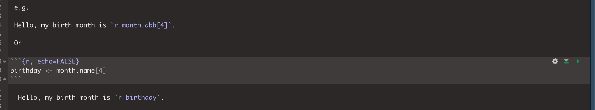

<style>
p.comment {
background-color: #DBDBDB;
padding: 10px;
border: 1px solid black;
margin-left: 0px;
border-radius: 5px;
font-style: normal;
}

h1.title {
  font-weight: bold;
  font-family: Arial;  
}

h2.title {
  font-family: Arial;  
}

</style>


<style type="text/css">
#TOC {
  font-size: 12px;
  font-family: Arial;
}
</style>

\


## Welcome to Lab 4!

<br>

The aim of this lab is start getting more comfortable making high quality maps and manipulating data.  We will also learn about some new markdown techniques for "inline code" and adding equations By the end of the lab you will be able to.

 - 1. Use inline code commands
 - 2. Insert an equation into your text and data
 - 3. Make beautiful spatial plots
 - 4. Read in shapefiles and manipulate your data spatially
 - 5. Re-analyse your new york data

Assignment 4 is due by midnight the night before your next lab on Canvas. Your job is to submit the requirements on this page.

See [**your canvas assignment here**](https://psu.instructure.com/courses/2120046/assignments/13274836).  E.g go to canvas for assignment guidelines.

<p class="comment">**Need help?**  Add a screenshot/question to the discussion board here:    [**LAB 4 DISCUSSION BOARD**](https://psu.instructure.com/courses/2120046/discussion_topics/14125712)</p>

<br>

<div style="margin-bottom:25px;">
</div>  
## Step A: Set up the lab

First, we want to set up R in the same way as before, creating a project file and a blank markdown document.  This will be the last time I am going to spell it out.

1. Open R-Studio.<br>Create a new R-Project in your GEOG-364 folder called `GEOG364_Lab4_PROJECT`.<br>*Reminder: [Tutorial 2C: Projects](https://psu-spatial.github.io/Geog364-2021/pg_Tut2_startup.html)*.   
   
<br>  

2. Go on Canvas to the Lab 4 page and download any datasets as needed.<br>Put it/them in your `GEOG364_Lab4_PROJECT` folder.  See the lab 3 instructions for how it should look.

<br>

3. Let's retrieve our lab template: 
    a. *If you're on your own computer:*<br>
       + Make a **COPY** of the template Rmd file.
       <br>
       + Rename the **COPY** `GEOG364_Lab4_userID_CODE.Rmd` e.g. for me GEOG364_Lab3_hlg5155_CODE.Rmd
       <br>
       + Move GEOG364_Lab4_userID_CODE.Rmd into your GEOG364_Lab4_PROJECT folder.
       <br>
    
    <br>
    
    b. *If you're using R-studio cloud.*<br>
       + MAKE SURE YOU WENT TO YOUR WORKSPACE AND MADE A LAB 4 PROJECT!
       + Click on your Lab 4 project folder
       <br>
       + In the files tab, click the check box by your template file, then click the More button/Export and download it.
       <br>
       + Click on Workspaces (top left) and enter your Lab 4 project folder.
       <br>
       + In the files tab, click upload and upload the template
       <br>
       + Now click the check box by the template file and rename to `GEOG364_Lab4_userID_CODE.Rmd`
       <br> e.g. for me GEOG364_Lab4_hlg5155_CODE.Rmd<br>

<br>

In both cases, your "Lab 4" R-Studio should look like this but for lab 4.  If not ASK FOR HELP

<div class="figure" style="text-align: center">

<p class="caption">*this is for lab 3 but you get the idea.*</p>
</div>
<br>
Also, if R-studio isn't "looking in" your lab 4 project, close R studio, go to your lab 3 folder and double click the .Rproj to open your lab 3 project

<p class="comment">**IMPORTANT! Did you open R via your lab 4 project file?** If R-studio *isn't* "looking in" your lab 4 folder in Files, or doesn't have your lab 4 project name on the logo/at the top of the screen, close R studio, go to your lab 4 folder and double click the .Rproj to open your lab 4 project</p>

<br>

4. Click on your lab 4 .Rmd file in the files tab. You should not have to search if you are in your Lab 4 project.  It should open the script.  
     + Change the title to Lab 4.  <br>    
     + Change the theme if you like <br>     
     + Edit the library code chunk so it looks like this:
       
       ```r
       library(knitr) 
       library(tidyverse)
       library(sf)
       library(sp)
       library(tmap)
       library(skimr)
       library(rnaturalearth)
       library(readxl)
       ```
     + If you accidentally messed up something remember you can re-copy your YAML code or options from a previous lab.<br><br>*The easiest way to do this is to naviagte on your computer to that lab folder then double click the project file for the old lab to open an entirely new version of R-Studio for that lab. Then nothing gets confused*<br>*equally on the cloud, make a new tab in your browser, go to your workspace (top lef), and open the other project there*<br>     

<br>   

5. Press knit. You screen should look like this but for Lab 4 and your options.  If so,congrats! If not, ASK FOR HELP.  Note, your message=FALSE and warning = FALSE can go in the general options like my screenshot, or as "code chunk options" for the library chunk


<br>

<div style="margin-bottom:25px;">
</div>  
## Step B: MARKDOWN AND R

6. Read the start of [Tutorial 4G: Visual Editor](https://psu-spatial.github.io/Geog364-2021/pg_Tut4_markdown.html#Tutorial_4G:_Formatting_text) to turn on the markdown visual editor

<br>

7. Follow the new inline-code tutorial in [Tutorial 4F: Inline Code](https://psu-spatial.github.io/Geog364-2021/pg_Tut4_markdown.html#Tutorial_4F:_Formatting_code_chunks) to understand about inline code

<br> 

8. Follow [Tutorial 4I: Equations](https://psu-spatial.github.io/Geog364-2021/pg_Tut4_markdown.html#Tutorial_4I:_Adding_equations) to understand about adding equations.

<br> 

9. Make a new section called Markdown.  Feel free to use subsections, numbers, bold font etc to make it look professional<br> IF YOU HAVEN'T DONE STEPS 6,7,8, GO DO THEM.

Now, attempt the following tasks - they are building also on what you learnt in Labs 1,2 & 3 -  [TUTORIAL 4: MARKDOWN](https://psu-spatial.github.io/Geog364-2021/pg_Tut4_markdown.html#Tutorial_4G:_Formatting_text) HAS THE ANSWERS.

10. Have a play with the markdown visual editor.<br>
Write a paragraph to explain the difference between pattern and process (lecture 5a & resources there).<br>
See what you can do with the visual editor to play with the fonts/formats etc.<br>
*[you are being graded on the paragraph not the format, so go wild]*

    + COPY your frost data from Lab 2 to your Lab 4 folder.  
    + In a code chunk, read in the data to a variable called frost.  
    + Calculate the mean of the Elevation column and the number of rows and the number of columns( hint `nrow() and ncol()`), and save the answers to sensibly named variables e.g. frost.elev,  frost.nrow....
    + Edit the code chunk options so that the code and output are invisible when you press knit (you will still see them in the editing window).
    
 - In the text make a new paragraph, that says   **"In lab 2, we read in a dataset called frostdata.xlsx.  The data has XXXX rows and YYYY columns,  The mean of the Elevation column is ZZZZ UNITS."** .  Where, XXXX, YYYY and ZZZZ are inline code that creates the answers and UNTIS is the appropriate units.   
 
*Note, you have a choice!  You can either run the commands in the "silent" code chunk, save them to a variable and just put the variable name in your inline code.  or you can do the full calculation in the inline code itself. For example *
 
 

 
 will make:
 
 Hello, my birth month is Apr.
 
 Or
 

 
  Hello, my birth month is April.


11. You can see that the elevation input is to many decimal places.  You can use the  `round()` command to round to a sensible number of significant figures. See the tutorials below on round, then make a new copy of your sentence about frost, but round the mean of the elevation to an appropriate number of decimal places for your units.

https://www.datasciencemadesimple.com/round-function-in-r/

Your final sentence should look something link this but about your frost data

In the inbuilt starwars dataset, there are 87 rows and  14 columns.  The average height of a character is 174 cm.


<br> 


LAB GLITCHES. UPDATED LAB TO COME.


***

Website created and maintained by [Helen Greatrex](https://www.geog.psu.edu/directory/helen-greatrex). Website template by [Noli Brazil](https://nbrazil.faculty.ucdavis.edu/)
