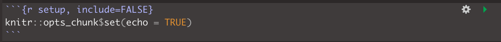
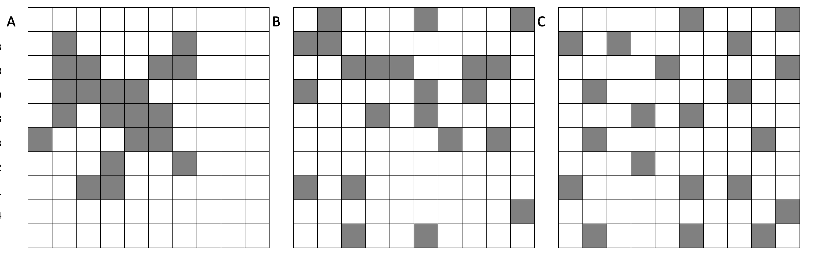

<style>
p.comment {
background-color: #DBDBDB;
padding: 10px;
border: 1px solid black;
margin-left: 0px;
border-radius: 5px;
font-style: normal;
}

h1.title {
  font-weight: bold;
  font-family: Arial;  
}

h2.title {
  font-family: Arial;  
}

</style>


<style type="text/css">
#TOC {
  font-size: 11px;
  font-family: Arial;
}
</style>


```{r setup, include=FALSE}
knitr::opts_chunk$set(echo = TRUE, warning=FALSE, message = FALSE)
```

```{r,include=FALSE,echo=FALSE}
# invisible data read
library(tidyverse)
library(sp)
library(sf)
library(readxl)
library(skimr)
library(tmap)
library(USAboundaries)
library(viridis)
library(rnaturalearth)
library(kableExtra)
library(spdep)
library(raster)

frost   <- readxl::read_excel("pg_364Data_1frostday.xlsx")
newyork <- readxl::read_excel("pg_364Data_1frostday.xlsx")
firefly <- readxl::read_excel("pg_364Data_3Firefly.xlsx")
ozone   <- read.csv("pg_364Data_4Ozone.csv")
```

## Welcome to Lab 5!

<br>

The aim of this lab is to work on autocorrelation, especially join counts and census data. By the end of the lab you will be able to:

1.  Create a matrix of data
2.  Conduct a join counts analysis on "toy data"
3.  Download census data and conduct a real life analysis

Assignment 5 is due by midnight the night before your next lab on Canvas. Your job is to submit the requirements on this page.

See [**your canvas assignment here**](https://psu.instructure.com/courses/2120046/assignments/13274838).

<p class="comment">**Need help?** Add a screenshot/question to the discussion board here: [**LAB 5 DISCUSSION BOARD**](https://psu.instructure.com/courses/2120046/discussion_topics/14125716)</p>

<br> <br>

## A: Set up the lab

<br>

### A1: Sign up for Census API

You can easily access US census data within R, but you need to sign up in advance for a password.

<https://api.census.gov/data/key_signup.html>

You can use Penn State as the organisation. This is just you promising that you will follow the terms and conditions when using this data. In a few minutes, e-mail you a personal access code. Click the link in the e-mail to activate.

<br> <br>

### A2: Create your lab project

<br>

Follow the instructions in Labs 1-4 to create your project file and a blank markdown document. e.g. <br>

1.  Open R-Studio. Create a new R-Project in your GEOG-364 folder called `GEOG364_Lab5_PROJECT`.<br>

2.  Make a copy of the lab template Rmd file and move it into your project folder.

3.  DOUBLE CLICK ON THE GEOG364_Lab5_PROJECT.RPROJ FILE IN YOUR PROJECT FOLDER TO OPEN R.<br>

4.  Click on your lab 5 .Rmd file in the files tab to open the script<br>(You should not have to search if you are in your Lab 5 project):<br>

    -   Change the title to Lab 5. <br>
    -   Change the theme if you like or add in any other features <br>
    -   Remember you can edit your lab in the "editor" mode by clicking on the A at the top right

5.  **IN THE CONSOLE (OR BY CLICKING THE INSTALL BUTTON IN THE PACKAGES TAB), install the `VIM` package. DO NOT PUT THE CODE IN YOUR SCRIPT OR IT WILL TRY TO DOWNLOAD EVERY TIME YOU PRESS KNIT** (For more instructions, see [Tutorial 2: Package Install](https://psu-spatial.github.io/Geog364-2021/pg_Tut2_startup.html#How_to_downloadinstall_packages))

<br><br>

### A3: Libraries and the top code chunk

Let's continue to make our code more professional. There is rarely a reason to show a reader the libraries being loaded. So this time, let's add in the libraries into the top code chunk.

Edit your code chunk that looks like this

```{r, L5Fig1, echo=FALSE}

```

and turn it into this, which should disappear when you press knit.

```{r, L5Fig2, echo=FALSE}
knitr::include_graphics('pg_364Lab5_tobler_2021_fig2.png')
```

Feel free to also update this in your code template - then as you need libraries (e.g. if you run your code and it's missing a library, you can then proactively just add it into this code chunk)

<br><br>

### B1: Join Counts theory

Join count statistics are valuable autocorrelation statistics in understanding spatial dependencies amongst binary or categorical data.

<br>

1.  **Step 1:**<br> [**DO NOT SKIP THIS STEP!**]{.ul} Go to Canvas and read the pdf on join counts from canvas (chapter 15.1 of the textbook) - it's only 4 pages but provides crucial background.

<br>

2.  **Step 2:**<br> In your code, create a new heading called Join Counts. Briefly explain what join counts are and why it is only appropriate to use use them for categorical or binary data (yes/no ; TRUE/FALSE). Feel free to use pictures/examples etc to help you explain it.

<br> <br>

### B2: Join Counts coding

This section focuses on using R to calculate join count statistics using a toy dataset. We will:

a)  B2a: Create a test "toy" dataset (note normally you would read your own data in from file)
b)  B2b: Create a spatial weights matrix using spdep
c)  B2c: Set up a hypothesis test
d)  B2c: Use the `joincount.test` command to automatically calculate it.

#### B2a. Create the test dataset

Let's work on a "toy" (tiny/easy/made-up) dataset. Here's a picture of the grid we are going to make. In this case, each polygon is a simple grid cell.

```{r, L5Fig4, echo=FALSE,out.width="20%"}
knitr::include_graphics('pg_364Lab5_tobler_2021_fig4.png')
```

<br>

As we are making up imaginary data, we need to create it in R. Now, I will create this in R using a new type of data called a matrix. This is simply a grid of numbers (see data camp intro R for more details: <https://www.datacamp.com/community/tutorials/matrices-in-r>)

```{r}
row.1 <- rep(1,6)  
row.2 <- c(0,1,1,1,1,1)
row.3 <- c(rep(0,5),1)
row.4 <- rep(0,6)
row.5 <- c(0,0,0,1,0,0)
row.6 <- rep(0,6)

ToyA_matrix <- matrix(c(row.1, row.2, row.3, row.4, row.5, row.6), 
                      nrow=6,ncol=6, byrow=TRUE)

ToyA_matrix
```

We then convert it to spatial data using the raster command - and then make a plot with a title:

```{r, fig.width=5}
ToyA_raster <- raster(ToyA_matrix)

plot(ToyA_raster)
text(coordinates(ToyA_raster), labels=ToyA_raster[], cex=1.5)
```

<br>

3.  **Step 3:**<br> Explain in your lab answers what the `rep()` and `c()` commands do. Feel free to use code examples!

<br>

4.  **Step 4:**<br> Use the code above to create your own matrix that you assign to a variable called called `ToyB_matrix`. <br> **You should create your grid to generally have negative spatial autocorrelation, but still include a little bit of randomness.**<br>Your grid could also have additional rows and column as you desire. 


<p class="comment">All the way through my example, I use ToyA_... for my variable names. e.g. `ToyA_raster`, `ToyA_matrix` Name yours ToyB_... to keep your code neat </p>


<br> <br>

#### B2b. Creating a spatial weights matrix

Now, we will convert our dataset to a specifica type of spatial data (spdep), so that we can determine which grid-cells are "nearby" and create a spatial weights matrix. To find adjacent polygons, we can use package 'spdep'.

1.  First, we covert our raster data to a spatial polygon using `rasterToPolygons` and `SpatialPolygons`

2.  Then we use the `poly2nb` command to build a list of neighbors based on adjacency (queens or rooks)

3.  Calculate the weights matrix. In this case we use a binary (B) criteria, i.e. there is adjacency (1) or there is no adjacency (0).

4.  And plot.

Here's the code:

```{r}
# Step 1 - turn to polygon
ToyA_polygon    <- rasterToPolygons(ToyA_raster, dissolve=FALSE)
ToyA_spdep      <- SpatialPolygons(ToyA_polygon@polygons)

# Step 2 - Make list of neighbors
ToyA_nb.rook <- poly2nb(ToyA_spdep, queen = FALSE)

# Step 3 - Create weights matrix
ToyA_weights.rook <- nb2listw(ToyA_nb.rook, style='B')

# Step 4 - plot the neighbors
plot(ToyA_spdep, border='blue')
plot(ToyA_nb.rook, coordinates(ToyA_spdep), col='red', lwd=2, add=TRUE)
```

<br> <br>

5.  **Step 5:**<br> In your answer, make a sub-heading called Spatial weights matrix. Explain what a spatial-weights-matrix is, how adjacency can been used to create one (e.g. what are queens/rooks) or how distance might be used to create one (lecture 8A, Lecture 7B). **

<br>

6.  **Step 6:**<br> Use the code above to create a spatial weights matrix for `ToyB_matrix`. <br> **Use a queen's weights matrix in your example**

<br>

7. **Step 7:**<br> Explain why your Queens adjacecy plot for the Toy_B data looks identical to my Rooks adjacecy plot for the Toy_A data.

<br><br>

#### B2c. Conduct a join count analysis

```{r, L5Fig3, echo=FALSE,fig.cap="Join Count Summary from the McGrew textbook"}
knitr::include_graphics('pg_364Lab5_tobler_2021_fig3.png')
```

<br>

Now, everything is set for the analyses: I have my spatial data (`ToyA_polygon`), which shows our pattern of green/white grid cells, plus our spatial weights matrix saved as variable `ToyA_weights.rook`.

We can now conduct a join counts test to evaluate the presence of absence of spatial autocorrelation.


First, let's set up in words.

<br>

#### Null hypothesis, H~0~ {.unnumbered}

This is normally that we suspect our pattern is *caused* by an Independent Random Process

This null hypothesis of "caused by an IRP" is contained within all the R commands, but you could add your own custom ones (e.g. I want to test if my pattern is more/less clustered than one caused by some other process that you care about. We would simply use R as a calculator and do the math manually.

<br>

#### Alternative hypothesis, H~1~ {.unnumbered}

This could be one of three things, depending on the *direction* of our test:

-   H~1~ : Our pattern is **different** than we would expect from one caused by an IRP e.g. it's EITHER unusually clustered or uniform ("2 tailed test") <br> So we're saying this pattern is unusual given the process or..

-   H~1~ : Our pattern is **more** **clustered** than we would expect from one caused by an IRP ("one tailed test") <br> or...

-   H~1~ : Our pattern is **less** **clustered/more uniform** than we would expect from one caused by an IRP ("one tailed test")

#### Turning words into maths

The way we are testing "clustered" is by looking at the number of "joins" e.g. is a white cell next to a white cell, or a green cell next to a green cell? (see the reading and the lectures for more).

We could calculate the average number we would get theoretically and then compare against our observed value for our specific pattern.

This means we can turn our hypotheses into:

Finally, we apply the Join Count test to evaluate presence or absence or spatial autocorrelation. This is done using a z-test.

We can choose if the test is two sides.

Slightly differently to the textbook and the lecture notes (which looked for green/white), the R version of this test looks for how likely it is that there are white-to-white joins compared to random chance, but the principle is the same.

So we have:

-   H0: The pattern exhibits complete spatial randomness or is dispersed.<br>*The number of Observed "same color" joins (O~White-White~) is no higher than what you would expect from a pattern caused by an Independent Random Process: O~WW~ = E~WW~*

-   H1: The pattern is not random. The number of "same color" joins is unusually high (AKA the pattern is clustered): O~WW~ \> E~WW~

Here is the code for the Z-test

```{r}
ToyA_jointest <- joincount.test(fx    = as.factor(ToyA_polygon$layer), 
                                listw = ToyA_weights.rook,             
                                alternative = "greater") 
```

Another thing to note is that you can select which different tailed alternative hypothesis:

-   (default) 'greater': the alternative hypothesis that the number of like joins is more than expected by random chance. *(THIS IS ONLY TRUE IF THE THING YOU ARE TESTING IS WW or GG joins. The opposite would be the case if you tested GW joins, think through why this is the case)*
-   'less': the alternative hypothesis that the number of like joins is fewer than expected by random chance (indicating higher levels of dispersion). *(IF THE THING YOU ARE TESTING IS WW or GG joins. The opposite would be the case if you tested GW joins.)*
-   'two.sided': the alternative hypothesis that the number of like joins is simply different to the number you would expect from random chance. This is unusual to use as we are normally looking for either clustering or dispersion.

joincount.test actually does two tests, so we use double square brackets [[ ]] to show the first and second test separately:

```{r}
# White-to-white Join counts
ToyA_jointest[[1]]
```

```{r}
# Green-to-green Join counts
ToyA_jointest[[2]]
```

We can see that there are many more white-white joins / green-green joins than you might expect. In fact, looking at the low p-value, we can see that it is very unusual to see so many same-color joins, so in this case, most people can can safely reject the null hypothesis.

<br>

<br>

**C. Interpretation**

*How many white-to-white joins were observed vs expected in the example above? How many green-to-green joins were observed vs expected? What does that mean in terms of the spatial autocorrelation of the field and why?* **[4 marks]**

*Do you accept or reject your null hypothesis?* **[4 marks]**

#### C1. Real life interpretation

In 2010, Staudt et al, published a paper on the foraging behaviour and territoriality of the strawberry poison frog (Oophaga pumilio). Twelve male frogs in Hitoy Cerere, Costa Rica, were observed each for a full day. Calling time, feeding attempts and time spent inside and outside the core area of their territories were recorded.

```{r, L5Fig5, echo=FALSE,fig.cap="The strawberry poison frog"}
knitr::include_graphics('pg_364Lab5_tobler_2021_fig5.png')
```

The connectivity of grids where frogs were observed feeding in the main foraging time was analysed with "Joins Count Statistics", which tests whether the spatial connection of grids differed from a random spatial distribution. The test counts the number of connected grids in a binary system; in this case a "foraging grid" is marked black and a "non-foraging grid" is marked white. The results indicate whether or not frogs favour special areas (patches) in their territories for prey hunting. If they search in patches, there should be more connections between black-black grids and fewer connections between black-white grids than in a random distribution.

Each 4 m2 core area was divided in 100 20 × 20 cm2 grids. B (black) = grid in which was hunted. W (white) = grid in which was not hunted. The Join Count results for two frogs are as follows:

```{r, L5Fig6, echo=FALSE}
knitr::include_graphics('pg_364Lab5_tobler_2021_fig6.png')
```

**Frog question 1**

The paper did not provide a map of how the territories looked - if you had to choose one of the maps below, which is most likely? Why?

```{r, L5Fig7, echo=FALSE}

```

**Frog question 2**

At a significance value of 0.01, do these results indicate that the frogs preferred hunting prey in specific patches of their core areas? Or is there no evidence to reject the notion that they randomly hunted whereever they hopped?

## E. Above and beyond

Remember that an A is 93%, so you can ignore this section and still easily get an A. But here is your time to shine. Also, if you are struggling in another part of the lab, you can use this to gain back points.

**To get the final 4 marks in the lab, you need to show me something new, e.g. you need to go above and beyond the lab questions in some way.**

-   You get 2/4 for doing something new in any way (including the Wilks Shapiro or step 24)
-   You get 4/4 for something really impressive or 3+ small things.

Please tell us in your R script what you did!

## F. Submitting your Lab

Remember to save your work throughout and to spell check your writing (left of the knit button). Now, press the knit button again. If you have not made any mistakes in the code then R should create a html file in your lab 4 folder which includes your answers. If you look at your lab 4 folder, you should see this there - complete with a very recent time-stamp.

In that folder, double click on the html file. This will open it in your browser. CHECK THAT THIS IS WHAT YOU WANT TO SUBMIT

Now go to Canvas and submit BOTH your html and your .Rmd file in Lab 4.

<br>

## Lab 5 submission check-list

**For all answers: Full marks = everything down at a high standard, in full sentences as appropriate with no parts of your answer missing. Imagine it as an example I use in class**

**HTML FILE SUBMISSION - 5 marks**

**RMD CODE SUBMISSION - 5 marks**

**MARKDOWN/CODE STYLE - 16 MARKS**

Your code and document is neat and easy to read. LOOK AT YOUR HTML FILE IN YOUR WEB-BROWSER BEFORE YOU SUBMIT.You have written in full sentences, it is clear what your answers are referring to. YOU HAVE USED THE SPELL CHECK. SPELLING ERRORS LOSE YOU MARKS.

**Above and beyond: 4 MARKS**

You get 2/4 for doing something new in any way and 4/4 for something really impressive or multiple small things.

[100 marks total]

Overall, here is what your lab should correspond to:

```{r, echo=FALSE}
rubric <- readxl::read_excel("pg_364Lab_rubrictable.xlsx")
knitr::kable(rubric) %>%   
  kable_classic_2() %>%
  kable_styling(bootstrap_options = c("striped", "hover", "responsive"))
```

::: {style="margin-bottom:25px;"}
:::

------------------------------------------------------------------------

Website created and maintained by [Helen Greatrex](https://www.geog.psu.edu/directory/helen-greatrex). Website template by [Noli Brazil](https://nbrazil.faculty.ucdavis.edu/)
