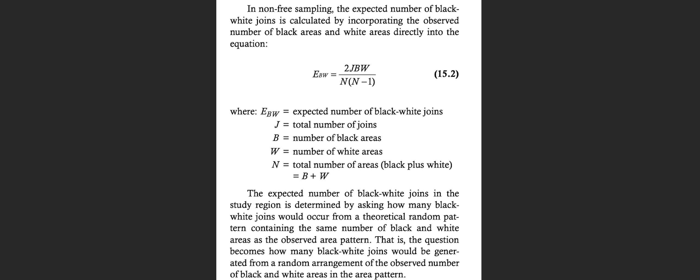

<style>
p.comment {
background-color: #DBDBDB;
padding: 10px;
border: 1px solid black;
margin-left: 0px;
border-radius: 5px;
font-style: normal;
}

h1.title {
  font-weight: bold;
  font-family: Arial;  
}

h2.title {
  font-family: Arial;  
}

</style>


<style type="text/css">
#TOC {
  font-size: 11px;
  font-family: Arial;
}
</style>


```{r setup, include=FALSE}
knitr::opts_chunk$set(echo = TRUE, warning=FALSE, message = FALSE)

# invisible data read
library(tidyverse)
library(sp)
library(sf)
library(readxl)
library(skimr)
library(tmap)
library(USAboundaries)
library(viridis)
library(rnaturalearth)
library(kableExtra)
library(spdep)
library(raster)

frost   <- readxl::read_excel("pg_364Data_1frostday.xlsx")
newyork <- readxl::read_excel("pg_364Data_1frostday.xlsx")
firefly <- readxl::read_excel("pg_364Data_3Firefly.xlsx")
ozone   <- read.csv("pg_364Data_4Ozone.csv")
```


## Welcome to Lab 5!

<br>

The aim of this lab is to work on autocorrelation, especially join counts and census data. By the end of the lab you will be able to:

1.  Create a matrix of data
2.  Understand if statements and functions
3.  Conduct a join counts analysis on "toy data"
4.  Hypothesis test

Assignment 5 is due by midnight the night before your next lab on Canvas. Your job is to submit the requirements on this page.

See [**your canvas assignment here**](https://psu.instructure.com/courses/2120046/assignments/13274838).

<p class="comment">**Need help?** Add a screenshot/question to the discussion board here: [**LAB 5 DISCUSSION BOARD**](https://psu.instructure.com/courses/2120046/discussion_topics/14125716)</p>

<br><br>

## A: Set up the lab

<br>

### A1: Sign up for Census API

We will need this next week, so we are registering now.

You can easily access US census data within R, but you need to sign up in advance for a password.

<https://api.census.gov/data/key_signup.html>

You can use Penn State as the organisation. This is just you promising that you will follow the terms and conditions when using this data. In a few minutes, e-mail you a personal access code. Click the link in the e-mail to activate.

<br> <br>

### A2: Create your lab project

<br>

Follow the instructions in Labs 1-4 to create your project file and a blank markdown document. e.g. <br>

1.  Open R-Studio. Create a new R-Project in your GEOG-364 folder called `GEOG364_Lab5_PROJECT`.<br><br>

2.  Make a copy of the lab template Rmd file and move it into your project folder.<br><br>

3.  DOUBLE CLICK ON THE GEOG364_Lab5_PROJECT.RPROJ FILE IN YOUR PROJECT FOLDER TO OPEN R.<br><br>

4.  Click on your lab 5 .Rmd file in the files tab to open the script<br>(You should not have to search if you are in your Lab 5 project):<br><br>

    -   Change the title to Lab 5. <br><br>
    -   Change the theme if you like or add in any other features <br><br>
    -   Remember you can edit your lab in the "editor" mode by clicking on the A at the top right<br><br>

5.  **IN THE CONSOLE (OR BY CLICKING THE INSTALL BUTTON IN THE PACKAGES TAB), install the `VIM` package.** <br> DO NOT PUT THE CODE IN YOUR SCRIPT OR IT WILL TRY TO DOWNLOAD EVERY TIME YOU PRESS KNIT <br> *For more instructions, see [Tutorial 2: Package Install](https://psu-spatial.github.io/Geog364-2021/pg_Tut2_startup.html#How_to_downloadinstall_packages)*

<br><br>

### A3: Libraries and the top code chunk

Let's continue to make our code more professional. There is rarely a reason to show a reader the libraries being loaded. So this time, let's add in the libraries into the top code chunk.<br>

Edit your code chunk that looks like this

```{r, L5Fig1, echo=FALSE}
knitr::include_graphics('pg_364Lab5_tobler_2021_fig1.png')
```

and turn it into this, which should disappear when you press knit.

```{r, L5Fig2, echo=FALSE}
knitr::include_graphics('pg_364Lab5_tobler_2021_fig2.png')
```


Feel free to also update this in your code template - then you can simply edit as you need to add/remove libraries (e.g. if you run your code and it's missing a library, you can then proactively just add it into this code chunk)

<br><br>

## B: New R coding

<br>

### B1: Custom commands: Functions

We don't need to just rely on commands that others provide. We can also create our own, as you will see later on. You will not be asked to make your own in this class, but it is a useful skill and you could consider making and running a mini function as your "show me something new".

<br>

Here is a good overview of functions where they make a custom command to turn Celsius into Fahrenheit: - <https://swcarpentry.github.io/r-novice-inflammation/02-func-R/>

<br><br>

### B2: Asking Questions: If statements

Sometimes we only want R to do something *if* something else happens. e.g. run this command if I want to see the output, or run another command if our result is greater than 10. The if statement allows us to do this.<br>

if(a \> b){ 

do output commands 

}else{ 

do something else 

}

<br>

You can read this like a sentence e.g. "if a is greater than b, do the output commands in the first bit, else do the other stuff."<br>

Again, you will not be asked to make your own in this class, but it is a useful skill and you could consider making if statements as your "show me something new".<br>

Here is a good overview of if-else - <https://www.datamentor.io/r-programming/if-else-statement/>

<br><br>

## C: Join Counts

We will first explore the theory, then create a toy dataset, then manually run a hypothesis test, then auto-create one.

<br>

### C1: Join Counts theory

Join count statistics are valuable autocorrelation statistics in understanding spatial dependencies among binary or categorical data.

<br>

1.  **Step 1:**<br> [**DO NOT SKIP THIS STEP!**]{.ul} Go to Canvas and read the pdf on join counts from canvas (chapter 15.1 of the textbook) - it's only 4 pages but provides crucial background.

<br>

2.  **Step 2:**<br> In your code, create a new heading called Join Counts. Briefly explain what join counts are and why it is only appropriate to use use them for categorical or binary data (yes/no ; TRUE/FALSE). Feel free to use pictures/examples etc to help you explain it.

<br> <br>

### C2: Join Counts coding

<br>

This section focuses on using R to calculate join count statistics using a toy dataset. We will:

a)  C2a: Create a test "toy" dataset (note normally you would read your own data in from file)
b)  C2b: Create a spatial weights matrix using spdep
c)  C2c: Manually understand what we are doing in a join counts analysis.
d)  C2d: Formally set up a hypothesis test
e)  C2d: Use the `joincount.test` command to automatically calculate it.

#### C2a. Create the test dataset

Let's work on a "toy" (tiny/easy/made-up) dataset. Here's a picture of the grid we are going to make. In this case, each polygon is a simple grid cell.

```{r, L5Fig4, echo=FALSE,out.width="20%"}
knitr::include_graphics('pg_364Lab5_tobler_2021_fig4.png')
```

<br>

As we are making up imaginary data, we need to create it in R. Now, I will create this in R using a new type of data called a matrix. This is simply a grid of numbers (see data camp intro R for more details: <https://www.datacamp.com/community/tutorials/matrices-in-r>)

```{r}
row.1 <- rep(1,6)  
row.2 <- c(0,1,1,1,1,1)
row.3 <- c(rep(0,5),1)
row.4 <- rep(0,6)
row.5 <- c(0,0,0,1,0,0)
row.6 <- rep(0,6)

ToyA_matrix <- matrix(c(row.1, row.2, row.3, row.4, row.5, row.6), 
                      nrow=6,ncol=6, byrow=TRUE)

ToyA_matrix
```

We then convert it to spatial data using the raster command - and then make a plot with a title:

```{r, fig.width=5}
ToyA_raster <- raster(ToyA_matrix)

plot(ToyA_raster)
text(coordinates(ToyA_raster), labels=ToyA_raster[], cex=1.5)
```

<br>

3.  **Step 3:**<br> Explain in your lab answers what the `rep()` and `c()` commands do. Feel free to use code examples!

<br>

4.  **Step 4:**<br> Use the code above to create your own matrix that you assign to a variable called called `ToyB_matrix`. <br> **You should create your grid to generally have negative spatial autocorrelation, but still include a little bit of randomness.**<br>Your grid could also have additional rows and column as you desire.

<p class="comment">All the way through my example, I use ToyA\_... for my variable names. e.g. `ToyA_raster`, `ToyA_matrix` Name yours ToyB\_... to keep your code neat</p>

<br> <br>

#### C2b. Creating a spatial weights matrix

Now, we will convert our dataset to a specific type of spatial data (spdep), so that we can determine which grid-cells are "nearby" and create a spatial weights matrix. To find adjacent polygons, we can use package 'spdep'.

<br>

-   First, we covert our raster data to a spatial polygon using `rasterToPolygons` and `SpatialPolygons`<br>
-   Then we use the `poly2nb` command to build a list of neighbors based on adjacency (queens or rooks)<br>
-   Calculate the weights matrix. In this case we use a binary (B) criteria, i.e. there is adjacency (1) or there is no adjacency (0).<br>
-   And plot.<br>

<br>

Here's the code:

```{r}
# Step 1 - turn to polygon
ToyA_polygon    <- rasterToPolygons(ToyA_raster, dissolve=FALSE)
ToyA_spdep      <- SpatialPolygons(ToyA_polygon@polygons)

# Step 2 - Make list of neighbors
ToyA_nb.rook <- poly2nb(ToyA_spdep, queen = FALSE)

# Step 3 - Create weights matrix
ToyA_weights.rook <- nb2listw(ToyA_nb.rook, style='B')

# Step 4 - plot the neighbors
plot(ToyA_spdep, border='blue')
plot(ToyA_nb.rook, coordinates(ToyA_spdep), col='red', lwd=2, add=TRUE)
```

<br> <br>

5.  **Step 5:**<br> In your answer, make a sub-heading called Spatial weights matrix. Explain what a spatial-weights-matrix is, how adjacency can been used to create one (e.g. what are queens/rooks) or how distance might be used to create one (lecture 8A, Lecture 7B). \*\*

<br>

6.  **Step 6:**<br> Use the code above to create a spatial weights matrix for `ToyB_matrix`. <br> **Use a queen's weights matrix in your example**

<br>

7.  **Step 7:**<br> Explain why your Queens adjacency plot for the Toy_B data looks different to my Rooks adjacency plot for the Toy_A data.

<br><br>

#### C2c. Conduct a join count analysis manually

Sometimes this process can feel like a black-box<br><br>

Now, everything is set for the analyses: I have my spatial data (`ToyA_polygon`), which shows our pattern of green/white grid cells, plus our spatial weights matrix saved as variable `ToyA_weights.rook`.<br><br>

We can now conduct a join counts test to evaluate the presence of absence of spatial autocorrelation. As described in the textbook, essentially we are looking at the boundaries between polygons are the same color (e.g. two green polygons next to each other, two white polygons next to each other), which suggests clustering, or whether there are lots of green-white boundaries, suggesting a chessboard effect/negative autocorrelation.<br><br>

We can theoretically calculate (on average) how many green-green, white-white, green-white boundaries there would be if an Independent Random Process caused the pattern.<br><br>

For example, here is how I would use an Independent Random Process to create the a matrix of the same shape but filled with random 1s and 0s. I'm using the "function" command to make a custom command that I am calling `toyIRP`.<br><br>


```{r}
toyIRP <- function(matrix_input, silent=FALSE){

  # find how big out input matrix is
  nrows  <- nrow(matrix_input)
  ncols <- nrow(matrix_input)
  numberones <- 13
  # make a list of all the ones and zeros
  alltheones  <- rep(1,numberones)
  allthezeros  <- rep(0, ((nrows*ncols) - numberones))
  # randomise
  randombinary <- sample(c(alltheones,allthezeros),size=(nrows*ncols),replace=FALSE)

  
  #---------------------------------------------------------------------------
  # Turn into a matrix and create the weights etc.
  #---------------------------------------------------------------------------
  IRP_matrix   <- matrix(randombinary, nrow=nrows,ncol=ncols, byrow=TRUE)
  IRP_raster   <- raster(IRP_matrix)
  IRP_polygon  <- rasterToPolygons(IRP_raster, dissolve=FALSE)
  IRP_spdep    <- SpatialPolygons(IRP_polygon@polygons)
  IRP_nb.rook  <- poly2nb(IRP_spdep, queen = FALSE)
  IRP_weights.rook <- nb2listw(IRP_nb.rook, style='B')
  IRB_jointest <- joincount.test(fx    = as.factor(IRP_polygon$layer), listw = IRP_weights.rook) 
  
  ww_gg_joincount <- IRB_jointest[[1]]$estimate[1]+  IRB_jointest[[2]]$estimate[1]
  
  # If you want to see the output (e.g. silent=FALSE) then plot
  if(silent == FALSE){
    plot(IRP_raster, 
         main = list(paste("CSR:Number of same color (WW or GG) boundaries = ",ww_gg_joincount),cex=.9))
    text(coordinates(IRP_raster), labels=IRP_raster[], cex=1.5)
  }
  
  return(ww_gg_joincount)
}
```

<br>

8.  **Step 8:**<br> Create a new code chunk and copy the code above into your script. When you press run, nothing should happen, but you will see a new "function" appear in your Environment quadrant/tab.

<br>

8.  **Step 9:**<br> In a new code chunk, copy this code and run. It should make a random pattern that tells you the numbers of same-color joins. Run it again, and again.. keep going and get a sense for how an IRP created process looks and the number of same-color joins each time,<br>

```{r}
output <- toyIRP(ToyA_matrix, silent=FALSE)
```

<br>

10. **Step 10:**<br> On average, if an IRP really did cause the pattern for a 6x6 matrix, how many same-colorjoins would you expect to see? Why does the number change each time you run it?

<br>

11. **Step 11:**<br> Now, let's run the code many times (1001 times!), store the number of same color joins each time and make a histogram of the output. Copy/run the code below, I have turned the plotting off. It is running the command 1000 times, so it might take a minute.

<br>

```{r}
# Run once
alloutput <-  toyIRP(ToyA_matrix, silent=TRUE)
  
# Repeat 200 times and add in the answer
for(n in 1:200){
  newIRP <- toyIRP(ToyA_matrix, silent=TRUE)
  alloutput <-  c(alloutput, newIRP)
}  

#make a histogram of all the white-white joins
hist(alloutput, br=20, main="The number of same color joins for 1001 variations of an IRP")

```

<br>

12. **Step 12:**<br> Given this output, what is your new expectation of the number of same-color joins if an IRP caused the process?

<br>

What we just did above is called a Monte-Carlo process. We repeated something many times and looked to see our range of outcomes. This can be very powerful as it can allow you do deal with things like edge effects.

<br>

But as you saw from your readings, in this case, we could have theoretically calculated the number of joins if an IRP caused the pattern, using this equation. Note, it doesn't mean that an IRP will ALWAYS cause the "expected number", this equation just calculates the mean of the histogram.

<br>

```{r, L5Fig8, echo=FALSE,fig.cap="*THIS FIGURE IS FROM YOUR READING, IF YOU DON'T RECOGNISE IT, GO AND DO THE READING*"}

```

<br>

12. **Step 12:**<br> Using this equation, if you have a 6x6 grid, how many same colour joins would you theoretically expect (hint, it would be the total number of joins minus E_BW)

<br><br>

Now let's compare against our data. We can run the same command on our Toy dataset A to see how many white-white joins there are. 

<br>

As you can see, the number of same color boundaries is 48, which would be very unusually high considering histogram of outputs from the Independent Random Process. So this suggests maybe the data is clustered e.g. there are an unusual amount of greens polygons touching green polygons, or white polygons touching white polygons.

<br>

```{r}
# run the command
 ToyA_jointest <- joincount.test(fx = as.factor(ToyA_polygon$layer), 
                                listw = ToyA_weights.rook,        
                                alternative = "greater") 
 numberboundaries <- ToyA_jointest[[1]]$estimate[1]+  ToyA_jointest[[2]]$estimate[1]


# and plot
 plot(ToyA_raster, main = paste("TOYA: Number of same color boundaries =",numberboundaries))
 text(coordinates(ToyA_raster), labels=ToyA_raster[], cex=1.5)

```

<br>

13. **Step 13:**<br> Repeat the code above but edit for your matrix (ToyB). Comparing against your histogram, is the number of white-white boundaries unusually high/low?? Does this suggest your data is unusually clustered/uniform compared to one created by an IRP?

<br><br>

#### C2d. Formally set up a hypothesis test

**In following the method above, where we choose a process we understand and then see whether our results are unusual compared to it, is essentially a hypothesis test **

 <br>

Let's do it more formally. The steps are:

-   Choose a process to compare against (in our case an IRP caused the data) <br>

-   Think of a thing you can compare (in our case, the number of same-color joins)  <br>

-   Either manually repeat your process a few thousand times and record that thing (our histogram).. OR theoretically calculate what you might expect.  <br>

-   Calculate the same thing for our actual observed data  <br>

-   Use a test statistic to asses how unusual our is (because the histogram is a probability density function, we can use a z-score here.)<br>

And here is the summary you often see as the record of that process (note, its often unspoken that an IRP causes H0 in join counts) <br>

<br>

```{r, L5Fig3, echo=FALSE,fig.cap="*Join Count Summary from the McGrew textbook, O_BW is the observed black-white joins, E_BW is the expected from an IRP*"}
knitr::include_graphics('pg_364Lab5_tobler_2021_fig3.png')
```

<br>

We often don't want to manually repeat the previous section. So here's how to set up the test. Rather than looking at "same color" or "different color", the R code likes to look at "white-white" joins individually so we will use that.

**Importantly, we can never _prove_ if our pattern is clustered, just like we can never _prove_ that someone is guilty in court. So instead, just like the legal process, we look for a threshold of "beyond reasonable doubt", e.g. we can see how unlikely it would have been to see our observed pattern if an IRP really is causing things. This is why we accept/reject the null hypothesis.**

<br><br>

##### **Null hypothesis, H~0~ : What process are you comparing against?** {-}

Here we are suggesting that our pattern is *caused* by an Independent Random Process.

Although the default code is set to test against an IRP generated pattern, you don't *have* to use one - e.g. you could manually test if pattern is more/less clustered than one caused by some other process that you care about like distance to a power station.

So if we wanted to test simply whether our pattern was simply *different* to an IRP:

**H~0~: An Independent Random Process is causing the pattern: O~WW~ = E~WW~.**

-   E.g. it would be difficult for us to tell apart our observation (ToyA) and any one of the IRP patterns we created above\>br\>
-   We know that although there is some statistical randomness, the number of joins should fall somewhere in the histogram we created<br>
-   So we are assuming that our pattern in ToyA is sampled from an underlying distribution where the average number of "Observed white-white joins" (O~WW~) is identical to the "Expected white-white joins"(E~WW~) if the pattern was caused by an Independent Random Process (E~WW~):<br>

<br><br>

##### **Alternative hypothesis, H~1~** {-}

This part is our guess of how our observation might be different. This could be one of three things, depending on the *direction* of our test:

**H~1~:<br> The observed pattern (ToyA) is _different_ than we would expect from one caused by an IRP:<br> O~WW~ != E~WW~** (!= means not equal)

-   We want to test if ToyA is EITHER unusually clustered OR unusually uniform (a "2 tailed test")\* <br>
-   So we suggest our pattern in ToyA is sampled from an underlying distribution where the average number of "Observed white-white joins" (O~WW~) is DIFFERENT to the "Expected number of white-white joins"(E~WW~) if the pattern was caused by an Independent Random Process<br>

or..

**H~1~:<br> The pattern is unusually clustered compared to one caused by an IRP<br> O~WW~ \> E~WW~**

-   We wish to test if our pattern has an unusually low number of white-white joins (e.g. there are large patches of white area suggesting clusters)<br>
-   So we suggest our pattern in ToyA is sampled from an underlying distribution where the average number of "Observed white-white joins" (O~WW~) is HIGHER than the "Expected number of white-white joins"(E~WW~) if the pattern was caused by an Independent Random Process<br>

or...

**H~1~:<br> Our pattern is unusually uniform/dispersed compared to one caused by an IRP:<br> O~WW~ \< E~WW~**

-   We wish to test if our pattern has an unusually low number of white-white joins (e.g. the pattern is more like a chess board)<br>
-   So we suggest our pattern in ToyA is sampled from an underlying distribution where the average number of "Observed white-white joins" (O~WW~) is LOWER than the "Expected number of white-white joins"(E~WW~) if the pattern was caused by an Independent Random Process<br>

<br> <br>

##### **Putting H~0~ and H~1~ together** {-}

If I wanted to test if my ToyA matrix was likely caused by an independent random process, here are my H~0~ and H~1~:

**H~0~: An Independent Random Process is causing the pattern in ToyA.** <br> The number of Observed "white-white" joins (O~WW~) is no different than what you would expect from a pattern caused by an Independent Random Process (E~WW~):<br> O~WW~ = E~WW~.<br>

**H~1~ : The pattern in ToyA is different than what we would expect from one caused by an IRP** e.g. it's EITHER unusually clustered or uniform ("2 tailed test"): <br> O~WW~ != E~WW~ <br>

<br>

14. **Step 14:**<br> Write your H~0~ and H~1~ to test whether your pattern in ToyB is unusually **clustered** compared to one caused by an IRP (e.g. does it exhibit unusual levels of positive autocorrelation)

<br><br>

##### **Test statistic** {-}


We now need a way to formally compare our observed and expected number of white-white borders. The way we are going to do this is to assume that the histogram we made earlier comes from a normal distribution. Then we can simply use a z-score to look at the probability of getting that value (see homework 2).

<br>

R will do all the hard work for us. In the command below, `fx` is the data itself, `listw` is what we count as a "neighbour" (e.g. our spatial weights matrix, what pairs of boundaries to compare) and `alternative` is whether you want to test if something is more clustered ("greater"), more uniform ("less") or simply different ("two.sided").

<br>

For my ToyA pattern:

```{r}
ToyA_jointest <- joincount.test(fx    = as.factor(ToyA_polygon$layer), 
                                listw = ToyA_weights.rook,   
                                sampling = "nonfree",
                                alternative = "two.sided") 
```

<br>

15. **Step 15:**<br> In the `joincount.test` command, there is an argument, sampling = "nonfree". Using the textbook pdf to help, explain the difference between free and non-free sampling when making our IRP pattern.

<br>

The command `joincount.test()` actually does two tests (white-white) and (green-green), so we use double square brackets [[ ]] to show the first and second test separately.  We just care about the first, white-white test.<br>

```{r}
# White-to-white Join counts
ToyA_jointest[[1]]
```


```{r, include=FALSE}
toyIRPWW <- function(matrix_input,silent=FALSE){
  
  # find how big out input matrix is
  nrows  <- nrow(matrix_input)
  ncols <- nrow(matrix_input)
  numberones <- 13
  # make a list of all the ones and zeros
  alltheones  <- rep(1,numberones)
  allthezeros  <- rep(0, ((nrows*ncols) - numberones))
  # randomise
  randombinary <- sample(c(alltheones,allthezeros),size=(nrows*ncols),replace=FALSE)

  #---------------------------------------------------------------------------
  # An alternate
  # create X random numbers between 0 and 1  (runif, = random uniform generator)
  # use the round function to turn them into either a 0 (< 0.5) or a 1 (>= 0.5)
  # X is the number of cells e.g. 6 rows and 6 columns makes 36 pieces of data
  #---------------------------------------------------------------------------
  # randomnumbers <- runif(nrow*ncolumn,0,1)
  #  randombinary <- round(randomnumbers)

  #---------------------------------------------------------------------------
  # Turn into a matrix and create the weights etc.
  #---------------------------------------------------------------------------
  IRP_matrix   <- matrix(randombinary, nrow=nrows,ncol=ncols, byrow=TRUE)
  IRP_raster   <- raster(IRP_matrix)
  IRP_polygon  <- rasterToPolygons(IRP_raster, dissolve=FALSE)
  IRP_spdep    <- SpatialPolygons(IRP_polygon@polygons)
  IRP_nb.rook  <- poly2nb(IRP_spdep, queen = FALSE)
  IRP_weights.rook <- nb2listw(IRP_nb.rook, style='B')
  IRB_jointest <- joincount.test(fx    = as.factor(IRP_polygon$layer), listw = IRP_weights.rook) 
  
  ww_joincount <- IRB_jointest[[1]]$estimate[1]
  return(ww_joincount)
}

# Run once
alloutputWW <-  toyIRPWW(ToyA_matrix, silent=TRUE)
  
# Repeat 200 times and add in the answer
for(n in 1:1000){
  newIRPWW <- toyIRPWW(ToyA_matrix, silent=TRUE)
  alloutputWW <-  c(alloutputWW, newIRPWW)
}
```


Here's how this looks on our histogram. The probability/p-value is the proportion of the area of the histogram that is more extreme than our observation (assuming it comes from a normal distribution). So it's the percentage that is to the right of the blue line. <br>

```{r, echo=FALSE}
#make a histogram of all the white-white joins
hist(alloutputWW, br=20, xlab="The number of WHITE-WHITE joins for 1000 variations of an IRP",
     xlim=c(10,40),main="")
abline(v=ToyA_jointest[[1]]$estimate[1],col="blue",lwd=2,add=TRUE)
abline(v=ToyA_jointest[[1]]$estimate[2], col="red",lwd=2)

```

<br>

In the output, the test said the p-value was 3.262e-05 e.g. 0.00003262.  This means that we would expect only ~0.003% of cases from an IRP-generated pattern to have  33 or more white-white joins (1 in 3000). It's incredibly unusual to see this is the IRP was true.<br>

<p class="comment">*If the p-value was 0.041, then it means 4.1% of cases from an IRP-generated pattern would have seen 33 or more white-white joins*</p>

<p class="comment">*If the p-value was 0.61, then it means 61% of cases from an IRP-generated pattern would have seen 33 or more white-white joins. So it's very common and there's no evidence at all that this is unusual.*</p>

##### **Compare against a critical value** {-}

Often you can choose your level of tolerance in advance (e.g. if you chose your critical p-value is 0.02, it means that you're willing to accept that 2% of the time, you really would see a picture this clustered even if the pattern was caused by an independent random process).  The exact number depends on your level of tolerance - if it was a matter of life or death, you might choose a smaller critical threshold!  0.05 is nothing special.  Nowadays, we often simply state the p-value rather than saying if a test "passes" or not.

<br>

##### **Your turn** {-}

<br>

16. **Step 16:**<br> In the `joincount.test` command, there is an argument, sampling = "nonfree". Using the textbook pdf to help, explain the difference between free and non-free sampling when making our IRP pattern.

<br><br>

##### Interpretation

We can see that there are many more white-white joins joins than you might expect. In fact, looking at the low p-value, we can see that it is very unusual to see so many same-color joins (), so in this case, most people can can safely reject the null hypothesis.

So finally we can formally conclude:

-   The p-value for our test of white-white joins was 3.262e-05, so only 0.003262% of cases caused by an IRP-generated pattern (non-free sampling) would have seen 33 or more white-white joins.

-   I am willing to accept this level of uncertainty in the result. I have enough evidence to reject the null hypothesis and suggest that Toy_A is not caused by an IRP.

<br>

16. **Step 16:**<br> Use the steps above to run a joincount test for your Toy B hypothesis test (e.g. you are testing if it is unusually clustered) and interpret the output.

<br><br>

## D: Real life Example

In 2010, Pröhl et al, published a paper on the foraging behaviour and territoriality of the strawberry poison frog (Oophaga pumilio). 

Twelve male frogs in Hitoy Cerere, Costa Rica, were observed each for a full day. Calling time, feeding attempts and time spent inside and outside the core area of their territories were recorded.

<br>

```{r, L5Fig5, echo=FALSE,fig.cap="*The strawberry poison frog*"}
knitr::include_graphics('pg_364Lab5_tobler_2021_fig5.png')
```

<br>

The connectivity of grids where frogs were observed feeding in the main foraging time was analysed with "Joins Count Statistics", which tests whether the spatial connection of grids differed from a random spatial distribution. The test counts the number of connected grids in a binary system; in this case a "foraging grid" is marked black and a "non-foraging grid" is marked white. The results indicate whether or not frogs favour special areas (patches) in their territories for prey hunting. If they search in patches, there should be more connections between black-black grids and fewer connections between black-white grids than in a random distribution.

Each 4 m2 core area was divided in 100 20 × 20 cm2 grids. B (black) = grid in which was hunted. W (white) = grid in which was not hunted. The Join Count results for two frogs are as follows:

<br>

```{r, L5Fig6, echo=FALSE}
knitr::include_graphics('pg_364Lab5_tobler_2021_fig6.png')
```

<br>

17. **Step 17:** The paper did not provide a map of how the territories looked - if you had to choose one of the maps below for frog 1, which is most likely? Why?

<br>

```{r, L5Fig7, echo=FALSE}
knitr::include_graphics('pg_364Lab5_tobler_2021_fig7.png')
```

18. **Step 18:** At a significance value of 0.01, do these results indicate that the frogs preferred hunting prey in specific patches of their core areas? Or is there no evidence to reject the notion that they randomly hunted wherever they hopped?

<br><br>

## E. Above and beyond

Remember that an A is 93%, so you can ignore this section and still easily get an A. But here is your time to shine. Also, if you are struggling in another part of the lab, you can use this to gain back points.

**To get the final 4 marks in the lab, you need to show me something new, e.g. you need to go above and beyond the lab questions in some way.**

-   You get 2/4 for doing something new in any way 
-   You get 4/4 for something really impressive or 3+ small things. Making your own function, or a cool if statement counts.  

Please tell us in your R script what you did!

<br><br>

## F. Submitting your Lab

Remember to save your work throughout and to spell check your writing (left of the knit button). Now, press the knit button again. If you have not made any mistakes in the code then R should create a html file in your lab 4 folder which includes your answers. If you look at your lab 5 folder, you should see this there - complete with a very recent time-stamp.

In that folder, double click on the html file. This will open it in your browser. CHECK THAT THIS IS WHAT YOU WANT TO SUBMIT

Now go to Canvas and submit BOTH your html and your .Rmd file in Lab 5.

<br><br>

## Lab 5 submission check-list

**For all answers: Full marks = everything down at a high standard, in full sentences as appropriate with no parts of your answer missing. Imagine it as an example I use in class**

**HTML FILE SUBMISSION - 5 marks**

**RMD CODE SUBMISSION - 5 marks**

**MARKDOWN/CODE STYLE - 16 MARKS**

Your code and document is neat and easy to read. LOOK AT YOUR HTML FILE IN YOUR WEB-BROWSER BEFORE YOU SUBMIT.You have written in full sentences, it is clear what your answers are referring to. YOU HAVE USED THE SPELL CHECK. SPELLING ERRORS LOSE YOU MARKS.

**Above and beyond: 4 MARKS**

You get 2/4 for doing something new in any way and 4/4 for something really impressive or multiple small things.

[100 marks total]

Overall, here is what your lab should correspond to:

```{r, echo=FALSE}
rubric <- readxl::read_excel("pg_364Lab_rubrictable.xlsx")
knitr::kable(rubric) %>%   
  kable_classic_2() %>%
  kable_styling(bootstrap_options = c("striped", "hover", "responsive"))
```


## References

Pröhl, H., Mebs, D., Ospina, S. M., & Staudt, K. (2010). Foraging behaviour and territoriality of the strawberry poison frog (Oophaga pumilio) in dependence of the presence of ants. Amphibia-Reptilia, 31(2), 217-227.


::: {style="margin-bottom:25px;"}
:::


------------------------------------------------------------------------

Website created and maintained by [Helen Greatrex](https://www.geog.psu.edu/directory/helen-greatrex). Website template by [Noli Brazil](https://nbrazil.faculty.ucdavis.edu/)
