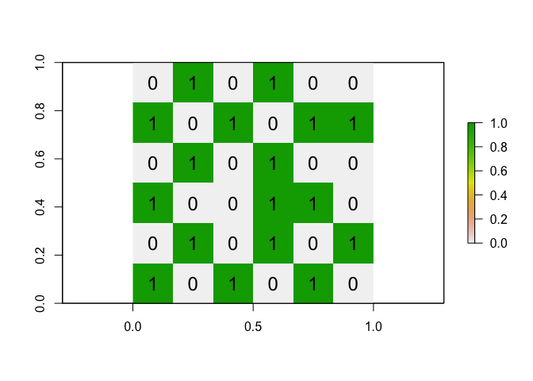
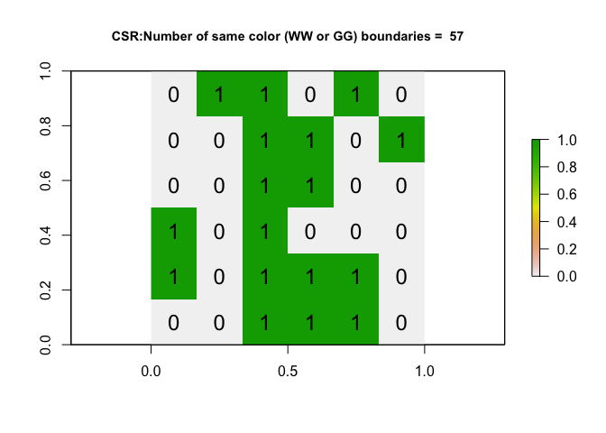
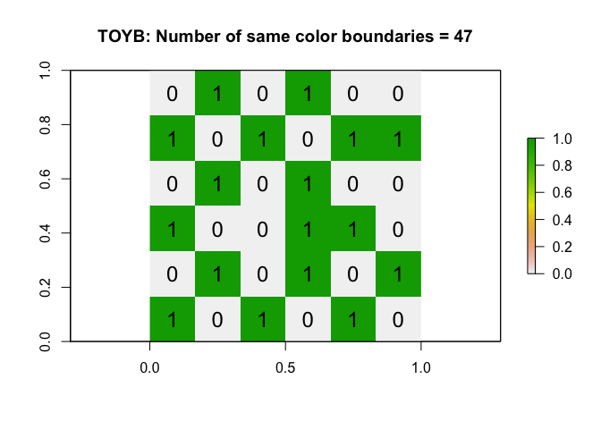

```r
library(knitr)
library(tidyverse)
library(raster)
library(VIM)
library(spdep)
library(sf)
library(sp)
library(tmap)
library(skimr)
library(rnaturalearth)
library(readxl)
library(USAboundaries)
```

# Join Counts

2.  **Briefly explain what join counts are and why it is only appropriate to use use them for categorical or binary (yes/no ; TRUE/FALSE) data.**

Join counts is a statistic used to analyze area patterns. It involves counting the number of edges shared between two categories or classes. It is most appropriate for binary data because the joincount statistic involves counting joins between value pairs at neighboring locations. If we had a checkerboard with green and white boxes, this would involve counting the number of joins between green and green boxes, white and white boxes or green and white boxes.

3.  **Explain in your lab answers what the rep() and c() commands do**

c() command is used to put items together into a vector or list. For example, below I create a list (mylist) of items that includes characters and numbers together. The list can be of numbers only, characters only, lists, or other items.


```r
mylist = c('a',1,2,'b')
print(mylist)
```

```
## [1] "a" "1" "2" "b"
```


rep() command replicates something (a number, list, etc.) a specified number of times. See example below where I repeat the above list (mylist) 3 times. 


```r
rep(mylist,3)
```

```
##  [1] "a" "1" "2" "b" "a" "1" "2" "b" "a" "1" "2" "b"
```


4.  **Create your grid to generally have negative spatial autocorrelation, but still include a little bit of randomness.**


```r
row.1 <- c(0,1,0,1,0,0)
row.2 <- c(1,0,1,0,1,1)
row.3 <- c(0,1,0,1,0,0)
row.4 <- c(1,0,0,1,1,0)
row.5 <- c(0,1,0,1,0,1)
row.6 <- c(1,0,1,0,1,0)

ToyB_matrix <- matrix(c(row.1, row.2, row.3, row.4, row.5, row.6), 
                      nrow=6,ncol=6, byrow=TRUE)
#------------------------------------------------------------------------
#Convert the test dataset to spatial data using the raster command - and then make a plot with a title.
ToyB_raster <- raster(ToyB_matrix)

plot(ToyB_raster)
text(coordinates(ToyB_raster), labels=ToyB_raster[], cex=1.5)
```

<!-- -->

# Spatial weights matrix

5.  **What is a spatial-weights-matrix?** A spatial weights matrix is a representation of the spatial structure of data. It quantifies the spatial relationships among feature of the data.

**How can adjacency be used to create one?** (e.g. what are queens/rooks) Adjacency can be used to define nearness for creating a spatial weights matrix. Neighbors can be those that strictly only share a border (rooks) or they can be those that share a border or corner (queens).

**How can distance be used to create one?** Nearness can also be measured using distance between features of a dataset. Usually distances are measured from the centroid of one feature to the centroid of another. However it is possible to measure distance in other ways such as from the centroid of one feature to the border of another feature, between two closest boundaries, etc. Distances can also be measured in other not so obvious ways such as driving distance or in terms of values of objects e.g., \$100 is closer to \$150 than it is to \$500. 

6.  **Create a spatial weights matrix for ToyB_matrix. Use a queen's weights matrix in your example**


```r
# Step 1 - turn to polygon
ToyB_polygon    <- rasterToPolygons(ToyB_raster, dissolve=FALSE)
ToyB_spdep      <- SpatialPolygons(ToyB_polygon@polygons)

# Step 2 - Make list of neighbors
ToyB_nb.qn <- poly2nb(ToyB_spdep, queen = TRUE)

# Step 3 - Create weights matrix
ToyB_weights.qn <- nb2listw(ToyB_nb.qn, style='B')

# Step 4 - plot the neighbors
plot(ToyB_spdep, border='blue')
plot(ToyB_nb.qn, coordinates(ToyB_spdep), col='red', lwd=2, add=TRUE)
```

<!-- -->

7.  **Explain why your Queens adjacency plot for the Toy_B data looks different to my Rooks adjacency plot for the Toy_A data.**

The rooks adjacency plot only includes border to border joins but the queens adjacency plot includes both border to border and corner to corner joins.

# Join count analysis

***Using an Independent Random Process to create a matrix of the same shape but filled with random 1s and 0s - this is important for understanding (on average) how many green-green, white-white, green-white boundaries there would be if an Independent Random Process caused the pattern.***


```r
toyIRP <- function(matrix_input, silent=FALSE){

  # find how big out input matrix is
  nrows  <- nrow(matrix_input)
  ncols <- nrow(matrix_input)
  numberones <- 17
  # make a list of all the ones and zeros
  alltheones  <- rep(1,numberones)
  allthezeros  <- rep(0, ((nrows*ncols) - numberones))
  # randomise
  randombinary <- sample(c(alltheones,allthezeros),size=(nrows*ncols),replace=FALSE)

  
  #---------------------------------------------------------------------------
  # Turn into a matrix and create the weights etc.
  #---------------------------------------------------------------------------
  IRP_matrix   <- matrix(randombinary, nrow=nrows,ncol=ncols, byrow=TRUE)
  IRP_raster   <- raster(IRP_matrix)
  IRP_polygon  <- rasterToPolygons(IRP_raster, dissolve=FALSE)
  IRP_spdep    <- SpatialPolygons(IRP_polygon@polygons)
  IRP_nb.qn  <- poly2nb(IRP_spdep, queen = TRUE)
  IRP_weights.qn <- nb2listw(IRP_nb.qn, style='B')
  IRB_jointest <- joincount.test(fx    = as.factor(IRP_polygon$layer), listw = IRP_weights.qn) 
  
  ww_gg_joincount <- IRB_jointest[[1]]$estimate[1]+  IRB_jointest[[2]]$estimate[1]
  
  # If you want to see the output (e.g. silent=FALSE) then plot
  if(silent == FALSE){
    plot(IRP_raster, 
         main = list(paste("CSR:Number of same color (WW or GG) boundaries = ",ww_gg_joincount),cex=.9))
    text(coordinates(IRP_raster), labels=IRP_raster[], cex=1.5)
  }
  
  return(ww_gg_joincount)
}
```

***Counting the number of same color joins from an IRP multiple times.***


```r
output <- toyIRP(ToyB_matrix, silent=FALSE)
```

<!-- -->

10. **On average, if an IRP really did cause the pattern for a 6x6 matrix, how many same-color joins would you expect to see? Why does the number change each time you run it?**

Based on the above function, the number of same color joins is variable but on average about 55. This number varies every time because the process is random and so the spatial arrangement of white and green boxes shifts every time. When the spatial arrangement changes, so does the number of same color joins. 

***Make a histogram of the number of same color loins that result from an IRP.***


```r
# Run once
alloutput <-  toyIRP(ToyB_matrix, silent=TRUE)
  
# Repeat 500 times and add in the answer
for(n in 1:500){
  newIRP <- toyIRP(ToyB_matrix, silent=TRUE)
  alloutput <-  c(alloutput, newIRP)
}  

#make a histogram of all the white-white joins
hist(alloutput, br=20, main="The number of same color joins for 1001 variations of an IRP")
mx <- mean(alloutput)
abline(v = mx, col = "blue", lwd = 2)
```

<!-- -->

```r
print(paste0('The mean number of same color joins is ', round(mx)))
```

```
## [1] "The mean number of same color joins is 53"
```

12. **Given this output, what is your new expectation of the number of same-color joins if an IRP caused the process?**

I expect about 54 same color joins.

12. **Using this equation, if you have a 6x6 grid, how many same color joins would you theoretically expect (hint, it would be the total number of joins minus E_GW)**

$$E_{GW}=\frac{2JGW} {N(N-1)}$$


```r
N=36
J = 110#72 for rooks
G = 17 #17 is my figure not the IRP one
W = 36-G
E_GW = (2*J*G*W)/(N*(N-1))
scj <- J-E_GW
```

I would theoretically expect 54 same color joins.

***Calculating the number of same color boundaries***


```r
# run the command
 ToyB_jointest <- joincount.test(fx = as.factor(ToyB_polygon$layer), 
                                listw = ToyB_weights.qn,        
                                alternative = "greater") 
 numberboundaries <- ToyB_jointest[[1]]$estimate[1]+  ToyB_jointest[[2]]$estimate[1]


# and plot
 plot(ToyB_raster, main = paste("TOYB: Number of same color boundaries =",numberboundaries))
 text(coordinates(ToyB_raster), labels=ToyB_raster[], cex=1.5)
```

<!-- -->

13. **Comparing against the histogram, is the number of white-white boundaries unusually high/low?? Does this suggest your data is unusually clustered/uniform compared to one created by an IRP?**

Compared to the histogram, the number of white-white joins is unusually low.

This suggests that my data is unusually uniform compared to one created by an IRP.

14. **Write your H~0~ and H~1~ to test whether your pattern in ToyB is unusually clustered compared to one caused by an IRP (e.g. does it exhibit unusual levels of positive autocorrelation)**

**H~0~: An Independent Random Process is causing the pattern in ToyB.**\
*The number of Observed "white-white" joins (O~WW~) is no different than what you would expect from a pattern caused by an Independent Random Process (E~WW~): \O~WW~ = E~WW~.\*

**H~1~ : The pattern in ToyB is unusually clustered compared to one caused by an IRP**; *so the number of Observed "same color" joins (O~White-White~) is* **higher** *than what you would expect from a pattern caused by an Independent Random Process: O~WW~ \> E~WW~*

[**Test statistic**]{.ul}

15. **In the joincount.test command, there is an argument, sampling = "nonfree". Using the textbook pdf to help, explain the difference between free and non-free sampling when making our IRP pattern.**

Free and non-free sampling are hypotheses that can be applied to determine the expected number of join counts from an IRP. Free sampling is applied when it is possible to tell the probability of an area being one or the other category (e.g. probability of being green or white). The probability can be determined based a theoretical idea or through referring to a larger study area.

Non-free sampling is used when there is no way to determine the probability of having one or the other category in an area. This can mean that there is no general population to refer to or that there is not an appropriate theory to help in the determination.

One example to differentiate free from non-free sampling is how we generated the pattern thought an IRP process in this lab. The proportions of green and black boxes was set as fixed such that only the spatial arrangement of boxes is changing every time you generate the pattern. This is non-free sampling. 

If free sampling was applied instead, the number of green and white boxes would change every time you generate the pattern.

16. **Run a joincount test for your Toy B hypothesis test (e.g. you are testing if it is unusually clustered) and interpret the output.**


```r
ToyB_jointest <- joincount.test(fx    = as.factor(ToyB_polygon$layer), 
                                listw = ToyB_weights.qn,   
                                sampling = "nonfree",
                                alternative = "greater")
```


```r
# White-to-white Join counts
ToyB_jointest[[1]]
```

```
## 
## 	Join count test under nonfree sampling
## 
## data:  as.factor(ToyB_polygon$layer) 
## weights: ToyB_weights.qn 
## 
## Std. deviate for 0 = -1.2957, p-value = 0.9025
## alternative hypothesis: greater
## sample estimates:
## Same colour statistic           Expectation              Variance 
##              25.00000              29.85714              14.05318
```

```r
# Green-to-green Join counts
ToyB_jointest[[2]]
```

```
## 
## 	Join count test under nonfree sampling
## 
## data:  as.factor(ToyB_polygon$layer) 
## weights: ToyB_weights.qn 
## 
## Std. deviate for 1 = -0.49764, p-value = 0.6906
## alternative hypothesis: greater
## sample estimates:
## Same colour statistic           Expectation              Variance 
##              22.00000              23.74603              12.31068
```

The observed values are less than the expected values for both GG and WW joins.

Based on the p-value, we do not have enough evidence to reject the null hypothesis that the pattern is no different from one generated by an IRP.

17. **The paper did not provide a map of how the territories looked - if you had to choose one of the maps below, which is most likely? Why**? 

    I choose pattern A.

    The results showed a greater than expected number of BB joins, implying that there is clustering in their hunting territories.

    There was a less than expected number of BW joins

18. **At a significance value of 0.01, do these results indicate that the frogs preferred hunting prey in specific patches of their core areas? Or is there no evidence to reject the notion that they randomly hunted wherever they hopped?**

    The p-values from this study are less than 0.01.

    We can reject the hypothesis that they randomly hunt.
