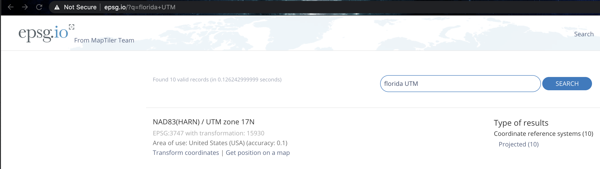

<style>
p.comment {
background-color: #DBDBDB;
padding: 10px;
border: 1px solid black;
margin-left: 0px;
border-radius: 5px;
font-style: normal;
}

h1.title {
  font-weight: bold;
  font-family: Arial;  
}

h2.title {
  font-family: Arial;  
}

</style>


<style type="text/css">
#TOC {
  font-size: 11px;
  font-family: Arial;
}
</style>


```{r setup, include=FALSE}
knitr::opts_chunk$set(echo = TRUE, warning=FALSE, message = FALSE)

# invisible data read
library(tidyverse)
library(sp)
library(sf)
library(readxl)
library(skimr)
library(tmap)
library(USAboundaries)
library(viridis)
library(rnaturalearth)
library(kableExtra)
library(spdep)
library(raster)
library(tidycensus)
library(VIM)

frost   <- readxl::read_excel("pg_364Data_1frostday.xlsx")
newyork <- readxl::read_excel("pg_364Data_1frostday.xlsx")
firefly <- readxl::read_excel("pg_364Data_3Firefly.xlsx")
ozone   <- read.csv("pg_364Data_4Ozone.csv")
```


## Welcome to Lab 6!

<br>

The aim of this lab is to continue work on autocorrelation, especially Moran's I. By the end of the lab you will be able to:

1.  Load data from a variety of sources, including the US census
2.  Conduct join counts and Moran's I analyses on real data
3.  Consider environmental vulnerability

Assignment 6 is due by midnight the night before your next lab on Canvas. Your job is to submit the requirements on this page.

See [**your canvas assignment here**](https://psu.instructure.com/courses/2120046/assignments/13274838).

<p class="comment">**Need help?** Add a screenshot/question to the discussion board here: [**LAB 6 DISCUSSION BOARD**](https://psu.instructure.com/courses/2120046/discussion_topics/14125718)</p>

<br><br>

## A: Set up the lab

<br>

### A1: Sign up for Census API (if you didn't last week)

IF YOU DIDN'T LAST WEEK:  You can easily access US census data within R, but you need to sign up in advance for a password.

<https://api.census.gov/data/key_signup.html>

You can use Penn State as the organisation. This is just you promising that you will follow the terms and conditions when using this data. In a few minutes, e-mail you a personal access code. Click the link in the e-mail to activate.

<br> <br>

### A2: Create your lab project

<br>

Follow the instructions in Labs 1-4 to create your project file and a blank markdown document. e.g. <br>

1.  Open R-Studio. Create a new R-Project in your GEOG-364 folder called `GEOG364_Lab6_PROJECT`.<br><br>

2.  Make a copy of the lab template Rmd file and move it into your project folder.<br><br>

3.  DOUBLE CLICK ON THE GEOG364_Lab6_PROJECT.RPROJ FILE IN YOUR PROJECT FOLDER TO OPEN R.<br><br>

4.  Click on your lab 6 .Rmd file in the files tab to open the script<br>(You should not have to search if you are in your Lab 6 project):<br><br>

    -   Change the title to Lab 6. <br><br>
    -   Change the theme if you like or add in any other features <br><br>
    -   Remember you can edit your lab in the "editor" mode by clicking on the A at the top right<br><br>

5. IF YOU ARE ON R-STUDIO CLOUD, Re-install the packages by copying the commands here into the CONSOLE: [**Tutorial 2:**](https://psu-spatial.github.io/Geog364-2021/pg_Tut2_startup.html#Bulk_download_for_our_course). <br> You will need BOTH the install.packages commands AND the remotes commands

6. Edit your top code chunk that looks like this, and add `library("tidycensus")` to the list of libraries.

```{r, L6Fig2, echo=FALSE}
knitr::include_graphics('pg_364Lab5_tobler_2021_fig2.png')
```

### A3: Teach R your API key/password

You don't need to type this password in every time you run R. Instead we will teach it to R once.

1. Run the command with the libraries. Now save everything  <br><br>

2. **IN THE CONSOLE**, type this command, but replace "YOUR API KEY GOES HERE" with the password you were given <br><br>

  ```{r, eval=FALSE}
  # census_api_key("YOUR API KEY GOES HERE", install=TRUE,overwrite=TRUE)
  
  # Here is an imaginary example, you need your own number from the e-mail
  # census_api_key("d2a990f429205c51b54998ec58886c6cf01a7ef2", install=TRUE,overwrite=TRUE)
  ```

3. This will now load the password.  <br><br>

4. CLOSE R-STUDIO AND RE-OPEN YOUR PROJECT FILE<br><br>


<br>
<br>


## B: Playing with census data

### B1: Census data online

There are many inbuilt data-sets in R.  One of the most powerful is that you have access to almost all of the US Census Data through the `tidycensus` package.  Today we will be looking at data from the American Community survey.  

<br>

Make a new heading called the American Community Survey Online

<br>

1.  **Step 1:**<br> Google the ACS and explain what it is, how often the data is collected and the sorts of data available. What is the population of this dataset?

<br>

2. **Step 2:**<br> Follow Tutorial 6Ec on policy map.  Explore what variables are available and see how the maps look (for those with US projects, think about whether there are variables that might be useful).

<br> 

3. **Step 3:**<br> For a US State of your choice, make a professional looking map of a census/ACS variable of your choice.  Either save/export the map (you might need legacy mode) or take a good looking screenshot.  Then include the picture here in your report. <br> Underneath the plot, explain:
  a. What this variable shows about your chosen state.<br>
  b. What patterns are there and are they dependent on your unit/scale of observation (e.g. autocorrelation)<br>
  c. What process might have caused those patterns<br>
  
<br><br>

### B1: Census data in R

We will now download and explore some census data in R.

<br>

4. **Step 4:**<br> Use Tutorial 6Eb to download the following data into R, save it as something sensible <br>
   + State: Iowa
   + Survey: ACS 5 year collected in 2017
   + Scale: County
   + Variables: med.income ("B19013_001) ; total.population ("B05012_001"); income.gt75 ("B06010_011")
  
<br>

5. **Step 5:**<br> Use Tutorial 6Ec to create a column with the percentage of people making more than $750000.

<br>

5. **Step 6:**<br>Use Tutorial 6Ec and  the tmap tutorial from Lab 4 to make a professional plot of this 
  
<br>

```{r,include=FALSE}
# Download PA ACS data at county level for some chosen variables, using tidycensus
# see the helpfile for get_acs for more options
IA.Census.sf <- get_acs(geography = "county", 
                year = 2017,
                variables = c(total.population = "B05012_001", # total population
                              med.income       = "B19013_001"), # median income)
              state = c("IA"),
              survey = "acs5",
              geometry = TRUE,
              output="wide")
```
  
<br>
<br>


## C: Social vulnerability and Moran's I Tutorial

This section applies what we have learned to a real life scenario (vulnerability modelling in the USA) and introduces the concept or Moran's I. It will also allow us to read in shapefiles.

<br>

It is set out as a worked example, with the steps you need to take at the end

<br>

### What is SVI?

The Centers for Disease Control and Prevention Social Vulnerability Index (SVI) was created to help public health officials and emergency response planners identify and map the communities that will most likely need support before, during, and after a hazardous event.

SVI indicates the relative vulnerability of every U.S. Census tract. Census tracts are subdivisions of counties for which the Census collects statistical data. SVI ranks the tracts on 15 social factors, including unemployment, minority status, and disability, and further groups them into four related themes. Thus, each tract receives a ranking for each Census variable and for each of the four themes, as well as an overall ranking.

I am going to use this data for a specific state to look at the spatial distribution of some of these variables.

#### Download the data

First I will find and download the data. I found the SVI data at

 - https://www.atsdr.cdc.gov/placeandhealth/svi/data_documentation_download.html

The **documentation** to understand what the column headings of the data can be found at:

 - https://www.atsdr.cdc.gov/placeandhealth/svi/documentation/pdf/SVI2018Documentation-H.pdf

I then downloaded county level data  shapefile for Florida for 2018 as an ESRI shapefile.  I saved this to my lab 6 folder, then unzipped it.

```{r, fileloc5, echo=FALSE}
knitr::include_graphics('Fig_6_02SVIdownload.png')
```

```{r, fileloc6, echo=FALSE}
knitr::include_graphics('Fig_6_03_Fileloc.png')
```

### Read the data into R

I used Tutorial 6B to read the shapefile into R. 


```{r}
# This reads in the shapefile containing the SVI Data and saves it to an sf variable called SVI

SVI.sf.lonlat  <-  st_read("SVI2018_FLORIDA_county.shp")
```

I will also use the `us_states` command from the USAboundaries package to download the border of Florida. If you see warnings about an old crs , ignore them

```{r}
# This downloads the US state border data for my state, it's from the USAboundaries package
Stateborder.sf.lonlat <- us_states(states = "Florida",)
```

### Change the projection

Now let's check the map projection of both and make sure they are the same or they won't plot [Tutorial 11 A](https://psu-spatial.github.io/Geog364-2021/pg_Tut11_spatial101.html#Map_Projections)  

```{r}
raster::projection(SVI.sf.lonlat)
raster::projection(Stateborder.sf.lonlat)
```

Although they are both equal, I'm now going to change them both to a UTM projection as it's more robust. I found the code by selecting Florida UTM here: 

 - https://mangomap.com/robertyoung/maps/69585/what-utm-zone-am-i-in-#

Then checking the epsg code here:

 - http://epsg.io/

```{r, utm1, echo=FALSE}
knitr::include_graphics('Fig_6_04UTM.png')
```

```{r, utm2, echo=FALSE}

```


```{r}
SVI.sf.utm          <- st_transform(SVI.sf.lonlat,3747)
Stateborder.sf.utm <- st_transform(Stateborder.sf.lonlat,3747)
```

and check it worked:

This :

```{r}
raster::projection(SVI.sf.lonlat)
raster::projection(Stateborder.sf.lonlat)
```

<br>

should be different to this:

```{r}
raster::projection(SVI.sf.utm)
raster::projection(Stateborder.sf.utm)
```

<br>

### Explore the data

Now I can explore the dataset.  I have already looked at the documentation and seen that there are many columns I can look at.  I can see these by showing the column names here, or by clicking its name in the Environment tab.

```{r}
names(SVI.sf.utm)
```

<br>

There are lots more non-spatial plots I can make, but for now I will move onto maps.

Today I am going to use tmap.  As you can see and know from previous tutorials, a plot is built up in layers using the "+" symbol to connect them.  Each `tm_shape` line identifies some data you want to plot, then the indented lines afterwards plot it.

I have chosen to plot one of the many variables that are available to me:`E_TOTPOP`.  From the documentation I found this represents the population total in each county:

<br>

```{r}
tm_shape(SVI.sf.utm) + 
  tm_polygons(col="E_TOTPOP", style="quantile",
              border.col = "black",
              palette="Spectral") +
  tm_legend(outside = TRUE) + 
  
  tm_shape(Stateborder.sf.utm) + 
  tm_borders() +
  
  tm_layout(main.title = "Population",  main.title.size = 0.95)

tmap_options(check.and.fix = TRUE)

```

<br>

Real life issue!

Sometimes R might not understand your data is numeric - and try to plot a million tiny categories.  In that case, use the "as.numeric" command to force that column to be numbers above your plot code then try again.  For example: 

```{r, eval=FALSE}
SVI.sf.utm$E_TOTPOP <- as.numeric(SVI.sf.utm$E_TOTPOP)
```


<br>

### Interpretation

So it seems that my population is clustered in the south and mid-way up state.  This makes sense given that the blue area is the Miami-Dade district and we have Orlando. To better understand my data, there are two other ways I might want to use tmap:

Firstly, I might want to compare two maps at once. I can do this by creating two separate maps and instead of plotting them, simply saving them as Map1 and Map2, then plotting them together using the tmap_arrange command.  

I might also want to make this interactive.  In this case, we simply switch map view from "plot" to "view" (R cloud folks, turn this off).  I also added a leaflet basemap (code from here: http://leaflet-extras.github.io/leaflet-providers/preview/).  For other color palettes, see here: https://www.r-graph-gallery.com/38-rcolorbrewers-palettes.html


```{r}
tmap_mode("view")

# create map 1
Map1 <- tm_basemap("OpenStreetMap.Mapnik") + # Set the watercolor basemap
        tm_shape(SVI.sf.utm) +                   # plot the SVI data   
           tm_polygons(col="E_TOTPOP",      # name of the column I am plotting
                       style="pretty",      # do i want color breaks, or continuous color bar?
                       border.col = NULL,   # no outlines
                       palette="Spectral",  #color palette 
                       title="Population Density", #plot title
                       alpha = .5) +        #slightly transparent
        tm_shape(Stateborder.sf.utm) +          # Plot the State.border data 
            tm_borders()                    #plot it as borders/lines 
tmap_options(check.and.fix = TRUE)

# remember to convert any numeric variables into numbers if R gets it wrong
#SVI$E_PCI <- as.numeric(SVI$E_PCI)

# create map 2
Map2 <-  tm_basemap("Stamen.Watercolor") +
         tm_shape(SVI.sf.utm) +
           tm_polygons(col="E_PCI",style="pretty", 
                       border.col = NULL,
                       palette="RdBu",
                       title="Average income",
                       alpha = .7) +
         tm_shape(Stateborder.sf.utm) + 
            tm_borders()
tmap_options(check.and.fix = TRUE)

# plot them both
tmap_arrange(Map1,Map2)

```


<br>

### Creating a spatial weights matrix

**For the rest of this lab I am going to focus on population density**.

First, I look to see if the population density data looks like it clusters or is dispersed.  I can also look at other data to understand why this might be the case (e.g. is there some underlying reason why our data looks this way). From my perspective and the color scale, it does look like there is clustering of high population areas.

As described in Lab 5, before we can formally model the spatial dependency shown in the above map, we must first cover how neighborhoods are spatially connected to one another. That is, what does “near” mean when we say “near things are more related than distant things”? 

For each census tract, we need to define

 - What counts as its neighbor (connectivity)
 - How much does each neighbor matter? (spatial weights)
 
<br>

To do this we again calculate the spatial weights matrix.  


However, this is where R gets annoying - we need an sp version of our data:

```{r}

SVI.sp.utm <- as(SVI.sf.utm,"Spatial")

# calculate the spatial weights matrix
spatial.matrix.rook <-poly2nb(SVI.sp.utm, queen=F)

plot(SVI.sp.utm, border='blue')
plot(spatial.matrix.rook, coordinates(SVI.sp.utm), col='black', lwd=2, add=TRUE)
```


We can then assign weights to each one based on whether it is a neighbour or not.  Again, I am just using rook's contingency, a binary classification of 1 if a county is a neighbour and 0 if not.

```{r}
# calculate the spatial weights
weights.rook <- nb2listw(spatial.matrix.rook, style='B')
```


### Moran's scatterplot

Now we want to use our neighbours to assess whether there is any clustering. so I will calculate something called a Moran's scatterplot. This plots the value of our variable for each county/unit, against the average value of its "neighbours" (where neighbours is defined by the spatial weights matrix).

<br>

For example:

```{r, moranexp, echo=FALSE}
knitr::include_graphics('moranexplanation.png')
```

<br>

Here is our attempt: In a county with a high population, surrounded by counties with a high population would be in the top right.


```{r}
## and calculate the Moran's plot
moran.plot(SVI.sp.utm$E_TOTPOP, weights.rook,
           xlab = "Population",
           ylab = "Neighbors Population",
           labels=SVI.sp.utm$COUNTY)
```

Here we can see that high population counties tend to be clustered together, but that there is not a perfect relationship.  Miami Dade in particular is maybe skewing the relationship a little. (In join counts all our data was either TRUE or FALSE, so this scatterplot wouldn't make sense)

### Linking to autocorrelation

This now links directly to autocorrelation through the correlation of the plot.

```{r, moranexp2, echo=FALSE}
knitr::include_graphics('moranexplanation2.png')
```

<br>

The "Moran's I" global statistic is the correlation coefficient of the Moran's I scatterplot (remember previous lectures)

```{r, moran, echo=FALSE, fig.cap = "plot from: https://mgimond.github.io/Spatial/spatial-autocorrelation.html"}
knitr::include_graphics("Fig_6_06Moran.png")
```
<br>

### Significance test

<br>

We can now test whether our data is significantly clustered/dispersed, using a Moran's I hypothesis test.  This assesses whether our data is unusually structured (e.g. clustered or dispersed) compared to a pattern generated by an IRP.

The easiest way to see this in R is to use the Moran.test command, which also assesses the significance of your result:

```{r}
moran.test(SVI.sp.utm$E_TOTPOP, weights.rook)    
```

<br>

We find that the Moran’s I is positive (0.30) and statistically significant (the p value is very small). Remember from lecture that the Moran’s I is simply a correlation, and correlations go from -1 to 1. 

A 0.30 correlation is relatively high, indicating some clustering, but not a very strong signal. Moreover, we find that this correlation is statistically significant (p-value basically at 0).

<br>
<br>


## D: Your own SVI analysis

Make a new heading called SVI.  In here, I would like you to present a spatial autocorrelation analysis of your own.

<br>

This will be easier in week 2 after the lecture on Moran's I.  Your job is to repeat this tutorial in your own .rmd file but for a DIFFERENT STATE and for a DIFFERENT VARIABLE. (not Florida and not Population density).  Ideally choose the state that you used for the census analysis and go for an interesting variable like RPL_THEME1 (look at the documentation to understand it!)
 
Your write up should include:

<br>

 - A description of what the SVI data is and why it's important (remember the documentation will help). You should include the unit of observation
 
 <br>
 
 - Why you chose the state that you did.  Is there something interesting there you want to look at?
 
 <br>

 - All the relevant code to make the analysis work for you. 
 
 <br>
 
 - What map projection you chose and why.
 
 <br>

 - An exploratory analysis of the data with good spatial maps, for example how does the pattern/process compare to the census data you downloaded earlier.
 
 <br>
 
 - A full Moran's plot and hypothesis test with the results explained clearly in the text. You should clearly explain what Moran's I is and how to interpret it.
 
 <br>

For full grades, the code will also show some originality e.g. making the plots feel like "yours" (choosing your own color palettes, map backgrounds etc), including markdown elements such as references or equations as relevant, including section sub-headings and thoughtful analysis.


<br><br>


## E. Above and beyond

Remember that an A is 93%, so you can ignore this section and still easily get an A. But here is your time to shine. Also, if you are struggling in another part of the lab, you can use this to gain back points.

**To get the final 4 marks in the lab, you need to show me something new, e.g. you need to go above and beyond the lab questions in some way.**

-   You get 2/4 for doing something new in any way 
-   You get 4/4 for something really impressive

An easy example, try conducting a Moran's analysis for your census data. Bonus marks if you can convert a column to TRUE/FALSE and do a join counts analysis on it!

Please tell us in your R script what you did!

<br><br>


## F. Submitting your Lab

Remember to save your work throughout and to spell check your writing (left of the knit button). Now, press the knit button again. If you have not made any mistakes in the code then R should create a html file in your lab 6 folder which includes your answers. If you look at your lab 6 folder, you should see this there - complete with a very recent time-stamp.

In that folder, double click on the html file. This will open it in your browser. CHECK THAT THIS IS WHAT YOU WANT TO SUBMIT

Now go to Canvas and submit BOTH your html and your .Rmd file in Lab 6.

<br><br>

## Lab 6 submission check-list

**For all answers: Full marks = everything down at a high standard, in full sentences as appropriate with no parts of your answer missing. Imagine it as an example I use in class**

**HTML FILE SUBMISSION - 5 marks**

**RMD CODE SUBMISSION - 5 marks**

**MARKDOWN STYLE - 10 MARKS**

We will start by awarding full marks and dock marks for mistakes.LOOK AT YOUR HTML FILE IN YOUR WEB-BROWSER BEFORE YOU SUBMIT 

TO GET 13/13 : All the below PLUS your equations use the equation format & you use subscripts/superscript as appropriate

TO GET 12/13 - all the below:

  - Your document is neat and easy to read. 
  - Answers are easy to find and paragraphs are clear (e.g. you left spaces between lines) 
  - You have written in full sentences, it is clear what your answers are referring to. 
  - You have used the spell check. 
  - You have used YAML code to make your work look professional (themes, tables of contents etc) 

**CODING STYLE - 10 MARKS**

 - Full marks. You have managed to recreate the Toy B code example using a queens spatial weights matrix. Your code is neat, commented and the variable names make sense. You have no spurious printed output from library loads or other code.
 
We grade this by first awarding full marks, then dropping points as mistakes are found or as coding gets messier.

**ACS and POLICY MAP - 10 MARKS**

You have clearly explained what ACS is, how often the data is collected and the sorts of data available. You have defined the population.

You have included an image (properly cropped/presented) of a professional map you made in Policy Map for a state of your choice

You have explained what your chosen variable shows about your chosen state, what patterns are there and whether they show autocorrelation. You have commented on process.


**Census MAPS IN R - 10**

You have read in the data, created a percentage column and made a professional looking plot.


**SVI Analysis - 46**

You have conducted an SVI analysis for your own state and variable, including

15 marks:  Description
 
 - A description of what the SVI data is and why it’s important (remember the documentation will help). You should include 
   + the unit of observation, 
   + why you chose the state that you did.
   + what map projection you chose and why.

15 marks:  Coding and maps

 - An exploratory analysis of the data with good spatial maps, for example how does the pattern/process compare to the census data you downloaded earlier.

16 marks: Moran's plot

 - A full Moran’s plot and hypothesis test with the results explained clearly in the text. You should clearly explain what Moran’s I is and how to interpret it. You have included all steps, for example YOUR HYPOTHESES IN WORDS as well as maths, plus a full description of outcomes.

**Above and beyond: 4 MARKS**

-   You get 2/4 for doing something new in any way 
-   You get 4/4 for something really impressive

An easy example, try conducting a Moran's analysis for your census data. Bonus marks if you can convert a column to TRUE/FALSE and do a join counts analysis on it!
[100 marks total]

Overall, here is what your lab should correspond to:

```{r, echo=FALSE}
rubric <- readxl::read_excel("pg_364Lab_rubrictable.xlsx")
knitr::kable(rubric) %>%   
  kable_classic_2() %>%
  kable_styling(bootstrap_options = c("striped", "hover", "responsive"))
```


::: {style="margin-bottom:25px;"}
:::


------------------------------------------------------------------------

Website created and maintained by [Helen Greatrex](https://www.geog.psu.edu/directory/helen-greatrex). Website template by [Noli Brazil](https://nbrazil.faculty.ucdavis.edu/)
