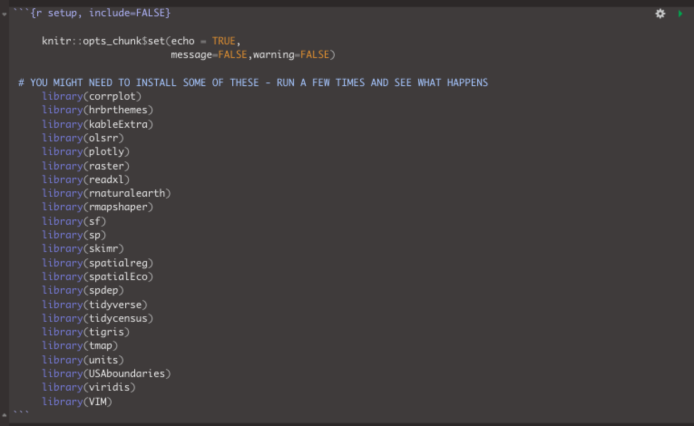
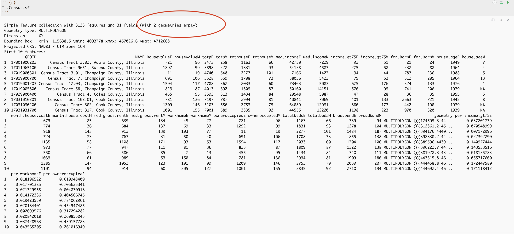
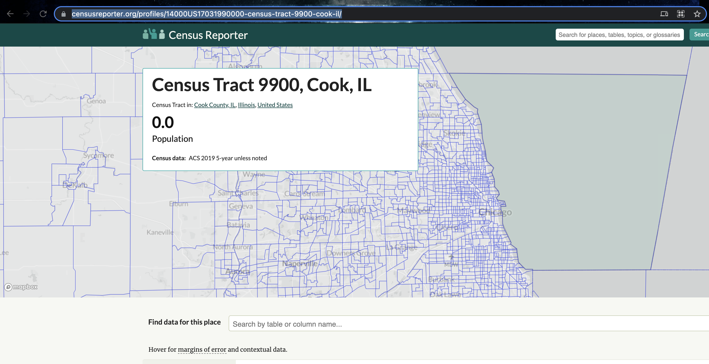

<style>
p.comment {
background-color: #DBDBDB;
padding: 10px;
border: 1px solid black;
margin-left: 0px;
border-radius: 5px;
font-style: normal;
}

h1.title {
  font-weight: bold;
  font-family: Arial;  
}

h2.title {
  font-family: Arial;  
}

</style>


<style type="text/css">
#TOC {
  font-size: 11px;
  font-family: Arial;
}
</style>


```{r, include=FALSE}
knitr::opts_chunk$set(echo = TRUE, warning=FALSE, message = FALSE)

library(corrplot)
library(hrbrthemes)
library(kableExtra)
library(olsrr)
library(plotly)
library(raster)
library(readxl)
library(rnaturalearth)
library(rmapshaper)
library(sf)
library(sp)
library(skimr)
library(spatialreg)
library(spatialEco)
library(spdep)
library(tidyverse)
library(tidycensus)
library(tigris)
library(tmap)
library(units)
library(USAboundaries)
library(viridis)
library(VIM)


frost   <- readxl::read_excel("pg_364Data_1frostday.xlsx")
newyork <- readxl::read_excel("pg_364Data_1frostday.xlsx")
firefly <- readxl::read_excel("pg_364Data_3Firefly.xlsx")
ozone   <- read.csv("pg_364Data_4Ozone.csv")
```


## Welcome to Lab 7!

<br>

The aim of this lab is to continue work on autocorrelation and to start regression. By the end of the lab you will be able to:

1.  Load data from shapefiles??
2.  Explore local spatial autocorrelation and spatial regression.

In this lab, I want to assess the relationship between the number of people who earn over $75000 dollars and population density in Chicago. Your job is to create a different regression analysis for your own data.

We will practice two new techniques, LISA (local auto-regression) to see if each variable is auto-correlated with itself, then actual regression - to understand the relationship between the two.

Now you are getting more experienced in R, I will provide a worked example then get you to do something similar on your own data. As much as possible I will refer to the tutorials, but remember they are there and remember that you also have your previous labs.  I am purposefully not showing the code for the parts that you have done before, so this lab will be much harder if you have not finished Lab 6.

**This is a longer lab. You have 2 weeks. I will consider awarding exceptional labs course credit at my discretion**

<br>

See [**your canvas assignment here**](https://psu.instructure.com/courses/2120046/assignments/13274841).

<p class="comment">**Need help?** Add a screenshot/question to the discussion board here: [**LAB 7 DISCUSSION BOARD**](https://psu.instructure.com/courses/2120046/discussion_topics/14125719)</p>

<br><br>

## A: Set up the lab **NEW**

<br>

### A1: Sign up for Census API (if you didn't last week)

IF YOU DIDN'T LAST WEEK:  You can easily access US census data within R, but you need to sign up in advance for a password.

<https://api.census.gov/data/key_signup.html>

You can use Penn State as the organisation. This is just you promising that you will follow the terms and conditions when using this data. In a few minutes, e-mail you a personal access code. Click the link in the e-mail to activate.

<br> <br>

### A2: Create your lab project

<br>

Follow the instructions in Labs 1-4 to create your project file and a blank markdown document. e.g. <br>

1.  Open R-Studio. Create a new R-Project in your GEOG-364 folder called `GEOG364_Lab7_PROJECT`.<br><br>

2.  Make a copy of the lab template Rmd file and move it into your project folder.<br><br>

3.  DOUBLE CLICK ON THE GEOG364_Lab7_PROJECT.RPROJ FILE IN YOUR PROJECT FOLDER TO OPEN R.<br><br>

<p class="comment">**IF YOU AR ON R-STUDIO CLOUD** Re-install the packages AND THEN the two remotes commands by coping BOTH CODE CHUNKS into the console [**Tutorial 2 bulk download:**](https://psu-spatial.github.io/Geog364-2021/pg_Tut2_startup.html#Bulk_download_for_our_course) by</p>

<br>

4.  Click on your lab 7 .Rmd file in the files tab to open the script<br>(You should not have to search if you are in your Lab 7 project):<br><br>

    -   Change the title to Lab 7. <br><br>
    -   Change the theme if you like or add in any other features <br><br>
    -   Remember you can edit your lab in the "editor" mode by clicking on the A at the top right<br><br>


5.  **STEP 5 UPDATE 2 - PACMAN IS RUBBISH**  

It turns out that pacman doesn't work for some people when you press knit. MASSIVE THANKS to Zach, Riley and Fin for figuring this out.  OK!  Let's go back to our old system.  If pacman works for you - nice!  This is here in case you need it.

<br><br>

**Set your TOP CODE CHUNK TO BE THE SAME AS LAB 4/5/6 WITH THESE LIBRARIES**. You will need to install any libraries you are missing.  See  [**Tutorial 2b Packages:**](https://psu-spatial.github.io/Geog364-2021/pg_Tut2_startup.html#How_to_downloadinstall_packages) if you can't remember how.

<br><br>

   ```{r, eval=FALSE}

     knitr::opts_chunk$set(echo = TRUE,
                           message=FALSE,warning=FALSE)

     # YOU MIGHT NEED TO INSTALL SOME OF THESE - RUN A FEW TIMES AND SEE WHAT HAPPENS
     library(corrplot)
     library(hrbrthemes)
     library(olsrr)
     library(plotly)
     library(raster)
     library(readxl)
     library(rnaturalearth)
     library(rmapshaper)
     library(sf)
     library(sp)
     library(skimr)
     library(spatialreg)
     library(spatialEco)
     library(spdep)
     library(tidyverse)
     library(tidycensus)
     library(tigris)
     library(tmap)
     library(units)
     library(USAboundaries)
     library(viridis)
     library(VIM)
   ```
   
<br>


```{r, L7Fig1, echo=FALSE}

```

<br><br>

Run the code chunk a few times and check there are no errors.

<br><br>

## B: Spatial Data Wrangling (repeating lab 6)

<br>

First I am showing you a worked example. Save a copy of your R script as something like Lab 7 tutorial and getting the tutorial running on the example data for Chicago, adding in any code that I didn't put in.  As much as possible I will refer to the tutorials, but remember they are there and remember that you also have your previous labs.  I am purposefully not showing the code for the parts that you have done before, but I have written down exactly how I worked each part out.

<br>

THEN in the challenge, you will do something similar on your own data - so you can make a copy of your tutorial file - and then start slowly changing things to match your own city.  

<br>

<p class="comment">**DO NOT INCLUDE THE TUTORIAL EXAMPLE IN YOUR FINAL REPORT!  Make a separate markdown file if you want to keep it. You will be marked down if it is there.</p>

<br>

 

#### Download the data from ACS

First, I used [**Tutorial 6Ec get_ACS:**](https://psu-spatial.github.io/Geog364-2021/pg_Tut6_input_output.html#6Eb_Loading_Census_data_in_R) __*edit*__ the get_acs command to download American Community Survey data for Illinois at a [**census tract spatial scale**]{.ul}. A census tract is similar to a zip code, a much finer spatial scale than a county. 

THE ONLY WAY YOU WILL KNOW HOW TO DO THIS IS TO LOOK AT TUTORIAL 6Ec. 

I chose to download these variables. There are more variables than I need, but including so you can see some more census codes.

 - housevalue ("B25075_001") :  **house value**
 - totp ("B05012_001") :  **total population**
 - tothouse ("B25001_001") :  **total housing units**	
 - med.income ("B19013_001") :  **median income**  
 - income.gt75 ("B06010_011") :  **number of people making > 75000 USD**
 - for.born ("B05012_003") :  **number of foreign born people**
 - house.age ("B25035_001") :  **average house age**
 - month.house.cost ("B25105_001") :  **monthly house expenditures**
 - med.gross.rent ("B25064_001") :  **median rent**
 - workhome ("B08101_049") :  **number who work from home**
 - owneroccupied ("B25003_002") :  **total owner occupied**
 - totalbeds ("B25041_001") :  **total number of beds in the house**
 - broadband  ("B28002_004") :  **total with access to broadband**


```{r,include=FALSE,echo=FALSE,results=FALSE}
# Download Illinois ACS data at census tract level for my chosen variables, using tidycensus
IL.Census.sf <- get_acs(geography = "tract", 
                year = 2017,
                variables = c(housevalue       = "B25075_001",  # house value
                            totp             = "B05012_001", # total population
                            tothouse         = "B25001_001", # total housing units	
                            med.income       = "B19013_001", # median income  
                            income.gt75      = "B06010_011", # number of people making > 75000 USD
                            for.born         = "B05012_003", # number of foreign born people
                            house.age        = "B25035_001", # average house age
                            month.house.cost = "B25105_001", # monthly house expenditures
                            med.gross.rent   = "B25064_001", # median rent
                            workhome         = "B08101_049", # number who work from home
                            owneroccupied    = "B25003_002", # total owner occupied
                            totalbeds        = "B25041_001", # total number of beds in the house
                            broadband        = "B28002_004"),# total with access to broadband
              state = "IL",
              survey = "acs5",
              geometry = TRUE,
              output="wide")
```

<br>

You can see the data summarized here.  Each column ending in E means the *estimate* of the value in each census tract and the column ending in M means the *margin of error*. 

<br>

```{r}
head(IL.Census.sf)
```

<br>

I then use the same tutorial and the mutate function to create 

 - the percentage of people earning over $75K (e.g. per.income.gt75E / totpE)<br>
 - the percentage of people who work from home (workhomeE / totpE)<br>
 - the percentage of houses that are owner occupied (owneroccupiedE / tothouseE)<br>

<br>

```{r,include=FALSE,echo=FALSE,results=FALSE}
#make a percentage of high earners column
IL.Census.sf <- mutate(IL.Census.sf, per.income.gt75E = income.gt75E/totpE)
#and a percentage of foreign born column
#IL.Census.sf <- mutate(IL.Census.sf, per.for.bornE = for.bornE/totpE)
#and a percentage of who work from home born column
IL.Census.sf <- mutate(IL.Census.sf, per.workhomeE = workhomeE/totpE)

#and a percentage of owner occupied housing (DIVIDING BY TOTAL NUMBER OF HOUSES)
IL.Census.sf <- mutate(IL.Census.sf, per.owneroccupiedE = owneroccupiedE/tothouseE)
#and a percentage with broadband
# IL.Census.sf <- mutate(IL.Census.sf, per.broadbandE = broadbandE/tothouseE)

```

<br>

Here is the summary of the data I downloaded with the new columns added in.  You can see that there are 3123 census tracts in Illinois and that the data is clearly marked, with 31 columns of data.   As before, each column ending in E means the *estimate* of the value in each census tract and the column ending in M means the *margin of error*. The unit of observation is a census tract in Illinois

<br>

```{r, L7Fig2, echo=FALSE}

```

<br>
<br>

#### Dealing with empty polygons

Now.. one quirk of R is that it **hates* empty polygons and if you look at the screenshot above there are two of them here.  IF YOU GET ERRORS PLOTTING, I BET THIS IS WHAT IS HAPPENING.

In our case,  empty polygons means empty census tracts. These might be census tracts where no-one lives, or more likely, a quirk of the data collection process.  Let's take a look at them.

<br>

We can check this with the `st_is_empty()` command:

<br>

```{r}
which_tracts_empty <- st_is_empty(IL.Census.sf)

empty_tracts <- dplyr::filter(IL.Census.sf,which_tracts_empty==TRUE)

empty_tracts
```

<br>

OK so it's tracts 9900 in Cook county and lake county Illinois.  Let's google that... and the results suddenly make sense!

<br>

```{r, L7Fig3, echo=FALSE, fig.cap="*https://censusreporter.org/profiles/14000US17031990000-census-tract-9900-cook-il/*"}

```

<br>

I feel satisfied that removing these polygons won't mess up my study. So I'm going to go ahead and remove them and overwrite the results.  E.g. I apply the filter command to IL.Census.sf, asking it to only choose rows where which_tracts_empty is FALSE, then save the result to IL.Census.sf.

**Note, here I use the [ ] way of subsetting - filter messes up the spatial formatting **

<br>

```{r}
tracts_empty <- st_is_empty(IL.Census.sf)

# ALL columns but only rows where they are NOT empty
IL.Census.sf <- IL.Census.sf[which(tracts_empty==FALSE), ] 

```

<br>

Now.. let's try again.  Yep, we have removed the empty fields.

<br>

```{r}
IL.Census.sf
```


<br>

#### Check/change the map projection

I now check the map projection.  Here I can see that we assigned our data to be in Lat/Long, with a datum (the shape of the world) of WGS 84 and EPSG/CRS code 4326.

<br>

```{r}
raster::projection(IL.Census.sf)
```

<br>

I want to make sure that this is a more appropriate map projection, knowing that Lat/Lon is sometimes less appropriate for zoomed in data, so I look up the UTM projection for Illinois ([**Tutorial 11 projections:**](https://psu-spatial.github.io/Geog364-2021/pg_Tut11_spatial101.html#Map_Projections)), which turns out to have a CRS code of 26916.  

<br>

I convert it to UTM, using the same method you used in Lab 6 and in [**Tutorial 11b projections in R:**](https://psu-spatial.github.io/Geog364-2021/pg_Tut11_spatial101.html#Step_2:_Check_what_map_projections_your_x_and_y_coordinates_are_stored_in).  I'm not including the code as you have done this before and its in the tutorials/lab 6.

<br>

```{r,include=FALSE,echo=FALSE}
# And set an appropriate UTM map projection. I found the EPSG code literally by googling Chicago UTM projection
IL.Census.sf <- st_transform(IL.Census.sf,26916)
```

<br>

Now you can see we have set our projection to UTM zone 16.

<br>

```{r}
raster::projection(IL.Census.sf)
```

<br>

I then had a quick look at the data in tmap to make sure it looked good, using the tutorials here (and in tutorial 11b) https://mgimond.github.io/Spatial/mapping-data-in-r.html#tmap. 

<br>

```{r,echo=FALSE}
# create map 1
map1 <- tm_shape(IL.Census.sf,  unit = "mi") +                      
           tm_polygons(col="income.gt75E",    
                       style="pretty",    
                       border.col = NULL,  
                       palette="YlGnBu",
                       title = "")   +
  tm_layout(main.title = "Number of people making $75K per census tract",  main.title.size = 0.75, frame = FALSE) +
  tm_layout(legend.outside = TRUE) 
   

map2 <- tm_shape(IL.Census.sf, unit = "mi") + 
           tm_polygons(col = "per.income.gt75E", 
                       style = "quantile",
                       palette = "Reds", 
                       border.alpha = 0, 
                       title = "") +  # using the more sophisticated tm_layout command
  tm_scale_bar(breaks = c(0, 10, 20)) +
  tm_compass(type = "4star", position = c("left", "bottom")) + 
  tm_layout(main.title = "Percentage of people making $75K per census tract",  main.title.size = 0.75, frame = FALSE) +
  tm_layout(legend.outside = TRUE) 

tmap_options(check.and.fix = TRUE)

tmap_mode("plot")
tmap_arrange(map1,map2)
```

<br>
<br>

#### Calculate the population density per unit area**

Newly updated in tutorial 6,  we can also calculate the spatial area of each census tract using the `st_area()` command. 

<br>

```{r}
#Finding the area of each county
IL.tract.area.m2 <- st_area(IL.Census.sf)

# This is in metres^2. Convert to Km sq
IL.tract.area.km2 <- set_units(IL.tract.area.m2, "km^2")
IL.tract.area.km2 <- as.numeric(IL.tract.area.km2)
```

<br>

This makes it easy to add a population density column


```{r}
IL.Census.sf <- mutate(IL.Census.sf, pop.densityE = totpE/IL.tract.area.km2)

# and the housing density
IL.Census.sf <- mutate(IL.Census.sf, house.densityE = tothouseE/IL.tract.area.km2)
```

<br>

Let's use tmap to take a look.  Note if you see this error, you have mistyped a column name - I forgot to put in the totpE.

```{r, L7Fig4, echo=FALSE, fig.cap="*You have asked it to plot a column that doesn't exist*"}
knitr::include_graphics('pg_364Lab7_Regression_2021_fig4.png')
```

<br> 

Let's try again:

<br>

```{r, warnings=FALSE, message=FALSE}
# create map 1
map3 <- tm_shape(IL.Census.sf,  unit = "mi") +                      
           tm_polygons(col="totpE",    
                       style="pretty",    
                       border.col = NULL,  
                       palette="YlGnBu",
                       title = "", # using the more sophisticated tm_layout command
                       legend.hist = TRUE)   +
  tm_scale_bar(breaks = c(0, 10, 20)) +
  tm_layout(main.title = "Total Population",  main.title.size = 0.95, frame = FALSE) +
  tm_layout(legend.outside = TRUE) 
   
# create map 1
map4 <- tm_shape(IL.Census.sf, unit = "mi") + 
           tm_polygons(col = "pop.densityE", 
                       style = "quantile",
                       palette = "Reds", 
                       border.alpha = 0, 
                       title = "") +  # using the more sophisticated tm_layout command
  tm_scale_bar(breaks = c(0, 10, 20)) +
  tm_compass(type = "4star", position = c("left", "bottom")) + 
  tm_layout(main.title = "Population density",  main.title.size = 0.95, frame = FALSE) +
  tm_layout(legend.outside = TRUE) 

tmap_options(check.and.fix = TRUE)

# and print
tmap_arrange(map3,map4)
```


<br>
<br>

### Zooming in

<br>

This map looks at all of Illinois.  But we want to look at the area just around Chicago. There are two ways we could do this.  

#### Cropping to a lat long box [ just for show DO NOT DO THIS]

DO NOT DO THIS: The first way is to simply "draw" a new lat/long box for the data using the raster crop function. Because the data is in the UTM map projection, I worked out my new bounding box coordinates here: https://www.geoplaner.com/

```{r}
# My new region from https://www.geoplaner.com/
Crop.Region <- as(extent(361464,470967,4552638,4701992), "SpatialPolygons")

# Make IL.census an sp format
IL.Census.sp <- as(IL.Census.sf,"Spatial")

# And force the projection to be the same as the Illinois data
proj4string(Crop.Region) <- CRS(proj4string(IL.Census.sp))

# Subset the polygons to my new region
IL.Census.sp.BOX <- crop(IL.Census.sp, Crop.Region, byid=TRUE)

# and convert back to sf
IL.Census.sf.BOX <- st_as_sf(IL.Census.sp.BOX)

# Finally plot
tm_shape(IL.Census.sf.BOX, unit = "mi") + 
           tm_polygons(col = "pop.densityE", style = "quantile",
                       palette = "Reds", border.alpha = 0, 
                       title = "Population Density")+
    tm_layout(legend.outside = TRUE) 

```

<br>
 
#### Loading city boundary data (do this)

Instead of a box, we might better want to crop to administrative boundaries.  We can download these using the **Tigris package**.

<br>

Tigris has *thousands* of boundary data-sets that you can explore.  For a tutorial, see here [https://crd150.github.io/lab4.html#tigris_package] and here [https://github.com/walkerke/tigris]

<br>

For now, lets download the Chicago metropolitan area data then select Chicago

```{r, results=FALSE}

cb.sf            <- core_based_statistical_areas(cb = TRUE, year=2017)
Chicago.metro.sf <- filter(cb.sf, grepl("Chicago", NAME))

# and set the projection to be identical to the census data
Chicago.metro.sf <- st_transform(Chicago.metro.sf,crs=st_crs(IL.Census.sf))


```

<br>

Or... we can look at the city limits

```{r,results=FALSE}
# Choose all the places in Illinois
pl           <- places(state = "IL", cb = TRUE, year=2017)

# and find the ones called Chicago
Chicago.city.sf <- filter(pl, NAME == "Chicago")

# and set the projection to be identical to the census data
Chicago.city.sf <- st_transform(Chicago.city.sf,crs=st_crs(IL.Census.sf))
```

<br>

and, just so you can see what I have done..

```{r,results=FALSE}

tmap_mode("view")
map.metro <- qtm(st_geometry(Chicago.metro.sf),fill = NULL,border="red")
map.city <- qtm(st_geometry(Chicago.city.sf),fill = NULL,border="red")

tmap_arrange(map.metro,map.city)

```

<br>
<br>

We can now crop our census data to this specific area using the `ms_clip` function. 

```{r}
# subset the Illinois census data with the Chicago city limits

Chicago.Census.sf <- ms_clip(target = IL.Census.sf, 
                             clip = Chicago.city.sf, 
                             remove_slivers = TRUE)
```

Let's remake that map, remember to play with the style option if your color scale isn't useful

<br>

```{r, warnings=FALSE, message=FALSE}
# create map 1
map7 <- tm_shape(Chicago.Census.sf,  unit = "mi") +                      
           tm_polygons(col="pop.densityE",    
                       style="quantile",    
                       border.col = NULL, title="", 
                       palette="viridis")   +
  tm_layout(title = "Population Density",  title.size = 0.95, frame = FALSE)+
  tm_shape(Chicago.city.sf) +
  tm_borders()+
  tm_layout(legend.outside = TRUE) 
   
# create map 1
map8 <- tm_shape(Chicago.Census.sf, unit = "mi") + 
           tm_polygons(col = "per.income.gt75E", 
                       style = "pretty",
                       palette = "YlGnBu", 
                       border.alpha = 0, 
                       title = "") +  # using the more sophisticated tm_layout command
  tm_scale_bar(breaks = c(0, 10, 20)) +
  tm_layout(frame = FALSE, title = "Percentage making over $75K",  main.title.size = 0.95)+
  tm_shape(Chicago.city.sf) +
  tm_borders()+
  tm_layout(legend.outside = TRUE) 

tmap_options(check.and.fix = TRUE)

# and print
suppressMessages(tmap_arrange(map7,map8))
```

<br>
<br>


## Challenge B1: 

<br>

1.  **Step 1:** <br> Set up your lab script to look good. I'm going to give you less advice on structure, so remember - this is how we grade formatting (see tutorial 4 for reminders on how to do this):<br><br>
      + We will start by awarding full marks and dock marks for mistakes.LOOK AT YOUR HTML FILE IN YOUR WEB-BROWSER BEFORE YOU SUBMIT  <br>
      + TO GET 13/13 : All the below PLUS your mathematical equations use the formal latex equation format () & [you use subscripts/superscript as appropriate (2.14)](https://ulyngs.github.io/oxforddown/rmd-basics.html) for your H~0~ and H~1~s () <br>
      + TO GET 11/13 : all of these:<br>
          + Your document is neat and easy to read. <br>
          + You have a working table of contents and use headings and subheadings<br>
          + Answers are easy to find and paragraphs are clear (e.g. you left spaces between lines) <br>
          + You have written in full sentences, it is clear what your answers are referring to. <br>
          + You have used the spell check. <br>
          + You have used YAML code to make your work look professional (themes, tables of contents etc) <br>
          + You have explained what you are doing in your code in the text below/above.<br>
          + You do not have the tutorial example in your writeup.

<br>
<br>


2.  **Step 2:** <br> Choose a US State of your choice (NOT New York).  *Use the tutorials above*,  [**Tutorial 6Ec get_ACS:**](https://psu-spatial.github.io/Geog364-2021/pg_Tut6_input_output.html#6Eb_Loading_Census_data_in_R) and and your lab 6 to download the following ACS survey data for the 5 year 2017 ACS survey. Remember to name your variables usefully. <br><br>
 - housevalue ("B25075_001") :  **house value**<br>
 - totp ("B05012_001") :  **total population**<br>
 - tothouse ("B25001_001") :  **total housing units**	<br>
 - med.income ("B19013_001") :  **median income**  <br>
 - income.gt75 ("B06010_011") :  **number of people making > 75000 USD**<br>
 - for.born ("B05012_003") :  **number of foreign born people**<br>
 - house.age ("B25035_001") :  **average house age**<br>
 - month.house.cost ("B25105_001") :  **monthly house expenditures**<br>
 - med.gross.rent ("B25064_001") :  **median rent**<br>
 - workhome ("B08101_049") :  **number who work from home**<br>
 - owneroccupied ("B25003_002") :  **total owner occupied**<br>
 - broadband  ("B28002_004") :  **total with access to broadband**<br>
 - The Gini Index of income inequality: B19083_001<br>
 - The total number of people who report having a bachelors degree: B06009_005<br>
 - Any other variables you are interested in (optional)<br>
 
<br>
<br>

3.  **Step 3:** <br> Calculate the *percentage* of people who work from home, the percentage of people with access to broadband, the housing density per per km^2^ in each census tract and the population density per km^2^ in each census tract - and save them as new columns (same as my example) <br>

<br>
<br>

4.  **Step 4:** <br> Remember to set your data to an appropriate map projection, then choose a major city in your State.<br>Following the tutorial above, subset your data to its borders.

<br>
<br>

5.  **Step 5:** <br> Explore the data - have a look at some maps, and in your final report include one or two high quality maps of interesting variables.<br>In your report, talk about some interesting patterns and relationships that you see and relate it to the real life city. If you don't know the city well, google it!  Make sure the data make sense.
 
<br>
<br>

## C: Autocorrelation, Moran and LISA

### Moran's I rerun

I'm now going to see if one of my variables is auto-correlated - the percentage of people earning over $75K.  I'm doing this here as well as the last lab because census data can throw up errors and I want you to see them.

<br>

First, following on from Lab 6, I calculate the spatial weights matrix (I chose Queens). As described in https://crd150.github.io/lab6.html#Spatial_data_wrangling, I have first established who our neighbors are by creating an nb object using `poly2nb()`. 

<br>

The next step is to assign weights to each neighbor relationship. The weight determines how much each neighbor counts, where I need to employ the `nb2listw()` command from the spdep package, which will give me a spatial weights object. 

<br>

In the command, I first put in your neighbor nb object (Chicago.matrix.rook) and then define the weights style = "W". Here, style = "W" indicates that the weights for each spatial unit are standardized to sum to 1 (this is known as row standardization). For example, if census tract 1 has 3 neighbors, each of the neighbors will have a weight of 1/3. This allows for comparability between areas with different numbers of neighbors.

<br>

The zero.policy = TRUE argument tells R to ignore cases that have no neighbors. How can this occur? See [this website](https://crd150.github.io/lab6.html#Spatial_data_wrangling) for an example. It shows tracts in Los Angeles county. You’ll notice two tracts that are not geographically adjacent to other tracts - they are literally islands (Catalina and San Clemente). So, if you specify queen adjacency, these islands would have no neighbors. If you conduct a spatial analysis of Los Angeles county tracts in R, most functions will spit out an error indicating that you have polygons with no neighbors. To avoid that, specify zero.policy = TRUE, which will ignore all cases without neighbors.  In Chicago, I don't care so much, but it's here in case your city needs it.


```{r}

Chicago.Census.sp <- as(Chicago.Census.sf,"Spatial")

# calculate the spatial weights matrix, I put  zero.policy = T to capture missing data
Chicago.matrix.rook <-poly2nb(Chicago.Census.sp, queen=T)

# calculate the spatial weights
chicago.weights.queen <- nb2listw(Chicago.matrix.rook, style='B', zero.policy = T)

# looks interlinked!
plot(chicago.weights.queen, coordinates(Chicago.Census.sp), col='black', lwd=1, cex=.2)

```

<br> 

In fact we can see just how complicated the matrix is by looking at the summary of our weights:

```{r}
Chicago.matrix.rook
```


<br>

I then conduct a Moran's I analysis.  But I get an error!  It says I have missing values in "x" AKA in my percentage income column. 

```{r, L7Fig5, echo=FALSE, fig.cap="*There are missing values in your column of choice*"}
knitr::include_graphics('pg_364Lab7_Regression_2021_fig5.png')
```

<br>

Let me check:

```{r}
summary(Chicago.Census.sf$per.income.gt75E)
```

<br>

Yes - three polygons didn't calculate properly. Let's take a look:

```{r}
Chicago.Census.sf[is.na(Chicago.Census.sf$per.income.gt75E)==TRUE,]
```

<br>

Hmm.. when we subset to our city borders, it appears we've put those lake tracts back in. Let's remove AGAIN - and redo our weights matrix. This time I'm just going to remove any census tract with zero population:


```{r}
Chicago.Census.sf <- Chicago.Census.sf[Chicago.Census.sf$totpE >  0 , ]
```

<br>

and let's remake our matrix

```{r}

Chicago.Census.sp <- as(Chicago.Census.sf,"Spatial")

# calculate the spatial weights matrix, I put  zero.policy = T to capture missing data
Chicago.matrix.rook <-poly2nb(Chicago.Census.sp, queen=T)

# calculate the spatial weights
chicago.weights.queen <- nb2listw(Chicago.matrix.rook, style='B', zero.policy = T)

## and calculate the Moran's plot
moran.plot(Chicago.Census.sf$per.income.gt75E, 
           listw= chicago.weights.queen,
           xlab = "Percentage income > $75K",
           ylab = "Avergae Percentage income > $75K of neighbours",
           zero.policy = T)
```

<br>

It looks clustered.. (which agrees with the map I made). Let's do a test.  I'll let you interpret it!

```{r}
moran.test(Chicago.Census.sf$per.income.gt75E, 
           chicago.weights.queen,
            zero.policy = T)    
```


<br>
<br>

### LISA , Local Moran's I

Moran's I is just a global statistic, it would be useful to know *where* the data was clustered or not.  LISA is a local version of Moran's I.  I don't know why, but this is the one thing that no-one has made a pretty function for. You get the "show me something new" if you can do it for your data:

First, let's create all the local moran values

```{r}
#---------------------------------------------------
# First, we need an sp version of our data
#---------------------------------------------------
Chicago.Census.sp <- as(Chicago.Census.sf,"Spatial")


#---------------------------------------------------
# We can either create the Raw LISA values using the theoretical approach or Monte Carlo
# 
#  - Padjust allows us to account for mulitple testing issues.
#  - adjust.x allows us to omit polygons with no neighbours as needed
#  - zero.policy allows us to keep but ignore polygons with no neighbours
#  - nsim: number of simulations, If this crashes the cloud try reducing to say 50
#---------------------------------------------------
LocalMoran_Output <- localmoran_perm(x = Chicago.Census.sp$per.income.gt75E, 
                                  listw = chicago.weights.queen, 
                                  nsim=499,
                                  p.adjust.method = "none", 
                                  adjust.x = TRUE,
                                  zero.policy = T)

#---------------------------------------------------
# The column names are less intuitive to newbies, so let's rename them 
# (to see the originals, type ?localmoran into the console)
# The skew and kurtosis are because the histogram of IRP I might not look normal
# To do this I force the output to be a standard dataframe
#---------------------------------------------------
LocalMoran_Table <- as.data.frame(LocalMoran_Output)
names(LocalMoran_Table) <- c("Observed_LocalI", "IRP_estimate_LocalI",   "Variance_I",
                       "ZScore_I",  "PValue_Theoretical",  "PValue_MonteCarlo",
                       "Skew_I","Kurtosis_I")

#---------------------------------------------------
# Merge with our data
#---------------------------------------------------
Chicago.Census.sp <- cbind(Chicago.Census.sp,LocalMoran_Table)


#---------------------------------------------------
# It turns out that the quadrants are secretly stored in the output, 
# so we don't even have to manually calculate them
#---------------------------------------------------
Chicago.Census.sp$LISA_Quadrant <- attr(LocalMoran_Output,"quadr")$mean


#---------------------------------------------------
# and add transparency as a proxy for p=value [WORK IN PROGRESS - IGNORE]
#Chicago.Census.sp$pvalue_transparency <- 0.9
#Chicago.Census.sp$pvalue_transparency[Chicago.Census.sp$PValue_MonteCarlo < 0.05] <- 0.5
#Chicago.Census.sp$pvalue_transparency[Chicago.Census.sp$PValue_MonteCarlo >= 0.01] <- 0.2
#Chicago.Census.sp$pvalue_transparency[Chicago.Census.sp$PValue_MonteCarlo >= 0.005] <- 0
#---------------------------------------------------


#---------------------------------------------------
# Remove polygons that are unlikely to be significant
# YOU GET TO CHOOSE THE THRESHOLD HERE
#---------------------------------------------------
critical_threshold <- 0.05


#---------------------------------------------------
# Find the rows where your p-value is > your threshold
#---------------------------------------------------
RowsOverThreshold <- which(Chicago.Census.sp$PValue_MonteCarlo >critical_threshold) 

#---------------------------------------------------
# Make the column a character to make life easy
# Then rename the quadrant in those rows p>0.05, or 
# whatever your threshold is
#---------------------------------------------------
Chicago.Census.sp$LISA_Quadrant_Plot <- as.character(Chicago.Census.sp$LISA_Quadrant)
Chicago.Census.sp$LISA_Quadrant_Plot[RowsOverThreshold] <- paste("P>",critical_threshold,sep="")

#---------------------------------------------------
# Make a factor again
#---------------------------------------------------
Chicago.Census.sp$LISA_Quadrant_Plot <- factor(Chicago.Census.sp$LISA_Quadrant_Plot,
                                                  levels= c("High-High",  
                                                            "High-Low",
                                                            "Low-High",
                                                            "Low-Low", paste("P>",critical_threshold,sep="")))

#---------------------------------------------------
# and finally change our data back to sf
#---------------------------------------------------
Chicago.Census.sf <- st_as_sf(Chicago.Census.sp)

```


Now let's make a pretty plot:


```{r}

#---------------------------------------------------
# And make a plot
#---------------------------------------------------
mapLISA <- tm_shape(Chicago.Census.sf) +
  tm_fill( "LISA_Quadrant_Plot",id="NAME",  alpha=.6,
           palette=  c("#ca0020","#f4a582","#92c5de","#0571b0","white"), title="") +
  tm_legend(text.size = 1)  +
  tm_borders(alpha=.5) +
  tm_layout( frame = FALSE,  title = paste("LISA: % earning>$75K,sig= ",critical_threshold))

#---------------------------------------------------
# plot against the raw values 
#---------------------------------------------------
mapRaw <- tm_shape(Chicago.Census.sf, unit = "mi") + 
           tm_polygons(col = "per.income.gt75E", 
                       style = "pretty",
                       palette = "YlGnBu", 
                       border.alpha = 0, 
                       title = "",alpha=.6) +  
  tm_layout(frame = FALSE, title = "Percentage making over $75K",  main.title.size = 0.95)+
  tm_borders(alpha=.5)+
  tm_layout(legend.outside = TRUE) 


tmap_options(check.and.fix = TRUE)
tmap_mode("view")
tmap_arrange(mapRaw,mapLISA)
tmap_mode("plot")

```


Here, we can see that there are many census tracts with lots of people making over $ 75K, surrounded by *neighbours* that make the same.  Equally there are many neighbourhoods in Chicago where there are few "high earning" residents.  So this shows that yes, there is absolutely clustering **overall** in Chicago in this variable, but this gives us some more insight into where...

It also allows us to examine outliers.  For example, this low-high area

```{r, L7Fig6, echo=FALSE}
knitr::include_graphics('pg_364Lab7_Regression_2021_fig6a.png')
```


The stark difference here makes me want to explore this further for process.  Maybe there is an industrial area here - maybe this is a legacy of Chicago's massive legacy of redlining and housing discrimination (https://www.bloomberg.com/news/articles/2020-09-30/mapping-the-disparities-of-chicago-s-unequal-pandemic).  Maybe there is a single luxury housing block next door.  But it is definitely interesting!  This is where your projects could really shine.

<br>
<br>


## Challenge C1: 

6.  **Step 6:** <br> Use the tutorial above to conduct a Moran's global analysis for the **percentage of people who work from home column** for your city.  Write out a full hypothesis test in the text and use the Moran's I test output to inform your conclusions

<br>

7. **Step 7:** <br> OPTIONAL.  For 4 show me something new points, get the LISA analysis up and running - and interpret the output in the text.


<br>
<br>

## D Regression

### Basics

Now we have some data, let's do some regression analysis on it.  Building on the lectures, first let's look at the basics.

I would like to understand whether the percentage of people making more than $75,000 in each census tract in Chicago is influenced by some of the other demographic factors that I downloaded.  First, I could look at the general correlation between each one of my variables (e.g. how well does a linear model fit the data).

For example, the correlation between the median income in each census tract and the percentage making > $75,000 can be obtained using the `cor` command. Here we can see that the correlation coefficient is 0.86.

<br>

```{r}
cor(Chicago.Census.sf$med.incomeE,
    Chicago.Census.sf$per.income.gt75E,use="pairwise.complete.obs")
```


Given that more highly paid people should bump up the median income, unsurprisingly there is a reasonable relationship between the two variables! Let's quickly check it made sense to do this - e.g that it looks reasonably linear.

```{r}
plot(Chicago.Census.sf$med.incomeE,Chicago.Census.sf$per.income.gt75E)
```


<br>

In fact, the cor command can go even further and check the correlation between _many_  variables in our dataset that we care about:

```{r}
# this will only work for columns containing numbers, so I am explicitly naming the ones I want
# the st_drop_geometry command makes it not spatial data for a second
corr<-cor(st_drop_geometry(Chicago.Census.sf[,c("housevalueE","pop.densityE","house.densityE",
                                                  "per.income.gt75E","med.incomeE","totalbedsE")]),use="pairwise.complete.obs")

# Now we can make a cool plot of this, check out other method
corrplot(corr,method="number",number.cex=.5)
```

<br>

### Three regression models

We are now going to look at THREE versions of a model to assess whether people who make over $75000 are more likely to live in places with higher population density e.g. "downtown".  We are also going to look to see if the residuals (what is left over) from our model has spatial autocorrelation (bad).

I am using a real messy example so that you can see things like outlier removal.


### Model 1: Simple Linear Regression

Here we just look to see if our response (people who make over $75000) can be predicted by a SINGLE variable with no reference to geography: Simple Linear Regression.

We can make a basic scatterplot using the plot command.  Alternatively, we can make an interactive plot using ggplot. 

I want to explore whether people who make over $75000 are more likely to live in places with higher population density e.g. "downtown".

BUT!  The ecological fallacy means we can't fully do this.  ALL WE CAN TEST IS: **Do census tracts which contain a higher population density ALSO contain a higher percentage of people who make > $75000.**.  

First the correlation coefficient and the plot

```{r}
cor(Chicago.Census.sf$pop.densityE,
    Chicago.Census.sf$per.income.gt75E,use="pairwise.complete.obs")
```


```{r}
# Make an interactive plot
# http://www.sthda.com/english/wiki/ggplot2-colors-how-to-change-colors-automatically-and-manually

p <- Chicago.Census.sf %>%                  
  ggplot( aes(pop.densityE ,per.income.gt75E, label=NAME)) +
  geom_point() +
  theme_classic()+
  scale_color_gradient(low="blue", high="red")

ggplotly(p)
```

<br>

OK our results are dominated by one huge outlier.. census tract 307.02!  (mouse over it).  Let's take a look

```{r}
head(Chicago.Census.sf[Chicago.Census.sf$pop.densityE > 150000,])
```

I then googled this census tract name, which took me here after a bit of detective work.  Looks like it is true!


```{r, L7Fig7, echo=FALSE}
knitr::include_graphics('pg_364Lab7_Regression_2021_fig7.png')
```

However, I think it would be reasonable to study this census tract separately as a special case, as there are so many people living together.  So I shall remove it

```{r}
# I want to keep everything LESS than 150000
Chicago.Census.sf <- Chicago.Census.sf[Chicago.Census.sf$pop.densityE < 150000,] 
```


This gives some improvement, but not much:

```{r}
cor(Chicago.Census.sf$pop.densityE,
    Chicago.Census.sf$per.income.gt75E,use="pairwise.complete.obs")
```


```{r}
# Make an interactive plot
# http://www.sthda.com/english/wiki/ggplot2-colors-how-to-change-colors-automatically-and-manually

p <- Chicago.Census.sf %>%                  
  ggplot( aes(pop.densityE ,per.income.gt75E, label=NAME)) +
  geom_point() +
  theme_classic()+
  scale_color_gradient(low="blue", high="red")

ggplotly(p)
```


OK, we can see that there appears to be a positive relationship between the two, but a lot of spread. 

#### Making the model with lm and checking fit

Now let's make a linear fit using the OLS package.  We can see that this has an R^2^ of 0.497 e.g. the model can only explain ~8% of the variance (spread) seen in the data.

```{r}
# and using base R
fit1.lm <- lm(per.income.gt75E ~ pop.densityE, data = Chicago.Census.sf,na.action="na.exclude")
fit1.lm
```

```{r, include=FALSE, results=FALSE}
equatiomatic::extract_eq(fit1.lm,use_coefs=TRUE)
```


So from the above, our model is now:<br>


```{r, L7Eqn1, echo=FALSE}

```


#### Is our model any good?

Let's look at the summary:

<br>


```{r}
ols_regress(fit1.lm)
#OR summary(fit1.lm)
```

Our model is now:
percentage.workfromhome = 0.008+ 0.127xper.income.gt75 

We can add a fit using abline (or check out R graph gallery):

```{r}
plot(Chicago.Census.sf$per.income.gt75E  ~ Chicago.Census.sf$pop.densityE,pch=16,cex=.5,col="blue")
abline(fit1.lm)
```


#### Plotting the results

So we have a model! Let's look at the results spatially. I'm switching tmap mode to plot to save computer power, just switch it back to view for interactive maps.


```{r}
tmap_mode("plot")
```


```{r}
map_actual<- tm_shape(Chicago.Census.sf, unit = "mi") + 
  tm_polygons(col = "per.income.gt75E", style = "quantile",
              palette = "-Spectral", border.alpha = 0, 
              title = "ACTUAL: %ppl making > $75K")+
  tm_shape(Chicago.city.sf) +
  tm_borders()+
  tm_layout(legend.outside = TRUE)

map_actual
```


```{r}
Chicago.Census.sf$Fit1.lm.Prediction <- predict(fit1.lm)

# subset the Illinois census data with the Chicago city limits
maplm1 <- tm_shape(Chicago.Census.sf, unit = "mi") + 
  tm_polygons(col = "Fit1.lm.Prediction", style = "quantile",
              palette = "-Spectral", border.alpha = 0, 
              title = "MODEL1 prediction: %ppl making > $75K")+
  tm_shape(Chicago.city.sf) +
  tm_borders()+
  tm_layout(legend.outside = TRUE) 

maplm1
```


There is some indication of pattern, but it's not great.

<br>
<br>

#### Looking for Spatial autocorrelation in residuals

One of the 4 assumptions around regression is that your data should be independent.  

If that is true then our *residuals* (what is left over) should not have any influence or knowledge of each other.  We know that census data is highly geographic, so let's look at a MAP of the residuals (e.g. the distance from each point to the model line of best fit, high means the model underestimated the data, negative means the model overestimated the data).  

To do, this we first add the residuals to our table

```{r}
Chicago.Census.sf$Fit1.Residuals <- residuals(fit1.lm)
```

Now let's have a look!  If we have fully explained all the data and the data is spatially independent then there should be no pattern.

We can look at the residuals directly. 
```{r}
# subset the Illinois census data with the Chicago city limits


tm_shape(Chicago.Census.sf, unit = "mi") + 
           tm_polygons(col = "Fit1.Residuals", style = "quantile",
                       palette = "-RdBu", border.alpha = 0, 
                       title = "Fit 1 residuals.Raw")+
    tm_shape(Chicago.city.sf) +
           tm_borders()+
    tm_layout(legend.outside = TRUE) 


```


Ouch - but maybe they are not significantly different and we just got unlucky with our colour scale. Let's look at the extreme residuals by converting to standard deviations.

```{r}
Chicago.Census.sf$sd_breaks <- scale(Chicago.Census.sf$Fit1.Residuals)[,1]
# because scale is made for matrices, we just need to get the first column using [,1]

my_breaks <- c(-14,-3,-2,-1,1,2,3,14)


tm_shape(Chicago.Census.sf) + 
  tm_fill("sd_breaks", title = "Fit1 Residuals (StandardDev)", style = "fixed", breaks = my_breaks, palette = "-RdBu") +
  tm_borders(alpha = 0.1) +
  tm_layout(main.title = "Fit1 Residuals - units = standard deviations from 0", main.title.size = 0.7 ,
            legend.position = c("right", "bottom"), legend.title.size = 0.8)+
      tm_layout(legend.outside = TRUE) 

```

A good model should have very few residuals that are more than 2 standard deviations from zero and no patterns.  This doesn't look good...

<br>

To see if we are "seeing pictures in clouds" or there really is a spatial pattern, we can look at a Moran's scatterplot with a queen's spatial matrix. The test confirms highly significant autocorrelation.  Our p-values and regression model coefficients cannot be trusted. 

<br>

```{r}
spatial.matrix.queen <-poly2nb(Chicago.Census.sf, queen=T)

weights.queen <- nb2listw(spatial.matrix.queen, style='B',zero.policy=TRUE)

moran.plot(Chicago.Census.sf$Fit1.Residuals, weights.queen,
           xlab = "Model 1 residuals",
           ylab = "Neighbors residuals",zero.policy=TRUE)
```


```{r}
moran.test(Chicago.Census.sf$Fit1.Residuals, weights.queen,zero.policy=TRUE)
```


We have a problem!  Our residuals definitely do not look like independent random noise - in fact there is a HUGE cluster of high residuals near the centre and other residuals around the edge.   They also look highly significant.

The real life interpretation is that in downtown Chicago, the model is underestimating the percentage of people making more than $75K - and in the suburbs it is underestimating.

Let's try a better model:

<br>
<br>


### Model 2: Multiple regression

Our model isn't very good. Let's try multiple predictors - so this is Multiple Linear Regression. I'm going to hope that my spatial dependence can be removed by including some confounding variables.

<br>

So, now lets see if adding a second predictor variable makes the fit better.  I'm guessing that census tracts where there are more people earning over $75K might also be more likely to own their own home.

```{r}
# Make an interactive plot
# http://www.sthda.com/english/wiki/ggplot2-colors-how-to-change-colors-automatically-and-manually

p <- Chicago.Census.sf %>%                  
  ggplot( aes(pop.densityE,per.income.gt75E,col= per.owneroccupiedE,label=NAME)) +
  geom_point() +
  theme_classic()+
  scale_color_gradient(low="blue", high="red")

ggplotly(p)
```

<br>

There seems to be some relationship. Let's ADD this to the model and take a look.  We now explain a little more..

```{r}
# using the OLS package
fit2.lm <- lm(per.income.gt75E ~ pop.densityE + per.owneroccupiedE, data = Chicago.Census.sf)
```


We can see the model equation here, it's harder to see on a scatterplot

```{r}
fit2.lm
```

```{r, include=FALSE, results=FALSE}
equatiomatic::extract_eq(fit2.lm,use_coefs=TRUE)
```


So from the above, our model is now:<br>


```{r, L7Eqn2, echo=FALSE}
knitr::include_graphics('pg_364Lab7_Regression_2021_eqn2.png')
```

<br>
<br>

#### Is model 2 any good?

Look at the summary

```{r}
ols_regress(fit2.lm)
```

and examine our prediction


```{r}
Chicago.Census.sf$Fit2.lm.Prediction <- predict(fit2.lm)

# subset the Illinois census data with the Chicago city limits
maplm2 <- tm_shape(Chicago.Census.sf, unit = "mi") + 
  tm_polygons(col = "Fit2.lm.Prediction", style = "quantile",
              palette = "-Spectral", border.alpha = 0, 
              title = "MODEL2 prediction: %ppl making > $75K")+
  tm_shape(Chicago.city.sf) +
  tm_borders()+
  tm_layout(legend.outside = TRUE) 
```

```{r, message=FALSE,warning=FALSE}
map_actual

maplm2
```


Also, the model improved!  A little!  We can see that the R^2^ went up to 0.188.  But it's still pretty rubbish.

<br><br>

#### Looking for Spatial autocorrelation in Model 2 residuals

How about the spatial autocorrelation?

To do, this we first add the  new residuals to our table

```{r}
Chicago.Census.sf$Fit2.Residuals <- residuals(fit2.lm)
```

Now let's have a look!  If we have fully explained all the data and the data is spatially independent then there should be no pattern.

We can look at the residuals directly:

```{r}
# subset the Illinois census data with the Chicago city limits
tm_shape(Chicago.Census.sf, unit = "mi") + 
           tm_polygons(col = "Fit2.Residuals", style = "quantile",
                       palette = "-RdBu", border.alpha = 0, 
                       title = "Fit 2 residuals: Raw values")+
    tm_shape(Chicago.city.sf) +
           tm_borders()+
    tm_layout(legend.outside = TRUE) 
```


Or.. we can look at the extreme residuals by converting to standard deviation.

```{r}
Chicago.Census.sf$sd_breaks <- scale(Chicago.Census.sf$Fit2.Residuals)[,1]
# because scale is made for matrices, we just need to get the first column using [,1]

my_breaks <- c(-14,-3,-2,-1,1,2,3,14)

tm_shape(Chicago.Census.sf) + 
  tm_fill("sd_breaks", title = "Fit2 Residuals (StandardDev)", style = "fixed", breaks = my_breaks, palette = "-RdBu") +
  tm_borders(alpha = 0.1) +
  tm_layout(main.title = "Fit 2 Residuals (Standard Deviation away from 0)", main.title.size = 0.7 ,
            legend.position = c("right", "bottom"), legend.title.size = 0.8)+
      tm_layout(legend.outside = TRUE) 

```


<br>

We still have a problem!  It is definitely not independent random noise - there are still HUGE clusters of high residuals near the centre and other residuals around the edge.   E.g. in downtown Chicago, the model is underestimating the percentage of people making more than $75K - and in the suburbs it is underestimating.


To see if we are "seeing pictures in clouds" or there really is a spatial pattern, we can look at a Moran's scatterplot with a queen's spatial matrix. The test confirms highly significant autocorrelation.  Our p-values and regression model coefficients cannot be trusted. 

<br>

```{r}
spatial.matrix.queen <-poly2nb(Chicago.Census.sf, queen=T)

weights.queen <- nb2listw(spatial.matrix.queen, style='B',zero.policy=TRUE)

moran.plot(Chicago.Census.sf$Fit2.Residuals, weights.queen,
           xlab = "Model residuals",
           ylab = "Neighbors residuals",zero.policy=TRUE)
```


```{r}
moran.test(Chicago.Census.sf$Fit2.Residuals, weights.queen,zero.policy=TRUE)
```

So there is still highly significant spatial autocorrelation.


### Comparing models 1 and 2

How do we know if the "improvement" we saw from model 2 is enough to be significant or meaningful?   

One way to check is to compare the two models using ANOVA. This conducts a hypothesis test to assess whether there is additional value to adding a new variable. 

```{r}
anova(fit1.lm,fit2.lm)
```

 In this case, the p-value is very low - so it would be very unusual to see this much benefit by chance if per.owneroccupiedE wasn't useful.  E.g, it might be good to keep per.owneroccupiedE.

<br>

We can also use AIC a  non parametric statistic, where the LOWER number is typically the better fit (taking into account over-fitting).  In this case, we can see that it thinks per.owneroccupiedE is a useful variable to keep even if it has limited influence.  

```{r}
AIC(fit1.lm,fit2.lm)
```


<br>
<br>

### Model 3: Spatial lag model - OPTIONAL, here for information and your projects

Both models 1 and 2 have not been spatially independent and really should not be used as our final prediction.  

<br>

If the Moran's test is significant (as in this case), then we possibly need to think of a more suitable model to represent our data: a spatial regression model. Remember spatial dependence means that (more typically) there will be areas of spatial clustering for the residuals in our regression model. We want a better model that does not display any spatial clustering in the residuals.


<br>

There are two general ways of incorporating spatial dependence in a regression model:

 - A spatial error model
 - A spatial lagged model


<br>

The difference between these two models is both technical and conceptual. The spatial error model assumes that the:

*“Spatial dependence observed in our data does not reflect a truly spatial process, but merely the geographical clustering of the sources of the behavior of interest. For example, citizens in adjoining neighborhoods may favour the same (political) candidate not because they talk to their neighbors, but because citizens with similar incomes tend to cluster geographically, and income also predicts vote choice. Such spatial dependence can be termed attributional dependence” (Darmofal, 2015: 4)*


<br>

The spatially lagged model, on the other hand, incorporates spatial dependence explicitly by adding a “spatially lagged” variable y on the right hand side of our regression equation. It assumes that spatial processes THEMSELVES are an important thing to model:

*“If behavior is likely to be highly social in nature, and understanding the interactions between interdependent units is critical to understanding the behavior in question. For example, citizens may discuss politics across adjoining neighbors such that an increase in support for a candidate in one neighborhood directly leads to an increase in support for the candidate in adjoining neighborhoods” (Darmofal, 2015: 4)*


<br>

Mathematically, it makes sense to run both models and see which fits best. We can do this using the `lm.LMtests()` function. (note, we are skipping over complexity here!).  See here for more details on the full process: https://maczokni.github.io/crimemapping_textbook_bookdown/spatial-regression-models.html


<br>

But that goes beyond the scope of this course.  Here we will try the spatial lag model, because I can imagine that things like broadband access have explicit spatial relationships (e.g. where the cable goes)

To fit a spatial lag model, we use

```{r}
fit_2_lag <- lagsarlm(per.income.gt75E ~  pop.densityE + per.owneroccupiedE, data = Chicago.Census.sf, weights.queen,zero.policy=TRUE)
fit_2_lag
```

<br>

This is now going beyond the scope of this course, instead of a simple linear model, we are running a generalized additive model (GAM), which is mathematically more complex:

per.income.gt75 = rho(SPATIAL.WEIGHTS*per.income.gt75) + b0 + b1xpop.densityE + b2xper.owneroccupiedE  e.g.

per.income.gt75 = 0.11255(SPATIAL.WEIGHTS*per.income.gt75) + -0.0358 + 0.0000026054xpop.densityE + 0.121449xper.owneroccupiedE  


<br>

You will notice that there is a new term Rho. What is this? This is our spatial lag. It is a variable that measures the percentage working from home in the census tracts SURROUNDING each tract of interest in our spatial weight matrix. 

<br>

We are simply using this variable as an additional explanatory variable to our model, so that we can appropriately take into account the spatial clustering detected by our Moran’s I test. You will notice that the estimated coefficient for this term is both positive and statistically significant. In other words, when the percentage working from home in surrounding areas increases, so does the percentage working from home in each country, even when we adjust for the other explanatory variables in our model. 

<br>
<br>

#### Compare model fit

Let's use AIC to compare all 3 models (ANOVA is inappropriate for a GAM)

```{r}
AIC(fit1.lm,fit2.lm,fit_2_lag)
```

We see that our new lagged version has the lowest AIC and so is likely to be the best model (so far) for predicting the percentage of people who work from home in each census tract.

<br>

#### Check autocorrelation

Now, if we have fully taken into account the spatial autocorrelation of our data, the spatial residuals should show less pattern and less autocorrelation.  Let's take a look,

<br>

```{r}
# Create the residuals
Chicago.Census.sf$Fit2.LaggedResiduals <- residuals(fit_2_lag)

Chicago.Census.sf$sd_breaks.lagged <- scale(Chicago.Census.sf$Fit2.LaggedResiduals)[,1]
# because scale is made for matrices, we just need to get the first column using [,1]

#plot standard deviations
my_breaks <- c(-14,-3,-2,-1,1,2,3,14)
tm_shape(Chicago.Census.sf) + 
  tm_fill("sd_breaks", title = "Fit2Lag Residuals (StandardDev)", style = "fixed", breaks = my_breaks, palette = "-RdBu",midpoint=0) +
  tm_borders(alpha = 0.1) +
  tm_layout(main.title = "Residuals for lagged model (Standard Deviation away from 0)", main.title.size = 0.7 ,
            legend.position = c("right", "bottom"), legend.title.size = 0.8)+
      tm_layout(legend.outside = TRUE)
```


```{r}
#plot Moran's I
moran.plot(Chicago.Census.sf$Fit2.LaggedResiduals, weights.queen,
           xlab = "Model residuals",
           ylab = "Neighbors residuals",zero.policy=TRUE)
```


```{r}
moran.test(Chicago.Census.sf$Fit2.LaggedResiduals, weights.queen,zero.policy=TRUE)


```


Well... we have improvement, but there is still significant spatial variability left in the model. This suggests that I guessed completely the wrong process for what influences the percentage of people making over $75K in a census tract.  In this case, I would go away and think then come back with a new model (amount of green space? proximity to schools or the metro?).

We could also consider adjusting our spatial weights matrix (maybe a "neighbor" is a 2nd order queens, or the census tracks within 50km..).

But even so, we have successfully included location in our model.  

<br>


#### Plotting the results

So we have a model!

Finally, we went to all the trouble to create a model predicting the percentage of people who make more than $75K - let's look at all the results together:


```{r}
Chicago.Census.sf$Fit2.Lagged.Prediction <- predict(fit_2_lag)

# subset the Illinois census data with the Chicago city limits
maplm2LAG <- tm_shape(Chicago.Census.sf, unit = "mi") + 
  tm_polygons(col = "Fit2.Lagged.Prediction", style = "quantile",
              palette = "-Spectral", border.alpha = 0, 
              title = "MODEL2LAG prediction: %ppl making > $75K")+
  tm_shape(Chicago.city.sf) +
  tm_borders()+
  tm_layout(legend.outside = TRUE) 
```

```{r, message=FALSE,warning=FALSE}

tmap_arrange(map_actual,maplm1,maplm2,maplm2LAG)

```


Still not great, but better.... and we could continue to improve given that this model is missing something that pushes down numbers in the suburbs (maybe distance to facilities?).  

<br>

This process is the centre of an entire course I teach on regression if anyone is interested in the topic: https://online.stat.psu.edu/stat462/


## Challenge D2:

8. **Step 8:** <br> OPTIONAL.  Make a new sub-heading called Regression.  Below, answer these questions. As in the previous challenges, make sure they are clearly marked to make it easy to find and grade them. NOTE these will be covered in later lectures (see here also: )

 a. What are the 4 assumptions underpinning linear regression?  (https://www.statology.org/linear-regression-assumptions/)<br>
 b. If the data is spatially auto-correlated, which assumption is broken?<br>
 c. What is the ecological fallacy and why is it important when looking at census data <br>
 d. If I tested 3 models using AIC and saw the values (Model1: -2403, Model2: -2746, Model3:-3102), which model would I be likely to choose? <br>
 
 
<br> 
 
9. **Step 9:** <br> Now for your city.  Conduct a SIMPLE LINEAR REGRESSION analysis to assess whether the percentage of people who work from home is linked to the percentage of people who have access to broadband. <br> Make sure to tell me what you are doing at each stage and to interpret your output in text. Note, we will also be going through this in lectures. 

<br>

10. **Step 10:** <br> Now for your city.  Conduct a MULTIPLE LINEAR REGRESSION analysis to assess whether the percentage of people who work from home is linked to the percentage of people who have access to broadband AND some other variable you think might influence it.  <br> Make sure to tell me what you are doing at each stage and to interpret your output in text. 

<br>

11. **Step 11:** <br> Compare models 1 and 2 using the techniques in the tutorial

<br>

12. **Step 12:** <br> The American Community Survey data was collected in 2017. Do you think these results are stable now? If not, why not?

<br>

13. **Step 13:** <br> OPTIONAL.<br> For 4 show me something new points, go further. Apply and interpret either/or/both multiple regression (e.g. two or more things that might influence the percentage of people who work from home), AND/OR apply and interpret a spatial lag model. I will also consider exceptional analyses for course credit.


<br>


## E. Above and beyond

Remember that an A is 93%, so you can ignore this section and still easily get an A. But here is your time to shine. Also, if you are struggling in another part of the lab, you can use this to gain back points.

**To get the final 4 marks in the lab, you need to show me something new, e.g. you need to go above and beyond the lab questions in some way.**

-   You get 2/4 for doing something new in any way 
-   You get 4/4 for something really impressive (see the two ideas in the steps)

Please tell us in your R script what you did!

<br><br>


## F. Submitting your Lab

Remember to save your work throughout and to spell check your writing (left of the knit button). Now, press the knit button again. If you have not made any mistakes in the code then R should create a html file in your lab 6 folder which includes your answers. If you look at your lab 6 folder, you should see this there - complete with a very recent time-stamp.

In that folder, double click on the html file. This will open it in your browser. CHECK THAT THIS IS WHAT YOU WANT TO SUBMIT

Now go to Canvas and submit BOTH your html and your .Rmd file in Lab 6.

<br><br>

## Lab 6 submission check-list

**For all answers: Full marks = everything down at a high standard, in full sentences as appropriate with no parts of your answer missing. Imagine it as an example I use in class**

**HTML FILE SUBMISSION - 5 marks**

**RMD CODE SUBMISSION - 5 marks**

**MARKDOWN STYLE - 10 MARKS**

We will start by awarding full marks and dock marks for mistakes.LOOK AT YOUR HTML FILE IN YOUR WEB-BROWSER BEFORE YOU SUBMIT 

TO GET 13/13 : All the below PLUS your equations use the equation format & you use subscripts/superscript as appropriate

TO GET 12/13 - all the below:

  - Your document is neat and easy to read. 
  - Answers are easy to find and paragraphs are clear (e.g. you left spaces between lines) 
  - You have written in full sentences, it is clear what your answers are referring to. 
  - You have used the spell check. 
  - You have used YAML code to make your work look professional (themes, tables of contents etc) 


**Above and beyond: 4 MARKS**

-   You get 2/4 for doing something new in any way 
-   You get 4/4 for something really impressive

An easy example, try conducting a Moran's analysis for your census data. Bonus marks if you can convert a column to TRUE/FALSE and do a join counts analysis on it!
[100 marks total]

Overall, here is what your lab should correspond to:

```{r, echo=FALSE}
rubric <- readxl::read_excel("pg_364Lab_rubrictable.xlsx")
knitr::kable(rubric) %>%   
  kable_classic_2() %>%
  kable_styling(bootstrap_options = c("striped", "hover", "responsive"))
```


::: {style="margin-bottom:25px;"}
:::


------------------------------------------------------------------------

Website created and maintained by [Helen Greatrex](https://www.geog.psu.edu/directory/helen-greatrex). Website template by [Noli Brazil](https://nbrazil.faculty.ucdavis.edu/)
