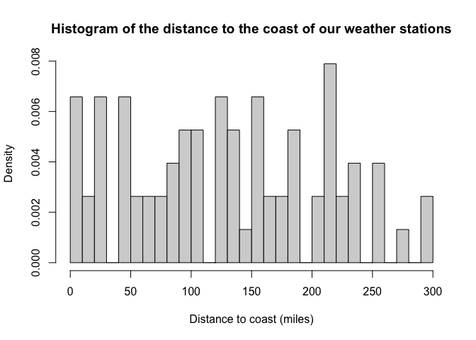
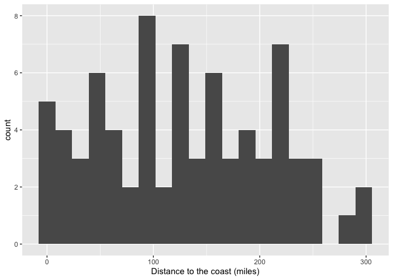
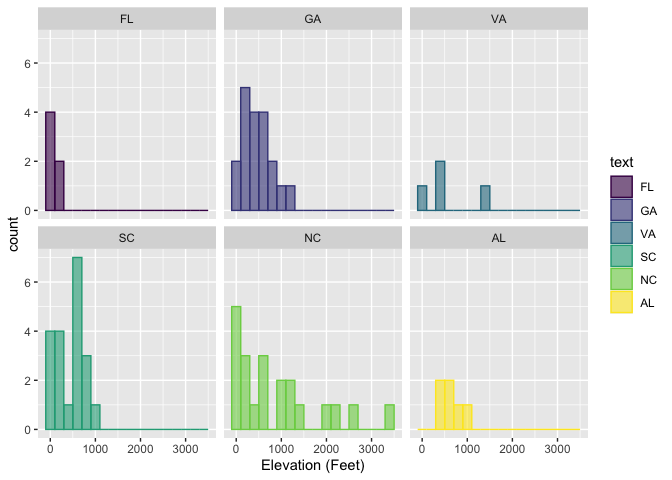

<style>
p.comment {
background-color: #DBDBDB;
padding: 10px;
border: 1px solid black;
margin-left: 0px;
border-radius: 5px;
font-style: normal;
}

h1.title {
  font-weight: bold;
  font-family: Arial;  
}

h2.title {
  font-family: Arial;  
}

</style>


<style type="text/css">
#TOC {
  font-size: 12px;
  font-family: Arial;
}
</style>

\


## Tutorial 10: Plotting data

This tutorial is all about manipulating spreadsheets/data.frames/tables.

 - [**Tutorial 10A: Histograms**](#Tut10a_hist)

## 10A. Histograms{#Tut10a_hist}

Sometimes it's nice to view a distribution using a histogram. Here we will use the frost data from Lab 2 as an example.

### Base R
 
The easiest way is simply to apply the `hist()` function to a specific column.  

The hist command is in "base R" e.g. just an inbuilt function. This code makes a basic histogram with 20 breaks of the data inside the frost data's Dist_to_Coast column.  


```r
hist(frost$Dist_to_Coast,br=20)
```

<!-- -->

We could turn this into a density plot and edit the breaks easily, but it still looks a little handmade


```r
hist(frost$Dist_to_Coast,
     br=30,
     freq=FALSE,
     xlab="Distance to coast (miles)",
     main="Histogram of the distance to the coast of our weather stations")
```

<!-- -->

There are loads more examples of things you can do to improve your histograms here: https://www.learnbyexample.org/r-histogram-base-graph/


### GGplot2

We can be slightly more professional doing the same thing using the ggplot package, but note the format is different.  Each line builds up another layer of the plot and we use + to connect them
(Tutorial here: https://www.r-graph-gallery.com/220-basic-ggplot2-histogram.html)


```r
ggplot(frost, aes(Dist_to_Coast)) + 
  geom_histogram(bins=20) +
    xlab("Distance to the coast (miles)")
```

<!-- -->
There are also many other options here: https://www.r-graph-gallery.com/histogram.html

We can also do more sophisticated things. This creates a histogram of elevation for each State in the dataset (tutorial here https://www.r-graph-gallery.com/histogram_several_group.html)


```r
p <- frost %>%
  mutate(text = fct_reorder(State, Elevation)) %>% 
     ggplot( aes(x=Elevation, color=text, fill=text)) + 
     geom_histogram(alpha=0.6, 
                    binwidth = 200) +  
     scale_fill_viridis(discrete=TRUE) +
     scale_color_viridis(discrete=TRUE) +
     xlab("Elevation (Feet)") +
     facet_wrap(~text)

p
```

<!-- -->


<br>
<br>


***

Website created and maintained by [Helen Greatrex](https://www.geog.psu.edu/directory/helen-greatrex). Website template by [Noli Brazil](https://nbrazil.faculty.ucdavis.edu/)
