<style>
p.comment {
background-color: #DBDBDB;
padding: 10px;
border: 1px solid black;
margin-left: 0px;
border-radius: 5px;
font-style: normal;
}

h1.title {
  font-weight: bold;
  font-family: Arial;  
}

h2.title {
  font-family: Arial;  
}

</style>


<style type="text/css">
#TOC {
  font-size: 12px;
  font-family: Arial;
}
</style>

\


Welcome to Tutorial 12 on point pattrn analysis.  I work through an example on farmers markets in Iowa.  I want to understand the pattern the points make e.g. are they clustered?  Is anything causing that clustering?


<br>
<br>


## Libraries needed

Some of these might be new that you need to install


```r
rm(list=ls())

library(spatstat)
library(stars)
library(maptools)

library(elevatr)
library(raster)
library(readxl)
library(sp)
library(spdep)
library(sf)
library(tidycensus)
library(tidyverse)
library(tmap)
library(units)
library(USAboundaries)
library(viridis)
```


<br>
<br>

## Reading in my data


<br>
<br>

### 1. Read in state borders

Here I'm using the USAboundaries package. If this code doesn't work, reinstall the package - it's recently been upgraded.


```r
 state.border     <- us_states(states = "iowa")
 state.border.utm <- st_transform(state.border,3744)
```


<br>
<br>


### 2. Read in the farmers market data

I used data from GIS_IOWA.

[This link contains the csv used in this tutorial of Iowan farmers markets](https://github.com/psu-spatial/Geog364.data-2020/raw/main/Point_Iowa_FarmersMarket/Farmers_Markets.xlsx). Feel free to download it into your project folders and I will also put it on Canvas.


```r
# Read in my data
mydata   <- readxl::read_excel("Farmers_Markets.xlsx")
mydata.sf <- st_as_sf(mydata,coords=c("X","Y"),crs=4326)
head(mydata)
```

```
## # A tibble: 6 × 13
##       X     Y   FID City    County  Latitude Location  Longitude Market_Name    
##   <dbl> <dbl> <dbl> <chr>   <chr>      <dbl> <chr>         <dbl> <chr>          
## 1 -95.1  43.4     1 Arnold… DICKIN…     43.4 Arnolds …     -95.1 Akron Farmers …
## 2 -91.2  40.8     2 West B… DES MO…     40.8 609 S. G…     -91.2 Ames - North G…
## 3 -95.7  41.0     3 Glenwo… MILLS       41.0 418 E Sh…     -95.7 Ames - North G…
## 4 -93.7  41.6     4 Des Mo… POLK        41.6 4944 Fra…     -93.7 Ames Main Stre…
## 5 -93.9  40.6     5 Lamoni  DECATUR     40.6 610 E Ma…     -93.9 Anamosa Farmer…
## 6 -91.4  40.5     6 Montro… LEE         40.5 203 N. 1…     -91.4 Anamosa Farmer…
## # … with 4 more variables: Open_Dates <chr>, Open_Hours <chr>, State <chr>,
## #   Weekday <chr>
```

<br>
<br>

#### Sanity check

I want to check my data makes sense.


```r
# Check it makes sense
tmap_mode("plot")
qtm(st_geometry(mydata.sf),dots.size=.2)+tm_grid()+
   tm_shape(state.border)+tm_borders()
```

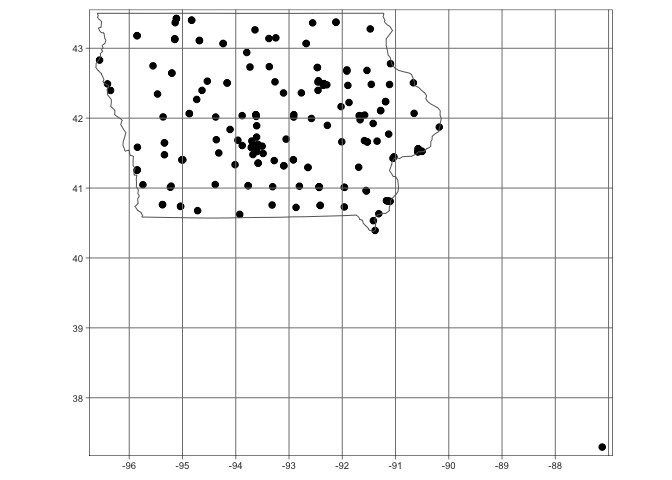<!-- -->


<br>


I clearly have a point that is not in Iowa. For the sake of this lab, I will remove it. I can see that my point is the only one with a longitude less than -90, so I will use that knowledge to remove it.  Now my data looks much better.


```r
mydata <- mydata[mydata$X <= -90,]

mydata.sf <- st_as_sf(mydata,coords=c("X","Y"),crs=4326)

# make a quick plot
tmap_mode("plot")
qtm(st_geometry(mydata.sf),dots.size=.3)+
   tm_grid()+
   tm_shape(state.border)+tm_borders()
```

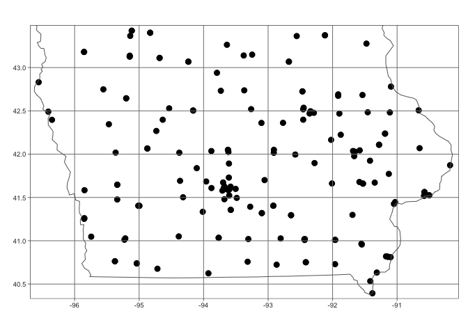<!-- -->

<br>

I am now happy and will transform my data to an appropriate UTM projection (THIS IS IMPORTANT!).  You can see that the units have now changed to metres. See [Tutorial 11A](https://psu-spatial.github.io/Geog364-2021/pg_Tut11_spatial101.html#Map_Projections) and [Tutorial 11B](https://psu-spatial.github.io/Geog364-2021/pg_Tut11_spatial101.html#Step_5_Assign_a_new_map_projection_) for more.


```r
mydata.sf.utm <- st_transform(mydata.sf,3744)
qtm(st_geometry(mydata.sf.utm),dots.size=.3)+
   tm_grid()+
   tm_shape(state.border.utm)+tm_borders()
```

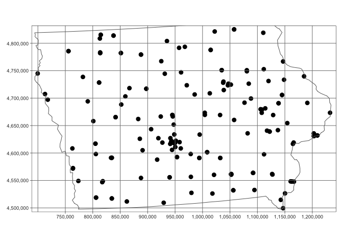<!-- -->

<br>
<br>

### Add in census data

<br>
<br>

#### Download census data.

Now I want to add in some other data that might help me understand why the points have the patterns they do.  I will first download census county level data:


```r
#-------------------------------------------------
# Download some data for Iowa using get_acs
#-------------------------------------------------
 ACS_county.sf <- get_acs(geography = "county", 
                         year = 2019,
                         variables = c(total_pop  = "B05012_001",  # total population
                                       med.income = "B19013_001"), # median income  
                         state = c("IA"),
                         survey = "acs5",geometry=TRUE,
                         output = "wide")

#-------------------------------------------------
#[1] Find the area of each county Convert to Km sq
#[2] Calculate population density
#[3]and the housing density
#-------------------------------------------------
 ACS_county.sf$area.m2  <- st_area(ACS_county.sf)
 ACS_county.sf$area.km2 <- as.numeric(set_units(ACS_county.sf$area.m2, "km^2"))
 ACS_county.sf <- mutate(ACS_county.sf, pop.density = total_popE/area.km2)

#-------------------------------------------------
# Change the map projection to UTM Iowa
#-------------------------------------------------
 ACS_county.sf.utm <- st_transform(ACS_county.sf,3744)
```

<br>
<br>

#### Adding log population density

Normally population densities are very skewed and nor Normally distributed.  


```r
tm_shape(ACS_county.sf.utm) +
     tm_polygons("pop.density",border.col = NULL,
                 title="Population Density",palette="viridis",
                 legend.hist = TRUE)+
   tm_shape(state.border.utm)+tm_borders()+
   tm_layout(legend.outside=TRUE,legend.outside.position  = "bottom",
             legend.hist.width = 1,
             legend.hist.height = 0.75,legend.stack = 'horizontal')
```

<!-- -->

<br>

You can see above that our data is very skewed and not very Normally distributed.  The fact the data is so skewed that it can cause issues when we try to do statistical analysis. So instead, we will transform the data by applying the log function


```r
ACS_county.sf.utm$pop.density.log <- log(ACS_county.sf.utm$pop.density)
```

<br>

This data is a lot more normal, but we need to remember that we are looking at log(population density) or transform back when making our conclusions


```r
tm_shape(ACS_county.sf.utm) +
     tm_polygons("pop.density.log",border.col = NULL,
                 title="Log Population Density",palette="viridis",
                 legend.hist = TRUE)+
   tm_shape(state.border.utm)+tm_borders()+
   tm_layout(legend.outside=TRUE,legend.outside.position  = "bottom",
             legend.hist.width = 1,
             legend.hist.height = 0.75,legend.stack = 'horizontal')
```

<!-- -->

<br>
<br>

#### Extracting census data for our points


```r
#-------------------------------------------------
# Excounty values of ACS at my point locations
#-------------------------------------------------
 mydata.sf.utm <- sf::st_join(mydata.sf.utm,ACS_county.sf.utm)
```

<br>

You should now see the new columns in your point data (click on mydata.sf.utm in the Environment tab)


```r
#-------------------------------------------------
# You should now see the new values in your data
#-------------------------------------------------
 head(mydata.sf.utm)
```

```
## Simple feature collection with 6 features and 21 fields
## Geometry type: POINT
## Dimension:     XY
## Bounding box:  xmin: 773751 ymin: 4509414 xmax: 1160501 ymax: 4808675
## Projected CRS: NAD83(HARN) / UTM zone 14N
## # A tibble: 6 × 22
##     FID City    County  Latitude Location  Longitude Market_Name     Open_Dates 
##   <dbl> <chr>   <chr>      <dbl> <chr>         <dbl> <chr>           <chr>      
## 1     1 Arnold… DICKIN…     43.4 Arnolds …     -95.1 Akron Farmers … 06/28/2018…
## 2     2 West B… DES MO…     40.8 609 S. G…     -91.2 Ames - North G… 06/16/2018…
## 3     3 Glenwo… MILLS       41.0 418 E Sh…     -95.7 Ames - North G… 05/16/2018…
## 4     4 Des Mo… POLK        41.6 4944 Fra…     -93.7 Ames Main Stre… 06/14/2018…
## 5     5 Lamoni  DECATUR     40.6 610 E Ma…     -93.9 Anamosa Farmer… 05/16/2018…
## 6     6 Montro… LEE         40.5 203 N. 1…     -91.4 Anamosa Farmer… 05/08/2018…
## # … with 14 more variables: Open_Hours <chr>, State <chr>, Weekday <chr>,
## #   geometry <POINT [m]>, GEOID <chr>, NAME <chr>, total_popE <dbl>,
## #   total_popM <dbl>, med.incomeE <dbl>, med.incomeM <dbl>, area.m2 [m^2],
## #   area.km2 <dbl>, pop.density <dbl>, pop.density.log <dbl>
```

<br>


```r
#-------------------------------------------------
# Make a plot to check it all worked
#-------------------------------------------------
 tmap_mode("plot")

 map1     <- tm_shape(ACS_county.sf.utm) +
                tm_polygons("med.incomeE",border.col = NULL,style="cont",
                            title="Median Income",palette="PuRd")+
                tm_shape(state.border.utm)+tm_borders()+
                tm_layout(legend.outside=TRUE,legend.outside.position  = "bottom")

 map2 <- qtm(mydata.sf.utm,dots.col="med.incomeE",
                   title="Median Income",dots.size=.1,dots.palette="PuRd")+
               tm_shape(state.border.utm)+tm_borders()+
               tm_layout(legend.outside = TRUE,legend.outside.position  = "bottom")

 map3     <- tm_shape(ACS_county.sf.utm) +
                tm_polygons("pop.density.log",border.col = NULL,style="cont",
                            title="Log Population Density",palette="YlGnBu")+
                tm_shape(state.border.utm)+tm_borders()+
                tm_layout(legend.outside=TRUE,legend.outside.position  = "bottom")

 map4 <- qtm(mydata.sf.utm,dots.col="pop.density.log",
                   title="Log Population Density",dots.size=.1,dots.palette="YlGnBu")+
               tm_shape(state.border.utm)+tm_borders()+
               tm_layout(legend.outside = TRUE,legend.outside.position  = "bottom")

 
 tmap_arrange(map1,map2,map3,map4, ncol=2)
```

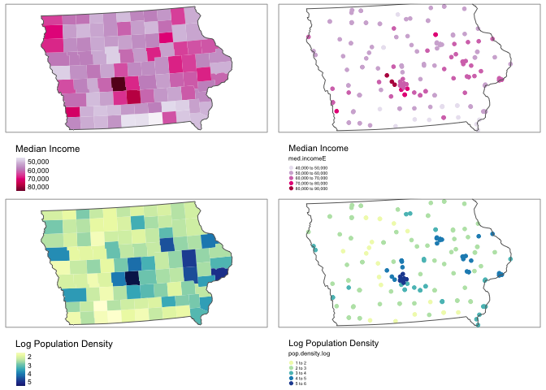<!-- -->

```r
 rm(map1);rm(map2); rm(map3);rm(map4)
```


<br>
<br>

### Add in elevation data

This isn't likely to impact farmers markets, but I want you to see how to do it for your lab.


```r
elevation.utm <- get_elev_raster(state.border.utm, z = 5,clip="locations")

# use the extract function to get elevation for our data.
mydata.sf.utm$Elevation <- raster::extract(elevation.utm,mydata.sf.utm)
```

<br>


```r
tmap_mode("plot")

map1     <- tm_shape(elevation.utm)+
                     tm_raster(title="Elevation",palette="Spectral")+
                tm_shape(mydata.sf.utm)+
                     tm_dots(size=.1)+
                tm_shape(state.border.utm)+tm_borders()+
                tm_layout(legend.outside = TRUE,legend.outside.position  = "bottom")


map2 <- qtm(mydata.sf.utm,dots.col="Elevation",
                 title="Height Above Sea Level (m)",
                   dots.size=.1,dots.palette="Spectral")+
        tm_shape(state.border.utm)+tm_borders()+
        tm_layout(legend.outside = TRUE,legend.outside.position  = "bottom")

tmap_arrange(map1,map2,ncol=2)
```

<!-- -->

```r
rm(map1); rm(map2)
```


<br>
<br>

## Making a ppp object

Our data is made up of points, so concepts like "rooks" or "queens" neighbours don't make much sense.  Instead we will use a family of analysis called **Point Pattern Analysis**.  There is a specific package in R called `spatstat` that does this, which reqires us to transform our data into a special `ppp`  (point pattern) format.

To do this, we first make a window for the state borders (or your study area), then make our data ppp. I suggest adding results=FALSE in your code chunk option.


```r
# make window
state.border.utm.window <- as(as_Spatial(state.border.utm), "owin")

# Convert our data and add the window
mydata.ppp        <- as.ppp(mydata.sf.utm)
Window(mydata.ppp) <- state.border.utm.window

# R will work in metres by default. Iowa is big. let's convert to km
mydata.ppp.km <- rescale(mydata.ppp, 1000, "km")
```

<br>


```r
# and check it worked by making a plot
 plot(elevation.utm)

 plot(mydata.ppp,use.marks = F,
      cex = 1, pch = 4,add=TRUE)
```

<!-- -->


<br>
<br>

## Looking at point density

<br>
<br>

### Global density

This is simply the number of points per unit area.  We don't even need the special ppp data to do this.  


```r
NumberPoints  <- nrow(mydata.sf.utm)
StudyArea     <- st_area(state.border.utm)
StudyArea.km2 <- as.numeric(set_units(StudyArea, "km^2"))

Density_Global <-  nrow(mydata.sf.utm) / StudyArea.km2 
Density_Global.3dp <- round(Density_Global,3)
```

<br>

As you can see, there are 174 over an area of 1.4635922\times 10^{5} square kilometers, leading to a global point density of  0.001 point per square kilometer.

This doesn't tell us much about the local patterns however, so let's look at a few measures of local density.


<br>
<br>

### Local density 1: Quadrat analysis

This technique requires that the study area be divided into sub-regions (aka quadrats). Then, the point density is computed for **each quadrat** by dividing the number of points in each quadrat by the quadrat’s area.

We can compute the quadrat count and intensity using spatstat’s `quadratcount()` and `intensity()` functions. 

The following code chunk divides Iowa into a grid of 3 rows and 6 columns then calculates the number of points falling in each quadrat.  We can then make a plot.


```r
QuadratCount.4.4 <- quadratcount(mydata.ppp.km, nx= 4, ny=4)

# Plot points
plot(mydata.ppp.km, pch=20, cols="grey80", main=NULL,use.marks = F)  
# Add quadrat grid
plot(QuadratCount.4.4, add=TRUE)  
```

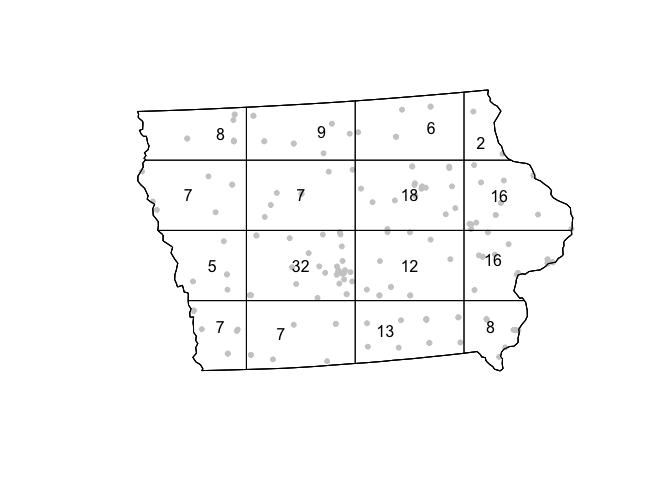<!-- -->

<br>

Here we can see that some quadrats contain 22 farmers markets, whilst others contain only 2.  


```r
# Compute the density for each quadrat and make a mapped version
Density_Quadrat.4.4 <- intensity(QuadratCount.4.4)
Density_Quadrat_to.plot.4.4 <- intensity(QuadratCount.4.4, image=TRUE)


# Plot the density
plot(Density_Quadrat_to.plot.4.4, main=NULL, las=1,col=viridis(20))  
# Add points
plot(mydata.ppp.km, pch=20, cex=0.6, 
     col=rgb(0,0,0,.5), use.marks = F, 
     add=TRUE)  
```

<!-- -->

<br>

We are doing the same thing here as with global density, just dividing by the area in each box, so we can see that even around Des Moines, there are only 0.0025 markets per square kilometer.

Of course, this very much depends on grid size..... (hint, what fallacy is happening?)


```r
QuadratCount.24.8 <- quadratcount(mydata.ppp.km, nx= 8, ny=24)
Density_Quadrat.24.8 <- intensity(QuadratCount.24.8)
Density_Quadrat_to.plot.24.8 <- intensity(QuadratCount.24.8, image=TRUE)

# Plot the density
plot(Density_Quadrat_to.plot.24.8, main=NULL, las=1,col=viridis(20))   
# Add points
plot(mydata.ppp.km, pch=20, cex=0.6, 
     col=rgb(0,0,0,.5), use.marks = F, 
     add=TRUE)  
```

<!-- -->

<br>
<br>

#### Assessing if this pattern is unusual

For these measures to be close to valid, it is typically good to keep the numbers IN EACH QUADRAT to be at least 30. Otherwise you have an even higher likelihood of seeing patterns just by random chance.

One way is to calculate the Variance Mean Ratio, which gives an assessment about whether the data is clustered, uniform or random (AKA levels of spatial autocorrelation):


```r
Data.variance <- var(as.vector(QuadratCount.4.4)) 
Data.mean <- mean(as.vector(QuadratCount.4.4)) 
 
Data.VMR <- Data.variance / Data.mean
print(Data.VMR)
```

```
## [1] 4.76262
```

<br>

From this, we can assess if the data is more, or less clustered than points created using an Independent Random Process using a hypothesis test, but again this is very sensitive to your quadrat boundaries.


```r
quadrat.test(QuadratCount.4.4)
```

```
## 
## 	Chi-squared test of CSR using quadrat counts
## 
## data:  
## X2 = 47.426, df = 15, p-value = 6.291e-05
## alternative hypothesis: two.sided
## 
## Quadrats: 16 tiles (irregular windows)
```

<br>

One way of dealing with this is to split your study region into areas that have meaning, rather than into squares. For example here, https://mgimond.github.io/Spatial/chp11_0.html#global-density, the data was split by population density vectors.

<br>
<br>

### Local density 2: Kernel smoothing

If we don't care about the maths, we might just want to look at a heat map of the points.  R will let us do this easily. 

The kernel density approach is an extension of the quadrat method.  Rather than simply splitting our area into set windows, kernel density analysis takes a moving window approach.   This moving window is defined by a "kernel" - whose size is the size of the neighbourhood we wish to average over (or the size of the quadrat). 


If we use a very small neighbourhood, then the data will look very spotty, but it allows us to find clusters of points very close together (AKA in this case, cities - Des Moines, Iowa City, Cedar Rapids and Waterloo all stand out).


```r
# Using a 10km bandwidth
Density_kernel_10 <- density(mydata.ppp.km, sigma=10) 

plot(Density_kernel_10, main=NULL, las=1)
contour(Density_kernel_10, add=TRUE)
```

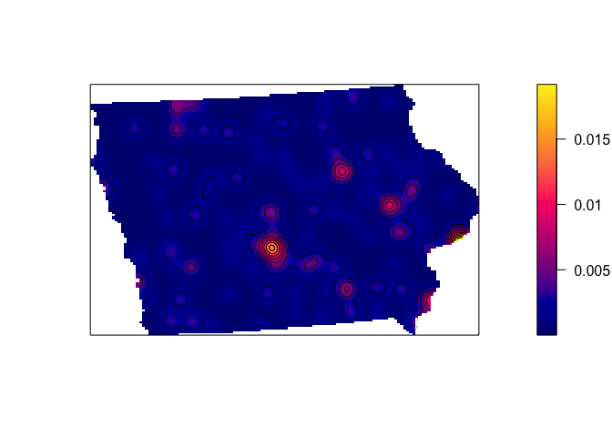<!-- -->

<br>

If we use a larger neighbourhood, then the data will look very smoothed out allowing us to see broad trends (more markets, AKA more people, in the South East).


```r
# Using a 50km bandwidth
Density_kernel_50 <- density(mydata.ppp.km, sigma=50) 

plot(Density_kernel_50, main=NULL, las=1)
contour(Density_kernel_50, add=TRUE)
```

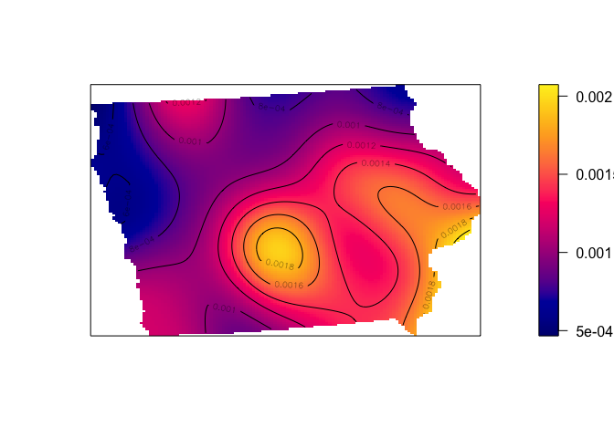<!-- -->

<br>
<br>

### Relationships between point density and marks

Here, I have a guess that the density of farmers markets is being driven by the population density.  I can examine this using the `rhohat` function, which plots the density of a point against one of its marks.

Rhohat is very fussy.  First for it to work, I need to convert the original ACS data fields into a special type of raster


```r
#-----------------------------------------------------------
# Convert to sp, then create a fake raster
# and use these to convert our log population density and 
# median income to the special format
#-----------------------------------------------------------
ACS_county.sp.utm <- as(ACS_county.sf.utm,"Spatial")
r <- raster(ncol=500, nrow=500,extent(ACS_county.sp.utm))

Pop.density.log.img <- as.im.RasterLayer(rasterize(ACS_county.sp.utm,r ,"pop.density.log","mean"))
Pop.density.img      <- as.im.RasterLayer(rasterize(ACS_county.sp.utm,r ,"pop.density","mean"))

#-----------------------------------------------------------
# Elevation is already a raster, so we can just convert
# to the special format
#-----------------------------------------------------------
elev.img <- as.im.RasterLayer(elevation.utm)
```

<br>

First, let's look at the relationship with elevation


```r
density.elevation <-  rhohat(unmark(mydata.ppp),elev.img)
plot(density.elevation)
```

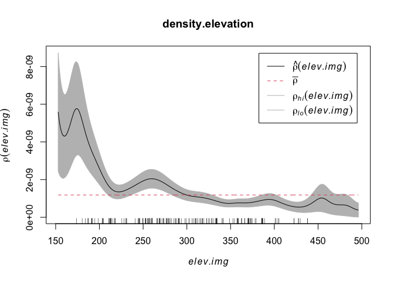<!-- -->

<br>

The x-axis on this plot is elevation, e.g. low lying points are to the left and mountainous (for Iowa) points on the right.  The y-axis is density.  We can see that there are a higher density of points at low elevations.  This checks out from my eyeballing of the situation.  


```r
# and check it worked by making a plot
 plot(elevation.utm,col=terrain.colors(20))

 plot(mydata.ppp,use.marks = F,
      cex = 1, pch = 4,add=TRUE)
```

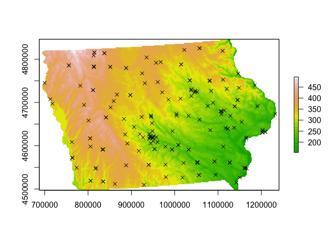<!-- -->

<br>


I'm guessing however that there might be a lurking variable rather than people checking out their terrian maps before deciding whether to open the next market... My guess is that it is linked to population density.  So let's do the same thing with population density:


```r
plot( rhohat(unmark(mydata.ppp),Pop.density.log.img))
```

<!-- -->

<br>

Wow - super spikey. Essentially we can see that the overwhelming majority of points are in cities or towns, where there are a lot of people.  AKA.


```r
plot(Pop.density.log.img,col=terrain.colors(20))

 plot(mydata.ppp,use.marks = F,
      cex = 1, pch = 4,add=TRUE)
```

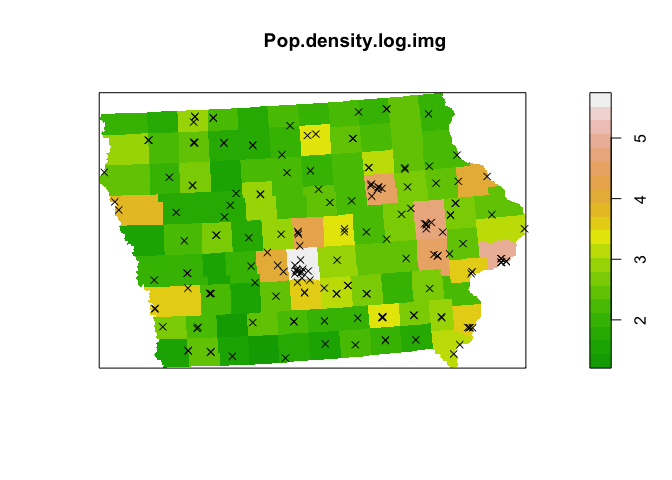<!-- -->

<br>

This result is much harder to see in the raw population density, because it's very hard for us to see the huge number of very rural counties which also have very few farmers markets (although we can see the population densities of different towns!)


```r
plot( rhohat(unmark(mydata.ppp),Pop.density.img))
```

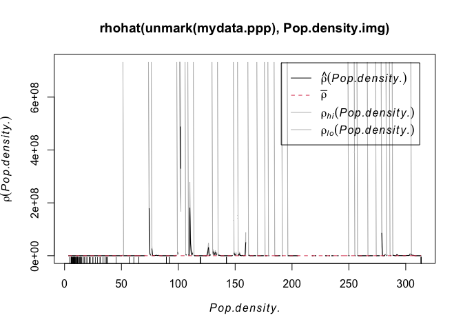<!-- -->

<br>


```r
plot(Pop.density.img,col=terrain.colors(20))
plot(mydata.ppp,use.marks = F,cex = 1, pch = 4,add=TRUE)
```

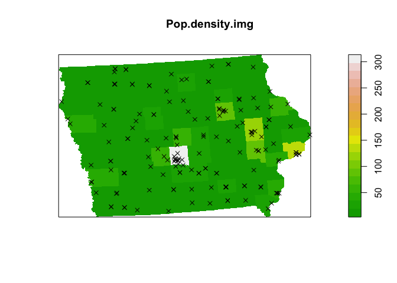<!-- -->

<br>

We can go much further than this at this point, as the relationship between the predicted Starbucks store point pattern intensity and the population density distribution can be modeled following a Poisson point process model (just like our regression class, but using a special model to take into account the fact we are modelling intensity of points).  If you are interested, see

 - https://mgimond.github.io/Spatial/point-pattern-analysis-in-r.html#kernel-density-adjusted-for-covariate-1
 - http://spatstat.org/Melb2018/solutions/solution03.html (density)
 - http://spatstat.org/Melb2018/solutions/solution04.html (poisson)
 - http://spatstat.org/Melb2018/solutions/solution05.html (marked)


<br>
<br>


### Regression analysis on points.

As you have seen above, predicting the *density* of points is rather hard (although the code is easy).  If that will be an important part of your project, let me know as we can do this together. 

However, predicting some mark/attribute of our points is very standard and the same as in Lab 7.

For example (as my farmers market data doesn't have any good attributes), here is whether median income can be predicted by population density at my farmers market locations.  A better one if I had the data would be the sales in each market.


```r
plot(mydata.sf.utm$med.incomeE~mydata.sf.utm$pop.density.log,
     xlab="Log population Density at market locations",ylab="Median Income")

mymodel <- lm(med.incomeE~pop.density.log,mydata.sf.utm)
abline(mymodel)
```

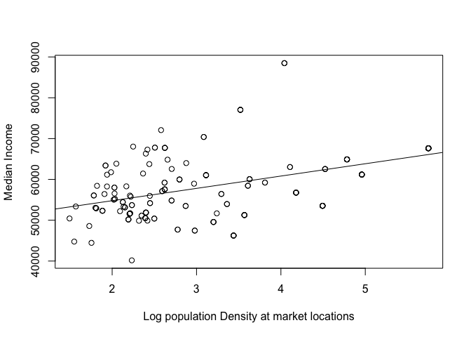<!-- -->

```r
mydata.sf.utm$model.residuals <- mymodel$residuals

tm_shape(ACS_county.sf.utm)+tm_polygons(alpha=0,border.col = "grey")+
   qtm(mydata.sf.utm,dots.col="model.residuals",dots.size=.2,dots.palette="RdYlBu")+
   tm_layout(legend.outside=TRUE)+
   tm_shape(state.border.utm)+tm_borders()
```

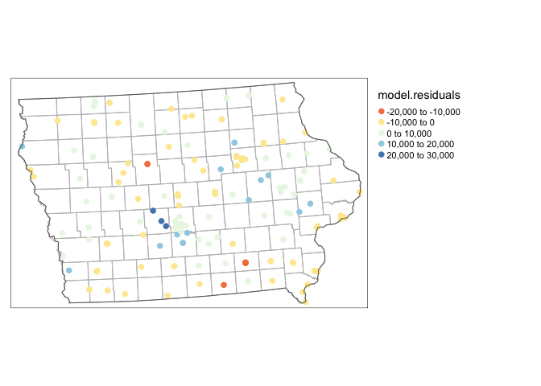<!-- -->

<br>

The only difference is that we can't use rooks or queens to calculate Moran's I. Instead we will need to use a different measure like distance circles. 


```r
# make an sp version
mydata.sp.utm <- as(mydata.sf.utm,"Spatial")

# calculate the distance in kilometers
weights.matrix.all <- as.matrix(dist(coordinates(mydata.sp.utm)))/1000

# decide on a rule. i said that all markets under 30km were neighbours
weights.matrix.dist30 <- weights.matrix.all
weights.matrix.dist30[weights.matrix.all < 30] <- 1
weights.matrix.dist30[weights.matrix.all >= 30] <- 0
```

<br>


```r
# calculate the weights matrix
myweights <- mat2listw(weights.matrix.dist30)

# plot matrix
plot(myweights,coordinates(mydata.sp.utm))
plot(st_geometry(state.border.utm),add=TRUE)
```

<!-- -->

```r
# plot/test Moran's I
moran.plot(mydata.sp.utm$med.incomeE,myweights)
```

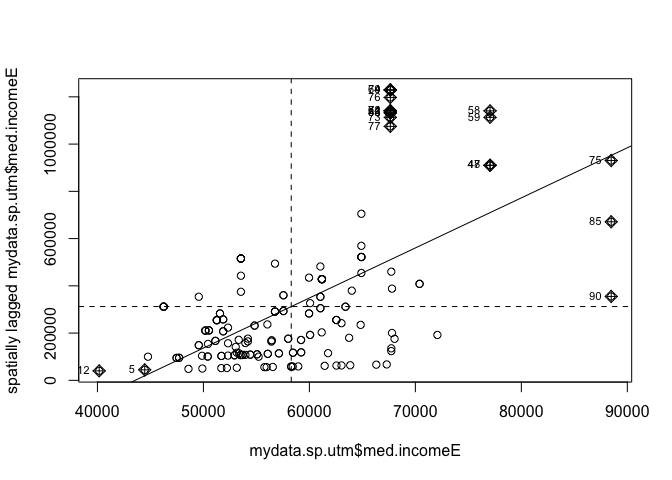<!-- -->

```r
moran.test(mydata.sp.utm$med.incomeE,myweights)
```

```
## 
## 	Moran I test under randomisation
## 
## data:  mydata.sp.utm$med.incomeE  
## weights: myweights    
## 
## Moran I statistic standard deviate = 23.567, p-value < 2.2e-16
## alternative hypothesis: greater
## sample estimates:
## Moran I statistic       Expectation          Variance 
##       1.073166059      -0.005780347       0.002096075
```

<br>

As expected, our residuals are autocorrelated!

<br>
<br>

## Distance based point pattern analysis

*Density based statistics* give us an estimate of **first order autocorrelation** e.g. is there a big underlying thing driving the density of points.

*Distance based statistics* give an estimate of **second order autocorrelation** e.g. does one point change the probability of seeing more points (AKA one infectious person is likely to lead to more in the surrounding area).

Here are a few of the most common/useful:

<br>
<br>

### Nearest neighbour

The easiest distance based measure is the distance between each point and its nearest neighbour. 


```r
#For each point, nndist calculates the distance to the nearest point 

mydata.Nearest_neighbor <- nndist(mydata.ppp.km)

hist(mydata.Nearest_neighbor, main=NULL, las=1,
     xlab=list("Distance between each point and its Nearest Neighbour (km)",cex=.8))
```

<!-- -->

<br>

Here we can see that most farmers markets are within 5km of the nearest market, but there are some up to 50km away.

A global statistic we could use would simply be the average nearest neighbour or the R Ratio (see class)


```r
#-----------------------------------
# Mean nearest neighbour
#------------------------------------
MeanNN <-  round(mean(mydata.Nearest_neighbor),2)
MeanNN

R.Ratio <-  clarkevans(mydata.ppp.km)
R.Ratio
```

<br>

AKA, there is on average 10km between farmers markets in Iowa. The output of the R.Ratio likely gives you two values, naive and cdf. CDF is simply a mathematical way of taking into account edge effects. 

We will discuss the R ratio in lectures.

<br>
<br>

### L-Function

A better local way of looking at our data is the L function:


```r
#-----------------------------------------
# Calculate the L function and its uncertainty envelope
#-----------------------------------------
L.DATA <- Lest(mydata.ppp.km)

#-----------------------------------------
# Rather than simply saying something is “clustered” or “uniform” 
# depending on how it subjectively looks to the
# IRP line, we can instead use Monte Carlo simulation to assess our data 
# against many L patterns that were caused by an Independent Random Pattern. 
# Here we generate 500 CSRs and calculate the L function for each one
#-----------------------------------------
  L_DATA_envelope <- envelope(mydata.ppp.km, Lest, correction = "Ripley", 
                              verbose = F,
                              nsim=200, nrank=1, 
                              savepatterns = TRUE, savefuns = TRUE)
```

<br>


```r
#-----------------------------------------
# Plot the raw L-function data for different edge effects.  Ignore any warnings
#-----------------------------------------
  plot(L.DATA, . - r ~ r,
       ylim=c(0-(max(L.DATA$iso-L.DATA$r)),max(L.DATA-L.DATA$r)))
  # Add the uncertainty envelope.
  plot(L_DATA_envelope, . - r ~ r,add=TRUE)
```

<!-- -->

<br>

Again we will discuss the interpretation in class, but essentially:

 - The x-axis is the distance between any two points.
 - The y-axis is the level of clustering or dispersion, above zero means there are more points than expected, below zero means less point than expected

The grey cloud is the result of a Monte Carlo process, where we created this plot for simulations created using an IRP.  For example, here are three patterns that went into the grey IRP cloud, compared to our actual pattern in red.


```r
par(mfrow=c(2,2))
plot(unmark(attributes(L_DATA_envelope)$simpatterns[[1]]),cols=rgb(0,0,0,.5),
     main=NULL,pch=16,cex=.5)
plot(unmark(attributes(L_DATA_envelope)$simpatterns[[2]]),  cols=rgb(0,0,0,.5),
     main=NULL,pch=16,cex=.5)
plot(unmark(attributes(L_DATA_envelope)$simpatterns[[3]]), cols=rgb(0,0,0,.5),    
     main=NULL,pch=16,cex=.5)
plot(unmark(mydata.ppp.km),cols="purple",  main=NULL,pch=16,cex=.5)
```

<!-- -->

<br>

And we can compare their L functions with the one we actually observe:


```r
Lest1 <- Lest(attributes(L_DATA_envelope)$simpatterns[[1]])
Lest2 <- Lest(attributes(L_DATA_envelope)$simpatterns[[2]])
Lest3 <- Lest(attributes(L_DATA_envelope)$simpatterns[[3]])
Lest4 <- Lest(attributes(L_DATA_envelope)$simpatterns[[4]])
```

<br>


```r
plot(L.DATA, border - r ~ r,col="purple",
     ylim=c(0-(max(L.DATA$iso-L.DATA$r)),max(L.DATA-L.DATA$r)))
plot(L.DATA, theo - r ~ r,add=TRUE)
plot(Lest1,border - r ~ r,col="grey",add=TRUE)
plot(Lest3,border - r ~ r,col="grey",add=TRUE)
plot(Lest3,border - r ~ r,col="grey",add=TRUE)
plot(Lest4,border - r ~ r,col="grey",add=TRUE)
```

<!-- -->

<br>

Now looking back at the actual plot, instead of 3 IRP patterns there are 200.


```r
 plot(L.DATA, . - r ~ r,
       ylim=c(0-(max(L.DATA$iso-L.DATA$r)),max(L.DATA-L.DATA$r)))
  # Add the uncertainty envelope.
  plot(L_DATA_envelope, . - r ~ r,add=TRUE)
```

<!-- -->

<br>

From this I can see that farmers markets are more clustered than average up to approximately 60km.  Beyond that, there is no difference between the pattern and one we might see by random chance or an IRP.


<br>
<br>

## Carrying on further

As before, there is a lot further we can take this. If you are interested, see:

 - https://mgimond.github.io/Spatial/point-pattern-analysis-in-r.html#pair-correlation-function-g
 
 - http://spatstat.org/Melb2018/solutions/solution06.html (K and L functions)
 - https://mgimond.github.io/Spatial/point-pattern-analysis-in-r.html


