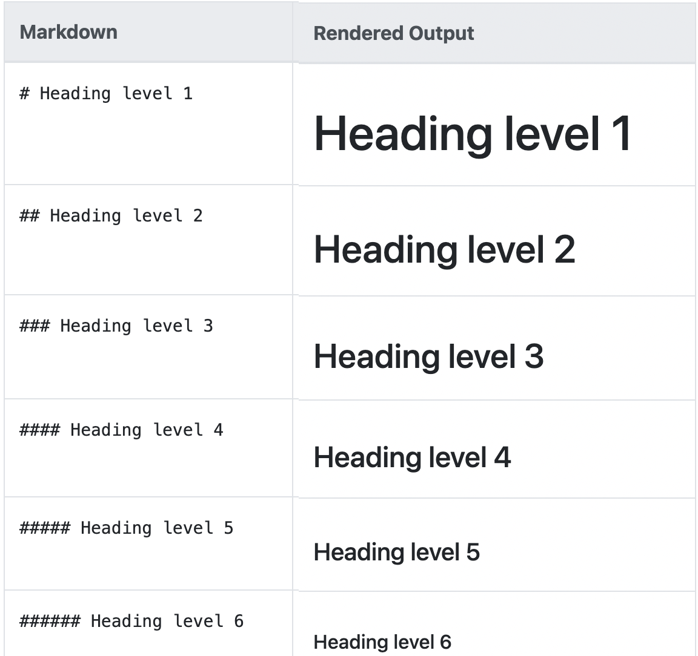
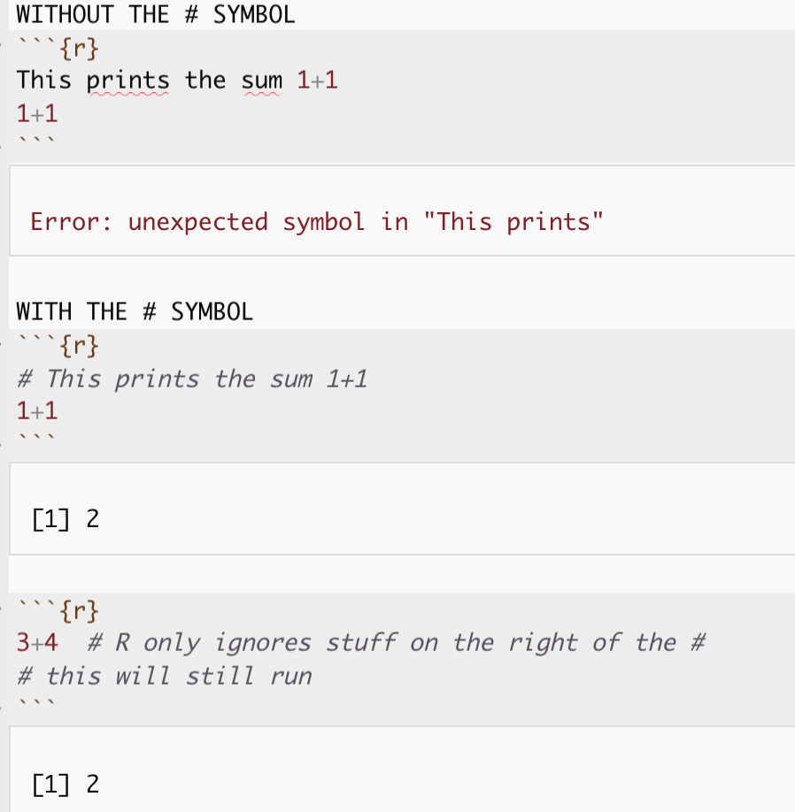

<style>
p.comment {
background-color: #DBDBDB;
padding: 10px;
border: 1px solid black;
margin-left: 0px;
border-radius: 5px;
font-style: normal;
}

h1.title {
  font-weight: bold;
  font-family: Arial;  
}

h2.title {
  font-family: Arial;  
}

</style>


<style type="text/css">
#TOC {
  font-size: 12px;
  font-family: Arial;
}
</style>

\


## Tutorial 15: Coding concepts

This tutorial is all about manipulating spreadsheets/data.frames/tables.


 - [**Tutorial 15A: Code comments**](#Tut15a_comments)

<br>

<div style="margin-bottom:25px;">
</div>  
## Tutorial 15A: Comments {#Tut15a_comments}

### What are they?

Comments are little notes that you can put *inside* your code chunks to remind yourself what you are doing.   

<br>

### How to make one

The confusing part about comments is that they also use the # (hash) symbol: 

<br>

##### **The # symbol in your TEXT AREA means "heading"** {-}


Look at your script.  You should now know that in the TEXT AREA, the # symbol means "new heading". *(See [Tutorial 4](https://psu-spatial.github.io/Geog364-2021/pg_Tut4_markdown.html#Tutorial_4D:_Knitting) for a reminder)* 



<br>

<div style="margin-bottom:25px;">
</div>  
##### **The # symbol inside a CODE CHUNK means "comment/ignore this line"** {-}

However, INSIDE A CODE CHUNK, the # symbol tells R to "ignore" anything after it. This means you can add in notes to yourself about the commands you are running.  You need a new # for every line you want to be a commenrt


For example, without the #, R would give an error.  But as soon as it's there, R will ignore the text:



<br> 

I like to put my comments in little boxes to make things easier to read:


```r
#--------------------------------------
# Calculate the sum 1+1 & assign to x
#--------------------------------------
x <- 1+1
```

<br>

<div style="margin-bottom:25px;">
</div>
#### Why comment?

Comments are GREAT.  You can put notes to yourself in there, explain the programming bit (allowing your text to focus more on analysis), or leave "how-to" guides.  

<br>
<br>


***

Website created and maintained by [Helen Greatrex](https://www.geog.psu.edu/directory/helen-greatrex). Website template by [Noli Brazil](https://nbrazil.faculty.ucdavis.edu/)
