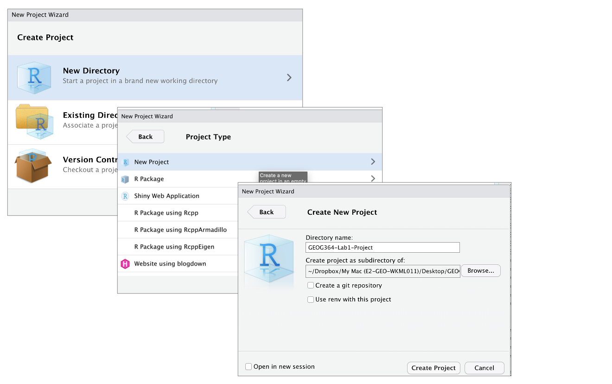

<style>
p.comment {
background-color: #DBDBDB;
padding: 10px;
border: 1px solid black;
margin-left: 0px;
border-radius: 5px;
font-style: normal;
}

h1.title {
  font-weight: bold;
  font-family: Arial;  
}

h2.title {
  font-family: Arial;  
}

</style>


<style type="text/css">
#TOC {
  font-size: 12px;
  font-family: Arial;
}
</style>

\
```{r setup, include=FALSE}
knitr::opts_chunk$set(echo = TRUE, warning=FALSE, message = FALSE)
```

## Tutorial 2 Contents

This tutorial is all about the basics you need to run your labs. We covered most of this in Lab 1.

 - [**Tutorial 2A: Change settings**](#Tut2A_Settings)

<br>

 - [**Tutorial 2B: Install packages/libraries**](#Tut2B_Packages)
      a. [What are packages?](#Tut2Ba_whatarethey)
      b. [How to download](#Tut2Bb_howtodownload)
      c. [Bulk download for our course](#Tut2Bc_fulllist)
      d. [Checking it has worked](#Tut2Bd_loading)

<br>

 - [**Tutorial 2C. Create an R-Project**](#Tut2C_Project)
      a. [What are R-projects?](#Tut2Ca_RProject)
      b. [Creating a R-project](#Tut2Cb_CreateRproj)
      c. [How do I know it has worked?](#Tut2Cc_signsRproj)
      b. [Returning to your work](#Tut2Cd_return)

<br>
<br>

## Tutorial 2A: Change settings {#Tut2A_Settings}

Everything in this tutorial is a one-off to get R and R-studio set up.

**First, in an easy to access place on your computer, make a folder called GEOG-364.  This is where all your labs and projects are going to live.**

### Opening R-Studio

**Now everything is installed, open R-studio** (NOT R!).  If you are using R-Studio cloud, you should in your workspace.  Make a new R-Project and call it GEOG364_Lab1_PROJECT (or whatever lab you are working on)

```{r, tut2afig1, echo=FALSE,out.width="80%",fig.align='center'}
knitr::include_graphics('pg_Tut2_startup_fig1.png')
```
<br>

You will be greeted by three panels:

 - The interactive R console (entire left)
 - Environment/History (tabbed in upper right)
 - Files/Plots/Packages/Help/Viewer (tabbed in lower right)

```{r, tut2afig2, echo=FALSE}
knitr::include_graphics('pg_Tut2_startup_fig2.png')
```

<br>

If you wish to learn more about what these windows do, have a look at this resource, from the Pirates Guide to R: https://bookdown.org/ndphillips/YaRrr/the-four-rstudio-windows.html.  
<p class="comment">If you have used R before, you might see that there are variables and plots etc already loaded**.  It is always good to clear these before you start a new analysis.  To do this, click the little broom symbol in your environment tab</p>

<br>

##### Menus at the top of the screen

Look at the VERY TOP OF THE SCREEN.  

  - In the`View` menu, there is a `/Panes/Pane Layout` menu item, where you can move the on-screen quadrants around.  I tend to like the console to be top left and scripts to be top right, with the plots and environment on the bottom - but this is  personal choice. 

 -  There should also be a menu called `Help`<br>Useful for R-studio version and Markdown cheatsheets.

<br>

##### Change a few settings

R-studio wants to be helpful and will try to re-load exactly where you were in a project when you log back in.  This can get confusing, so we are going to turn this off.

 - **ON A MAC:** Click on the R-studio menu button on the top left of the screen, then click Preferences. 

 - **ON A PC/R-Studio Cloud:** Click on Tools-> Global Options -> Preferences

Now:

 - UNCLICK "Restore most recently opened project at startup"
 - Set "Save workspace to .RData on" exit to Never
 - You can also click the appearances tab to change how the screen looks.

<br>

<div style="margin-bottom:25px;">
</div>


<br>

## Tutorial 2B: Install packages {#Tut2B_Packages}

### What are packages? {#Tut2Ba_whatarethey}

As described in Tutorial 3, we programme in R by asking a series of commands.  R is open source meaning anyone can create a command. Over the last 20 years, millions of commands have been written. 

These tend to be grouped together into collections called `Packages` or `Libraries` (two names for the same thing).  They are similar to apps on your phone.  For example, one package contains the complete works of Shakespeare; allows interactive website design; another allows advanced Bayesian statistics.  

There is a package for literally everything and there are now about 20,000 packages available. You can see the full list here: https://cran.r-project.org/web/packages/available_packages_by_name.html

This is far too many to store on your computer, so most live on the internet in an online (free) "Package Store". You can download the ones you want, ready to load later.  

So to access the commands in a package we need these two steps:

1. ONCE ONLY: Download the package from the internet
2. EVERY TIME: Load the packages you want

<p class="comment">**A close analogy is your phone:**  There are millions of apps available from banking, to 50 different calendar apps.  You don't have every app in the world installed on your phone - and you don't have every app you *do* download running at the same time.  Instead you download the apps that you think you will need (occasionally downloading a new one on the fly) - and when you need to use an app, you click on it to open.</p>

<br>

### How to download/install packages {#Tut2Bb_howtodownload}

Look at the Packages tab next to the plot one, you can see which packages/libraries are already pre-installed onto your computer.

If the package you want isn't listed:

 - Click the INSTALL button in the Packages tab, then start typing the package name and it will show up (check the include dependencies box). 

OR

 - In the console, run the `install.packages()` command on the package you want to download **with quotes around the package name** e.g. 
 
   ```{r,eval=FALSE}
   install.packages("bardr")
   ```
   
 OR

 - R will sometime tell you that you are missing a package (sometimes a little yellow ribbon - say yes to install!)  

*Note, if you run this command mulitple times, or the packages is already loaded, R-Studio might want to restart and sometimes gets confused. If it keeps asking, close R-studio, reopen and try again.  If it really doesn't want to work, open R itself and run in the console there.*

**Try installing the `bardr` package onto your computer**

<br>

### Bulk download for our course {#Tut2Bc_fulllist}

Now we are going to download/install (hopefully) all the packages you need for these labs.  

**Copy this command into the R CONSOLE and press enter to run**.

```{r, warnings=FALSE, message=FALSE, eval=FALSE}
install.packages(c("tidyverse","abind","car","corrplot","dismo",
                  "elevatr","fields","ggpubr","ggstatsplot",
                  "hrbrthemes", "ISLR","knitr", "lattice","matlab",
                  "maps","mapdata","maptools","mapview","matlab",
                  "ncdf4","olsrr", "plotly","raster",
                  "rasterVis","RColorBrewer","readxl","remotes",
                  "rgdal","rgeos","rmapshaper","rmdformats",
                  "rnaturalearth","sf",  "skimr", "sp", 
                  "spdep","spatialEco","spatialreg","spatstat",
                  "Stat2Data","tidycensus","tigris","tmap",
                  "units","USAboundaries", "usmap","viridis",
                  "yarrr"))
```

When you press enter, a load of text should stream down your console.  Just let it run until the console is back to the > symbol and you can type.

Sometimes this will give you an error and not run,  This can be because copy/pasting from the internet messes up the quote marks around each package name.  In that case, you can easily manually download them by clicking the INSTALL button at the top of the packages tab, then choosing each name in turn.

We also want to download some larger spatial datasets stored separately to the main packages.

**Copy and run these lines in the console**.

```{r}
remotes::install_github("ropensci/USAboundariesData")
remotes::install_github("ropenscilabs/rnaturalearthhires")
```

<br>

### Checking it has worked {#Tut2Bd_loading}

When all the download text is streaming down your screen, it's hard to know what is an error and what is just "informative".  The easiest way to check is to load all the libraries at once and see whether there are errors.

(e.g this is the same as clicking every app on your phone to see if they all installed OK.)

Copy the code below into the console TWICE.  E.g. copy it once, wait until it stops running (it will show a load of "welcome" text again that makes it hard to see errors).  The SECOND time you copy it into the console, it should just run without error or messages.

```{r, warnings=FALSE, message=FALSE, eval=FALSE}
library("tidyverse")
library("abind")
library("car")
library("corrplot")
library("dismo")
library("elevatr")
library("fields")
library("ggpubr")
library("ggstatsplot")
library("hrbrthemes")
library("ISLR")
library("knitr")
library("lattice")
library("matlab")
library("maps")
library("mapdata")
library("maptools")
library("mapview")
library("matlab")
library("ncdf4")
library("olsrr")
library("plotly")
library("raster")
library("rasterVis")
library("RColorBrewer")
library("readxl")
library("remotes")
library("rgdal") 
library("rgeos") 
library("rmapshaper") 
library("rmdformats") 
library("rnaturalearth")
library("sf") 
library("skimr") 
library("sp") 
library("spdep")
library("spatialEco")
library("spatialreg")
library("spatstat") 
library("Stat2Data") 
library("tidycensus") 
library("tigris") 
library("tmap") 
library("units") 
library("USAboundaries") 
library("usmap") 
library("viridis") 
library("yarrr")
```

** IF YOU HAVE ERRORS TALK TO A TEACHER **

<br>

## Tutorial 2C: Create an R-Project {#Tut2C_Project}


<p class="comment">**You need to make a new project before you start EVERY lab!**</p>


### What are R-projects? {#Tut2Ba_RProject}

An R-project is a special folder that will store everything to do with each lab in one place on your computer.  This is incredibly useful - it means that if you switch from R-Cloud, to the lab computers, to your laptop, all you have to do is to move the folder and everything will just work. Learn more here. 

[](https://www.linkedin.com/learning/learning-the-r-tidyverse/why-should-you-use-projects-in-rstudio?u=76811570 "Why use R Projects")

<br>

### Creating a R-project {#Tut2Bb_CreateRproj}

This step is needed for EVERY lab.

##### **On R-Studio Cloud:**

Note, if you are running R-Studio Cloud, you just need to click "Create Project" and name it.

<br>

##### **On your desktop**

```{r, tut2afig1b, echo=FALSE,out.width="60%",fig.align='center'}
knitr::include_graphics('pg_Tut2_startup_fig1.png')
```

1. If it's not already open, open **R-Studio** 
2. Go to the file menu at the very top and click `New Project` 
3. Select `New Directory`, then `New Project`
4. Name your project *GEOG364-Lab1-PROJECT* 
5. Under "create project as a subdirectory of", hit the browse button and go inside your GEOG-364 main folder (you just need to be in the folder, you don't need to have selected anything). Press open
6. Finally, press `Create Project`

```{r, tut2bfig4, echo=FALSE}

```


<br>

### How do I know it has worked? {#Tut2Bc_signsRproj}

R will change slightly.  If you look at the top of the screen in the title bar, it should say *GEOG364-Lab1-Project R Studio*.  

The Files tab should have gone to your project folder.  Essentially, R-Studio is now "looking" inside your Lab 1 folder, making it easier to find your data and output your results.  

```{r, tut2afig5, echo=FALSE}
knitr::include_graphics('pg_Tut2_startup_fig5.png')
```

<br>

Essentially, R-Studio is now "looking" inside your Lab 1 folder, making it easier to find your data and output your results.  

If you want one, final check, try typing this into the console (INCLUDING THE EMPTY PARANTHESES/BRACKETS), press enter and see if it prints out the location of Lab 1 on your computer. If not, talk to an instructor.

```{r, eval=FALSE}
getwd()
```

<br>

### Returning to your lab project

OK, let's imagine that you get halfway through your lab and your computer dies.  How do you get back to your Lab work?  Try this now.  Close down R-Studio.

To reopen a lab:

1. **DO NOT RE-OPEN R-STUDIO!**
2. Instead navigate on your computer to your *GEOG-364/GEOG364-Lab1-Project* folder.   
3. Double click on the GEOG364-Lab1-Project.RProj file.

This will reopen R for that specific lab, so you can continue where you left off.

It means you can also open several versions of R studio for multiple projects, which can be very useful in keeping labs separate and staying sane.


```{r, tut2afig6, echo=FALSE}
knitr::include_graphics('pg_Tut2_startup_fig6.png')
```


<br>
<br>


***

Website created and maintained by [Helen Greatrex](https://www.geog.psu.edu/directory/helen-greatrex). Website template by [Noli Brazil](https://nbrazil.faculty.ucdavis.edu/)