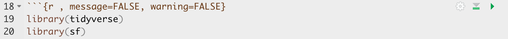
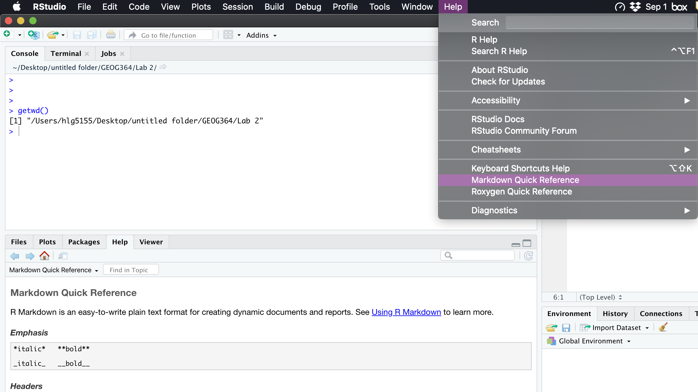
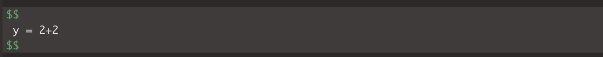
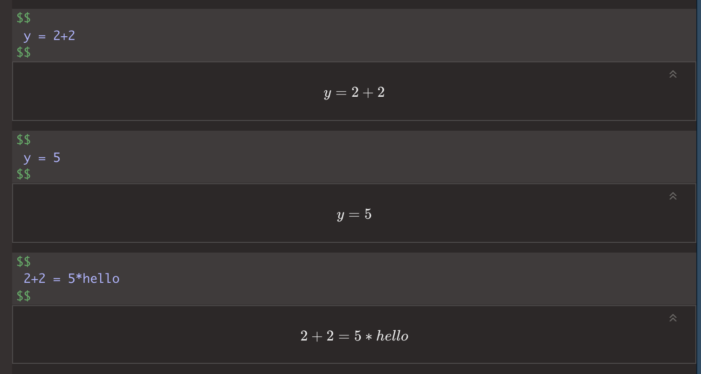
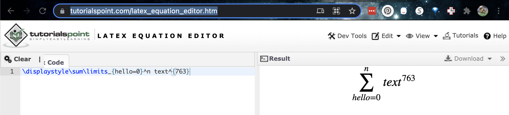
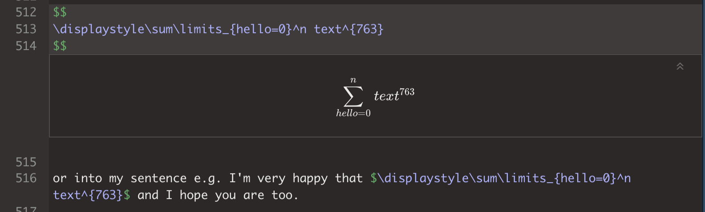

<style>
p.comment {
background-color: #DBDBDB;
padding: 10px;
border: 1px solid black;
margin-left: 0px;
border-radius: 5px;
font-style: normal;
}

h1.title {
  font-weight: bold;
  font-family: Arial;  
}

h2.title {
  font-family: Arial;  
}

</style>


<style type="text/css">
#TOC {
  font-size: 12px;
  font-family: Arial;
}
</style>

\
```{r setup, include=FALSE}
knitr::opts_chunk$set(echo = TRUE, warning=FALSE, message = FALSE)
```

## Tutorial 4: Markdown

This tutorial is all about getting used to the basic commands you can run in R.


 - [**Tutorial 4A: What is markdown**](#Tut4a_WhatIsIt)
 - [**Tutorial 4B: Creating a markdown document**](#Tut4B_MarkCreate)
 - [**Tutorial 4C: Markdown Basics**](#Tut4C_Basics)
 - [**Tutorial 4D: Knitting**](#Tut4Da_knit)
 - [**Tutorial 4E: YAML code**](#Tut4E_YAML)
 - [**Tutorial 4F: Formatting code chunks**](#Tut4F_chunk)
      a. [Code chunk basics](#Tut4Fa_basics)
      b. [Editing code chunk options](#Tut4Fb_options)
 - [**Tutorial 4G: Formatting text**](#Tut4G_format)
 - [**Tutorial 4H: Adding photos**](#Tut4H_photo)
 - [**Tutorial 4I: Adding equations**](#Tut4I_Eqn)
 - [**Tutorial 4J: Adding references**](#Tut4J_ref)
 - [**Tutorial 4K: Adding tables**](#Tut4K_Table)
 - [**Tutorial 4L: Different make formats**](#Tut4L_Make)
 
 
 
 
<br>

<div style="margin-bottom:25px;">
</div>  
## Tutorial 4A: What is markdown {#Tut4a_WhatIsIt}

Read more here: https://rmarkdown.rstudio.com

As I said at the start, the console is like a phone call to the computer, you're talking but you're not keeping records of what you say (you can always press the up key to see previous commands but that's about it).  When you close R, everything you have done will be lost. 

What we need instead is a way to save the commands for future use - we can do this using scripts.  There are several types of document, or script that you can create and save in R-Studio.

 - A basic script (the filetype is .r).  This is simply just a blank notepad where you can save code commands.  When you "run" the commands in the script, R simply copy/pastes the commands over to the console.
 
 - An R-Notebook or R-Markdown document (the filetype is .Rmd).  These are much more interesting - and are how I wrote this lab book.  This is what we will be using in our labs.
 
In a markdown document: imagine a normal Microsoft Word document, but halfway through you can press a button and a mini R console appears.  You type your code inside the mini console, it runs and puts the plots/output just below - then you leave the console and continue writing about the results.  Essentially you never have to take another screenshot of results and move it to your output...
 
Rmd files are also flexible.  You can turn them into reports, websites, blogs, presentations or applications with a few short commands.
 
In this course we are going to focus on the R-Markdown format and you are going to submit your labs as websites/html files along with your code.  
 
<br>

<div style="margin-bottom:25px;">
</div>  
## Tutorial 4B: Creating a markdown document {#Tut4B_MarkCreate}

Time to make your own. Go to the File menu on the top left, then click New File - R-Markdown. If this is your first time ever, it might ask to download some packages to be able to do this. Say yes.

Eventually a window will open up:

```{r, tut4fig1, echo=FALSE,fig.align='center',out.width="50%"}
knitr::include_graphics('pg_Tut4_markdown_fig1.png')
```

It will ask you to name and save your file.  Give it a relevant name.  A new file should appear on your screen.  At the top of that window (by the knit button, there is a save button. Save it as something relevant INSIDE YOUR PROJECT FOLDER!


```{r, tut4fig2, echo=FALSE,fig.align='center',out.width="80%"}
knitr::include_graphics('pg_Tut4_markdown_fig2.png')
```

The new file on your screen is your first markdown script. Essentially, we have some space for text, some space for code, and a space at the top of the file where we can add information about themes/styles etc.  
 
<br>

<div style="margin-bottom:25px;">
</div>  
## Tutorial 4C: Markdown Basics {#Tut4C_Basics}

Your file contains some friendly text to explain what is going on, which I have annotated here. Read the file and see what it says.

```{r, tut4fig3, echo=FALSE,fig.align='center',out.width="80%"}
knitr::include_graphics('pg_Tut4_markdown_fig3.png')
```

<br>

<div style="margin-bottom:25px;">
</div>  
## Tutorial 4D: Knitting {#Tut4Da_knit}

The file on your screen isn't the finished article.  To see how it will look as a final version, we need to "knit" it.

Go to the top of the .Rmd file, find the `knit` button. Press it (you might have to first save your script if you haven't already, then press it again)

You should see that the Markdown tab "builds" your document and you get an output as a website. The html should also be saved into your project folder.  

For example, from my other class, here is a file with markdown and knitted output.

```{r, tut4fig4, echo=FALSE,fig.align='center',out.width="80%"}
knitr::include_graphics('pg_Tut4_markdown_fig4.png')
```


<br>

<div style="margin-bottom:25px;">
</div>  
## Tutorial 4E: YAML Code {#Tut4E_YAML}

Your YAML code is the code at the top of your file in between the --- lines. (see \@ref(fig:tut4fig4))).  Let's zoom in

```{r, tut4fig5, echo=FALSE,fig.align='center',out.width="80%"}
knitr::include_graphics('pg_Tut4_markdown_fig5.png')
```

<br>

Your YAML code controls how your final output looks and which type of output it becomes. For example, this could be a website (as for ours), a pdf, a presentation or app.. The basic version is very simple with a title, an author, a self entered date and that we just want a website.

Let's add in more options. 

YAML code is annnoying to edit, because here, *spaces really do matter*. Everything has to be perfect or it won't knit.  

**Select everything in my code chunk here and replace your YAML with this (remember the --- on line 1 and at the end).**

```{r,eval=FALSE}

---
title: "GEOG-364 - Lab 2"
author: "hlg5155"
date: "`r Sys.Date()`"
output:
  html_document:
    toc: true
    toc_float: yes
    number_sections: yes
    theme: lumen
    df_print: paged
---
      
      
```

Replace the author ID with your user name, change the tite if appropriate, then click knit and see if it works.

The elements we just added are:

 - The title
 - The author (note,use your ID not your name)
 - Automatically created today's date
 - A floating table of contents
 - Numbered sections (this won't appear until you start typing section headings)
 - The document is now in the lumen theme. 
 
<br> 
 
### Troubleshooting

 - Note, if you copy/paste this and it doesn't work, sometimes the quote marks copy weirdly from the internet - try deleting and retyping the quotes.  

- If it still doesn't work.. this might be because a space is missing (especially if you typed it out). 
   +  Editing  YAML code can be a pain.  It is very case and space sensitive.<br>For example, the spaces at the start of some lines are important and are created using the TAB KEY, not the space bar.  There is one TAB key before html_notebook (which is now on a new line). There are two TAB KEYS before toc, toc_float, number_sections and theme.

*Don't continue until you can make and view your html when you press knit. If it doesn't work, ask for help before moving on*

<br>

### Changing the theme

You don't need to choose the lumen theme.  There are many other ways you can edit your markdown documents here: https://www.datadreaming.org/post/r-markdown-theme-gallery/

To edit, replace the word lumen with the name of your chosen theme (THIS IS CASE SENSITIVE). Now click knit and see if it works.Some themes are buggy. Try a different one if it doesn't work.  

The themes in "Even More Themes" on the website, requre you to install/load some new packages, so they need some extra work. You're welcome to try if you have one you fell in love with!
 
<nr> 
 
### Adding other YAML options
 
There are many more details about different options on these websites:

 - https://bookdown.org/yihui/rmarkdown/html-document.html
 - https://rstudio.com/wp-content/uploads/2015/03/rmarkdown-reference.pdf

If you want to get really fancy, there is an interesting package to help you design YAML code here: https://education.rstudio.com/blog/2019/10/tools-for-teaching-yaml-with-ymlthis/

<br>

<div style="margin-bottom:25px;">
</div>  
## Tutorial 4F: Formatting code chunks {#Tut4F_chunk}

### Code chunk basics {#Tut4Fa_basics}

The grey areas on your screen are called "code chunks" (see \@ref(fig:tut4fig6)).  Think of them as mini consoles.  You put code inside, run them, then the result ends up directly below the chunk in 

**To run the code in a code chunk, Click on the little green triangle arrow at the top-right of the code chunk itself** this will run all of the commands in that code chunk and put the results underneath**.  

If you have the sample fileTry running the 3 code chunks in your document (the top one will do nothing).

Code chunks can be altered.  For example, on line 19, delete `summary(cars)` and type `1+1`.  Now press the green arrow and the new answer should appear directly under your code chunk.  

Click in the white space at the end of the script, press enter a few times (around line 33) and press the green insert button (top right near the Run button).  Insert a new R code chunk.  Inside, type `1+2` and run it. 
 
 
### Editing code chunk options {#Tut4Eb_options}
 
At the top of every code chunk, you should see the line "```{r}".  

Inside the curly brackets, you can add options to the code chunk for when you press knit.  For example you can justify figures, change background colors, or decide if the code even displays/runs at all. 

You can also add options in that first code chunk we have been ignoring. These will apply the options throughout the entire script.  The `echo` option means "show the code as well as the output.  The `include` option means show any sign of this code chunk at all in the final option (e.g. it runs it in the background).

```{r, Lab2fig6, echo=FALSE}
knitr::include_graphics('pg_Tut4_markdown_fig6.png')
```
<br>

#### Remove all the "welcome" text below the code chunk that loads the libraries when you press knit. 

One useful option is to remove all the "friendly text" when you load libraries and press knit. The two options we need to turn to FALSE are `message` and `warning`.

We could edit the specific code chunk like this

```{r, Lab2fig7, echo=FALSE}

```
<br>

But..  let's edit the global option itself. Edit the code chunk ~line 8 to look like this:

```{r, Lab2fig8, echo=FALSE}
knitr::include_graphics('pg_Tut4_markdown_fig8.png')
```

<br>

Now the loading library text will still appear in your code the first time you run that code chunk, but it should disappear when you press knit.

Press knit and check it works!
 
*Don't continue until this works. If it doesn't work, ask for help before moving on*
 
<br>

#### Other code chunk options

There are loads here along with a nice tutorial: https://rmarkdown.rstudio.com/lesson-3.html

<br>

### Inline code {#Tut4Ec_inline}

Follow these tutorial to see how to add inline code. e.g. answers to commands INSIDE your text

 - https://bookdown.org/yihui/rmarkdown-cookbook/r-code.html
 - https://www.njtierney.com/post/2019/07/10/jq-verbatim-inline-r/
 - https://rmarkdown.rstudio.com/lesson-4.html

 

<div style="margin-bottom:25px;">
</div>  
## Tutorial 4G: Formatting text {#Tut4G_format}

The text part of your document is anywhere outside your YAML code or a code chunk (see \@ref(fig:tut4fig6)).  

You can treat this like a slightly weird Word document, allowing you to write a report around your findings. Anywhere in the "text area" (AKA in the white space), click and press enter a few times.  Write some text, press knit and your changes should have been incorporated.

### **Paragraphs and white space - READ THIS:**

R is very sensitive to blank white lines. Put them everywhere. Put a blank line between paragraphs, before/after headings, before lists, before/after code chunks…. If your formatting isn’t working well, chances are there isn’t a blank line before or after it.

<br> 

### **Markdown visual editor**

Write Markdown in the RStudio visual editor

If you are not familiar with Markdown yet, or do not prefer writing Markdown code, RStudio v1.4 has included an experimental visual editor for Markdown documents, which feels similar to traditional WYSIWYG editors like Word, as shown in Figure 3.1. You can find the full documentation at https://rstudio.github.io/visual-markdown-editing/


### **Getting formatting help:**

There are many ways you can format the text in your markdown document, from adding headings, to bold/itallic to complex html text formats.

I will add in a few ideas here, but there are better guides out there!

 - I really like this reference: https://www.markdownguide.org/basic-syntax/
 - Alternatively, go to the help menu AT THE TOP OF YOUR ENTIRE SCREEN.  Scroll down and you will see "Markdown Quick reference". That will open a quick reference guide on your screen.
 
```{r, tut4fig9, echo=FALSE,fig.align='center',out.width="50%"}

``` 
 

<br> 

### **Basic text formats** 

There are many ways you can format the text in your markdown document, from adding headings, to bold/italic to complex html text formats.

Rather than click a button to turn something bold like in Word, you have to add special characters to your text to change the formatting. For example try putting * on each side of some text you want to make italic. 

The text formatting won't show in the text itself,  you will only see the formats when you press knit.

br> 

#### **Bold and italic:**

Putting stars or _ around your text will make it bold or italic (or both). To understand how, take a look at the cheatsheets.   Interestingly (and annoyingly), there is no simple way to underline text. ]

<br> 

#### **Headings**

You can use the # symbol to make a heading

*Outside* a code chunk, the # symbol makes a heading, AS LONG AS YOU HAVE A WHITE LINE ABOVE AND BELOW AND A SPACE AFTER THE #.  Have a look at Figure \@ref(fig:tut4fig4) for an example.  

You can have nested headings e.g. `# HeadingName` makes a main heading, `## SubHeadingName` makes a subheading, `### SubSubHeadingName` makes a sub-sub-heading

Including headings this way allows automatic section numbering and will allow the table of contents to automatically be created.  In the script itself the headings won't show up - you will only see them when you press knit.

Now let's make your first heading.  

 - Press enter a few times so you have a blank line above and below.
 - Now make a new heading by typing  `# my new heading`  THE SPACE AFTER THE # IS IMPORTANT.

Below that leave some white space and write some more text. 

<br>

## Tutorial 4H: Adding photos {#Tut4H_photo}

There are many ways to do this, with a FANTASTIC tutorial here if you get stuck:

http://zevross.com/blog/2017/06/19/tips-and-tricks-for-working-with-images-and-figures-in-r-markdown-documents/

<br>

**Step 1:** 

Go find your picture. If it's on the internet the easiest way is to right click on it and press "save as", then save the jpeg or png directly into your project folder with an easy filename.

<br>

**Step 2:** 

Place your picture/photo into your project folder (e.g. your Lab 3 project folder). 

<br>

**Step 3:** 

Make a new code chunk.<br> REMEMER TO ADD BLANK LINES ABOVE AND BELOW THE CODE CHUNK.


<br>

**Step 4** 

Inside the code chunk, use the `knitr::include_graphics()` command from the knitr package. 


```{r, Tut4fig10, echo=FALSE}
knitr::include_graphics('pg_Tut4_markdown_fig10.png')
```

You'll see I also added some code chunk options:

 - echo=FALSE : don't show the code
 - fig.align - 'center' : Centre align the photo when you press knit
 - out.width - '60%' : Make your photo smaller or larger on the page
 - fig.cap - "your caption" : Add a caption (IN QUOTES). I used * to make mine italic.

If you run the code chunk by pressing the green arrow, you will see the picture, but not things like the caption. 

Now press knit and you should see the picture, caption and options, but not the code (if echo=FALSE is included)

<br>

**Example**

For example, here's an example on chipmunks. The `chipmunk.webp` file is inside my project folder. (note, the file type doesn't matter but you have to type it)

Here's how it looks in my .Rmd file.

```{r, Tut4fig11, echo=FALSE}
knitr::include_graphics('pg_Tut4_markdown_fig11.png')
```

and in the actual report:

```{r, echo=FALSE, fig.align='center' , out.width="70%" , fig.cap="*Chipmunks are cool, image from: https://mymodernmet.com/chris-mcveigh-chipmunk-adventures*"}
knitr::include_graphics("chipmunk.webp")
```

**For more options see the tutorial: http://zevross.com/blog/2017/06/19/tips-and-tricks-for-working-with-images-and-figures-in-r-markdown-documents/ **


<br>

<div style="margin-bottom:25px;">
</div> 
## Tutorial 4I: Adding equations {#Tut4I_Eqn}

**Great tutorial here: https://rmd4sci.njtierney.com/math Highly recomemended for details** 
<br>

### Stand alone equations

We can add professional equations into your reports.  We do this by making an "equation chunk".  Instead of the code-symbols , we use `$$` where each contains a single equation. For example

```{r, Tut4fig12, echo=FALSE}

```

will make

$$
 y = 2+2
$$

Note the fancy version of the equation will definitely appear when you press knit and normally preview in your editing window.   Yours might look fancier than mine when you press knit, my fonts aren't working right.


Note, this isn't real code!  It's fancy text. So you can lie and it doesn't auto complete.  e.g.

```{r, Tut4fig13, echo=FALSE}

```


$$
 y = 2+2
$$
$$
 y = 5
$$
$$
 2+2 = 5*hello
$$

<br>
<br>

### Inline equations


You can also add equations into your text using inline-equations. These are referenced by surrounding your equation with dollar signs: $.  

This text (NORMAL TEXT NOT IN A CODE CHUNK)

```{r, Tut4fig14, echo=FALSE}

```

Generates:

So this text would have an equation here $E = mc^2$

<br>
<br>

### Making complex equations

There are special symbols for all the greek/latin words, for making fractions, etc etc.  The easiest way by far to create them, is to use an online equation generator where you can create the equation you want, then it will tell you the code


There are loads out there.  One favourite:

 - http://atomurl.net/math/


For example

```{r, Tut4fig15, echo=FALSE}

```

Then I copy the code into my text


This will show as:

```{r, Tut4fig16, echo=FALSE}

```

NOTE FOR ME ON THIS WEBSITE THIS IS BROKEN AND SHOWS THE COMMAND, FOR YOU IT SHOULD WORK.

$$
\frac{\sum_{_i}^nx}{n}
$$

or into my sentence e.g. I'm very happy that $\frac{\sum_{_i}^nx}{n}$ and I hope you are too.

### Its broken

Sometimes R doesn't understand the code when it presses knit. I'm working on it. Let me know. As you can see my special website knit hates equations.


### Adding in R online code output

What if we want our equations to autocomplete?  Well, we can combine this with our inline code. So instead of typing numbers we type code for it to calculate 

e.g.  Imagine this code chunk with echo =FALSE so you can't see it.

```{r}
mydata <- c(1,4,2,252,2,5)
```


Then in your text, the sum of my data is.  

$$
\overline{x} = `r sum(mydata)`
$$


Or more complex.. This will look weird in the code, but should work when you press knit.  As you can see, for me it does not.


$$
\frac{\sum_{_i}^nx}{n} = `{r mean(mydata)}`
$$


<br>

<div style="margin-bottom:25px;">
</div>
## Tutorial 4J: Adding references {#Tut4J_ref}

To be added

<br>


<div style="margin-bottom:25px;">
</div>   
## Tutorial 4K: Adding tables {#Tut4K_Table}

To be added
 
<br>

<div style="margin-bottom:25px;">
</div>   
## Tutorial 4L: Different make formats {#Tut4L_Make}

To be added

<br>
<br>

***


Website created and maintained by [Helen Greatrex](https://www.geog.psu.edu/directory/helen-greatrex). Website template by [Noli Brazil](https://nbrazil.faculty.ucdavis.edu/)