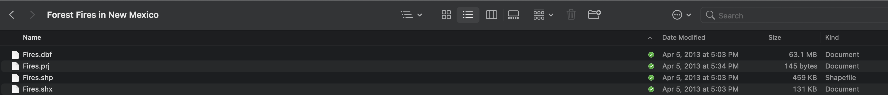
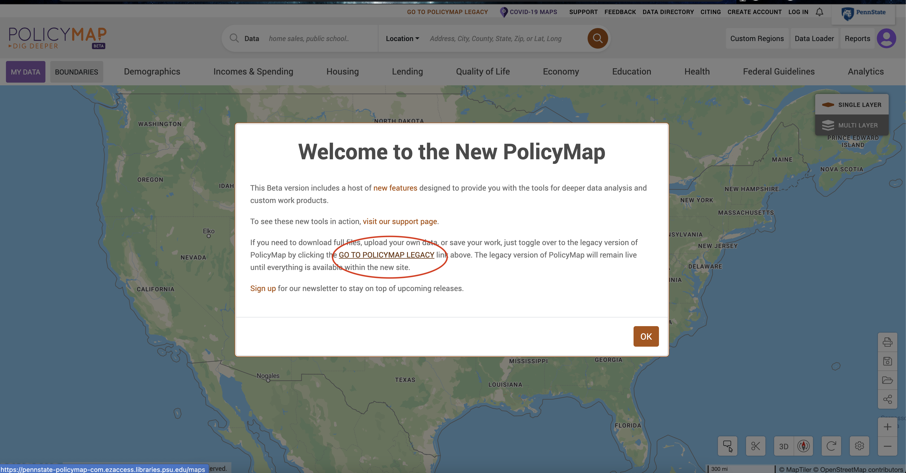
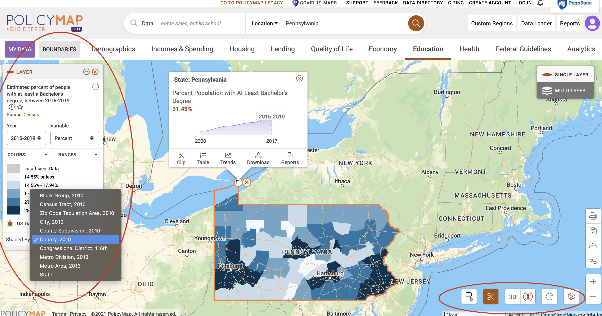
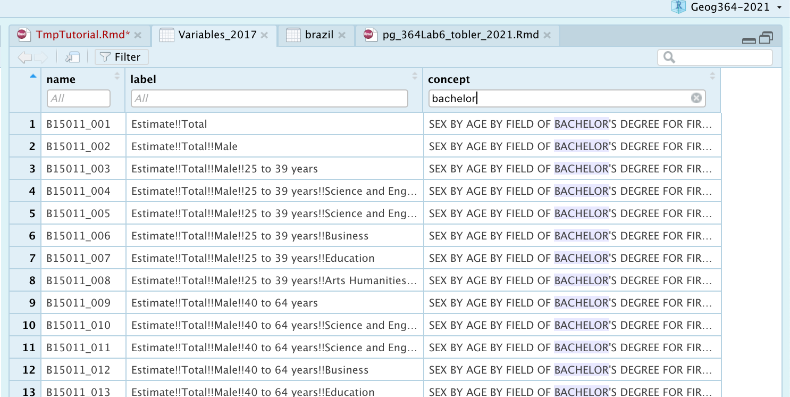
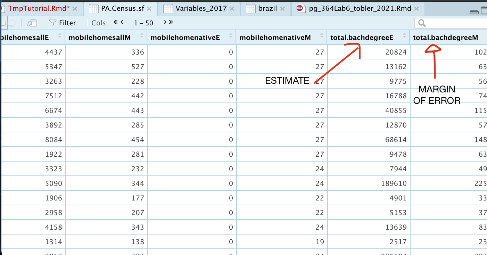

<style>
p.comment {
background-color: #DBDBDB;
padding: 10px;
border: 1px solid black;
margin-left: 0px;
border-radius: 5px;
font-style: normal;
}

h1.title {
  font-weight: bold;
  font-family: Arial;  
}

h2.title {
  font-family: Arial;  
}

</style>


<style type="text/css">
#TOC {
  font-size: 12px;
  font-family: Arial;
}
</style>

\
```{r setup, include=FALSE}
knitr::opts_chunk$set(echo = TRUE, warning=FALSE, message = FALSE)

# invisible data read
library(tidyverse)
library(sp)
library(sf)
library(readxl)
library(skimr)
library(tmap)
library(USAboundaries)
library(viridis)
library(rnaturalearth)
library(kableExtra)
library(spdep)
library(raster)
library(tidycensus)
library(VIM)


frost   <- readxl::read_excel("pg_364Data_1frostday.xlsx")
newyork <- readxl::read_excel("pg_364Data_1frostday.xlsx")
firefly <- readxl::read_excel("pg_364Data_3Firefly.xlsx")
ozone   <- read.csv("pg_364Data_4Ozone.csv")
```


## Tutorial 6: Input/Output

This tutorial is all about reading in and saving files

 - [**Tutorial 6A: Reading in Excel Files**](#Tut6a_Excel)
 
 <br>
 
 - [**Tutorial 6B: Reading in csv Files**](#Tut6b_csv)
 
 <br>
 
 - [**Tutorial 6C: Reading in "Shape Files"**](#Tutc_shape)
 
 <br>
 
 - [**Tutorial 6D: Reading in raster/field data: geoTifs**](#Tutd_tif)
 
 <br>
 
 - [**Tutorial 6E:Reading in US Census Data**](#Tute_census)
      a. [Finding data online: Policy Map](#Tut6Ea_policymap)
      b. [Loading Census data in R](#Tut6Eb_InR)
      c. [Working with the data](#Tut6Ec_Work)

<br>
<br>

 
## Tutorial 6A: Reading in Excel Files {#Tut6a_Excel}

R can easily read in Microsoft Excel spreadsheets using the `readxl` package:

<br>

### Basic approach

1. **Make sure the readxl package is loaded.**<br>E.g. is `library(readxl)` in your library code chunk?<br>Have you run the code chunk?

<br>

2. **Place your excel file in your project folder**.<br>E.g. for Lab 2, place *frostdays.xlsx* into your Lab 2 project folder.  

<br>

3. **Make a new code chunk and add the read_excel() command e.g.**<br>
   ```{r,eval=FALSE}
   frost <- read_excel("frostdays.xlsx")
   ```
   Here the command is `read_excel()`, you are applying this to "frostdays.xlsx" (e.g. reading in that file), then assigning the result to a variable called frost. Because you are using your project, R knows to look inside your project folder to find the file.

<br>

If this works, there should be no errors and nothing prints on the screen when you run the code chunk.  

In the environment tab, frost should have appeared with a description as a table with 76 rows (observations/obs), and 7 columns (variables).  In R, this type of table/spreadsheet is called a `data.frame`.


### Example {-}

For example, for our frostdata.xlsx data in Lab 2:

```{r}
# Read in the frost.xlsx file in your projexct folder and assign it to a variable called frost
frost    <- read_excel("frostdata.xlsx")

# Check the column names, or click on its name in the Environment quadrant
names(frost)

# frost is a standard table, to make a spatial version and save it to a variable called frost.sf
frost.sf <- st_as_sf(frost, coords=c("Longitude","Latitude"),crs=4326)

# and plot the SF spatial version
tmap_mode("view") 
qtm(frost.sf,dots.col="Elevation")
```


<br>

### Troubleshooting

**It says it can't find the file:**
 - Are you running the right project? e.g. does it say Lab 2 at the top of the screen?
 - Did you put the file into your Lab 2 folder?
 - Did you spell it right and include the full .xslx extension?
 - Did you use quote marks?
 
**It says read_excel doesn't exist**
 - Did you install the readxl package?
 - Did you load the readxl package? Go click the code chunk with the library command again!
 - Did you spell the command right? (case sensitive)
 - Did you use () afterwards so R understands that it's a command?

<br>

### Using the wizard.

Sometimes you just can't get it working.  In those cases, try the import wizard.

1. Go to the file menu at the very top of the screen. Click import dataset, then From Excel. Use the wizard to find your file and get it looking correct. It will show you the code you need in the code preview

<br>

2.  Because we want to include this file in the markdown, rather than pressing OK, copy the code preview text and put it in your code chunk.


<br>

<br>


## Tutorial 6B: Reading in csv Files {#Tut6b_csv}

These are comma separated text files, you can read them into microsoft excel.

<br>

### Basic approach

1. You don't need any special package to read in a csv file 

<br>

2. Make sure there is the `library(sf)` and `library(tmap)` in your library code chunk at the top of the script to plot  

<br>

3. Place the csv file into your project folder 

<br>

4. Use the `read_csv()` command to read it into R. 

<br>

5. Make sure to assign it to a variable or it will just print onto the screen 

<br>

6. Run the code chunk, then click on the variable name in the Environment quadrant to check that it read in correctly (especially make sure that column names have read in correctly) 

<br>

### Worked example

For example, for to read in a csv file on PA fossils, convert it to spatial and make a map:

```{r}
# Read in the frost.xlsx file in your projexct folder and assign it to a variable called frost
fossil    <- read.csv("PA_fossils.csv")

# Check the column names, or click on its name in the Environment quadrant
names(fossil)

# brazil is a standard table, to make a spatial version and save it to a variable called frost.sf
# I get the coords from the column names
fossil.sf <- st_as_sf(fossil, coords=c("Long","Lat"),crs=4326)

# and plot the SF spatial version
tmap_mode("view") 
qtm(fossil.sf,dots.col="Period")

```

<br>

## Tutorial 6C: Reading in "Shape Files" {#Tutc_shape}

<br>

These are even easier to enter into R,  BUT it is important to understand what a shapefile actually is first. They are designed to hold vector spatial data (points, polygons, lines.. etc), so the projection and coordinates are already loaded.

**A "shapefile" is in fact a COLLECTION of files, often zipped together.  Each sub-file has a different extension, for example, TOGETHER, all these files equals a "shapefile".** Sometimes there might be only 3 or 4 subfiles, sometimes several more, but they will all have the same file name. For example, here is a shapefile of forest fires in New Mexico.

```{r, TmpFig1, echo=FALSE}

```


### Basic approach

Shapefiles can be points, lines or polygons - the same method works for all of them. To read it in:

1. **Put ALL the sub-files in your project folder OR IT WILL NOT WORK** 

<br>

2. Make sure there is the `library(sf)` and `library(tmap)` in your library code chunk at the top of the script to plot  

<br>

3. Use the `st_read()` command to load the .shp file directly into an sf format 

<br>

4. To see the data table, simply click on its name 

<br>

### Worked example

To read in that forest fire data.

```{r}
# ONLY WORKS IF ALL THE SUBFILES ARE THERE.
# Reading directly into sf format
fires.sf    <- st_read("fires.shp")

# But you can still treat it like a standard table
# Here i print the first 6 rows
head(fires.sf)

# and plot the SF spatial version
tmap_mode("view") 
qtm(fires.sf,dots.col="DISPATCH")

```

<br>

Shapefiles can be points, lines or polygons - the same method works for all of them.  For example, to read in the borders:

```{r}
# ONLY WORKS IF ALL THE SUBFILES ARE THERE.
# Reading directly into sf format, you can see it's a POLYGON file
NM_border.sf    <- st_read("New_Mexico.shp")

# and plot the SF spatial version
tmap_mode("view") 

# turn off the interactive and plot
tmap_mode("plot")
qtm(NM_border.sf, fill= grey(0.9)) +
  qtm(fires.sf,dots.col="DISPATCH") +
  tm_legend(legend.outside=TRUE)

```

<br>

## Tutorial 6D: Reading in raster/field data: geoTifs {#Tutd_tif}

Field data is stored differently because there needs to be a value for every single location.  It is typically storeds as a **geoTif** (.tif) or a **netCDF** (.nc). Luckily, the `raster` package can easily cope with both:

### Basic approach


1. Put your geotif into your project folder

<br>

2. NEW: Make sure there is the `library(raster)` in your library code chunk at the top of the script to plot  

<br>

3. Use the `raster()` command to load the .tif file directly into an sf format. Sometimes you will get a warning like the one shown below. Ignore it 

<br>

4. and plot. There are many ways to plot raster data in R. Here are a few:
https://datacarpentry.org/r-raster-vector-geospatial/02-raster-plot/

<br>

### Worked example

To read in a geotif for the rainfall over Africa on May-2-2001:

```{r}
# the file is in my project folder
rain_210502.raster <- raster("RFE_Africa_20210521.tif")
```

To plot:

```{r}
plot(rain_210502.raster)
```


```{r, include=FALSE,results=FALSE}
#Or more excitingly

#library(RColorBrewer)
#library(rnaturalearth)
#data(tmap::World)

#bluecols <- colorRampPalette(brewer.pal(9,"Blues"))
#plot(rain_210502.raster,col=bluecols(20))
#plot(st_geometry(world), add=TRUE)
```


## Tutorial 6E: Reading in US Census Data {#Tute_census}

This section was updated with the kind permission of Dr Noli Brazil. We can use R to directly open any census/American community survey data at any scale for any geography. It's pretty cool.

### 6E.a Finding data online: Policy Map {#Tut6Ea_policymap}

Before we start, let's take a quick look at what is available online.  The site we'll use in this lab is called PolicyMap.  Penn State provides access to this for all students.  

 - To access it, go here: https://libraries.psu.edu/databases/psu01762 (or search for Penn State Library policy map) and click access policy map. Log in <br>
 
 - You should see something like the picture below, note if you want to download data you currently need to click the Legacy button, we are just browsing so click OK 
 
```{r, TmpFig2, echo=FALSE}

```
<br>

  - You should see a Location search bar somewhere near the top of the page. Type in “Pennsylvania” in the search bar and Pennsylvania (State) should pop up as the first selection. Click it. 
  
  - Now have a look around and see what features are available to map. For example, go to the educational achievement tab and choose attainment then percentage with at least a bachelors degree. You should get something like this.
 
```{r, TmpFig3, echo=FALSE, fig.cap="*I also cropped to the PA boundaries, bottom right*"}

``` 
  
<br>

 - Here you can change many things, like the unit of observation and when the data was collected.  It's a really powerful programme and if you simply need a quick pretty plot, there is nothing faster.
 
 - It's also possible to download csv files containing the data (To see how, see the instructions here: https://crd150.github.io/lab3.html).  However, we are now going to read the census data directly into R.
  
  
### 6E.b Loading Census data in R {#Tut6Eb_InR}

To load census data in R, you need a password from the US census website - and then to load it into R each time. 

<br>


#### Sign up (you should have already done this) {-}

You can easily access US census data within R, but you need to sign up in advance for a password.

<https://api.census.gov/data/key_signup.html>

You can use Penn State as the organisation. This is just you promising that you will follow the terms and conditions when using this data. In a few minutes, e-mail you a personal access code called an API key. Click the link in the e-mail to activate.

Sometimes your key will just stop working - it's fine to simply sign up for a new one

<br>


#### Teach R your API key {-}

You don't need to type this password in every time you run R. Instead we will teach it to R once.

1. Save everything and run `library(tidycensus)`  

<br>

2. **IN THE CONSOLE**, type this command, but replace "YOUR API KEY GOES HERE" with the password you were given 

<br>

  ```{r, eval=FALSE}
  #census_api_key("YOUR API KEY GOES HERE", install=TRUE,overwrite=TRUE)
  
  # Here is an imaginary example, you need your own number
  # census_api_key("d2a990f429205c51b54998ec58886c6cf01a7ef2", install=TRUE,overwrite=TRUE)
  ```
<br>  

3. This wll now load the password.   If you run this command several times or it is in your script, it will give an error. This is a one off process.

<br>

4. CLOSE R-STUDIO AND RE-OPEN YOUR PROJECT FILE

<br>
<br>


#### Find what variables are there {-}

First, make sure that `library(tidycensus)` and `library(VIM)` are in your library code chunk and you have run it.

<br>


We are going to focus on installing demographic data from the American Community Survey using the tidycensus package. The American Community Survey is a huge dataset for the US Population at Census tract scale. There are variables from population density, to demographic data, to employment and economic indicators. 


<br>


We don’t want to download all the data, so to see what variables are available to us, we will use the following command. This will take some time to run.

```{r}
#tidycensus package
Variables_2017 <- load_variables(2017, "acs5", cache = TRUE)
```

<br>

Now click on the name Variables_2017 in the Environment tab to take a look. 

<br>


To search for specific data, select “Filter” located at the top left of this window and use the search boxes that pop up. For example, to match our web-search, look inside concept for bachelors and you should see all people with a bachelors degree is code "B15012_001".

```{r, TmpFig4, echo=FALSE}

``` 

<br>


Alternatively, I found the codes on this website: https://www.socialexplorer.com/data/ACS2017_5yr/metadata/?ds=ACS17_5yr. Frustratingly I don't think they store the codes on policy map. You can see some more common codes in my example below

<br>


#### The actual download {-}


Now we have the ID for those commands, we want to download the data itself. The command/function for downloading American Community Survey (ACS) Census data is `get_acs()`. The command for downloading decennial Census data is `get_decennial()`.


<br>


Some important notes

 - THIS COMMAND CAN TAKE A MINUTE TO EVEN START RUNNING <br>
 
 - WHEN YOU RUN THIS, I STRONGLY SUGGEST PUTTING results=FALSE in the code chunk option to stop all the "processing" text in your final report. <br>
 
 <br>

```{r,results=FALSE}
# Download PA ACS data at county level for some chosen variables, using tidycensus
# see the helpfile for get_acs for more options
PA.Census.sf <- get_acs(geography = "county", 
                year = 2017,
                variables = c(total.population = "B05012_001", # total population
                            total.house      = "B25001_001", # total housing units	
                            house.value      = "B25075_001",  # house value
                            identity.native  = "B02001_004", # total who identify as native american
                            identity.hisp    = "B03003_003", # total who identify as Hispanic
                            identity.CentralA= "B03001_008", # total who identify as Hispanic Central A
                            identity.SouthA  = "B03001_016", # total who identify as Hispanic South A
                            identity.white   = "B03002_003", # total who identify as white
                            identity.black   = "B03002_004", # total who identify as black            
                            med.income       = "B19013_001", # median income  
                            income.gt75      = "B06010_011", # number of people making > 75000 USD
                            for.born         = "B05012_003", # number of foreign born people
                            house.age        = "B25035_001", # average house age
                            month.house.cost = "B25105_001", # monthly house expenditures
                            med.gross.rent   = "B25064_001", # median rent
                            total.workhome   = "B08101_049", # number who work from home
                            owneroccupied    = "B25003_002", # total owner occupied
                            total.beds       = "B25041_001", # total number of beds in the house
                            broadband        = "B28002_004", # total with broadband access
                            lackingplumbing  = "B25047_003", # total without plumbing
                            completeplumbing = "B25047_002", # all mobile homes -           
                            mobilehomesall   = "B25024_010", # native mobile homes
                            mobilehomenative = "B25032E_010",# total with complete plumbing
                            total.bachdegree = "B15012_001"), # total with at least a bachelors degree
              state = c("PA","NY"),
              survey = "acs5",
              geometry = TRUE,
              output="wide")
```

<br>
<br>


### 6E.c Working with the data {#Tut6Ec_Work}

If you click on the name PA.Census.sf, you should now see that it has downloaded each one of your variables for every county in New York and PA.  In fact, for every one, it has downloaded the ESTIMATE, but also has included the MARGIN-OF-ERROR, the 90% confidence interval on our result (90% of the time our result should be within this margin of error)

<br>


```{r, TmpFig5, echo=FALSE}

```
 
<br>

Finally, we currently have the TOTAL number of people/houses/beds/things in each county, but it is also useful to have the percentage. To calculate these we simply use the mutate command. If mutate doesn't make sense, see this tutorial: https://crd150.github.io/lab2.html#Creating_new_variables

<br>


```{r}
# Use the mutate functions, divide each total by the population and make a new column
PA.Census.sf <- mutate(PA.Census.sf, percent.income.gt75E = income.gt75E      / total.populationE)
PA.Census.sf <- mutate(PA.Census.sf, percent.for.bornE    = for.bornE         / total.populationE)
PA.Census.sf <- mutate(PA.Census.sf, percent.nativeE      = identity.nativeE  / total.populationE)
PA.Census.sf <- mutate(PA.Census.sf, percent.hispE        = identity.hispE    / total.populationE)
PA.Census.sf <- mutate(PA.Census.sf, percent.CentralAE    = identity.CentralAE/ total.populationE)
PA.Census.sf <- mutate(PA.Census.sf, percent.SouthAE      = identity.SouthAE  / total.populationE)
PA.Census.sf <- mutate(PA.Census.sf, percent.whiteE       = identity.whiteE   / total.populationE)
PA.Census.sf <- mutate(PA.Census.sf, percent.blackE       = identity.blackE   / total.populationE)
PA.Census.sf <- mutate(PA.Census.sf, percent.workhomeE    = total.workhomeE    / total.populationE)
PA.Census.sf <- mutate(PA.Census.sf, percent.bachdegreeE  = total.bachdegreeE  / total.populationE)


# or the mutate functions, divide each total by the number of houses and make a new column
PA.Census.sf <- mutate(PA.Census.sf, percent.owneroccupiedE  = owneroccupiedE  / total.houseE)
PA.Census.sf <- mutate(PA.Census.sf, percent.broadbandE      = broadbandE        / total.houseE)
PA.Census.sf <- mutate(PA.Census.sf, percent.mobilehomesallE = mobilehomesallE   / total.houseE)
PA.Census.sf <- mutate(PA.Census.sf, percent.lackingplumbingE  = lackingplumbingE  / total.houseE)

```

<br>


As this is simply an sf file, we can do things like change the map projection, or any of the filters/joins you have learned:

<br>


```{r}

# NEED A BETTER PROJECTION 
PA.Census.sf <- st_transform(PA.Census.sf,26916)
```

<br>


Finally, everything you learned about tmap will allow you to make some cool plots.  Here's simply one example that matches what we were looking at online

<br>


```{r}

# create map 1
map1 <- tm_shape(PA.Census.sf,  unit = "mi") +                      
  tm_polygons(col="percent.bachdegreeE",    
              style="pretty", legend.hist = TRUE,  
              palette="Blues")   +
  tm_layout(main.title = "Percentage with a bachelors degress",  main.title.size = 0.95, frame = FALSE) +
  tm_layout(legend.outside = TRUE) 
  

map2 <- tm_shape(PA.Census.sf,  unit = "mi") +                      
  tm_polygons(col="percent.lackingplumbingE",    
              style="pretty", legend.hist = TRUE,  
              palette="YlGnBu")   +
  tm_layout(main.title = "Percentage of houses without plumbing",  main.title.size = 0.95, frame = FALSE) +
  tm_layout(legend.outside = TRUE) 

tmap_arrange(map1,map2)

```

<br>

There are a load more ideas here: http://zevross.com/blog/2018/10/02/creating-beautiful-demographic-maps-in-r-with-the-tidycensus-and-tmap-packages/


<br>

<br>
<br>


***

Website created and maintained by [Helen Greatrex](https://www.geog.psu.edu/directory/helen-greatrex). Website template by [Noli Brazil](https://nbrazil.faculty.ucdavis.edu/)