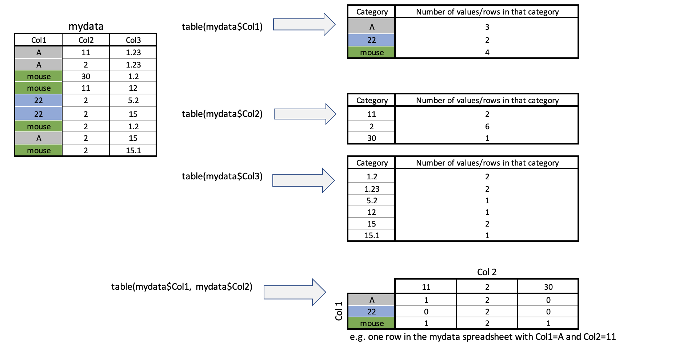

<style>
p.comment {
background-color: #DBDBDB;
padding: 10px;
border: 1px solid black;
margin-left: 0px;
border-radius: 5px;
font-style: normal;
}

h1.title {
  font-weight: bold;
  font-family: Arial;  
}

h2.title {
  font-family: Arial;  
}

</style>


<style type="text/css">
#TOC {
  font-size: 12px;
  font-family: Arial;
}
</style>

\
```{r setup, include=FALSE}
knitr::opts_chunk$set(echo = TRUE, warning=FALSE, message = FALSE)
```

```{r,include=FALSE,echo=FALSE}
# invisible data read
library(tidyverse)
library(sp)
library(sf)
library(readxl)
library(skimr)
library(tmap)
library(USAboundaries)
library(viridis)

frost <- readxl::read_excel("pg_364Data_1frostday.xlsx")
```

## Tutorial 7: Table Wrangling

This tutorial is all about manipulating spreadsheets/data.frames/tables.


 - [**Tutorial 7A: Selecting a specific column**](#Tut7a_SelColumn)
 - [**Tutorial 7B: table command: counts per group**](#Tut7b_table)
 - [**Tutorial 7C: group_by command: statistics per group**](#Tut7c_groupby)

 
## Tutorial 7A: Selecting a specific column {#Tut7a_SelColumn}

Here I am using the frost data from lab 2 as an example.

Sometimes we want to deal with only one specific column in our spreadsheet/dataframe, for example applying the mean/standard deviation/inter-quartile range command to say just the distance_to_the_coast.

To do this, we use the $ symbol. For example, here I'm simply selecting the data in the elevation column only and saving it to a new variable called elevationdata.

```{r, eval=FALSE}
elevationdata <- frost$Elevation
```

Try it yourself.  You should have seen that as you typed the $, it gave you all the available column names to choose from.

<br>

This means we can now easily summarise specific columns. For example: 

 - `summary(frost)` will create a summary of the whole spreadsheet, 
 - `summary(frost$Longitude)` will only summarise the Longitude column.  
 - `mean(frost$Dist_to_Coast)` will take the mean of the Dist_to_Coast column in the frost dataframe.  
 
<br>

<div style="margin-bottom:25px;">
</div>   
## Tutorial 7B: table command: counts per group {#Tut7b_table}

Sometimes we want to count the occurrences of some category in our dataset.  For example, if you look at the frost dataset from Lab 2, it might be interesting to know how many stations were in each US State.  

To do this, we use the table command: 

```{r, Tut7Fig1, echo=FALSE, fig.align='center',out.width="80%"}

```
So for example, to find the number of stations at each elevation, I would type:

```{r, eval=FALSE}
table(frost$Elevation)
```

or to see the number at each elevation in each State, I would type

```{r, eval=FALSE}
table(frost$Elevation, frost$State)
```

For more, this tutorial is excellent: https://www.cyclismo.org/tutorial/R/tables.html.

<br>

<div style="margin-bottom:25px;">
</div>   
## Tutorial 7C: group_by command: statistics per group {#Tut7c_groupby}

What if we want to do more than just count the number of rows?  

Well, we can use the `group_by()` and `summarise()` commands and save our answers to a new variable.  

Here we are making use of the pipe symbol, %>%,  which takes the answer from group_by and sends it directly to the summarise command.


```{r}
frost.summary.type <- group_by(frost, by=Type_Fake) %>%
                          summarise(mean(Latitude),
                                    max(Latitude),
                                    min(Dist_to_Coast))
frost.summary.type
```

Here, my code is:

 - Splitting up the frost data by the Type_Fake column<br>(e.g. one group for City, one for Airport and one for Agricultural Research) 
 - For the data rows in *each group*, calculating the mean latitude, the maximum latitude and the minimum distance to the coast 
 - Saving the result to a new variable called frost.summary.type.
 - Printing the results on the screen e.g. the furthest North/maximum latitude of rows tagged Agricultural_Research_Station is 36.32 degrees.
 


<br>
<br>


***

Website created and maintained by [Helen Greatrex](https://www.geog.psu.edu/directory/helen-greatrex). Website template by [Noli Brazil](https://nbrazil.faculty.ucdavis.edu/)