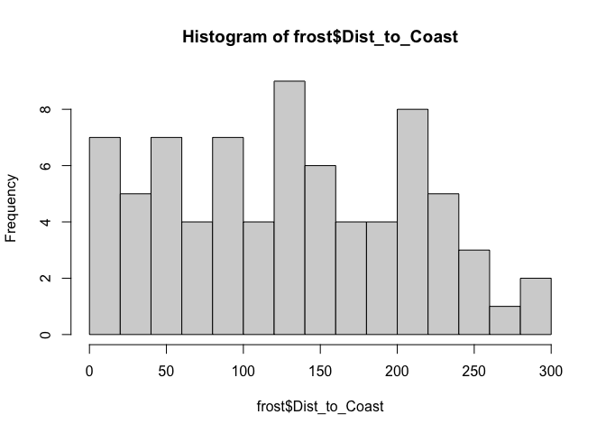
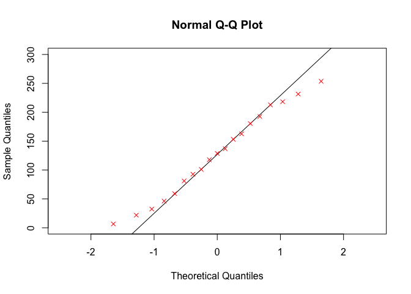
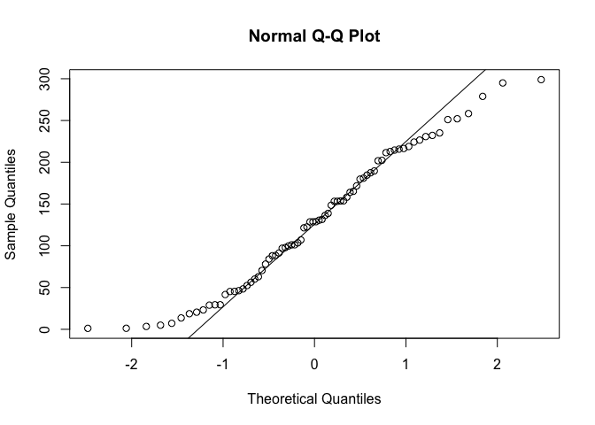

<style>
p.comment {
background-color: #DBDBDB;
padding: 10px;
border: 1px solid black;
margin-left: 0px;
border-radius: 5px;
font-style: normal;
}

h1.title {
  font-weight: bold;
  font-family: Arial;  
}

h2.title {
  font-family: Arial;  
}

</style>


<style type="text/css">
#TOC {
  font-size: 12px;
  font-family: Arial;
}
</style>

\


## Tutorial 9: Inferential statistics

This tutorial is all about the types of statistics you learned about in STAT-200, or your pre-req. These courses might be useful in knowing when to apply them.

 - https://www.khanacademy.org/math/ap-statistics
 - http://sherrytowers.com/2013/08/29/aml-610-fall-2013-module-ii-review-of-probability-distributions/#more-772
 - https://mgimond.github.io/Stats-in-R/index.html

Specifically we will cover

 - [**Tutorial 9A: Testing normality**](#Tut9a_normal)
      a. [QQ-Norm plots](#Tut9Aa_qqnorm)

## Tutorial 9A: Testing normality{#Tut9a_normal}

For many applications, we also want to assess whether our data has a specific distribution or not (for example, normal, exponential..).  We can do this by eye using a QQ-Norm plot. Or we can do it using a statistical hypothesis test (future lab)

### QQ-Norm plots{#Tut9Aa_qqnorm}

A Quantile-Quantile plot allows us to instantly see how close our histogram is to that of a normal distribution. We will use the frost data from Lab 2 to see whether the "Distance from Coast" Column is normally distributed.  

There is a shortcut, but it can be useful to see how one is made manually.

#### To make a QQ-plot manually

##### 1. Take the percentiles of our data:

In a QQ-plot, we first take the percentile values of our data, for example for our elevation data:


```r
frost.dist.percentiles
```

```
##    Percentile Dist_to_Coast
## 1        0.05       6.61825
## 2        0.10      21.86750
## 3        0.15      32.45525
## 4        0.20      46.26800
## 5        0.25      59.18575
## 6        0.30      81.10350
## 7        0.35      92.74875
## 8        0.40     101.13200
## 9        0.45     117.87650
## 10       0.50     128.78350
## 11       0.55     136.90300
## 12       0.60     153.27400
## 13       0.65     162.53550
## 14       0.70     180.37950
## 15       0.75     192.63900
## 16       0.80     212.84100
## 17       0.85     218.25775
## 18       0.90     231.46100
## 19       0.95     253.62175
## 20       1.00     298.91400
```

So here:

 - The median is 128.78 miles e.g. 50% of the stations are at least 128.78 miles from the ocean.  
 - The 90th percentile is 231.46 miles e.g. only 10% of this dataset are further than 231.46 miles from the ocean.
 
This fits with what we know from the histogram


```r
hist(frost$Dist_to_Coast,br=20)
```

<!-- -->


##### 2. Take the percentiles of the distribution we want to test against

Now let's do exactly the same thing, but take the percentiles from the distribution we think fits the data, say a normal distribution with mean = mean(frost$Elevation) and standard_deviation = sd(frost$Elevation).


```r
frost.dist.percentiles
```

```
##    Percentile Dist_to_Coast     Normal
## 1        0.05       6.61825 -1.6448536
## 2        0.10      21.86750 -1.2815516
## 3        0.15      32.45525 -1.0364334
## 4        0.20      46.26800 -0.8416212
## 5        0.25      59.18575 -0.6744898
## 6        0.30      81.10350 -0.5244005
## 7        0.35      92.74875 -0.3853205
## 8        0.40     101.13200 -0.2533471
## 9        0.45     117.87650 -0.1256613
## 10       0.50     128.78350  0.0000000
## 11       0.55     136.90300  0.1256613
## 12       0.60     153.27400  0.2533471
## 13       0.65     162.53550  0.3853205
## 14       0.70     180.37950  0.5244005
## 15       0.75     192.63900  0.6744898
## 16       0.80     212.84100  0.8416212
## 17       0.85     218.25775  1.0364334
## 18       0.90     231.46100  1.2815516
## 19       0.95     253.62175  1.6448536
## 20       1.00     298.91400        Inf
```


##### 3. Plot and interpret

Here are our points in red. If our distribution agreed perfectly with the Normal distribution,  then you would expect the red dots to fall on the 1:1 line.  

<!-- -->

Here are how some theoretical distributions look. From this, I would say our data is the opposite of too peaked in the middle (e.g. too much data towards the tails). This also makes sense from the histogram.


<div class="figure" style="text-align: center">

<p class="caption">Figure from Sherry Towers, http://sherrytowers.com/2013/08/29</p>
</div>

#### Fast QQ-plots 

You can make QQNorm plots yourselves in two line of code to compare your data against a normal distribution.  For example to reproduce the plot above for the distance to ocean column (but using all the data):


```r
qqnorm(frost$Dist_to_Coast)
qqline(frost$Dist_to_Coast)
```

<!-- -->

<br>
<br>


***

Website created and maintained by [Helen Greatrex](https://www.geog.psu.edu/directory/helen-greatrex). Website template by [Noli Brazil](https://nbrazil.faculty.ucdavis.edu/)
<br>
